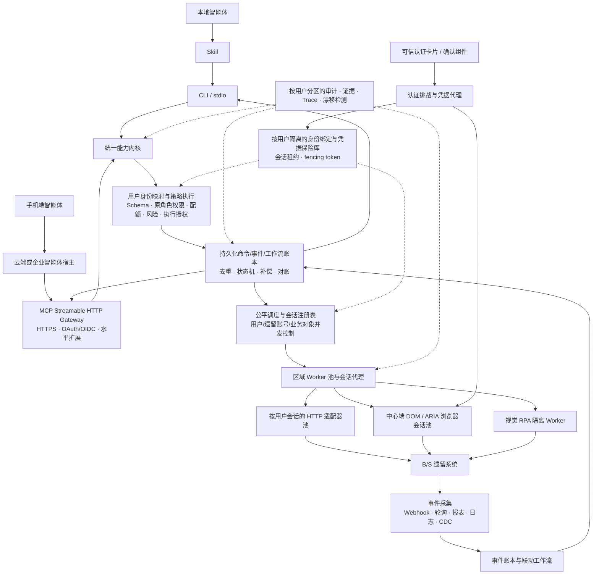
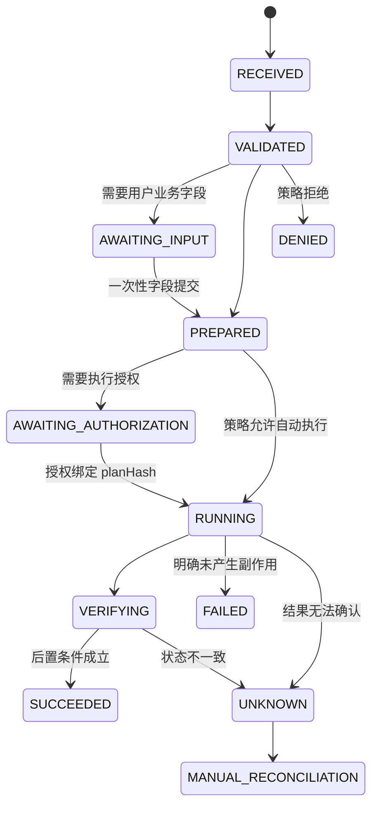

# 面向智能体的 B/S 遗留系统非侵入式适配设计方案

> 文档状态：Draft v0.10
> 更新日期：2026-07-13
> 适用范围：只面向智能体的系统适配；必须支持不同用户以各自在遗留系统中的身份并发使用，并支持通过手机端智能体安全使用；不建设面向人的新业务操作界面，不要求对外提供通用业务 API

> **文档定位：目标架构与后续参考，不是首期实现清单。** 快速可行性验证按 [PoC 验证方案](./poc-validation-plan.md) 实施；暂缓事项统一记录在 [后续增强事项](./deferred-considerations.md)。

## 0. 当前实现基线（2026-07-13）

已完成第一个中心端纵切，但尚未达到本设计的完整阶段 1：

- 新增版本化 `CapabilitySpec`/目录、统一 `CapabilityEngine`、SQLite `OperationStore` 和按用户隔离的 `SessionRegistry`；
- 新增中心 `CentralBrowserWorker`，使用 Playwright 持久化 Profile、目标 origin 白名单和单 Profile 进程租约；
- 新增中心 `SessionStateStore`；OA 的进程级 Session Cookie 使用 Windows DPAPI 加密落盘，Cookie 不进入 CLI、SQLite 账本、普通日志或模型上下文，新 Worker 启动后在内存中恢复；非 Windows 部署必须接入等价 Vault/KMS 保护器后才能启用；
- 新增 SQLite `AuthChallengeStore`、可信认证卡片 HTTP/TLS 服务和 `CredentialBroker`；挑战绑定用户、系统、会话、预期下游身份、Origin、页面契约指纹、nonce、TTL 和一次性状态，CSRF Token 只存哈希，账号密码仅在 Broker 调用期间驻留内存；
- 新增 Seeyon 表单登录 Adapter；中心 Worker 动态等待登录 iframe，填写已登记的 `login_username/login_password1`，调用页面原生 `loginButtonOnClickHandler()`，登录后通过模板接口与页面标题核验实际身份；验证码等未登记认证方式按稳定错误码安全停止；
- 新增不依赖客户端扩展的中心只读能力包：`oa.template.list`、`oa.workflow.pending.list`、`oa.workflow.done.list`、`oa.workflow.tracked.list`、`oa.workflow.detail.get`、`oa.workflow.opinions.list`。模板和事项列表优先复用同一 BrowserContext 的 HTTP 会话；待办/已办/跟踪列表从当前用户首页动态发现栏目契约后调用后台接口，详情和意见则在同一中心浏览器中渲染并合并同源 iframe；对智能体只返回业务字段和不透明 `affair_id`，不暴露内部 URL、原始 HTML、Cookie、动作端点或写提示；
- 新增 `CentralCapabilityService`，CLI 与远程协议共用能力目录、会话恢复、单用户串行租约、Seeyon Adapter、错误语义、幂等键和 SQLite 操作账本，避免协议入口各自复制业务编排；
- 新增中心写授权账本与独立可信操作卡片；授权绑定 `userSubject + systemId + sessionId + capability/version + prepareOperationId + planHash + TTL`，计划不可变、同目标新计划会废止旧授权，批准后只能在适配器提交边界消费一次；
- 新增通用 `FieldSubmissionStore` 与可信业务字段卡片；字段 Schema、用户、系统、会话、能力版本、TTL 和 CSRF 均由中心端绑定，提交内容一次性冻结，CLI/MCP 和模型只持有不透明 `input_submission_id`；
- 新增 `oa.business_trip.prepare` 和 `oa.business_trip.save_draft`。第一次 `prepare {}` 只生成出差字段卡；用户提交字段后，第二次 `prepare` 才解析并校验 `【HR】出差申请单` 的模板、CAP4 表单和字段契约，并生成独立授权卡。`save_draft` 仅点击“保存待发”，禁止发送控件，并通过待发页面重载、稳定业务 ID 和逐字段回读确认结果；越过点击边界但无法确认时进入 `unknown`，不得自动重试；
- 新增基于官方 Python MCP SDK 的无状态 Streamable HTTP 中心服务，发布 6 个 OA 只读工具、2 个受治理的出差草稿工具、会话状态/认证卡工具和调用者范围内的操作账本工具；工具参数不接受 `userSubject`，调用身份来自服务端令牌绑定；写工具还强制要求 `oa:write:draft` scope；
- 新增短期 MCP 身份令牌存储，服务端只保存令牌摘要、用户绑定、预期 OA 身份、scope、有效期和吊销状态；MCP 服务与可信认证卡服务在同一中心进程运行，并共享同一受限 OS 安全主体和每用户浏览器租约；
- 新增 `capability list/describe/invoke`、`session status/login`、`auth serve/status`、`operation get/list` CLI，未登录时返回持久化的 `requires_user_action/LOGIN_REQUIRED`；模型协议面不提供密码提交命令；
- 旧 Chrome 扩展、localhost Daemon、daemon 版 MCP、代理型 OA 命令和对应运输层测试已在退役一期删除；中心能力是唯一公开运行路径且不会静默回退。旧实现中的纯解析、事项知识、写规则和页面契约继续保留为迁移资产，尚未中心化的能力统一记录在 [旧浏览器桥接退役记录](./docs/legacy-bridge-retirement.md)。

可信认证卡片与 Credential Broker 的单用户 PoC 已完成真实 OA 验证：用户在模型不可见的系统浏览器卡片中填写凭据，Broker 核验下游身份为“辛国茂”并保存完整的 `/seeyon` 会话 Cookie；全新的 headless CLI 进程可从 DPAPI 密文恢复会话并读取 118 个模板。扩展后的中心只读包又真实读取了 3 条待办、9 条已办和 9 条跟踪事项，并从一条已办事项的中心渲染页及同源 iframe 中提取 8 个业务字段和 1 条结构化意见；所有结果均为 `browser_bridge_used=false`，列表使用 `central_http_session`，详情和意见使用 `central_browser_session`，并生成独立持久化 `operationId`。登录过期会明确返回 `LOGIN_REQUIRED`，不会把登录页误报为业务空数据。Windows DPAPI 的一次开发环境验证还证明：Broker 与能力 Worker 必须运行在同一 Windows 安全主体下；跨用户解密会失败关闭，生产部署应固定服务身份或改用 Vault/KMS。卡片已完成桌面与移动尺寸视觉检查，但尚未通过手机真实网络访问。

最小远程 MCP 已通过独立服务进程与官方 MCP 客户端烟测：Bearer 鉴权后可发现中心工具并读取令牌绑定用户的会话状态；无令牌、吊销令牌和跨用户操作读取会失败关闭，CLI 与 MCP 使用同一幂等键时返回同一 `operationId`。随后又完成单用户真实 OA 闭环：官方 MCP 客户端调用 `oa_session_login` 生成可信认证卡，用户完成真实登录后，客户端调用 `oa_workflow_pending_list` 读取 3 条待办，返回 `central_http_session`、`browserBridgeUsed=false` 和持久化操作记录；一次性身份令牌随后自动吊销，MCP 与认证卡监听端口均关闭。首个中心 W1 草稿能力现已完成“认证卡 → 字段卡 → 授权卡 → 保存待发 → 回读”的单用户真实 OA 验证：7 个业务字段由用户直接提交中心 `FieldSubmission`，CLI/MCP 和模型只持有不透明 ID；第二次 prepare 校验真实 CAP4 表单并冻结计划，独立授权在保存边界消费一次。OA 返回待发草稿和稳定业务 ID，服务端重载后 7 个字段全部匹配，结果明确为 `workflow_submitted=false`、`submitted_count=0` 和 `browser_bridge_used=false`；相同幂等键重放返回原操作与原草稿 ID，未生成第二份草稿。字段卡还通过桌面与 390×844 视口检查，测试中发现的隐藏 radio 横向溢出已修复。这仍不是生产远程接入验收：预签发 Bearer 令牌只用于 PoC 引导，真实 OAuth/OIDC、两个 Worker OS 安全主体的多用户隔离、生产证书与反向代理信任、限流、设备绑定、真实手机网络和更多中心写动作尚未完成；旧桥接公开运行时已完成退役一期。由于暂时没有第二个真实 OA 用户，本轮不把代码级绑定和合成身份测试表述为多用户隔离验收。

## 1. 摘要

本方案面向无源码、长期无人维护或不适合实施源码改造的 B/S 遗留系统。目标是在不修改遗留应用源码、二进制和数据库结构的前提下，使多个用户能够通过本地或手机端智能体，以各自在遗留系统中的账号、角色和权限并发发现、调用和组合系统能力，并在多个遗留系统之间实现身份可追溯、会话相互隔离、过程可审计、失败可恢复的智能联动。

本文中的“多用户”首先指 **多种真实用户身份**：用户 A、B、C 分别映射到遗留系统中的 A、B、C 或经批准的等价身份，而不是多个智能体共同使用一个机器人账号。多租户不是本项目的前提；单组织部署可以使用固定内部租户命名空间。

推荐在遗留系统外部建设 **AgentBridge 智能体能力桥接层**。AgentBridge 不向智能体暴露任意点击、任意 JavaScript、任意 HTTP 请求或数据库写入，而是将人类页面操作封装成类型化的业务能力，例如 `oa.approval.query`、`oa.approval.prepare` 和 `oa.approval.commit`。

本方案采用以下核心决策：

1. **统一能力内核，多种智能体协议。** CLI/stdio 是本地主机协议面；MCP Streamable HTTP 是多用户、远程和手机端智能体的生产协议面。二者共享同一个 `CapabilitySpec` 和执行内核。
2. **多用户身份是基础能力。** AgentBridge 为每个最终用户维护目标系统身份绑定和独立会话；每个遗留账号和浏览器会话在任一时刻只能有一个有效所有者，但不同用户的独立账号与会话可以并发运行。共享机器人账号不能作为默认实现。
3. **手机只承载智能体交互，不承载遗留会话。** 手机端或其云端/企业智能体宿主通过远程 MCP Gateway 调用 AgentBridge；Cookie、浏览器、DevTools 和内网地址始终留在受控 Worker 区域。
4. **生产部署采用中心端执行，最终用户设备零连接器。** HTTP 会话、浏览器 Worker、Profile、凭据代理、适配器和操作账本都部署在能够访问遗留系统的中心或区域节点；员工电脑和手机不安装 Chrome 扩展、本地 Daemon 或系统连接器。原型客户端扩展运行时已经删除，接口发现也必须进入受控中心工具，不得重新接入员工浏览器。
5. **遗留登录优先使用可信认证卡片。** 登录过期时，服务端生成绑定用户、系统和会话的一次性 `AuthChallenge`，由可信智能体宿主渲染认证卡片。账号、密码和验证码通过独立秘密通道直达凭据代理，再由中心浏览器填写真实登录页；模型、MCP 参数、聊天记录和普通日志均不可见。远程浏览器接管只作为滑块、特殊控件、USB Key 等卡片无法处理的兜底。
6. **用户业务输入优先使用可信字段卡片。** 当写操作需要用户提供日期、事由、金额、附件或其他业务字段时，智能体先取得一次性 `FieldSubmission`，由可信宿主按服务端白名单 Schema 渲染字段卡。模型只获得不透明标识；字段提交完成后，Adapter 才校验遗留页面并冻结计划，授权卡始终与字段卡分离。
7. **OpenAPI 不作为北向必选接口。** 如果遗留系统已有正式 HTTP API，可以在 AgentBridge 内部使用 OpenAPI 客户端；不为形式完整而额外发布 OpenAPI。
8. **Skill 是业务语义和使用知识层。** Skill 描述何时调用能力、如何组合流程和如何处理异常，但用户身份映射、可选组织隔离、权限、执行授权和安全控制必须由 AgentBridge 运行时强制执行。
9. **智能体负责意图理解，确定性适配器负责执行。** 通用浏览器智能体用于能力发现和异常接管；生产操作固化为经过测试的状态机。
10. **所有写操作都必须可治理。** 高风险操作采用 `collect → prepare → authorize → commit → verify`（无需用户补充字段时省略 `collect`），并具备命令账本、请求去重、证据和对账机制。文中的 `authorize` 指对智能体执行动作的授权，与遗留系统中的“业务审批决定”严格区分。

## 2. 背景与目标

### 2.1 背景

大量既有 B/S 系统围绕人的视觉界面和操作习惯设计，通常存在以下问题：

- 没有正式 API，或者 API 能力不完整；
- 已无源码，缺少原维护团队，无法安全实施应用内改造；
- 登录、Cookie、CSRF Token、验证码和业务状态与浏览器会话强绑定；
- 页面中存在 iframe、异步表格、弹窗、文件上传下载、自绘控件等复杂交互；
- 系统之间主要依赖人工抄录、下载上传和状态核对；
- 传统 RPA 脚本缺少面向智能体的能力描述、权限隔离和调用契约。

### 2.2 目标

AgentBridge 应实现：

- 将遗留页面能力封装为智能体可发现、可理解、可调用的业务能力；
- 支持本地 CLI/stdio 与远程 MCP Streamable HTTP，两者保持能力和错误语义一致；
- 支持多个用户以各自遗留账号和角色同时使用，并在身份映射、授权、会话、队列、账本和证据上实现隔离；
- 支持手机端智能体在弱网、切网和暂时离线后继续查询同一 `operationId`，不要求保持长连接；
- 支持最终用户设备零连接器部署，普通用户只通过智能体宿主和可信认证卡片与 AgentBridge 交互；
- 在不修改目标源码的条件下复用浏览器页面、现有 HTTP 接口、文件交换或只读数据源；
- 隔离智能体与账号密码、Cookie、任意浏览器控制能力；
- 对写操作提供执行授权、请求去重、后置核验、审计和人工接管；
- 通过事件账本和确定性工作流实现跨系统联动；
- 发现页面或接口变化时安全熔断，而不是猜测性继续执行。

### 2.3 非目标

本方案不承诺：

- 为遗留系统建设新的面向人业务操作界面；可信认证卡片、执行授权卡片和必要的受控登录接管界面不属于业务界面；
- 将所有遗留页面自动转化为稳定 API；
- 允许智能体自由探索生产系统或执行任意浏览器动作；
- 绕过 MFA、验证码、USB Key、电子签章或业务审批；
- 通过外部包装实现遗留系统本身不具备的事务和 exactly-once 保证；
- 通过共享技术账号实现真正的下游逐用户授权和不可抵赖审计。
- 让手机直接连接遗留系统内网、保存遗留 Cookie 或控制浏览器调试端口。

“无侵入”在本方案中指不修改遗留应用源码、二进制和数据库结构，并不等于零环境变化。实际部署可能需要中心浏览器工作节点、服务账号、凭据代理与保险库、日志存储和网络访问策略。启用自动化前仍须取得系统所有者对自动化方式、账号、容量、许可协议、日志/CDC 配置和紧急停用方案的批准；任何适配路径都不得绕过既有业务控制。

## 3. 总体架构



### 3.1 组件职责

| 组件 | 核心职责 | 不负责 |
|---|---|---|
| Skill | 业务知识、能力选择、流程组合和异常处理指导 | 身份认证、权限、执行授权和底层页面操作 |
| CLI/stdio 本地协议层 | 本地能力发现、Schema 获取、结构化调用和调试 | 远程移动接入、业务状态机和浏览器脚本 |
| MCP Streamable HTTP Gateway | 远程工具发现、调用者认证、用户身份传递、配额和异步操作查询 | 持有遗留 Cookie、业务状态机和页面脚本 |
| CapabilitySpec 目录 | 定义能力契约、风险、版本和执行映射 | 保存运行中流程状态 |
| 能力内核 | 参数校验、身份上下文绑定、策略调用、命令编排和统一结果语义 | 直接持有浏览器 Cookie |
| 身份映射、策略与执行授权服务 | 将最终用户映射到目标系统账号/角色，执行权限、职责分离、执行授权和 fail-closed 决策 | 让模型自行选择或冒用遗留账号 |
| 可信认证卡片与凭据代理 | 生成认证挑战、收集一次性登录信息、向中心浏览器安全注入并核验登录身份 | 将密码、验证码或授权材料暴露给模型或 MCP |
| 调度器与会话注册表 | 公平排队、配额、会话定位、账号租约和对象并发控制 | 执行具体页面动作 |
| AgentBridge Daemon/Worker | 受控主机 IPC、区域会话代理、中心浏览器生命周期和适配器执行 | 在企业模式中充当全局账本权威 |
| Worker/适配器 | 执行 HTTP、中心浏览器或视觉状态机并核验结果 | 自行扩大权限或改变风险策略 |
| 命令/事件/工作流账本 | 按用户及可选组织命名空间分区地去重、恢复、重放、对账和审计关联 | 充当遗留系统的权威业务数据源 |

### 3.2 协议拓扑与信任边界

只支持以下三种明确拓扑：

1. **一次性 CLI**：本地智能体宿主以参数数组启动受信任的 `agentbridge` 二进制，CLI 通过受 ACL 保护的 Named Pipe/Unix Socket 调用本机 Daemon。
2. **stdio Server**：智能体宿主直接启动 `agentbridge serve --transport stdio`。该进程就是前台 Daemon，直接拥有账本、会话代理和 Worker 生命周期，不再连接另一个 Daemon。
3. **远程 MCP**：多用户、跨主机或手机端场景通过 Streamable HTTP MCP Gateway 接入。Gateway 可水平扩展，业务操作状态保存在共享账本；调度器将操作路由到目标网络区域内持有相应用户会话的 Worker。不定义语义模糊的“远程 CLI Gateway”。

生产部署默认采用远程 MCP 或部署在受控智能体宿主中的 CLI/stdio。普通最终用户设备不运行系统连接器、浏览器桥接扩展或 AgentBridge Daemon；即使用户从桌面发起调用，也通过中心端身份、会话和 Worker 完成。CLI 本地拓扑主要用于开发、运维、受控桌面智能体或无法远程部署的特殊环境，不是要求每位员工安装组件。

本地模式下，同一个状态目录只允许一个活动 Daemon，通过进程锁和实例 fencing epoch 防止后台 Daemon与 stdio 前台 Daemon 同时成为权威状态源。企业模式下，Gateway、调度器和 Worker 可以多实例部署，但同一浏览器会话在同一 `leaseEpoch` 只能有一个有效 Worker 所有者。三种拓扑的调用者身份来源分别是：一次性 CLI 使用 OS 主体和本地 IPC ACL；stdio 使用宿主启动上下文、受限进程句柄和短期会话凭证；远程 MCP 使用受众受限的 OAuth/OIDC 或 mTLS 主体。上述身份均由运行时建立，不能由能力参数覆盖。

调用者身份必须来自受信任通信通道、操作系统主体或短期委托凭证，不能相信请求 JSON 中自报的 `userId`、`agentId` 或 `skillName`。本地 IPC 应设置进程和用户 ACL；远程 MCP 应使用独立的资源受众、短期凭证、用户隔离、限流和防重放，启用多组织部署时再增加租户边界。AgentBridge 二进制、Skill 和适配器包应经过签名、版本锁定和供应链校验。

本项目不建设新的面向人业务界面，但写操作仍可能依赖既有智能体宿主的确认界面或企业审批服务。模型本身不能生成、代替或确认执行授权。

### 3.3 控制面与数据面

架构分为两部分：

- **控制面**：能力目录、Schema、适配器版本、用户到遗留身份的映射、用户策略、执行授权规则、凭据、容量、发布、灰度、熔断和审计查询。
- **数据面**：CLI/MCP 请求处理、身份上下文绑定、公平排队、会话租约、适配器执行、证据采集、事件写入和结果返回。

控制面和数据面都位于模型之外。提示词可以帮助模型正确使用能力，但不能代替运行时权限检查。

### 3.4 核心术语

| 术语 | 含义 |
|---|---|
| 业务决定 `businessDecision` | 对遗留业务对象的处理选择，例如同意或驳回一张审批单 |
| 执行授权 `executionAuthorization` | 是否允许智能体按某个确定计划产生副作用，不等同于业务决定 |
| `tenantId` | 可选组织隔离命名空间；单组织部署使用服务端固定内部值，不允许由能力参数自报 |
| `userSubject` | 必需的最终用户身份，来自可信身份令牌或本地 OS 映射，是选择遗留身份绑定的主要依据 |
| `agentId` / `deviceId` | 审计中的智能体和设备标识；不能替代最终用户身份，也不能单独授予业务权限 |
| `downstreamPrincipalRef` | 当前用户在某个遗留系统中的账号/角色绑定引用，不含密码且不能由模型选择 |
| `requestId` | 一次协议请求的关联 ID，可由调用方生成 |
| `operationId` | AgentBridge 持久化操作实例 ID，由服务端生成并全局唯一 |
| `subjectVersion` | `prepare` 时目标业务对象的版本或状态指纹，用于提交前防止并发覆盖 |
| `planHash` | 规范化参数、目标对象、版本、策略义务和预期副作用的摘要 |
| `idempotencyKey` | 调用主体在约定作用域内提供的请求去重键 |
| `unknown` | 可能已产生副作用但无法权威确认的终态，必须进入对账或人工处理 |
| 页面契约 | 对 URL、业务主键、语义控件、前后状态和漂移指纹的适配器约束 |

## 4. 统一业务能力模型

协议、Skill 和底层适配器都应建立在统一的 `CapabilitySpec` 上，避免 CLI、MCP 和浏览器脚本分别维护一套业务逻辑。

示例：

```yaml
name: oa.approval.commit
version: 1.0.0
description: 提交指定审批事项的处理决定
inputSchema:
  type: object
  required: [operationId, approvalId, businessDecision, subjectVersion, planHash, idempotencyKey]
  properties:
    operationId: { type: string }
    approvalId: { type: string }
    businessDecision: { type: string, enum: [approve, reject] }
    comment: { type: string, maxLength: 1000 }
    subjectVersion: { type: string }
    planHash: { type: string }
    idempotencyKey: { type: string }
outputSchema:
  type: object
  required: [approvalId, finalState, receiptId]
effect: state_transition
riskLevel: W2
requiredScopes: [oa.approval.write]
businessOperationIdempotent: false
requestDeduplication: required
executionAuthorization:
  mode: external_confirmation
  binding: operation_id
isolation:
  userSubjectRequired: true
  tenantMode: optional_single_default
  operationVisibility: owner_or_auditor
sessionPolicy:
  scope: organization_user_system_downstream_principal
  writeConcurrency: exclusive
principalPolicy:
  mode: per_user_required
  sharedFallback: forbidden
concurrencyPolicy:
  objectVersionCheck: required
  maxInFlightPerUser: 2
quotaPolicy:
  userBucket: oa-user
  organizationBucket: optional
  systemBucket: oa-prod
resultDelivery:
  asynchronous: true
  reconnectable: true
preconditions:
  - current user is an eligible handler
  - approval state equals pending
  - approval version equals subjectVersion
postconditions:
  - approval state no longer equals pending
evidencePolicy:
  - final page state
  - operation receipt
  - sanitized network response hash
execution:
  adapter: oa-browser
  workflow: approval-commit-v1
```

每项能力至少包含：

- 名称、语义版本、描述和所属业务域；
- 输入与输出 JSON Schema；
- 读写类型和风险等级；
- 所需权限和目标数据范围；
- 前置条件和后置条件；
- 幂等性、超时、重试和对账规则；
- 执行授权策略；
- 适配器和工作流版本；
- 证据、脱敏和数据保留规则。

`userSubject`、调用客户端、设备、下游账号引用、可选 `tenantId` 和策略上下文属于受信任运行时上下文，不是模型可填写的 `inputSchema` 字段。所有 `operations get/watch/cancel`、证据读取和执行授权提交都必须重新校验用户、可选组织命名空间、操作所有者及角色权限。

`planHash` 和执行授权至少绑定：`userSubject`、调用客户端、能力版本、目标系统、`downstreamPrincipalRef`、业务对象及其 `subjectVersion`、策略版本、nonce、过期时间和可选 `tenantId`，防止计划或授权被其他用户、设备或组织复用。

`businessOperationIdempotent` 描述遗留业务动作本身是否幂等；`requestDeduplication` 描述 AgentBridge 是否将同一 `idempotencyKey` 绑定到唯一 `operationId`。即使底层动作不幂等，也必须通过请求去重避免 AgentBridge 重复发起。去重记录必须在第一次南向派发前持久化；重复键返回同一 `operationId` 的当前状态或已保存结果。同一键携带不同参数时必须返回冲突，不得覆盖原操作。幂等键的作用域是“内部组织命名空间 + `userSubject` + 调用主体 + 能力版本”，保留期不得短于该能力最长对账窗口与死信重放窗口。

`prepare` 默认不得产生业务副作用。如果老系统存在“打开即领取”“预览即锁定”等行为，必须在 CapabilitySpec 中声明为副作用，并按相应写入等级治理。

北向禁止发布 `click(selector)`、`execute_javascript(code)`、`request(url, body)`、`set_cookie(...)` 等通用原子能力。这些能力只能存在于受控适配器内部。

## 5. CLI/stdio 协议设计

### 5.1 定位

CLI 是 AgentBridge 面向本地主机智能体的正式协议面，同时也是调试、测试和运维入口。它不是输出自由文本的传统人机 CLI，而是一个版本化的进程间协议。共享主机上多个用户使用 CLI 时，必须通过不同 OS 主体和 IPC ACL 隔离；无法使用独立 OS 主体时，调用方必须提供由可信身份服务签发的短期用户委托凭证。

本文中的“一次性 CLI”指启动一次可执行文件并通过参数/stdin 完成单次请求；“stdio”指宿主启动长驻 Server 后使用标准输入输出持续交换 JSON-RPC 消息。两者共享同一能力契约和状态语义，但生命周期、并发和 framing 不同。`CLI/stdio` 只是对这两个本地协议形态的合称。

建议提供以下命令族：

```text
agentbridge protocol info
agentbridge capabilities list
agentbridge capabilities describe <name>
agentbridge invoke <name>
agentbridge operations get <operation-id>
agentbridge operations watch <operation-id>
agentbridge operations cancel <operation-id>
agentbridge authorizations submit <operation-id>
agentbridge authorizations revoke <operation-id>
agentbridge sessions status
agentbridge sessions login
agentbridge sessions release
agentbridge events watch
agentbridge serve --transport stdio
```

典型调用：

```powershell
agentbridge capabilities describe oa.approval.commit --format json
agentbridge invoke oa.approval.query --input request.json --format json
agentbridge invoke oa.approval.prepare --input request.json --format json
agentbridge invoke oa.approval.commit --input commit.json --format json
```

敏感数据和复杂参数应通过 stdin 或受控文件传入，不应直接出现在命令行参数中。

`authorizations submit/revoke` 只允许受信任宿主确认组件或外部审批服务身份调用，普通智能体调用主体无权使用。确认组件提交签名断言后，AgentBridge 将一次性授权凭证保存在命令账本中并绑定 `operationId`；凭证不返回模型，也不要求智能体在 `commit` 参数中传递。

### 5.2 标准响应信封

```json
{
  "protocolVersion": "1.0",
  "requestId": "req-20260710-001",
  "operationId": "op-8f23",
  "status": "requires_authorization",
  "result": {
    "planSummary": "对审批事项 12345 提交业务决定"
  },
  "error": null,
  "evidenceRefs": [],
  "nextAction": {
    "type": "execution_authorization",
    "challenge": {
      "planHash": "sha256:...",
      "subjectVersion": "v17",
      "policyVersion": "policy-2026-07",
      "nonce": "...",
      "expiresAt": "2026-07-10T09:00:00Z"
    }
  }
}
```

上例展示的是需要执行授权时的 `nextAction` 结构；操作成功时它为 `null`。面向人的影响摘要由可信宿主或企业审批服务根据 challenge 和脱敏计划生成，模型提供的自然语言说明不能作为授权依据。

`status` 至少支持：

- `succeeded`：已完成并通过后置核验；
- `pending`：已接受，需通过 `operations get/watch` 查询；
- `requires_authorization`：已生成操作计划，等待外部执行授权；
- `requires_user_action`：需要登录、MFA、验证码或其他人工处理；
- `denied`：策略拒绝；
- `failed`：明确失败，且确认未产生目标副作用；
- `unknown`：可能已产生副作用但无法确认，必须对账；
- `cancelled`：在允许取消的阶段终止。

错误对象至少包含：

```json
{
  "code": "PLAN_STALE",
  "category": "conflict",
  "message": "目标对象在执行授权后发生变化",
  "retryable": false,
  "details": {}
}
```

稳定退出码建议为：`0` 成功或已受理、`2` 输入/Schema 错误、`3` 身份或策略拒绝、`4` 等待执行授权或人工操作、`5` 明确失败、`6` 结果未知、`7` 协议或兼容性错误。业务细节以 JSON `status/error.code` 为准，不通过解析 stderr 判断。

多用户和移动场景还应提供稳定错误码：`RATE_LIMITED`、`CAPACITY_EXCEEDED`、`SESSION_CAPACITY_EXCEEDED`、`SESSION_BUSY`、`USER_CONTEXT_MISMATCH`、`OPERATION_NOT_VISIBLE`、`DEVICE_REAUTH_REQUIRED`、`DEVICE_REVOKED`、`AUTHORIZATION_EXPIRED` 和 `OFFLINE_COMMIT_FORBIDDEN`。容量不足时只能将已持久化操作置为有界 `pending` 并返回 `retryAfter`，或在入账前明确拒绝；不能无上限创建浏览器或无限积压任务。

### 5.3 协议约束

- stdout 只输出 JSON 或约定的 NDJSON 事件流；诊断信息写入 stderr；
- 命令、字段、错误码和退出码必须版本化并保持兼容；
- 智能体应使用参数数组启动进程，禁止通过 Shell 拼接命令；
- 提供能力发现和 Schema 查询，不要求 Skill 重复维护完整参数定义；
- 所有请求携带 `requestId`，写操作携带 `idempotencyKey`；
- 长任务返回 `operationId`，支持查询、观察和有限取消；
- 协议层不返回 Cookie、密码、CSRF Token 或原始授权头；
- 高风险策略组件异常时必须 fail-closed。

一次性 CLI 每次只产生一个最终响应；长任务可返回 `pending`。stdio Server 使用 JSON-RPC 2.0，每条消息为单行 UTF-8 JSON，通过请求 ID 支持多路复用，通过有界队列实施背压。实现必须定义最大消息尺寸、并发上限、超时和 EOF 行为；进度作为通知发送，取消只保证终止尚未提交或底层明确支持取消的步骤。

一个 stdio 会话建立后，`userSubject` 和可选组织命名空间固定，禁止通过后续请求切换用户。`operationId` 虽全局唯一，但所有读取和控制操作仍必须按用户、可选组织命名空间及审计角色过滤。

### 5.4 守护进程模式

需要保持登录态或执行长流程时，采用 AgentBridge Daemon：

```text
智能体 → CLI/stdio → AgentBridge Daemon → 浏览器会话 → 遗留系统
```

Daemon 持有浏览器、会话租约、命令账本和适配器状态。一次性 CLI 进程只负责协议收发，避免每条命令重新登录或多个进程争抢同一账号。命令账本必须持久化并能在 Daemon 重启后恢复；浏览器进程和登录态不保证可恢复，恢复失败时操作进入 `requires_user_action` 或 `unknown`，不能重新执行已经可能提交的步骤。

## 6. MCP 远程协议设计

当系统需要多用户远程接入或手机端智能体使用时，MCP Streamable HTTP 是生产必选协议面；只有完全本地、单主机的试点才可以暂不部署 MCP。手机通常不直接运行遗留系统连接器，而是通过手机端智能体对应的云端或企业智能体宿主调用 MCP Gateway。

MCP Gateway 通过 HTTPS 提供 Streamable HTTP 传输，负责：

- 工具发现、调用和协议版本协商；
- OAuth/OIDC 身份验证、资源受众校验和用户路由；
- 每用户、每设备、每能力及可选组织的配额与限流；
- 将远程调用绑定到可信 `userSubject`、`agentId`、可选 `deviceId` 和可选组织命名空间；
- 返回持久化 `operationId`，支持断线后恢复查询；
- 将执行授权 challenge 交给可信智能体宿主或企业审批服务；
- 隐藏遗留系统地址、凭据、Cookie、浏览器和 Worker 拓扑。

MCP Streamable HTTP 的传输定义见[MCP Transports](https://modelcontextprotocol.io/specification/2025-11-25/basic/transports)。业务操作不能依赖某条 TCP/HTTP 连接一直存在；长任务应尽快返回 `pending` 与 `operationId`，通知和流式进度只是优化，断线后仍可查询权威账本状态。

MCP Server 应是 `CapabilitySpec` 的薄适配层：

```text
tools/list  → 读取能力目录
tools/call  → 调用统一能力内核
resources  → 暴露只读状态、操作结果或受控证据
```

不能在 MCP Server 中复制浏览器脚本、执行授权逻辑或权限判断。MCP 官方工具规范支持模型发现和调用工具，同时建议保留清晰的用户可见性和人工否决能力；这进一步说明安全控制应由宿主和服务端共同强制执行。[MCP Tools](https://modelcontextprotocol.io/specification/2025-11-25/server/tools)

MCP Gateway 的业务处理尽量无状态，协议会话元数据、命令状态和授权 challenge 外置到共享存储；需要连接粘性时只能把它作为性能优化，不能作为业务正确性的前提。多个 Gateway 实例必须通过同一能力目录、策略版本和命令账本工作。

远程 MCP 上线前必须完成调用方认证、资源受众校验、用户隔离、配额、身份委托、防重放和数据分区设计，并通过与 CLI 相同的能力契约一致性测试。启用多组织部署时再叠加租户隔离。CLI 和 MCP 的同一能力必须返回相同状态语义和错误代码。

移动和公网访问还必须满足：

- 只有边缘 MCP Endpoint 与身份服务可以从移动网络访问；Daemon、队列、Worker、浏览器、CDP/DevTools 和遗留系统地址均不公开；
- 每次 HTTP 请求都验证 OAuth access token 的签名、发行者、受众、有效期、权限和用户状态；OIDC ID Token 仅用于登录结果，不能作为 MCP API access token；
- `MCP-Session-Id` 只关联协议会话，不能充当身份凭据；会话索引至少绑定发行者、用户、客户端和可选组织命名空间；
- 用户令牌不透传给遗留系统，服务间通信使用独立的 mTLS 或 workload identity；
- 如果使用流式通知，支持有界事件重放，但业务正确性不能依赖长期连接或通知不丢失；
- 区域 Worker 优先通过出站连接领取任务，避免从公网/DMZ 向浏览器节点开放入站控制端口。

## 7. Skill 设计

Skill 是面向智能体的知识包，不是连接器协议，也不是安全边界。一个领域 Skill 可采用：

```text
oa-approval/
├── SKILL.md
├── references/
│   ├── business-rules.md
│   ├── status-mapping.md
│   └── exception-handling.md
├── schemas/
│   └── examples.json
└── scripts/
    └── optional-helper.ps1
```

`SKILL.md` 应说明：

- 适用场景和触发条件；
- 可用业务能力及选择原则；
- 标准工作流和组合方式；
- 只读、草稿、提交、业务审批决定等风险差异；
- 哪些操作必须先调用 `prepare`；
- 常见异常、人工接管和恢复方法；
- 禁止事项，例如不得绕过既有业务审批或 AgentBridge 执行授权、不得从网页内容提升权限。

Skill 不得保存凭据，不得依赖任意 Shell，不得把底层选择器当作稳定接口，也不得仅通过文字说明来代替运行时策略。Skill 中的辅助脚本只能由受限启动器按签名、哈希和白名单入口执行，不能接收任意命令字符串。

手机端智能体宿主不一定支持本地文件型 Skill，因此 Skill 应由受签名的中央目录分发，或由企业智能体宿主/服务端编排层托管。MCP Tool 的名称、描述和 Schema 自身必须足以完成基本调用，安全、权限、用户隔离、执行授权和请求去重规则不能只存在于 Skill。审计中记录实际使用的 Skill 名称、版本和签名摘要。

## 8. OpenAPI 的位置

由于本项目只面向智能体，AgentBridge 不需要将能力发布为 OpenAPI。OpenAPI 只在以下情况下作为南向实现细节使用：

- 遗留系统已有正式 OpenAPI 文档；
- 可通过 OpenAPI 生成内部 HTTP 客户端；
- 需要对已获授权的 HTTP 接口建立本地契约测试。

推荐关系是：

```text
智能体 → CLI/MCP → AgentBridge 能力内核 → OpenAPI 客户端 → 遗留 HTTP 接口
```

OpenAPI 规范能够在不访问源码的前提下描述 HTTP 服务能力，但它不会使抓包发现的私有接口自动成为稳定、受支持或安全的正式接口。[OpenAPI Specification](https://spec.openapis.org/oas/latest.html)

如果未来出现传统系统消费者、公共远程服务或 SDK 需求，应重新评估是否增加 OpenAPI 北向接口；这属于范围变化，不是本设计的默认交付。

## 9. 南向适配策略

| 适配路线 | 推荐优先级 | 适用场景 | 主要约束 |
|---|---:|---|---|
| 正式 API、Web Service、导入导出、报表接口 | 1 | 已有正式集成能力 | 能力可能不完整 |
| 经批准的内部 XHR/fetch/表单接口 | 2 | 网络流量结构稳定、调用频率高 | 未公开契约，需处理 Cookie、CSRF、Nonce、风控和版本变化 |
| 中心端 DOM/ARIA 浏览器适配器 | 3 | 常规 HTML 表单、表格、审批页面和表单登录 | UI、会话和并发敏感，吞吐低于 API |
| 视觉 RPA | 4 | Canvas、自绘控件、图片文字或远程桌面式页面 | 确定性最低，应有人值守或限于只读 |
| 数据库只读副本、日志或 CDC | 专项 | 查询和事件发现 | 需专门授权；原则上禁止直接写遗留数据库 |

选择顺序不是绝对的。例如系统有正式 API 时无需先走浏览器；表单登录系统可以先由中心浏览器建立用户会话，再让同一用户的 HTTP 适配器复用受控 Cookie Jar。浏览器是中心端南向执行资源，不是最终用户设备上的部署要求。

客户端 Chrome 扩展不属于目标生产适配路线，原型扩展、localhost Daemon 和轮询桥已经删除。后续接口发现、页面契约采样和迁移验证必须通过受控中心 HTTP Adapter、Browser Worker 或内部 inspector 完成，不得重新依赖员工浏览器。

“经批准的内部接口”必须由系统所有者明确授权，并建立本地契约、版本探测、限流和浏览器路径降级；这不代表厂商承诺支持。接口发现只能在授权环境中进行。

### 9.1 浏览器自动化基线

WebDriver 定义了浏览器进程外的远程控制接口；WebDriver BiDi 增加了双向事件流，但截至本设计日期仍是 Working Draft，因此不能作为唯一硬依赖。[W3C WebDriver](https://www.w3.org/TR/webdriver2/)、[WebDriver BiDi](https://www.w3.org/TR/webdriver-bidi/)

工程实现建议优先使用 Playwright：

- 浏览器进程、Profile、下载和临时文件全部运行在中心或区域 Worker，不接入员工个人浏览器；
- 定位优先级：role/accessible name → label/text → 稳定业务锚点 → CSS → XPath/坐标；
- 利用可见、稳定、可接收事件、已启用等 actionability 检查；
- 使用事件和后置条件等待，禁止用固定 `sleep` 推断业务完成；
- iframe、弹窗、上传下载和多页签必须作为显式工作流状态处理。

Playwright 官方同样建议优先使用面向用户的 role、label 等定位方式，并提供自动等待机制。[Locators](https://playwright.dev/docs/locators)、[Auto-waiting](https://playwright.dev/docs/actionability)

CDP 可用于网络接口发现、DOM/Accessibility 深层观测和 Chromium 特殊能力，但其 tip-of-tree 版本可能随时变化且不保证向后兼容。应固定浏览器版本，并把 CDP 完全封装在内部驱动中。[Chrome DevTools Protocol](https://chromedevtools.github.io/devtools-protocol/)

### 9.2 页面契约

每个浏览器工作流应定义页面契约：

- 允许访问的域名和 URL 模式；
- 页面标题、地标、业务主键和当前登录用户；
- 字段、按钮、表格和弹窗的语义定位；
- 预期网络响应或页面状态；
- 前置条件、成功后置条件和明确失败特征；
- DOM、Accessibility Tree 或响应 Schema 指纹；
- 页面变化后的熔断和人工接管策略。

页面身份、业务主键或关键控件不唯一时，禁止继续写操作。

## 10. 身份、凭据与会话

### 10.1 身份链与委托

身份优先级：

1. 用户委托的短期、限域 Token；
2. 按用户、岗位、组织或业务流程隔离的自动化账号；
3. 最后才考虑共享技术账号，并补充执行授权和外部身份映射。

RFC 8693 的 Token Exchange 和 actor 语义可作为“最终用户—智能体—AgentBridge—连接器账号”身份链的设计参考。[RFC 8693](https://datatracker.ietf.org/doc/rfc8693/)

完整审计身份链至少包括：

```text
organization namespace (optional) → final user → agent host/client → agent/runtime
       → skill name/version → MCP/CLI gateway → worker
       → downstream principal
```

手机端属于不能安全保存客户端密钥的公共客户端时，应使用外部系统浏览器完成 Authorization Code + PKCE `S256` 登录，通过 Universal Link/App Link 返回应用，不在 App 中保存客户端密钥。访问令牌应短期且受众限定为 AgentBridge MCP，支持刷新令牌轮换、设备撤销和高风险操作 step-up 认证；Token 与设备私钥存入 Keychain/Keystore。不得采用密码模式，也不得把遗留系统密码或 MFA 值交给智能体。OAuth 安全要求可参考 [RFC 8252](https://www.rfc-editor.org/rfc/rfc8252.html) 和 [RFC 9700](https://www.rfc-editor.org/rfc/rfc9700)。

OIDC 用于用户登录和认证，OAuth access token 用于调用 MCP 资源；用户型调用使用委托令牌，`client_credentials` 只适用于没有最终用户的机器任务。Token Exchange 可用于表达“最终用户—智能体宿主—AgentBridge”的委托链，但手机 Token 不得直接透传给遗留连接器。

设备注册、设备证明和 MDM 状态只是策略信号，不能替代用户身份。生物识别只表示本地用户在场或解锁了设备密钥，不自动等于业务决定或执行授权。同一用户可以登记多台设备，每台设备独立审计和撤销。

### 10.2 用户身份映射与隔离

AgentBridge 为每个目标系统维护服务端控制的身份绑定：

```text
IdentityBinding {
  bindingId, systemId, userSubject, bindingSource,
  downstreamPrincipalRef, legacyRoleRefs,
  authMode, assuranceLevel, version, status,
  verifiedAt, expiresAt
}
```

- 同一用户可在不同遗留系统中映射到不同账号和角色；调用时根据可信 `userSubject + systemId` 选择绑定，模型不能在参数中指定其他账号；
- 正常 `per_user` 模式下，同一目标系统的一个 `downstreamPrincipalRef` 只能属于一个活动 `userSubject`；绑定来源可以是受信任 SSO 联邦、用户亲自登录或管理员配置，并记录相应验证等级；
- 没有有效绑定时返回 `requires_user_action` 或 `denied`，引导该用户完成登录/绑定，不能回退到默认机器人账号；
- 每个最终用户默认映射到独立的遗留账号和会话，使遗留系统自身仍能按原账号、角色和数据权限控制访问；
- 共享技术账号只允许作为经批准的特殊降级模式，例如少量只读公共查询；它不满足“多种用户身份使用遗留系统”的正常验收条件；
- `downstreamPrincipalRef` 只保存非敏感账号引用，真实凭据留在按用户隔离的区域凭据保险库；
- 用户、遗留账号或角色被禁用后，关联绑定、会话租约和未消费执行授权立即失效；
- 手机和桌面上的同一用户可以查看自己的同一操作状态，但设备身份不能扩大用户权限；
- 命令账本、工作流、会话、执行授权、审计和证据至少按 `userSubject` 隔离；启用多组织部署时再叠加服务端确定的 `tenantId`、行级安全和租户密钥策略。

IdentityBinding 生命周期至少包含 `pending_verification`、`active`、`expired`、`revoked` 和 `quarantined`。优先通过 IdP/遗留系统事件即时失效；没有事件接口时采用有界 TTL 与轮询复核。每次执行前检查状态和有效期，W2/W3 还必须按 CapabilitySpec 声明的最大验证时效实时或强制刷新账号状态、角色和权限；无法确认时 fail-closed。

共享账号必须由独立的 `shared_read_only` 身份绑定和能力契约显式声明，只允许经批准的 R0 公共查询，并采用账号级全局会话锁、配额和审计。策略引擎对共享身份调用 W1/W2/W3 一律拒绝；`per_user_required` 能力禁止任何共享账号回退。

### 10.3 可信认证卡片与中心登录

AgentBridge 自身的 OAuth/OIDC 登录与用户在遗留系统中的登录是两条不同信任链。前者证明谁在调用 AgentBridge，后者为该用户建立目标系统会话。对于无法使用 SSO、Token Exchange 或正式 API 凭据的表单登录系统，默认采用可信认证卡片：

```text
能力调用发现会话失效
  → AgentBridge 生成一次性 AuthChallenge
  → 可信宿主渲染系统认证卡片
  → 用户填写账号、密码或验证码
  → 秘密字段直达凭据代理，不进入模型/MCP
  → 中心 Browser Worker 填写真实遗留登录页
  → 登录后核验实际账号与 IdentityBinding
  → 激活用户会话并恢复原 operationId
```

认证挑战至少绑定 `challengeId`、`userSubject`、`systemId`、`sessionId`、允许的登录 Origin、登录页面契约指纹、设备或宿主、nonce、有效期和一次性状态。认证卡片字段只能由已注册的登录适配器生成，网页文本和模型不能要求宿主临时增加密码字段、修改提交地址或冒充其他系统。

账号、密码、验证码和 MFA 值通过认证卡片到凭据代理的独立 TLS 通道传输；普通模型只看到 `requires_user_action`、`challengeId` 和非敏感状态。秘密不得出现在聊天记录、MCP Tool 参数、模型上下文、Trace、普通日志、推送、截图、HAR、剪贴板或分析埋点中。默认只在 Worker 内存中短暂使用并在登录完成后清除；只有用户明确同意且生产凭据保险库、轮换、撤销和审计均已启用时才允许持久保存。

中心 Browser Worker 应填写真实登录页面并让页面自身完成密码加密、动态盐、CSRF 和跳转逻辑，不优先手工复刻私有登录协议。登录成功后必须从可信页面状态或后端接口读取实际遗留账号，并与 `downstreamPrincipalRef` 完全一致后才能激活会话。密码错误、账号锁定和验证码失败返回稳定错误，不回显秘密。

用户名密码、短信/TOTP 验证码和 MFA 推送可以通过多阶段认证卡片处理。滑块、行为验证码、二维码同机扫码、USB Key、ActiveX、客户端证书和电子签章等无法安全卡片化的认证，转入受控桌面接管或明确标记为不支持；远程浏览器仅暴露指定登录标签页，并作为兜底而非手机默认交互。

### 10.4 可信业务字段卡片

认证秘密、业务字段和执行授权是三种不同的数据与信任边界，必须使用三类独立卡片：

| 卡片 | 用户填写或确认的内容 | 中心端记录 | 模型可见内容 |
|---|---|---|---|
| 认证卡 | 账号、密码、验证码、MFA | 一次性 `AuthChallenge`；秘密默认仅驻留 Broker 内存 | `challengeId` 和非敏感状态 |
| 字段卡 | 日期、事由、金额、选项、附件句柄等业务输入 | 短期 `FieldSubmission`，绑定字段 Schema 哈希和会话 | `inputSubmissionId`、状态和下一步能力 |
| 授权卡 | 对已冻结计划的批准或拒绝 | 一次性执行授权、`planHash`、授权人和 TTL | `authorizationId`、状态和非敏感摘要 |

需要用户补充字段的写能力先返回 `FIELD_INPUT_REQUIRED`。可信宿主从服务端读取固定、版本化 Schema 并渲染控件，字段值通过同源 TLS 表单直接提交中心端；网页内容和模型均不能增加字段、修改控件类型或改变提交地址。提交记录至少绑定 `userSubject + systemId + sessionId + capability/version + schemaHash + createOperationId + TTL`，使用 CSRF 防护，值冻结后只能由同一绑定的 `prepare` 消费一次。新字段卡废止同一用户和能力尚未消费的旧卡，过期、跨用户、跨会话和跨版本使用均失败关闭。

字段提交不等于执行授权。Adapter 必须使用已提交字段读取并校验真实遗留页面，生成不可变计划与面向用户的完整摘要；只有随后独立授权卡批准该计划，写执行才可能继续。CLI/MCP 工具不得同时暴露业务字段和 `inputSubmissionId` 两条旁路，也不得把字段值复制进 `nextAction`、普通 Trace 或模型日志。需要模型参与起草的内容应先在获批的数据策略下形成建议，再由用户在可信字段卡中审阅或填写，不能把模型草稿直接视为用户输入或授权。

### 10.5 浏览器会话池

对于表单登录系统：

- 密码、Cookie 和 Token 只存在于凭据代理和浏览器工作节点；
- 会话池主键为 `organizationNamespace + userSubject + systemId + downstreamPrincipalRef`，池中每个实例具有唯一 `sessionId`；
- 每个用户使用独立 BrowserContext 或受控浏览器配置，不跨用户共享 Context、Profile、缓存或下载目录；
- 同一账号设置会话租约和互斥锁，兼容“后登录踢前登录”的老系统；
- 会话过期返回 `requires_user_action` 和服务端生成的 `AuthChallenge`，不得伪装成普通业务失败；
- 默认使用部署在中心或区域 Worker 上的专用自动化 Profile；禁止接入员工个人 Profile，不共享管理员 Cookie；
- Playwright/CDP、HTTP Session 和人工接管在同一会话上必须遵循单一所有者租约，不能并发控制；
- 每次租约转移生成单调递增的 `leaseEpoch` 和不可伪造的 fencing token；每个写步骤在派发前由会话代理校验，过期 Worker 即使在崩溃恢复或网络分区后继续运行也必须被拒绝；
- 会话状态至少包含 `cold`、`awaiting_login`、`idle`、`leased`、`draining`、`expired`、`quarantined`；
- 人工接管通过受控的既有宿主界面或隔离远程会话完成，只暴露指定标签页，不暴露 Cookie、DevTools 端点或其他用户页面；
- 崩溃恢复后必须重新确认当前用户、目标遗留账号、页面和业务对象，无法确认时隔离会话并转人工。

默认一个 BrowserContext 同一时刻只执行一个工作流，同一遗留账号只允许一个写租约；只有在目标系统和适配器已证明安全时才允许同账号只读并发。老系统只允许单会话时，该账号的物理并发上限就是 1，但其他用户使用各自账号和会话时仍可并行执行。高风险或多用户部署优先采用每用户独立浏览器进程或容器，而不是仅依赖 BrowserContext 隔离。

如果目标系统会在同一账号再次登录时使旧会话失效，中心会话注册表必须把该账号标记为 `single_session`。手机和桌面智能体调用共享同一个中心会话，不分别登录；用户仍需直接人工使用遗留系统时，应优先推动目标系统允许独立 API/多会话，或让人工与智能体通过同一中心会话串行使用。不得静默地用反复登录互相踢下线作为正常运行方式。

### 10.5 会话故障恢复

- 失联 Worker 必须被停止或切断目标系统出站访问，其会话进入 `quarantined`，不能立即交给另一用户；
- 旧租约失效、旧进程确认隔离并重新核验身份和页面后，才允许会话迁移；
- Cookie 不承诺跨节点灾备恢复，必要时返回 `requires_user_action` 让用户重新登录；
- 手机断线或 App 进入后台不会自动释放正在运行的服务器端会话，也不会取消已提交的业务操作；
- 恢复后用户身份、遗留账号、页面或业务对象不能确认时，禁止将会话重新投入池中。

Playwright 官方明确提示，认证状态文件可能包含足以冒充用户的 Cookie 和请求头，因此必须按高敏凭据保护。[Playwright Authentication](https://playwright.dev/docs/auth)

## 11. 多用户身份并发与手机端智能体

### 11.1 多层并发控制

多用户“可以同时使用”不代表同一个遗留账号或浏览器页面可以物理并发。AgentBridge 至少实施四层控制：

1. **请求层**：按 `organizationNamespace + userSubject + clientId + capabilityVersion + idempotencyKey` 去重，单组织部署的命名空间为固定内部值；
2. **会话层**：同一遗留账号的写操作使用独占租约、`leaseEpoch` 和 fencing token；
3. **对象层**：按 `organizationNamespace + systemId + businessSubject` 使用 `subjectVersion` 或对象锁串行化冲突状态迁移；
4. **系统层**：按组织（如启用）、用户、目标系统、遗留账号和能力设置令牌桶、最大在途数及有界公平队列。

如果遗留系统没有版本号，对象锁只能防止 AgentBridge 内部竞争，不能阻止人工或其他系统并发修改；`commit` 前仍须重新读取状态指纹，变化时返回 `PLAN_STALE`。

### 11.2 公平调度、扩容与容量

- Gateway 无状态多副本部署；命令先持久化，再进入有界任务队列；
- 调度器至少按用户做加权公平调度；启用多组织模式时再增加组织层配额，避免高频用户或组织饿死其他用户；
- HTTP/API 适配器可无状态水平扩展；浏览器 Worker 根据 `organizationNamespace + userSubject + systemId + downstreamPrincipalRef` 路由到该用户的会话所有者；
- Scheduler 通过数据库 CAS 或分布式租约领取任务，避免重复派发；
- Gateway 重启不影响已经持久化的操作；Worker 崩溃后的写步骤遵循 `unknown` 与对账规则；
- 不依赖共享本地文件系统；全局账本、队列和租约协调器是企业模式的逻辑权威状态源。

浏览器类适配的容量单位是“并发会话/工作流”，而不是 HTTP 请求数。每个遗留系统应登记：许可并发数、账号数、单账号会话限制、登录/MFA 频率限制、页面/API 限流、单会话 CPU/内存、P95 工作流时长、峰值到达率和排队时延目标。初始估算可采用：

```text
所需会话数 ≈ 峰值到达率 × P95工作流时长 ÷ 目标利用率
```

最终容量必须服从遗留系统许可、账号和风控限制。监控至少包括 P95 排队时间、P95 端到端时延、会话可用率、容量拒绝率及各用户公平性。

### 11.3 手机端接入拓扑

推荐拓扑：

```text
手机端智能体界面
  → 云端/企业智能体宿主
  → HTTPS + OAuth/OIDC
  → 边缘访问控制/WAF
  → MCP Streamable HTTP Gateway
  → 持久化账本与区域调度器
  → 内网 Worker / 浏览器会话池
  → B/S 遗留系统
```

优先让手机连接其智能体宿主，由宿主作为 MCP Client；如果手机 App 本身包含完整智能体运行时并直接连接 MCP，则按公共 OAuth 客户端处理，必须使用 PKCE，不能内置长期客户端密钥。内网 Worker 宜通过出站连接领取任务，不能把浏览器、DevTools 或遗留系统地址直接暴露到互联网。

### 11.4 弱网、执行授权与文件

- 发起调用的手机或云端智能体宿主在首次写请求前生成并持久化 `requestId/idempotencyKey`，调用应快速获得 `operationId`；手机 App 切网、挂起或关闭不影响后台操作，重连后通过 `operations.get/watch` 恢复；
- 通知不可用时必须允许轮询，网络超时和用户换设备恢复时复用原幂等键，设备 ID 不形成新的去重域；
- 离线状态只允许查看带版本和过期标记的缓存只读结果或编辑本地草稿，不允许提交 W1/W2/W3；重新联网后重新校验权限、计划有效期和 `subjectVersion`；
- 手机端执行授权必须绑定用户、可信宿主、`operationId`、`planHash`、对象版本和有效期；授权确认组件重新认证后从服务端拉取规范化计划，显示真实目标系统、业务对象、关键参数和副作用；可利用系统生物识别进行 step-up，但最终由可信宿主或审批服务签发断言；
- 通知栏快捷操作不能直接构成 W2/W3 执行授权，必须进入可信应用查看完整计划；授权断言直接写入命令账本，不回传模型；
- 推送通知只包含“有待处理操作”等最小信息，不携带业务正文、对象名称、附件或授权凭证；
- `requires_user_action` 默认返回短期、一次性、绑定用户和会话的 `AuthChallenge`；可信宿主根据服务端 Schema 渲染认证卡片，秘密字段直达凭据代理，模型只获得挑战状态；
- 只有认证卡片无法处理时才返回受控接管引用，打开指定登录/MFA 会话；该引用不能暴露真实浏览器地址、Cookie、DevTools 端点或其他用户页面；
- 大附件不进入 MCP JSON。文件进入按用户及可选组织命名空间隔离的受控对象存储，经过大小、类型和恶意内容检查后返回短期、一次性、用户绑定的文件句柄；
- 设备丢失或被撤销后，新请求和未消费的执行授权立即失效；已经进入不可取消提交阶段的操作继续按命令账本和对账规则处理。

APNs/FCM 等推送令牌按个人数据管理，支持多设备、轮换、注销、卸载和远程撤销，锁屏默认隐藏敏感预览。推送仅是提示，不能作为操作完成或授权成功的权威证据。

## 12. 写操作安全模型

### 12.1 风险分级

| 等级 | 例子 | 默认控制 |
|---|---|---|
| R0 只读 | 查询、搜索、下载授权报表 | 策略通过后自动执行，结果脱敏 |
| W1 可逆写入 | 草稿、标签、临时备注 | 配额内自动，保留撤销和回执 |
| W2 状态迁移 | 提交、发送、业务审批决定、关键字段修改 | `prepare/authorize/commit/verify`，明确执行授权和后置核验 |
| W3 高价值或不可逆 | 付款、删除、授权、正式归档 | 默认禁止自动提交；逐能力证明安全后才可在有人值守和双人授权下例外开放 |

### 12.2 状态机



关键规则：

- `collect` 只生成绑定用户、会话、能力版本和 Schema 哈希的字段挑战；字段值绕过模型并一次性冻结，字段提交本身不产生遗留系统副作用，也不构成执行授权；
- `prepare` 读取当前状态，生成影响预览、参数摘要、`subjectVersion`、策略版本、随机 nonce、过期时间和 `planHash`；
- 可信宿主确认界面或外部审批服务认证授权人后，提交绑定上述字段的签名断言；AgentBridge 校验后生成一次性内部授权凭证并绑定 `operationId`，模型既不能生成也不能读取该凭证；
- 执行授权绑定 `planHash`、授权人、职责分离规则和过期时间，参数变化、撤销或过期后失效；
- `commit` 必须重新检查调用者权限、会话身份、策略版本和 `subjectVersion`。目标状态已变化时返回 `PLAN_STALE`，必须重新 `prepare`；
- `commit` 还必须确认 `IdentityBinding` 仍有效，当前会话中的遗留账号与计划绑定的 `downstreamPrincipalRef` 完全一致；不同用户、账号或角色之间不能复用计划；
- 提交后必须通过独立查询或页面回读验证，不以 Toast 作为唯一依据；
- 只读和已验证幂等的操作可以自动重试；
- 非幂等写入超时或断连后默认进入 `unknown`；只有权威证据证明未产生副作用时才能标为 `failed`；
- `unknown` 完成权威对账前禁止重新派发同一业务步骤；对账确认未执行后，仍须沿用原 `operationId`、步骤 ID 和幂等键恢复；
- 同一业务对象可使用对象级锁或乐观版本检查，防止并发状态迁移；
- W2/W3 操作必须记录可验证回执和受控证据引用。

## 13. 跨系统智能联动

跨系统联动由事件账本和确定性工作流承载，智能体负责语义判断，不负责持久化流程状态。

```text
系统 A 状态变化
  → 外部采集器发现变化
  → 写入事件账本并去重
  → 工作流读取策略
  → 智能体完成分类、匹配或异常解释
  → 调用系统 B/C 的业务能力
  → 回读验证并保存各系统回执
  → 失败时补偿或转人工对账
```

没有原生事件接口时，可使用 API、页面、报表、日志或 CDC 轮询。建议使用 CloudEvents 风格的事件信封，至少包含 `id`、`source`、`type`、`subject`、`time` 和 `data`；CloudEvents 允许外部生产者代表不理解该规范的源系统生成事件。[CloudEvents](https://github.com/cloudevents/spec/blob/v1.0.2/cloudevents/spec.md)

需要注意：

- 命令表示“希望执行什么”，事件表示“已经发生了什么”；
- 事件采集必须保存水位、源版本和内容摘要；
- 消费端按事件 ID 和业务主键去重；
- 多系统之间采用 Saga、补偿和定期对账，不宣称 exactly-once；
- 事件可通过 `agentbridge events watch` 或未来的 MCP 通知暴露给智能体。

AgentBridge 内部采用至少一次投递：采集结果与 Outbox 事件、消费去重 Inbox 与工作流状态分别在同一账本事务中原子提交。事件 ID 必须可稳定重建；乱序和迟到事件按源版本/水位处理；超过重试上限的事件进入死信队列并保留可审计重放记录。DLQ 重放必须复用原工作流步骤 ID、`operationId` 和幂等键，不能创建一个看似全新的写操作。账本持久化状态独立于智能体在线状态。

用户发起的跨系统工作流必须携带同一 `userSubject` 身份链，并在每个目标系统分别解析该用户的 `IdentityBinding`；不得把系统 A 的账号名直接当作系统 B 的账号，也不得在某一步绑定失败时回退到共享机器人身份。后台机器任务必须明确标记为 service principal，不能伪装成用户操作。

“补偿”只适用于确有可靠逆操作的步骤。付款、发送、业务审批等不可逆步骤发生部分成功时，应进入前向修复或人工处置，不能宣称自动回滚。

## 14. 智能体与网页内容安全

网页文本、隐藏 DOM、附件和接口响应都必须视为不可信数据。恶意或被污染的页面内容可能诱导智能体调用高权限工具。

硬性控制包括：

- 页面内容进入类型化提取器，不直接成为高权限系统指令；
- 读取页面和执行高风险写入使用不同权限上下文；
- 模型不持有 Cookie、密码、密钥或任意网络访问能力；
- 模型不能指定、覆盖或枚举 `downstreamPrincipalRef`，目标账号只能由服务端身份映射选择；
- 所有目标域、业务对象、字段和动作采用白名单；
- 网页内容不能修改策略、获得权限或充当业务审批或执行授权；
- 下载文件隔离、类型校验、恶意内容扫描后再解析；
- 策略服务异常时，高风险动作 fail-closed；
- 适配器在沙箱中运行，限制文件、网络和子进程权限。

OWASP 将间接提示注入、工具滥用、过大权限和缺少人工监督列为智能体系统的关键风险。[OWASP AI Agent Security](https://cheatsheetseries.owasp.org/cheatsheets/AI_Agent_Security_Cheat_Sheet.html)

## 15. 审计、证据与可观测性

每次调用至少记录：

- `requestId`、`operationId`、`traceId`；
- 最终用户、智能体宿主/客户端、设备（如有）、智能体、Skill、AgentBridge、IdentityBinding 和遗留账号组成的身份链；
- 能力名称与版本、适配器和工作流版本；
- 脱敏后的参数摘要；
- 策略版本、决策、执行授权人、授权时间和 `planHash`；
- 前后状态摘要、页面或接口指纹；
- 实际步骤、重试、最终状态和置信度；
- 参与语义决策的模型、提示/Skill 版本、结构化输出和置信阈值；
- 截图、DOM 快照、网络响应摘要等证据的受控引用。

截图、HAR 和 DOM 快照可能包含个人信息、Cookie 和表单内容，必须加密、脱敏、设置最短保留期和细粒度查阅权限。

核心运行指标：

- 业务后置条件成功率；
- `unknown` 结果率；
- 重复副作用数；
- 未授权副作用数；
- 人工接管率；
- 页面或接口漂移率；
- 会话失效率；
- 用户身份绑定失败率、跨用户访问拒绝数和共享账号降级使用量；
- 平均检测时间和平均修复时间。

“脚本执行完成”不能作为唯一成功指标。

## 16. 部署模式

### 16.1 中心化单机/小规模模式

```text
本地或远程智能体 + Skill
      ↓ CLI/stdio 或受限 HTTPS
中心 AgentBridge 单机服务
      ↓
按用户隔离的 HTTP Session / 受管浏览器 Profile
      ↓
遗留系统
```

适合快速试点、小规模用户和单一网络区域。浏览器、Profile、凭据代理和 Adapter 均在中心主机；最终用户设备不安装扩展或本地 Daemon。登录时可由可信认证卡片把一次性秘密直接送到中心凭据代理。

### 16.2 企业模式

```text
桌面智能体 / 手机端或云端智能体宿主
   ↓ 本地 CLI/stdio 或 HTTPS + OAuth/OIDC
MCP Edge/Gateway 集群：WAF / 鉴权 / 用户路由 / 限流
   ↓ 持久化命令
共享能力目录 / 策略 / 执行授权 / 命令与事件账本
   ↓ 有界公平队列
区域 Scheduler / 会话注册表 / 凭据保险库
   ↓ Worker 出站领取
按用户隔离的浏览器会话池 / HTTP 适配器 / 事件采集器
   ↓
各 B/S 遗留系统中的不同用户账号与角色
```

MCP Edge/Gateway 可以水平扩展，但不持有遗留系统 Cookie。浏览器 Worker 部署在能够访问目标系统的网络区域，凭据和用户会话留在本区域。每个适配器使用独立权限和网络白名单，避免一个连接器被攻破后横向访问其他系统。公网无法直接访问 Worker、Daemon、队列、CDP/DevTools 或遗留系统，最终用户设备也不安装任何遗留系统连接器。

命令账本、事件 Inbox/Outbox 和工作流状态库必须明确主存储、备份、恢复点和高可用策略；不能只保存在浏览器进程内存中。远程 MCP Gateway 不直接持有遗留系统 Cookie，只向区域 Worker 传递已授权的结构化命令。

### 16.3 高可用与故障恢复

- 操作先写入权威账本再入队，Scheduler 通过 CAS/租约领取任务；
- Gateway 重启或手机断线不影响已持久化操作；
- HTTP 适配器无状态扩展，浏览器 Worker 保持用户会话亲和性；
- Worker 崩溃后，只读和已证明幂等的步骤可以沿原 `operationId` 恢复，非幂等写入按 `unknown` 处理；
- 数据库恢复后扫描 `running/verifying` 操作并进入核验流程；
- 明确账本 RPO/RTO，浏览器 Cookie 不要求跨节点灾备，故障后可以要求相应用户重新登录；
- 不依赖共享本地文件系统，证据和下载存储必须按用户及可选组织命名空间实施访问控制。

## 17. 测试与发布

建议测试层次：

1. `CapabilitySpec`、参数映射、脱敏和策略单元测试；
2. 基于脱敏 DOM、HAR 和响应样本的适配器契约测试；
3. 固定浏览器版本和模拟后端的组件测试；
4. 测试环境中的端到端角色与权限测试；
5. 生产只读影子运行和合成探测；
6. 小范围账号、低风险业务的写入金丝雀；
7. 扩大范围前完成熔断、补偿、对账和人工接管演练。

测试矩阵至少覆盖：

- 登录、过期、退出、MFA、并发登录和重复登录；
- 认证卡片伪造、挑战过期、跨用户重放、秘密字段进入模型/日志以及登录后账号不匹配；
- 不同角色、无权限、空数据、大数据量和分页；
- 慢请求、断网、超时、提交后断连和重复请求；
- iframe、弹窗、上传下载、中文编码和不同分辨率；
- DOM、Accessibility Tree 和接口 Schema 变化；
- 恶意页面文本、隐藏提示注入和恶意文件；
- 执行授权过期、参数在授权后发生变化；
- 执行授权伪造、撤销、重放、职责分离和 `PLAN_STALE`；
- 幂等、补偿、对账和人工接管。
- 多个不同用户以各自遗留账号并发执行，以及同一账号写操作被正确串行化；
- 用户 A 无法读取、取消、授权或下载用户 B 的操作、会话和证据；
- 同一用户在手机和桌面重复提交时不产生重复副作用；
- 共享账号调用 W1/W2/W3、以及 `per_user_required` 能力回退到共享身份的负向测试必须全部被策略拒绝；
- 高频用户不会饿死其他用户，有界队列和容量拒绝行为符合约定；
- Gateway/Worker 横向扩缩容、租约转移和旧 fencing token 拒绝；
- 手机前后台切换、进程被杀、飞行模式、Wi-Fi/蜂窝切换、Token 过期和重新认证；
- 重复、乱序或丢失推送不影响权威操作状态，锁屏推送和日志不含敏感字段；
- 公网不能访问 Worker、Daemon、CDP/DevTools 和遗留系统。

智能体参与分类、匹配等语义步骤时，输出必须符合版本化 Schema，并设置置信阈值和人工升级路径；模型或 Skill 版本变化需要留痕并重新执行代表性回归测试。

发布时固定浏览器、驱动和适配器版本，建立兼容矩阵。关键页面或接口指纹变化时先阻止写入，再由测试验证新版本。

## 18. 分阶段路线图

### 阶段 0：盘点与分级

- 盘点系统、账号、网络、认证和自动化许可边界；
- 盘点每个用户在各遗留系统中的账号、角色、SSO/表单登录方式和身份绑定来源，禁止把单一机器人账号当作多用户方案；
- 明确目标同时在线用户数、各遗留系统账号/许可并发上限和排队 SLO；
- 取得系统所有者对账号、自动化方式、容量、许可、日志/CDC 和紧急停用的批准；
- 选择 3—5 个高价值、低风险流程；
- 按接口可用性、DOM 语义、写入风险、会话复杂度和变化频率评分；
- 明确禁止自动化的 W3 操作。

### 阶段 1：多用户身份与只读基础

- 实现能力目录、CLI JSON 协议、中心 AgentBridge 服务、`IdentityBinding`、可信认证卡片、凭据代理和按用户隔离的会话注册表；
- 迁移原型扩展中已经验证的 HTTP、DOM 和页面脚本能力，使生产只读路径不依赖客户端 Chrome 扩展；
- 建立查询、搜索、状态读取和报表下载能力；
- 至少使用两个不同遗留用户账号并发验证原角色和数据权限；
- 完成用户隔离、审计、证据和漂移监测，并与人工结果比对。

### 阶段 2：远程 MCP 与手机端只读试点

- 上线 Streamable HTTP MCP Edge/Gateway、OAuth/OIDC、用户路由、限流和对象级授权；
- 验证手机弱网恢复、同用户多设备、隐私推送、可信认证卡片、多阶段验证码/MFA 和必要的受控登录接管；
- 确认手机、Gateway 和模型均无法获得遗留 Cookie、内网地址或浏览器控制权。

### 阶段 3：可逆和受控写入

- 上线调用者认证、命令账本、执行授权协议、`prepare/commit`、`planHash`、对象版本和请求去重机制；
- 先开放草稿、标签等 W1 操作；
- 再为 W2 操作建立执行授权、回读验证、熔断和人工接管。

### 阶段 4：跨系统联动与平台化

- 建立事件信封、Inbox/Outbox、外部事件账本、轮询水位、去重、死信和重放；
- 使用确定性工作流协调多个系统；
- 智能体仅进入确有语义价值的分类、匹配和异常决策节点。
- 形成连接器 SDK、页面契约规范和测试基线；
- 统一策略、身份、执行授权、审计、灰度和版本治理；
- 持续推动高价值、稳定流程迁移到正式 API，逐步减少脆弱页面适配。

## 19. 技术选择规则

```text
智能体与 AgentBridge 在同一受控主机？
  是 → CLI/stdio
  否或通过手机使用 → 受认证、按用户隔离的 MCP Streamable HTTP Gateway

当前用户是否具有目标系统的有效 IdentityBinding？
  是 → 路由到该用户自己的遗留账号和会话
  否 → requires_user_action/denied，禁止回退到默认机器人账号

遗留系统有正式接口？
  是 → AgentBridge 内部 API 客户端
  否 → 中心 Browser Worker

页面存在稳定 DOM/ARIA？
  是 → Playwright 状态机
  否 → 视觉 RPA + 人工接管

当前用户的遗留会话是否有效？
  是 → 复用该用户的中心 HTTP/浏览器会话
  否且为普通表单认证 → 可信认证卡片 + 凭据代理 + 中心浏览器登录
  否且涉及滑块/USB Key/特殊客户端 → 受控桌面接管或明确不支持

操作有不可逆或高价值副作用？
  是 → prepare/authorize/commit/verify 或禁止自动提交
  否 → 按 R0/W1 策略执行
```

## 20. 禁止的反模式

- 向通用智能体开放任意点击、任意 JavaScript、任意 HTTP 和任意 Shell；
- 让 Skill 中的文字约束代替运行时权限检查；
- 为追求“协议齐全”同时重复实现 CLI、MCP 和 OpenAPI 业务逻辑；
- 将抓包得到的内部接口视为稳定、受支持的正式 API；
- 复用员工个人浏览器配置、长期 Cookie 或共享管理员账号；
- 把客户端 Chrome 扩展、本地 Daemon 或员工电脑在线状态作为生产能力可用性的前提；
- 让模型生成登录卡片、读取认证秘密，或把账号密码和验证码放进聊天/MCP 参数；
- 让多个最终用户共用单一机器人身份，却宣称已经支持多用户遗留身份；
- 允许模型自行确认执行授权，或把业务审批决定与执行授权混为一谈；
- 仅凭成功 Toast 判断业务写入成功；
- 超时后盲目重试非幂等写操作；
- 让网页内容决定业务审批、执行授权、权限或目标地址；
- 直接写遗留数据库；
- 策略服务异常时对高风险动作 fail-open；
- 让大模型自行记忆长流程状态、重试次数和补偿进度。

## 21. 验收原则

首期方案达到以下条件后方可进入受控写入：

- 智能体可以通过 CLI 或 MCP 发现相同能力及其输入输出 Schema；
- 智能体不能获得 Cookie、密码、任意浏览器控制或任意 Shell 权限；
- 普通最终用户设备无需安装 Chrome 扩展、本地 Daemon 或遗留系统连接器；
- 可信认证卡片由服务端登录适配器生成，秘密字段绕过模型并在登录后核验实际遗留账号；
- CLI/stdio 和 MCP 调用者通过受信任通道认证，不能伪造或切换最终用户；
- 至少两个不同最终用户能够同时以各自在遗留系统中的账号和角色执行只读能力，且权限与原系统一致；
- 没有有效身份绑定时不会回退到共享机器人账号；
- 用户 A 对用户 B 的操作、会话、执行授权、文件和证据访问全部被拒绝；
- 同一用户从手机和桌面重试同一操作不会产生重复副作用；
- 明确目标并发用户数、每个遗留系统及账号的并发上限和 P95 排队 SLO；
- 所有操作都有 `requestId` 和 `operationId`；
- R0 只读操作具备稳定后置核验和脱敏审计；
- W1/W2 操作具备命令账本、请求去重、对象版本检查和对账策略；
- W2 操作的执行授权与 `planHash`、对象版本、策略版本、nonce 和有效期绑定；
- 结果不确定时返回 `unknown`，不会盲目重试；
- 页面或接口漂移能够阻止生产写入；
- MFA、验证码和高风险异常能够转人工接管；
- 手机断线、App 被杀或切换网络后能够通过原 `operationId` 恢复，不会取消或重复提交操作；
- 公网只暴露受认证的 MCP Edge，手机不能获得遗留 Cookie、内网地址、浏览器或 DevTools 控制权；
- 推送通知不包含业务敏感信息或授权材料；
- 未授权副作用数必须为零。

进入受控写入正式发布前，还必须由至少两个不同最终用户使用不同遗留账号完成代表性 W1/W2 流程，并验证：各自执行授权不能跨用户复用；业务对象或特殊共享账号上的冲突写入被正确串行化；手机断线和跨设备重试沿用原操作且不产生重复副作用。

## 22. 最终结论

本项目应采用 **Center-executed、Zero-client-connector、Local-CLI、Remote-MCP、Per-user-identity、Skill-aware、OpenAPI-not-required** 的智能体专用适配架构：

- 以统一业务能力模型定义智能体可用的语义边界；
- 以 CLI/stdio 作为本地智能体协议，以 MCP Streamable HTTP 作为远程和手机端智能体协议；
- 以 Skill 承载领域知识和调用方法；
- 以 `IdentityBinding` 将每个最终用户映射到其在各遗留系统中的账号和角色，禁止默认共用单一机器人身份；
- 以中心调度器、区域 Worker、可信认证卡片、凭据代理和按用户隔离的会话池支持不同用户并发使用；
- 以最终用户设备零连接器为生产部署原则，不依赖客户端扩展、本地 Daemon 或员工电脑长期在线；
- 以确定性适配器吸收页面和私有协议的脆弱性；
- 以独立策略、执行授权、命令账本、证据和对账机制约束副作用；
- 不为只面向智能体的目标额外建设 OpenAPI 北向接口。

最终原则是：**让每个用户通过智能体调用受治理的业务能力，并延续该用户在遗留系统中的原账号、角色和数据权限；手机只访问受认证的智能体协议，不接触遗留会话和内网浏览器。**
