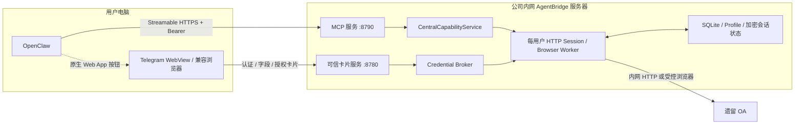

# AgentBridge 当前内网 PoC 部署方案

> 文档日期：2026-07-18
>
> 适用阶段：单用户、受控公司内网、跨机器联调
>
> 安全定位：临时 PoC 方案，不是生产部署基线

> 当前部署判断：固定私网 IP HTTPS、专用内部 CA、Linux AES-256-GCM
> 会话保护器和 Telegram Web App 卡片均已部署；OpenClaw HTTPS MCP 与真实 OA
> 只读链路已通过验证。正式根 CA 已导入 Windows 当前用户信任库，认证、业务字段和
> 执行授权三类卡片均已在 Telegram WebView 实测；插件 0.1.7 已部署登录卡复用与登录后自动续办。
> 中心写能力扩展一期已部署补签申请和新建会议能力，并完成真实 OA 无写入预检。

## 1. 方案结论

当前采用“用户电脑运行智能体宿主，内网服务器集中运行 AgentBridge”的部署方式：

- 用户电脑运行 OpenClaw、Telegram Desktop 和必要时使用的普通桌面浏览器；
- 公司内网另一台 Linux 机器运行 AgentBridge；
- AgentBridge 通过中心 HTTP Session 和受控 Playwright Browser Worker 访问 OA；
- 用户电脑不安装 Chrome 扩展、本地 Daemon 或 OA 连接器；
- OpenClaw 通过 Streamable HTTPS MCP 调用 AgentBridge；
- 登录、业务字段填写和写操作授权通过 AgentBridge 可信卡片完成；
- Telegram 对三类 HTTPS 卡片使用原生 Web App 按钮，在应用内 WebView 中展示；
- 当前 PoC 使用固定私网 IP、HTTPS 和专用内部 CA，不要求域名或公网证书；
- 已部署服务不启用 `--allow-insecure-private-http`，8780/8790 的明文 HTTP 均被拒绝。

当前目标服务器为 `10.10.50.213`：

| 服务 | 地址 | 调用方 |
| --- | --- | --- |
| AgentBridge MCP | `https://10.10.50.213:8790/mcp` | 用户电脑上的 OpenClaw |
| 可信卡片服务 | `https://10.10.50.213:8780` | Telegram 应用内 WebView；普通浏览器仅作兼容入口 |
| OA | 由 `oa` 系统配置确定 | AgentBridge 中心 Worker |

## 2. 部署拓扑



这不是远程桌面方案。用户只在可信卡片中输入信息，远端 Browser Worker 在服务器上完成真实 OA 登录和业务操作。

## 3. 组件放置

### 3.1 用户电脑

保留以下组件：

- OpenClaw；
- Telegram Desktop；
- 用户日常使用的普通浏览器；
- OpenClaw 保存的 AgentBridge MCP Bearer Token。
- AgentBridge 内部根 CA 公钥；根私钥不进入用户电脑的应用配置。

用户电脑不再部署：

- BSCLI Chrome 扩展；
- localhost 浏览器桥接服务；
- AgentBridge Daemon；
- Playwright OA Profile；
- OA Cookie 或 Session 文件。

### 3.2 AgentBridge 服务器

集中运行：

- MCP 服务；
- 认证卡、业务字段卡和执行授权卡服务；
- Credential Broker；
- CentralCapabilityService；
- 每用户 HTTP Session；
- 每用户 Playwright Profile 和 Browser Worker；
- SQLite 操作、身份、交互、字段和授权账本；
- Linux 加密的 OA 会话状态。

Linux 会话状态保护器已经实现并在 `10.10.50.213` 验证。Cookie 不会降级保存为明文 `storage_state.json`。当前保护边界为：

- 使用 `cryptography` 的 AES-256-GCM；
- 主密钥由 Linux CSPRNG 生成，保存在服务端受限密钥文件或 systemd credential 中；
- 密钥不进入仓库、环境日志、SQLite、Profile 或 OpenClaw；
- 会话 ID 作为附加认证数据，密文使用带版本的信封格式；
- 缺少密钥、权限错误、认证失败或密文损坏时必须失败关闭；
- 拒绝相对路径、符号链接、非普通文件和过宽权限；
- AgentBridge 始终由固定 Linux 服务用户运行；
- 生产阶段再迁移到 Vault/KMS，并增加轮换和撤销。

## 4. 网络与安全边界

### 4.1 当前允许的网络形态

- AgentBridge 服务器使用固定 RFC 1918 私网 IP，或 IPv6 ULA 地址；
- OpenClaw 用户电脑能够路由到该地址；
- AgentBridge 服务器能够访问 OA；
- TCP 8790 和 8780 在公司内网可达，当前不调整 Linux 主机防火墙；
- 不做公网映射，不通过互联网、访客 Wi-Fi 或不受控网络访问。

当前 HTTPS 部署要求：

- 叶证书 SAN 必须包含固定私网 IP `10.10.50.213`；
- MCP 与卡片服务使用同一受控证书包，但分别监听 8790 和 8780；
- Linux 只保存叶证书与叶私钥，不保存根 CA 私钥；
- Windows 管理工作站只以当前用户 DPAPI 密文保存根私钥；
- 明文 HTTP 连接被 TLS 监听器拒绝，不允许自动降级。

### 4.2 已接受的 PoC 风险

当前假定 Linux 主机防火墙处于关闭状态，不把 UFW/firewalld 配置作为首次
PoC 前置步骤。这意味着所有能够路由到服务器的内网主机理论上都能发起
8780/8790 的 TLS 连接；Bearer、短期卡片令牌和应用层校验仍负责业务授权，
但不能代替来源 ACL。内部 CA 的分发、撤销和续期目前也是人工运维流程。

因此当前部署已经消除内网明文传输，但仍不是生产安全基线。生产化仍需企业
PKI 或集中证书生命周期、OAuth/OIDC、令牌轮换、限流、审计和 Vault/KMS。

### 4.3 仍然有效的应用层保护

- MCP 调用必须携带服务端签发并绑定用户身份的 Bearer Token；
- 可信卡片具有 Host、Origin、CSRF、nonce、TTL 和一次性消费校验；
- 凭据和可信业务字段不进入模型上下文或 MCP Tool 参数；
- 写操作仍执行 `prepare -> authorize -> commit -> verify`；
- 服务不会回退到已退役的浏览器扩展或本地桥接路径。

## 5. 服务器准备

### 5.1 基础条件

- 支持 systemd 的 Linux 发行版；
- Python 3.12 或更高版本；
- 固定私网 IP；
- 到 OA 的网络连通性；
- 一个固定、受限的 Linux 服务用户；
- 足够空间保存浏览器运行时、用户 Profile 和状态目录。

目标机使用用户指定的部署根目录：

```text
/home/guomao/agentbridge/
├─ app/                       # root 管理的程序目录
├─ venv/                      # root 管理的 Python 虚拟环境
├─ data/                      # agentbridge 服务用户可写的 --home
└─ config/
   └─ session.key             # root:agentbridge 0440 的 32 字节密钥
```

状态目录包含：

```text
/home/guomao/agentbridge/data/
├─ systems/                  # 遗留系统配置
├─ agentbridge.db            # 操作、身份和交互账本
├─ profiles/                 # 每用户受控浏览器 Profile
└─ session-secrets/          # AEAD 加密的会话状态
```

状态目录不能放在普通 NFS/SMB 共享盘中，也不能授权给 OpenClaw 用户电脑直接读取。

### 5.2 Linux 会话保护

Linux `SessionStateStore` 通过以下环境变量加载密钥：

```text
AGENTBRIDGE_SESSION_KEY_FILE=/home/guomao/agentbridge/config/session.key
```

该保护器已在目标 Ubuntu 24.04 机器验证：

- 同一密钥、同一会话上下文能够跨进程重启解密；
- 错误密钥、错误会话上下文和被篡改密文全部失败；
- 状态文件中不存在 Cookie 明文；
- 缺少密钥文件或权限错误时服务拒绝启动；
- Windows DPAPI 路径和已有测试不受影响。

目标机 Linux 专项测试 6 项全部通过；全量 170 项通过，只有 1 项 Windows DPAPI 专属测试按平台跳过。

### 5.3 获取并安装

目标机没有名为 `guomao` 的 Linux 用户，但 `/home/guomao/agentbridge` 已由
root 预建且为空。运行时创建独立的 `agentbridge` 系统用户，不以 root 运行浏览器和凭据代理，也不改变 `/home/guomao` 其他内容的所有权。

```bash
sudo useradd --system --no-create-home \
  --home-dir /home/guomao/agentbridge/data \
  --shell /usr/sbin/nologin agentbridge
sudo install -d -o root -g agentbridge -m 0750 \
  /home/guomao/agentbridge \
  /home/guomao/agentbridge/app \
  /home/guomao/agentbridge/config
sudo install -d -o agentbridge -g agentbridge -m 0750 \
  /home/guomao/agentbridge/data

sudo openssl rand -out /home/guomao/agentbridge/config/session.key 32
sudo chown root:agentbridge /home/guomao/agentbridge/config/session.key
sudo chmod 0440 /home/guomao/agentbridge/config/session.key

# 将已验证提交的受控源码归档解压到 app/ 后执行：
sudo python3.12 -m venv /home/guomao/agentbridge/venv
sudo /home/guomao/agentbridge/venv/bin/python \
  -m pip install /home/guomao/agentbridge/app

sudo /home/guomao/agentbridge/venv/bin/python \
  -m playwright install-deps chromium
sudo -u agentbridge env HOME=/home/guomao/agentbridge/data \
  /home/guomao/agentbridge/venv/bin/python -m playwright install chromium
```

不得在镜像、Git、备份日志或命令输出中暴露会话密钥。密钥丢失意味着已有 OA 会话无法恢复，应重新认证，而不是绕过解密校验。

如果部署服务器不能直接访问 GitHub，应通过受控发布包交付代码，不要复制开发机的 `.bscli`、Profile、Cookie 或会话密钥。

### 5.4 初始化 OA 配置

```bash
AB_PY=/home/guomao/agentbridge/venv/bin/python
AB_HOME=/home/guomao/agentbridge/data

sudo -u agentbridge "$AB_PY" -m bscli.cli.main \
  --home "$AB_HOME" system init-seeyon-oa
sudo -u agentbridge "$AB_PY" -m bscli.cli.main \
  --home "$AB_HOME" system status oa
sudo -u agentbridge "$AB_PY" -m bscli.cli.main \
  --home "$AB_HOME" capability list
```

如 OA 地址与项目默认配置不同，应使用 `system add` 创建正确的 `oa` 配置后再启动服务。

## 6. 用户身份与 MCP Token

每个 OpenClaw 用户使用独立 Token。Token 在 AgentBridge 服务端绑定：

- 稳定的 `user-subject`；
- 预期 OA 显示身份；
- MCP Scope；
- 有效期与撤销状态。

签发具有读取和草稿写入权限的 24 小时 PoC Token：

```bash
AB_PY=/home/guomao/agentbridge/venv/bin/python
AB_HOME=/home/guomao/agentbridge/data
USER_SUBJECT="guomao"
OA_PRINCIPAL="辛国茂"

sudo -u agentbridge "$AB_PY" -m bscli.cli.main \
  --home "$AB_HOME" mcp token issue \
  --user-subject "$USER_SUBJECT" \
  --expected-principal "$OA_PRINCIPAL" \
  --scope oa:write:draft \
  --ttl-hours 24
```

只读联调时省略 `--scope oa:write:draft`。`bearerToken` 只显示一次，应直接写入 OpenClaw 的可信秘密配置，不要发到聊天、普通日志或文档中。

管理命令：

```bash
TOKEN_ID="需要撤销的token-id"

sudo -u agentbridge "$AB_PY" -m bscli.cli.main \
  --home "$AB_HOME" mcp token list
sudo -u agentbridge "$AB_PY" -m bscli.cli.main \
  --home "$AB_HOME" mcp token revoke "$TOKEN_ID"
```

## 7. 网络连通性

当前阶段不修改 Linux 主机防火墙，也不执行 UFW/firewalld 命令。部署前只确认：

- 服务器固定私网 IP 能从 OpenClaw 用户电脑访问；
- 8780/8790 没有通过 NAT、端口转发或反向代理暴露到公网；
- 公司内网边界不会把这两个端口转发到不受控网络；
- 如果目标服务器实际启用了主机防火墙，不要直接关闭，应由运维按现状放通所需来源。

待跨机 PoC 验证完成后，再根据公司网络现状决定是否增加主机防火墙或上游 ACL；这属于加固项，不阻塞首次联调。

### 7.1 内部 CA 与私网 IP 证书

在运行 OpenClaw 的 Windows 管理工作站签发证书。根私钥只以当前用户
DPAPI 密文保存在 `%USERPROFILE%\.agentbridge\pki`，签发时短暂进入内存；
Linux 服务器只接收叶证书与叶私钥，Git 仓库不保存任何私钥：

```powershell
$PkiState = "$env:USERPROFILE\.agentbridge\pki"
$TlsPackage = Join-Path $env:TEMP "agentbridge-tls"

python -m bscli.cli.main pki issue-server `
  --ip 10.10.50.213 `
  --state-dir $PkiState `
  --output-dir $TlsPackage

Import-Certificate `
  -FilePath "$PkiState\root-ca.crt" `
  -CertStoreLocation Cert:\CurrentUser\Root
openclaw config set env.vars.NODE_EXTRA_CA_CERTS "$PkiState\root-ca.crt"
```

根 CA 默认有效 10 年，叶证书最长 397 天。续期复用同一 DPAPI 根状态并使用
`--force` 重新签发叶证书。不要把 `root-ca.key.dpapi` 复制给其他 Windows 用户；
它只能由创建它的 Windows 安全主体解密。

将 `$TlsPackage\server.crt` 和 `$TlsPackage\server.key` 上传到临时目录后，
在 Linux 上安装为：

```bash
sudo install -d -m 0750 -o root -g agentbridge /home/guomao/agentbridge/config/tls
sudo install -m 0644 -o root -g agentbridge server.crt /home/guomao/agentbridge/config/tls/server.crt
sudo install -m 0640 -o root -g agentbridge server.key /home/guomao/agentbridge/config/tls/server.key
```

上传与安装完成后删除临时叶私钥副本。根证书是公开信任锚，可以保留在
PKI 状态目录用于 OpenClaw、浏览器和后续客户端安装。

## 8. 启动 AgentBridge

### 8.1 前台联调

初次联调先以前台进程启动，便于看到配置错误：

```bash
AB_PY=/home/guomao/agentbridge/venv/bin/python
AB_HOME=/home/guomao/agentbridge/data
AB_IP=10.10.50.213

sudo -u agentbridge env \
  HOME=/home/guomao/agentbridge/data \
  AGENTBRIDGE_SESSION_KEY_FILE=/home/guomao/agentbridge/config/session.key \
  "$AB_PY" -m bscli.cli.main --home "$AB_HOME" mcp central-serve \
  --host "$AB_IP" \
  --port 8790 \
  --public-base-url "https://${AB_IP}:8790" \
  --tls-cert /home/guomao/agentbridge/config/tls/server.crt \
  --tls-key /home/guomao/agentbridge/config/tls/server.key \
  --auth-host "$AB_IP" \
  --auth-port 8780 \
  --auth-public-base-url "https://${AB_IP}:8780" \
  --auth-tls-cert /home/guomao/agentbridge/config/tls/server.crt \
  --auth-tls-key /home/guomao/agentbridge/config/tls/server.key \
  --session-keepalive-interval 600 \
  --session-keepalive-lease 28800
```

正常启动时，标准输出中的 JSON 应至少包含：

```json
{
  "status": "serving",
  "mcpUrl": "https://10.10.50.213:8790/mcp",
  "authCardBaseUrl": "https://10.10.50.213:8780",
  "insecurePrivateHttp": false,
  "sessionKeepalive": {
    "enabled": true,
    "intervalSeconds": 600,
    "activityLeaseSeconds": 28800
  }
}
```

启动输出中的 MCP 与卡片地址必须都是 HTTPS，且不得再出现私网明文警告。

### 8.2 systemd 托管

前台完成登录、读取和重启恢复验证后，再创建
`/etc/systemd/system/agentbridge.service`：

```ini
[Unit]
Description=AgentBridge central MCP and trusted cards
After=network-online.target
Wants=network-online.target

[Service]
Type=simple
User=agentbridge
Group=agentbridge
WorkingDirectory=/home/guomao/agentbridge
Environment=HOME=/home/guomao/agentbridge/data
Environment=PYTHONUNBUFFERED=1
Environment=AGENTBRIDGE_SESSION_KEY_FILE=/home/guomao/agentbridge/config/session.key
ExecStart=/home/guomao/agentbridge/venv/bin/python \
  -P -m bscli.cli.main --home /home/guomao/agentbridge/data mcp central-serve \
  --host 10.10.50.213 --port 8790 \
  --public-base-url https://10.10.50.213:8790 \
  --tls-cert /home/guomao/agentbridge/config/tls/server.crt \
  --tls-key /home/guomao/agentbridge/config/tls/server.key \
  --auth-host 10.10.50.213 --auth-port 8780 \
  --auth-public-base-url https://10.10.50.213:8780 \
  --auth-tls-cert /home/guomao/agentbridge/config/tls/server.crt \
  --auth-tls-key /home/guomao/agentbridge/config/tls/server.key \
  --session-keepalive-interval 600 \
  --session-keepalive-lease 28800
Restart=on-failure
RestartSec=5
TimeoutStopSec=20
UMask=0077
NoNewPrivileges=true
PrivateTmp=true
ProtectSystem=strict
ReadOnlyPaths=/home/guomao/agentbridge/config
ReadWritePaths=/home/guomao/agentbridge/data

[Install]
WantedBy=multi-user.target
```

仓库中的可复现单元文件为
`deploy/systemd/agentbridge.service`。修改启动参数时先更新并验证该文件，
再安装到 `/etc/systemd/system/agentbridge.service`，不要只在服务器上做无法追踪的临时修改。

执行：

```bash
sudo systemctl daemon-reload
sudo systemctl enable --now agentbridge
sudo systemctl status agentbridge
sudo journalctl -u agentbridge -f
```

Playwright/Chromium 与上述 systemd 加固项需要在目标 Linux 发行版上验证；遇到限制时应逐项定位所需权限，不应直接移除全部隔离设置。

## 9. 智能体宿主接入

### 9.1 通用远程 MCP

通用智能体宿主优先只配置远程 MCP、TLS 信任和 MCP 身份，不安装 AgentBridge 业务 CLI、浏览器扩展或本地 OA 组件。接入后先调用 `agentbridge_server_profile`，也可以读取 `agentbridge://server/profile` 或使用 `agentbridge_oa_operator` Prompt 获取基本操作边界。

支持 MCP Apps 的宿主会根据工具 `_meta.ui.resourceUri` 加载 `ui://agentbridge/trusted-interaction.html`。完整卡片 envelope 位于宿主私有的 `CallToolResult._meta["io.agentbridge/interaction"]`，模型可见结果中的 URL 已由服务端替换为固定占位符。MCP App 在模型循环之外打开安全页面、轮询、单次续跑，并接住后续卡片。

仅支持核心 MCP 的宿主可以在 OA 会话有效时使用只读能力；遇到登录、字段填写或执行授权时，必须具备 MCP Apps 或经过批准的私有宿主适配器。服务不会把卡片 URL 降级暴露给模型。

当前仍使用管理员签发的 Bearer 和内部 CA，因此“添加 MCP 地址并授权”尚未完全一键化。标准 OAuth 2.1、浏览器身份绑定和第二用户隔离验证仍是后续生产化工作。详细说明见 [远程 MCP 低安装接入](remote-mcp-onboarding.md)。

### 9.2 当前 OpenClaw 兼容适配

OpenClaw 侧需要配置以下连接信息：

| 配置项 | 值 |
| --- | --- |
| MCP Transport | Streamable HTTP |
| MCP URL | `https://10.10.50.213:8790/mcp` |
| HTTP Header | `Authorization: Bearer <bearerToken>` |
| 可信卡片地址 | 无需静态配置，由 interaction 动态返回 |

当前仓库已提供可安装的原生插件 `integrations/openclaw-agentbridge`。插件把宿主无关的 interaction envelope 转为 OpenClaw presentation，在模型看到工具结果前移除短期卡片 URL，只在私聊显示卡片，并在模型循环之外轮询和单次恢复交互。`render_openclaw_interaction` 保留为 Python 参考适配器。

在当前 Windows OpenClaw 用户电脑执行一次显式安装和信任锚配置：

```powershell
openclaw plugins install --link D:\Codes\CLIExp\integrations\openclaw-agentbridge
openclaw config set env.vars.NODE_EXTRA_CA_CERTS "$env:USERPROFILE\.agentbridge\pki\root-ca.crt"
openclaw config set "mcp.servers.agentbridge.url" https://10.10.50.213:8790/mcp
openclaw config set "plugins.entries.agentbridge-interactions.config.allowedCardOrigins[0]" https://10.10.50.213:8780
openclaw plugins enable agentbridge-interactions
openclaw gateway restart
openclaw plugins inspect agentbridge-interactions --runtime --json
openclaw gateway status --deep --require-rpc
```

链接安装只让 OpenClaw 指向源码目录，不代表 Gateway 会自动换掉 Node 已缓存的插件模块。修改插件源码后必须完整重启 Gateway，并从启动日志确认实际版本，例如 `AgentBridge interaction plugin registered (version=0.1.5, ...)`。Windows 上的托管 `openclaw gateway restart` 可能需要两分钟以上，即使命令调用方先超时，后台重启仍可能继续；至少等待 120 秒后再判断失败，等待期间不要重复重启或提前结束 Node 进程。最终以 18789 监听、深度 RPC 状态和插件版本日志三项为准。如果切换 Node/NVM 后 `gateway status` 显示 Windows Scheduled Task 丢失，执行 `openclaw gateway install --force --json` 重建托管启动项，再用 `openclaw gateway status --deep --require-rpc --json` 核对新 PID、RPC 和插件版本。

`env.vars.NODE_EXTRA_CA_CERTS` 是 OpenClaw 的持久托管环境，不要只在一次性的
PowerShell 进程中设置 `$env:NODE_EXTRA_CA_CERTS`。重建托管任务后，
`gateway status --deep --require-rpc --json` 的 `environmentValueSources` 必须包含
`NODE_EXTRA_CA_CERTS`，再通过真实 MCP 只读调用确认新进程已信任内部 CA。

`allowedCardOrigins` 必须是精确 HTTPS 来源，不允许路径、通配符或从 MCP 结果自动学习。认证、业务字段和执行授权三类卡片在 Telegram 中都使用 Web App；卡片页面只通过自托管的无数据桥发送 ready、expand 和 close，不加载可读取表单的第三方脚本。插件会记录发起交互的可信私聊投递路由。可信页面完成后，后台恢复优先绕过模型，通过同一 Telegram 通道直接投递下一张可信卡；没有下一张卡时，成功、拒绝、过期和失败使用固定的宿主状态文本直接反馈。两类投递都不包含凭据或已提交业务字段。只有宿主直投不可用时，`wakeAgentOnComplete=true` 才以不含凭据、业务字段和卡片 URL 的状态事件请求一次模型心跳作为兜底。该唤醒使用 `hook:agentbridge-interaction-updated` 原因前缀，使 OpenClaw 按外部事件处理，不受空 `HEARTBEAT.md` 的定时心跳门控影响。`/agentbridge pending` 仍用于手工重显；若模型提供方策略禁止自动唤醒，可显式关闭该兜底。

OpenClaw 不应要求用户在聊天里回复密码、业务字段或“同意执行”。这些内容必须在可信卡片中完成。

## 10. 首次联调流程

### 10.1 网络检查

在 OpenClaw 用户电脑执行：

```powershell
$AgentBridgeIp = "10.10.50.213"
Test-NetConnection $AgentBridgeIp -Port 8790
Test-NetConnection $AgentBridgeIp -Port 8780
```

两个端口都应显示 `TcpTestSucceeded: True`。其他未授权电脑应无法连接。

### 10.2 MCP 与登录验证

按以下顺序验证：

1. OpenClaw 连接 MCP 并读取工具列表；
2. 调用 `oa_session_login`；
3. 如果 OA 会话不存在，AgentBridge 返回 `requires_user_action` 和认证 interaction；
4. OpenClaw 在私聊中显示卡片按钮；
5. 用户用普通浏览器打开卡片并输入 OA 登录信息；
6. OpenClaw 插件在模型循环之外轮询 interaction，完成后单次调用 `agentbridge_interaction_resume`；
7. 调用 `oa_workflow_pending_list`，验证能够读取当前用户真实待办；
8. 核对返回身份、执行通道和操作账本，确认没有使用浏览器桥接。

如果 `oa_session_login` 直接返回 `succeeded` 和 `reused=true`，说明中心会话仍然有效，不应再次要求用户登录。

`oa_session_status` 不会创建认证 interaction。对于活动会话，它会使用已加密保存的会话状态实时访问 OA，并返回 `statusSource=live` 和本次 `checkedAt`；`lastVerifiedAt` 仍表示登录或身份验证纪元，不会被单纯的状态检查改写。对于非活动会话，它只读取注册表并返回 `statusSource=registry`。临时网络错误、OA 5xx 或非登录页的异常 HTML 返回 `SESSION_CHECK_UNAVAILABLE`，保留已有会话；只有明确的登录跳转、401/403 或可结构化识别的登录表单才将会话标记为过期并删除密文状态。需要发起认证时，应明确调用 `oa_session_login`，自然语言可直接使用“登录 OA”。

### 10.3 重启恢复验证

首次登录成功后：

1. 正常停止 AgentBridge；
2. 使用同一个 Linux 服务用户、同一个 `--home` 和同一个会话密钥重新启动；
3. 再次调用 `oa_session_login` 或只读工具；
4. 确认 AEAD 加密会话被恢复，没有无故生成新认证卡。

如果服务用户无权读取密钥，或密钥与原密钥不同，会话必须失败关闭。此时应恢复正确的服务身份和密钥挂载，不要删除状态目录、覆盖密文或绕过校验。

## 11. 写操作验证原则

跨机部署首先完成只读验证。写操作另行选择明确、低风险的测试事项，并继续遵守：

```text
业务能力请求
  -> 业务字段卡
  -> 冻结执行计划
  -> 独立授权卡
  -> commit
  -> OA 服务器状态回读验证
```

当前正式纵切是“出差申请单保存待发草稿”，不提交工作流。必须由用户明确同意测试，且不能因为跨机部署成功就自动扩大写操作范围。

## 12. 会话所有权

当前 OA 可能只允许同一账号保持一个登录会话。PoC 期间应把中心 AgentBridge 作为该 OA 会话的主要所有者：

- AgentBridge 登录后，用户默认 Chrome 中的 OA 可能被踢下线；
- 用户再次在默认 Chrome 登录 OA，也可能使 AgentBridge 会话失效；
- `LOGIN_REQUIRED` 表示 OA 已确认会话失效；
- `SESSION_CHECK_UNAVAILABLE` 表示暂时无法核验，不应让用户重新输入密码；
- 卡片 TTL 过期只影响本次交互，不会主动清除已经有效的 OA 会话。

当前中心部署显式启用受控保活：每 10 分钟为租约内的活动会话执行一次轻量 OA 探测，最近一次登录或真实智能体调用将活动租约续到 8 小时。后台心跳本身不续租，因此无人使用时不会永久维持 OA 登录。心跳复用加密会话状态和单会话锁，不创建认证卡；明确登录失效时正常过期，临时错误只记录为 deferred 并保留会话。程序默认仍为关闭状态，其他部署必须显式配置后才启用。

## 13. 常见问题定位

| 现象 | 检查与处理 |
| --- | --- |
| 启动提示 `requires TLS` | 缺少 `--allow-insecure-private-http`，或仍在使用默认非回环安全策略 |
| 启动提示私网地址无效 | 必须绑定服务器真实固定私网 IP，不能使用 `0.0.0.0`、域名或错配端口 |
| OpenClaw 无法连接 MCP | 检查路由、8790 监听和 MCP URL；若服务器实际启用了防火墙，再检查现有规则 |
| MCP 返回 401 | 检查 Bearer Token 是否完整、过期、撤销或绑定错误 |
| 卡片链接打不开 | 检查 8780 监听和 interaction 中返回的 IP 是否是用户电脑可达地址 |
| 私网 HTTP 卡片提交显示“请求来源无效” | 部分 Chrome 环境会发送 `Origin: null` 且省略 `Sec-Fetch-Site`；当前版本仅在显式私网 HTTP PoC 模式下接受这种请求，仍拒绝明确的 `cross-site`，并继续执行 SameSite Cookie、一次性 CSRF 和卡片状态校验 |
| 内置浏览器无法输入 | 使用 OpenClaw 提供的 URL 在普通浏览器中打开；AgentBridge 不依赖内置浏览器输入 |
| Telegram 只回复“OA 登录已过期”，没有安全登录按钮 | 检查智能体实际调用的工具；`oa_session_status` 不发卡，应调用 `oa_session_login` |
| Telegram 私聊已生成 interaction 但没有按钮 | 检查日志是否出现 `captured for private session`；若出现 `withheld because the OpenClaw session is not private`，确认插件至少为 0.1.1 并完整重启 Gateway，不能只做配置热加载 |
| 切换 Node/NVM 后 Gateway 仍运行旧插件或计划任务丢失 | 执行 `openclaw gateway install --force --json`，再核对 Gateway PID 已变化且启动日志打印预期插件版本 |
| Linux 启动提示 `AGENTBRIDGE_SESSION_KEY_FILE` | 检查环境变量是否为绝对路径、密钥是否恰好 32 字节、所有者和权限是否符合要求 |
| 每次都要求登录 | 检查 OA 是否被其他浏览器重新登录、服务用户、密钥文件或 `--home` 是否变化 |
| `SESSION_RUNTIME_MISMATCH` 或解密失败 | 恢复原 Linux 服务用户和正确密钥，不要删除或替换已有会话状态 |
| `SESSION_CHECK_UNAVAILABLE` | 检查 OA 网络并重试，不要创建新认证挑战 |
| 读待办后状态突然变为过期 | 先看是否存在明确登录响应；超时、5xx 和非登录 HTML 应返回 `SESSION_CHECK_UNAVAILABLE` 并保留会话，不能仅因响应不是 JSON 就判定登录失效 |

## 14. 验收清单

- [x] AgentBridge 服务器使用固定私网 IP `10.10.50.213`；
- [x] 服务器到 OA `10.10.50.110` 网络可达；
- [x] Linux AEAD 会话保护器及失败关闭测试已经完成；
- [x] AgentBridge 始终由固定 Linux 服务用户 `agentbridge` 运行；
- [x] 会话密钥文件仅允许 root 和 AgentBridge 服务组读取；
- [ ] 8780/8790 仅位于受控公司内网，没有任何公网映射；
- [x] 8780/8790 均使用私网 IP HTTPS，证书链通过校验且明文 HTTP 被拒绝；
- [x] 根私钥仅以 Windows 当前用户 DPAPI 密文保存，Linux 只部署叶证书和叶私钥；
- [x] 正式根 CA 已由用户确认导入 Windows 当前用户根证书库；Windows 原生 TLS、业务字段卡和执行授权卡的 Telegram WebView 已验收；
- [x] 正式 HTTPS 认证卡已于 2026-07-17 在 Telegram 私聊完成点击和登录验收；
- [x] MCP 启动 JSON 中 URL 与实际 IP、端口完全一致；
- [x] OpenClaw 能通过 Bearer Token 读取 MCP 工具列表；
- [x] 原生 OpenClaw 插件已在 2026.7.1 本机运行时加载并注册安全中间件；
- [x] 认证卡从 OpenClaw Telegram 私聊打开，凭据没有进入聊天；
- [x] `oa_workflow_pending_list` 读取真实 OA 数据成功；
- [x] 读取真实待办后立即执行 `oa_session_status`，实时核验仍为活动会话；
- [x] 10 分钟受控保活连续跨过 45 分钟空闲窗口，随后状态探测和真实待办读取均成功；
- [x] AgentBridge 重启后能用同一服务用户和密钥恢复会话；
- [x] 错误密钥、篡改密文和过宽权限都不能解密会话；
- [x] 已记录未启用主机防火墙时的内网可达范围、内部 CA 分发和证书生命周期风险；
- [ ] 日志、操作账本和 OpenClaw 对话中没有密码、Cookie 或可信字段；
- [x] 未经单独确认，没有执行 OA 写操作。

## 15. 当前完成度

| 项目 | 状态 |
| --- | --- |
| 中心 AgentBridge、Credential Broker 和可信卡片 | 已实现 |
| Streamable HTTP MCP 与 Bearer 身份绑定 | 已实现 |
| MCP 自描述、私有交互元数据与 MCP Apps | 已实现；提供 Profile Tool/Resource、操作 Prompt 和单文件 UI Resource，模型可见结果不含卡片 URL |
| 固定私网 IP HTTPS 与内部 CA | 已实现并部署；服务端证书链、TLS 端点和明文拒绝已验证 |
| 固定私网 IP HTTP 显式开关 | 仅保留为隔离恢复能力，当前部署未启用 |
| 通配地址、公网地址和端点错配拒绝 | 已实现并有自动测试 |
| MCP SDK 私网 Host 与认证请求 | 已自动验证 |
| Linux AES-256-GCM 会话状态保护器 | 已实现；目标 Ubuntu 专项 6 项和原全量 171 项通过；会话修复本地全量 179 项、受控保活本地全量 187 项、可信交互本地全量 188 项通过 |
| 单用户中心会话与真实 OA 纵切 | 已验证；真实待办读取成功，连续两次服务重启后均复用原会话；10 分钟受控保活已跨过真实空闲窗口 |
| OpenClaw interaction renderer 合约 | Python 参考适配器已实现；认证、业务字段、执行授权三类 HTTPS 卡片均映射为 Telegram 原生 Web App 按钮 |
| OpenClaw 与另一台 AgentBridge 服务器真实跨机联调 | HTTPS MCP 注册、Bearer 认证和工具探测已完成；智能体通过正式 HTTPS MCP 真实调用状态查询和待办读取成功 |
| 可安装 OpenClaw 插件与本机接线 | 0.1.7 已实现并链接安装；兼容 OpenClaw 2026.7.1 的远程 MCP `_meta` 缺失，支持私聊绑定、可信直投、历史卡片隔离、登录卡复用和登录成功后一次性续办；URL 与可信值不进入模型上下文 |
| 中心受治理写能力 | 已实现出差申请草稿、补签申请草稿、补签审批和新建会议；统一经过字段卡、实时校验、冻结计划、独立授权、一次性提交与业务回读 |
| 第二个真实 OA 用户隔离验证 | 待执行 |
| Linux systemd 服务化运行 | 已完成；固定服务用户、自动启动、重启恢复均已验证 |
| 企业 PKI、OIDC、限流、审计、Vault/KMS | 生产阶段待实现；当前专用内部 CA 不作为企业生产 PKI |

### 2026-07-14 实机验收记录

- AgentBridge 部署在 `10.10.50.213:/home/guomao/agentbridge`，由 systemd 托管；
- MCP `8790` 与可信卡片 `8780` 均可从 OpenClaw 用户电脑访问，未修改主机防火墙；
- OpenClaw 2026.7.1 使用 `streamable-http` 注册 `agentbridge`，Bearer 仅保存在本机可信环境文件，`openclaw.json` 保存环境变量引用；
- OpenClaw `mcp probe` 成功发现 14 个 AgentBridge 工具；
- OpenClaw 原生插件 0.1.0 已链接安装并显式启用；运行时检查确认 3 个生命周期钩子、`/agentbridge` 命令和工具结果中间件契约，Gateway RPC 与启动日志均确认插件实际加载；
- 可信认证卡完成真实 OA 登录；关闭其他 OA 页面后连续两次重启服务，`oa_session_login` 每次都返回 `succeeded`、`reused=true`，身份绑定一致且没有再次发卡；
- 登录基线及两次重启后的 `oa_workflow_pending_list` 均成功读取 4 条真实待办，证明 Linux AES-256-GCM 会话状态不只是单次重启可恢复；
- 对照验证中，普通 Chrome 留有一个已退出登录的 OA 页面时曾出现会话失效；关闭该页面并重新认证后连续两次重启均通过。现有证据不能证明该页面就是唯一原因，但符合 OA 单登录会话竞争特征，PoC 运维阶段应避免同一账号在其他浏览器窗口打开或刷新 OA；
- 私网 HTTP 下的 Chrome opaque origin 兼容修复已在浏览器复现、目标 Ubuntu 专项测试和全量 171 项测试中通过；
- 没有执行 OA 写操作；OpenClaw 外部模型智能体回合因数据出境边界未获单独授权而未执行。

### 2026-07-15 OpenClaw Telegram 认证卡验收记录

- OpenClaw 2026.7.1 的工具结果中间件未携带会话键，旧版插件因而把真实 Telegram 私聊 interaction 误判为非私聊并失败关闭；
- 插件 0.1.1 在 `before_tool_call` 阶段按 `toolCallId` 暂存私聊会话绑定，工具结果中间件消费该绑定后再执行来源校验、URL 隐藏和卡片交付；无绑定及群聊仍然失败关闭；
- Windows Node/NVM 环境切换后，原 Gateway 进程仍缓存旧模块且 Scheduled Task 丢失；使用 `openclaw gateway install --force --json` 清理旧 PID、重建任务并启动新进程，日志确认加载 `version=0.1.1`；
- 用户在 Telegram 私聊发送“登录 OA”，智能体真实调用 `oa_session_login`；日志出现 `AgentBridge interaction captured for private session`，Telegram 显示安全登录按钮，用户通过普通浏览器完成登录；
- 登录后用户在同一 Telegram 私聊发送“检查 OA 登录状态”，`oa_session_status` 返回“已登录，有效”，身份为辛国茂，最近验证时间为 2026-07-15 10:58:23（GMT+8），错误为空；
- OpenClaw 工具结果和对话记录中的短期卡片 URL 均被替换为宿主侧占位文本，密码未进入模型消息或聊天；
- “检查 OA 登录状态”实际调用 `oa_session_status`，只返回状态且不会发卡。这属于工具语义差异，不是卡片丢失。

### 2026-07-15 OA 会话误过期修复验收记录

- 原问题表现为：`oa_session_status` 从注册表返回活动状态，但随后 `oa_workflow_pending_list` 在模板中心预检阶段把任意非 JSON 响应都当作登录过期，并删除加密会话状态；因此“状态有效”和“读取即过期”可以在几分钟内连续出现；
- 修复后，活动会话状态查询执行真实 OA 探测，并分别返回认证纪元 `lastVerifiedAt` 与本次探测时间 `checkedAt`；状态探测不改写认证纪元，避免影响已冻结写计划的会话绑定；
- OA 响应分类改为保守失效：明确登录跳转、401/403 或同时包含用户名与密码字段的登录表单才触发 `LOGIN_REQUIRED`；超时、限流、5xx 和非登录 HTML 返回 `SESSION_CHECK_UNAVAILABLE`，不删除密文状态；诊断信息只包含 HTTP 状态、规范化媒体类型、耗时或异常类别，不记录 URL、正文、Cookie 和凭据；
- 修复于 2026-07-15 12:42 部署到 `10.10.50.213` 并重启 systemd 服务。用户于 12:58:39 完成可信卡认证，13:00 通过 Telegram/OpenClaw 真实读取 3 条 OA 待办，13:01:29 再次实时检查仍为“已登录，有效”，服务日志无异常；
- 本次修复先解决误分类，没有在证据不足时直接增加 keepalive；后续真实观察确认 OA 会话确实会在无请求时失效，因此另行实现并验证受控保活。

### 2026-07-15 OA 受控保活验收记录

- 保活由中心 MCP 进程调度，不依赖 OpenClaw、Telegram、用户浏览器或 Chrome 扩展；它复用加密会话状态和单会话锁，短暂启动 Browser Worker 完成探测后立即关闭；
- 程序默认关闭保活。当前部署显式设置 `--session-keepalive-interval 600` 和 `--session-keepalive-lease 28800`；登录与真实智能体调用刷新活动租约，后台心跳不刷新自己的租约，避免无限维持无人使用的会话；
- 初次采用 20 分钟间隔时，用户于 14:21:11 登录，首次心跳在 14:39:16 发现 OA 已明确注销，会话只维持约 18 分钟，因此 `1200` 秒在当前 OA 上被判定为不可靠参数，没有作为成功结果提交；
- 调整为 10 分钟并关闭其他 OA 页面后，服务于 15:08:49 以 PID `928148` 启动，用户于 15:11:38 认证。15:18:52、15:28:53、15:38:54、15:48:55、15:58:56 五轮心跳全部返回 `kept_alive=1`，无 expired 或 deferred；
- 五轮后台心跳期间，数据库中的 `last_verified_at` 和活动租约时间均保持 15:11:38，证明心跳没有改写身份认证纪元，也没有自我续租；
- 16:12:53，即认证约 61 分钟后，用户通过 Telegram/OpenClaw 实时检查仍为“已登录，有效”，界面分别显示认证时间 15:11:38、最近活动与本次检查时间 16:12:53；随后 `oa_workflow_pending_list` 成功读取 3 条真实待办；
- 本轮没有执行 OA 写操作。日志中的保活信息只包含活动、合格、成功、过期、延迟和租约外计数，不包含用户标识、URL、Cookie、页面正文或凭据。

### 2026-07-15 OpenClaw 可信交互续接验收记录

- 用户在 Telegram 发起“出差申请单保存待发草稿”后完成业务字段卡；插件在后台恢复同一交互，并于 22:34:49 通过原 Telegram 私聊路由直接投递独立执行授权卡，日志记录 `AgentBridge next trusted card delivered directly` 和 Telegram `messageId=88`，卡片 URL 与已填写业务字段均未经过模型；
- 用户完成授权与执行后，首次完成通知因普通 heartbeat 原因被空 `HEARTBEAT.md` 门控，日志明确返回 `EMPTY-HEARTBEAT-FILE`。插件已改用 `hook:agentbridge-interaction-updated` 原因前缀，并增加单元测试固定该契约；
- 修复后的无害通知探针已越过 heartbeat 文件门控并进入模型回合，未再出现 `EMPTY-HEARTBEAT-FILE`；但模型按 heartbeat 协议返回 `HEARTBEAT_OK` 后被宿主静默，证明最终完成通知不应依赖模型生成；
- 插件 0.1.4 因而将无后续卡片的成功、拒绝、过期和失败也改为宿主固定文本直投，只有通道适配器不可用时才使用不含敏感数据的 heartbeat 兜底。自动测试分别覆盖卡片直投、终态直投、路由缺失兜底和 hook 原因前缀；
- 0.1.4 于 23:39:47 被新 Gateway 进程实际加载，PID `24620` 正常监听 18789，深度 RPC 检查通过；随后使用同一 Telegram 出站插件发送不经过模型和 OA 的宿主直达验收消息，返回 `messageId=90`。结合此前真实授权卡直投和 16 项 Node 测试，终态直投链路具备可提交证据；
- Windows Gateway 重启实测可能超过两分钟。运维验证必须等待托管重启收敛后再检查，避免超时后重复启动造成双进程竞争。

### 2026-07-16 内网 IP HTTPS 与 Telegram Web App 改造验收记录

- 在 Windows 管理工作站创建专用 EC P-256 根 CA；根私钥仅以当前用户 DPAPI 密文保存在 `%USERPROFILE%\.agentbridge\pki\root-ca.key.dpapi`，仓库、Linux 和 OpenClaw 配置均不保存根私钥；
- 根证书 SHA-256 指纹为 `E6F0628EAFAFAAFFC5A71075247E35EF2B764B8D61986F486984F4A923F63BB5`，有效期至 2036-07-12；正式叶证书 SHA-256 指纹为 `13346384A6912F59077B013FFCD233967A17C49B8132895EB4E51D4B684701EE`，SAN 为 `IP:10.10.50.213`，有效期至 2027-08-16；
- 叶证书和叶私钥安装在 `/home/guomao/agentbridge/config/tls`，权限分别为 `0644 root:agentbridge` 与 `0640 root:agentbridge`；systemd 服务已移除 `--allow-insecure-private-http`，8780/8790 均以 HTTPS 启动，证书链验证通过，明文 HTTP 连接被拒绝；
- OpenClaw MCP 地址已切换为 `https://10.10.50.213:8790/mcp`，卡片来源白名单切换为 `https://10.10.50.213:8780`；CA 路径通过 `env.vars.NODE_EXTRA_CA_CERTS` 写入 OpenClaw 持久托管环境，重建任务后的 Gateway PID `11652`，深度 RPC、配置审计和插件加载检查均通过，`environmentValueSources` 明确包含该键；
- OpenClaw 智能体在初次切换和托管任务重建后分别通过正式 HTTPS MCP 实际调用 `oa_session_status` 和 `oa_workflow_pending_list`：会话均为 active，身份为辛国茂 / guomao，待办均为 4 条，每轮 2 次工具调用均成功且无失败；两轮都严格只读，没有调用登录、字段、授权或任何 OA 写工具；
- 三类卡片页面均加入自托管、无数据读取能力的 Telegram 生命周期桥，只发送 ready、expand 和完成后的 close；页面不加载第三方脚本，卡片字段不会被桥接脚本读取。Node 集成测试确认 credential、business-input 和 execution-authorization 在 HTTPS 下全部使用 `button.webApp`，不回退普通 URL；
- 用户已在受保护的系统提示中把正式根 CA 导入 Windows 当前用户根证书库。验收通过证书原始 DER 重新计算 SHA-256 指纹，不把 Windows UI 的 SHA-1 `Thumbprint` 当作 SHA-256；未显式指定 CA 的 Windows 原生 HTTPS 请求已到达卡片服务并得到预期 404；
- 正式验收使用真实 Telegram 入站消息发起出差申请字段卡，而不把 CLI `--deliver` 当作等价证据。用户提交字段后，宿主后台续接并在同一 Telegram 私聊显示执行授权卡；字段值和短期卡片 URL 均未进入模型消息；
- 用户在执行授权卡中选择取消。授权记录进入 `rejected`，`commit_operation_id` 和 `consumed_at` 均为空；本轮没有创建新的 `oa.business_trip.save_draft` 操作，也没有执行 OA 写入；
- 插件 0.1.5 将操作审计记录中的旧 interaction 与当前交互分离：旧卡片 URL 仍被脱敏，但不会进入投递和轮询。Node `20/20`、Python `194 passed, 3 skipped` 和 npm pack dry-run 均通过；Gateway 重启后 PID `4200` 正常监听，深度 RPC 通过，启动日志确认加载 0.1.5；
- OpenClaw 随后真实只调用一次 `agentbridge_operation_list(limit=3)`，成功返回 3 条记录且工具失败数为 0；日志没有新增中间件结果无效警告，也没有误捕获历史卡片。目标 Ubuntu 全量测试仍为 `194 passed, 1 skipped`，`compileall`、`pip check` 和 systemd 单元校验均通过；
- 正式根 CA、Windows 原生 TLS、业务字段卡和执行授权卡已完成验收。认证卡当时为避免主动注销当前 OA 会话而留待下一次自然登录，并已在 2026-07-17 的真实宿主验收中完成。

### 2026-07-17 远程 MCP 真实宿主验收一期

- 运行时检查确认 OpenClaw 2026.7.1 会在远程工具物化时丢弃顶层 MCP 结果 `_meta`。插件 0.1.6 因此新增受限回取：只接受由已配置 AgentBridge MCP 服务产生、仍处于活动状态且声明宿主管理和 MCP App 资源的脱敏引用，再通过带原身份凭据的后台 MCP 客户端取得私有交互；交互 ID、类型、状态、有效期和 HTTPS 来源必须再次一致，否则失败关闭；
- Gateway 完成真实进程重启后以 PID `27052` 监听 18789，深度 RPC、配置审计和插件运行时检查通过；启动日志确认 0.1.6 已加载，注册 5 个钩子和 `/agentbridge` 命令；
- HTTPS 认证卡完成真实 OA 登录，后台记录认证交互成功，凭据和短期卡片 URL 均未进入模型可见结果；
- `oa_business_trip_prepare` 生成 9 字段业务卡。合成的 `openclaw agent --deliver` 调用虽执行了工具并投递模型文本，但不等价于 Telegram 正常入站回复链路；同一私聊中的 `/agentbridge pending` 成功重绘已捕获卡片，且没有创建第二个业务操作；
- 用户提交字段后，插件自动轮询并恢复交互，直接投递执行授权卡；用户选择取消后，Telegram 收到固定 `DECLINED` 终态通知。生产库只读核验显示最新授权为 `rejected`、`commit_operation_id` 为空、`consumed_at` 为空，操作表没有 2026-07-17 新增的 `oa.business_trip.save_draft`，本轮没有 OA 写入；
- 本轮把“真实私聊入站或 `/agentbridge pending`”固定为卡片验收路径；CLI `--deliver` 只用于工具和文本投递诊断，不再作为宿主卡片渲染证据；
- 自动回归基线为 Node 插件 `24/24`、Python 3.12 全量 `197 passed, 3 skipped`；`npm pack --dry-run` 只包含 9 个声明文件，差异格式检查通过。

### 2026-07-17 登录卡复用与登录后自动续办

- 中央认证挑战存储增加原子 `create_or_reuse`：同一绑定用户、系统、会话和认证契约下，未过期的 `pending` 或 `processing` 挑战复用原 challenge、卡片 URL 与 interaction；过期挑战才换新，契约不匹配的处理中挑战继续失败关闭；
- `oa_session_login` 将复用结果显式返回给宿主。重复请求不会再把用户正在填写的登录卡标成 `superseded`，也不会创建第二个轮询任务；
- OpenClaw 插件 0.1.7 仅在 credential 恢复成功且中央服务明确返回 `nextAction.type=retry_original_request` 时，向原私聊写入一条不含凭据、字段、授权内容和卡片 URL 的续办事件，并用 `hook:agentbridge-login-completed` 唤醒同一智能体一次；业务字段卡和执行授权卡不会据此误续办；
- 本地回归为 Python 3.12 `200 passed, 3 skipped, 19 subtests passed`、Node 插件 `25/25`；npm dry-run 仍只包含 9 个声明文件，差异格式检查通过；
- 两个中央 Python 文件重新安装到 `10.10.50.213` 后完成 `compileall`，systemd 服务恢复 `active`。本机 OpenClaw Gateway 单次托管重启耗时约 167 秒，最终 PID `6972` 正常监听 18789，深度 RPC、配置审计通过，运行时确认插件 0.1.7 已加载并注册 5 个钩子；
- 通过插件同款后台 MCP 客户端执行只读实机探针：`oa_session_status` 返回 active；`oa_session_login` 返回 `succeeded`、`reused=true`、无 interaction、无 next action，证明部署后当前有效 OA 会话不会重复发卡；
- 为避免人为注销仍有效的 OA 会话，本轮没有强制制造过期。过期状态下的“同一卡复用 + 登录完成后自动重试原请求”已由中央服务和宿主自动测试固定，Telegram 真实端到端观察留到下一次自然过期时完成。

## 15.1 2026-07-17 验证与发布提速基线

- 新增 `scripts/Invoke-AgentBridgeValidation.ps1`，使用 `%LOCALAPPDATA%\AgentBridge\test-venv-py312` 持久 Python 3.12 环境，并按 Python 版本与 `pyproject.toml` 哈希更新依赖；定向 OpenClaw 验证默认不再执行 `npm pack`；
- 新增 `scripts/Test-AgentBridgeMcp.ps1` 和最小 Node 客户端。脚本从本机 OpenClaw 配置及 `.env` 解析环境引用，不把 Bearer 放入命令行或输出。真实 `oa_session_status` 冒烟耗时 6.73 秒并返回 active；`oa_session_login` 耗时 8.96 秒并返回 `reused=true`、无 interaction；
- 新增 `scripts/Deploy-AgentBridge.ps1`。它支持计划预览、脏工作区默认拒绝、标准 wheel、单次 SCP、单次 SSH、版本化留存、远端编译与依赖检查、systemd 重启和自动 MCP 冒烟。OpenClaw Gateway 仅在显式 `-RestartOpenClaw` 时重启；
- 开发态真实部署在 `10.10.50.213` 完成：wheel 安装、`pip check`、systemd 重启、会话恢复及登录复用均成功，两次成功复验耗时 36.10-62.29 秒；未执行任何 OA 业务写入，也未重启 OpenClaw Gateway；
- 当前全量基线为 Python `200 passed, 3 skipped, 19 subtests passed`、OpenClaw Node `25/25`、`compileall`、`pip check` 和 `npm pack --dry-run` 全部通过，两次墙钟时间为 69.17-91.22 秒；
- 具体命令、故障解释和安全边界见 [开发验证与发布流程](development-and-release-workflow.md)。

## 15.2 2026-07-18 写能力扩展一期部署与只读实机预检

- 发布提交和 Linux Release ID 均为 `f6d6274ec88a`。wheel 已安装到 `/home/guomao/agentbridge/releases/f6d6274ec88a/cli_helper-0.1.0-py3-none-any.whl`，SHA-256 为 `24706b611c070f6ee7b1b5c976fbb44d516a986926b651b1b5a7d9a825f973b3`；systemd 服务、`compileall` 和 `pip check` 均通过；
- 新增 `oa.missed_punch.prepare`、`oa.missed_punch.save_draft`、`oa.missed_punch.approval.prepare`、`oa.missed_punch.approve`、`oa.meeting.create.prepare` 和 `oa.meeting.create`。目标 wheel 的 registry 共注册 14 项 OA 能力，未包含旧 Chrome 扩展或浏览器桥接；该次检查没有覆盖 systemd 进程的实际模块来源和公开 MCP 工具目录，后续由 15.3 节补齐并纠正；
- 补签草稿、补签审批和会议创建复用同一中心治理流程：可信字段卡、实时 OA 契约校验、冻结计划、会话身份绑定、独立执行授权、一次性消费、提交边界和业务回读。MCP 权限拆分为 `oa:write:draft`、`oa:write:approval` 和 `oa:write:meeting`；
- 发布前全量验证为 `219 passed, 3 skipped, 19 subtests passed`，覆盖草稿不得发送、审批精确绑定 affair、会议冲突在写边界前拒绝、中文负载编码、登录页误分类、授权消费和 `RESULT_UNKNOWN` 等关键路径；
- 用户重新登录后，正式 MCP `SessionStatus` 返回 active。服务器以同一加密会话执行真实 OA 无写入预检：补签模板 `-8494358180075582561` 与表单 `-3950641196724501449` 的字段、保存草稿按钮和禁止发送控制均通过校验；
- 会议预检只调用 `meetingInfo`、`roomListInfo` 和 `validateRoomApps`。OA 首先真实返回“会议室只允许申请含今天 7 天内”的约束；调整到有效窗口后，“3号会议室”唯一解析为“4层3#会议室”，`2026-07-20 16:00-17:00` 通过可用性校验；
- 两项预检的 `submitted_count` 均为 0，没有填写 OA 表单、保存草稿、审批、创建或发送会议。预检后正式 MCP 会话仍为 active；
- 当前 OpenClaw Token 仍只有 `oa:read` 和 `oa:write:draft`。本次没有静默扩大既有 Token；补签审批和会议真实验收前，应由用户知情地换发包含 `oa:write:approval`、`oa:write:meeting` 的 Token，并分别确认具体业务写入。

## 15.3 2026-07-18 systemd 旧源码遮蔽修复

- 用户通过 Telegram 请求补签草稿时，智能体仍声称只开放出差申请工具。OpenClaw `mcp probe` 随后只发现 15 个旧工具，补签和会议工具均不存在，证明问题位于运行时工具目录，不是模板读取、OA 登录或 Telegram 理解错误；
- Linux 只读核验确认：systemd 的 `WorkingDirectory` 仍是 `/home/guomao/agentbridge/app`，运行进程从该目录加载旧 `bscli`；与此同时，venv 的 site-packages 已安装包含新工具的 wheel。普通 `SessionStatus` 因旧新版本均具备该工具而错误通过；
- systemd 现改为 root 管理的 `/home/guomao/agentbridge` 工作目录，并以 Python `-P` 启动，阻断当前目录优先导入。部署脚本每次同步受版本控制的 unit，执行 `systemd-analyze verify`、`daemon-reload`，等待新进程稳定，并核对 `-P` 与 site-packages 模块来源；
- 发布冒烟新增 `Release` 模式：要求公开 `tools/list` 同时包含补签草稿、补签审批和会议创建 6 个工具，再检查 OA 会话。该守卫在修复前真实返回 `MCP_TOOL_CATALOG_INCOMPLETE`，能够复现并拦截本次问题；
- 修复前全量回归为 Python `222 passed, 3 skipped, 19 subtests passed`，OpenClaw 插件 `26/26`。最终 Release `16c6b643c8e2` 部署成功，公开 MCP 为 21 个工具，6 个新增工具全部存在，OA 会话仍为 active；
- 执行 `openclaw mcp reload` 后，Gateway 将在下一次智能体回合重建工具目录，无需耗时两分钟以上的完整重启。本轮没有填写表单、保存草稿、审批或创建会议；
- OpenClaw 当前 Token 的会议写权限仍需单独、明确地开通。运行版本修复和工具可见性不等于权限自动扩大。

## 16. 后续演进顺序

1. 使用第二台 Windows 与手机分别验证内部 CA 分发和 Telegram WebView 信任；
2. 使用第二个真实 OA 用户验证 Token、Profile、Cookie、下载和日志隔离；
3. 再扩充工作流写能力，并逐流程完成真实回读验证；
4. 生产前增加正式 OAuth/OIDC、限流、审计和 Vault/KMS，并评估把专用内部 CA 迁移到企业 PKI。
