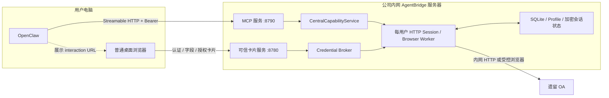

# AgentBridge 当前内网 PoC 部署方案

> 文档日期：2026-07-14
>
> 适用阶段：单用户、受控公司内网、跨机器联调
>
> 安全定位：临时 PoC 方案，不是生产部署基线

> 当前部署判断：网络拓扑和私网 HTTP 支持已经具备，但 Linux 会话状态
> 保护器尚未实现。完成该项代码与测试前，方案处于“可实施设计、不可正式启动”状态。

## 1. 方案结论

当前采用“用户电脑运行智能体宿主，内网服务器集中运行 AgentBridge”的部署方式：

- 用户电脑运行 OpenClaw 和普通桌面浏览器；
- 公司内网另一台 Linux 机器运行 AgentBridge；
- AgentBridge 通过中心 HTTP Session 和受控 Playwright Browser Worker 访问 OA；
- 用户电脑不安装 Chrome 扩展、本地 Daemon 或 OA 连接器；
- OpenClaw 通过 Streamable HTTP MCP 调用 AgentBridge；
- 登录、业务字段填写和写操作授权通过 AgentBridge 可信卡片完成；
- 当前 PoC 使用固定私网 IP 和 HTTP，不要求域名与 HTTPS 证书；
- 非回环 HTTP 必须显式使用 `--allow-insecure-private-http`，默认安全策略仍要求 TLS。

示例地址如下，部署时必须将 `10.20.30.40` 替换为 AgentBridge 服务器的真实固定私网 IP：

| 服务 | 地址 | 调用方 |
| --- | --- | --- |
| AgentBridge MCP | `http://10.20.30.40:8790/mcp` | 用户电脑上的 OpenClaw |
| 可信卡片服务 | `http://10.20.30.40:8780` | 用户电脑上的普通浏览器 |
| OA | 由 `oa` 系统配置确定 | AgentBridge 中心 Worker |

## 2. 部署拓扑



这不是远程桌面方案。用户只在可信卡片中输入信息，远端 Browser Worker 在服务器上完成真实 OA 登录和业务操作。

## 3. 组件放置

### 3.1 用户电脑

保留以下组件：

- OpenClaw；
- 用户日常使用的普通浏览器；
- OpenClaw 保存的 AgentBridge MCP Bearer Token。

用户电脑不再部署：

- BSCLI Chrome 扩展；
- localhost 浏览器桥接服务；
- AgentBridge Daemon；
- Playwright OA Profile；
- OA Cookie 或 Session 文件。

### 3.2 AgentBridge 服务器

集中运行：

- MCP 服务；
- 认证卡、业务字段卡和执行授权卡服务；
- Credential Broker；
- CentralCapabilityService；
- 每用户 HTTP Session；
- 每用户 Playwright Profile 和 Browser Worker；
- SQLite 操作、身份、交互、字段和授权账本；
- Linux 加密的 OA 会话状态。

当前代码的会话保护器只有 Windows DPAPI 实现。Linux 上
`SessionStateStore` 会以 `no session-state protector is configured for this
operating system` 失败关闭。因此，**实现 Linux 会话状态保护器是部署前置门槛**；
不能把 Cookie 降级保存为明文 `storage_state.json`。

PoC 的 Linux 保护器采用以下边界：

- 使用经过审计的 AEAD 实现，例如 `cryptography` 的 AES-256-GCM；
- 主密钥由 Linux CSPRNG 生成，保存在服务端受限密钥文件或 systemd credential 中；
- 密钥不进入仓库、环境日志、SQLite、Profile 或 OpenClaw；
- 会话 ID 作为附加认证数据，密文使用带版本的信封格式；
- 缺少密钥、权限错误、认证失败或密文损坏时必须失败关闭；
- AgentBridge 始终由固定 Linux 服务用户运行；
- 生产阶段再迁移到 Vault/KMS，并增加轮换和撤销。

## 4. 网络与安全边界

### 4.1 当前允许的网络形态

- AgentBridge 服务器使用固定 RFC 1918 私网 IP，或 IPv6 ULA 地址；
- OpenClaw 用户电脑能够路由到该地址；
- AgentBridge 服务器能够访问 OA；
- TCP 8790 和 8780 只允许预定的 OpenClaw 用户电脑访问；
- 不做公网映射，不通过互联网、访客 Wi-Fi 或不受控网络访问。

显式私网 HTTP 模式会拒绝：

- `0.0.0.0` 等通配绑定；
- 主机名或域名；
- 公网 IP；
- URL 路径；
- 绑定 IP、公开 IP 或端口不一致。

### 4.2 已接受的 PoC 风险

HTTP 模式下，下列数据在内网链路上没有 TLS 加密：

- MCP Bearer Token；
- OA 账号、密码和验证码；
- 可信业务字段；
- 写操作授权卡片的交互流量。

主机防火墙只能缩小暴露面，不能代替链路加密。因此该模式仅用于尽快验证跨机器拓扑，不进入生产环境。

### 4.3 仍然有效的应用层保护

- MCP 调用必须携带服务端签发并绑定用户身份的 Bearer Token；
- 可信卡片具有 Host、Origin、CSRF、nonce、TTL 和一次性消费校验；
- 凭据和可信业务字段不进入模型上下文或 MCP Tool 参数；
- 写操作仍执行 `prepare -> authorize -> commit -> verify`；
- 服务不会回退到已退役的浏览器扩展或本地桥接路径。

## 5. 服务器准备

### 5.1 基础条件

- 支持 systemd 的 Linux 发行版；
- Python 3.12 或更高版本；
- 固定私网 IP；
- 到 OA 的网络连通性；
- 一个固定、受限的 Linux 服务用户；
- 足够空间保存浏览器运行时、用户 Profile 和状态目录。

建议目录：

```text
/opt/agentbridge/cli-helper    # 程序目录
/var/lib/agentbridge           # --home 状态目录
/etc/agentbridge               # 受限配置与 PoC 密钥目录
```

状态目录包含：

```text
/var/lib/agentbridge/
├─ systems/                  # 遗留系统配置
├─ agentbridge.db            # 操作、身份和交互账本
├─ profiles/                 # 每用户受控浏览器 Profile
└─ session-secrets/          # AEAD 加密的会话状态
```

状态目录不能放在普通 NFS/SMB 共享盘中，也不能授权给 OpenClaw 用户电脑直接读取。

### 5.2 Linux 会话保护前置项

部署前必须先完成代码改造，使 `SessionStateStore` 在 Linux 上接受一个显式、
失败关闭的保护器。PoC 约定的配置接口为：

```text
AGENTBRIDGE_SESSION_KEY_FILE=/etc/agentbridge/session.key
```

该接口和 Linux AEAD 保护器当前尚未实现，不能提前把下面命令当作已验证部署步骤。实现完成后至少验证：

- 同一密钥、同一会话上下文能够跨进程重启解密；
- 错误密钥、错误会话上下文和被篡改密文全部失败；
- 状态文件中不存在 Cookie 明文；
- 缺少密钥文件或权限错误时服务拒绝启动；
- Windows DPAPI 路径和已有测试不受影响。

### 5.3 获取并安装

一次性创建服务用户和目录，具体用户管理命令可按 Linux 发行版调整：

```bash
sudo useradd --system --create-home \
  --home-dir /var/lib/agentbridge \
  --shell /usr/sbin/nologin agentbridge
sudo install -d -o root -g agentbridge -m 0750 /opt/agentbridge
sudo install -d -o agentbridge -g agentbridge -m 0750 /var/lib/agentbridge

sudo install -d -o root -g agentbridge -m 0750 /etc/agentbridge
sudo openssl rand -out /etc/agentbridge/session.key 32
sudo chown root:agentbridge /etc/agentbridge/session.key
sudo chmod 0440 /etc/agentbridge/session.key

sudo git clone git@github.com:guomxin/cli-helper.git \
  /opt/agentbridge/cli-helper

sudo python3.12 -m venv \
  /opt/agentbridge/cli-helper/.venv
sudo /opt/agentbridge/cli-helper/.venv/bin/python \
  -m pip install -e /opt/agentbridge/cli-helper

sudo /opt/agentbridge/cli-helper/.venv/bin/python \
  -m playwright install-deps chromium
sudo -u agentbridge /opt/agentbridge/cli-helper/.venv/bin/python \
  -m playwright install chromium
```

不得在镜像、Git、备份日志或命令输出中暴露会话密钥。密钥丢失意味着已有 OA 会话无法恢复，应重新认证，而不是绕过解密校验。

如果部署服务器不能直接访问 GitHub，应通过受控发布包交付代码，不要复制开发机的 `.bscli`、Profile、Cookie 或会话密钥。

### 5.4 初始化 OA 配置

以下命令必须在 Linux 保护器实现并通过测试后执行：

```bash
AB_PY=/opt/agentbridge/cli-helper/.venv/bin/python
AB_HOME=/var/lib/agentbridge

sudo -u agentbridge "$AB_PY" -m bscli.cli.main \
  --home "$AB_HOME" system init-seeyon-oa
sudo -u agentbridge "$AB_PY" -m bscli.cli.main \
  --home "$AB_HOME" system status oa
sudo -u agentbridge "$AB_PY" -m bscli.cli.main \
  --home "$AB_HOME" capability list
```

如 OA 地址与项目默认配置不同，应使用 `system add` 创建正确的 `oa` 配置后再启动服务。

## 6. 用户身份与 MCP Token

每个 OpenClaw 用户使用独立 Token。Token 在 AgentBridge 服务端绑定：

- 稳定的 `user-subject`；
- 预期 OA 显示身份；
- MCP Scope；
- 有效期与撤销状态。

签发具有读取和草稿写入权限的 24 小时 PoC Token：

```bash
AB_PY=/opt/agentbridge/cli-helper/.venv/bin/python
AB_HOME=/var/lib/agentbridge
USER_SUBJECT="user-a"
OA_PRINCIPAL="OA显示姓名"

sudo -u agentbridge "$AB_PY" -m bscli.cli.main \
  --home "$AB_HOME" mcp token issue \
  --user-subject "$USER_SUBJECT" \
  --expected-principal "$OA_PRINCIPAL" \
  --scope oa:write:draft \
  --ttl-hours 24
```

只读联调时省略 `--scope oa:write:draft`。`bearerToken` 只显示一次，应直接写入 OpenClaw 的可信秘密配置，不要发到聊天、普通日志或文档中。

管理命令：

```bash
TOKEN_ID="需要撤销的token-id"

sudo -u agentbridge "$AB_PY" -m bscli.cli.main \
  --home "$AB_HOME" mcp token list
sudo -u agentbridge "$AB_PY" -m bscli.cli.main \
  --home "$AB_HOME" mcp token revoke "$TOKEN_ID"
```

## 7. 防火墙配置

在 AgentBridge 服务器上，仅允许 OpenClaw 用户电脑的固定 IP 访问两个端口。选择服务器正在使用的防火墙管理器，不要同时套用下面两组示例。

UFW 示例：

```bash
OPENCLAW_IP=10.20.30.50
sudo ufw allow from "$OPENCLAW_IP" to any port 8780 proto tcp
sudo ufw allow from "$OPENCLAW_IP" to any port 8790 proto tcp
```

firewalld 示例：

```bash
OPENCLAW_IP=10.20.30.50
sudo firewall-cmd --permanent --add-rich-rule="rule family=\"ipv4\" source address=\"${OPENCLAW_IP}/32\" port port=\"8780\" protocol=\"tcp\" accept"
sudo firewall-cmd --permanent --add-rich-rule="rule family=\"ipv4\" source address=\"${OPENCLAW_IP}/32\" port port=\"8790\" protocol=\"tcp\" accept"
sudo firewall-cmd --reload
```

还应检查是否存在覆盖范围更大的旧入站规则。不要为了省事把端口开放给整个公司网段。

## 8. 启动 AgentBridge

### 8.1 前台联调

Linux 会话保护器完成后，初次联调先以前台进程启动，便于看到配置错误和安全告警：

```bash
AB_PY=/opt/agentbridge/cli-helper/.venv/bin/python
AB_HOME=/var/lib/agentbridge
AB_IP=10.20.30.40

sudo -u agentbridge env \
  AGENTBRIDGE_SESSION_KEY_FILE=/etc/agentbridge/session.key \
  "$AB_PY" -m bscli.cli.main --home "$AB_HOME" mcp central-serve \
  --host "$AB_IP" \
  --port 8790 \
  --public-base-url "http://${AB_IP}:8790" \
  --auth-host "$AB_IP" \
  --auth-port 8780 \
  --auth-public-base-url "http://${AB_IP}:8780" \
  --allow-insecure-private-http
```

正常启动时，标准输出中的 JSON 应至少包含：

```json
{
  "status": "serving",
  "mcpUrl": "http://10.20.30.40:8790/mcp",
  "authCardBaseUrl": "http://10.20.30.40:8780",
  "insecurePrivateHttp": true
}
```

标准错误会明确警告凭据、字段和 Token 未受 TLS 保护。这是预期行为，不能通过隐藏告警来解决。

### 8.2 systemd 托管

前台完成登录、读取和重启恢复验证后，再创建
`/etc/systemd/system/agentbridge.service`：

```ini
[Unit]
Description=AgentBridge central MCP and trusted cards
After=network-online.target
Wants=network-online.target

[Service]
Type=simple
User=agentbridge
Group=agentbridge
WorkingDirectory=/opt/agentbridge/cli-helper
Environment=HOME=/var/lib/agentbridge
Environment=PYTHONUNBUFFERED=1
Environment=AGENTBRIDGE_SESSION_KEY_FILE=/etc/agentbridge/session.key
ExecStart=/opt/agentbridge/cli-helper/.venv/bin/python \
  -m bscli.cli.main --home /var/lib/agentbridge mcp central-serve \
  --host 10.20.30.40 --port 8790 \
  --public-base-url http://10.20.30.40:8790 \
  --auth-host 10.20.30.40 --auth-port 8780 \
  --auth-public-base-url http://10.20.30.40:8780 \
  --allow-insecure-private-http
Restart=on-failure
RestartSec=5
UMask=0077
NoNewPrivileges=true
PrivateTmp=true
ProtectSystem=strict
ReadWritePaths=/var/lib/agentbridge

[Install]
WantedBy=multi-user.target
```

将示例 IP 替换为服务器真实固定私网 IP，然后执行：

```bash
sudo systemctl daemon-reload
sudo systemctl enable --now agentbridge
sudo systemctl status agentbridge
sudo journalctl -u agentbridge -f
```

Playwright/Chromium 与上述 systemd 加固项需要在目标 Linux 发行版上验证；遇到限制时应逐项定位所需权限，不应直接移除全部隔离设置。

## 9. OpenClaw 接入

OpenClaw 侧需要配置以下连接信息：

| 配置项 | 值 |
| --- | --- |
| MCP Transport | Streamable HTTP |
| MCP URL | `http://10.20.30.40:8790/mcp` |
| HTTP Header | `Authorization: Bearer <bearerToken>` |
| 可信卡片地址 | 无需静态配置，由 interaction 动态返回 |

当前仓库已提供 `render_openclaw_interaction`，可将宿主无关的 interaction envelope 转为 OpenClaw presentation、URL/Web App 按钮和轮询契约。但可安装的 OpenClaw 插件及自动配置流程尚未完成，因此首次跨机部署需要完成一次 OpenClaw 侧接线验证。

OpenClaw 不应要求用户在聊天里回复密码、业务字段或“同意执行”。这些内容必须在可信卡片中完成。

## 10. 首次联调流程

### 10.1 网络检查

在 OpenClaw 用户电脑执行：

```powershell
$AgentBridgeIp = "10.20.30.40"
Test-NetConnection $AgentBridgeIp -Port 8790
Test-NetConnection $AgentBridgeIp -Port 8780
```

两个端口都应显示 `TcpTestSucceeded: True`。其他未授权电脑应无法连接。

### 10.2 MCP 与登录验证

按以下顺序验证：

1. OpenClaw 连接 MCP 并读取工具列表；
2. 调用 `oa_session_login`；
3. 如果 OA 会话不存在，AgentBridge 返回 `requires_user_action` 和认证 interaction；
4. OpenClaw 在私聊中显示卡片按钮；
5. 用户用普通浏览器打开卡片并输入 OA 登录信息；
6. AgentBridge 后台轮询 interaction，完成后调用 `agentbridge_interaction_resume`；
7. 调用 `oa_workflow_pending_list`，验证能够读取当前用户真实待办；
8. 核对返回身份、执行通道和操作账本，确认没有使用浏览器桥接。

如果 `oa_session_login` 直接返回 `succeeded` 和 `reused=true`，说明中心会话仍然有效，不应再次要求用户登录。

### 10.3 重启恢复验证

首次登录成功后：

1. 正常停止 AgentBridge；
2. 使用同一个 Linux 服务用户、同一个 `--home` 和同一个会话密钥重新启动；
3. 再次调用 `oa_session_login` 或只读工具；
4. 确认 AEAD 加密会话被恢复，没有无故生成新认证卡。

如果服务用户无权读取密钥，或密钥与原密钥不同，会话必须失败关闭。此时应恢复正确的服务身份和密钥挂载，不要删除状态目录、覆盖密文或绕过校验。

## 11. 写操作验证原则

跨机部署首先完成只读验证。写操作另行选择明确、低风险的测试事项，并继续遵守：

```text
业务能力请求
  -> 业务字段卡
  -> 冻结执行计划
  -> 独立授权卡
  -> commit
  -> OA 服务器状态回读验证
```

当前正式纵切是“出差申请单保存待发草稿”，不提交工作流。必须由用户明确同意测试，且不能因为跨机部署成功就自动扩大写操作范围。

## 12. 会话所有权

当前 OA 可能只允许同一账号保持一个登录会话。PoC 期间应把中心 AgentBridge 作为该 OA 会话的主要所有者：

- AgentBridge 登录后，用户默认 Chrome 中的 OA 可能被踢下线；
- 用户再次在默认 Chrome 登录 OA，也可能使 AgentBridge 会话失效；
- `LOGIN_REQUIRED` 表示 OA 已确认会话失效；
- `SESSION_CHECK_UNAVAILABLE` 表示暂时无法核验，不应让用户重新输入密码；
- 卡片 TTL 过期只影响本次交互，不会主动清除已经有效的 OA 会话。

## 13. 常见问题定位

| 现象 | 检查与处理 |
| --- | --- |
| 启动提示 `requires TLS` | 缺少 `--allow-insecure-private-http`，或仍在使用默认非回环安全策略 |
| 启动提示私网地址无效 | 必须绑定服务器真实固定私网 IP，不能使用 `0.0.0.0`、域名或错配端口 |
| OpenClaw 无法连接 MCP | 检查路由、防火墙、8790 监听和 MCP URL |
| MCP 返回 401 | 检查 Bearer Token 是否完整、过期、撤销或绑定错误 |
| 卡片链接打不开 | 检查 8780、防火墙和 interaction 中返回的 IP 是否是用户电脑可达地址 |
| 内置浏览器无法输入 | 使用 OpenClaw 提供的 URL 在普通浏览器中打开；AgentBridge 不依赖内置浏览器输入 |
| Linux 启动时报 `no session-state protector` | Linux 会话保护器尚未实现；这是当前部署阻塞项，不能改用明文 Cookie |
| 每次都要求登录 | 检查 OA 是否被其他浏览器重新登录、服务用户、密钥文件或 `--home` 是否变化 |
| `SESSION_RUNTIME_MISMATCH` 或解密失败 | 恢复原 Linux 服务用户和正确密钥，不要删除或替换已有会话状态 |
| `SESSION_CHECK_UNAVAILABLE` | 检查 OA 网络并重试，不要创建新认证挑战 |

## 14. 验收清单

- [ ] AgentBridge 服务器使用固定私网 IP；
- [ ] 服务器到 OA 网络可达；
- [ ] Linux AEAD 会话保护器及失败关闭测试已经完成；
- [ ] AgentBridge 始终由固定 Linux 服务用户运行；
- [ ] 会话密钥文件仅允许 root 和 AgentBridge 服务组读取；
- [ ] 8780/8790 只对指定 OpenClaw 电脑开放；
- [ ] MCP 启动 JSON 中 URL 与实际 IP、端口完全一致；
- [ ] OpenClaw 能通过 Bearer Token读取 MCP 工具列表；
- [ ] 认证卡从 OpenClaw 私聊打开，凭据没有进入聊天；
- [ ] `oa_workflow_pending_list` 读取真实 OA 数据成功；
- [ ] AgentBridge 重启后能用同一服务用户和密钥恢复会话；
- [ ] 错误密钥、篡改密文和无权限用户都不能解密会话；
- [ ] 未授权电脑不能访问 8780/8790；
- [ ] 日志、操作账本和 OpenClaw 对话中没有密码、Cookie 或可信字段；
- [ ] 未经单独确认，没有执行 OA 写操作。

## 15. 当前完成度

| 项目 | 状态 |
| --- | --- |
| 中心 AgentBridge、Credential Broker 和可信卡片 | 已实现 |
| Streamable HTTP MCP 与 Bearer 身份绑定 | 已实现 |
| 固定私网 IP HTTP 显式开关 | 已实现 |
| 通配地址、公网地址和端点错配拒绝 | 已实现并有自动测试 |
| MCP SDK 私网 Host 与认证请求 | 已自动验证 |
| Linux AEAD 会话状态保护器 | **未实现，当前部署阻塞项** |
| 单用户中心会话与真实 OA 纵切 | 已验证 |
| OpenClaw interaction renderer 合约 | 已实现并做本地兼容检查 |
| OpenClaw 与另一台 AgentBridge 服务器真实跨机联调 | 待执行 |
| 可安装 OpenClaw 插件与自动接线 | 待实现 |
| 第二个真实 OA 用户隔离验证 | 待执行 |
| Linux systemd 服务化运行 | 待实现保护器后验证 |
| 域名、HTTPS、OIDC、Vault/KMS | 生产阶段待实现 |

## 16. 后续演进顺序

1. 实现 Linux AEAD 会话保护器、密钥文件配置和失败关闭测试；
2. 按本文完成本机 OpenClaw 与内网 Linux AgentBridge 服务器的真实跨机只读联调；
3. 固化 OpenClaw MCP 配置和 interaction renderer 的安装方式；
4. 在同一固定 Linux 服务身份下完成 systemd 托管与重启恢复验证；
5. 使用第二个真实 OA 用户验证 Token、Profile、Cookie、下载和日志隔离；
6. 再扩充工作流写能力，并逐流程完成真实回读验证；
7. 生产前增加域名、TLS、正式 OAuth/OIDC、限流、审计和 Vault/KMS；
8. TLS 完成后删除部署环境中的私网明文例外，不把 PoC 开关长期保留为运维捷径。
