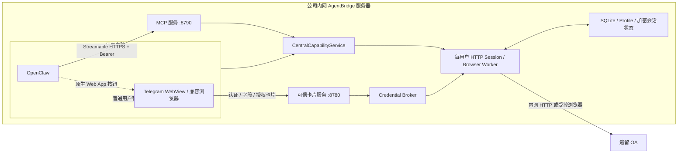

# AgentBridge 当前内网 PoC 部署方案

> 文档日期：2026-08-03
>
> 适用阶段：双用户、受控公司内网、跨机器联调
>
> 安全定位：临时 PoC 方案，不是生产部署基线

> 当前部署判断：固定私网 IP HTTPS、专用内部 CA、Linux AES-256-GCM
> 会话保护器和 Telegram Web App 卡片均已部署；OpenClaw HTTPS MCP 与真实 OA
> 读写链路已通过分阶段验证。正式根 CA 已导入 Windows 当前用户信任库，认证、业务字段和
> 执行授权三类卡片均已在 Telegram 和微信私聊链路实测；插件 0.4.16 为当前代码版本。
> 中心端当前定义 69 个 MCP 工具。OpenClaw 已绑定会话的模型目录包含 40 个
> AgentBridge 业务工具和 1 个本地身份状态工具；其余 29 个中央工具是 commit、
> continuation、Task Hub、Workspace 与多端通知等协调器/可信宿主私有能力，不向模型注册。
> 静态业务字段卡统一支持
> 对话已知值预填；出差和请假提交撤销已闭环，补签与劳动合同续签已有专用接收处理能力。
> 当前两个 OpenClaw 身份各自使用独立 Token。`guomao` 包含 OA 读取、草稿、审批、
> 会议、正式提交、撤销及已开通的泰华/语雀权限；`lishiyu` 只包含 OA 读取、草稿、
> 审批、正式提交和撤销，不含会议、泰华或语雀权限。权限本身不代表自动执行，所有
> OA 业务写入仍要求针对精确事项的独立可信授权。

## 1. 方案结论

当前采用“用户电脑运行智能体宿主，内网服务器集中运行 AgentBridge”的部署方式：

- 用户电脑运行 OpenClaw、Telegram Desktop 和必要时使用的普通桌面浏览器；
- 公司内网另一台 Linux 机器运行 AgentBridge；
- AgentBridge 通过中心 HTTP Session 和受控 Playwright Browser Worker 访问 OA；
- 用户电脑不安装 Chrome 扩展、本地 Daemon 或 OA 连接器；
- OpenClaw 通过 Streamable HTTPS MCP 调用 AgentBridge；
- 普通用户可通过独立 Agent Workspace 网页端使用与聊天端一致的读取、受治理写入和
  Task Hub；
- 登录、业务字段填写和写操作授权通过 AgentBridge 可信卡片完成；
- Telegram 对三类 HTTPS 卡片使用原生 Web App 按钮，在应用内 WebView 中展示；
- 当前 PoC 使用固定私网 IP、HTTPS 和专用内部 CA，不要求域名或公网证书；
- 已部署服务不启用 `--allow-insecure-private-http`，8780/8782/8783/8790 的明文 HTTP 均被拒绝。

当前目标服务器为 `10.10.50.213`：

| 服务 | 地址 | 调用方 |
| --- | --- | --- |
| AgentBridge MCP | `https://10.10.50.213:8790/mcp` | 用户电脑上的 OpenClaw |
| 可信卡片服务 | `https://10.10.50.213:8780` | Telegram 应用内 WebView；普通浏览器仅作兼容入口 |
| 管理控制台 | `https://10.10.50.213:8782` | 受信管理员与审计员浏览器 |
| Agent Workspace | `https://10.10.50.213:8783` | 普通用户桌面或手机浏览器 |
| OA | 由 `oa` 系统配置确定 | AgentBridge 中心 Worker |

## 2. 部署拓扑


```mermaid
flowchart LR
    subgraph U["用户电脑"]
        O["OpenClaw"]
        B["Telegram WebView / 兼容浏览器"]
    end

    subgraph S["公司内网 AgentBridge 服务器"]
        M["MCP 服务 :8790"]
        C["可信卡片服务 :8780"]
        U["Agent Workspace :8783"]
        A["CentralCapabilityService"]
        R["Credential Broker"]
        W["每用户 HTTP Session / Browser Worker"]
        D["SQLite / Profile / 加密会话状态"]
    end

    OA["遗留 OA"]

    O -->|"Streamable HTTPS + Bearer"| M
    O -.->|"原生 Web App 按钮"| B
    B -->|"认证 / 字段 / 授权卡片"| C
    B -->|"普通用户智能体网页"| U
    M --> A
    U --> A
    C --> R
    A --> W
    R --> W
    W <--> D
    W -->|"内网 HTTP 或受控浏览器"| OA
```

这不是远程桌面方案。用户只在可信卡片中输入信息，远端 Browser Worker 在服务器上完成真实 OA 登录和业务操作。

## 3. 组件放置

### 3.1 用户电脑

保留以下组件：

- OpenClaw；
- Telegram Desktop；
- 用户日常使用的普通浏览器；
- OpenClaw 保存的 AgentBridge MCP Bearer Token。
- AgentBridge 内部根 CA 公钥；根私钥不进入用户电脑的应用配置。

用户电脑不再部署：

- BSCLI Chrome 扩展；
- localhost 浏览器桥接服务；
- AgentBridge Daemon；
- Playwright OA Profile；
- OA Cookie 或 Session 文件。

### 3.2 AgentBridge 服务器

集中运行：

- MCP 服务；
- 认证卡、业务字段卡和执行授权卡服务；
- Credential Broker；
- CentralCapabilityService；
- 每用户 HTTP Session；
- 每用户 Playwright Profile 和 Browser Worker；
- SQLite 操作、身份、交互、字段和授权账本；
- Linux 加密的 OA 会话状态。

Linux 会话状态保护器已经实现并在 `10.10.50.213` 验证。Cookie 不会降级保存为明文 `storage_state.json`。当前保护边界为：

- 使用 `cryptography` 的 AES-256-GCM；
- 主密钥由 Linux CSPRNG 生成，保存在服务端受限密钥文件或 systemd credential 中；
- 密钥不进入仓库、环境日志、SQLite、Profile 或 OpenClaw；
- 会话 ID 作为附加认证数据，密文使用带版本的信封格式；
- 缺少密钥、权限错误、认证失败或密文损坏时必须失败关闭；
- 拒绝相对路径、符号链接、非普通文件和过宽权限；
- AgentBridge 始终由固定 Linux 服务用户运行；
- 生产阶段再迁移到 Vault/KMS，并增加轮换和撤销。

## 4. 网络与安全边界

### 4.1 当前允许的网络形态

- AgentBridge 服务器使用固定 RFC 1918 私网 IP，或 IPv6 ULA 地址；
- OpenClaw 用户电脑能够路由到该地址；
- AgentBridge 服务器能够访问 OA；
- TCP 8790 和 8780 在公司内网可达，当前不调整 Linux 主机防火墙；
- 不做公网映射，不通过互联网、访客 Wi-Fi 或不受控网络访问。

当前 HTTPS 部署要求：

- 叶证书 SAN 必须包含固定私网 IP `10.10.50.213`；
- MCP 与卡片服务使用同一受控证书包，但分别监听 8790 和 8780；
- Linux 只保存叶证书与叶私钥，不保存根 CA 私钥；
- Windows 管理工作站只以当前用户 DPAPI 密文保存根私钥；
- 明文 HTTP 连接被 TLS 监听器拒绝，不允许自动降级。

### 4.2 已接受的 PoC 风险

当前假定 Linux 主机防火墙处于关闭状态，不把 UFW/firewalld 配置作为首次
PoC 前置步骤。这意味着所有能够路由到服务器的内网主机理论上都能发起
8780/8790 的 TLS 连接；Bearer、短期卡片令牌和应用层校验仍负责业务授权，
但不能代替来源 ACL。内部 CA 的分发、撤销和续期目前也是人工运维流程。

因此当前部署已经消除内网明文传输，但仍不是生产安全基线。生产化仍需企业
PKI 或集中证书生命周期、OAuth/OIDC、令牌轮换、限流、审计和 Vault/KMS。

### 4.3 仍然有效的应用层保护

- MCP 调用必须携带服务端签发并绑定用户身份的 Bearer Token；
- 可信卡片具有 Host、Origin、CSRF、nonce、TTL 和一次性消费校验；
- 凭据和可信业务字段不进入模型上下文或 MCP Tool 参数；
- 写操作仍执行 `prepare -> authorize -> commit -> verify`；
- 服务不会回退到已退役的浏览器扩展或本地桥接路径。

## 5. 服务器准备

### 5.1 基础条件

- 支持 systemd 的 Linux 发行版；
- Python 3.12 或更高版本；
- 固定私网 IP；
- 到 OA 的网络连通性；
- 一个固定、受限的 Linux 服务用户；
- 足够空间保存浏览器运行时、用户 Profile 和状态目录。

目标机使用用户指定的部署根目录：

```text
/home/guomao/agentbridge/
├─ app/                       # root 管理的程序目录
├─ venv/                      # root 管理的 Python 虚拟环境
├─ data/                      # agentbridge 服务用户可写的 --home
└─ config/
   └─ session.key             # root:agentbridge 0440 的 32 字节密钥
```

状态目录包含：

```text
/home/guomao/agentbridge/data/
├─ systems/                  # 遗留系统配置
├─ agentbridge.db            # 操作、身份和交互账本
├─ profiles/                 # 每用户受控浏览器 Profile
└─ session-secrets/          # AEAD 加密的会话状态
```

状态目录不能放在普通 NFS/SMB 共享盘中，也不能授权给 OpenClaw 用户电脑直接读取。

### 5.2 Linux 会话保护

Linux `SessionStateStore` 通过以下环境变量加载密钥：

```text
AGENTBRIDGE_SESSION_KEY_FILE=/home/guomao/agentbridge/config/session.key
```

该保护器已在目标 Ubuntu 24.04 机器验证：

- 同一密钥、同一会话上下文能够跨进程重启解密；
- 错误密钥、错误会话上下文和被篡改密文全部失败；
- 状态文件中不存在 Cookie 明文；
- 缺少密钥文件或权限错误时服务拒绝启动；
- Windows DPAPI 路径和已有测试不受影响。

目标机 Linux 专项测试 6 项全部通过；全量 170 项通过，只有 1 项 Windows DPAPI 专属测试按平台跳过。

### 5.3 获取并安装

目标机没有名为 `guomao` 的 Linux 用户，但 `/home/guomao/agentbridge` 已由
root 预建且为空。运行时创建独立的 `agentbridge` 系统用户，不以 root 运行浏览器和凭据代理，也不改变 `/home/guomao` 其他内容的所有权。

```bash
sudo useradd --system --no-create-home \
  --home-dir /home/guomao/agentbridge/data \
  --shell /usr/sbin/nologin agentbridge
sudo install -d -o root -g agentbridge -m 0750 \
  /home/guomao/agentbridge \
  /home/guomao/agentbridge/app \
  /home/guomao/agentbridge/config
sudo install -d -o agentbridge -g agentbridge -m 0750 \
  /home/guomao/agentbridge/data

sudo openssl rand -out /home/guomao/agentbridge/config/session.key 32
sudo chown root:agentbridge /home/guomao/agentbridge/config/session.key
sudo chmod 0440 /home/guomao/agentbridge/config/session.key

# 将已验证提交的受控源码归档解压到 app/ 后执行：
sudo python3.12 -m venv /home/guomao/agentbridge/venv
sudo /home/guomao/agentbridge/venv/bin/python \
  -m pip install /home/guomao/agentbridge/app

sudo /home/guomao/agentbridge/venv/bin/python \
  -m playwright install-deps chromium
sudo -u agentbridge env HOME=/home/guomao/agentbridge/data \
  /home/guomao/agentbridge/venv/bin/python -m playwright install chromium
```

不得在镜像、Git、备份日志或命令输出中暴露会话密钥。密钥丢失意味着已有 OA 会话无法恢复，应重新认证，而不是绕过解密校验。

如果部署服务器不能直接访问 GitHub，应通过受控发布包交付代码，不要复制开发机的 `.bscli`、Profile、Cookie 或会话密钥。

### 5.4 初始化 OA 配置

```bash
AB_PY=/home/guomao/agentbridge/venv/bin/python
AB_HOME=/home/guomao/agentbridge/data

sudo -u agentbridge "$AB_PY" -m bscli.cli.main \
  --home "$AB_HOME" system init-seeyon-oa
sudo -u agentbridge "$AB_PY" -m bscli.cli.main \
  --home "$AB_HOME" system status oa
sudo -u agentbridge "$AB_PY" -m bscli.cli.main \
  --home "$AB_HOME" capability list
```

如 OA 地址与项目默认配置不同，应使用 `system add` 创建正确的 `oa` 配置后再启动服务。

## 6. 用户身份与 MCP Token

每个 OpenClaw 用户使用独立 Token。Token 在 AgentBridge 服务端绑定：

- 稳定的 `user-subject`；
- 预期 OA 显示身份；
- MCP Scope；
- 有效期与撤销状态。

签发具有读取和草稿写入权限的 24 小时 PoC Token：

```bash
AB_PY=/home/guomao/agentbridge/venv/bin/python
AB_HOME=/home/guomao/agentbridge/data
USER_SUBJECT="guomao"
OA_PRINCIPAL="辛国茂"

sudo -u agentbridge "$AB_PY" -m bscli.cli.main \
  --home "$AB_HOME" mcp token issue \
  --user-subject "$USER_SUBJECT" \
  --expected-principal "$OA_PRINCIPAL" \
  --scope oa:write:draft \
  --ttl-hours 24
```

只读联调时省略 `--scope oa:write:draft`。`bearerToken` 只显示一次，应直接写入 OpenClaw 的可信秘密配置，不要发到聊天、普通日志或文档中。

管理命令：

```bash
TOKEN_ID="需要撤销的token-id"

sudo -u agentbridge "$AB_PY" -m bscli.cli.main \
  --home "$AB_HOME" mcp token list
sudo -u agentbridge "$AB_PY" -m bscli.cli.main \
  --home "$AB_HOME" mcp token revoke "$TOKEN_ID"
```

## 7. 网络连通性

当前阶段不修改 Linux 主机防火墙，也不执行 UFW/firewalld 命令。部署前只确认：

- 服务器固定私网 IP 能从 OpenClaw 用户电脑访问；
- 8780/8790 没有通过 NAT、端口转发或反向代理暴露到公网；
- 公司内网边界不会把这两个端口转发到不受控网络；
- 如果目标服务器实际启用了主机防火墙，不要直接关闭，应由运维按现状放通所需来源。

待跨机 PoC 验证完成后，再根据公司网络现状决定是否增加主机防火墙或上游 ACL；这属于加固项，不阻塞首次联调。

### 7.1 内部 CA 与私网 IP 证书

在运行 OpenClaw 的 Windows 管理工作站签发证书。根私钥只以当前用户
DPAPI 密文保存在 `%USERPROFILE%\.agentbridge\pki`，签发时短暂进入内存；
Linux 服务器只接收叶证书与叶私钥，Git 仓库不保存任何私钥：

```powershell
$PkiState = "$env:USERPROFILE\.agentbridge\pki"
$TlsPackage = Join-Path $env:TEMP "agentbridge-tls"

python -m bscli.cli.main pki issue-server `
  --ip 10.10.50.213 `
  --state-dir $PkiState `
  --output-dir $TlsPackage

Import-Certificate `
  -FilePath "$PkiState\root-ca.crt" `
  -CertStoreLocation Cert:\CurrentUser\Root
openclaw config set env.vars.NODE_EXTRA_CA_CERTS "$PkiState\root-ca.crt"
```

根 CA 默认有效 10 年，叶证书最长 397 天。续期复用同一 DPAPI 根状态并使用
`--force` 重新签发叶证书。不要把 `root-ca.key.dpapi` 复制给其他 Windows 用户；
它只能由创建它的 Windows 安全主体解密。

将 `$TlsPackage\server.crt` 和 `$TlsPackage\server.key` 上传到临时目录后，
在 Linux 上安装为：

```bash
sudo install -d -m 0750 -o root -g agentbridge /home/guomao/agentbridge/config/tls
sudo install -m 0644 -o root -g agentbridge server.crt /home/guomao/agentbridge/config/tls/server.crt
sudo install -m 0640 -o root -g agentbridge server.key /home/guomao/agentbridge/config/tls/server.key
```

上传与安装完成后删除临时叶私钥副本。根证书是公开信任锚，可以保留在
PKI 状态目录用于 OpenClaw、浏览器和后续客户端安装。

## 8. 启动 AgentBridge

### 8.1 前台联调

初次联调先以前台进程启动，便于看到配置错误：

```bash
AB_PY=/home/guomao/agentbridge/venv/bin/python
AB_HOME=/home/guomao/agentbridge/data
AB_IP=10.10.50.213

sudo -u agentbridge env \
  HOME=/home/guomao/agentbridge/data \
  AGENTBRIDGE_SESSION_KEY_FILE=/home/guomao/agentbridge/config/session.key \
  "$AB_PY" -m bscli.cli.main --home "$AB_HOME" mcp central-serve \
  --host "$AB_IP" \
  --port 8790 \
  --public-base-url "https://${AB_IP}:8790" \
  --tls-cert /home/guomao/agentbridge/config/tls/server.crt \
  --tls-key /home/guomao/agentbridge/config/tls/server.key \
  --auth-host "$AB_IP" \
  --auth-port 8780 \
  --auth-public-base-url "https://${AB_IP}:8780" \
  --auth-tls-cert /home/guomao/agentbridge/config/tls/server.crt \
  --auth-tls-key /home/guomao/agentbridge/config/tls/server.key \
  --admin-host "$AB_IP" \
  --admin-port 8782 \
  --admin-public-base-url "https://${AB_IP}:8782" \
  --admin-tls-cert /home/guomao/agentbridge/config/tls/server.crt \
  --admin-tls-key /home/guomao/agentbridge/config/tls/server.key \
  --session-keepalive-interval 600 \
  --session-keepalive-lease 604800
```

正常启动时，标准输出中的 JSON 应至少包含：

```json
{
  "status": "serving",
  "mcpUrl": "https://10.10.50.213:8790/mcp",
  "authCardBaseUrl": "https://10.10.50.213:8780",
  "adminBaseUrl": "https://10.10.50.213:8782",
  "insecurePrivateHttp": false,
  "sessionKeepalive": {
    "enabled": true,
    "intervalSeconds": 600,
    "activityLeaseSeconds": 604800
  }
}
```

启动输出中的 MCP、卡片与管理台地址必须都是 HTTPS，且不得再出现私网明文警告。

### 8.2 systemd 托管

前台完成登录、读取和重启恢复验证后，再创建
`/etc/systemd/system/agentbridge.service`：

```ini
[Unit]
Description=AgentBridge central MCP and trusted cards
After=network-online.target
Wants=network-online.target

[Service]
Type=simple
User=agentbridge
Group=agentbridge
WorkingDirectory=/home/guomao/agentbridge
Environment=HOME=/home/guomao/agentbridge/data
Environment=PYTHONUNBUFFERED=1
Environment=AGENTBRIDGE_SESSION_KEY_FILE=/home/guomao/agentbridge/config/session.key
EnvironmentFile=-/home/guomao/agentbridge/config/release.env
ExecStart=/home/guomao/agentbridge/venv/bin/python \
  -P -m bscli.cli.main --home /home/guomao/agentbridge/data mcp central-serve \
  --host 10.10.50.213 --port 8790 \
  --public-base-url https://10.10.50.213:8790 \
  --tls-cert /home/guomao/agentbridge/config/tls/server.crt \
  --tls-key /home/guomao/agentbridge/config/tls/server.key \
  --auth-host 10.10.50.213 --auth-port 8780 \
  --auth-public-base-url https://10.10.50.213:8780 \
  --auth-tls-cert /home/guomao/agentbridge/config/tls/server.crt \
  --auth-tls-key /home/guomao/agentbridge/config/tls/server.key \
  --admin-host 10.10.50.213 --admin-port 8782 \
  --admin-public-base-url https://10.10.50.213:8782 \
  --admin-tls-cert /home/guomao/agentbridge/config/tls/server.crt \
  --admin-tls-key /home/guomao/agentbridge/config/tls/server.key \
  --session-keepalive-interval 600 \
  --session-keepalive-lease 604800
Restart=on-failure
RestartSec=5
TimeoutStopSec=20
UMask=0077
NoNewPrivileges=true
PrivateTmp=true
ProtectSystem=strict
ReadOnlyPaths=/home/guomao/agentbridge/config
ReadWritePaths=/home/guomao/agentbridge/data

[Install]
WantedBy=multi-user.target
```

仓库中的可复现单元文件为
`deploy/systemd/agentbridge.service`。修改启动参数时先更新并验证该文件，
再安装到 `/etc/systemd/system/agentbridge.service`，不要只在服务器上做无法追踪的临时修改。

执行：

```bash
sudo systemctl daemon-reload
sudo systemctl enable --now agentbridge
sudo systemctl status agentbridge
sudo journalctl -u agentbridge -f
```

Playwright/Chromium 与上述 systemd 加固项需要在目标 Linux 发行版上验证；遇到限制时应逐项定位所需权限，不应直接移除全部隔离设置。

## 9. 智能体宿主接入

### 9.1 通用远程 MCP

通用智能体宿主优先只配置远程 MCP、TLS 信任和 MCP 身份，不安装 AgentBridge 业务 CLI、浏览器扩展或本地 OA 组件。接入后先调用 `agentbridge_server_profile`，也可以读取 `agentbridge://server/profile` 或使用 `agentbridge_oa_operator` Prompt 获取基本操作边界。

支持 MCP Apps 的宿主会根据工具 `_meta.ui.resourceUri` 加载 `ui://agentbridge/trusted-interaction.html`。完整卡片 envelope 位于宿主私有的 `CallToolResult._meta["io.agentbridge/interaction"]`，模型可见结果中的 URL 已由服务端替换为固定占位符。MCP App 在模型循环之外打开安全页面、轮询、单次续跑，并接住后续卡片。

仅支持核心 MCP 的宿主可以在 OA 会话有效时使用只读能力；遇到登录、字段填写或执行授权时，必须具备 MCP Apps 或经过批准的私有宿主适配器。服务不会把卡片 URL 降级暴露给模型。

当前仍使用管理员签发的 Bearer 和内部 CA，因此“添加 MCP 地址并授权”尚未完全一键化。标准 OAuth 2.1、浏览器身份绑定和每用户独立 OS/容器安全主体仍是后续生产化工作。详细说明见 [远程 MCP 低安装接入](remote-mcp-onboarding.md)。

### 9.2 当前 OpenClaw 兼容适配

OpenClaw 侧需要配置以下连接信息：

| 配置项 | 值 |
| --- | --- |
| MCP Transport | Streamable HTTP |
| MCP URL | `https://10.10.50.213:8790/mcp` |
| HTTP Header | 由插件按可信聊天身份从各自 `tokenEnv` 动态选择 |
| 可信卡片地址 | 无需静态配置，由 interaction 动态返回 |

当前仓库已提供可安装的原生插件 `integrations/openclaw-agentbridge`。插件把宿主无关的 interaction envelope 转为 OpenClaw presentation，在模型看到工具结果前移除短期卡片 URL，只在私聊显示卡片，并在模型循环之外轮询和单次恢复交互。`render_openclaw_interaction` 保留为 Python 参考适配器。

在当前 Windows OpenClaw 用户电脑执行一次显式安装和信任锚配置：

```powershell
openclaw plugins install --link D:\Codes\CLIExp\integrations\openclaw-agentbridge
openclaw config set env.vars.NODE_EXTRA_CA_CERTS "$env:USERPROFILE\.agentbridge\pki\root-ca.crt"
openclaw config set "plugins.entries.agentbridge-interactions.config.mcpUrl" https://10.10.50.213:8790/mcp
openclaw config set "plugins.entries.agentbridge-interactions.config.allowedCardOrigins[0]" https://10.10.50.213:8780
openclaw config set tools.alsoAllow '[\"agentbridge-interactions\"]' --strict-json
openclaw plugins enable agentbridge-interactions
openclaw gateway restart
openclaw plugins inspect agentbridge-interactions --runtime --json
openclaw gateway status --deep --require-rpc
```

多用户部署还必须在插件 `identityBindings` 中为每个可信
`channel + accountId + senderId` 指定独立 `tokenEnv`，Token 值只放入 OpenClaw
托管 Gateway 的 `.env`。不要同时保留全局 `mcp.servers.agentbridge`，否则会重新暴露
一套共享 Token 工具。完整配置见
[OpenClaw 多用户身份路由](./openclaw-multi-user-identity-routing.md)。

链接安装只让 OpenClaw 指向源码目录，不代表 Gateway 会自动换掉 Node 已缓存的插件模块。修改插件源码后必须完整重启 Gateway，并从启动日志确认实际版本，例如 `AgentBridge interaction plugin registered (version=0.4.16, ..., identities=2, ...)`。Windows 上的托管 `openclaw gateway restart` 可能需要两分钟以上，即使命令调用方先超时，后台重启仍可能继续；至少等待 120 秒后再判断失败，等待期间不要重复重启或提前结束 Node 进程。最终以 18789 监听、深度 RPC 状态和插件版本日志三项为准。如果切换 Node/NVM 后 `gateway status` 显示 Windows Scheduled Task 丢失，执行 `openclaw gateway install --force --json` 重建托管启动项，再用 `openclaw gateway status --deep --require-rpc --json` 核对新 PID、RPC 和插件版本。

`env.vars.NODE_EXTRA_CA_CERTS` 是 OpenClaw 的持久托管环境，不要只在一次性的
PowerShell 进程中设置 `$env:NODE_EXTRA_CA_CERTS`。重建托管任务后，
`gateway status --deep --require-rpc --json` 的 `environmentValueSources` 必须包含
`NODE_EXTRA_CA_CERTS`，再通过真实 MCP 只读调用确认新进程已信任内部 CA。

`tools.profile: "coding"` 不会自动暴露原生第三方插件工具。保留该限制型 profile，
并通过 `tools.alsoAllow` 仅放行 `agentbridge-interactions`；不要改为
`group:plugins`。如果已有其他 `alsoAllow` 项，应合并数组后再写入。除插件
`loaded` 状态外，还必须在真实绑定的私聊会话中调用
`agentbridge_identity_status`，防止“插件已加载但工具仍被策略过滤”的假通过。

`allowedCardOrigins` 必须是精确 HTTPS 来源，不允许路径、通配符或从 MCP 结果自动学习。认证、业务字段和执行授权三类卡片在 Telegram 中都使用 Web App；卡片页面只通过自托管的无数据桥发送 ready、expand 和 close，不加载可读取表单的第三方脚本。插件把 Interaction 关联到 `taskId`，为同一用户的 Workspace、Telegram 和微信 Endpoint 生成各自可信展示入口，并通过 Task Hub/Outbox 投递下一张卡和终态。任一可信端可以先完成决定，但只有原任务协调器能够 resume 和执行 commit/verify。所有投递都不包含凭据或已提交业务字段。`/agentbridge pending` 仍用于手工重显；只有宿主直投不可用时才使用不含敏感数据的模型唤醒兜底。

OpenClaw 不应要求用户在聊天里回复密码、业务字段或“同意执行”。这些内容必须在可信卡片中完成。

## 10. 首次联调流程

### 10.1 网络检查

在 OpenClaw 用户电脑执行：

```powershell
$AgentBridgeIp = "10.10.50.213"
Test-NetConnection $AgentBridgeIp -Port 8790
Test-NetConnection $AgentBridgeIp -Port 8780
```

两个端口都应显示 `TcpTestSucceeded: True`。其他未授权电脑应无法连接。

### 10.2 MCP 与登录验证

按以下顺序验证：

1. OpenClaw 连接 MCP 并读取工具列表；
2. 调用 `oa_session_login`；
3. 如果 OA 会话不存在，AgentBridge 返回 `requires_user_action` 和认证 interaction；
4. OpenClaw 在私聊中显示卡片按钮；
5. 用户用普通浏览器打开卡片并输入 OA 登录信息；
6. OpenClaw 插件在模型循环之外轮询 interaction，完成后单次调用 `agentbridge_interaction_resume`；
7. 调用 `oa_workflow_pending_list`，验证能够读取当前用户真实待办；
8. 核对返回身份、`transport` 执行通道和操作账本。

如果 `oa_session_login` 直接返回 `succeeded` 和 `reused=true`，说明中心会话仍然有效，不应再次要求用户登录。

`oa_session_status` 不会创建认证 interaction。对于活动会话，它会使用已加密保存的会话状态实时访问 OA，并返回 `statusSource=live` 和本次 `checkedAt`；`lastVerifiedAt` 仍表示登录或身份验证纪元，不会被单纯的状态检查改写。`lastUserActivityAt` 表示最后一次真实用户调用，`lastKeepaliveAt` 表示最近一次成功后台心跳，`keepaliveEligibleUntil` / `keepaliveState` 表示保活截止时间与当前资格，`expiredAt` 表示确认失效的时刻；兼容字段 `lastActivityAt` 与 `lastUserActivityAt` 含义相同。对于非活动会话，它只读取注册表并返回 `statusSource=registry`。临时网络错误、OA 5xx 或非登录页的异常 HTML 返回 `SESSION_CHECK_UNAVAILABLE`，保留已有会话；只有明确的登录跳转、401/403 或可结构化识别的登录表单才将会话标记为过期并删除密文状态。需要发起认证时，应明确调用 `oa_session_login`，自然语言可直接使用“登录 OA”。

### 10.3 重启恢复验证

首次登录成功后：

1. 正常停止 AgentBridge；
2. 使用同一个 Linux 服务用户、同一个 `--home` 和同一个会话密钥重新启动；
3. 再次调用 `oa_session_login` 或只读工具；
4. 确认 AEAD 加密会话被恢复，没有无故生成新认证卡。

如果服务用户无权读取密钥，或密钥与原密钥不同，会话必须失败关闭。此时应恢复正确的服务身份和密钥挂载，不要删除状态目录、覆盖密文或绕过校验。

## 11. 写操作验证原则

跨机部署首先完成只读验证。写操作另行选择明确、低风险的测试事项，并继续遵守：

```text
业务能力请求
  -> 业务字段卡
  -> 冻结执行计划
  -> 独立授权卡
  -> commit
  -> OA 服务器状态回读验证
```

当前中心写纵切包括出差草稿、出差正式提交、请假草稿、补签草稿与审批以及新建会议。能力已实现不等于已经获得真实写入许可：出差正式提交和请假草稿目前只完成真实会话零写入 prepare，实际 commit 仍必须由用户针对具体数据明确确认；跨机部署成功不会自动扩大 Token scope 或写操作范围。

## 12. 会话所有权

当前 OA 可能只允许同一账号保持一个登录会话。PoC 期间应把中心 AgentBridge 作为该 OA 会话的主要所有者：

- AgentBridge 登录后，用户默认 Chrome 中的 OA 可能被踢下线；
- 用户再次在默认 Chrome 登录 OA，也可能使 AgentBridge 会话失效；
- `LOGIN_REQUIRED` 表示 OA 已确认会话失效；
- `SESSION_CHECK_UNAVAILABLE` 表示暂时无法核验，不应让用户重新输入密码；
- 卡片 TTL 过期只影响本次交互，不会主动清除已经有效的 OA 会话。

当前中心部署显式启用受控保活：每 10 分钟为租约内的活动会话执行一次轻量 OA 探测，最近一次登录或真实智能体调用将活动租约续到 7 天。后台心跳本身不续租，因此无人使用时不会永久维持 OA 登录。心跳复用加密会话状态和单会话锁，不创建认证卡；明确登录失效时正常过期，临时错误只记录为 deferred 并保留会话。程序默认仍为关闭状态，其他部署必须显式配置后才启用。

## 13. 常见问题定位

| 现象 | 检查与处理 |
| --- | --- |
| 启动提示 `requires TLS` | 缺少 `--allow-insecure-private-http`，或仍在使用默认非回环安全策略 |
| 启动提示私网地址无效 | 必须绑定服务器真实固定私网 IP，不能使用 `0.0.0.0`、域名或错配端口 |
| OpenClaw 无法连接 MCP | 检查路由、8790 监听和 MCP URL；若服务器实际启用了防火墙，再检查现有规则 |
| MCP 返回 401 | 检查 Bearer Token 是否完整、过期、撤销或绑定错误 |
| 卡片链接打不开 | 检查 8780 监听和 interaction 中返回的 IP 是否是用户电脑可达地址 |
| 私网 HTTP 卡片提交显示“请求来源无效” | 部分 Chrome 环境会发送 `Origin: null` 且省略 `Sec-Fetch-Site`；当前版本仅在显式私网 HTTP PoC 模式下接受这种请求，仍拒绝明确的 `cross-site`，并继续执行 SameSite Cookie、一次性 CSRF 和卡片状态校验 |
| 内置浏览器无法输入 | 使用 OpenClaw 提供的 URL 在普通浏览器中打开；AgentBridge 不依赖内置浏览器输入 |
| Telegram 只回复“OA 登录已过期”，没有安全登录按钮 | 检查智能体实际调用的工具；`oa_session_status` 不发卡，应调用 `oa_session_login` |
| Telegram 私聊已生成 interaction 但没有按钮 | 检查日志是否出现 `captured for private session`；若出现 `withheld because the OpenClaw session is not private`，确认插件至少为 0.1.1 并完整重启 Gateway，不能只做配置热加载 |
| 切换 Node/NVM 后 Gateway 仍运行旧插件或计划任务丢失 | 执行 `openclaw gateway install --force --json`，再核对 Gateway PID 已变化且启动日志打印预期插件版本 |
| Linux 启动提示 `AGENTBRIDGE_SESSION_KEY_FILE` | 检查环境变量是否为绝对路径、密钥是否恰好 32 字节、所有者和权限是否符合要求 |
| 每次都要求登录 | 检查 OA 是否被其他浏览器重新登录、服务用户、密钥文件或 `--home` 是否变化 |
| `SESSION_RUNTIME_MISMATCH` 或解密失败 | 恢复原 Linux 服务用户和正确密钥，不要删除或替换已有会话状态 |
| `SESSION_CHECK_UNAVAILABLE` | 检查 OA 网络并重试，不要创建新认证挑战 |
| 读待办后状态突然变为过期 | 先看是否存在明确登录响应；超时、5xx 和非登录 HTML 应返回 `SESSION_CHECK_UNAVAILABLE` 并保留会话，不能仅因响应不是 JSON 就判定登录失效 |

## 14. 验收清单

- [x] AgentBridge 服务器使用固定私网 IP `10.10.50.213`；
- [x] 服务器到 OA `10.10.50.110` 网络可达；
- [x] Linux AEAD 会话保护器及失败关闭测试已经完成；
- [x] AgentBridge 始终由固定 Linux 服务用户 `agentbridge` 运行；
- [x] 会话密钥文件仅允许 root 和 AgentBridge 服务组读取；
- [ ] 8780/8790 仅位于受控公司内网，没有任何公网映射；
- [x] 8780/8790 均使用私网 IP HTTPS，证书链通过校验且明文 HTTP 被拒绝；
- [x] 根私钥仅以 Windows 当前用户 DPAPI 密文保存，Linux 只部署叶证书和叶私钥；
- [x] 正式根 CA 已由用户确认导入 Windows 当前用户根证书库；Windows 原生 TLS、业务字段卡和执行授权卡的 Telegram WebView 已验收；
- [x] 正式 HTTPS 认证卡已于 2026-07-17 在 Telegram 私聊完成点击和登录验收；
- [x] MCP 启动 JSON 中 URL 与实际 IP、端口完全一致；
- [x] OpenClaw 能通过 Bearer Token 读取 MCP 工具列表；
- [x] 原生 OpenClaw 插件已在 2026.7.1 本机运行时加载并注册安全中间件；
- [x] 认证卡从 OpenClaw Telegram 私聊打开，凭据没有进入聊天；
- [x] `oa_workflow_pending_list` 读取真实 OA 数据成功；
- [x] 读取真实待办后立即执行 `oa_session_status`，实时核验仍为活动会话；
- [x] 10 分钟受控保活连续跨过 45 分钟空闲窗口，随后状态探测和真实待办读取均成功；
- [x] AgentBridge 重启后能用同一服务用户和密钥恢复会话；
- [x] 错误密钥、篡改密文和过宽权限都不能解密会话；
- [x] 已记录未启用主机防火墙时的内网可达范围、内部 CA 分发和证书生命周期风险；
- [ ] 日志、操作账本和 OpenClaw 对话中没有密码、Cookie 或可信字段；
- [x] 未经单独确认，没有执行 OA 写操作。

## 15. 当前完成度

| 项目 | 状态 |
| --- | --- |
| 中心 AgentBridge、Credential Broker 和可信卡片 | 已实现 |
| Streamable HTTP MCP 与 Bearer 身份绑定 | 已实现 |
| MCP 自描述、私有交互元数据与 MCP Apps | 已实现；提供 Profile Tool/Resource、操作 Prompt 和单文件 UI Resource，模型可见结果不含卡片 URL |
| 固定私网 IP HTTPS 与内部 CA | 已实现并部署；服务端证书链、TLS 端点和明文拒绝已验证 |
| 固定私网 IP HTTP 显式开关 | 仅保留为隔离恢复能力，当前部署未启用 |
| 通配地址、公网地址和端点错配拒绝 | 已实现并有自动测试 |
| MCP SDK 私网 Host 与认证请求 | 已自动验证 |
| Linux AES-256-GCM 会话状态保护器 | 已实现；目标 Ubuntu 专项 6 项和原全量 171 项通过；会话修复本地全量 179 项、受控保活本地全量 187 项、可信交互本地全量 188 项通过 |
| 单用户中心会话与真实 OA 纵切 | 已验证；真实待办读取成功，连续两次服务重启后均复用原会话；10 分钟受控保活已跨过真实空闲窗口 |
| OpenClaw interaction renderer 合约 | Python 参考适配器已实现；认证、业务字段、执行授权三类 HTTPS 卡片均映射为 Telegram 原生 Web App 按钮 |
| OpenClaw 与另一台 AgentBridge 服务器真实跨机联调 | HTTPS MCP 注册、Bearer 认证和工具探测已完成；智能体通过正式 HTTPS MCP 真实调用状态查询和待办读取成功 |
| 可安装 OpenClaw 插件与本机接线 | 0.2.15 已链接安装；兼容 OpenClaw 2026.7.1 的远程 MCP `_meta` 缺失，支持双用户私聊绑定、可信直投、登录续办、后续卡片和最终结果反馈；URL 与可信值不进入模型上下文 |
| 中心受治理写能力 | 已实现出差、请假、补签、会议、普通协同、周报、效能数据、差旅费、劳动合同续签和流程撤销等工作流能力；业务卡按用户已提供信息预填，再经过核对、实时 prepare、独立授权、单次 commit 与权威回读。出差和请假正式提交与撤销、普通协同、周报知会及会议创建已完成真实闭环 |
| 第二个真实 OA 用户隔离验证 | 已完成同服务账户 PoC；独立 OS/容器 Worker 仍待生产化 |
| Linux systemd 服务化运行 | 已完成；固定服务用户、自动启动、重启恢复均已验证 |
| 企业 PKI、OIDC、限流、审计、Vault/KMS | 生产阶段待实现；当前专用内部 CA 不作为企业生产 PKI |

### 2026-07-14 实机验收记录

- AgentBridge 部署在 `10.10.50.213:/home/guomao/agentbridge`，由 systemd 托管；
- MCP `8790` 与可信卡片 `8780` 均可从 OpenClaw 用户电脑访问，未修改主机防火墙；
- OpenClaw 2026.7.1 使用 `streamable-http` 注册 `agentbridge`，Bearer 仅保存在本机可信环境文件，`openclaw.json` 保存环境变量引用；
- OpenClaw `mcp probe` 成功发现 14 个 AgentBridge 工具；
- OpenClaw 原生插件 0.1.0 已链接安装并显式启用；运行时检查确认 3 个生命周期钩子、`/agentbridge` 命令和工具结果中间件契约，Gateway RPC 与启动日志均确认插件实际加载；
- 可信认证卡完成真实 OA 登录；关闭其他 OA 页面后连续两次重启服务，`oa_session_login` 每次都返回 `succeeded`、`reused=true`，身份绑定一致且没有再次发卡；
- 登录基线及两次重启后的 `oa_workflow_pending_list` 均成功读取 4 条真实待办，证明 Linux AES-256-GCM 会话状态不只是单次重启可恢复；
- 对照验证中，普通 Chrome 留有一个已退出登录的 OA 页面时曾出现会话失效；关闭该页面并重新认证后连续两次重启均通过。现有证据不能证明该页面就是唯一原因，但符合 OA 单登录会话竞争特征，PoC 运维阶段应避免同一账号在其他浏览器窗口打开或刷新 OA；
- 私网 HTTP 下的 Chrome opaque origin 兼容修复已在浏览器复现、目标 Ubuntu 专项测试和全量 171 项测试中通过；
- 没有执行 OA 写操作；OpenClaw 外部模型智能体回合因数据出境边界未获单独授权而未执行。

### 2026-07-15 OpenClaw Telegram 认证卡验收记录

- OpenClaw 2026.7.1 的工具结果中间件未携带会话键，旧版插件因而把真实 Telegram 私聊 interaction 误判为非私聊并失败关闭；
- 插件 0.1.1 在 `before_tool_call` 阶段按 `toolCallId` 暂存私聊会话绑定，工具结果中间件消费该绑定后再执行来源校验、URL 隐藏和卡片交付；无绑定及群聊仍然失败关闭；
- Windows Node/NVM 环境切换后，原 Gateway 进程仍缓存旧模块且 Scheduled Task 丢失；使用 `openclaw gateway install --force --json` 清理旧 PID、重建任务并启动新进程，日志确认加载 `version=0.1.1`；
- 用户在 Telegram 私聊发送“登录 OA”，智能体真实调用 `oa_session_login`；日志出现 `AgentBridge interaction captured for private session`，Telegram 显示安全登录按钮，用户通过普通浏览器完成登录；
- 登录后用户在同一 Telegram 私聊发送“检查 OA 登录状态”，`oa_session_status` 返回“已登录，有效”，身份为辛国茂，最近验证时间为 2026-07-15 10:58:23（GMT+8），错误为空；
- OpenClaw 工具结果和对话记录中的短期卡片 URL 均被替换为宿主侧占位文本，密码未进入模型消息或聊天；
- “检查 OA 登录状态”实际调用 `oa_session_status`，只返回状态且不会发卡。这属于工具语义差异，不是卡片丢失。

### 2026-07-15 OA 会话误过期修复验收记录

- 原问题表现为：`oa_session_status` 从注册表返回活动状态，但随后 `oa_workflow_pending_list` 在模板中心预检阶段把任意非 JSON 响应都当作登录过期，并删除加密会话状态；因此“状态有效”和“读取即过期”可以在几分钟内连续出现；
- 修复后，活动会话状态查询执行真实 OA 探测，并分别返回认证纪元 `lastVerifiedAt` 与本次探测时间 `checkedAt`；状态探测不改写认证纪元，避免影响已冻结写计划的会话绑定；
- OA 响应分类改为保守失效：明确登录跳转、401/403 或同时包含用户名与密码字段的登录表单才触发 `LOGIN_REQUIRED`；超时、限流、5xx 和非登录 HTML 返回 `SESSION_CHECK_UNAVAILABLE`，不删除密文状态；诊断信息只包含 HTTP 状态、规范化媒体类型、耗时或异常类别，不记录 URL、正文、Cookie 和凭据；
- 修复于 2026-07-15 12:42 部署到 `10.10.50.213` 并重启 systemd 服务。用户于 12:58:39 完成可信卡认证，13:00 通过 Telegram/OpenClaw 真实读取 3 条 OA 待办，13:01:29 再次实时检查仍为“已登录，有效”，服务日志无异常；
- 本次修复先解决误分类，没有在证据不足时直接增加 keepalive；后续真实观察确认 OA 会话确实会在无请求时失效，因此另行实现并验证受控保活。

### 2026-07-15 OA 受控保活验收记录

- 保活由中心 MCP 进程调度，不依赖 OpenClaw、Telegram、用户浏览器或 Chrome 扩展；它复用加密会话状态和单会话锁，短暂启动 Browser Worker 完成探测后立即关闭；
- 程序默认关闭保活。当前部署显式设置 `--session-keepalive-interval 600` 和 `--session-keepalive-lease 28800`；登录与真实智能体调用刷新活动租约，后台心跳不刷新自己的租约，避免无限维持无人使用的会话；
- 初次采用 20 分钟间隔时，用户于 14:21:11 登录，首次心跳在 14:39:16 发现 OA 已明确注销，会话只维持约 18 分钟，因此 `1200` 秒在当前 OA 上被判定为不可靠参数，没有作为成功结果提交；
- 调整为 10 分钟并关闭其他 OA 页面后，服务于 15:08:49 以 PID `928148` 启动，用户于 15:11:38 认证。15:18:52、15:28:53、15:38:54、15:48:55、15:58:56 五轮心跳全部返回 `kept_alive=1`，无 expired 或 deferred；
- 五轮后台心跳期间，数据库中的 `last_verified_at` 和活动租约时间均保持 15:11:38，证明心跳没有改写身份认证纪元，也没有自我续租；
- 16:12:53，即认证约 61 分钟后，用户通过 Telegram/OpenClaw 实时检查仍为“已登录，有效”，界面分别显示认证时间 15:11:38、最近活动与本次检查时间 16:12:53；随后 `oa_workflow_pending_list` 成功读取 3 条真实待办；
- 本轮没有执行 OA 写操作。日志中的保活信息只包含活动、合格、成功、过期、延迟和租约外计数，不包含用户标识、URL、Cookie、页面正文或凭据。

### 2026-07-15 OpenClaw 可信交互续接验收记录

- 用户在 Telegram 发起“出差申请单保存待发草稿”后完成业务字段卡；插件在后台恢复同一交互，并于 22:34:49 通过原 Telegram 私聊路由直接投递独立执行授权卡，日志记录 `AgentBridge next trusted card delivered directly` 和 Telegram `messageId=88`，卡片 URL 与已填写业务字段均未经过模型；
- 用户完成授权与执行后，首次完成通知因普通 heartbeat 原因被空 `HEARTBEAT.md` 门控，日志明确返回 `EMPTY-HEARTBEAT-FILE`。插件已改用 `hook:agentbridge-interaction-updated` 原因前缀，并增加单元测试固定该契约；
- 修复后的无害通知探针已越过 heartbeat 文件门控并进入模型回合，未再出现 `EMPTY-HEARTBEAT-FILE`；但模型按 heartbeat 协议返回 `HEARTBEAT_OK` 后被宿主静默，证明最终完成通知不应依赖模型生成；
- 插件 0.1.4 因而将无后续卡片的成功、拒绝、过期和失败也改为宿主固定文本直投，只有通道适配器不可用时才使用不含敏感数据的 heartbeat 兜底。自动测试分别覆盖卡片直投、终态直投、路由缺失兜底和 hook 原因前缀；
- 0.1.4 于 23:39:47 被新 Gateway 进程实际加载，PID `24620` 正常监听 18789，深度 RPC 检查通过；随后使用同一 Telegram 出站插件发送不经过模型和 OA 的宿主直达验收消息，返回 `messageId=90`。结合此前真实授权卡直投和 16 项 Node 测试，终态直投链路具备可提交证据；
- Windows Gateway 重启实测可能超过两分钟。运维验证必须等待托管重启收敛后再检查，避免超时后重复启动造成双进程竞争。

### 2026-07-16 内网 IP HTTPS 与 Telegram Web App 改造验收记录

- 在 Windows 管理工作站创建专用 EC P-256 根 CA；根私钥仅以当前用户 DPAPI 密文保存在 `%USERPROFILE%\.agentbridge\pki\root-ca.key.dpapi`，仓库、Linux 和 OpenClaw 配置均不保存根私钥；
- 根证书 SHA-256 指纹为 `E6F0628EAFAFAAFFC5A71075247E35EF2B764B8D61986F486984F4A923F63BB5`，有效期至 2036-07-12；正式叶证书 SHA-256 指纹为 `13346384A6912F59077B013FFCD233967A17C49B8132895EB4E51D4B684701EE`，SAN 为 `IP:10.10.50.213`，有效期至 2027-08-16；
- 叶证书和叶私钥安装在 `/home/guomao/agentbridge/config/tls`，权限分别为 `0644 root:agentbridge` 与 `0640 root:agentbridge`；systemd 服务已移除 `--allow-insecure-private-http`，8780/8790 均以 HTTPS 启动，证书链验证通过，明文 HTTP 连接被拒绝；
- OpenClaw MCP 地址已切换为 `https://10.10.50.213:8790/mcp`，卡片来源白名单切换为 `https://10.10.50.213:8780`；CA 路径通过 `env.vars.NODE_EXTRA_CA_CERTS` 写入 OpenClaw 持久托管环境，重建任务后的 Gateway PID `11652`，深度 RPC、配置审计和插件加载检查均通过，`environmentValueSources` 明确包含该键；
- OpenClaw 智能体在初次切换和托管任务重建后分别通过正式 HTTPS MCP 实际调用 `oa_session_status` 和 `oa_workflow_pending_list`：会话均为 active，身份为辛国茂 / guomao，待办均为 4 条，每轮 2 次工具调用均成功且无失败；两轮都严格只读，没有调用登录、字段、授权或任何 OA 写工具；
- 三类卡片页面均加入自托管、无数据读取能力的 Telegram 生命周期桥，只发送 ready、expand 和完成后的 close；页面不加载第三方脚本，卡片字段不会被桥接脚本读取。Node 集成测试确认 credential、business-input 和 execution-authorization 在 HTTPS 下全部使用 `button.webApp`，不回退普通 URL；
- 用户已在受保护的系统提示中把正式根 CA 导入 Windows 当前用户根证书库。验收通过证书原始 DER 重新计算 SHA-256 指纹，不把 Windows UI 的 SHA-1 `Thumbprint` 当作 SHA-256；未显式指定 CA 的 Windows 原生 HTTPS 请求已到达卡片服务并得到预期 404；
- 正式验收使用真实 Telegram 入站消息发起出差申请字段卡，而不把 CLI `--deliver` 当作等价证据。用户提交字段后，宿主后台续接并在同一 Telegram 私聊显示执行授权卡；字段值和短期卡片 URL 均未进入模型消息；
- 用户在执行授权卡中选择取消。授权记录进入 `rejected`，`commit_operation_id` 和 `consumed_at` 均为空；本轮没有创建新的 `oa.business_trip.save_draft` 操作，也没有执行 OA 写入；
- 插件 0.1.5 将操作审计记录中的旧 interaction 与当前交互分离：旧卡片 URL 仍被脱敏，但不会进入投递和轮询。Node `20/20`、Python `194 passed, 3 skipped` 和 npm pack dry-run 均通过；Gateway 重启后 PID `4200` 正常监听，深度 RPC 通过，启动日志确认加载 0.1.5；
- OpenClaw 随后真实只调用一次 `agentbridge_operation_list(limit=3)`，成功返回 3 条记录且工具失败数为 0；日志没有新增中间件结果无效警告，也没有误捕获历史卡片。目标 Ubuntu 全量测试仍为 `194 passed, 1 skipped`，`compileall`、`pip check` 和 systemd 单元校验均通过；
- 正式根 CA、Windows 原生 TLS、业务字段卡和执行授权卡已完成验收。认证卡当时为避免主动注销当前 OA 会话而留待下一次自然登录，并已在 2026-07-17 的真实宿主验收中完成。

### 2026-07-17 远程 MCP 真实宿主验收一期

- 运行时检查确认 OpenClaw 2026.7.1 会在远程工具物化时丢弃顶层 MCP 结果 `_meta`。插件 0.1.6 因此新增受限回取：只接受由已配置 AgentBridge MCP 服务产生、仍处于活动状态且声明宿主管理和 MCP App 资源的脱敏引用，再通过带原身份凭据的后台 MCP 客户端取得私有交互；交互 ID、类型、状态、有效期和 HTTPS 来源必须再次一致，否则失败关闭；
- Gateway 完成真实进程重启后以 PID `27052` 监听 18789，深度 RPC、配置审计和插件运行时检查通过；启动日志确认 0.1.6 已加载，注册 5 个钩子和 `/agentbridge` 命令；
- HTTPS 认证卡完成真实 OA 登录，后台记录认证交互成功，凭据和短期卡片 URL 均未进入模型可见结果；
- `oa_business_trip_prepare` 生成 9 字段业务卡。合成的 `openclaw agent --deliver` 调用虽执行了工具并投递模型文本，但不等价于 Telegram 正常入站回复链路；同一私聊中的 `/agentbridge pending` 成功重绘已捕获卡片，且没有创建第二个业务操作；
- 用户提交字段后，插件自动轮询并恢复交互，直接投递执行授权卡；用户选择取消后，Telegram 收到固定 `DECLINED` 终态通知。生产库只读核验显示最新授权为 `rejected`、`commit_operation_id` 为空、`consumed_at` 为空，操作表没有 2026-07-17 新增的 `oa.business_trip.save_draft`，本轮没有 OA 写入；
- 本轮把“真实私聊入站或 `/agentbridge pending`”固定为卡片验收路径；CLI `--deliver` 只用于工具和文本投递诊断，不再作为宿主卡片渲染证据；
- 自动回归基线为 Node 插件 `24/24`、Python 3.12 全量 `197 passed, 3 skipped`；`npm pack --dry-run` 只包含 9 个声明文件，差异格式检查通过。

### 2026-07-17 登录卡复用与登录后自动续办

- 中央认证挑战存储增加原子 `create_or_reuse`：同一绑定用户、系统、会话和认证契约下，未过期的 `pending` 或 `processing` 挑战复用原 challenge、卡片 URL 与 interaction；过期挑战才换新，契约不匹配的处理中挑战继续失败关闭；
- `oa_session_login` 将复用结果显式返回给宿主。重复请求不会再把用户正在填写的登录卡标成 `superseded`，也不会创建第二个轮询任务；
- OpenClaw 插件 0.1.7 仅在 credential 恢复成功且中央服务明确返回 `nextAction.type=retry_original_request` 时，向原私聊写入一条不含凭据、字段、授权内容和卡片 URL 的续办事件，并用 `hook:agentbridge-login-completed` 唤醒同一智能体一次；业务字段卡和执行授权卡不会据此误续办；
- 本地回归为 Python 3.12 `200 passed, 3 skipped, 19 subtests passed`、Node 插件 `25/25`；npm dry-run 仍只包含 9 个声明文件，差异格式检查通过；
- 两个中央 Python 文件重新安装到 `10.10.50.213` 后完成 `compileall`，systemd 服务恢复 `active`。本机 OpenClaw Gateway 单次托管重启耗时约 167 秒，最终 PID `6972` 正常监听 18789，深度 RPC、配置审计通过，运行时确认插件 0.1.7 已加载并注册 5 个钩子；
- 通过插件同款后台 MCP 客户端执行只读实机探针：`oa_session_status` 返回 active；`oa_session_login` 返回 `succeeded`、`reused=true`、无 interaction、无 next action，证明部署后当前有效 OA 会话不会重复发卡；
- 为避免人为注销仍有效的 OA 会话，本轮没有强制制造过期。过期状态下的“同一卡复用 + 登录完成后自动重试原请求”已由中央服务和宿主自动测试固定，Telegram 真实端到端观察留到下一次自然过期时完成。

## 15.1 2026-07-17 验证与发布提速基线

- 新增 `scripts/Invoke-AgentBridgeValidation.ps1`，使用 `%LOCALAPPDATA%\AgentBridge\test-venv-py312` 持久 Python 3.12 环境，并按 Python 版本与 `pyproject.toml` 哈希更新依赖；定向 OpenClaw 验证默认不再执行 `npm pack`；
- 新增 `scripts/Test-AgentBridgeMcp.ps1` 和最小 Node 客户端。脚本从本机 OpenClaw 配置及 `.env` 解析环境引用，不把 Bearer 放入命令行或输出。真实 `oa_session_status` 冒烟耗时 6.73 秒并返回 active；`oa_session_login` 耗时 8.96 秒并返回 `reused=true`、无 interaction；
- 新增 `scripts/Deploy-AgentBridge.ps1`。它支持计划预览、脏工作区默认拒绝、标准 wheel、单次 SCP、单次 SSH、版本化留存、远端编译与依赖检查、systemd 重启和自动 MCP 冒烟。OpenClaw Gateway 仅在显式 `-RestartOpenClaw` 时重启；
- 开发态真实部署在 `10.10.50.213` 完成：wheel 安装、`pip check`、systemd 重启、会话恢复及登录复用均成功，两次成功复验耗时 36.10-62.29 秒；未执行任何 OA 业务写入，也未重启 OpenClaw Gateway；
- 当前全量基线为 Python `200 passed, 3 skipped, 19 subtests passed`、OpenClaw Node `25/25`、`compileall`、`pip check` 和 `npm pack --dry-run` 全部通过，两次墙钟时间为 69.17-91.22 秒；
- 具体命令、故障解释和安全边界见 [开发验证与发布流程](development-and-release-workflow.md)。

## 15.2 2026-07-18 写能力扩展一期部署与只读实机预检

- 发布提交和 Linux Release ID 均为 `f6d6274ec88a`。wheel 已安装到 `/home/guomao/agentbridge/releases/f6d6274ec88a/cli_helper-0.1.0-py3-none-any.whl`，SHA-256 为 `24706b611c070f6ee7b1b5c976fbb44d516a986926b651b1b5a7d9a825f973b3`；systemd 服务、`compileall` 和 `pip check` 均通过；
- 新增 `oa.missed_punch.prepare`、`oa.missed_punch.save_draft`、`oa.missed_punch.approval.prepare`、`oa.missed_punch.approve`、`oa.meeting.create.prepare` 和 `oa.meeting.create`。目标 wheel 的 registry 共注册 14 项中心 OA 能力；该次检查没有覆盖 systemd 进程的实际模块来源和公开 MCP 工具目录，后续由 15.3 节补齐并纠正；
- 补签草稿、补签审批和会议创建复用同一中心治理流程：可信字段卡、实时 OA 契约校验、冻结计划、会话身份绑定、独立执行授权、一次性消费、提交边界和业务回读。MCP 权限拆分为 `oa:write:draft`、`oa:write:approval` 和 `oa:write:meeting`；
- 发布前全量验证为 `219 passed, 3 skipped, 19 subtests passed`，覆盖草稿不得发送、审批精确绑定 affair、会议冲突在写边界前拒绝、中文负载编码、登录页误分类、授权消费和 `RESULT_UNKNOWN` 等关键路径；
- 用户重新登录后，正式 MCP `SessionStatus` 返回 active。服务器以同一加密会话执行真实 OA 无写入预检：补签模板 `-8494358180075582561` 与表单 `-3950641196724501449` 的字段、保存草稿按钮和禁止发送控制均通过校验；
- 会议预检只调用 `meetingInfo`、`roomListInfo` 和 `validateRoomApps`。OA 首先真实返回“会议室只允许申请含今天 7 天内”的约束；调整到有效窗口后，“3号会议室”唯一解析为“4层3#会议室”，`2026-07-20 16:00-17:00` 通过可用性校验；
- 两项预检的 `submitted_count` 均为 0，没有填写 OA 表单、保存草稿、审批、创建或发送会议。预检后正式 MCP 会话仍为 active；
- 当前 OpenClaw Token 仍只有 `oa:read` 和 `oa:write:draft`。本次没有静默扩大既有 Token；补签审批和会议真实验收前，应由用户知情地换发包含 `oa:write:approval`、`oa:write:meeting` 的 Token，并分别确认具体业务写入。

## 15.3 2026-07-18 systemd 旧源码遮蔽修复

- 用户通过 Telegram 请求补签草稿时，智能体仍声称只开放出差申请工具。OpenClaw `mcp probe` 随后只发现 15 个旧工具，补签和会议工具均不存在，证明问题位于运行时工具目录，不是模板读取、OA 登录或 Telegram 理解错误；
- Linux 只读核验确认：systemd 的 `WorkingDirectory` 仍是 `/home/guomao/agentbridge/app`，运行进程从该目录加载旧 `bscli`；与此同时，venv 的 site-packages 已安装包含新工具的 wheel。普通 `SessionStatus` 因旧新版本均具备该工具而错误通过；
- systemd 现改为 root 管理的 `/home/guomao/agentbridge` 工作目录，并以 Python `-P` 启动，阻断当前目录优先导入。部署脚本每次同步受版本控制的 unit，执行 `systemd-analyze verify`、`daemon-reload`，等待新进程稳定，并核对 `-P` 与 site-packages 模块来源；
- 发布冒烟新增 `Release` 模式：要求公开 `tools/list` 同时包含补签草稿、补签审批和会议创建 6 个工具，再检查 OA 会话。该守卫在修复前真实返回 `MCP_TOOL_CATALOG_INCOMPLETE`，能够复现并拦截本次问题；
- 修复前全量回归为 Python `222 passed, 3 skipped, 19 subtests passed`，OpenClaw 插件 `26/26`。最终 Release `16c6b643c8e2` 部署成功，公开 MCP 为 21 个工具，6 个新增工具全部存在，OA 会话仍为 active；
- 执行 `openclaw mcp reload` 后，Gateway 将在下一次智能体回合重建工具目录，无需耗时两分钟以上的完整重启。本轮没有填写表单、保存草稿、审批或创建会议；
- 运行版本修复完成时，OpenClaw Token 的审批和会议写权限仍未自动扩大；随后仅在用户明确确认后按 15.4 节完成独立权限轮换。

## 15.4 2026-07-18 受治理写权限启用

- 用户明确确认给当前 OpenClaw Token 同时增加补签审批和会议权限。新 Token 保留 `oa:read`、`oa:write:draft`，新增 `oa:write:approval`、`oa:write:meeting`，没有引入其他权限；
- 新 Token 标签为 `openclaw-desktop-governed-writes`，有效期30天，至 2026-08-17 14:02（GMT+8）。一次性 Bearer 只写入本机 `%USERPROFILE%\.openclaw\.env` 的既有环境变量，没有写入聊天、仓库、命令输出、用户级或机器级环境变量；
- 新 Token 先通过正式 MCP `Release` 验证，再撤销旧的 `openclaw-desktop-draft` Token。服务器最终只有一个活动 Token，权限集合与用户批准内容完全一致；
- OpenClaw Gateway 因凭据变化执行一次托管重启，耗时约123秒。首轮深度 RPC 在启动收敛期超时，但进程、监听、配置审计和健康检查正常；等待现有进程20秒后复查成功，没有重复启动第二个 Gateway；
- 撤销旧 Token 并执行 `openclaw mcp reload` 后，最终 `Release` 再次返回 21 个工具、6个新增工具完整、OA 会话 active。由于旧 Token 已失效，这次成功同时证明本机正在使用新 Token；
- 权限启用本身没有审批补签、保存草稿或创建会议。每次真实写入仍必须经过可信字段卡、实时 OA 校验、独立执行授权卡、一次性消费和业务回读。

## 15.5 2026-07-18 补签草稿验收与会议卡片预检修复

- 用户通过 Telegram/OpenClaw 完整走通补签申请的字段卡、计划核对、独立授权和保存待发流程。正式操作台账显示 `draft_saved=true`、`workflow_submitted=false`、`submitted_count=0`，并通过待发重载及五项业务字段回读确认；当前没有补签审批待办，因此审批提交仍未执行；
- 用户随后以自然语言请求预订“今天 17:00-18:00 的三号会议室”。原工具首次调用只接收 `input_submission_id`，无法把聊天中已有的主题、会议室和时间传给 AgentBridge；原字段卡也使用自由文本会议室并忽略 schema 默认值。字段提交后的准备阶段最终因“三号会议室”未映射到 OA 真实名称而以 `CAPABILITY_EXECUTION_FAILED` 结束，发生在授权和提交边界之前，没有创建或发送会议；
- 发布 `4f43c1ffb11e` 扩展 `oa_meeting_create_prepare`：首次调用可携带用户已提供的主题、会议室偏好、开始和结束时间。AgentBridge 在发卡前调用 `meetingInfo` 与 `roomListInfo`，只把当前时段空闲的 OA 真实会议室写入下拉选项；主题与时间预填，中文数字会议室别名可解析。通用字段卡渲染器同时支持 schema 初始值，校验失败回显仍优先使用用户刚填写的值；
- 第一次正式只读预检确认 `2026-07-20 16:00-17:00` 的三号会议室已被占用。基于这一真实结果，发布 `2d7e4c00a7ce` 将行为收敛为：首选空闲时自动预选；首选占用或名称不匹配时展示其他空闲选项并提示用户；只有全部会议室均不可用时才不生成卡片；
- 第二次正式 HTTPS MCP 预检返回 `FIELD_INPUT_REQUIRED` 和 `business_input` 交互。卡片 HTTPS 获取成功，主题、开始和结束时间均已预填，会议室为下拉选择，列出 4 个当前空闲选项，并显示首选会议室已占用提示。该预检没有提交字段、没有生成执行授权、没有创建或发送会议；
- 最终全量验证为 Python `228 passed, 3 skipped, 19 subtests passed`，OpenClaw 插件 `26/26`，`pip check` 与 npm pack dry-run 均通过。AgentBridge Release 冒烟显示 21 个工具完整、OA 会话 active；
- MCP 工具参数变化后，两次热加载/探测请求超时，但旧 Gateway 仍正常监听。按既有 Windows 经验只执行一次托管重启并等待约 216 秒，最终新 PID `23820` 单实例监听 `127.0.0.1:18789`，深度 RPC、配置审计和 21 项工具探测均通过；后续仅修改服务端会议选择逻辑，无需再次重启 Gateway。

## 15.6 2026-07-18 会议真实提交与授权语义修复

- 用户通过 Telegram/OpenClaw 完成一次真实会议预订。AgentBridge 在独立执行授权后创建并发送主题为“智能体测试”的会议，时间为 `2026-07-19 17:00-18:00`，会议室为 `4层3#会议室`；操作台账返回 `meeting_created=true`、`meeting_sent=true`、`submitted_count=1`，并通过会议室列表与会议详情双重回读确认；
- 当时授权页错误显示“保存草稿”，根因不是 OA 只保存了草稿，而是通用执行授权卡硬编码了出差草稿的标题、说明和按钮。会议底层写操作已经真实提交并发送，但用户看到的风险语义与实际副作用不一致，属于必须修复的安全与可用性问题；
- 发布 `e467e7d77407` 后，执行授权卡统一从冻结计划摘要读取标题、执行效果、提示和按钮。出差与补签发起明确显示“只保存待发草稿，不提交审批”，补签审批明确显示“立即提交审批通过”，会议明确显示“立即预订会议室并创建发送会议”；未知能力使用中性“授权执行”回退，不再冒充草稿；
- OpenClaw AgentBridge 插件升级为 `0.1.8`，可信交互完成后会根据服务端回读结果直接反馈“会议已创建并发送”“草稿已保存且未提交”或“补签已审批通过”，不再只发送无法辨认副作用的通用成功文本；
- 发布验证通过 Python `229 passed, 3 skipped, 19 subtests passed`、`pip check`、插件 `27/27` 与 npm pack dry-run。中心端 Release 冒烟显示 21 个工具完整、OA 会话 active；本机 Gateway 单次重启后以新 PID `9932` 监听 `127.0.0.1:18789`，深度 RPC 成功，启动日志确认插件 `0.1.8`，OpenClaw MCP 探测返回 21 个工具且诊断为空；
- 本轮修复与部署未创建第二个会议，也未执行其他 OA 写动作。补签审批仍等待出现合适待办后做真实验收。

## 15.7 2026-07-19 出差正式提交与请假草稿扩展一期

- 中心 Capability Registry 扩展为 18 个 OA 能力，远程 MCP 扩展为 25 个
  工具。新增 `oa.business_trip.submit.prepare` / `submit` 和
  `oa.leave.prepare` / `save_draft`；原有出差草稿、补签草稿与审批、会议
  创建能力保持不变；
- 出差正式提交使用独立字段卡、独立执行授权和独立 `oa:write:submit` scope。
  commit 在发送前重新校验模板、表单和冻结主题，授权在 `#sendId_a` 前消费，
  只有内部已发集合恰好新增一项且详情可读才成功。已发集合只供 Adapter
  核验，不通过公共事项列表/详情工具开放；
- 请假草稿一期只接受无附件的 `年休`、`事假`、`调休`。prepare 校验真实
  模板和 CAP4 字段；commit 只允许 `#saveDraft_a`，禁止 `#sendId_a`，
  保存后必须回读用户字段及 OA 计算的天数/小时。单选回读采用三态语义，
  “未选择”不会再被误判为“否”；
- 本地最终验证通过 Python `242 passed, 3 skipped, 19 subtests passed`、
  OpenClaw 插件 `28/28`、`pip check` 和 9 文件 npm pack dry-run；
- 候选版部署后 Release 冒烟发现 25 个工具且 OA 会话为 `active`。随后按
  `agentbridge` 服务身份、同一会话密钥和加密 Profile 运行真实预检；出差
  正式提交 prepare 与请假草稿 prepare 均通过。路由与点击守卫确认
  `write_controls_clicked=0`、`collaboration_write_requests=0`、
  `drafts_saved=0`、`workflows_submitted=0`，输出不含 Cookie 或精确输入；
- 本轮没有保存请假草稿，也没有正式提交出差申请。现有 OpenClaw Token
  未增加 `oa:write:submit`；新增能力不会自动扩大既有 Token。实际 commit
  仍分别等待具体业务数据和用户明确确认。
- 提交 `22e217b` 推送 GitHub 后，中心端已切换到干净 Release
  `22e217bf2acc`；部署后 Release 冒烟再次确认 25 个工具完整、OA 会话
  `active`；
- Windows 托管 `openclaw gateway restart` 本次约 546 秒返回，只执行一次。
  最终新 PID `14980` 单实例监听 `127.0.0.1:18789`，深度 RPC 和配置审计
  通过；运行时插件检查显示源码路径仍链接本仓库、版本 `0.1.9`、状态
  `loaded`、诊断为空；`openclaw mcp probe` 发现 25 个 AgentBridge 工具，
  resources/prompts 均可用且诊断为空。

## 15.8 2026-07-19 业务卡统一预填与请假正式提交

- 最近一次请假草稿操作 `89980578-70d3-4503-b5d1-66ec20f54123` 返回
  `RESULT_UNKNOWN`，精确原因为 OA 没有计算请假天数或小时。只读核对内部
  待发事项后确认该草稿已经持久保存，未重试、未产生重复草稿。请假草稿契约
  升级为 v2：用户填写字段和稳定的 `summary_id` / `affair_id` 仍必须回读一致，
  OA 计算时长改为附加证据，不再因两个计算字段为空把已保存草稿误报为未知；
- 出差草稿、出差正式提交、请假草稿、请假正式提交、补签草稿和补签审批的
  prepare 工具现在都接收用户在对话中已经明确提供的业务字段。中央治理层只把
  同名非空值复制到可信字段卡的初始值；用户在卡片中的最终提交仍是权威输入，
  字段值不会写入模型可见的 `nextAction` 或续办参数。会议继续使用 OA 空闲查询
  生成的动态选项和默认值，动态结果优先于通用预填；
- 新增 `oa.leave.submit.prepare` / `oa.leave.submit`。它们与请假草稿完全分离，
  使用独立字段卡、执行授权和 `oa:write:submit` scope；commit 在 `#sendId_a`
  前消费授权，绝不点击保存草稿，并且只有内部已发集合恰好新增一个匹配事项且
  详情可读才返回成功。发送边界后的超时或歧义保持 `RESULT_UNKNOWN` 且不自动重试；
- 当时中心 Capability Registry 为 20 个 OA 能力，远程 MCP 为 27 个工具。
  全量回归通过 Python `247 passed, 3 skipped, 19 subtests passed`、OpenClaw
  插件 `29/29`、`pip check` 和 9 文件 npm pack dry-run；
- 候选版本先以 `080264cc4cbf-dirty` 部署并执行真实 OA 零写入预检。出差正式
  提交、请假草稿和请假正式提交三个 prepare 均完成模板解析、表单填充与字段
  回读；守卫记录 `write_controls_clicked=0`、`collaboration_write_requests=0`、
  `drafts_saved=0`、`workflows_submitted=0`，输出不含 Cookie 或精确输入；
- 代码提交 `8f147b9` 已推送 GitHub，Linux 已切换到干净 Release
  `8f147b913778`。发布冒烟确认 27 个工具完整、OA 会话 `active`；本机 OpenClaw
  Gateway 只重启一次，约 198 秒完成，最终 PID `9220` 单实例监听
  `127.0.0.1:18789`，深度 RPC 正常。运行时插件版本为 `0.1.10`、5 个钩子、
  无诊断；`openclaw mcp probe` 发现 27 个工具且 resources/prompts 可用；
- 截至该次能力发布，OpenClaw Token 仍只有 `oa:read`、`oa:write:draft`、
  `oa:write:approval`、`oa:write:meeting`，本轮没有静默增加
  `oa:write:submit`。没有正式提交请假、保存新的请假草稿或执行其他 OA 写操作。

## 15.9 2026-07-19 正式提交权限启用

- 用户明确确认给当前 OpenClaw Token 增加 `oa:write:submit`。新 Token 保留
  `oa:read`、`oa:write:draft`、`oa:write:approval`、`oa:write:meeting`，只新增
  `oa:write:submit`，没有引入其他权限；
- 新 Token 标签为 `openclaw-desktop-governed-writes-submit`，有效期 30 天，至
  2026-08-18 22:26（GMT+8）。一次性 Bearer 直接写入本机
  `%USERPROFILE%\.openclaw\.env` 的既有 `AGENTBRIDGE_MCP_TOKEN`，未打印到命令输出、
  聊天、仓库、用户级或机器级环境变量；
- OpenClaw Gateway 只重启一次，约 53 秒完成，最终 PID `9892` 单实例监听
  `127.0.0.1:18789`，深度 RPC 和配置审计均通过。`openclaw mcp probe` 继续发现
  27 个 AgentBridge 工具，resources/prompts 可用且诊断为空；
- 服务器端最近使用时间确认 Gateway 已实际使用新 Token。随后撤销旧的
  `openclaw-desktop-governed-writes` Token；最终 `guomao` 只有一个活动 Token，
  五项 scope 完整；
- 本次只完成权限轮换，没有提交请假或出差申请，也没有执行其他 OA 业务写操作。

## 15.10 2026-07-20 正式提交超时诊断与修复

- 首次请假正式提交在 OpenClaw 返回 `MCP_TIMEOUT`。操作账本显示 AgentBridge 仍运行至
  约 83 秒并最终记为 `RESULT_UNKNOWN`，而本机 MCP 客户端被显式配置为 60 秒，宿主
  先于服务端结束等待；
- 按写操作歧义规则先做只读核对，没有自动重试。OA 已发、已办、跟踪、待办和待发
  均未发现本次请假事项，待发列表为空，因此确认此次既未正式提交，也未留下草稿；
- OA 页面只读诊断确认发送是多阶段链路：事项锁校验、模板校验、CAP4
  `saveOrUpdate`、最终协同发送、已发集合回读。旧适配器只记录最终协同接口，无法说明
  中间停在哪一阶段；
- 请假和出差正式提交契约升级为 v2，共用脱敏阶段跟踪器。证据只包含阶段、接口类别、
  操作名和 HTTP 状态，不记录 Cookie、凭据或表单值；未知结果会说明最后观察到的阶段
  以及是否出现最终发送；
- OpenClaw 插件升级为 `0.1.11`，默认 MCP 超时从 60 秒提高到 150 秒；本机
  `mcp.servers.agentbridge.timeout` 同步显式设置为 150。任何 `MCP_TIMEOUT` 仍必须先核对
  操作账本和 OA 集合，不能把超时当作失败证明并直接重试；
- 本轮修复验证通过 Python `249 passed, 3 skipped, 19 subtests passed`、OpenClaw
  插件 `31/31` 和 npm pack dry-run。代码提交 `21fd273` 已推送 GitHub，Linux Release
  `21fd273edc92` 已安装；27 工具、OA 会话 `active` 和登录复用冒烟均通过；
- 本机 OpenClaw Gateway 只完成一次真实重启，最终 PID `23004` 单实例监听，深度 RPC
  与配置审计通过；运行时插件为 `0.1.11`、5 个钩子、无诊断，MCP 探针确认 27 个工具、
  resources/prompts 可用且 `requestTimeoutMs=150000`。诊断和验证未执行新的 OA 业务写入；
- 部署时发现 systemd 进程已启动但 Uvicorn 尚未监听时，首次 Release 冒烟会抢跑并产生
  `MCP_UNREACHABLE` 假失败。部署脚本现对只读 Release 冒烟以 5 秒间隔最多重试 6 次，
  登录复用检查仍只执行一次。

### 15.10.1 第二次实测与 Playwright 事件泵修复

- 超时修复后的第二次请假正式提交完整返回 `RESULT_UNKNOWN`，不再由 OpenClaw 提前
  报 `MCP_TIMEOUT`。操作账本显示最后收到 `template_check (HTTP 200)`，未观察到 CAP4
  表单保存和最终协同发送；
- 再次按歧义规则只读核对：已发基线与当前均为 9 条，没有新增匹配请假；待发页面为
  0 条且不含请假标记，确认此次仍未提交、未留草稿，因此没有自动重试；
- 根因收敛到正式提交的浏览器事件驱动：点击 `#sendId_a` 后立即进入独立 HTTP 已发轮询，
  没有像现有草稿流程那样持续调用 `page.wait_for_timeout(250)`。OA 的异步模板校验、确认框
  和后续提交请求可能在 Playwright 同步事件循环没有继续泵送时悬住；
- 请假和出差正式提交现于每轮已发回读之间驱动 250 毫秒页面事件。已发详情回读仍是唯一
  成功标准，授权消费、未知结果和禁止自动重试边界均未放松。针对性测试 `11/11`、全量
  Python `250 passed, 3 skipped, 19 subtests passed`；
- 代码提交 `61de3ea` 已推送 GitHub，Linux Release `61de3ea5f6ca` 已部署。首次只读
  Release 探针在 Uvicorn 启动窗口返回 `MCP_UNREACHABLE`，部署脚本按新规则自动重试后
  成功；27 工具、OA 会话 `active` 和登录复用冒烟均通过，OpenClaw 无需重启。

## 15.11 2026-07-21 独立已发流程撤销能力

- 新增 `oa.workflow.revoke.prepare` / `oa.workflow.revoke` 两阶段能力和远程 MCP
  工具 `oa_workflow_revoke_prepare` / `oa_workflow_revoke`。撤销不是请假、出差等
  某个表单的内部原子动作，而是接收已发列表精确 `affair_id` 的跨事项独立能力；
- 可信字段卡强制收集最多 100 字的撤销附言，允许智能体已知值预填；随后独立
  授权卡冻结事项标题、发起时间、当前待办人、附言及 affair/summary/process/form
  身份。prepare 只执行 OA 原生资格预检，不跨越写边界；
- commit 重新解析并唯一选中目标，只在 OA 原生最终“确定”之前消费一次性授权。
  原操作页在回读期间持续驱动 Playwright 事件；成功必须同时满足已发列表消失、
  同一身份回到待发且呈现撤销状态。确认后的任何歧义统一记为 `RESULT_UNKNOWN`，
  禁止自动重试；
- 新增独立最小权限 `oa:write:revoke`。部署能力不会扩大当前 OpenClaw Token，只有
  用户明确批准换发后，OpenClaw 才能看到并执行这两个工具；
- 撤销不会作为提交测试后的自动清理步骤。即使流程回到待发，OA 仍可能留下审计、
  通知当前处理人或触发表单业务逻辑。本轮只实现和测试代码，没有执行真实 OA 撤销。

## 15.12 2026-07-21 撤销权限启用

- 用户明确同意给当前 OpenClaw Token 增加 `oa:write:revoke`。新 Token 保留
  `oa:read`、`oa:write:draft`、`oa:write:approval`、`oa:write:meeting` 和
  `oa:write:submit`，只新增撤销权限，没有引入其他 scope；
- 新 Token 标签为 `openclaw-desktop-governed-writes-revoke`，有效期 30 天，至
  2026-08-20 16:06（GMT+8）。一次性 Bearer 原子写入本机
  `%USERPROFILE%\.openclaw\.env` 的 `AGENTBRIDGE_MCP_TOKEN`，没有打印到聊天、
  仓库、普通日志、用户级或机器级环境变量；
- 新 Token 首次 `Release` 冒烟返回 29 个工具且撤销工具完整，服务器
  `lastUsedAt` 随后更新。随后错误地只执行了 `openclaw mcp reload` 就撤销旧 Token；
  该命令只清理 MCP 运行时缓存，不能刷新长驻 Gateway 已读取的 `.env`；
- 17:28 的真实 Telegram 回合因此在启动 `agentbridge` 时收到 `invalid_token`，模型
  才误判为当前会话没有 OA 执行入口，并尝试投递到不存在的 `XinClaw-Win` 会话。
  独立 Release 冒烟当时仍成功，因为它直接读取新版 `.env`，不能证明 Gateway 已换
  用新凭据；
- 随后只执行一次完整 `openclaw gateway restart`，耗时 181 秒。新 PID `23540`
  单实例监听 `127.0.0.1:18789`，深度 RPC、配置审计和插件 `0.1.13` 均通过；
  `openclaw mcp probe agentbridge --json` 返回 29 个工具、resources/prompts 可用、
  诊断为空，两个撤销工具完整；
- 服务器最终只有一个 `guomao` 活动 Token，权限集合恰好为上述六项。今后 Token
  轮换必须先完整重启并从真实宿主确认新 Token，再撤销旧 Token；
- OA 会话当时为 `expired`。本次只完成权限轮换和只读验证，没有填写撤销字段卡，
  也没有执行提交、撤销或其他 OA 业务写操作。

## 15.13 2026-07-22 出差正式提交确认链路修复

- Telegram 出差正式提交操作 `09699d30-72f1-47d5-8f5b-bc71edb97e23` 在最终授权后
  返回 `RESULT_UNKNOWN`。操作证据只观察到一次 `cap4_form_save (HTTP 200)`，没有
  观察到 `workflow_send`；随后只读核对内部已发和待发集合，均未发现本次新增流程或
  草稿，因此确认没有产生实际业务结果，也没有自动重试；
- 根因是出差提交仍使用旧的单段发送实现：点击发送后会直接接受浏览器原生对话框，
  但没有捕获 OA 的业务确认或校验提示，也在同一页面等待已发回读。请假流程已有的
  提示观察、精确确认和独立回读机制尚未复用到出差流程；
- 出差提交契约升级为 `seeyon-business-trip-submit-v3`。现在会观察页面确认、原生对话框
  和业务校验；首次发现 OA 提示时停止执行并生成第二张独立授权卡，冻结规范化提示
  指纹。只有用户授权的提示与现场提示完全一致时才点击“继续”，其他提示一律停止；
- 已发核验改用独立 `fork_page`，避免提交页导航、弹窗和轮询互相干扰。成功标准保持为
  OA 发送阶段可观测、内部已发集合恰好新增一项且详情可读；发送边界后的歧义仍返回
  `RESULT_UNKNOWN`，且禁止自动重试；
- 本地 `unittest` 回归为 `273 passed, 3 skipped`，OpenClaw 插件既有回归为 `36/36`。
  提交 `b47037c` 已推送 GitHub，Linux Release `b47037c782f9` 已部署；发布验证返回
  `270 passed, 3 skipped, 19 subtests passed`，MCP Release 冒烟确认 29 个工具完整、
  OA 会话 `active`；
- 中心端随后以同一加密 OA 会话运行出差正式提交零写入预检，确认模板、CAP4 表单、
  发送控件和已发集合均可读，线上契约为 v3。守卫记录 `write_controls_clicked=0`、
  `collaboration_write_requests=0`、`drafts_saved=0`、`workflows_submitted=0`。本轮没有
  替用户重试出差申请，也没有执行其他 OA 业务写操作。

## 15.14 2026-07-22 提交成功误报修复与真实撤销闭环

- 出差提交操作 `c0e70af3-33b5-40dd-8aa6-568d0f2136e8` 返回 `RESULT_UNKNOWN`，
  但阶段证据已观察到最终 `workflow_send (HTTP 200)`。按禁止自动重试规则只读核对
  OA 完整已发列表，确认流程实际提交成功：标题为
  `【HR】出差申请单-辛国茂-2026-07-23 13:30-2026-07-23 17:30`，
  `affair_id=-7860823650325868700`；
- 用户明确授权对测试流程执行完整的“提交后撤销”闭环。该流程随后通过独立撤销能力
  成功撤销，操作 `d24d5b8e-ca5b-4d82-9482-308bc481f60e` 同时验证了已发列表消失、
  同一身份回到待发以及 `state=2`、`subState=3`、`subStateName=撤销`。当前没有遗留
  活跃测试流程；
- 误报包含两个叠加根因。第一，提交验收读取的是 OA 首页“已发事项”摘要投影，该投影
  在发送后可能缓存或延迟；完整“已发事项”页面的 `getSentList` 网格已经能立即看到
  新流程。第二，授权阶段冻结的主题仍是
  `【HR】出差申请单-{申请人}-{出差开始时间}-{出差结束时间}`，OA 发送后才展开为
  具体姓名和时间，旧代码把模板字符串当最终标题匹配，因此必然漏报；
- 新增共享权威已发回读助手。准备阶段基线和提交后候选都读取完整网格；候选必须同时满足
  新 `affair_id`、精确 `template_id`、精确 `form_app_id` 和流程特定标题标记，随后通过
  `openFrom=listSent` 直接打开该行详情并再次核验。出差标记包含流程名及已授权起止时间，
  请假标记包含流程名及已授权请假类型；成功标准没有放宽为“看到一条新记录”；
- 出差提交契约升级为 `seeyon-business-trip-submit-v4`，请假提交契约升级为
  `seeyon-leave-submit-v3`。旧授权卡因版本和指纹变化会被拒绝，必须重新准备和授权；
- 本地 Full 发布校验通过 Python `273 passed, 3 skipped, 19 subtests passed`、
  OpenClaw 插件 `36/36`、`compileall`、`pip check` 和 npm pack dry-run。提交
  `a3bd831` 已推送 GitHub，Linux Release `a3bd831a4408` 已部署；MCP 冒烟确认
  29 个工具完整、OA 会话 `active`，本机 OpenClaw 无需重启；
- 部署后在中央真实 OA 会话运行出差与请假零写入预检，线上契约分别为 v4/v3，
  权威已发基线、模板、CAP4 表单和发送控件均可读。守卫确认
  `write_controls_clicked=0`、`collaboration_write_requests=0`、`drafts_saved=0`、
  `workflows_submitted=0`。新版本下的真实“提交成功即时识别，再撤销”仍需新一轮字段卡和
  授权卡，不把本次零写入预检冒充为真实提交验收。

## 15.15 2026-07-22 接收处理扩展一期

- 新增四个独立接收处理画像及八个受治理能力：效能数据审批、差旅费审批报销、
  周报知会阅办和普通协同审批。四类入口共享可信字段卡、精确事项授权、冻结指纹、
  单次执行和待办消失回读，但分别约束标题族、字段集合、模板、表单和节点策略；
- 周报流程明确使用 `acknowledgement` 语义，不伪造“同意”态度。差旅费授权摘要显示
  金额、业务归属和附件数量，但不展示收款账号。普通协同仅允许无模板、无专业表单的
  事项，并排除 HR、报销、采购、用印、效能数据和周报等已注册专业标题族；
- 新增只读实机预检脚本。它监听写控件、阻断
  `/seeyon/collaboration/collaboration.do` 的 POST 请求，不创建授权，也不回写共享
  会话状态。部署后对当前五条待办逐项验证：两个效能数据、一个差旅费报销、一个周报
  和一个普通协同均命中各自 v1 契约；守卫记录 `write_controls_clicked=0`、
  `collaboration_write_requests=0`、`authorizations_created=0`；
- Full 发布验证通过 Python `282 passed, 3 skipped, 19 subtests passed`、
  OpenClaw 插件 `37/37`、`pip check` 和 npm pack dry-run。提交
  `4bada2c` 已推送 GitHub，Linux Release `4bada2cfe6e4` 已部署；Release 冒烟确认
  37 个服务端工具完整、OA 会话 `active` 且登录复用成功；
- 本机 OpenClaw Gateway 仅重启一次，耗时约 116 秒。深度 RPC 正常，插件
  `0.1.15` 已加载；宿主探针无诊断并显示 41 个入口，其中 37 个是 AgentBridge 工具，
  另 4 个是 OpenClaw 对 MCP resources/prompts 的辅助映射。本轮八个新工具均可见；
- 本轮没有审批、阅办或以其他方式处理任何真实 OA 待办。每条事项仍需用户在
  Telegram 可信字段卡和独立授权卡中逐条确认，未知结果禁止自动重试。

## 15.16 2026-07-22 Android Telegram 浏览器回退

- Android 手机正确安装内部 CA 后，Chrome 已能信任 `https://10.10.50.213:8780`，
  但 Telegram Android 的内嵌 Web App 仍显示空白。该现象限定在 Telegram WebView，
  不是 AgentBridge 网络、叶证书 SAN 或手机系统浏览器的 TLS 故障；
- OpenClaw 插件升级为 `0.1.16`。Telegram HTTPS 可信交互现在同时提供原生 Web App
  主按钮和“浏览器打开”普通 URL 按钮；用户可从普通链接的浏览器菜单切换到系统
  Chrome。两者使用同一个短期可信 URL，URL 只存在于宿主展示元数据，仍不进入模型
  可见结果或聊天正文；
- Full 发布验证通过 Python `282 passed, 3 skipped, 19 subtests passed`、
  OpenClaw 插件 `37/37`、`pip check` 和 npm pack dry-run。提交 `450b9fb` 已推送
  GitHub；本机 Gateway 单次重启后深度 RPC 正常，插件 `0.1.16` 状态为 `loaded`，
  MCP 探针仍显示 41 个入口且诊断为 0；
- 本轮没有创建、审批或提交 OA 业务数据。Android 手机上的真实备用按钮打开与卡片
  完成回调等待用户下一张可信卡验收。

## 15.17 2026-07-24 双用户隔离与普通协同真实验收

- 当前 OpenClaw 以两条显式身份绑定接入同一 AgentBridge：Telegram
  `7052061588` 绑定 `guomao` / 辛国茂，微信私聊绑定 `lishiyu` / 李世玉；
  两者使用独立 MCP Token、预期 OA 姓名和 scope。李世玉 Token 不含会议创建权限；
- 两个中央 OA 会话均通过实时探测，状态为 active，下游身份分别为辛国茂和李世玉；
  会话 ID 和浏览器 Profile 目录不同。同一时段只读返回辛国茂 2 条待办、李世玉
  9 条待办，操作分别写入 `guomao` 和 `lishiyu` 账本分区；
- 隔离盘点发现历史 `guomao` Profile 目录仍为 `0755`，新建的 `lishiyu` 目录为
  `0700`。`CentralBrowserWorker.start()` 已改为在浏览器启动前对新旧目录统一执行
  `chmod 0700`，失败时关闭执行。提交 `443e750` 已推送 GitHub，发布级验证为
  Python `293 passed, 3 skipped, 19 subtests passed`、OpenClaw `62/62` 和 npm
  pack dry-run 通过；Linux Release `443e750fedad` 已部署，37 个 MCP 工具完整；
- 部署后分别实时探测两个 OA 会话，两个 Profile 均已确认 `0700`，所有者仍为统一的
  Linux `agentbridge` 服务账户。该结果满足当前单服务 PoC 的目录最小权限要求，
  但不等价于每用户独立 OS/容器 Worker；后者仍是生产隔离门槛；
- 2026-07-24 14:14 的微信真实入站只调用李世玉的
  `oa.workflow.pending.list`，结果发回原微信，本轮没有对李世玉待办执行任何写操作；
- 2026-07-24 14:15 的 Telegram 真实入站对辛国茂待办
  “关于征集济南市大数据产业专家入库工作的通知”完成字段卡、独立授权和普通协同
  提交。操作 `2310b95b-5a8b-48e3-bdaa-3fc47360614a` 返回
  `workflow_profile=standard_collaboration`、`workflow_approved=true`，并以原待办
  消失确认；字段卡、授权卡和最终 `SUCCEEDED` 状态均只投递到原 Telegram；
- 独立回查确认原通知已从待办消失。首页“已办事项”后台栏目当前只返回固定 9 条摘要，
  按标题未找到这条 1 月旧通知，因此本轮不宣称已验证全量已办搜索；成功判据仍是提交
  操作的精确目标绑定和权威待办消失回读。

## 15.18 2026-07-24 周报知会真实验收

- 辛国茂通过 Telegram 处理待办“(自动发起)【综合】周报发送流程-人工智能研发中心-29周”。
  详情探测确认当前节点为“知会”，页面没有同意/不同意语义，因此调用
  `oa.weekly_report.acknowledge`，填写意见“已阅”，没有把知会伪装成审批；
- 业务操作 `9a2f7967-9ae0-4fde-824a-c4e32761be6d` 返回 `status=succeeded`、
  `action_kind=acknowledgement`、`workflow_profile=weekly_report`、
  `workflow_acknowledged=true` 和 `workflow_approved=null`；
- 权威回读以原待办消失确认成功。独立重新读取辛国茂待办只剩劳动合同续签事项，
  周报已消失，其他待办未被处理；本轮未对李世玉待办执行任何操作；
- OpenClaw 日志确认字段交互、下一张可信卡和最终 `SUCCEEDED` 状态均直接投递到原
  Telegram 会话 `7052061588`，没有跨到微信通道。本次未发现实现缺陷，因此只记录
  验收证据，不为制造代码改动而调整已通过验证的链路。

## 15.19 2026-07-26 补签加固与劳动合同续签接收能力

- 针对辛国茂当前待办中的补签申请和劳动合同续签表完成只读页面研究。补签沿用专用审批能力，合同续签不借用普通协同审批，新增独立 `oa.labor_contract_renewal.approval.prepare` / `approve`；两者均使用 `oa:write:approval`，但每次仍需绑定精确 `affair_id` 的字段卡和独立授权卡；
- 补签审批契约升级为 v2。准备与提交阶段都校验模板、表单、流程、节点策略、同意态度和关键业务字段；确认摘要展示申请人、补签日期、开始时间、原因、说明、附件和已有意见，旧授权在目标细节变化后失效；
- 劳动合同续签固定绑定模板 `3868679303223263344`、表单 `6514522401641018463` 和审批节点。确认卡展示员工、入职日期、合同期限、综合评价、续签建议、指导意见和续签反馈；当前节点业务字段为只读浏览态，AgentBridge 只冻结和展示，不把自动计算或前序节点选择伪装成可填写字段；
- OpenClaw 静态工具目录、插件声明和完成反馈同步到 39 个工具，插件版本为 `0.2.11`。完成回读会明确反馈“劳动合同续签表已审批通过”，不使用容易误解的通用成功文案；
- 发布门禁通过 Python `299 passed, 3 skipped`、OpenClaw `63/63`、MCP 目录一致性、`compileall`、`pip check` 和 npm pack dry-run。功能提交 `8d5488f` 与真实预检发现的补签 `action_kind` 契约修复 `6ad9173` 均已推送 GitHub；最终 Linux Release `6ad9173db082` 已部署，Release 冒烟确认 39 个工具完整、OA 会话 active 且登录复用成功；
- OpenClaw Gateway 仅在插件目录变化时重启一次，运行时检查确认插件 `0.2.11` 为 loaded，39 个 AgentBridge 工具全部注册且无诊断；第二次纯 Python 发布未重复重启 Gateway；
- 最终对当前补签 `4348835612435300755` 与劳动合同续签 `-7477978128504043448` 执行统一零写入预检，两者分别命中补签 v2 和合同续签 v1；守卫记录 `write_controls_clicked=0`、`collaboration_write_requests=0`、`authorizations_created=0`，未审批任何真实待办。

本轮能力扩展不处理第二用户待办，也不因 Token 已具备 `oa:write:approval` 就自动执行。真实审批仍需用户在原聊天通道逐条确认。

## 15.20 2026-07-26 四类读取语义与登录后自动续办

- 修正把首页 `sentSection` 的不同面板参数误当作已发、已办、跟踪完整数据源的问题。
  待办继续读取 `pendingSection`；已发改读 `listSent` / `getSentList`；已办改读
  `listDone` / `getDoneList`；跟踪通过首页“跟踪事项”的独立“更多”入口加载
  `portalAffairController.do?method=moreTrack` iframe，并读取 `gridId` /
  `getMoreList4SectionContion` 网格。跟踪行复选框提供精确 `affair_id`，分类链接保留
  `listSent` 或 `listDone` 来源，四个工具不再互相替代；
- 真实只读验收中，辛国茂账号待办 0 条；已发总数 215、当前页 50 条；已办总数
  1025、当前页 50 条，独立跟踪页总数 28、当前页 28 条。当前加载范围交集为
  已发/已办 0、已发/跟踪 5、已办/跟踪 0。已发和已办目前读取 OA 首屏 50 条，
  尚未实现跨页穷举；跟踪事项当时只有一页；
- 新增 `Test-AgentBridgeMcp.ps1 -Check WorkflowCollections` 只读发布探针。它使用
  OpenClaw 的身份绑定与 CA 配置调用四个工具，只输出来源、加载数、总数、页码和交集
  数，不输出事项标题或 ID，并拒绝来源契约不匹配；
- OpenClaw 插件 `0.2.12` 保存登录前失败的原始只读工具与非敏感参数。安全登录完成
  后，在同一 OpenClaw 会话、同一绑定用户和同一 MCP Token 上直接重放一次读取，
  并把结果投递回原 Telegram 或微信通道；若模型先调用登录工具，也可从最近用户
  消息推断待办、已发、已办或跟踪读取意图；
- 自动续办严格限于四个列表只读工具，移除旧幂等键并设置五分钟有效期。任何字段填写、
  审批、提交、撤销或其他写能力都不会自动重放。插件单测覆盖精确待办重放、登录优先
  的已发推断、单次执行和原会话投递。

## 15.21 2026-07-26 OA 七天受控保活与时间语义拆分

- 线上日志复盘确认定时任务始终每 10 分钟运行；两个活动会话在 7 月 24 日
  22:22 和 22:53 先后越过原 8 小时活动租约，随后长期为
  `eligible=0 / outside_lease=2`。李世玉会话在 7 月 26 日 11:51 的下一次真实请求中
  被 OA 明确判定过期，因此根因是受控租约过短，不是调度器停止；
- 当前部署把 `--session-keepalive-lease` 从 `28800` 调整为 `604800`，仍保持
  600 秒探测间隔。登录或真实智能体调用续租 7 天，后台心跳不为自己续租；OA 单登录
  竞争、主动注销、密码变更或服务端绝对有效期仍可使会话提前失效；
- SQLite 会话记录新增 `last_user_activity_at`、`last_keepalive_at` 和 `expired_at`，
  启动时自动迁移旧表。活动租约只读取真实用户活动时间，成功后台探测只更新心跳时间，
  失效状态更新不再覆盖最后真实活动。`oa_session_status` 同时返回
  `lastUserActivityAt`、`lastKeepaliveAt`、`keepaliveEligibleUntil`、
  `keepaliveState` 和 `expiredAt`；`lastActivityAt` 保留为兼容别名；
- 最终发布门禁通过 Python `300 passed, 3 skipped, 19 subtests passed`、OpenClaw
  插件 `65/65`、MCP App 类型检查与构建、`compileall`、`pip check` 和 npm pack
  dry-run。提交 `5994021` 已推送 GitHub，Linux Release `5994021e9213` 已部署；
- systemd 实际启动参数已确认使用 `--session-keepalive-interval 600` 和
  `--session-keepalive-lease 604800`。发布只读冒烟返回辛国茂会话 active；首次后台心跳
  写入独立 `lastKeepaliveAt=2026-07-26 17:51:14 (GMT+8)`，随后实时状态检查只刷新
  `lastUserActivityAt`，证明两类时间互不覆盖；
- 李世玉的既有会话仍保持 expired，没有被配置变更错误复活。旧过期记录无法可靠反推
  失效前最后真实活动，因此迁移后该字段为 null，`expiredAt` 保留为
  `2026-07-26 11:51:40 (GMT+8)`；下次完成安全登录后将从新的真实活动时间开始获得
  7 天受控保活。本轮没有发起登录卡，也没有执行任何 OA 业务写操作。

## 15.22 2026-07-26 泰华日志系统第二系统适配一期

- AgentBridge 从 OA 单系统运行时扩展为按 `system_id` 路由的多系统中心运行时。OA
  继续使用托管浏览器会话；泰华日志系统 `http://10.10.50.101` 使用
  API-first 的中心 HTTP Token 会话。两者按 `(user_subject, system_id)` 分开保存，
  不共享登录态、刷新令牌或写入计划；
- 在辛国茂真实登录会话中完成只读页面和接口探索，确认登录/刷新/身份接口，以及个人
  日志、团队日志、项目和日志创建接口。公开 3 项读取能力、日志创建的字段准备与正式
  提交能力，以及登录/状态工具，共新增 7 个 MCP 工具；
- HTTP Worker 只允许配置中的精确 origin，拒绝自动重定向；访问令牌和刷新令牌只进入
  加密会话状态。401/403 才判定凭据或刷新令牌失效，5xx 与临时网络失败返回
  `DOWNSTREAM_UNAVAILABLE` / `SESSION_CHECK_UNAVAILABLE`，不会伪报密码错误；
- 真实团队日志页面证明同一用户同一天可以存在多条、不同项目的日志，因此防重规则
  改为只拦截日期、工时、项目和内容四项完全相同的精确重复。正式写入仍需可信字段卡
  和独立授权卡；提交后通过个人日志范围接口权威回读，未知结果不自动重试；
- Token 签发按实际 scope 建立系统会话。泰华写 scope 自动补齐 `taihua:read`，但
  不附加 `oa:read`；已有 Token 不因部署新能力而扩大权限。部署后只读核对确认辛国茂
  和李世玉的活动 Token 仍只有既有 OA scope，尚未获得任何泰华权限；
- 最终发布门禁通过 Python `320 passed, 3 skipped, 19 subtests passed`、OpenClaw
  `67/67`、MCP 工具目录一致性、`compileall`、`pip check` 和 npm pack dry-run。
  提交 `3eb8c24` 已推送 GitHub，Linux Release `3eb8c247230a` 已部署；
- Linux 状态目录已登记 `taihua -> http://10.10.50.101`，AgentBridge 为 active，
  8780/8790 正常监听，服务器访问泰华返回 HTTP 200；Release 冒烟确认 47 个工具
  完整、原 OA 会话仍为 active；
- OpenClaw Gateway 最终以新 PID `27580` 运行，深度 RPC 成功；运行时插件
  `0.2.13` 为 loaded，47 个 AgentBridge 原生工具全部注册且无诊断。Windows 上
  `openclaw gateway restart` 会因计划任务结束后旧 Node 子进程脱管而长期不返回，
  本次通过核对监听 PID、终止脱管旧进程并重新运行原计划任务完成一次重载。后续发布
  应把“新 PID 监听 + gateway ready + 深度 RPC”作为完成判据；
- 本轮没有执行任何真实泰华日志写入。下一步需用户明确决定给哪个 OpenClaw 身份授予
  `taihua:read`，以及是否同时授予 `taihua:write:worklog`，再完成登录、读取和一条
  经授权日志写入的真实验收。

## 15.23 2026-07-27 辛国茂泰华权限启用与 OpenClaw 重载

- 经用户明确授权，为辛国茂当前 OpenClaw 身份保留全部既有 OA scope，并新增
  `taihua:read` 与 `taihua:write:worklog`；新 Token 有效期为 30 天。李世玉 Token
  没有修改，也没有获得任何泰华权限；
- 采用安全轮换而非原地扩权：签发新 Token、更新辛国茂专属 OpenClaw 环境变量、完成
  MCP 验证后撤销旧 Token。最终辛国茂只有一个活动 Token，包含 6 项既有 OA scope
  和 2 项泰华 scope；
- 新 Token 通过真实 HTTPS/MCP 调用验证，服务返回 47 个工具，泰华读取、写入准备、
  正式写入、会话状态和登录工具均可见。`taihua_session_status` 返回 `new`，说明
  权限和用户/系统会话绑定已生效，但尚未通过可信登录卡建立泰华下游登录态；
- 本次 OpenClaw 重载再次暴露 Windows 计划任务的脱管进程问题：旧 Gateway 退出后
  遗留的锁文件仍指向已不存在的 PID，导致新进程长期存活但不监听。按锁文件 PID、
  进程命令行和端口状态三项核验后清除陈旧锁，再以前台诊断模式证明同一配置可用；
- 前台诊断启动在 94 秒后监听，第一次深度 RPC 因微信/Telegram 通道初始化占用事件
  循环而超时，等待初始化完成后重试成功。随后恢复计划任务托管，新 Gateway PID
  `38860`，插件 `0.2.13` 注册成功，`gateway ready` 和最终深度 RPC 均通过；
- 本轮没有执行真实泰华日志写入。下一步由辛国茂在 Telegram 中发起“登录泰华日志
  系统”，通过可信凭据卡完成登录；登录后先验收个人日志读取，再通过字段卡和独立
  授权卡验收一条日志写入。

## 15.24 2026-07-27 泰华 Token 主动刷新加固

- 线上时间线确认泰华访问令牌约一小时到期，刷新令牌约三十天到期。第一次登录后，10 分钟保活在访问令牌到期后的首个周期把会话标记为过期，但当时没有保留刷新接口的 HTTP 状态；第二次登录后的旧逻辑又在 2026-07-27 11:55:09 成功完成一次边界刷新。因此可确定的是“被动刷新路径曾失败”，但不能把客户端标识差异认定为唯一根因；
- 泰华适配器改为在访问令牌剩余不超过 15 分钟时先刷新，再访问身份或业务接口。15 分钟窗口覆盖当前 10 分钟保活间隔；服务端提前失效时仍保留原来的 401/403 后刷新兜底。登录、刷新和受保护请求的 `X-Sisyphus-Client` 统一对齐官方网页的 `pc-web`，刷新失败同时保留 HTTP 状态和下游消息；
- 修改严格限定在 `bscli/adapters/taihua.py`，没有调整 OA 适配器、通用保活租约、加密会话存储或 OpenClaw 插件。针对性测试 15 项通过；完整发布门禁通过 Python `323 passed, 3 skipped, 19 subtests passed`、OpenClaw `67/67`、`compileall`、`pip check` 和 npm pack dry-run；
- 提交 `f11213d` 已推送 GitHub，Linux Release `f11213d88b60` 已部署。服务重启后的正式 HTTPS MCP Release 冒烟确认 47 个工具完整，原 OA 会话仍为 active；OpenClaw Gateway 未重启；
- 只读真实核对确认泰华会话 `a0bcba77-22a2-4de7-940b-7bd39eebc320` 仍为 active，最近保活时间为 2026-07-27 11:57:33（GMT+8）。加密状态仅输出到期元数据：访问令牌到期时间已推进到 12:55:09，刷新令牌到期时间为 2026-08-26 11:55:09；未输出令牌值，也未执行任何泰华或 OA 业务写入。

## 15.25 2026-07-27 泰华团队日志精确筛选

- 调用审计确认此前“查看刘大扬上周日志”只传入
  `keyword=刘大扬, page=1, size=100, view_mode=submittedAt`。旧 MCP 契约没有
  日期、成员、部门或关注组条件；同时泰华页面在 `submittedAt` 视角下会移除日期
  参数，因此返回全量日志是能力契约缺口，不是用户操作问题；
- 官方页面和真实只读接口确认团队查询支持成员、部门、关注组、单日、日期闭区间、
  关键字、分页及两种视角。适配器现可把成员姓名或用户名解析为真实 `userId`，自动
  携带所属 `deptId`；日期条件自动切换为 `logDate` 视角和日志日期排序；
- MCP 与 OpenClaw 原生工具目录同步公开上述条件，并明确 `keyword` 用于日志正文或
  项目等自由文本，不应承载成员姓名。登录后自动续办会完整保留日期、成员、部门、
  关注组、分页和视角参数；
- 新增返回后防护：成员、部门和日期条件必须与实际行匹配，否则停止返回可能的全量
  结果。首次真实验收发现泰华行数据稳定返回姓名和用户名、但不返回顶层 `userId`，
  因此校验调整为 ID 优先，缺 ID 时精确核对姓名或用户名；该差异已固化为回归测试；
- 完整发布门禁通过 Python `327 passed, 3 skipped, 19 subtests passed`、
  OpenClaw `67/67`、MCP 工具目录一致性、`compileall`、`pip check` 和 npm pack
  dry-run。提交 `6b03bf3` 与兼容修复 `1784899` 均已推送 GitHub；最终 Linux
  Release 为 `178489981bc7`，OpenClaw 插件版本为 `0.2.14`；
- 最终真实只读调用以成员 `liudayang/刘大扬`、日期
  `2026-07-20..2026-07-26` 查询，返回 6 条，所有成员均为刘大扬，日期全部位于
  闭区间内，实际视角为 `logDate`。本轮没有执行任何泰华或 OA 业务写入。

## 15.26 2026-07-27 泰华刷新失败的延迟失效处理

- 真实操作时间线确认 15:09 团队日志读取成功，15:11 受控保活成功；15:16:08
  工作日志字段卡正常生成，15:16:36 字段提交后续跑时会话才被标记为 expired。下游
  刷新接口返回 HTTP 401：`刷新Token不存在或已失效`，不是字段卡或用户权限问题；
- 旧逻辑在主动刷新被拒绝后立即抛出 `LOGIN_REQUIRED`，没有验证现有访问令牌是否仍
  可完成原请求。新逻辑先保留刷新错误并尝试原业务请求：若访问令牌仍有效则继续，
  只有访问令牌也被拒绝时才要求重新登录；真实失效不会被掩盖；
- 新增“刷新令牌被拒绝但访问令牌有效”和“两种令牌均失效”两类回归测试。完整门禁
  通过 Python `328 passed, 3 skipped, 19 subtests passed`、OpenClaw `67/67`、
  `compileall`、`pip check` 和 npm pack dry-run；提交 `c8bb7f1` 已推送 GitHub，
  Linux Release `c8bb7f15fedd` 已部署；
- 旧版本已在 15:16 删除本次失效会话的加密状态，不能由新逻辑恢复，因此辛国茂需
  重新完成一次泰华可信登录。后续继续观察真实刷新周期，区分偶发刷新拒绝与服务端
  刷新令牌长期失效。本轮没有执行泰华或 OA 业务写入。
## 15.27 2026-07-27 泰华日志写请求登录续办纠偏

- 用户发起“填写今日我的日志”后遇到泰华登录失效。登录恢复时，OpenClaw 的首工具
  兜底仅按“我的日志”关键词把原写请求误判为 `taihua_work_log_my_list`，先返回了一条
  旧日志；这不是 AgentBridge 服务端写入内容错误；
- 操作审计确认错误读取之后，原请求仍继续经过字段卡和执行授权，并成功创建、权威
  回读验证了 2026-07-27 的 3 小时日志。保存内容为用户原文，未被错误读取结果覆盖；
- 续办推断新增泰华日志写意图保护。包含填写、创建、修改、保存、提交等写动作时，
  不再推断任何日志读取工具，而是唤醒原始请求，由既有 prepare、字段卡和授权链继续；
- 新增与本次用户原话一致的回归用例，明确断言登录后只调用交互恢复工具，不调用
  `taihua_work_log_my_list`。完整门禁通过 Python
  `328 passed, 3 skipped, 19 subtests passed`、OpenClaw `68/68`、`compileall`、
  `pip check` 和 npm pack dry-run；
- 修复提交 `222d0e9` 已推送 GitHub；本机 OpenClaw Gateway 已重启，深度 RPC 正常，
  新进程启动日志确认 `agentbridge-interactions` `0.2.15` 已加载。
## 15.28 2026-07-27 旧浏览器桥退役二期与文档收敛

- `SystemProfile` 只接受 `central_session`，删除了对 `chrome_extension` 的静默迁移；
  本机与服务器上的 OA、泰华系统配置均已核对为中央会话模式；
- 从当前适配器和中央服务返回值中删除冗余的 `browser_bridge_used` /
  `browserBridgeUsed` 字段，统一以 `transport` 表示实际执行通道；
- 增加源码退役守卫、文档链接和历史归档守卫。当前文档入口收敛到
  `docs/README.md`，受治理写动作以 `docs/governed-write-model.md` 为准，旧桥设计和
  早期写动作草案移入 `docs/archive/`，仅保留历史证据；
- 完整发布门禁通过 Python `333 passed, 3 skipped, 156 subtests passed`、
  OpenClaw `68/68`、`compileall`、`pip check` 和 npm pack dry-run；追加的文档与退役
  守卫 `9/9` 通过；
- 提交 `d35e846` 已推送 GitHub，Linux Release `d35e84679405` 已部署。服务重启、
  47 个 MCP 工具发布烟测和活动会话检查成功；本次未修改 OpenClaw 插件，因此未重启
  Windows Gateway；
- 本轮没有执行 OA 或泰华业务写入。
## 15.29 2026-07-27 会话稳定性与双用户隔离验收一期

- `Test-AgentBridgeMcp.ps1` 支持按身份标签、通道和发送者显式选择 OpenClaw Token，
  不再依赖配置中的第一个可用 Token；新增 OA、泰华会话和最小只读列表检查；
- 新增 `Test-AgentBridgeIdentityIsolation.ps1`，可在多轮检查中验证身份标签、
  `userSubject`、下游账号和会话指纹稳定，并拒绝两个标签解析到同一主体；
- 自动化补齐“一个用户明确过期，另一个继续保活”和“吊销一个 Token 不影响另一个
  Token”用例。生产 Token 未被吊销，真实吊销演练仍只允许使用短期临时 Token；
- 发布前与发布后均通过正式 HTTPS MCP 检查。发布后三轮中，辛国茂/Telegram 始终
  映射 `guomao/辛国茂`，李世玉/微信始终映射 `lishiyu/李世玉`，两个 OA 会话均为
  active、eligible；最小待办读取分别返回总数 0 和 33，未读取或处理第二用户详情；
- 辛国茂泰华会话连续三轮保持 active、eligible，个人日志最小读取成功。历史发布记录
  已证明 2026-07-27 的 3 小时日志真实创建并权威回读，因此本轮没有重复制造业务日志；
- 完整门禁通过 Python `336 passed, 3 skipped, 157 subtests passed`、OpenClaw
  `68/68`、`compileall`、`pip check` 和 npm pack dry-run；
- 提交 `f23034f` 已推送 GitHub，Linux Release `f23034f24f69` 已部署，47 个 MCP
  工具发布烟测成功；OpenClaw 插件未修改，Windows Gateway 未重启；
- 本轮没有执行 OA 或泰华业务写入。
## 15.30 2026-07-29 语雀正式 noVNC 登录链路验收

- 以 `RemoteInteractiveBrowserBroker` 替换 8780 截图轮询和合成指针输入。每个登录挑战使用独立 Xvfb、Chromium Profile、回环 x11vnc、回环 CDP 和不透明 websockify Token 路由；
- 8781 使用现有内部 CA 提供 HTTPS noVNC。一次性 VNC 密码仅存在于浏览器 URL fragment 和 `0600` 临时文件中，由可信卡自动带入，不进入聊天、HTTP 查询参数或服务日志；
- 实测发现 Debian noVNC 的 `vnc_lite.html` 只有在密码前存在片段参数时才能识别。正式 URL 增加非敏感占位参数，解决长期 `connecting` 和手工密码提示；语雀挑战默认有效期同时提高到 15 分钟；
- 共享 `agentbridge-xvfb.service`、旧截图 Broker、CDP 指针注入和独立 `yuque_novnc_poc` 工具已退役。部署只保留一个 AgentBridge unit，登录资源按挑战创建并在成功、失败或超时后回收；
- Python 全量测试 `394 passed, 3 skipped`，OpenClaw 插件测试 `71/71`。最初部署开发 Release `2a49df77dbab-dirty` 完成真实登录验收，随后提交并部署正式 Release `ea6ac811d397`，服务重启和 55 个 MCP 工具烟测成功；
- 验收后发现 setuptools 的历史 `build` 缓存会把已删除源码重新带入 wheel。部署脚本现已在严格校验目标位于仓库根目录后清理该缓存；重建 wheel 和服务器安装目录均确认不再包含旧截图 Broker、`interactive_browser.py` 或 `yuque_novnc_poc.py`；
- 用户完成真实语雀滑块登录后，正式 MCP 状态确认会话为 active、下游账号为“辛国茂”。临时 sessions、路由、Chromium、Xvfb、x11vnc、RFB 和 CDP 监听均已清理，仅保留无活动路由的 8781 网关；
- 正式 Release 重启后，语雀会话仍以原 session ID `e943d17d-6413-4029-a7e6-e6be42cd0f80` 恢复为 active，证明加密 Cookie 会话可跨服务发布复用；
- 本轮仅建立语雀读取会话，没有创建、修改或删除语雀内容，也没有执行 OA 或泰华业务写入。

## 15.31 2026-07-29 语雀结构化读取扩展验收

- `yuque_document_catalog` 默认聚合全部可见知识库，增加知识库、标题、文档类型、更新时间、排序和分页筛选；`yuque_document_search` 默认使用组织级搜索 scope，可选知识库和类型；工具数量和 `yuque:read` 权限均未扩大；
- `yuque_document_read` 在适配器内部统一处理 Doc、Sheet 和 Table。普通 Doc 保留大纲、正文表格、链接、图片尺寸及 OCR；Sheet 解压 Lake 工作表；Table 调用只读记录接口；两类表格均支持 `row_offset` 和 `max_rows`；
- 搜索摘要继续省略，正文与嵌套结构统一执行凭据脱敏；图片源地址不返回。独立附件卡只保留安全元数据且标记 `downloadSupported=false`，当前没有真实附件样本可做下载验收；
- 正式 Release `871db364eba0` 已部署。辛国茂语雀会话跨发布保持原 session ID `e943d17d-6413-4029-a7e6-e6be42cd0f80` 且为 active；跨库目录返回 146 篇，组织搜索“设备”返回 27 条；
- 真实读取 `对接设备清单` 识别 1 个正文表格，`黄佳豪工作日报+周报` 以 Sheet 分页返回 2 行且有后续，`20250109照明对接测试` 以 Table 分页返回 2 行且有后续，`设备自注册` 识别 4 张图片；验收日志没有输出真实正文；
- 发布门禁通过 Python `396 passed, 3 skipped, 168 subtests passed`、OpenClaw `71/71`、`compileall`、`pip check` 和 npm pack dry-run；本轮没有执行语雀、OA 或泰华业务写入。
- OpenClaw 静态工具目录随读取契约更新，插件版本提升为 `0.2.18`；本机链接安装无需重装，Gateway 重启后深度 RPC 正常并确认 `agentbridge-interactions` `0.2.18` 已加载。

## 15.32 2026-07-30 跨端任务连续性骨架一期

- 中心端新增持久化 Task Hub，使用独立的终端、任务、事件、操作关联、交互关联、订阅和通知
  Outbox 表管理智能体任务。既有 operation 与 interaction 账本保持不可变，通过关联表纳入任务；
- MCP 新增 4 个宿主私有任务工具，用于幂等创建任务、关联 operation/interaction、列出任务和
  Gateway 重启恢复。工具要求可信宿主元数据并从 Bearer Token 推导用户身份，OpenClaw 静态模型
  工具目录明确排除这些治理工具；
- OpenClaw 插件升级至 `0.3.0`。同一轮 agent run 的多个业务工具复用一个任务；登录卡、字段卡和
  授权卡沿用同一任务；Gateway 启动后按每个身份独立恢复未完成交互和原投递路由。恢复过程遇到
  单个身份故障时隔离处理，不阻断其他用户；
- Task Hub 协调不可用时，原业务工具仍正常执行，并记录可诊断告警。任务归属按
  `userSubject + agentHost + endpoint` 校验，跨用户关联、恢复和路由冲突均失败关闭；
- 完整发布门禁通过 Python `422 passed, 3 skipped, 183 subtests passed`、OpenClaw `77/77`、
  `compileall`、`pip check` 和 npm pack dry-run。验证脚本把 pytest 发现范围收敛到 `tests/`，
  并复用现有构建依赖，避免扫描浏览器产物或无意义联网升级；
- 提交 `ba736b7` 已推送 GitHub，Linux Release `ba736b7a2193` 已部署。服务重启、59 个 MCP
  工具发布烟测和 OpenClaw Gateway 深度 RPC 检查通过；发布后辛国茂 OA 会话仍为 active；
- 本轮没有执行 OA、泰华或语雀业务写入，也没有发起新的真实登录。

## 15.33 2026-07-30 独立 Agent Workspace 二期

- 新增独立普通用户网页端 `https://10.10.50.213:8783`，与 8782 管理控制台分离。
  网页端提供本地账号登录、OpenClaw 只读对话、Task Hub 任务与时间线、关联端点和
  待处理可信交互入口；
- 首次注册通过 8 位一次性配对码完成。用户必须在已有可信 Telegram 或微信私聊发送
  `/agentbridge link <code>`；AgentBridge 从该通道的 MCP Bearer 推导
  `userSubject`，网页不能自行选择身份。普通退出只吊销浏览器 Session，不删除永久
  账号关联；
- 网页浏览器不持有 MCP Token 或 OpenClaw Gateway Token。BFF 在每次发送前签发
  90 秒一次性凭证，通过插件私有 RPC `agentbridge.workspace.bind` 固定正确 MCP
  身份，再调用正式 `chat.send`；
- OpenClaw 插件升级为 `0.4.2`，新增网页配对命令和 Gateway 绑定方法。网页 Session
  只注册 `readOnlyHint=true` 的 AgentBridge 工具；Telegram 和微信的既有受治理写
  工具与卡片链路不变；
- OpenClaw Gateway 使用 `gateway.bind=lan`，同时保留本机
  `127.0.0.1:18789` 和内网 `10.90.20.210:18789`。AgentBridge Linux 服务器通过
  Token 和持久设备身份连接，首次连接需要在 OpenClaw 工作站批准一次设备配对；
- 自动化覆盖双用户任务/事件/端点隔离、错误身份兑换、一次性凭证重放、Session
  超时、CSRF、密码与 Token 哈希、Gateway Token 不进入命令行、网页只读工具范围和
  插件 Gateway Method；
- Playwright 已完成桌面 `1440x900` 和移动端 `390x844` 的登录、对话、任务列表、
  任务详情与返回路径验收，浏览器控制台 0 错误；
- 提交 `caaeac5` 已作为发布 `caaeac5e2857` 部署到 Linux。8783 的健康端点和首页均
  返回 200，CSP 与 HSTS 响应头正确；OpenClaw 插件 `0.4.2` 已加载并注册
  `agentbridge.workspace.bind`；
- `AgentBridge Workspace` Linux 设备已在 OpenClaw 中完成配对。服务器使用持久
  `0600` 设备私钥成功调用只读 `system.info`，Gateway 仍同时监听回环和内网地址；
  Telegram、微信通道在 Gateway 重启后均保持运行；
- 首个真实网页账号绑定和网页只读业务查询仍需由用户在可信 Telegram 或微信私聊发送
  一次配对命令完成，自动化和管理员不能代替该身份确认；
- 插件 `0.4.1` 修复 Gateway 重启后 `/agentbridge link` 忽略宿主已认证
  `senderId`、误报身份未绑定的问题；命令现在重新执行精确身份匹配，未配置用户仍拒绝；
- 本轮实现与本地验收没有执行 OA、泰华或语雀业务写入。

## 15.34 2026-07-30 Agent Workspace 身份续接与任务终态修复

- OpenClaw 插件升级为 `0.4.2`。Gateway 收到
  `agentbridge.workspace.bind` 后，把一次性网页身份绑定保存到进程级共享状态；
  同一进程内随后创建的 Agent Runtime 插件实例复用该绑定，避免网页已配对但模型工具
  返回 `identity_not_provisioned`。
- Task Hub 将已成功的 Operation 映射为 `succeeded`，不再误标为 `active`。服务启动时
  只修复“当前关联 Operation 已确认成功、任务仍为 active”的历史记录；等待用户、
  失败、取消、过期和结果未知状态不受影响。
- 回归门禁通过 Python `436 passed, 3 skipped, 194 subtests passed`、OpenClaw
  `83/83`、`compileall`、`pip check` 和 npm pack dry-run。本轮没有执行 OA、泰华
  或语雀业务写入。
- 提交 `125f4f7` 已推送 GitHub，Linux Release `125f4f77bbcd` 已部署。OpenClaw
  Gateway 完成单次重启后，插件 `0.4.2` 为 `loaded`，深度 RPC 和 61 个 MCP 工具
  发布烟测通过。网页账号原有 5 条误标 `active` 的任务均已迁移为 `succeeded`，
  且完成时间与对应成功 Operation 一致。

## 15.35 2026-07-31 Agent Workspace 身份回源与流式输出

- 中央服务新增按网页 Session Key 和当前 Bearer 身份精确解析 Workspace 会话的
  宿主私有只读能力。OpenClaw 插件在进程内绑定缓存缺失时向中央服务回源，只有该
  Token 的 `userSubject` 确实拥有目标 active 网页端点时才恢复身份；普通未绑定
  Telegram 或微信用户仍按原规则拒绝。
- 网页对话改为一个流式 HTTPS POST。AgentBridge 在同一个 Gateway WebSocket 上
  完成一次性身份绑定、`chat.send` 和 `agent` / `chat` 事件接收，再按 Session Key
  与 Run ID 过滤并编码为 SSE。拆分发送连接和监听连接的方案已通过真实运行排除。
- Gateway 握手声明 OpenClaw 官方 `tool-events` 能力。浏览器可看到智能体生命周期、
  脱敏工具名称与阶段、回答增量和最终结果，但不会收到工具参数、工具结果、Token、
  `userSubject` 或其他用户事件。
- 功能提交 `9285044`、同连接修复 `2230958` 和工具事件修复 `c3c675e` 均已推送
  GitHub。最终门禁通过 Python `441 passed, 3 skipped`、OpenClaw 插件 `84/84`、
  Gateway 事件测试 `4/4`、`compileall` 和 `pip check`。
- Linux Release `c3c675e6e4f0` 已部署，发布冒烟确认 62 个 MCP 工具完整、辛国茂
  OA 会话 active，OpenClaw Gateway 无需再次重启。真实只读探针依次收到
  `accepted`、生命周期开始、`正在检查 OA 登录状态` 工具开始与结果、多个回答增量、
  生命周期结束和最终回答“当前 OA 已登录，账号为辛国茂。”。

## 15.36 2026-07-31 多端执行授权与单次提交

- 执行授权不再由单个终端独占。中央服务为 Workspace、Telegram 和微信的每个可信
  Endpoint 分别签发 Presentation URL 与独立 Card Session；任一端均可确认或取消，
  但授权状态通过数据库原子更新只接受第一个有效决定。其他端随后显示“已在其他可信端
  处理”，不会重复决定。
- Task Hub 在执行授权进入等待状态时，自动订阅同一 `userSubject` 下具备
  `trusted_interaction` 能力的活动端点。OpenClaw 插件使用宿主私有 Outbox 工具领取并
  回执通知；30 秒租约、最多 5 次投递，包含“领取后未回执”的崩溃场景。通知严格绑定
  用户和 Endpoint，跨用户领取、展示和回执均被拒绝。
- 多端只竞争“确认权”，不竞争“执行权”。原始 OpenClaw 会话仍是唯一
  `commit/verify` 协调者；旁端只展示、确认和接收终态，不会恢复模型运行或调用下游
  写接口。Workspace 当前仅额外开放出差和请假的受控 `prepare` 入口，最终提交工具仍
  不向网页模型直接暴露。
- OpenClaw 插件升级为 `0.4.4`，在 Gateway 启动后按两个已配置身份运行通知泵，并为
  原端卡片改写 Endpoint 专属 URL。实现没有修改 OpenClaw 核心源码。
- 发布门禁通过 Python `452 passed, 3 skipped`、OpenClaw 插件 `86/86`、Workspace
  Gateway 事件 `4/4`、`compileall`、`pip check`、npm pack dry-run 和
  `git diff --check`。并发决定、独立 CSRF、跨用户隔离、租约重试、非原端投递和
  原会话唯一续办均有回归覆盖。
- 提交 `420d890` 已推送 GitHub，Linux Release `420d8902f534` 已部署。正式 HTTPS
  MCP Release 冒烟确认 65 个工具完整、辛国茂 OA 会话 active；未调用待办列表或任何
  业务写工具。
- Windows 的单次 `openclaw gateway restart` 因托管任务交接延迟超过外层 15 分钟
  执行时限，但没有重复重启。原启动最终完成，唯一 PID `24936` 监听
  `0.0.0.0:18789`；深度 RPC、配置审计和插件运行时检查通过，日志确认
  `agentbridge-interactions` `0.4.4`、Telegram 与微信提供器均已启动。

## 15.37 2026-07-31 多端任务与字段卡同步一期

- 修复 Workspace 会话错误复用 Telegram `endpoint_key` 的问题。MCP 身份绑定与客户端
  端点绑定现在分别管理，网页任务使用自身 `workspace:*` 端点，且中央服务禁止任务
  建立过程覆盖已注册的 Web 端点资料。
- Task Hub 在任务建立时为同一 `userSubject` 的已绑定端登记关键事件订阅。任务建立、
  执行中、等待用户、完成、失败、取消、过期和结果未知会同步到其他端；具备
  `trusted_interaction` 能力的端收到可操作卡片，其他端只收到状态。
- 业务字段卡与执行授权卡均按 Endpoint 创建独立 Presentation 和 Card Session。
  多端同时打开不会互相覆盖 CSRF；任一端首先完成后，其他端只显示已处理状态，
  原业务动作仍由原 OpenClaw 会话唯一续办。
- 发布门禁通过 Python `458 passed, 3 skipped`、OpenClaw `87/87`、`compileall`、
  `pip check`、npm pack dry-run 和 `git diff --check`。功能提交 `08b8ee1` 已推送，
  Linux Release `08b8ee158bf0` 已部署，65 个 MCP 工具和 OA 会话复用冒烟正常。
- 线上旧记录 `telegram:*:7052061588` 的 `conversation_ref` 已从 Workspace 会话
  精确恢复为 `agent:main:telegram:direct:7052061588`。Gateway 只重启一次，深度
  RPC 正常，PID `25504` 加载插件 `0.4.5`，Telegram 与微信提供器均完成启动。
- 重启后的微信提供器日志仍出现访问微信上游 `getUpdates` 的网络超时；该问题属于
  当前外网连通性，不是本次 Task Hub 或字段卡改动造成。此次未执行任何 OA、泰华
  或语雀业务写入。

## 15.38 2026-07-31 Workspace 应用卡与跨端通知收敛

- 真实出差申请跨端验收暴露三个体验问题：Workspace 只保留初始模型回复，后续可信
  交互与终态没有进入对话区；Task Hub SSE 每 25 秒重建连接时丢失游标并重放历史
  事件，右侧连续堆叠“任务状态已更新”；Telegram 收到任务建立、执行中等过多中间
  消息。
- Workspace 对话区新增按 `taskId` 原位更新的持久应用卡，展示中文任务标题、当前
  状态、可信交互说明、最新事件和安全操作入口。刷新后自动重建进行中任务和最近六
  小时终态任务，另一端处理字段卡或授权卡后无需模型再次回复即可更新到下一阶段。
- SSE 首次连接从当前事件游标开始，空事件流使用带时区的时间游标；重连显式携带
  最后事件 ID，不再回放历史。普通进度只更新卡片；失败和结果未知提示按任务去重，
  同时最多显示两条。
- OpenClaw 插件升级为 `0.4.7`。Workspace 作为拉取式端点直接确认 Outbox，由网页
  事件流呈现，不再尝试向 `webchat` 直投；Telegram、微信只推送可操作卡片和终态，
  静默确认任务建立、操作关联、执行中和交互完成等高频事件。
- 网页识别模型网络错误并保留原指令。只有确认本次 Run 尚未出现业务工具调用时，
  才显示“重新发送”；已有工具活动或仅有传输超时不会提供安全重试，避免重复写入。
  本次撤销失败的运行日志显示连续 `ECONNRESET` 且未进入工具调用，根因属于模型
  网络连接，而非 AgentBridge、OA 或撤销能力。
- 完整门禁通过 Python `456 passed, 3 skipped, 194 subtests passed`、OpenClaw
  `90/90`、npm pack dry-run 和 `git diff --check`。提交 `9d91ed0` 与文案完善提交
  `d575aec` 已推送，Linux 最终 Release 为 `d575aec16dff`；发布冒烟确认 65 个工具、
  AgentBridge 服务和辛国茂 OA 会话均正常。
- OpenClaw 仅重启一次，新 PID `16548` 正常监听 `0.0.0.0:18789`，深度 RPC、配置
  审计和插件运行时检查通过，`0.4.7` 状态为 `loaded`。Chrome 真实验收覆盖桌面与
  `390x844` 移动宽度；三张历史应用卡正确重建，跨过一次 SSE 重连周期后提示仍为
  0，浏览器控制台无错误或警告。部署后 AgentBridge warning 日志为空。
- 本轮只读取已有任务和日志，没有发起、提交、审批、撤销任何 OA、泰华或语雀业务。

## 15.39 2026-07-31 有序跨端时间线与任务终态修复

- 用户真实撤销、重新提交出差申请后发现四个关联问题：Workspace 新卡出现时历史卡
  似乎重新追加或换位；Telegram 偶发重复授权卡；已核对并实际提交成功的任务仍显示
  “进行中”；普通文本没有像应用卡一样跨端同步和排序。
- 生产账本确认最新出差任务的 `oa.business_trip.submit` Operation 已在
  `2026-07-31 08:43:39Z` 成功，但六秒后旧业务字段 Interaction 再次以
  `completed` 被观测。旧 Task Hub 把任何 `completed` 映射为 `active`，因此覆盖
  已成功终态；同一授权 Interaction 的重复等待事件也进入 Telegram Outbox。
- Task Hub 为 Interaction 关联增加最后观测状态，只在语义事件变化时追加事件。
  `pending -> processing` 仍是同一个等待事件；已成功、失败、结果未知、取消或过期
  的任务不会被旧 Interaction 回退。启动迁移会修复“当前 Operation 已成功、任务
  却仍为 active/waiting/running”的既有记录。
- 新增按 `userSubject` 隔离的 `user_timeline` 追加式时间线。TaskEvent、网页文本和
  消息端用户/助手文本共享数据库递增序号；消息按稳定幂等键入账，Outbox 按顺序投递
  到其他消息端，来源端不接收自己的镜像。
- OpenClaw 插件升级为 `0.4.8`，通过宿主私有
  `agentbridge_host_timeline_append` 发布非敏感文本。微信两个出站 Hook 对同一回复
  共用一个发布 Promise，中心端再以唯一键二次防重。凭据、Cookie、业务字段值、
  授权决定、系统提示和工具内部消息均不进入跨端时间线。
- Workspace 改为读取 `/api/timeline` 并通过带数字游标的 SSE 增量更新。聊天历史、
  其他端文本和任务卡使用稳定键排序；同一 `taskId` 复用原 DOM 节点及首次位置，
  刷新或状态变化不再删除后追加历史卡片。
- 针对生产时序新增终态不回退、等待事件去重、消息幂等、双用户隔离、HTTP 时间线、
  微信双 Hook 去重和 Timeline Outbox 投递测试。实现阶段门禁为 Python 相关测试
  `61/61`；完整门禁为 Python `463 passed, 3 skipped`、OpenClaw 插件 `92/92`、
  npm pack dry-run 和 `git diff --check` 全部通过。功能提交 `0dd6150` 已推送，
  Linux Release `0dd6150255b1` 已部署；发布冒烟确认 66 个 MCP 工具完整、辛国茂
  OA 会话 active。OpenClaw 只重启一次，新 PID `14848` 监听
  `0.0.0.0:18789`，深度 RPC、配置审计通过，插件 `0.4.8` 为 `loaded`。
- 生产任务 `8348fae3-3be4-4049-bae8-3568c48482bb` 经启动修复后为
  `succeeded`；当前 Operation 仍是实际成功的
  `a1ab02ba-2f1b-4160-beb3-97de8e93ea14`，完成时间保持
  `2026-07-31 08:43:39Z`，较早 Interaction 的延迟完成没有再次覆盖终态。
- 发布后 Chrome 真实刷新进一步发现 OpenClaw 历史消息使用 13 位毫秒时间戳。补充
  后端 ISO 归一和前端数字时间兼容，并把 Gateway 状态探测移到聊天历史加载之后，
  避免并发 RPC 造成偶发假离线。提交 `e56dc3f` 已推送，Linux Release
  `e56dc3fec851` 已部署；再次通过 Python `463 passed, 3 skipped` 和前端语法检查。
  真实页面中旧消息已显示正常日期，历史应用卡按首次任务时间穿插归位，最后一张
  出差申请卡为“已完成”、活动任务数为 0，Gateway 为“已连接”，控制台无错误或警告。
- 本次实现和自动化没有调用 OA、泰华或语雀业务写能力。

## 15.40 2026-07-31 Workspace 堵塞根因与发布预热门禁

- 用户连续两次从 Workspace 查询 OA 已发事项均失败。中心 Operation 账本为 0，
  OpenClaw Transcript 也没有形成完整助手回复，证明失败发生在 OA 工具调用之前。
- OpenClaw 生产日志确认，`chat.send` 接受 Run 后长时间停在
  `embedded_run:started`。事件循环最大延迟达到约 194.6 秒，而 CPU 单核占比仅约
  0.034；后续工具阶段统计显示 `openclaw-tools:plugin-tools` 同步耗时 155,973 ms，
  其中插件工厂本身合计仅约 5.5 秒。主要堵塞来自 Gateway 重启后插件注册表和模块的
  冷载入，不是 OA、模型响应或 AgentBridge MCP 执行。
- OpenClaw 当前插件工具描述缓存仅在进程内存中。Gateway 重启会丢失缓存，首个真实
  用户可能被迫承担冷启动；同步冷载入还会同时拖住 Gateway RPC、Telegram 和微信
  轮询。现阶段不修改 OpenClaw 源码，改为在每次显式 Gateway 重启后由发布流程承担
  冷启动，并以第二轮热路径作为正式就绪门禁。
- `scripts/Test-OpenClawGatewayWarmup.ps1` 使用专用无业务 Session 连续执行冷、热两轮
  `READY` 探针，不携带 `--local`，也不投递到消息通道。真实试运行冷轮 19.326 秒、
  热轮 18.543 秒；热路径超过 60 秒即失败。
- `scripts/Deploy-AgentBridge.ps1 -RestartOpenClaw` 现统一配置 30 秒卡滞告警、120 秒
  卡死中止，等待深度 RPC，核对 CLI/Gateway 版本和插件漂移，再执行冷/热预热。端口
  监听但预热未通过时不再报告发布成功。
- Workspace BFF 改为每账号单 Run：第二条请求不排队；发送前以 `chat.abort` 清理
  残留 Run；流式超时、浏览器断连或生成器提前关闭后，按已接受 Run ID 主动中止。
  原实现只结束 HTTP/SSE 等待而不终止 OpenClaw Run，是一次卡顿继续污染后续请求的
  主要放大器。
- 超时中止结果携带是否已出现工具活动。未调用工具且确认中止时给出安全失败；已调用
  工具或无法确认中止时要求先核对业务系统，不自动重试。失败结论同时写入中心跨端
  时间线，避免网页报错而 Telegram/微信仍停在旧状态。
- 针对性测试 `28/28` 通过；完整发布门禁为 Python
  `464 passed, 3 skipped, 194 subtests passed`、OpenClaw 插件 `92/92`、依赖检查和
  npm pack dry-run 全部通过。本轮自动化没有调用 OA、泰华或语雀业务写能力。
- 发布脚本的第一轮正式执行暴露了 Windows PowerShell 对 `--batch-json` 嵌套引号的
  剥离问题。流程在 OpenClaw 重启前主动失败；随后改用无 BOM 临时文件和
  `--batch-file`，OpenClaw 自身 dry-run 与部署资产测试 `11/11` 通过。修复提交
  `90de652` 已推送。
- 最终 Linux Release `19dd3ffd8203` 已部署，OpenClaw 2026.7.1 的 CLI/Gateway 版本
  一致、插件无漂移、深度 RPC 与冷热预热均通过；Gateway PID 为 `13512`，30 秒告警
  和 120 秒中止阈值已从实际配置回读确认。
- 真实 Agent Workspace 先后执行“查看前 5 条 OA 已发”和“查看前 3 条 OA 已发”。
  两次均返回业务结果，任务数最终为 0；Operation 账本分别只有一条
  `oa.workflow.sent.list`，Operation ID 为 `eb89339d-d5a4-4f9c-824a-466eb2baa002` 和
  `ad955a39-658c-48a5-b9d3-9109689f2381`，均为 `succeeded`，执行时间约 2.25 秒，
  没有重复 OA 调用。
- 真实验收同时发现旧失败 Run 的临时状态块会永久排在最新消息底部。提交 `19dd3ff`
  增加终止状态清理；重新部署并刷新后，历史消息、查询结果和应用卡顺序保留，旧
  `GATEWAY_TIMEOUT` 消失。第二次查询完成后页面没有超时或“处理未完成”，输入框恢复
  可用。23:42 的微信 `getUpdates ETIMEDOUT` 是独立通道网络噪声，与两次 Workspace
  查询和 OA 调用无关。
- 当前方案已经消除 AgentBridge 的残留排队放大器，并用发布预热覆盖受控 Gateway
  重启。OpenClaw 意外重启后仍可能重新触发其进程内缓存冷载入；彻底消除该上游问题
  需要 OpenClaw 提供持久工具缓存或非阻塞插件发现。本项目不维护 OpenClaw 私有源码
  分支，现阶段用预热门禁、单 Run 隔离、主动中止和稳定失败反馈控制风险。

## 15.41 2026-08-01 Workspace 连续请求握手收敛

- 用户手工完成 OA 已发查询、流程撤销、待办查询、两条补签详情读取和第一条补签审批。
  中心 Operation 账本显示相关读操作、撤销和第一条补签审批均为 `succeeded`；第一条
  补签于 00:17:15 完成，第二条在 00:18:27 和 00:19:33 发起的两次请求均未创建
  AgentBridge Task 或 Operation，证明没有进入 OA，更不存在重复审批或未知写结果。
- OpenClaw 日志显示第一条结束后的 `chat.abort` 独立连接在 428 ms 内成功；随后新的
  Workspace 连接发生握手抖动。第二次重试的连接已到 `auth_validated`，但 9.949 秒
  仍未完成 `connect`，最终由调用方关闭。同期诊断曾记录 3.0 至 12.6 秒事件循环延迟。
  问题属于 OpenClaw Gateway 短时阻塞，不是第二条补签字段或 OA API 故障。
- 原 Workspace 发送链路每条消息先启动一个 Node 子进程和 WebSocket 执行
  `chat.abort`，再启动第二套进程和连接执行身份绑定及 `chat.send`。这会把一次业务
  请求暴露给两次握手，并使第一条连接成功、第二条连接抖动时直接失败。
- 新实现把残留 Run 清理、`agentbridge.workspace.bind` 和 `chat.send` 合并到同一条
  WebSocket。连接、预清理或绑定阶段发生瞬时故障时，使用相同幂等键自动重试一次；
  到达 `send_accept` 或 Run 阶段后绝不自动重试，继续维持业务写动作的保守边界。
  首次受理采用独立 20 秒门限，受理成功后才开始计算 120 秒 Run 门限。
- Gateway 错误现在记录脱敏的 `code` 和 `stage`；子进程无终止帧也会明确返回
  `GATEWAY_RESPONSE_INVALID`，以后不再只留下泛化的“暂时无响应”。新增测试覆盖
  握手前重试、发送后不重试、单连接预清理和异常终止帧校验。完整门禁通过 Python
  `466 passed, 3 skipped, 194 subtests passed`、OpenClaw 插件 `92/92`、Node 语法和
  npm pack dry-run；未调用 OA、泰华或语雀业务写能力。
- 提交 `d2c469a` 已推送，Linux Release `d2c469a83bd4` 已部署。systemd 重启、依赖
  检查、Release 冒烟和辛国茂 OA 会话只读检查均通过，部署过程没有重启 OpenClaw。
- 通过真实 Agent Workspace 连续发送“只回复 READY，不调用任何工具”和
  “只回复 READY2，不调用任何工具”，两次均形成对应终态回复。第一轮日志确认
  `agentbridge.workspace.bind` 与 `chat.send` 使用相同连接，分别耗时 433 ms 和
  76 ms；两轮模型请求分别约 2.46 秒和 1.89 秒。AgentBridge 日志没有 Gateway
  失败或自动重试，未生成业务应用卡，也未调用任何 AgentBridge/OA 工具；四条用户与
  助手文本按序同步到 Telegram。

## 15.42 2026-08-01 Workspace 会话空闲门禁与启动恢复

- Workspace 在发送新请求前不再把 `chat.abort` 返回成功直接等同于旧任务已经退出。
  它会继续通过 OpenClaw `sessions.list` 核对目标 Session 的 `hasActiveRun` 和
  `activeRunIds`；只有可见 Run 与底层 embedded Run 都已释放，才执行身份绑定和
  `chat.send`。15 秒内仍未空闲时返回 `GATEWAY_SESSION_NOT_IDLE`，本次请求不会进入
  模型或业务系统。
- `chat.send` accepted 后启动 15 秒进度看门狗。若尚未收到生命周期、回答或工具事件，
  先查询当前 Run 是否已出现在 `activeRunIds`：已在内部运行则继续等待，不误中止；尚未
  启动时才按精确 Run ID 中止，确认 Session 再次空闲后，以新的执行尝试恢复一次。
- 自动恢复只覆盖“Run 尚未真正启动”的宿主调度故障。一旦出现任何工具事件，或无法确认
  原 Run 已停止，均禁止自动重放；恢复尝试再次卡住时安全终止并返回明确错误，不形成循环。
  原用户消息和业务任务保持一个，只有 OpenClaw 执行尝试 ID 变化。
- 新增协议级假 Gateway 回归，覆盖旧 Run 释放后才发送、旧 Run 不释放时零发送、启动卡住
  只恢复一次，以及当前 Run 已在内部运行时绝不恢复。全量验证脚本现在固定执行 Workspace
  Gateway Node 测试，避免该安全边界只依赖人工验收。
- 本地发布门禁通过 Python `466 passed, 3 skipped, 194 subtests passed`、Workspace
  Gateway Node `13/13`、OpenClaw 插件 `92/92`、`compileall`、`pip check` 和 npm pack
  dry-run。本轮自动化没有调用 OA、泰华或语雀业务写能力。
- 提交 `83b6988` 已推送，Linux Release `83b6988fb781` 已部署。systemd 重启、Release
  冒烟和辛国茂 OA 会话只读检查通过，OpenClaw 未重启。部署后使用现有 Workspace
  身份运行真实 Gateway 探针，形成同一 Run 的 `start -> end -> READY` 终态，工具事件为
  0；探针时间窗内业务 Operation 为 0，只新增并消费一张短期 Workspace grant，
  AgentBridge 日志没有 Gateway failure、`GATEWAY_*`、Traceback 或 ERROR。

## 15.43 2026-08-01 Workspace 假启动与超时遮蔽根因修复

- 用户在网页端实际发送的是“查看OA待办”。中心时间线于 13:15:22 接受请求，13:15:45
  记录一次 `GATEWAY_CONNECTION_CLOSED` 并在受理前恢复；OpenClaw 直到 13:17:41 才
  出现真实 `session.started`，比网页受理晚约 139 秒。模型于 13:17:47 选择
  `oa_workflow_pending_list`，但 13:18:08 已被外部中止，13:18:13 以 aborted 结束。
  本轮没有创建 OA Operation，故障发生在 OpenClaw 调度与 AgentBridge 超时边界，不是
  OA 接口慢、OA 登录失效或业务写结果未知。
- 原 15 秒启动看门狗把 `sessions.list.activeRunIds` 当成真实生命周期进展。源码核对确认
  该字段来自 `chatAbortControllers`：`chat.send` accepted 后即可能出现，但模型运行可以
  尚未开始。旧逻辑因此关闭了启动恢复，同时 120 秒 Run 预算仍从 accepted 起算，139 秒
  排队耗尽预算，最终中止正在开始的只读工具。
- 新逻辑只承认真实生命周期、回答或工具事件。15 秒没有真实进展时，即使当前 Run ID 已
  登记为 active，也先精确中止并等待 Session 空闲；若 Run 已消失则直接核验证据。随后通过
  `chat.history` 查找 `${runId}:user` 幂等键及后续工具痕迹，确认没有触碰业务工具才使用
  新尝试 ID 恢复一次。发现工具痕迹、证据不可用、中止未确认或第二次仍卡住时一律停止，
  不自动重放。
- OpenClaw 真实历史只读探针确认目标失败 Run 保留 `idempotencyKey`，后续角色为
  `assistant -> toolResult -> assistant`，并可稳定识别工具活动。该探针只读取 OpenClaw
  会话历史，没有访问 OA、泰华或语雀，也没有产生业务 Operation。
- Run 执行上限提高到 300 秒，并在首个真实进展事件到达时重新起算；15 秒启动看门狗保持
  不变。AgentBridge 主动中止产生的 aborted 广播回声不再抢先结束事件流，客户端会等待
  `chat.abort` RPC 回执，保留 `hadToolActivity`、恢复次数和阶段等脱敏诊断。SSE 与网页端
  据此显示是否可安全重发；恢复前后的 Run ID 复用同一临时进度区，不留下重复“处理中”。
- 回归覆盖 active 但未启动、accepted 后消失、工具痕迹阻止重放、最多恢复一次、中止回声
  早于 RPC 回执、超时前已有工具活动以及执行预算从真实进展起算。完整门禁通过 Python
  `468 passed, 3 skipped, 194 subtests passed`、Workspace Gateway Node `19/19`、
  OpenClaw 插件 `92/92`、`compileall`、`pip check` 和 npm pack dry-run。
- 修复提交 `3283626` 已推送，Linux Release `3283626a54e9` 已部署。systemd 重启、
  66 项 MCP 工具、辛国茂 OA 会话复用和登录复用冒烟均通过；本轮没有修改 OpenClaw
  插件或配置，因此没有重启 Windows Gateway。
- 部署后从真实 Workspace Gateway 链路发送一次“查看OA待办”，27.614 秒完成且只有一次
  accepted，没有触发启动恢复。事件依次为 lifecycle start、tool start、tool result 和
  lifecycle end；账本新增且仅新增一条 `oa.workflow.pending.list`，状态为 `succeeded`、
  错误为空，没有其他业务 Operation。验收时间窗内 AgentBridge 日志没有 Gateway failure、
  Traceback 或 ERROR，本轮未执行任何 OA 写动作。

## 15.44 2026-08-01 多渠道受治理能力一致

- Agent Workspace 原有“全部读取 + 请假/出差正式提交”临时白名单被统一的智能体可见
  目录替代。网页、Telegram 和微信现在注册相同的读取工具、OA 全部受治理准备入口、
  泰华日志准备入口及三个系统的可信登录入口；渠道只负责不同的卡片展示与消息投递，
  不再决定业务能力范围。
- 模型目录不再包含保存草稿、正式提交、审批、撤销、会议创建、泰华日志创建等内部
  commit 工具，也不包含 `agentbridge_interaction_resume`。字段卡和授权卡确认后，
  OpenClaw 协调器仍通过独立 MCP 客户端内部续办；中心端根据 Interaction 冻结的能力
  重新计算所需 scope、验证当前 Bearer，再执行 commit/verify。
- 用户可用能力仍受对应 MCP Token scopes 限制。目录一致不代表扩大 Token 权限，
  也不会让浏览器获得 MCP Token；无 scope 的调用由中心端拒绝，不能由渠道或模型绕过。
- 插件版本升级为 `0.4.9`。自动化新增网页与私聊目录完全一致、全部受治理入口可见，
  以及内部提交和续办工具不可见的回归合同。
- 完整发布门禁通过 Python `468 passed, 3 skipped, 194 subtests passed`、Workspace
  Gateway Node `19/19`、OpenClaw 插件 `94/94`、`compileall`、`pip check`、静态 MCP
  目录一致性和 npm pack dry-run。测试没有调用 OA、泰华或语雀业务写能力。
- 功能提交 `81cbf6e` 和运行合同修复 `0a9ad0c` 已推送 GitHub。Linux Release
  `81cbf6e2d895` 已部署，66 项 MCP 工具、OA 活动会话及登录复用检查通过。
- 首轮运行态核查发现 `package.json` 已为 `0.4.9`，但插件入口和日志常量仍为
  `0.4.8`，同时 OpenClaw 静态合同仍登记 56 个名称。修复后代码只保留一个运行版本
  常量，并用自动化约束其必须与包版本一致；宿主静态合同也收敛到 41 个智能体可见工具。
- 最终只执行一次 Gateway 重启，96.9 秒完成。深度 RPC 正常，OpenClaw 运行清单为
  `0.4.9`、`loaded`、41 个工具；启动日志明确记录 `agentTools=41`，内部 commit 和
  `agentbridge_interaction_resume` 均不再出现。无工具冷/热预热分别为 85.516 秒和
  36.878 秒，Release 复查显示辛国茂 OA 会话仍为 active。

### 15.45 2026-08-02 多身份空闲轮询与时间线同步加固

- 运行态证据显示，两次跨端文本同步虽然最终写入成功，但分别在约 19 秒和 20 秒后才落库，
  OpenClaw 先收到 `MCP_TIMEOUT`。根因是每个身份每 2 秒执行一次空 Outbox claim，空队列也获取
  SQLite 写锁，与时间线 append 争用；原时间线调用仅等待 3 秒且会阻塞入站消息 Hook。
- 空 Outbox claim 现在先执行只读候选检查，无待投递项时不再获取写锁；各身份使用独立通知泵，
  空闲间隔按 2、4、8、10 秒退避，有工作后立即恢复到 2 秒。
- 入站文本时间线改为后台发布，不阻塞智能体开始处理；瞬时失败最多尝试 3 次，始终复用同一个
  `messageKey`，由中心端幂等去重。中心 MCP 对超过 1 秒的宿主协调调用记录工具名、耗时和
  `userSubject`，不记录消息正文、工具参数、Cookie 或凭据。
- 自动化覆盖空队列在其他写事务存在时仍立即返回、每个身份独立启动轮询、入站 Hook 非阻塞、
  重试保持幂等键和慢调用诊断。完整门禁通过 Python `470 passed, 3 skipped, 196 subtests passed`、
  Workspace Gateway Node `19/19`、OpenClaw 插件 `98/98`、MCP App 构建和 npm pack dry-run。
- 本轮自动化没有调用 OA、泰华或语雀业务读写能力。

### 15.46 2026-08-02 双用户多端收口一期

- OpenClaw 按每个身份的 MCP scopes 获取并缓存智能体可见工具目录；同一用户的网页与
  聊天端看到一致能力，不同用户不能借用另一身份的工具入口，中央执行鉴权仍为最终边界。
- 管理端和 `diagnostics omnichannel` 增加按用户聚合的活动端点、任务、Outbox、时间线、
  Workspace 账号及九类身份一致性诊断；只记录状态、计数和耗时，不返回聊天正文、业务
  参数、外部账号标识、Cookie 或凭据。
- 真实只读验收确认辛国茂、李世玉的 OA Session 均为 active，`sessionId`、
  `userSubject` 和下游主体相互独立；`guomao=web/telegram`、
  `lishiyu=web/openclaw-weixin` 四个活动端点全部存在，身份一致性违规为 0。验收没有读取
  任一用户待办，也没有执行 OA、泰华或语雀业务写入。
- 诊断同时发现 `guomao` 网页端积压 126 条从未领取的历史 `task_event`。根因是网页通过
  SSE/时间线拉取状态，却仍被旧逻辑注册为 Outbox 推送订阅。网页与 `webchat` 现不再建立
  任务事件推送订阅；已有网页 Outbox 记录在初始化时标记为已由时间线承接并停用旧订阅，
  Telegram/微信的实时卡片和终态推送不受影响。
- 完整门禁通过 Python `477 passed, 3 skipped, 197 subtests passed`、Workspace Gateway
  Node `19/19`、OpenClaw 插件 `99/99`、`pip check` 和 npm pack dry-run。

### 15.47 2026-08-03 双用户双网页真实验收

- 在同一 Windows 终端分别使用普通 Chrome 和无痕 Chrome 打开两个独立 Agent Workspace
  账户。普通窗口账号为 `xinguomao`，无痕窗口账号为 `lishiyu`。
- 两个网页端分别发送带 XGM、LSY 唯一标记的“检查 OA 登录状态”只读请求。返回结果分别为
  辛国茂（`guomao`）和李世玉（`lishiyu`），两条 OA Session 均为 active；XGM 标记在
  李世玉网页计数为 0，LSY 标记在辛国茂网页计数为 0。
- 验收后的中央诊断为 2 个用户、4 个活动端点、0 个活动任务、0 条待投递、0 条失败投递、
  135 条时间线记录；九类身份一致性违规全部为 0。两次网页请求产生的用户/助手时间线消息
  均已由各自伴随聊天端 Outbox 确认领取，没有跨用户投递。
- 本轮未读取任一用户 OA 待办，未执行 OA、泰华或语雀业务写入，也未重启 AgentBridge 或
  OpenClaw。

随后补充的业务读取同步验收中，两个网页账户近同时发送带唯一标记的 OA 待办只读请求：

- 辛国茂返回 1 条待办，李世玉返回其账号下的 9 条待办，两张应用卡均为成功终态；
- 两个网页的 XGM/LSY 请求标记互斥，业务结果和 OA 主体没有交叉；
- `guomao/telegram` 与 `lishiyu/openclaw-weixin` 各自确认 2 条 `timeline_message`
  和 3 条 `task_event`。验收后仍为 0 个活动任务、0 条待投递、0 条失败投递、0 条
  身份一致性违规；
- 辛国茂约 15 秒完成，李世玉约 43 秒完成。OpenClaw 日志显示李世玉首个
  `gpt-5.5` 模型 HTTP 请求在 21 秒后 `ETIMEDOUT`，随后重试成功；该延迟不是两个
  Workspace 用户串行执行，也不是 AgentBridge 数据库或 Outbox 锁竞争；
- 本轮读取了待办摘要，但没有打开详情、改变已读状态或处理任何待办。

### 15.48 2026-08-03 显式跨端指代上下文一期

- 中心 MCP 新增宿主私有只读能力 `agentbridge_host_cross_endpoint_context`。调用时先核验
  当前 `endpointKey` 属于 Bearer 身份，再仅返回同一 `userSubject` 其他端点最近 6 小时、
  最多 12 条 `user/assistant` 非敏感时间线文本；当前端点和其他用户均被排除。
- OpenClaw `before_prompt_build` 仅在提示同时包含端点提示和指代词时读取该上下文，最多
  注入 6,000 字符，并明确标为不可信会话数据。普通问题不增加 MCP 调用，完整 Transcript、
  系统提示、工具参数、可信字段、Cookie 和执行权限均不跨 Session 复制。
- 首轮真实测试暴露 OpenClaw Hook 的 `channelId` 实际为聊天对象 ID，而非渠道名。插件原先
  把 `7052061588` 当成渠道，身份路由返回 `IDENTITY_NOT_PROVISIONED`。修复后优先使用
  `messageProvider`，缺失时从可信私聊 `sessionKey` 解析渠道；重启后的会话绑定仍按唯一配置
  身份恢复，账号歧义时继续失败关闭。
- 增加 `CrossEndpointContext` MCP 冒烟检查，辛国茂身份返回 11 条网页端文本并命中唯一
  样本。随后在真实 TG Session 通过 OpenClaw CLI 发起严格指代测试，模型准确返回
  `ABX2-0803-1144-N8R4：-6621917081958332574`，未调用任何业务工具；本轮提示上下文从
  39 字增加到 1,916 字，运行约 8.7 秒完成。
- 完整门禁通过 Python `478 passed, 3 skipped, 197 subtests passed`、Workspace Gateway
  Node `19/19`、OpenClaw 插件 `103/103`、MCP App 类型检查和构建、`pip check` 与 npm
  pack dry-run。本轮没有执行 OA、泰华或语雀业务写入。

### 15.49 2026-08-03 跨端会话身份污染修复

- 现场链路确认：一个 `messageProvider=webchat` 的运行复用了 Telegram Session Key。
  插件在工具目录发现阶段把渠道差异写成持久 `session_identity_conflict`；后续真实 Telegram
  请求虽然身份正确，但工具描述仍在缓存、动态执行器却只返回身份状态工具，因此出现
  `plugin tool runtime missing (agentbridge-interactions)`。
- 插件 `0.4.15` 将“渠道来源与已固定 Session 不同”改为仅拒绝当前调用，不再污染既有
  会话绑定；同一渠道内机器人账号或可信发送者真的变化时，仍保持持久失败关闭。
- 新增回归场景验证“Telegram 绑定 -> webchat 检查被拒绝 -> Telegram 继续可用”，原有
  账号切换封锁测试继续通过；OpenClaw 插件全量 `104/104` 和 npm pack dry-run 通过。
- Windows Gateway 完整重启后加载 `0.4.15`，18789 监听和深度 RPC 正常；同一 Telegram
  Session 的真实只读验收先确认主体为辛国茂，再读取到 3 条 OA 待办，2 次工具调用均成功，
  未再出现插件运行时缺失。
- 该修复只涉及宿主身份路由，没有调用 OA、泰华或语雀业务写入。

### 15.50 2026-08-03 跨端任务接续二期

- Task Hub 新增 Endpoint 级持久接续状态，保存短期候选集合、已选 `taskId`、执行模式、
  版本和失效时间。候选、已选任务与当前 Endpoint 必须同时匹配
  `userSubject + agentHost`；运行诊断增加接续计数和候选/已选任务隔离检查，不输出正文、
  业务参数或可信卡 URL。
- 中央 MCP 新增宿主私有 `agentbridge_host_task_continuation_resolve`。它支持显式
  `taskId`、持久编号选择、来源客户端和最近任务，返回服务端生成的任务、Operation、
  Interaction、来源端与近期事件类型摘要，不执行任何业务能力。
- OpenClaw `0.4.16` 仅对明确的接续表达启用该解析。多任务时要求用户按编号选择；待处理
  Interaction 为当前端生成专属 Presentation 并直接重显；运行中和终态任务进入
  `observe_only`，业务工具调用被本地策略阻断；只有明确的详情、撤销、下载等后续动作才
  在原 `taskId` 下建立新 Operation。每条新用户消息先清除上一轮本地执行许可，防止权限
  泄漏到无关任务。
- Agent Workspace 任务详情新增“继续任务”按钮。BFF 先以当前网页账号拥有的 Endpoint
  选择任务，再把不含身份覆盖字段的接续消息交给当前网页 OpenClaw Session；浏览器不接触
  MCP/Gateway Token，也不能指定他人的 `userSubject`。
- 发布门禁通过 Python `486 passed, 3 skipped`、OpenClaw 插件 `106/106`、MCP App
  TypeScript 检查与生产构建、`compileall`、`pip check` 和 npm pack dry-run。定向测试覆盖
  选择状态重启持久化、多候选消歧、双用户隔离、终态防重、明确后续复用原 `taskId`、
  Workspace 入口和宿主私有 MCP 调用。
- 提交 `3a4e3c9` 已推送，Linux Release `3a4e3c9b6246` 已部署。AgentBridge systemd、
  69 项 MCP 工具、辛国茂 OA 登录复用均通过；Windows Gateway 单次重启约 153 秒完成，
  深度 RPC、版本一致性、插件 `0.4.16`、41 个模型可见工具、8 个 Hook 和冷/热预热均正常。
- 部署后双用户只读隔离复核确认辛国茂、李世玉 OA Session 均为 `active`，四个 Endpoint
  归属正确，包含 `continuation_binding_mismatch` 在内的十类一致性违规全部为 0；本轮
  `businessWrites=0`、`pendingReads=0`。李世玉既有 2 条失败记录均为无 `taskId` 的微信
  普通时间线消息，发生于本次发布前，未重投且与业务操作无关。
- `Test-AgentBridgeMcp.ps1` 增加 `TaskContinuation` 运行检查，并把新宿主工具列入 Release
  必备目录。为避免在真实 Telegram/Workspace Endpoint 留下测试选择，本次发布只验证工具
  注册、鉴权和自动化行为；真实“网页选择、聊天端接续”由用户下一轮按既有任务验收。

## 16. 后续演进顺序

1. 用一条可撤销的受控流程完成“网页发起、手机确认、原会话提交、各端同步终态”的
   真实跨端验收；
2. 在独立 OS/容器 Worker 中补做 Cookie、下载、截图和日志的跨安全主体不可读验证；
3. 继续扩充工作流写能力，并逐流程完成真实提交、业务失败反馈和权威回读；
4. 生产前增加正式 OAuth/OIDC、限流、审计和 Vault/KMS，并评估把专用内部 CA
   迁移到企业 PKI。
