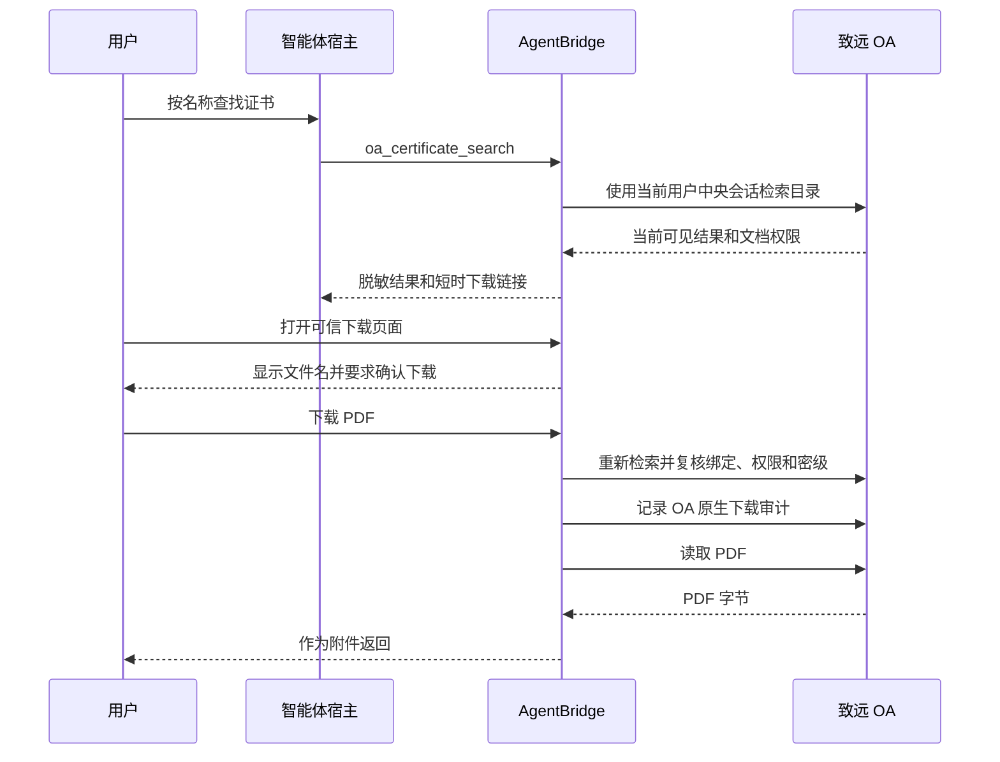

# OA 证书扫描件检索与下载

## 目标

AgentBridge 支持智能体按专利名称或软件著作权名称检索 OA 中的证书扫描件，并向当前用户返回短时可信下载链接。

第一期只覆盖集团证书目录：

```text
文档中心
└─ 单位文档
   └─ 知识产权文档
      └─ 02集团-证书扫描件
         ├─ 1-专利证书扫描件
         └─ 2-著作权证书扫描件
```

该入口属于致远 OA 的“文档中心”，不是公司空间中的第三方文档管理系统。

## 对外能力

MCP 工具：

```text
oa_certificate_search
```

主要参数：

| 参数 | 含义 |
| --- | --- |
| `name` | 单个专利或软件著作权名称，至少 2 个字符 |
| `names` | 批量名称，1 至 10 个；查询多篇时必须优先使用该参数 |
| `document_type` | `all`、`patent_certificate` 或 `software_copyright_certificate`；用户明确说“软著”时使用后者 |
| `limit` | 总返回数量，1 至 20，默认 10 |

示例请求：

```json
{
  "name": "一种基于动态温差补偿的光敏值修正方法及系统",
  "document_type": "patent_certificate",
  "limit": 10
}
```

返回结果按精确标题匹配优先排序。文件名前的内部编号和 `.pdf` 后缀不参与标题精确匹配。存在多个结果时，智能体应把候选名称列给用户选择，不得自行猜测。

软著名称采用两阶段匹配。请求名称末尾存在 `V1.0`、`V2.0` 等版本号时，AgentBridge 先去掉末尾版本号向 OA 召回候选，再用用户原始名称中的版本号逐项核对结果。版本号不一致或候选标题没有版本号时不会返回；不带版本号的请求则保留宽松查询。该规则只作用于软著，专利名称不做版本号剥离。

每个可访问结果包含：

- 证书标题和 OA 文件名；
- 证书类型和显示大小；
- 匹配类型；
- 10 分钟有效的 AgentBridge 可信下载链接。

## 批量检索与并发规则

同一 OA 用户只有一个受控浏览器会话，页面操作必须串行。智能体需要查询多篇证书时，应把最多 10 个名称放入一次 `names` 调用；AgentBridge 只进入一次目标目录，再依次执行目录内搜索。

不要为同一用户并行调用多个 `oa_certificate_search`。若已有 OA 操作占用会话，并发证书检索会在 1 秒左右返回 `SESSION_BUSY`，而不是继续排队直到 MCP 超时。智能体应等待当前操作完成后重试一次，或把多个名称合并为批量请求。

明确查询软著或软件著作权时，必须设置：

```json
{
  "names": ["系统甲V1.0", "系统乙V1.0"],
  "document_type": "software_copyright_certificate",
  "limit": 10
}
```

只有用户没有说明证书类型时才使用 `all`。
## 下载流程



## 安全边界

- 使用 MCP Token 绑定的用户身份，只能访问该用户中央 OA 会话。
- 检索和下载使用现有 `oa:read` 权限，同时服从 OA 原生读取、下载和密级权限。
- OA 资源 ID、源文件 ID、版本和创建日期只保存在 AgentBridge 服务端，不向智能体暴露。
- 下载时重新查找原文件并核对不可变字段，旧结果不能绕过后续权限变化。
- 下载链接是 10 分钟有效的一次性随机地址。
- 可信下载页面使用同源 CSRF、`SameSite=Strict` Cookie、禁止缓存和禁止嵌入。
- PDF 文件字节不进入模型上下文、MCP 结构化结果或聊天消息。
- 只接受 OA 返回的 PDF，最大 32 MiB；HTML 登录页和其他文件类型会被拒绝。
- 下载失败后链接可刷新重试；成功后链接立即失效。

## 当前限制

- 第一期只检索 `02集团-证书扫描件` 下的专利和软件著作权目录。
- 暂不递归检索其他子公司目录、产品登记证书、商标、作品著作权和软件测评报告。
- Telegram 或微信内置 WebView 若不信任内部 CA，用户需要使用系统浏览器打开 HTTPS 链接。
- OA 文档中心页面结构变更时，能力会明确失败，不会退化为不受控的任意 URL 下载。

## 验收

发布前至少完成：

1. 工具目录包含 `oa_certificate_search`。
2. 使用辛国茂身份检索一个已知专利名称，结果不暴露 OA 内部 ID。
3. 搜索结果只有当前 OA 用户具备读取和下载权限的文件。
4. 下载页面先展示文件名，确认后返回 `application/pdf`。
5. 第二次使用相同链接时被拒绝。
6. 登录过期、权限变化、密级不足、文件绑定变化和非 PDF 响应均明确失败。
7. 李世玉会话观察期间不得以其身份执行本能力验收。
