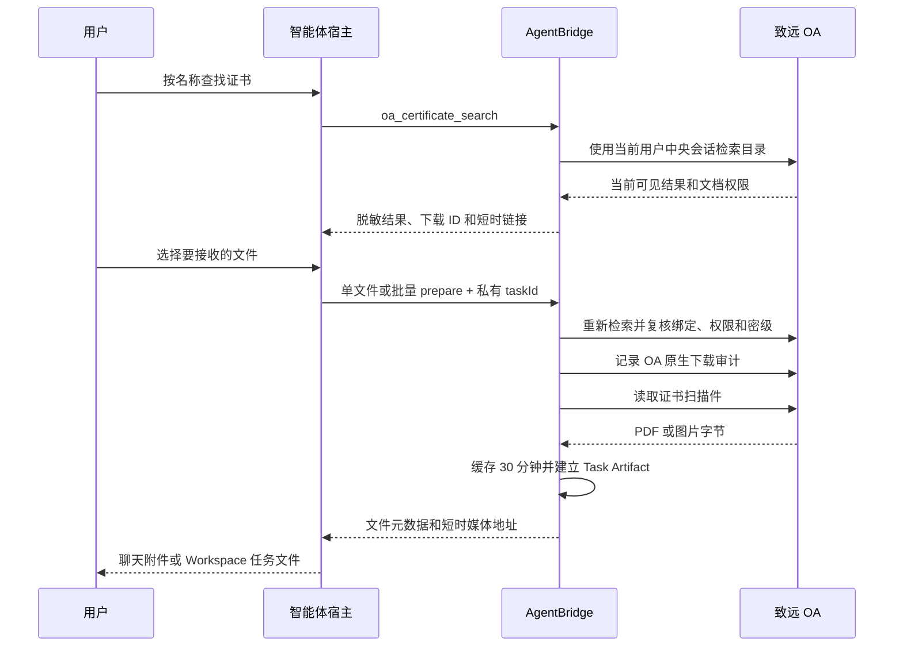

# OA 证书扫描件检索与下载

## 目标

AgentBridge 支持智能体按专利名称或软件著作权名称检索 OA 中的证书扫描件，并把用户选中的文件作为当前任务的短时文件交付到网页、Telegram 或微信。

第一期只覆盖集团证书目录：

```text
文档中心
└─ 单位文档
   └─ 知识产权文档
      └─ 02集团-证书扫描件
         ├─ 1-专利证书扫描件
         └─ 2-著作权证书扫描件
```

该入口属于致远 OA 的“文档中心”，不是公司空间中的第三方文档管理系统。

## 对外能力

MCP 工具：

```text
oa_certificate_search
oa_certificate_prepare_download
oa_certificate_prepare_downloads
```

第一个工具只检索并返回用户绑定的不透明 `download_id`；用户要求接收一个文件时调用单文件准备工具，选择多个文件时把全部 ID 一次传给 `oa_certificate_prepare_downloads`。文件准备工具从 MCP 私有任务元数据取得 `taskId`，模型和用户不需要填写任务号。

主要参数：

| 参数 | 含义 |
| --- | --- |
| `name` | 单个专利或软件著作权名称，至少 2 个字符 |
| `names` | 批量名称，1 至 20 个；查询多篇时必须优先使用该参数 |
| `document_type` | `all`、`patent_certificate` 或 `software_copyright_certificate`；用户明确说“软著”时使用后者 |
| `limit` | 总返回数量，1 至 20，默认 10 |

示例请求：

```json
{
  "name": "一种基于动态温差补偿的光敏值修正方法及系统",
  "document_type": "patent_certificate",
  "limit": 10
}
```

返回结果按精确标题匹配优先排序。文件名前的内部编号以及 `.pdf`、`.jpg`、`.jpeg`、`.png` 后缀不参与标题精确匹配。存在多个结果时，智能体应把候选名称列给用户选择，不得自行猜测。

软著名称采用分层匹配。请求名称末尾存在 `V1.0`、`V2.0` 等版本号时，AgentBridge 先去掉版本号，以方括号外的正式名称召回；正式名称没有可访问结果时，再使用 `[简称:...]` 或 `【简称：...】` 中的简称兜底。候选返回前始终用原请求的版本号逐项核对，版本不一致或候选没有版本号时不会返回。该规则只作用于软著，专利名称不做版本号剥离。

每个可访问结果包含：

- 证书标题和 OA 文件名；
- 证书类型和显示大小；
- 匹配类型；
- 10 分钟有效的 AgentBridge 可信下载链接和不透明下载 ID。

## 批量检索与并发规则

同一 OA 用户只有一个受控浏览器会话，页面操作必须串行。智能体需要查询多篇证书时，应把最多 20 个名称放入一次 `names` 调用；AgentBridge 只进入一次目标目录，再依次执行目录内搜索。批量请求会为每个名称保留最佳匹配，避免同一名称的历史重复件挤占其他名称；结果同时给出 `matched_queries` 和 `unmatched_queries`，智能体必须明确报告未找到的名称。

选中多篇后必须调用一次 `oa_certificate_prepare_downloads`。中心端在一次会话锁和一个浏览器 Worker 中按目录分组复核、下载并建立多个 Task Artifact；单个文件失败会在批量结果中单独报告，其余已准备文件仍可交付。OpenClaw 按返回顺序逐个发送，并强制使用“文件”模式，JPEG/PNG 扫描件不会被聊天通道压缩成照片。

不要为同一用户并行调用多个 `oa_certificate_search`。若已有 OA 操作占用会话，并发证书检索会在 1 秒左右返回 `SESSION_BUSY`，而不是继续排队直到 MCP 超时。智能体应等待当前操作完成后重试一次，或把多个名称合并为批量请求。

明确查询软著或软件著作权时，必须设置：

```json
{
  "names": ["系统甲V1.0", "系统乙V1.0"],
  "document_type": "software_copyright_certificate",
  "limit": 10
}
```

只有用户没有说明证书类型时才使用 `all`。
## 下载流程



准备完成后的文件拥有从完成时重新计算的 30 分钟交付窗口，避免 OA 下载较慢时把检索阶段的 10 分钟耗尽。Agent Workspace 从 Task Hub 拉取同一个任务中的全部文件；Telegram 和微信由 OpenClaw 每个文件发送一条附件。通道附件上传遇到瞬时网络错误时只重试一次，仍失败才发送短时下载链接；同一工具结果在 10 分钟去重窗口内不会重复投递。宿主把每份文件的原生附件、链接回退或失败结果幂等回报给 Task Hub，Workspace 卡片和模型最终回复据此显示精确计数。重新调用同一个 `download_id` 不会再次读取 OA，也不会创建重复 Task Artifact。

## 安全边界

- 使用 MCP Token 绑定的用户身份，只能访问该用户中央 OA 会话。
- 检索和下载使用现有 `oa:read` 权限，同时服从 OA 原生读取、下载和密级权限。
- OA 资源 ID、源文件 ID、版本和创建日期只保存在 AgentBridge 服务端，不向智能体暴露。
- 下载时重新查找原文件并核对不可变字段，旧结果不能绕过后续权限变化。
- 检索阶段的下载入口有效 10 分钟；宿主成功准备文件后，媒体入口从准备完成时起有效 30 分钟。
- 可信下载页面使用同源 CSRF、`SameSite=Strict` Cookie、禁止缓存和禁止嵌入。
- 证书文件字节不进入模型文本上下文或 MCP 结构化 JSON，只作为二进制附件交给宿主或由浏览器直接下载。
- 只接受扩展名与文件魔数一致的 PDF、JPEG 或 PNG，最大 32 MiB；HTML 登录页、伪装文件和其他类型会被拒绝。
- 浏览器确认下载仍保持一次性语义；宿主准备后的媒体入口在 30 分钟内可重复取用，以支持附件上传失败回退和跨端恢复。
- Task Artifact 按 `userSubject + taskId` 校验。Workspace 只返回当前登录用户的文件；管理控制台只显示文件名、类型、大小、状态、任务和到期时间，不显示下载 URL 或 OA 引用。

## 当前限制

- 第一期只检索 `02集团-证书扫描件` 下的专利和软件著作权目录。
- 暂不递归检索其他子公司目录、产品登记证书、商标、作品著作权和软件测评报告。
- Telegram 或微信内置 WebView 若不信任内部 CA，用户需要使用系统浏览器打开 HTTPS 链接。
- OA 文档中心页面结构变更时，能力会明确失败，不会退化为不受控的任意 URL 下载。

## 验收

发布前至少完成：

1. 工具目录包含 `oa_certificate_search`、单文件与批量准备工具。
2. 使用辛国茂身份检索一个已知专利名称，结果不暴露 OA 内部 ID。
3. 搜索结果只有当前 OA 用户具备读取和下载权限的文件。
4. 浏览器下载页面先展示文件名，确认后按实际格式返回 `application/pdf`、`image/jpeg` 或 `image/png`。
5. 宿主准备同一下载 ID 两次只读取 OA 一次，并复用同一个 Task Artifact。
6. 批量准备只创建一个 OA Worker；图片与文字的一次请求只生成一张任务卡；Workspace 能在所属任务中看到全部文件和精确投递计数，伴随聊天端按序收到原始文件，瞬时失败重试一次后才收到短时链接。
7. 另一个 `userSubject` 不能读取该 Task Artifact，管理 API 不返回下载 URL 和 OA 引用。
8. 登录过期、权限变化、密级不足、文件绑定变化和不受支持或魔数不匹配的响应均明确失败。
