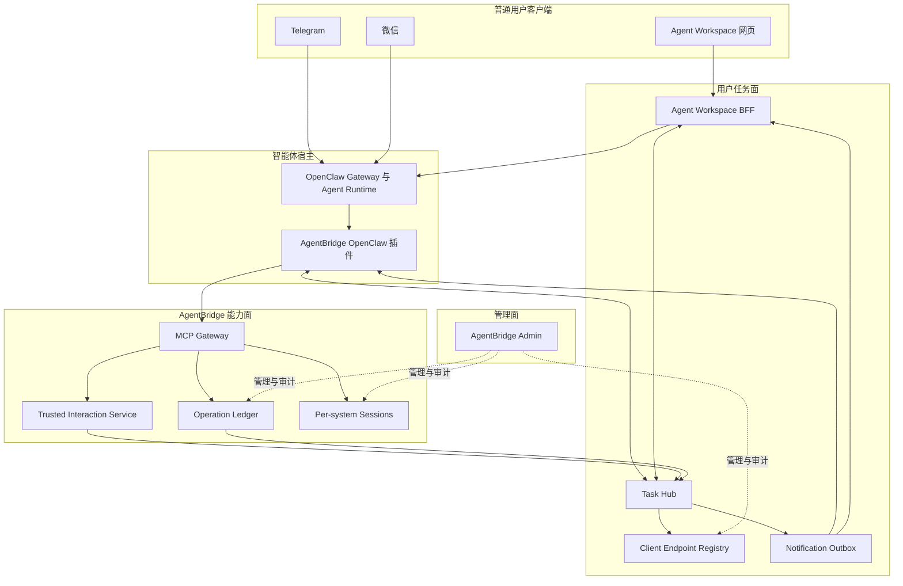
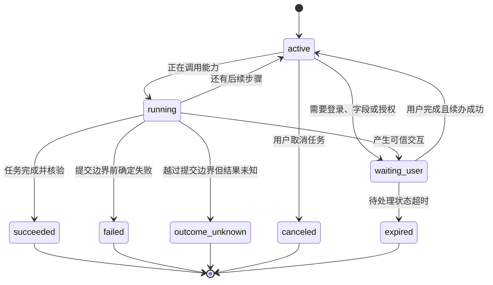

# 多端智能体任务延续设计

> 文档状态：Approved v0.16，双用户跨端任务选择、受控接续、拉取式网页交互、微信活动感知投递、任务文件与多模态消息附件一期已完成实现
>
> 更新日期：2026-08-10
>
> 现实起点：OpenClaw 2026.7.1、AgentBridge OpenClaw 插件 0.4.29、中心
> AgentBridge MCP 与可信交互卡片
>
> 本文是分期实现依据。任务骨架、Agent Workspace、执行授权多端展示、展示层文本
> 同步、显式跨端指代和按 `taskId` 的任务选择/接续已经实现；共享 Transcript 和
> OBO 执行委托仍属于后续阶段。

## 0. 当前实施状态

截至 2026-08-04，已实现：

- 中心端持久化 `ClientEndpoint`、`AgentTask`、`TaskEvent`、
  `TaskSubscription`、`NotificationOutbox`；
- 通过独立关联表把 Operation 和 Interaction 绑定到 `taskId`，不修改既有
  Interaction 不可变可信合同；
- OpenClaw 在第一次调用 AgentBridge 业务工具时惰性建任务，同一 agent run
  复用任务；
- `taskId` 由宿主通过 MCP 私有 `_meta` 传递，不进入模型可填写的工具参数；
- 插件把可信业务结果中的 Operation/Interaction ID 回写 Task Hub；
- OpenClaw 使用正式 `gateway_start` Hook，按独立身份恢复未完成 Interaction、
  原私聊路由、轮询和卡片投递；
- Task Hub 协调故障不覆盖已经成功返回的业务工具结果；
- 双用户隔离、任务幂等、迁移建表和 Gateway 重启恢复已纳入自动化测试。
- Task Hub 按 Endpoint 持久化短期任务候选与已选任务，选择范围始终受
  `userSubject + agentHost` 约束；
- 宿主私有 MCP 解析显式 `taskId`、编号选择、来源端和最近任务，返回由服务端生成的
  非敏感权威摘要，不把选择权或用户身份交给模型参数；
- OpenClaw 自然语言接续和 Workspace“继续任务”入口复用同一选择状态；等待中的
  Interaction 直接重显，运行中和终态任务禁止重复业务调用，明确的新后续动作复用原
  `taskId` 并继续受 Operation 幂等和授权边界约束；
- 独立 Agent Workspace 提供持久网页登录、智能体对话、任务时间线和端点查看；
- 网页账号通过已可信 Telegram/微信的一次性配对码绑定到既有 `userSubject`；
- BFF 使用 OpenClaw 正式 Gateway 协议，浏览器不持有 MCP 或 Gateway Token；
- 网页 Session 通过 90 秒一次性凭证固定到正确 MCP 身份；网页、Telegram 和微信
  暴露相同的读取工具、受治理业务准备入口和可信登录入口；
- 底层 commit 与 `agentbridge_interaction_resume` 不向模型注册，用户确认后由原任务
  协调器内部续办，中心端按当前 Token scopes 再次鉴权并执行 commit/verify；
- 桌面和移动端布局、双用户隔离、CSRF、凭证重放和错误身份兑换已纳入测试。
- 同一执行授权可为 Workspace、Telegram 和微信生成端点专属展示入口；
- 任一可信端都可确认或取消，中心数据库事务只接受第一个有效决定；
- OpenClaw Outbox 通知泵按端点主动投递卡片和状态；普通通道失败最多重试 5 次，微信旧入站令牌失败一次后转为等待端点活动；
- 原任务宿主仍是唯一续办者，旁端确认不会获得原宿主的写权限或重复执行；
- 用户和助手的非敏感文本写入按 `userSubject` 隔离的追加式时间线，并按中心序号
  同步到 Workspace、Telegram 和微信；
- 网页图片输入按 `userSubject + messageKey` 写入中央附件存储，时间线与 Outbox 只保存
  有序引用和非敏感元数据。网页刷新后恢复原图，Telegram/微信优先接收图片；通道不支持
  图片时降级为 7 天内有效的受控 HTTPS 链接；
- 消息幂等键、Interaction 状态语义去重和任务终态保护共同防止重复卡片、重复文本
  以及成功任务被旧交互重新打开。
- 用户明确说出“刚才网页端”“继续另一个端的第 1 条”等跨端指代时，OpenClaw 通过
  宿主私有工具读取同一 `userSubject` 其他端点最近 6 小时、最多 12 条非敏感文本，
  以不可信数据块注入当前推理；普通消息不增加该读取。
- OpenClaw `0.4.29` 按 MCP Token scope 向同一用户的网页、Telegram 和微信会话注册同一套可用工具：
  1 个身份状态工具、读取工具和 17 个受治理入口；15 个底层 commit/续办工具保留在
  宿主内部，不向模型注册。
- Agent Workspace 通过 SSE 和 Task Hub 拉取卡片、文本与任务状态，不再尝试按聊天通道
  直推，也不会因拉取端投递失败唤醒无业务内容的模型回合；Telegram 和微信仍按原通道直推。
- 同一 agent run 对同一待处理 Interaction 的重复 `interaction_get` 会在宿主内直接返回
  `host_handled`，避免重复卡片和重复工具耗时；用户在后续回合明确要求重显时仍允许重新获取。
- Operation 的 `requires_user_action` 与真正的 Interaction 等待事件分离。前者只表达内部操作
  状态，后者才是跨端展示和通知的唯一可信卡片等待事件。
- 提示构建 Hook 不信任控制面传入的 sender 或 bot account；它从宿主生成的私聊
  `sessionKey` 恢复通道，并由身份路由器匹配唯一配置绑定。微信 sender 大小写不敏感，
  多 bot 歧义继续失败关闭。
- 详情查看、下载等同一业务意图的后续步骤可以复用原 Task；撤销等改变原业务结果的逆向动作
  必须新建独立 Task 和应用卡。新 Task 通过冻结的业务目标关联原流程，不通过覆盖原卡表达关系。
- 用户只需表达“撤销刚提交的出差申请”等自然业务意图。智能体从当前上下文和已发集合定位唯一
  事项；存在歧义时只询问标题或日期，`affairId`、`processId` 和 `taskId` 不进入用户操作界面。
  撤销的独立执行授权仍然保留。
- OA 证书准备完成后建立用户隔离的 `TaskArtifact`。Workspace 在原任务卡和详情内展示文件，
  Telegram/微信伴随端收到单附件；通道上传失败时明确回退到短时链接。准备窗口从文件完成时
  重新计算 30 分钟，同一下载 ID 幂等复用，不重复读取 OA 或创建文件记录。
- 管理端只投影任务文件的名称、类型、大小、状态、所属任务和到期时间，不返回下载地址、
  OA 文档引用或文件内容；Task Hub 隔离诊断同时检查 Artifact 与 Task 的用户一致性。

尚未实现：

- 登录卡和字段卡的多端共同编辑；
- 首选确认端及用户自助通知偏好；
- 任意隐式指代、并行任务选择和完整 OpenClaw Transcript 共享；
- 跨客户端 OBO 执行宿主切换。

## 1. 结论

本设计采用以下约束：

1. 不修改或维护 OpenClaw 核心源码分支；只使用正式 Gateway、WebSocket、插件、
   Channel、Tool、Hook 和 outbound adapter 扩展面。
2. 用户网页端是独立的智能体客户端，与 Telegram、微信处于同一层，不属于
   AgentBridge 管理控制台。
3. AgentBridge 管理控制台只供管理员管理用户、权限、系统主体、会话、策略、
   操作和审计，不承载普通用户聊天。
4. `userSubject` 是同一自然人在 AgentBridge 内的稳定身份；Telegram、微信、
   网页和后续客户端分别作为该身份的 `ClientEndpoint`。
5. 每个客户端使用独立凭据或服务端会话，不复制同一个长期 MCP Bearer Token。
6. 跨端延续以稳定 `taskId` 为主键，不依赖 Telegram 消息、网页标签页或
   OpenClaw `sessionKey` 存活。
7. 状态通知可以投递到多个客户端，但字段提交、执行授权和业务提交只能消费一次。
8. AgentBridge 继续掌管业务能力、可信交互、操作幂等与结果核验；Task Hub 掌管
   客户端绑定、任务索引、订阅、多端展示和通知；OpenClaw 掌管模型对话与推理。

## 2. 问题与当前差距

当前链路已经解决两个真实用户通过 Telegram、微信分别使用自己身份调用
AgentBridge 的问题：

```text
可信 channel + senderId
  -> OpenClaw identityBindings
  -> 独立 MCP Token
  -> userSubject
  -> 各系统独立 Session 与下游主体
```

当前插件把可信交互和结果固定到最初触发操作的 OpenClaw 私聊：

```text
interaction
  -> OpenClaw sessionKey
  -> sessionRoutes[sessionKey]
  -> 原 Telegram 或微信会话
```

这个模型保证了不串号，但存在以下限制：

- 电脑网页发起的任务不能自然转到手机确认；
- Telegram 和微信属于不同 `sessionKey`，不能直接看到同一个待处理任务；
- 插件中的路由、最近消息和登录续办状态主要保存在进程内 `Map`，Gateway
  重启后不能作为跨端任务权威；
- `operationId` 表示一次 AgentBridge 能力调用，不能单独表达包含多次读取、
  登录、填表、授权和提交的完整智能体任务；
- OpenClaw 对话状态与 AgentBridge 业务状态没有稳定的跨端关联主键；
- 同一用户的多个客户端目前只能分别配置，尚无用户可见的绑定、取消绑定和通知偏好。

因此，新增一个网页聊天页面并不能自动获得跨端延续。必须先补充渠道无关的任务和
客户端模型。

## 3. 目标和非目标

### 3.1 目标

- 用户可在电脑网页端发起任务，在手机 Telegram 或微信确认关键节点；
- 用户可在另一个已绑定客户端查看、继续或取消同一个未完成任务；
- 登录、业务字段和执行授权仍通过可信交互页面完成，不进入模型上下文；
- 登录完成、卡片完成和业务终态可以主动通知一个或多个订阅客户端；
- Gateway、网页刷新或单一客户端离线后，任务状态仍可恢复；
- 同一业务写入无论从哪个客户端恢复，都不会重复创建；
- 保持现有 Telegram、微信与 OpenClaw 能力可用，并允许分阶段迁移；
- 保持 AgentBridge 对其他 MCP 宿主开放，不把业务内核绑定到 OpenClaw。

一期 Task Hub 只跟踪已经进入 AgentBridge 能力调用的任务。普通闲聊、与遗留系统
无关的问答和 OpenClaw 自身管理任务不会创建 AgentTask。为保证已绑定客户端的体验
连续性，Task Hub 可以保存用户和助手的非敏感文本展示副本，但不复制系统提示、工具
内部消息、完整 Transcript 或模型推理上下文。

### 3.2 非目标

- 不把 AgentBridge 管理控制台改造成用户聊天产品；
- 不在一期实现通用团队协作、群聊、任务转交或多人共同审批；
- 不把 OpenClaw 完整聊天记录复制到 AgentBridge；
- 不允许浏览器直接持有长期 MCP Token 或 OpenClaw Gateway 管理密钥；
- 不通过模型文本完成登录、字段提交或执行授权；
- 不修改 OpenClaw 核心源码来强行合并不同渠道的内部 Session；
- 不在一期同时支持多个不同智能体宿主之间迁移模型推理上下文；
- 不把“多端收到通知”误认为“多端均可重复执行操作”。

## 4. 三个状态域

跨端设计必须区分三个状态域。

| 状态域 | 权威组件 | 主键 | 保存内容 | 不保存 |
| --- | --- | --- | --- | --- |
| 模型对话 | OpenClaw | `sessionKey` / transcript reference | 用户消息、模型回复、工具调用上下文 | AgentBridge 凭据、Cookie、完整可信字段 |
| 智能体任务与展示时间线 | Task Hub | `taskId` / `sequence` | 任务标题、阶段、当前操作/交互引用、订阅端、非敏感摘要、用户/助手文本展示副本 | 系统提示、工具内部消息、完整模型历史、密码、Cookie |
| 业务操作 | AgentBridge | `operationId` / `interactionId` | 能力调用、幂等、卡片状态、冻结计划、执行与回读 | 聊天渠道路由、完整聊天记录 |

三者的关系是：

```text
一个 taskId
  -> 可关联一个或多个 OpenClaw sessionKey
  -> 可包含一个或多个 AgentBridge operationId
  -> 任一时刻最多有一个需要用户处理的 currentInteractionId
```

`taskId` 不替代 `operationId`。例如“完成出差申请”是一个任务，期间可能先读取
模板、发起登录、生成字段卡、准备提交、生成授权卡并正式提交，每一步可以产生不同
操作或交互记录。

## 5. 目标架构



### 5.1 Agent Workspace

独立的普通用户网页应用，至少提供：

- 与智能体对话；
- 我的进行中、等待我处理和最近完成任务；
- 当前任务的非敏感时间线；
- 打开可信登录卡、字段卡和授权卡；
- 文件下载与过期提示；
- 已绑定客户端及通知偏好；
- 主动切换或继续一个任务。

Agent Workspace 不提供 Token 签发、系统主体重绑、全局写暂停、他人会话检查或
审计导出。

### 5.2 Agent Workspace BFF

浏览器只与 BFF 交互。BFF 负责：

- 网页用户认证和 CSRF 防护；
- 将网页账号解析为唯一 `userSubject`；
- 使用 HttpOnly、Secure、SameSite Cookie 保存网页会话；
- 通过 OpenClaw Gateway WebSocket 发消息、取历史和接收流式回复；
- 通过 Task Hub 读取该用户任务和通知；
- 在服务端持有 OpenClaw 或 AgentBridge 委托凭据；
- 拒绝浏览器自报 `userSubject`、MCP Token 或其他客户端身份。

### 5.3 Task Hub

Task Hub 是渠道无关的任务与投递协调器，不是新的智能体，也不包含 OA、泰华或
语雀业务规则。它负责：

- 任务创建、状态机和版本控制；
- OpenClaw Session、AgentBridge Operation 与 Interaction 的关联；
- 同一用户多个 Client Endpoint 的注册和订阅；
- 待处理执行授权的端点专属展示；
- 通知 Outbox、投递去重、重试和回执；
- Gateway 重启后的任务与路由恢复；
- 为目标客户端提供最小、非敏感的任务恢复摘要。

### 5.4 OpenClaw

OpenClaw 继续负责模型会话、工具选择、消息渠道和智能体运行。目标实现不修改
OpenClaw 核心源码，而是：

- 使用现有插件注册工具、中间件、Hook 和命令；
- 使用现有 Channel outbound adapter 投递 Telegram、微信消息；
- 网页端通过正式 Gateway WebSocket 协议接入；
- 必要时由插件把 Task Hub 的非敏感任务上下文注入当前运行；
- 通过插件包版本和兼容性测试适配 OpenClaw 升级。

### 5.5 AgentBridge

AgentBridge 保持能力内核边界：

- 从 MCP Token 得到 `userSubject` 和 scope；
- 以 `(userSubject, systemId)` 选择下游 Session 与主体；
- 管理 `prepare -> authorize -> commit -> verify`；
- 提供持久化 `operationId`、`interactionId` 和权威业务结果；
- 不根据 Telegram、微信或网页端类型改变业务逻辑；
- 不接受模型或浏览器自报用户身份。

## 6. 身份和客户端绑定

### 6.1 稳定用户

`userSubject` 表示 AgentBridge 内部用户，例如：

```text
userSubject = guomao
```

它不是 Telegram ID、微信昵称、OA 姓名或网页用户名。每个下游系统的预期与已验证
主体仍按 `(userSubject, systemId)` 独立管理。

### 6.2 ClientEndpoint

建议增加以下逻辑模型：

| 字段 | 含义 |
| --- | --- |
| `endpointId` | 不透明稳定 ID |
| `userSubject` | 所属 AgentBridge 用户 |
| `clientType` | `web`、`telegram`、`wechat` 或后续类型 |
| `provider` | `openclaw`、`agent-workspace` 等宿主 |
| `externalSubject` | 宿主认证后的稳定发送者或网页账号 ID |
| `accountId` | 多机器人、多租户或站点账号限定 |
| `state` | `pending`、`active`、`revoked`、`quarantined` |
| `trustLevel` | 普通、可接收敏感卡、允许高风险确认等 |
| `capabilities` | 文本、按钮、Web App、文件、推送等展示能力 |
| `lastSeenAt` | 最近可信活动时间 |

唯一性至少覆盖：

```text
provider + clientType + accountId + externalSubject
```

同一 Endpoint 不能同时绑定多个活动 `userSubject`。

### 6.3 绑定流程

一期保留管理员开户，但把绑定动作显式化：

1. 管理员预先创建或选择 `userSubject`；
2. 已登录用户在一个受信客户端申请绑定新客户端；
3. Task Hub 生成短期、一次性绑定挑战；
4. 新客户端完成自身认证并提交挑战；
5. 可信页面向用户显示将要绑定的客户端类型和账号摘要；
6. 用户确认后建立 `ClientEndpoint`；
7. 绑定、撤销和冲突写入审计。

现有 OpenClaw `identityBindings` 可作为初始已验证 Endpoint 导入，但环境变量中的
Token 不能显示到网页或 Task Hub API。

### 6.4 MCP 凭据

一期可以继续使用每客户端独立 MCP Token：

```text
Telegram Token -> userSubject=guomao
微信 Token     -> userSubject=guomao
Web BFF Token  -> userSubject=guomao
```

Token 还应记录 `clientId`、`clientType` 和 `audience`，便于审计和独立撤销。
这些字段不参与业务幂等主键。

浏览器本身不保存 MCP Token。后续再把长期 Token 升级为 BFF 或 OpenClaw 使用的
短期委托 Token，不作为一期阻塞项。

## 7. 任务模型

### 7.1 AgentTask

建议的最小任务记录：

| 字段 | 含义 |
| --- | --- |
| `taskId` | 不透明稳定 ID |
| `userSubject` | 任务所有者 |
| `title` | 非敏感、可展示标题 |
| `status` | 任务状态 |
| `agentHost` | 当前智能体宿主，例如 `openclaw` |
| `agentRef` | Agent 或 Workspace 引用 |
| `originEndpointId` | 发起客户端 |
| `activeConversationRef` | 当前 OpenClaw Session/Transcript 引用 |
| `currentOperationId` | 当前业务操作，可为空 |
| `currentInteractionId` | 当前待处理可信交互，可为空 |
| `summary` | 允许跨端展示的非敏感摘要 |
| `version` | 乐观并发版本 |
| `createdAt` / `updatedAt` / `finishedAt` | 生命周期时间 |

Task Hub 不保存完整模型提示、系统消息、工具参数/结果、业务字段卡提交值、冻结计划、
Cookie 或密码。跨端文本时间线只允许 `user` 和 `assistant` 两种角色，并按
`userSubject + dedupeKey` 幂等。

### 7.2 状态机



任务状态是面向用户的聚合状态，不能覆盖 AgentBridge Operation 的权威状态。
如果业务操作为 `outcome_unknown`，任务必须同步进入 `outcome_unknown`，不能因
其他客户端重试而回到 `running`。`succeeded`、`failed`、`outcome_unknown`、
`canceled` 和 `expired` 均为不可被旧 Interaction 观测回退的终态；同一 Interaction
从 `pending` 到 `processing` 仍属于一个“等待用户”语义事件，不重复投递卡片。

### 7.3 创建和关联规则

- Agent Workspace 可以在用户明确发起一个遗留系统任务时预建 `taskId`；
- Telegram、微信等现有渠道在第一次调用 AgentBridge 业务工具时由插件惰性创建
  `taskId`，普通聊天不创建任务；
- `taskId` 由可信宿主或 Task Hub 生成，通过 MCP 私有请求元数据或受信扩展 Header
  传给 AgentBridge，不作为模型可任意填写的业务参数；
- AgentBridge 从已认证 MCP Token 得到 `userSubject`，验证任务所有者一致后才建立
  Operation/Interaction 关联；
- 模型可以看到不透明 `taskId` 用于向用户说明和选择任务，但不能通过修改它访问
  其他用户的对象；
- 同一个用户意图产生多次能力调用时沿用原 `taskId`，只有用户明确开始另一个任务
  或原任务已终态时才新建。

### 7.4 TaskEvent

任务变化使用追加式事件表达：

```text
task.created
task.message.accepted
task.operation.linked
task.interaction.waiting
task.interaction.presented
task.interaction.completed
task.operation.succeeded
task.operation.failed
task.operation.outcome_unknown
task.artifact.ready
task.completed
task.canceled
```

每个事件包含 `eventId`、`taskId`、`userSubject`、事件类型、非敏感 payload、
发生时间和因果引用。客户端按 `eventId` 去重。

### 7.5 TaskArtifact

任务产生的短时文件使用独立记录，不把二进制内容写入 Task Hub：

| 字段 | 含义 |
| --- | --- |
| `artifactId` | 不透明文件记录 ID |
| `taskId` / `userSubject` | 所属任务与用户，读取时同时校验 |
| `artifactType` | 例如 `certificate_scan` |
| `filename` / `contentType` / `byteSize` | 可展示文件元数据 |
| `sourceRef` | 服务端幂等引用，不向用户端或管理端返回 |
| `downloadUrl` | 短时媒体地址，只向所属用户端的宿主或 Workspace 返回 |
| `state` | `ready` 或 `expired` |
| `expiresAt` | 领取窗口到期时间 |

`task.artifact.ready` 与 TaskEvent、Outbox 使用同一用户隔离和端点订阅机制。Workspace 通过
SSE 得知任务变化后从任务详情拉取文件；消息端由宿主下载到本地媒体存储后发送附件。通知重试
只重试文件交付，不重新调用 OA。文件过期后不延长原 URL，用户需要重新执行证书检索；一键
重新签发过期文件仍属于后续体验优化。

## 8. 执行授权的多端展示与单次决定

### 8.1 绑定原则

当前 `Interaction` 已绑定 `userSubject`、`systemId`、`sessionId`、
`operationId` 和可信资源。跨端改造后增加 `taskId`，但不把它改成聊天渠道记录。

可信交互的访问条件是：

```text
当前已认证 ClientEndpoint.userSubject
  == Interaction.userSubject
```

不能仅凭短期 URL、`taskId`、`interactionId` 或网页参数认领交互。

Task Hub 和普通通知只保存 `interactionId` 及展示摘要。每个已认证 Endpoint 在展示
执行授权时，由 AgentBridge 生成独立 `presentationId` 和短期 URL。不同端不能复制
彼此的 URL，URL 也不进入模型上下文。

### 8.2 Presentation 与 Card Session

同一授权允许存在多个端点展示：

| 对象 | 作用 |
| --- | --- |
| `Authorization` | 冻结业务计划和最终决定，所有端共享 |
| `Presentation` | 绑定一个 `authorizationId + endpointId` 的展示入口 |
| `CardSession` | 每次打开页面生成的独立 CSRF 会话 |

规则：

1. 同一 Endpoint 对同一授权复用一个 Presentation，不同 Endpoint 的 URL 必须不同；
2. 同一 Presentation 被重复打开时，各页面使用独立 Card Session，互不覆盖 Cookie；
3. 网页、Telegram 和微信可以同时显示并操作同一授权；
4. `UPDATE ... WHERE state='pending'` 在事务内原子接受第一个有效决定；
5. 首次决定后立即消费全部 Card Session，并把全部 Presentation 标为已决定；
6. 其他端随后提交时返回“已在其他可信端确认/取消”，不再报未知冲突；
7. 最终业务消费仍经过一次性授权、Operation 幂等和权威回读。

### 8.3 手机确认策略

用户可以配置首选确认端：

```text
preferredConfirmationEndpoint = telegram-mobile
```

默认策略：

- 网页发起后，网页保留确认入口，已绑定的 Telegram 和微信主动收到各自入口；
- 某端离线或投递失败不影响其他端确认，也不自动降低授权要求；
- Telegram 和微信同时订阅时，两端都可操作，但只有第一个有效决定生效；
- 高风险能力可要求指定 Endpoint 或更高 `trustLevel`；
- 群聊、公开频道和无法稳定识别用户的 Endpoint 不允许展示写授权。

### 8.4 确认权与执行权

跨端确认不转移执行权限：

- 原始 prepare/operation 记录其执行宿主、调用 Token 身份、scope 和计划摘要；
- 手机 Endpoint 只证明“同一 `userSubject` 已在可信页面完成登录、字段或授权”，
  不能借此继承网页 Token 的写 scope；
- 可信授权完成后，由原任务的身份绑定 MCP Client 调用 resume/commit；
- AgentBridge 在最终边界再次校验用户、系统主体、能力 scope、计划、授权和幂等键；
- 原执行宿主暂时离线时，任务停在可恢复状态，等待该宿主恢复；
- 一期不允许另一个客户端拿自己的 Token 自动接管执行。后续只有引入绑定
  `taskId + operationId + userSubject + scopes + expiry` 的短期 OBO 委托后，才可
  支持执行宿主切换。

## 9. 通知和跨端续办

### 9.1 订阅模型

任务进入执行授权等待态后默认订阅：

- 发起 Endpoint；
- 同一 `userSubject` 下具备 `trusted_interaction` 能力的活动消息端点；
- Workspace 通过用户级 SSE 直接观察 TaskEvent，不依赖消息 Outbox。

每个订阅可选择：

```text
waiting_user
succeeded
failed
outcome_unknown
file_ready
```

通知内容只包含任务标题、当前阶段、必要摘要和可信宿主展示元数据。密码、Cookie、
完整业务字段、授权密钥和卡片 URL不得进入模型可见通知。

### 9.2 Notification Outbox

所有主动通知先写 Outbox，再异步投递：

| 字段 | 含义 |
| --- | --- |
| `deliveryId` | 投递 ID |
| `eventId` | 来源任务事件 |
| `endpointId` | 目标客户端 |
| `payloadType` | 文本、可信卡、文件、状态 |
| `state` | `pending`、`delivering`、`deferred`、`acknowledged`、`failed` |
| `attemptCount` | 尝试次数 |
| `nextAttemptAt` | 下次投递时间 |

唯一键使用：

```text
eventId + endpointId + payloadType
```

Outbox 重试只重复通知，不重复 AgentBridge 业务操作。投递使用 30 秒 Lease，普通
可重试故障 5 次后转为 `failed`。微信直推依赖当前入站消息签发的短期通道令牌；一次
投递发现该令牌不可用后转为 `deferred`，不继续快速重试。下一条同一微信端点的用户
入站消息会把延后项恢复为 `pending`、清零旧尝试次数，并在短暂让出正常回复窗口后
重新投递。恢复键是 `userSubject + endpointId`，其他用户和端点不受影响。可信卡投递
记录保存 Interaction 引用和展示意图；端点专属 Presentation 在领取投递项时生成，
URL 只进入宿主私有响应。

### 9.3 在另一客户端继续

客户端收到“继续任务”请求时：

1. 使用当前认证身份解析 `userSubject`；
2. 根据显式 `taskId` 查找，或列出该用户最近的非终态任务供用户选择；
3. 绑定或创建当前 OpenClaw 对话引用；
4. 向模型提供 Task Hub 生成的非敏感任务摘要；
5. 当前有待处理 Interaction 时直接展示可信卡，不要求模型重新发起业务调用；
6. 当前 Operation 正在运行时只订阅状态，不重复调用；
7. 任务已终态时返回核验结果，不重新执行。

不允许仅凭“继续刚才那个”跨用户猜测任务；有多个候选任务时必须让用户选择。

## 10. OpenClaw 适配设计

### 10.1 不修改核心源码

当前 `integrations/openclaw-agentbridge` 已通过 OpenClaw 正式插件面完成：

- 原生 AgentBridge 工具注册；
- `before_tool_call`、`message_received`、`message_sending`、
  `reply_payload_sending` 和生命周期 Hook；
- 工具结果中间件；
- Telegram、微信 outbound adapter 调用；
- Gateway 后台轮询、续办和模型唤醒兜底。

跨端改造继续使用这些扩展点。不得把补丁写入 OpenClaw 安装目录，也不得要求固定
某个私有 OpenClaw 分支。

### 10.2 插件内部改造

现有逻辑：

```text
sessionKey -> identity binding
sessionKey -> delivery route
interaction -> one sessionKey
```

目标逻辑：

```text
trusted sender -> ClientEndpoint -> userSubject
interaction -> taskId -> userSubject
taskId -> subscribed ClientEndpoints
delivery -> endpoint-specific route
```

插件需要：

1. 保留现有 `identityBindings` 作为可信发送者入口；
2. 调用 Task Hub 解析 Endpoint 和 `userSubject`，模型参数不能指定；
3. 在 AgentBridge 工具调用时附加宿主生成的 `taskId` 关联元数据；
4. 捕获 Interaction 后写入任务关联，而不是只放进本地 `records`；
5. 从 Outbox 拉取或订阅当前用户的多端通知；
6. 按 Endpoint capability 渲染 Telegram Web App、微信文本链接、网页内卡片或文件；
7. 把投递结果回写 Outbox；
8. Gateway 重启后从 Task Hub 恢复未完成任务和投递，不依赖旧进程内 `Map`；
9. 保留 `/agentbridge pending`，并通过自然语言和 Workspace 任务详情提供任务查询与继续入口；
10. 继续阻断全局共享 MCP Token 和跨身份 Session 切换。

一期事件关联采用宿主适配方式：插件在代理工具返回 Operation/Interaction 时把
非敏感关联写入 Task Hub，并在 poll/resume 后追加状态事件。AgentBridge 账本仍是
业务结果权威。后续可以增加经过双向认证、带防重放的 AgentBridge Outbox/Webhook，
但不能让未经认证的回调改变任务或触发执行。

### 10.3 OpenClaw Session

一期不强行让不同渠道共享同一个底层 `sessionKey`。原因是：

- OpenClaw 默认按渠道和会话维护回复路由；
- 直接合并 Session 容易使普通回复发错渠道；
- 一个用户可能同时进行多个任务；
- Task Hub 已能通过 `taskId` 提供业务连续性。

跨端继续时，可以创建新的 OpenClaw Session，并注入经过裁剪的任务摘要。后续在
OpenClaw 正式支持安全的跨端 Session/Thread 绑定时，再评估共享 Transcript。

当前已实现的是展示层同步：不同 Session 产生的用户和助手非敏感文本进入同一中心
时间线，其他端按序显示；这不等于合并 OpenClaw Transcript。对于同时包含端点提示和
指代词的显式请求，插件会从同一用户的其他端点读取最近 6 小时、最多 12 条文本，并在
6,000 字符上限内作为不可信上下文注入本轮推理。中心服务先核验当前 Endpoint 属于该
Bearer 身份，再排除当前端点；正文不会出现在日志或诊断结果中。任一端仍使用自己的
`sessionKey`，普通消息不会读取跨端上下文，执行权也不会随文本注入发生转移。

### 10.4 兼容性

插件继续作为独立 npm/本地链接包发布，声明支持的 OpenClaw 与 Plugin API 版本。
每次升级至少验证：

- 插件加载、工具目录和策略可见性；
- 可信运行时身份字段；
- Tool result middleware 私有元数据；
- Telegram、微信和 Web 的投递适配；
- Gateway 重启后的任务恢复；
- 不存在模型可见卡片 URL；
- 不存在旧全局 Token 工具回退。

如果正式插件 API 暂时不能支持某个能力，优先由 Task Hub/BFF 旁路完成，不修改
OpenClaw 核心。

## 11. 网页客户端设计

### 11.1 页面

一期只建设实际使用界面：

- `/chat`：智能体对话和当前任务侧栏；
- `/tasks`：进行中、等待处理和最近完成；
- `/tasks/{taskId}`：任务时间线、当前状态、继续操作；
- `/interactions/{interactionId}`：为当前网页 Endpoint 打开专属可信卡；
- `/files/{grantId}`：短期文件领取；
- `/settings/endpoints`：已绑定客户端和通知偏好。

不建设营销首页，不复用 Admin 页面组件表达普通用户业务操作。

### 11.2 登录

一期可先使用中心用户账号加短期网页会话，后续接企业 OIDC。无论采用何种方式，
都必须在服务端得到稳定网页主体，再映射到 `userSubject`。

禁止：

- 让网页表单提交 `userSubject=guomao` 作为认证；
- 把 MCP Token、OpenClaw Gateway 管理 Token 放进 JavaScript；
- 使用管理员账号登录普通用户网页；
- 依据显示姓名自动合并两个用户。

### 11.3 实时状态

网页通过 WebSocket 或 SSE 接收 TaskEvent；断线后以最后 `eventId` 补取。网页显示
的是 Task Hub 状态，不通过反复询问模型猜测任务是否完成。

## 12. 接口演进

以下为逻辑契约，实施时可按现有 Python 服务风格落地。

### 12.1 Task Hub 用户接口

```text
POST /agent/tasks
GET  /agent/tasks?state=...
GET  /agent/tasks/{taskId}
POST /agent/tasks/{taskId}/continue
POST /agent/tasks/{taskId}/cancel
POST /agent/tasks/{taskId}/subscriptions
GET  /agent/events?after={eventId}
```

身份由网页 Session 或受信宿主凭据得出，接口不接受可覆盖身份的
`userSubject`。

### 12.2 Endpoint 接口

```text
POST /agent/endpoints/link-challenges
POST /agent/endpoints/link-challenges/{id}/confirm
GET  /agent/endpoints
POST /agent/endpoints/{endpointId}/revoke
PUT  /agent/endpoints/{endpointId}/preferences
```

### 12.3 宿主私有 Interaction 与通知接口

```text
agentbridge_host_interaction_present
agentbridge_host_notification_claim
agentbridge_host_notification_ack
```

真正的字段提交、登录和授权仍进入现有 AgentBridge 可信页面及账本，不由 Task Hub
代填。

### 12.4 AgentBridge 契约

`InteractionEnvelope` 增加可选的非敏感 `taskId`。迁移期没有 `taskId` 的请求仍按
原始私聊工作。MCP 工具不新增由模型填写的 `userSubject` 或 `endpointId` 参数。

## 13. 幂等、并发和故障语义

### 13.1 幂等主域

业务幂等继续使用：

```text
userSubject + capabilityVersion + idempotencyKey
```

不得加入 `endpointId`，否则用户从网页切到手机可能创建第二份业务记录。

任务消息使用独立的：

```text
taskId + clientMessageId
```

通知使用：

```text
eventId + endpointId + payloadType
```

### 13.2 单写者

- 同一任务使用乐观版本或短期执行 Lease，防止两个 OpenClaw Session 同时推进；
- 同一执行授权允许多端展示，但中心只接受一个最终决定；
- 同一用户同一系统仍使用现有 Session 锁；
- AgentBridge Operation 的幂等和提交边界不因 Task Hub 引入而放宽。

### 13.3 典型故障

| 故障 | 行为 |
| --- | --- |
| 手机离线 | 网页仍可确认；普通通道有界重试，微信等待下一次端点活动 |
| Telegram 成功、微信令牌已旧 | Telegram 正常确认；微信项进入 `deferred`，下一次微信入站后补发，不重复业务操作 |
| Gateway 重启 | 从 Task Hub 恢复任务、交互和待投递事件 |
| 网页刷新 | 通过任务列表和事件游标恢复 |
| 两端同时点授权 | 一个原子决定成功，另一个显示已在其他可信端处理 |
| 打开卡片后客户端掉线 | 其他端仍可直接确认，无需等待领取租约 |
| 模型 Session 被清空 | 新 Session 使用任务摘要继续 |
| AgentBridge 返回 `outcome_unknown` | 所有端显示需核对，禁止自动重试 |
| Token 被撤销 | 只影响对应客户端凭据，不删除任务和下游 Session |
| 原执行宿主离线 | 保留任务和已完成确认，等待原身份绑定执行上下文恢复，不换 Token 执行 |
| Endpoint 解绑 | 停止新通知，不影响其他端已生成的短期入口 |

## 14. 安全与隐私

- Client Endpoint 必须来自宿主可信身份，不使用昵称、聊天文本或模型参数；
- Task、Operation、Interaction、Presentation 和 Delivery 全部绑定同一 `userSubject`；
- 所有用户接口按对象所有权过滤，跨用户查询统一返回不可发现；
- 可信 URL 仅进入宿主私有展示元数据，不进入模型、普通聊天历史或通知日志；
- 网页使用独立 CSP、CSRF、Origin、Host、Cookie 和点击劫持防护；
- 敏感卡片页面与 Agent Workspace 普通页面使用清晰、不同的安全边界；
- 多端通知默认只给最小摘要，高敏内容需要用户进入可信页面查看；
- 管理员可以撤销 Endpoint 和 Token，但不能替用户完成业务授权；
- Endpoint 绑定、展示、决定、完成、撤销和投递结果进入追加式审计；
- 群聊、共享 Web Session 和无法确定发送者的渠道不允许写操作；
- 任何身份冲突、主体不匹配或重复绑定都 fail closed。

## 15. 分期实施

### 15.1 一期：任务骨架与原渠道兼容

实施状态：已完成并通过当前发布验收。

目标是不改变用户现有使用方式，先建立持久化基础：

- 增加 `AgentTask`、`TaskEvent`、`ClientEndpoint`、Subscription 和 Outbox；
- 给 Interaction 和 Operation 建立 `taskId` 关联；
- 将现有 Telegram、微信 `identityBindings` 导入 Endpoint；
- OpenClaw 插件把新操作关联到任务；
- 原渠道投递仍为默认策略；
- Gateway 重启后恢复未完成 Interaction 与投递；
- 增加只读任务列表和诊断接口。

验收：现有 Telegram、微信流程不退化；重启 Gateway 后未完成登录卡仍可恢复。

### 15.2 二期：独立 Agent Workspace

实施状态：已完成并部署。辛国茂、李世玉均已配置独立网页账户；2026-08-02 的
只读运行态验收确认两个真实用户、四个活动端点和两个独立 OA Session 归属正确。
双用户同时发起业务任务与跨端文件隔离仍待补充真实验收。

- 建设网页登录、聊天、任务列表和任务详情；
- BFF 使用 OpenClaw Gateway 正式协议；
- 网页端绑定到已有 `userSubject`；
- 网页只使用独立凭据；
- 支持网页发起与 Telegram/微信相同的读取和受治理任务，并查看 AgentBridge 任务状态。

当前实现采用本地网页账号加一次性可信聊天配对。网页 Session 为 30 天绝对期限、
7 天空闲期限；普通退出只吊销浏览器会话，不删除与 `userSubject` 的永久关联。
OpenClaw Gateway 使用服务端设备身份和一次性会话绑定凭证，浏览器不接触长期 Token。
详细实现与运维基线见 [Agent Workspace 网页端](./agent-workspace.md)。

验收：网页与 Telegram 使用同一用户的下游 Session，但凭据可分别撤销。

### 15.3 三期：网页发起、多端确认

实施状态：一期代码已部署。网页发起、Telegram/微信旁端展示、任一可信端确认、
原任务唯一续办和网页终态回显均已完成真实或受控验收。

- Workspace 与 Telegram、微信暴露相同的读取工具和受治理 prepare 入口；当前运行时
  共注册 41 个智能体工具，其中 17 个为登录或写操作的受治理入口；
- 登录卡和字段卡可为各可信 Endpoint 生成独立展示入口，任一端可提交首个有效结果；
  各页面之间不实时同步尚未提交的输入值；
- 最终执行授权在网页、Telegram、微信生成独立 Presentation；
- 任一可信端可确认或取消，中心只接受首次有效决定；
- 原发起 OpenClaw 会话自动续办，旁端不接管执行；
- 网页通过 SSE、消息端通过 Outbox 同步收到状态；
- 首选确认 Endpoint 和更多流程入口后续按验收结果扩展。

首个真实样板建议使用已稳定、可回读且可撤销的 OA 请假或出差申请。真实提交和
撤销仍需针对该测试事项明确授权。

### 15.4 四期：跨端继续对话

实施状态：任务选择与受控接续二期已实现，不等同于共享模型 Transcript 或执行宿主迁移。

已完成：

- 用户/助手非敏感文本的有序展示同步、来源端去重和终态保护；
- 同一 `userSubject` 的多个 Endpoint 查看相同任务时间线和可信交互状态；
- 显式包含端点提示和指代词时，当前 Session 可读取其他端点的有界近期上下文；
- 当前端可按显式 `taskId`、来源端或最近任务解析候选；多候选时持久化编号选择，不能
  跨用户猜测；
- 当前端获得 Task Hub 生成的任务、Operation、Interaction 和来源摘要；待处理卡直接
  重显，运行中或终态任务只观察，明确后续动作才可在原 `taskId` 下调用新能力；
- 2026-08-03 已完成辛国茂 Workspace -> Telegram 真实只读接续：候选解析未调用业务工具，
  详情跟进复用原 `taskId`，没有重复待办列表 Operation，只新增一个详情读取 Operation；
- 2026-08-03 已完成李世玉 Workspace -> 微信真实只读接续：Task Hub 持久选择原网页任务，
  详情跟进只新增一个 `oa.workflow.detail.get`，微信投递成功，零业务写入；
- 2026-08-04 使用两个新网页任务完成近同时深度复验：两端按显式 `taskId` 分别从
  Telegram、微信继续原任务，均只新增一个详情 Operation；网页文本、单卡更新、刷新
  去重、Outbox 确认和 10 类身份一致性检查全部通过；
- Workspace 任务详情提供“继续任务”，随后由 OpenClaw 使用相同服务器选择状态；
- 自动化已覆盖双用户隔离、选择状态重启持久化、多候选消歧、终态防重、明确后续复用
  原 `taskId` 和 Workspace 入口；
- 辛国茂真实 TG Session 严格验收已完成，网页端唯一样本
  `ABX2-0803-1144-N8R4 / -6621917081958332574` 被准确恢复，且未调用业务工具。

尚未完成：

- 过期任务文件的一键重新签发，以及大文件分片/断点续传；
- 共享 OpenClaw Transcript；
- OBO 执行宿主切换；
- 两个真实用户同时执行有副作用的业务任务，以及跨端文件的真实完整串号验收；文件自动化
  隔离、幂等、Workspace 拉取、聊天附件和失败链接回退已覆盖。

### 15.5 五期：生产化

- 企业 OIDC、短期 OBO Token 和设备/客户端撤销；
- Task Hub 高可用、队列、备份和灾备；
- 细粒度通知策略和高风险 step-up；
- 每用户 Worker 安全主体；
- SLO、异常积压、人工对账和安全事件响应。

## 16. 验收场景

至少覆盖：

1. 网页发起 OA 读取，Telegram 收到完成提醒，三端结果属于同一 `userSubject`；
2. 网页发起写任务，手机完成执行授权，网页自动显示最终核验结果；
3. Telegram 与微信同时打开各自授权入口，只有一个最终决定能够生效；
4. 手机打开后断网，网页无需等待即可完成同一授权；
5. Gateway 在字段卡等待期间重启，任务和卡片仍可恢复；
6. 网页 Token 撤销后 Telegram 仍可使用，网页不能继续调用；
7. 两个真实用户同时操作，不互见任务、卡片、文件或通知；
8. 用户在另一个客户端继续任务时，不创建第二个 Operation；
9. `outcome_unknown` 在所有端一致显示，任何端都不自动重试；
10. OpenClaw 升级后无需应用核心源码补丁，插件兼容检查通过。

截至 2026-08-04 的状态：

| 场景 | 状态 |
| --- | --- |
| 1、网页读取与跨端结果归属 | 2026-08-04 深度复验通过：辛国茂、李世玉近同时读取 OA 待办，结果、任务、文本、卡片和端点严格隔离 |
| 2、网页写任务与手机授权 | 已完成真实验收 |
| 3、多个可信端竞争同一决定 | 中心原子性和受控部署验收完成；同一用户 Telegram+微信真实竞争待补 |
| 4、单端断网后由另一端确认 | 自动化覆盖，真实移动端断网验收待补 |
| 5、Gateway 在卡片等待期间重启 | 自动化和恢复机制覆盖，近期版本真实重启验收待补 |
| 6、单端撤销不影响其他端 | 自动化覆盖，用户自助撤销界面尚未实现 |
| 7、两个真实用户同时操作 | 2026-08-04 深度复验通过：普通/无痕双网页近同时读取 OA 待办，主体、业务结果、消息标记、四端点、两条 OA Session、时间线和 Outbox 均隔离；跨端文件隔离待补 |
| 8、另一客户端继续且不重复 Operation | 2026-08-04 深度复验通过：辛国茂 Workspace -> Telegram、李世玉 Workspace -> 微信均复用原任务、不重复列表、各只新增一个详情读取 Operation、零业务写入 |
| 9、`outcome_unknown` 多端一致 | 状态语义和终态保护已实现；多端真实故障演练待补 |
| 10、OpenClaw 无源码补丁升级 | 当前插件兼容测试通过 |

## 17. 观测指标

- 活动任务数及各状态停留时间；
- `waiting_user` 超时数量；
- Presentation 生成、首次决定竞争、过期和跨端完成率；
- 每渠道通知成功率、延迟和重试次数；
- Gateway 重启后的恢复任务数；
- 同一任务关联的 Operation 数；
- 幂等复用次数和冲突次数；
- 跨用户访问拒绝与身份冲突次数；
- `outcome_unknown` 数量及最长未对账时间；
- 网页、Telegram、微信分别使用的 Token 与 Endpoint 最后活动时间。

## 18. 暂缓决策

以下问题在实施对应阶段前决定，不阻塞一期任务骨架：

- 何时把已实现的本地网页账号升级为企业 OIDC；
- 首选确认端由用户设置还是由能力风险策略指定；
- 成功状态默认通知所有订阅端还是仅发起端和确认端；
- Task Hub 首期与 AgentBridge 同进程部署还是独立服务；
- OpenClaw Session 摘要采用宿主生成还是 Task Hub 固定模板；
- 多个智能体宿主同时管理同一任务时的主执行者 Lease；
- 高风险操作是否要求已登记设备或额外认证强度。

## 19. 实施守则

后续实现必须遵守：

1. 先建立持久化任务和 Endpoint 模型，再建设网页 UI；
2. 先保持原渠道兼容，再开放多端主动投递；
3. 先完成读取和无副作用验收，再选择可回读、可撤销的真实写样板；
4. 不为赶进度复制共享 Token、合并管理员与普通用户会话或修改 OpenClaw 核心；
5. 每一期都覆盖双用户隔离、Gateway 重启恢复、幂等和模型不可见敏感数据；
6. 设计与实现出现冲突时，以 AgentBridge 的身份、授权、提交边界和权威回读规则为准。

## 20. 2026-08-04 实现校准

- 跨端接续对外不要求用户记忆 `taskId`。明确的“刚才、最近、上一个”等相对指代由中心端在
  同一 `userSubject + agentHost` 范围内选择最近任务，并记录
  `latest_relative_reference`；无法唯一判断时按标题和时间澄清。
- 用户可从网页发起任务，在 Telegram 或微信完成字段填写和最终授权，由原 OpenClaw run
  继续提交；文本、卡片、进度和终态通过 Timeline、SSE 与 Outbox 按序同步。
- 2026-08-04 已用辛国茂出差申请完成“网页发起、Telegram 填写与授权、OA 正式提交、已发
  权威回读、网页发起撤销、Telegram 授权、撤销态回读”的真实可逆闭环。
- 正式提交和撤销各生成一个成功 Operation，两个执行授权均只消费一次，任务最终为
  `succeeded`。李世玉只参与只读与微信接续验收，没有处理其待办或执行业务写入。
- 完整证据与剩余边界见 [整体系统验收报告](./system-wide-acceptance-2026-08-04.md)。
