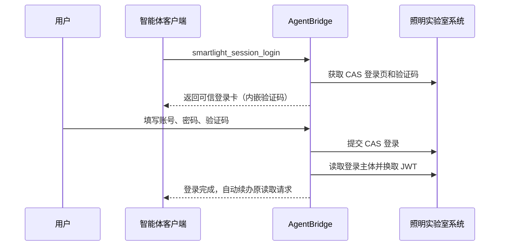

# 照明实验室测试系统适配说明

## 一、一期范围

目标系统：`http://123.232.113.241:4101/smartlight`。

一期只开放读取能力，并且只给 AgentBridge 第一用户 `guomao` 授权。第二用户及其他
客户端身份不会因为能力部署而自动获得权限。

已发布能力：

| MCP 工具 | 业务含义 | AgentBridge capability |
| --- | --- | --- |
| `smartlight_system_overview` | 控制柜、灯杆总量与状态概览 | `smartlight.system.overview` |
| `smartlight_lamppost_list` | 按关键词分页查询灯杆 | `smartlight.lamppost.list` |
| `smartlight_alarm_list` | 查询 RTU 告警 | `smartlight.alarm.list` |
| `smartlight_inspection_task_list` | 按任务、计划和状态查询巡检任务 | `smartlight.inspection_task.list` |
| `smartlight_leakage_summary` | 按日期查询漏电记录与汇总 | `smartlight.leakage.summary` |
| `smartlight_session_status` | 检查当前用户登录会话 | - |
| `smartlight_session_login` | 发起可信登录卡 | - |

本期不开放开关灯、远程控制、参数配置、告警处理、删除、新增或修改业务数据。

## 二、登录路线

该系统是 CAS 登录，登录页包含账号、密码和图片验证码。它不需要滑块、短信或远程
桌面，因此不使用语雀式 noVNC 可信浏览器。



验证码图片由 AgentBridge 从目标系统读取后以内嵌 `data:` 图片展示。目标系统 URL、
Cookie、JWT、密码摘要和隐藏登录字段不会进入模型上下文。验证码对应的 CAS Cookie
和隐藏字段保存在加密会话状态中，提交时恢复。

## 三、会话与身份

- `userSubject` 代表 AgentBridge 用户，不等同于目标系统账号。
- 当前测试账号为 `yanshi`，系统显示主体为 `无为`。
- 第一用户的 Smartlight 主体绑定应为 `smartlight=无为`。
- 登录成功时实际主体必须与绑定主体一致，否则会话进入隔离状态。
- CAS Cookie、JWT 和刷新所需状态按 `userSubject + systemId` 隔离并加密保存。
- 读取前会检查 CAS 主体并重新换取 JWT；登录失效时返回可信登录卡，登录后自动继续
  原查询。

## 四、网络安全边界

目标系统当前只提供 HTTP。AgentBridge 自身的 MCP、管理端、Workspace 和可信卡仍
使用内网 IP + HTTPS + 内部 CA；只有 AgentBridge 到照明系统这一段是明文 HTTP。

运行时必须同时配置：

```text
--smartlight-base-url http://123.232.113.241:4101/smartlight
--smartlight-allow-insecure-http
```

没有显式开关时，适配器拒绝启动 HTTP 下游。该开关不改变其他系统的 TLS、会话或
刷新机制。生产加固时应优先让目标系统启用 HTTPS，之后移除该开关。

## 五、验收标准

1. 只有第一用户的有效 MCP Token 包含 `smartlight:read`。
2. 第二用户的工具目录不出现 Smartlight 工具。
3. 未登录读取时生成含验证码的可信登录卡，登录后自动续办原查询。
4. 登录主体显示为 `无为`，并与已验证主体绑定一致。
5. 五项读取能力返回结构化、分页且有界的数据，不泄露 Cookie、JWT 或内部密码摘要。
6. 工具目录中不存在 Smartlight 写入或设备控制能力。
