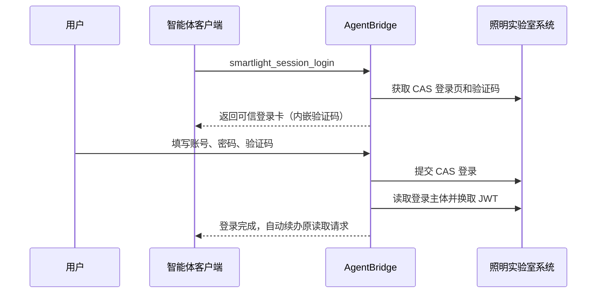

# 照明实验室测试系统适配说明

## 一、当前范围

目标系统：`http://123.232.113.241:4101/smartlight`。

当前开放十一项读取能力和一项受控、可逆的告警备注修改能力。Smartlight 能力目前只
面向 AgentBridge 第一用户 `guomao` 配置；第二用户及其他客户端身份不会因为代码部署
而自动获得权限，写权限还必须单独授予。

已发布能力：

| MCP 工具 | 业务含义 | AgentBridge capability |
| --- | --- | --- |
| `smartlight_system_overview` | 控制柜、可检索灯杆与地图明细灯杆概览 | `smartlight.system.overview` |
| `smartlight_lamppost_list` | 按关键词分页查询灯杆 | `smartlight.lamppost.list` |
| `smartlight_alarm_list` | 查询 RTU 告警和当前系统快照 | `smartlight.alarm.list` |
| `smartlight_inspection_task_list` | 按任务、计划和状态查询巡检组、进度及设备数 | `smartlight.inspection_task.list` |
| `smartlight_leakage_summary` | 按日期或最近 N 天查询漏电记录 | `smartlight.leakage.summary` |
| `smartlight_asset_search` | 统一查询控制柜、RTU 和灯杆 | `smartlight.asset.search` |
| `smartlight_asset_detail` | 读取设施详情；RTU 同时返回继电器和回路 | `smartlight.asset.detail` |
| `smartlight_alarm_analysis` | 有界分析 RTU 告警趋势和集中设备 | `smartlight.alarm.analysis` |
| `smartlight_inspection_task_detail` | 查询巡检每日进度和实际打卡记录 | `smartlight.inspection_task.detail` |
| `smartlight_leakage_analysis` | 有界分析漏电趋势和集中位置 | `smartlight.leakage.analysis` |
| `smartlight_report_export` | 导出有界 CSV 报告 | `smartlight.report.export` |
| `smartlight_alarm_remark_update_prepare` | 为精确 RTU 告警填写、授权并修改备注 | `smartlight.alarm.remark.update.prepare` |
| `smartlight_session_status` | 检查当前用户登录会话 | - |
| `smartlight_session_login` | 发起可信登录卡 | - |

真正执行修改的 `smartlight.alarm.remark.update` 是内部 commit 能力，不进入智能体工具
目录。当前不开放开关灯、远程控制、参数配置、告警处置状态、巡检打卡、删除或其他
业务数据修改。

二期工具的详细契约、接口证据和验收标准见
[照明实验室测试系统二期能力包](smartlight-phase2-capability-package.md)。
首项写能力的风险矩阵、可信交互和恢复方法见
[照明系统写能力一期](smartlight-write-phase1.md)。

### 读取口径

- 概览中的 `lampPostTotal` 与灯杆列表使用同一“可检索灯杆”口径；原地图明细接口的
  数量保留在 `lampPostCounts.mapDetail`，避免把两个页面的 131 和 116 误认为同一
  指标。
- RTU 告警的 `summary` 是查询时刻的系统看板快照，不是当前分页的统计结果；
  `occurredAt` 是首次发生时间，`lastActivityAt` 是最近活动时间，列表按
  `lastActivityAt` 在返回页内倒序排列。“最近告警”应优先展示最近活动时间。
- 漏电查询支持 `last_days`，AgentBridge 按 `Asia/Shanghai` 在服务端计算闭区间，
  智能体无需先调用通用时间工具。`rangeSummary.recordTotal` 是日期范围内记录数；
  `summary` 来自目标系统的全局实时看板，明确标记为不应用日期范围。
- 巡检任务状态码 `1` 表示待执行，`2` 表示执行中。返回巡检组、任务开始日、截止日、
  下游系统原始进度、已确认设备数、灯杆数和 RTU 数；目标接口没有人员字段时不会把
  巡检组冒充为个人负责人。系统进度与三类设备计数是不同口径，智能体不得将
  `confirmedDeviceCount / (lampPostCount + rtuCount)` 表述为完成数/总数或自行推导
  完成率。

## 二、登录路线

该系统是 CAS 登录，登录页包含账号、密码和图片验证码。它不需要滑块、短信或远程
桌面，因此不使用语雀式 noVNC 可信浏览器。



验证码图片由 AgentBridge 从目标系统读取后以内嵌 `data:` 图片展示。目标系统 URL、
Cookie、JWT、密码摘要和隐藏登录字段不会进入模型上下文。验证码对应的 CAS Cookie
和隐藏字段保存在加密会话状态中，提交时恢复。

## 三、会话与身份

- `userSubject` 代表 AgentBridge 用户，不等同于目标系统账号。
- 当前测试账号为 `yanshi`，系统显示主体为 `无为`。
- 第一用户的 Smartlight 主体绑定应为 `smartlight=无为`。
- 登录成功时实际主体必须与绑定主体一致，否则会话进入隔离状态。
- CAS Cookie、JWT 和刷新所需状态按 `userSubject + systemId` 隔离并加密保存。
- 读取前会检查 CAS 主体并重新换取 JWT；登录失效时返回可信登录卡，登录后自动继续
  原查询。

## 四、网络安全边界

目标系统当前只提供 HTTP。AgentBridge 自身的 MCP、管理端、Workspace 和可信卡仍
使用内网 IP + HTTPS + 内部 CA；只有 AgentBridge 到照明系统这一段是明文 HTTP。

运行时必须同时配置：

```text
--smartlight-base-url http://123.232.113.241:4101/smartlight
--smartlight-allow-insecure-http
```

没有显式开关时，适配器拒绝启动 HTTP 下游。该开关不改变其他系统的 TLS、会话或
刷新机制。生产加固时应优先让目标系统启用 HTTPS，之后移除该开关。

## 五、验收标准

1. 只有明确开通的第一用户 Token 包含 `smartlight:read`；写入还必须单独包含
   `smartlight:write:alarm_remark`。
2. 第二用户的工具目录不出现 Smartlight 工具。
3. 未登录读取时生成含验证码的可信登录卡，登录后自动续办原查询。
4. 登录主体显示为 `无为`，并与已验证主体绑定一致。
5. 十一项读取能力返回结构化、分页或有界的数据，不泄露 Cookie、JWT 或内部密码摘要。
6. 告警备注必须经过字段卡和授权卡；授权后若原备注变化则停止覆盖，保存后必须权威
   回读，新值不匹配时报告结果未知且不自动重试。
7. 测试修改后可通过同一可信流程写回原备注；智能体目录不出现内部 commit 或任何
   设备控制能力。
