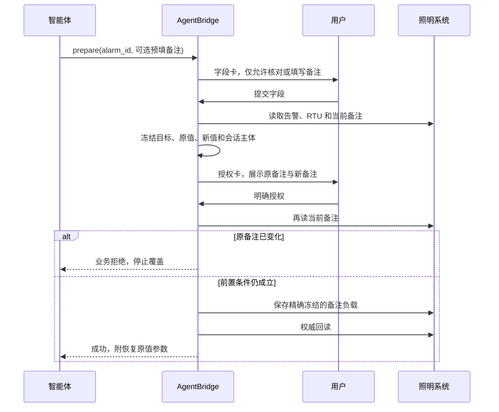

# 照明系统写能力一期

## 一、目标与边界

一期只实现“修改一条 RTU 告警备注”。该动作有明确业务价值、影响范围小，并可通过
再次写入原值恢复，适合作为照明系统受控写能力的正式样板。

对外入口：

- MCP 工具：`smartlight_alarm_remark_update_prepare`
- AgentBridge prepare capability：`smartlight.alarm.remark.update.prepare`
- 内部 commit capability：`smartlight.alarm.remark.update`
- 独立权限：`smartlight:write:alarm_remark`

内部 commit 不进入智能体工具目录。即使 Token 有写权限，智能体也只能先发起字段卡，
不能自行构造备注保存请求。

## 二、动作风险矩阵

| 动作 | 影响 | 可恢复性 | 一期结论 |
| --- | --- | --- | --- |
| 修改或清除 RTU 告警备注 | 改变单条告警的辅助说明 | 可再次写回原值 | 正式开放 |
| 标记告警已处理 | 改变业务处置状态，可能影响统计和责任链 | 未证实可逆 | 暂缓 |
| 提交或撤回工区 | 改变工区流转状态 | 条件式可逆 | 暂缓 |
| 巡检打卡 | 形成时间、人员和现场证据 | 不应随意撤销 | 暂缓 |
| 开关灯、RTU 或回路控制 | 直接作用于实体设备 | 可能造成现实影响 | 禁止纳入普通写能力 |
| 参数配置、删除业务数据 | 影响范围大或不可恢复 | 低 | 暂缓 |

## 三、可信执行流程

字段卡中的 `alarm_id` 是服务端保留的可信上下文，不允许用户在卡片中替换目标。
备注留空表示清除。字段卡提交不写业务系统，授权卡批准前也不写业务系统。

## 四、接口证据

经目标系统前端脚本和真实只读探测确认：

- 查找告警：`POST /rHisHitchAlarm/getDataByRtuAlarm`
- 读取备注：`POST /rHisHitchAlarm/getRtuAlarmRemark`，字段 `hitchAlarmId`
- 保存备注：`POST /rHisHitchAlarm/saveRtuAlarmRemark`
- 保存表单字段：`json=<序列化备注记录>`
- 明确成功条件：HTTP 200 且 JSON `code == 200`

目标列表接口未证实支持按告警 ID 精确过滤，因此适配器最多扫描当前账号最近 500 条
可见 RTU 告警。未找到时停止，不会猜测或改写其他告警。

## 五、并发、结果与恢复

1. prepare 冻结告警 ID、RTU ID、原备注和拟写入值。
2. commit 前重新读取；RTU 或原备注变化时返回
   `SMARTLIGHT_BUSINESS_RULE_REJECTED`，不会进入提交边界。
3. 只有通过前置条件检查后才消费一次性授权并调用保存接口。
4. 保存后再次调用备注读取接口；回读不等于拟写入值时返回 `RESULT_UNKNOWN`，不会自动
   重试，防止重复写入。
5. 成功结果携带恢复参数。验收使用“写入测试备注、回读、再授权恢复原备注”两次独立
   可信流程，不在后台直接回滚。

## 六、验收清单

1. 读 Token 看不到写入口，写 Token 同时保留 `smartlight:read`。
2. 字段卡预填智能体已提供的备注，且告警 ID 不可编辑。
3. 授权卡显示设备、告警类型、告警 ID、原备注和新备注。
4. 拒绝或过期时照明系统无变化。
5. 正式授权后保存成功且回读一致。
6. 修改成功后再走一次可信授权恢复原备注，最终回读与测试前一致。
7. OpenClaw、Workspace 和聊天端只公开 prepare，不公开 commit 或实体控制工具。
