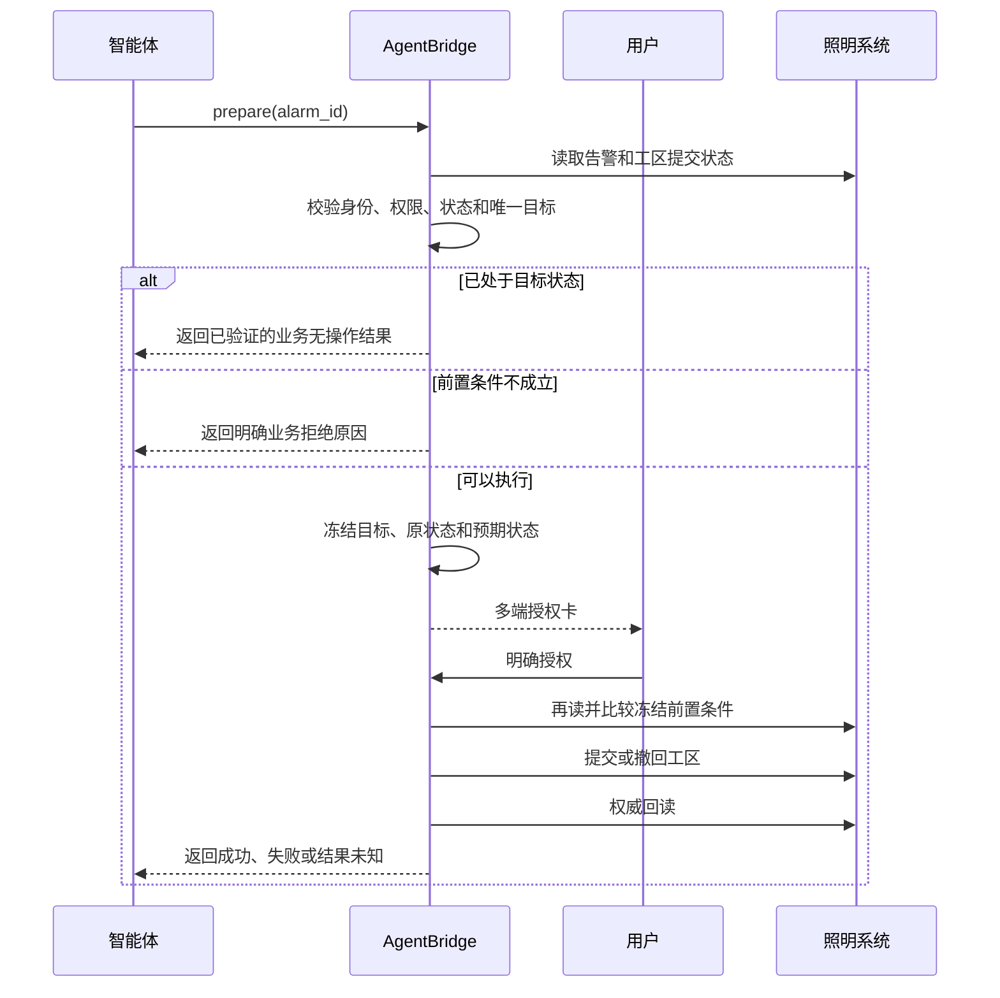

# 照明系统写能力二期研究与设计

## 一、文档结论

二期建议先正式实现 **RTU 告警提交工区** 和 **撤回工区提交**。两项动作属于同一条
业务流转链，目标明确、影响范围可控，并且目标系统同时提供正向和反向接口，适合作为
告警备注之后的第二组受控写能力。

本期不把“告警处置”混入工区流转。处置会直接改变告警业务状态，目标页面没有二次
确认，当前也未发现恢复接口，应作为独立的高风险能力另行设计。单灯告警处理、巡检
审核、巡检打卡和实体设备控制同样不进入本期实现。

本文记录的是研究结论和拟实施契约。除第九节如实记录的研究副作用外，本文形成时尚未
开发或发布新的 AgentBridge 写工具。

## 二、二期能力边界

| 业务动作 | 对外 prepare 工具 | 内部 commit capability | 建议权限 | 二期结论 |
| --- | --- | --- | --- | --- |
| 提交 RTU 告警到工区 | `smartlight_alarm_work_area_submit_prepare` | `smartlight.alarm.work_area.submit` | `smartlight:write:alarm_work_area_submit` | 正式实现 |
| 撤回 RTU 告警的工区提交 | `smartlight_alarm_work_area_revoke_prepare` | `smartlight.alarm.work_area.revoke` | `smartlight:write:alarm_work_area_revoke` | 正式实现 |
| RTU 告警处置 | 暂不开放 | 暂不注册 | `smartlight:write:alarm_disposition` | 单独立项 |
| 单灯告警处理 | 暂不开放 | 暂不注册 | 待定 | 继续研究 |
| 巡检路线审核 | 暂不开放 | 暂不注册 | 待定 | 继续研究 |
| 巡检打卡 | 不开放 | 不注册 | 不配置 | 排除 |
| 开关灯、RTU、回路或设备控制 | 不开放 | 不注册 | 不配置 | 禁止纳入普通写能力 |

智能体目录只公开两个 prepare 工具。commit capability 由可信交互协调器在用户授权后
调用，不直接暴露给 OpenClaw、Workspace 或其他 MCP 客户端。

## 三、页面与接口证据

### 3.1 RTU 告警页面

入口为“智能监控管理 -> 查询统计 -> RTU 报警记录”。页面支持按 RTU、报警时间、
报警类型、报警等级、当前状态、RTU 分组和是否已提交工区查询，列表提供“提交工区”、
“处置”和“导出”等批量动作。

列表中与二期写动作有关的原始字段包括：

- `hitchAlarmId`：告警唯一标识；
- `rtuId`、`rtuCode`、`rtuName`：目标设备；
- `hitchDicId`、`hitchName`、`hitchIntro`：告警类型和内容；
- `conductStatue`：告警处理状态；
- `weightFacto`：告警等级；
- `workAreaId`、`workAreaName`：所属工区；
- `isSubmitWorkArea`：工区提交状态；
- `occurDate`、`lastDate`：首次和最近发生时间。

### 3.2 提交工区

目标前端在用户确认后调用：

```text
POST /rHisHitchAlarm/updateIsSubmitWorkArea
hitchAlarmIds=<以逗号分隔的告警 ID>
```

响应值大于等于 `1` 时，目标前端认为提交成功并刷新列表。页面脚本还体现出以下业务
规则：

1. 只有 `weightFacto == 3` 的告警会被收集为可提交目标。
2. 选中项包含 `conductStatue == 2` 的告警时，页面会提示该告警不能提交并终止本批次。
3. 没有符合条件的告警时提示“请选择需要操作的报警”。
4. 页面提交前有“确定已经将选择的 RTU 报警信息提交工区处理了吗？”确认框。

AgentBridge 不直接照搬页面的宽松批处理逻辑。二期先限制为一次一条告警，并在 prepare
阶段显式检查设备、告警状态、等级、工区和当前提交状态，避免部分成功或错误归组。

### 3.3 撤回工区提交

目标前端的单条撤回动作调用：

```text
POST /rHisHitchAlarm/cancleSubmitWorkArea
hitchAlarmIds=<单个告警 ID>
```

下游路径中的 `cancle` 是目标系统现有拼写，适配器必须原样使用。响应值大于等于 `1`
时，目标前端认为撤回成功并刷新列表。

### 3.4 权威回读

现有列表接口为：

```text
POST /rHisHitchAlarm/getDataByRtuAlarm
```

它返回 `isSubmitWorkArea`、`conductStatue`、工区和告警标识，可用于提交前快照和提交后
验真。目标页面还提供“是否已提交工区”过滤条件。正式开发时需要先通过只读探测确定
`isSubmitWorkArea` 的未提交、已提交具体编码，再固化状态映射；不能根据字段为空或
真值自行猜测。

## 四、对外业务语义

### 4.1 提交工区

用户可使用“把设备 05317878 的通信失败告警提交工区处理”等自然语言。智能体负责
定位候选告警；候选不唯一时先让用户选择，不把内部接口、状态码或批量 ID 暴露给用户。

prepare 的最小输入为 `alarm_id`。可选的 RTU 编号、告警类型或时间只用于检索和消歧，
不能替代服务端最终读取到的告警 ID。

### 4.2 撤回工区提交

用户可使用“撤回刚才提交工区的那条通信失败告警”。跨端任务上下文可以帮助定位
候选，但 prepare 仍必须在 Smartlight 中重新读取并锁定唯一告警，不能只相信聊天历史。

提交和撤回是两个独立用户意图，分别授权。提交成功后不会自动静默撤回；真实验收的
恢复步骤也必须生成另一张授权卡。

## 五、可信执行流程



这两项动作没有需要用户填写的业务字段，因此不额外制造空白字段卡，直接展示授权卡。
授权卡至少显示执行主体、RTU、告警类型、首次和最近发生时间、当前告警状态、所属工区、
当前工区提交状态和将要执行的动作。

## 六、前置条件与结果语义

### 6.1 提交前置条件

1. 当前 MCP 身份具有 `smartlight:write:alarm_work_area_submit`。
2. Smartlight 会话有效，实际主体与 AgentBridge 已验证主体一致。
3. `alarm_id` 对当前主体可见，并唯一对应一条 RTU 告警。
4. 告警等级为目标页面允许提交的等级，即 `weightFacto == 3`。
5. 告警未解除、未处置，正式编码以开发期只读状态映射为准。
6. 告警存在有效 `workAreaId`；工区名称为空时授权卡同时显示工区 ID，不能猜名称。
7. 当前尚未提交工区。

### 6.2 撤回前置条件

1. 当前 MCP 身份具有 `smartlight:write:alarm_work_area_revoke`。
2. 会话、主体和告警目标校验与提交动作相同。
3. 当前告警已提交工区，且目标系统仍允许撤回。
4. 授权卡生成后，告警状态、工区和提交状态未发生变化。

### 6.3 结果分类

- **成功**：下游返回明确成功，且权威回读达到目标状态。
- **已是目标状态**：prepare 已验证告警已提交或已撤回；返回业务无操作结果，不消费
  授权，不重复写入。
- **业务拒绝**：等级、告警状态、工区、当前提交状态或并发快照不满足规则；向用户返回
  具体原因。
- **明确失败**：下游明确拒绝且回读仍为原状态；可以安全报告失败。
- **`RESULT_UNKNOWN`**：请求可能已经到达下游，但响应或回读不足以确认结果。此时停止，
  不自动重试，由后续只读核对决定下一步。

## 七、并发、幂等与批量策略

1. prepare 冻结 `alarm_id`、RTU、告警类型、`conductStatue`、`weightFacto`、工区和
   `isSubmitWorkArea`。
2. commit 前重新读取；任一关键字段变化都拒绝执行，要求重新 prepare。
3. 一次性授权只允许一个动作和一个告警，提交与撤回不能共用同一授权。
4. 二期内部接口即使支持逗号分隔的批量 ID，对外也只接受单条。智能体处理多条时按序
   生成独立卡片、独立结果，避免一条失败掩盖其他条目。
5. 下游成功响应不能单独作为最终成功依据，必须回读 `isSubmitWorkArea`。
6. 发生超时或 `RESULT_UNKNOWN` 后不得自动重放 commit。

## 八、暂缓能力及理由

### 8.1 RTU 告警处置

目标前端直接调用：

```text
POST /rHisHitchAlarm/setRtuConductStatusDisposed
json=<以逗号分隔的告警 ID>
```

页面脚本允许 `conductStatue` 为 `0` 或 `1` 的告警进入处置，并把 `2` 识别为已解除、
`3` 识别为已处置。该动作没有确认框，前端返回 `1` 时立即刷新；目前未发现恢复处置
状态的接口。因此它不能与可逆的工区提交混用权限，后续如开放，至少需要单条目标、
独立高风险权限、AgentBridge 强制确认、明确的不可逆提示和专门测试样本。

### 8.2 单灯告警处理

前端存在以下接口：

- `/lHisHitchAlarm/handlingAlarm`
- `/lHisHitchAlarm/manualHandlingAlarm`
- `/lHisHitchAlarm/manualHandlingAlarms`

其负载还包含到达时间、备注和告警状态，业务语义与 RTU 工区流转不同，且未发现恢复
接口。应另建“单灯告警处理”流程样板，不复用二期工区提交的 commit。

### 8.3 巡检路线审核

前端通过 `/llamppostSurveyCheck/check` 提交审核 ID、状态和意见，状态 `1`、`2` 分别
代表通过和驳回。审核前页面会加载巡检明细和照片，属于带证据的审批动作。后续需要先
确认角色权限、真实样本、图片读取和是否存在撤回机制，再决定开放。

巡检打卡会形成时间、人员、位置或现场证据；开关灯和设备控制直接影响实体设施；参数
配置和删除会扩大影响范围。这些动作均不属于二期。

## 九、研究过程中的真实副作用

2026-08-13 研究 RTU 报警记录页时，为确认“处置”是否会出现二次确认，误点了页面
“处置”按钮。目标系统没有确认框并立即执行，告警随后从未处置结果集中消失。

受影响目标：

- 告警 ID：`rha1202388535169126400`
- RTU：`05312222--牛测试1030`
- 告警类型：异常灭灯
- 操作前 `conductStatue=0`、`weightFacto=1`

这次动作没有经过 AgentBridge 新写能力，也没有触发开关灯或实体设备控制；影响是告警
业务处置状态。页面未处置数随即从 `17` 变为 `16`，随后通过既有 Smartlight 只读工具
取得的系统快照也显示 `untreated=16`。现有读工具未按该告警 ID 返回处置详情，因此这里只
确认它退出了未处置集合，不推断更多下游状态。当前未发现可逆接口，因此没有盲目回写。
该事件形成两条开发约束：研究
阶段不再通过点击写动作按钮探测是否存在确认框；所有正式处置能力必须由 AgentBridge
增加自身的强制授权卡，不能依赖遗留页面的安全交互。

## 十、开发与真实验收计划

1. **只读状态映射**：确定 `isSubmitWorkArea` 的未提交、已提交编码，核实处置或解除后
   是否仍允许撤回。
2. **适配器实现**：增加单条提交、单条撤回和权威回读方法，不增加批量或设备控制接口。
3. **执行治理**：实现两个 prepare、两个内部 commit、独立权限、一次性授权、并发快照
   和审计记录。
4. **MCP 与多端**：只注册 prepare 工具，确保 Workspace、Telegram、微信收到同一张
   授权卡和按序结果。
5. **自动化测试**：覆盖权限裁剪、非法等级、无工区、已提交、未提交、会话主体不符、
   并发变化、明确失败、结果未知和禁止自动重试。
6. **可逆真实验收**：由用户明确选定测试告警后，记录原状态，授权提交工区并回读；再
   通过另一张授权卡撤回并回读，最终状态必须与测试前一致。

真实验收不得使用第九节已经被处置的告警，也不得把“实验室工区-勿动”等名称当作
天然授权。必须由用户明确指定或确认精确测试目标。

## 十一、完成标准

- 智能体可根据 RTU、告警类型和时间定位唯一告警，歧义时先选择。
- 两个动作使用独立权限，commit 不进入智能体工具目录。
- 授权卡完整展示目标、身份、原状态和预期状态。
- 非法状态在 prepare 阶段被明确拒绝，错误原因可直接反馈用户。
- commit 前检测并发变化，写后进行权威回读。
- 成功、业务拒绝、明确失败和 `RESULT_UNKNOWN` 四类结果可区分。
- 多条任务按单条卡片有序处理，不出现只完成第一条或重复卡片。
- 提交与撤回真实验收结束后，目标状态恢复到测试前值。
