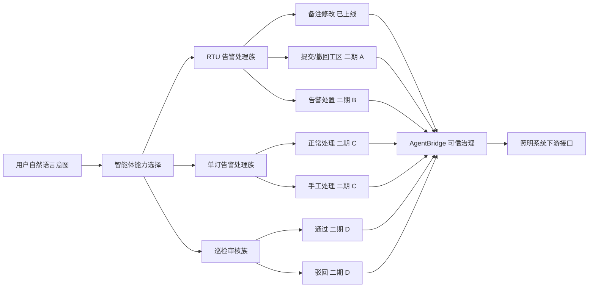
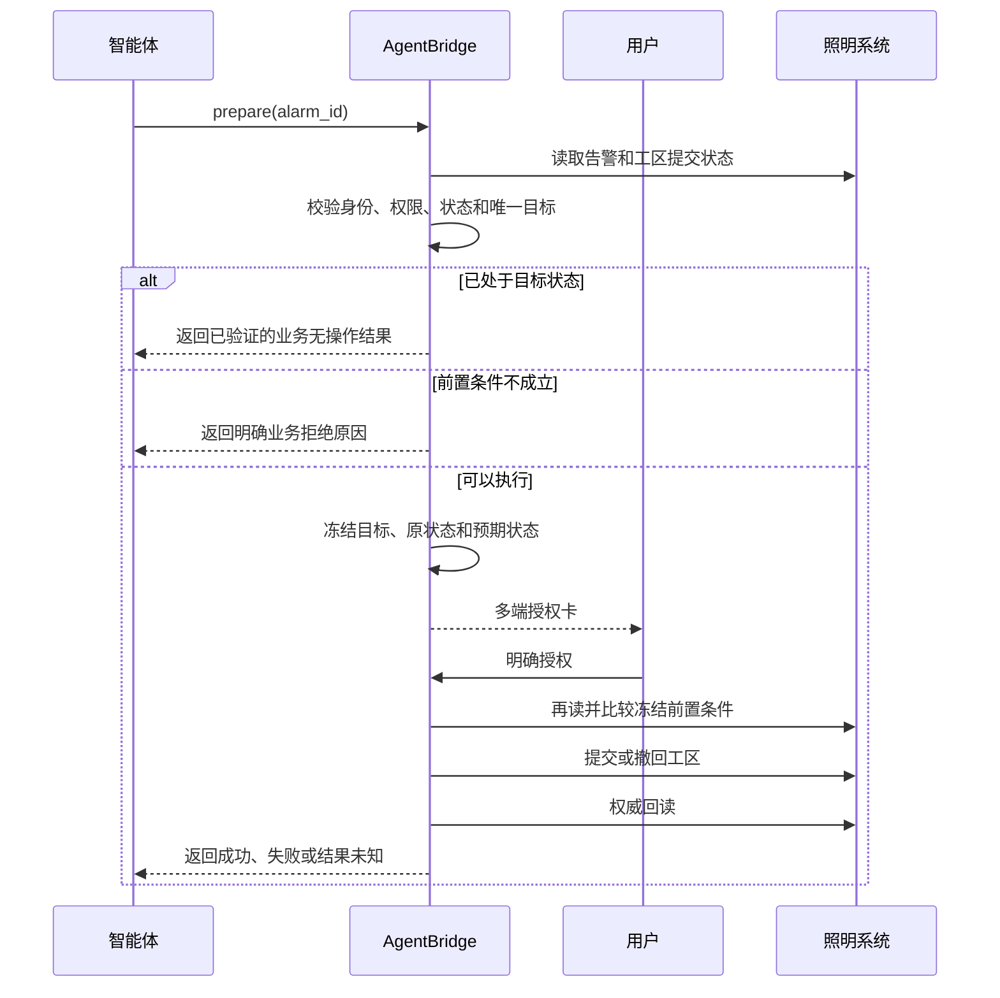
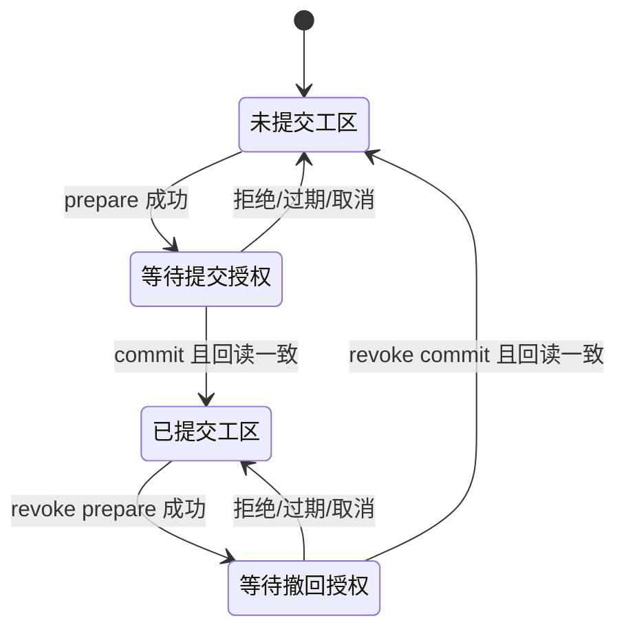
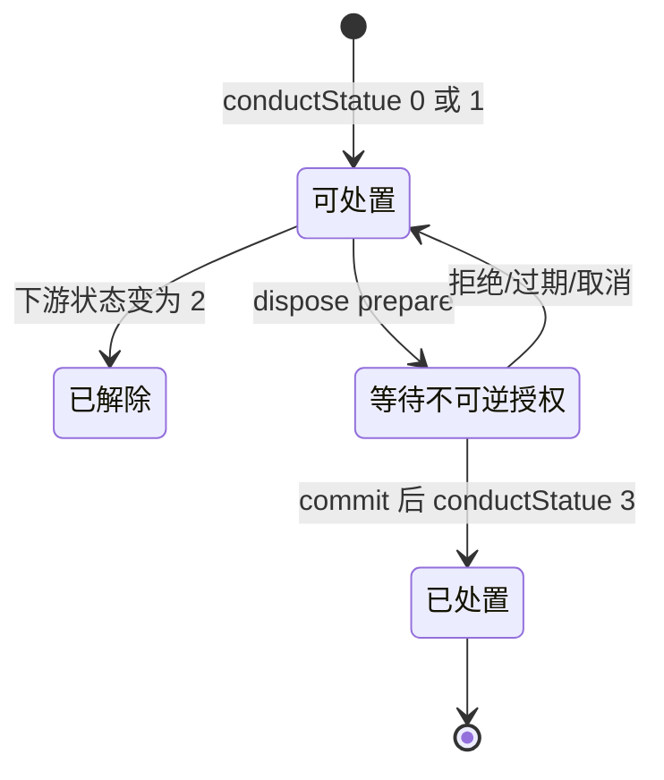
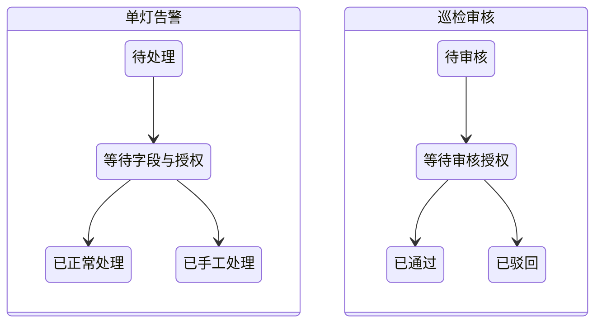

# 照明系统写能力二期研究与设计

## 一、文档结论

二期不再只做一个零散按钮，而是形成一个完整的 **照明业务处理能力包**。能力包覆盖
三类业务对象：RTU 告警、单灯告警和巡检审核；再按风险和证据成熟度拆成四个开发波次。

第一波正式实现 **RTU 告警提交工区** 和 **撤回工区提交**。两项动作属于同一条业务
流转链，目标明确、影响范围可控，并且目标系统同时提供正向和反向补偿接口，适合作为
告警备注之后的第二组受控写能力。当前只能确认“存在反向接口”，在通知、审计和后续
工区流程等伴随影响完成实测前，不把整个业务过程表述为完全可逆。

后续三波分别研究并实现 RTU 告警处置、单灯告警处理和巡检审核。它们都已经找到前端
入口与下游接口，但由于不可逆、字段更多或依赖现场证据，必须逐波补齐状态回读和真实
样本后才能发布。巡检打卡、开关灯、RTU/回路控制、参数配置和删除仍明确排除。

本文记录的是研究结论、完整能力规划和拟实施契约。除第十节如实记录的研究副作用外，
本文形成时尚未开发或发布新的 AgentBridge 写工具。

**二期发布基线是 A 波次。** A 完成代码、自动化、真实补偿验收和生产授权后，即可作为
首个二期版本发布。B-D 是同一能力包的后续增量，每一波都独立经历“研究完成、代码完成、
真实验收、生产授权”四道门槛；未达到下一门槛不会阻塞 A，也不会因为写入本文就自动上线。

### 1.1 二期要解决的问题

一期证明了 AgentBridge 可以对单条告警备注完成“准备、用户授权、提交、回读、恢复”。
二期要把这个样板扩展为真正能办事的能力：

1. 智能体不只会查告警，还能把异常送入工区处理并在需要时撤回。
2. 对高风险处置，AgentBridge 自己增加强制确认，弥补遗留页面没有确认框的问题。
3. 单灯告警和 RTU 告警使用各自的业务模型，不把不同接口包装成假装通用的“提交”。
4. 巡检审核必须先把现场明细和图片作为证据展示给用户，再允许通过或驳回。
5. 多端看到同一操作、同一授权卡和同一最终结果，任何一端确认后其他端同步收口。
6. 管理员能从控制台看见谁、以什么下游主体、对哪个设备执行了什么动作以及回读结果。

### 1.2 非目标

- 不通过 AgentBridge 直接开关路灯、控制 RTU、回路、继电器或水浸设备。
- 不创建巡检打卡、位置、照片等现场证据。
- 不修改控制参数、角色权限、开关灯计划或系统配置。
- 不开放删除接口，也不把前端脚本中发现的所有写接口机械地做成 MCP 工具。
- 不允许智能体绕过可信交互，直接调用内部 commit capability。

### 1.3 能力全景



## 二、二期能力边界与开发分波

| 波次 | 业务动作 | 建议对外入口 | 建议权限 | 当前成熟度 |
| --- | --- | --- | --- | --- |
| 二期 A | 提交 RTU 告警到工区 | `smartlight_alarm_work_area_submit_prepare` | `smartlight:write:alarm_work_area_submit` | 存在反向补偿接口，优先实现并验证伴随影响 |
| 二期 A | 撤回 RTU 告警的工区提交 | `smartlight_alarm_work_area_revoke_prepare` | `smartlight:write:alarm_work_area_revoke` | 接口明确，需实测状态编码 |
| 二期 B | RTU 告警处置 | `smartlight_rtu_alarm_dispose_prepare` | `smartlight:write:alarm_disposition` | 接口明确，不可逆，需专门样本 |
| 二期 C | 单灯告警正常处理 | `smartlight_lamp_alarm_handle_prepare` | `smartlight:write:lamp_alarm_handle` | 接口和字段明确，需回读研究 |
| 二期 C | 单灯告警手工处理 | `smartlight_lamp_alarm_manual_handle_prepare` | `smartlight:write:lamp_alarm_manual` | 接口和字段明确，需回读研究 |
| 二期 D | 巡检路线通过 | `smartlight_inspection_approve_prepare` | `smartlight:write:inspection_approve` | 接口明确，需权限和图片样本 |
| 二期 D | 巡检路线驳回 | `smartlight_inspection_reject_prepare` | `smartlight:write:inspection_reject` | 接口明确，意见必填且风险更高 |
| 排除 | 巡检打卡 | 不注册 | 不配置 | 会形成现场证据 |
| 排除 | 开关灯、RTU、回路或设备控制 | 不注册 | 不配置 | 会影响实体设备 |
| 排除 | 参数配置、角色授权和删除 | 不注册 | 不配置 | 影响范围大或不可恢复 |

### 2.1 为什么按能力族组织

如果不加组织地把每个页面按钮都直接变成 MCP 工具，智能体目录会充斥零散技术动作，
很难理解它们属于哪个业务对象。二期改成三个稳定能力族：

- RTU 告警处理族：目标是处理一条 RTU 告警，动作是备注、工区提交、撤回或处置。
- 单灯告警处理族：目标是处理一条单灯告警，模式是正常处理或手工处理。
- 巡检审核族：目标是审核一条巡检路线，决策是通过或驳回。

一期已经发布的 `smartlight_alarm_remark_update_prepare` 为保持兼容暂不删除。二期 A
继续使用动作明确的 prepare 工具，并通过工具描述、提示词和管理端将它们归入“RTU
告警处理”能力族。当前 MCP 目录按工具静态绑定 scope，因此提交、撤回和不可逆处置
分别使用独立 prepare 工具，避免低权限 Token 看见或调用更高风险动作。

能力族是对用户、智能体和管理端的业务组织，不要求把不同风险动作强行压进一个 MCP
工具。用户仍然只说业务意图，智能体选择正确的 prepare；真正的下游原子 commit 始终
隐藏。

### 2.2 分波状态门槛

| 波次 | 研究完成 | 代码完成 | 真实验收 | 生产授权 | 当前结论 |
| --- | --- | --- | --- | --- | --- |
| A 工区流转 | 部分完成 | 否 | 否 | 否 | 进入状态编码与伴随影响研究 |
| B RTU 处置 | 接口证据完成 | 否 | 仅发生过非计划处置 | 否 | 需不可逆专用样本 |
| C 单灯告警 | 前端接口初步完成 | 否 | 否 | 否 | 需读接口、状态和回读研究 |
| D 巡检审核 | 前端接口初步完成 | 否 | 否 | 否 | 需角色、证据和真实样本 |

这里的“研究完成”表示接口、字段、状态和回读谓词均已确认，不只是找到一个 URL。生产
授权表示完成部署后显式给具体 Token 加 scope；代码存在不等于用户已经获得能力。

### 2.3 对外与内部动作的区别

对外 prepare 接收用户业务意图，负责查找、消歧、校验、组织字段卡和授权卡。内部
commit 只接受 AgentBridge 已冻结的精确负载。例如 RTU 告警能力族内部仍有：

| 内部动作 | capability | 是否直接进入智能体目录 |
| --- | --- | --- |
| 修改备注 | `smartlight.alarm.remark.update` | 否 |
| 提交工区 | `smartlight.alarm.work_area.submit` | 否 |
| 撤回工区 | `smartlight.alarm.work_area.revoke` | 否 |
| 告警处置 | `smartlight.alarm.dispose` | 否 |

这样既保持业务入口简洁，也不会错误地假设四个动作使用同一个下游 API。

commit 的隐藏不是只靠工具目录。服务端必须把它实现为不可绕过的不变量：普通 capability
调用即使知道 commit 名称也会被拒绝；commit 只接受由对应 prepare 生成的冻结计划、
未消费的一次性授权、匹配的 `userSubject`、下游主体、scope、系统会话和 capability。
缺少或不匹配任一条件都不得进入下游提交边界。

## 三、页面与接口证据

### 3.1 RTU 告警页面

入口为“智能监控管理 -> 查询统计 -> RTU 报警记录”。页面支持按 RTU、报警时间、
报警类型、报警等级、当前状态、RTU 分组和是否已提交工区查询，列表提供“提交工区”、
“处置”和“导出”等批量动作。

列表中与二期写动作有关的原始字段包括：

- `hitchAlarmId`：告警唯一标识；
- `rtuId`、`rtuCode`、`rtuName`：目标设备；
- `hitchDicId`、`hitchName`、`hitchIntro`：告警类型和内容；
- `conductStatue`：告警处理状态；
- `weightFacto`：告警等级；
- `workAreaId`、`workAreaName`：所属工区；
- `isSubmitWorkArea`：工区提交状态；
- `occurDate`、`lastDate`：首次和最近发生时间。

### 3.2 提交工区

目标前端在用户确认后调用：

```text
POST /rHisHitchAlarm/updateIsSubmitWorkArea
hitchAlarmIds=<以逗号分隔的告警 ID>
```

响应值大于等于 `1` 时，目标前端认为提交成功并刷新列表。页面脚本还体现出以下业务
规则：

1. 只有 `weightFacto == 3` 的告警会被收集为可提交目标。
2. 选中项包含 `conductStatue == 2` 的告警时，页面会提示该告警不能提交并终止本批次。
3. 没有符合条件的告警时提示“请选择需要操作的报警”。
4. 页面提交前有“确定已经将选择的 RTU 报警信息提交工区处理了吗？”确认框。

AgentBridge 不直接照搬页面的宽松批处理逻辑。二期先限制为一次一条告警，并在 prepare
阶段显式检查设备、告警状态、等级、工区和当前提交状态，避免部分成功或错误归组。

### 3.3 撤回工区提交

目标前端的单条撤回动作调用：

```text
POST /rHisHitchAlarm/cancleSubmitWorkArea
hitchAlarmIds=<单个告警 ID>
```

下游路径中的 `cancle` 是目标系统现有拼写，适配器必须原样使用。响应值大于等于 `1`
时，目标前端认为撤回成功并刷新列表。

### 3.4 权威回读

现有列表接口为：

```text
POST /rHisHitchAlarm/getDataByRtuAlarm
```

它返回 `isSubmitWorkArea`、`conductStatue`、工区和告警标识，可用于提交前快照和提交后
验真。目标页面还提供“是否已提交工区”过滤条件。正式开发时需要先通过只读探测确定
`isSubmitWorkArea` 的未提交、已提交具体编码，再固化状态映射；不能根据字段为空或
真值自行猜测。

### 3.5 单灯告警处理

入口位于“单灯节能管理 -> 查询统计 -> 告警记录管理”。前端脚本区分正常处理、手工
处理和批量手工处理：

```text
POST /lHisHitchAlarm/handlingAlarm
json={
  "hisHitchAlarmId": "...",
  "arrivalTime": "yyyy-MM-dd HH:mm:ss",
  "remark": "...",
  "processed": true,
  "alarmStatus": <原告警状态>
}
```

```text
POST /lHisHitchAlarm/manualHandlingAlarm
json={
  "hisHitchAlarmId": "...",
  "arrivalTime": "yyyy-MM-dd HH:mm:ss",
  "remark": "...",
  "alarmStatus": 3
}
```

批量接口为 `/lHisHitchAlarm/manualHandlingAlarms`，负载使用 `alarmIds` 数组。目标前端只
把 `alarmState != 3` 的选中项放入批量负载，响应等于或大于 `1` 时提示处理成功。

这些接口虽都叫“处理告警”，但字段和状态语义与 RTU 告警不同。二期 C 先开放单条
处理，不直接暴露批量接口；多个目标由智能体按序生成卡片和独立结果。

### 3.6 巡检路线审核

巡检路线页面会先读取巡检明细和现场图片，再通过以下接口审核：

```text
POST /llamppostSurveyCheck/check
id=<巡检审核 ID>
status=<1 或 2>
remark=<审核意见>
```

前端证据显示 `status=1` 为通过，`status=2` 为驳回。辅助读取接口包括：

- `/llamppostRoadSurveyCheck/getDataByLamppostCheckId`
- `/llamppostSurveyCheck/getLamppostSurveyCheckPic`
- `/llamppostSurveyCheck/getDddLamppostSurveyCheckByCondition`

这不是简单的“点同意”。授权卡必须呈现巡检路线、提交人、时间、设备范围、异常项、
现场图片摘要和审核意见；图片需要以任务附件或安全预览交付，不能只给出下游 URL。

### 3.7 其他写接口的分类结论

前端静态研究还发现多类写接口，但它们不等于都应开放：

| 接口族 | 业务含义 | 处理结论 |
| --- | --- | --- |
| `/rtuCommand/rtuSwitch` | RTU/回路开关控制 | 实体控制，排除 |
| `/singlelamp/switch*` | 单灯开关、取消操作 | 实体控制，排除 |
| `/waterOutLamppost/controlOff*` | 水浸联动关灯 | 安全联动控制，排除 |
| `/deviceCommand/updateData` | 设备命令或状态更新 | 语义过宽，排除 |
| `/rRtuCircuitDiagram/saveRtuCircuitDiagram` | RTU 回路图配置 | 配置写，排除 |
| `/lAloneLampSpecial/*` | 单灯特殊参数 | 配置写，排除 |
| `/lamppostPasteLabel/update*` | 灯杆标签和审核信息 | 候选三期，需单独研究 |
| `/relectricLeakageLightlog/updateStatus`、`/lelectricLeakageLightlog/updateStatus` | 漏电告警状态 | 候选三期，需回读和安全分析 |
| `/sysOperationlogs/insertData`、设备操作记录接口 | 下游审计记录 | 由业务动作伴随调用，不作为用户工具 |

二期的扩充重点是把业务闭环做完整，而不是追求接口数量。

## 四、对外业务语义

### 4.1 提交工区

用户可使用“把设备 05317878 的通信失败告警提交工区处理”等自然语言。智能体负责
定位候选告警；候选不唯一时先让用户选择，不把内部接口、状态码或批量 ID 暴露给用户。

prepare 的输入必须包含唯一 `alarm_id`。RTU 编号、告警类型和时间由现有读工具用于前置
检索和消歧，不能直接传给写 prepare 代替下游主键。这样 prepare 的职责始终是对一个
明确目标建立可信计划，不同时扮演模糊搜索工具。

### 4.2 撤回工区提交

用户可使用“撤回刚才提交工区的那条通信失败告警”。跨端任务上下文可以帮助定位
候选，但 prepare 仍必须在 Smartlight 中重新读取并锁定唯一告警，不能只相信聊天历史。

提交和撤回是两个独立用户意图，分别授权。提交成功后不会自动静默撤回；真实验收的
恢复步骤也必须生成另一张授权卡。

### 4.3 RTU 告警处置

用户表达通常是“把 05312222 的异常灭灯告警标记为已处置”。智能体必须先返回唯一
候选和当前状态。对 `dispose` 动作不设置默认值，不把“处理一下”“看一下这个告警”
推断为处置，也不因为用户拥有处置权限而跳过最终授权。

授权卡需要醒目标注“目标系统未发现撤销处置接口”，并显示告警是否仍在发生。用户
拒绝、授权过期或卡片被其他端取消时，不能执行任何下游请求。

### 4.4 单灯告警处理

用户可以说“处理灯杆 310203 的离线告警，到场时间为 14:30，备注为线路已恢复”。
智能体定位唯一单灯告警后，根据用户意图选择正常处理或手工处理：

- 正常处理：保留目标告警原状态，提交 `processed=true`、到场时间和备注。
- 手工处理：明确把告警状态设为 `3`，适用于人工确认后关闭告警。

到场时间和备注属于用户业务输入，因此需要字段卡。用户已经在聊天中提供的信息必须
预填；到场时间缺失时可以预填当前时间，但必须允许用户核对，不能静默代填后直接提交。

### 4.5 巡检审核

用户可以说“审核第 2 条巡检路线，通过，意见为现场情况正常”。智能体先读取审核列表
和证据详情，再生成字段卡。`decision`、`remark` 是可核对字段；驳回时意见必填，通过时
也建议有明确意见。用户确认字段后再展示最终授权卡。

若现场图片下载失败、设备范围缺失或审核记录已被他人处理，应返回明确业务拒绝，不以
不完整证据继续审核。

### 4.6 自然语言到动作的示例

| 用户表达 | 选择的能力 | 预期交互 |
| --- | --- | --- |
| “把 05317878 的通信失败告警提交工区” | RTU / `submit_work_area` | 唯一定位后直接授权 |
| “撤回刚才那条工区提交” | RTU / `revoke_work_area` | 从任务上下文找候选，再实时重读和授权 |
| “把这个异常灭灯告警处理了” | 需要消歧 | 询问是提交工区还是最终处置 |
| “标记为已处置” | RTU / `dispose` | 高风险授权，提示不可逆 |
| “处理 310203 的灯故障，到场 15:00” | 单灯 / `normal` | 预填字段卡，再授权 |
| “手工关闭这条单灯告警” | 单灯 / `manual` | 预填状态 3，强提示不可逆 |
| “把这条巡检驳回，照片不清晰” | 巡检 / `reject` | 展示证据、预填意见，再授权 |

“处理”“办一下”“关闭”都可能对应多个下游动作。智能体没有足够上下文时必须询问，
不能把模糊动词默认映射到不可逆动作。

## 五、可信执行流程



这两项动作没有需要用户填写的业务字段，因此不额外制造空白字段卡，直接展示授权卡。
授权卡至少显示执行主体、RTU、告警类型、首次和最近发生时间、当前告警状态、所属工区、
当前工区提交状态和将要执行的动作。

### 5.1 哪些动作需要字段卡

| 动作 | 字段卡 | 授权卡 | 原因 |
| --- | --- | --- | --- |
| 提交工区 | 不需要 | 需要 | 没有用户填写字段，只核对目标和动作 |
| 撤回工区 | 不需要 | 需要 | 没有用户填写字段，只核对目标和动作 |
| RTU 告警处置 | 不需要 | 强制需要 | 不可逆，必须明确确认 |
| 单灯正常处理 | 需要 | 需要 | 到场时间、备注需要填写或核对 |
| 单灯手工处理 | 需要 | 强制需要 | 到场时间、备注和状态均影响结果 |
| 巡检通过 | 需要 | 需要 | 审核意见需要核对，证据需要预览 |
| 巡检驳回 | 需要 | 强制需要 | 驳回意见必填，业务影响较大 |

字段卡提交只是收集信息，绝不写入照明系统。最终授权卡冻结业务目标和字段值；任何端
修改字段后，都必须使旧授权卡失效并生成新授权卡。

### 5.2 多端交互要求

1. Workspace、Telegram、微信展示同一个 `interaction_id`，不能各自复制一张独立卡。
2. 任一端填写字段后，其他端同步最新摘要和待授权状态。
3. 任一端批准、拒绝、取消或操作完成后，其他端卡片立即进入对应终态。
4. 文本进度与卡片事件使用同一任务时间线并保持顺序。
5. 多条告警按一条一卡组织；上一条完成后才展示下一条，避免卡片遗漏和状态串线。
6. 登录失效时先完成可信登录，登录成功后自动续办原 prepare，不能让用户重新说一遍。

### 5.3 授权卡信息模板

RTU 告警卡：

```text
动作：提交工区 / 撤回工区 / 标记已处置
执行身份：无为
RTU：05317878（名称）
告警：通信失败
首次发生：...
最近发生：...
当前状态：当前告警 / 非当前告警 / 已处置
所属工区：实验室工区-勿动（workAreaId=...）
当前工区状态：未提交 / 已提交
风险提示：处置不可撤回（仅处置动作显示）
```

单灯告警卡还要显示灯杆、单灯或控制单元、道路、告警状态、到场时间和备注。巡检审核卡
还要显示审核对象、提交人、设备数、异常项、照片数、审核决定和意见。

## 六、前置条件与结果语义

### 6.1 提交前置条件

1. 当前 MCP 身份具有 `smartlight:write:alarm_work_area_submit`。
2. Smartlight 会话有效，实际主体与 AgentBridge 已验证主体一致。
3. `alarm_id` 对当前主体可见，并唯一对应一条 RTU 告警。
4. 告警等级为目标页面允许提交的等级，即 `weightFacto == 3`。
5. 告警未解除、未处置，正式编码以开发期只读状态映射为准。
6. 告警存在有效 `workAreaId`；工区名称为空时授权卡同时显示工区 ID，不能猜名称。
7. 当前尚未提交工区。

### 6.2 撤回前置条件

1. 当前 MCP 身份具有 `smartlight:write:alarm_work_area_revoke`。
2. 会话、主体和告警目标校验与提交动作相同。
3. 当前告警已提交工区，且目标系统仍允许撤回。
4. 授权卡生成后，告警状态、工区和提交状态未发生变化。

### 6.3 结果分类

- **成功**：下游返回明确成功，且权威回读达到目标状态。
- **已是目标状态**：prepare 已验证告警已提交或已撤回；返回业务无操作结果，不消费
  授权，不重复写入。
- **业务拒绝**：等级、告警状态、工区、当前提交状态或并发快照不满足规则；向用户返回
  具体原因。
- **明确失败**：下游明确拒绝且回读仍为原状态；可以安全报告失败。
- **`RESULT_UNKNOWN`**：请求可能已经到达下游，但响应或回读不足以确认结果。此时停止，
  不自动重试，由后续只读核对决定下一步。

### 6.4 面向用户的失败反馈

底层错误码用于审计，面向用户必须说明可行动原因：

| 场景 | 用户反馈示例 |
| --- | --- |
| 告警不存在 | “未找到这条告警，可能已解除或当前账号无权查看。” |
| 多条同名告警 | “找到 3 条通信失败告警，请选择 RTU 和发生时间。” |
| 等级不能提交工区 | “该告警等级不是工区接收范围，照明系统不允许提交。” |
| 已提交 | “该告警已经提交到工区，本次没有重复写入。” |
| 已撤回 | “该告警当前未提交工区，无需撤回。” |
| 已处置/已解除 | “告警状态已经变化，请重新查看后决定下一步。” |
| 审核记录已处理 | “该巡检记录已由其他人审核，本次授权未执行。” |
| 下游明确拒绝 | 返回照明系统的可理解原因，不只显示 `CAPABILITY_EXECUTION_FAILED` |
| 响应丢失、回读不足 | 提示结果无法确认并停止，不建议用户立即重复提交 |

### 6.5 主体、角色与权限

AgentBridge 的 `userSubject`、客户端账号、Smartlight 登录账号和下游显示主体属于不同
层级。每次写操作必须同时记录：

- AgentBridge `userSubject`；
- 发起端和发送者标识；
- Smartlight 已验证主体；
- Smartlight 登录账号或主体引用；
- capability、操作 ID、目标业务 ID 和授权端。

权限只决定“可以发起哪类可信交互”，不能代替目标系统自身的菜单、组织和角色校验。
若第二用户未来开通 Smartlight，必须独立登录、独立主体绑定、独立 Token 和独立权限，
不得复用第一用户会话。

## 七、并发、幂等与批量策略

1. prepare 冻结 `alarm_id`、RTU、告警类型、`conductStatue`、`weightFacto`、工区和
   `isSubmitWorkArea`。
2. commit 前重新读取；任一关键字段变化都拒绝执行，要求重新 prepare。
3. 一次性授权只允许一个动作和一个告警，提交与撤回不能共用同一授权。
4. 二期内部接口即使支持逗号分隔的批量 ID，对外也只接受单条。智能体处理多条时按序
   生成独立卡片、独立结果，避免一条失败掩盖其他条目。
5. 下游成功响应不能单独作为最终成功依据，必须回读 `isSubmitWorkArea`。
6. 发生超时或 `RESULT_UNKNOWN` 后不得自动重放 commit。

### 7.1 各能力的幂等键

| 能力 | 建议幂等键 | 已达目标状态时的处理 |
| --- | --- | --- |
| 工区提交 | `userSubject + alarm_id + submit_work_area + 原状态版本` | 验证已提交后返回无操作成功 |
| 工区撤回 | `userSubject + alarm_id + revoke_work_area + 原状态版本` | 验证未提交后返回无操作成功 |
| RTU 处置 | `userSubject + alarm_id + dispose + 原 conductStatue` | 已处置时返回无操作成功 |
| 单灯处理 | `userSubject + alarm_id + mode + arrivalTime + remark` | 回读已处理且字段一致才视为无操作 |
| 巡检审核 | `userSubject + review_id + decision + record_version` | 已审核时拒绝覆盖并返回当前结果 |

这里的“无操作成功”必须来自实时回读，不能只依赖 AgentBridge 历史操作记录。

### 7.2 多条请求的执行模型

用户可以说“处理所有通信失败告警”，但智能体需要先列出命中的精确目标和总数。二期
不把多个 ID 塞进一张授权卡：

1. 智能体先用读工具返回有序候选和批次摘要；
2. 每条目标生成独立授权子项；
3. 默认串行执行，记录成功、失败、跳过和结果未知；
4. 某条 `RESULT_UNKNOWN` 时暂停剩余项，避免在未知状态下继续扩大影响；
5. 最终返回批次汇总，并让每张卡进入明确终态。

后续若确有批量处理需求，可以新增“批次授权、单条执行”的协调器，而不是直接使用下游
批量接口并只得到一个模糊返回值。

## 八、每个能力族的详细设计

### 8.1 RTU 告警处理族

#### 输入

RTU 写 prepare 不接受模糊检索参数：

| prepare 工具 | 唯一输入契约 |
| --- | --- |
| `smartlight_alarm_remark_update_prepare` | `alarm_id`，可选 `remark` 作为字段卡预填 |
| `smartlight_alarm_work_area_submit_prepare` | `alarm_id` |
| `smartlight_alarm_work_area_revoke_prepare` | `alarm_id` |
| `smartlight_rtu_alarm_dispose_prepare` | `alarm_id` |

用户没有 `alarm_id` 时，智能体先调用 `smartlight_alarm_list` 或
`smartlight_alarm_analysis`，按 RTU、告警类型、时间和状态列出候选；用户或上下文选定
唯一项后，再调用 prepare。多条意图由协调器维护选中 ID 列表并逐条调用 prepare。

#### 输出

- 唯一目标摘要或候选列表；
- 是否需要字段卡、授权卡 URL/交互 ID；
- 当前状态、预期状态和可逆性；
- 最终下游响应摘要、权威回读及审计操作 ID。

#### 动作差异

| 动作 | 写接口 | 回读字段 | 可逆性 |
| --- | --- | --- | --- |
| `update_remark` | `/rHisHitchAlarm/saveRtuAlarmRemark` | 备注记录 | 可写回原值 |
| `submit_work_area` | `/rHisHitchAlarm/updateIsSubmitWorkArea` | `isSubmitWorkArea` | 可通过撤回恢复 |
| `revoke_work_area` | `/rHisHitchAlarm/cancleSubmitWorkArea` | `isSubmitWorkArea` | 可重新提交，但仍需新授权 |
| `dispose` | `/rHisHitchAlarm/setRtuConductStatusDisposed` | `conductStatue` | 未发现恢复接口 |

### 8.2 单灯告警处理族

#### 字段模型

```json
{
  "alarm_id": "下游告警 ID，服务端冻结",
  "mode": "normal 或 manual",
  "arrival_time": "用户可核对的到场时间",
  "remark": "处理说明",
  "expected_alarm_state": "prepare 时的状态"
}
```

`alarm_id`、原状态和设备引用不允许在字段卡中编辑。`mode=manual` 时，授权卡需要明确
提示将把目标状态写为 `3`。正式实现前还要确定列表精确查询接口、已处理状态的回读字段
以及 `processed=true` 与 `alarmStatus` 的组合语义。

### 8.3 巡检审核族

#### 字段模型

```json
{
  "review_id": "服务端冻结",
  "decision": "approve 或 reject",
  "remark": "审核意见",
  "expected_status": "prepare 时的待审核状态"
}
```

驳回时 `remark` 必填。授权前应冻结证据摘要，包括设备数、异常项和图片引用；图片原件
不进入模型上下文，只向用户端安全展示。commit 前必须重新读取审核状态，防止重复审核。

### 8.4 管理控制台与审计

管理控制台需要随二期增加以下视图：

- 按系统、能力族、动作、用户和下游主体过滤操作记录；
- 区分“等待字段”“等待授权”“执行中”“成功”“业务拒绝”“失败”“结果未知”；
- 展示目标业务 ID、设备摘要、原状态、预期状态和回读状态；
- 对工区提交提供“发起新的撤回授权”入口，而不是后台静默回滚；
- 对不可逆处置显示醒目标记，不提供伪造的撤销按钮；
- 支持查看多端确认来源和同批次各子项结果；
- 敏感字段只显示脱敏摘要，不展示密码、Cookie、JWT 或原始会话状态。

### 8.5 业务状态机

RTU 工区流转：



RTU 告警处置：



单灯和巡检状态码尚未完整验证，当前只固化业务状态，不提前硬编码未知数字：



### 8.6 统一结果契约

所有二期写能力应返回同一外壳，业务字段放在 `target`、`transition` 和 `verification`：

```json
{
  "status": "succeeded",
  "system": "smartlight",
  "capability": "smartlight.alarm.work_area.submit",
  "operationId": "...",
  "userSubject": "guomao",
  "downstreamPrincipal": "无为",
  "target": {
    "type": "rtu_alarm",
    "id": "rha...",
    "deviceCode": "05317878",
    "summary": "通信失败"
  },
  "transition": {
    "action": "submit_work_area",
    "before": "not_submitted",
    "after": "submitted",
    "reversible": true
  },
  "verification": {
    "source": "getDataByRtuAlarm",
    "matched": true,
    "checkedAt": "..."
  }
}
```

失败结果继续保留同样的目标和转换上下文，并增加 `errorCode`、`reason`、
`safeToRetry`。`RESULT_UNKNOWN` 的 `safeToRetry` 必须为 `false`。

### 8.7 逐动作端到端契约

| 业务动作 | prepare capability | 内部 commit capability | 允许源状态 | 回读成功谓词 |
| --- | --- | --- | --- | --- |
| RTU 备注修改 | `smartlight.alarm.remark.update.prepare` | `smartlight.alarm.remark.update` | 告警可见，备注基线未变化 | 当前备注等于冻结新值 |
| 提交工区 | `smartlight.alarm.work_area.submit.prepare` | `smartlight.alarm.work_area.submit` | 等级 3、有工区、未提交、非解除/处置 | `isSubmitWorkArea` 等于已提交编码 |
| 撤回工区 | `smartlight.alarm.work_area.revoke.prepare` | `smartlight.alarm.work_area.revoke` | 已提交且下游允许撤回 | `isSubmitWorkArea` 等于未提交编码 |
| RTU 处置 | `smartlight.alarm.dispose.prepare` | `smartlight.alarm.dispose` | `conductStatue` 为 0 或 1 | `conductStatue == 3` |
| 单灯正常处理 | `smartlight.lamp_alarm.handle.prepare` | `smartlight.lamp_alarm.handle` | 待处理且基线未变化 | 精确告警已处理，时间和备注匹配 |
| 单灯手工处理 | `smartlight.lamp_alarm.manual_handle.prepare` | `smartlight.lamp_alarm.manual_handle` | 状态不为 3 且基线未变化 | 状态为 3，时间和备注匹配 |
| 巡检通过 | `smartlight.inspection.review.approve.prepare` | `smartlight.inspection.review.approve` | 待审核、证据完整、角色有权 | 审核状态为通过，意见匹配 |
| 巡检驳回 | `smartlight.inspection.review.reject.prepare` | `smartlight.inspection.review.reject` | 待审核、证据完整、意见非空、角色有权 | 审核状态为驳回，意见匹配 |

单灯与巡检的状态数字和精确回读接口仍属于 C、D 波次研究项，因此矩阵使用业务状态名；
只有状态映射真实验证后才把数字常量写入代码。

每个冻结计划至少包含：`schema_version`、目标 ID、目标摘要、动作、用户字段、关键原状态、
预期目标状态、`userSubject`、下游主体、会话 ID、prepare capability、commit capability、
生成时间和过期时间。计划摘要进入授权卡，完整计划只保存在 AgentBridge 服务端。

## 九、后续波次的发布门槛

### 9.1 二期 B：RTU 告警处置

目标前端直接调用：

```text
POST /rHisHitchAlarm/setRtuConductStatusDisposed
json=<以逗号分隔的告警 ID>
```

页面脚本允许 `conductStatue` 为 `0` 或 `1` 的告警进入处置，并把 `2` 识别为已解除、
`3` 识别为已处置。该动作没有确认框，前端返回 `1` 时立即刷新；目前未发现恢复处置
状态的接口。因此它不能与存在反向补偿接口的工区提交混用权限，后续如开放，至少需要单条目标、
独立高风险权限、AgentBridge 强制确认、明确的不可逆提示和专门测试样本。

发布前还必须补齐：按告警 ID 精确回读、处置前后状态映射、已解除与已处置的提示语、
不可逆真实样本授权，以及管理控制台不可逆标识。上述条件未完成时，代码可以实现到
dry-run/prepare 层，但不能给生产 Token 授权。

### 9.2 二期 C：单灯告警处理

前端存在以下接口：

- `/lHisHitchAlarm/handlingAlarm`
- `/lHisHitchAlarm/manualHandlingAlarm`
- `/lHisHitchAlarm/manualHandlingAlarms`

其负载还包含到达时间、备注和告警状态，业务语义与 RTU 工区流转不同，且未发现恢复
接口。应另建“单灯告警处理”流程样板，不复用二期工区提交的 commit。发布前必须补齐
单灯告警列表/详情读取、目标 ID 精确定位、状态码含义、正常与手工处理的差别、处理后
回读以及用户可用测试样本。

### 9.3 二期 D：巡检路线审核

前端通过 `/llamppostSurveyCheck/check` 提交审核 ID、状态和意见，状态 `1`、`2` 分别
代表通过和驳回。审核前页面会加载巡检明细和照片，属于带证据的审批动作。后续需要先
确认角色权限、真实样本、图片读取、审核后回读和是否存在撤回机制，再决定开放。若
测试账号没有待审核记录，先完成只读列表、详情和卡片预览，不伪造真实审核结果。

巡检打卡会形成时间、人员、位置或现场证据；开关灯和设备控制直接影响实体设施；参数
配置和删除会扩大影响范围。这些动作均不属于本次二期能力包。

## 十、研究过程中的真实副作用

2026-08-13 研究 RTU 报警记录页时，为确认“处置”是否会出现二次确认，误点了页面
“处置”按钮。目标系统没有确认框并立即执行，告警随后从未处置结果集中消失。

受影响目标：

- 告警 ID：`rha1202388535169126400`
- RTU：`05312222--牛测试1030`
- 告警类型：异常灭灯
- 操作前 `conductStatue=0`、`weightFacto=1`

这次动作没有经过 AgentBridge 新写能力，也没有触发开关灯或实体设备控制；影响是告警
业务处置状态。页面未处置数随即从 `17` 变为 `16`，随后通过既有 Smartlight 只读工具
取得的系统快照也显示 `untreated=16`。现有读工具未按该告警 ID 返回处置详情，因此这里只
确认它退出了未处置集合，不推断更多下游状态。当前未发现可逆接口，因此没有盲目回写。
该事件形成两条开发约束：研究
阶段不再通过点击写动作按钮探测是否存在确认框；所有正式处置能力必须由 AgentBridge
增加自身的强制授权卡，不能依赖遗留页面的安全交互。

## 十一、开发与真实验收计划

### 11.1 二期 A：RTU 工区流转闭环

1. 只读确定 `isSubmitWorkArea` 的未提交、已提交编码，核实状态变化后的撤回规则。
2. 实现单条提交、单条撤回和权威回读，不增加批量或实体控制接口。
3. 实现 RTU 能力族 prepare、两个内部 commit、独立权限、并发快照和审计记录。
4. 覆盖非法等级、无工区、已提交、未提交、状态变化、明确失败和 `RESULT_UNKNOWN`。
5. 选择用户明确批准的测试告警，完成“提交 -> 回读 -> 新授权撤回 -> 回读恢复”。

### 11.2 二期 B：RTU 告警处置闭环

1. 只读验证 `conductStatue` 的完整状态映射和精确查询方式。
2. 实现单条 dispose prepare 与内部 commit，授权卡强制显示不可逆风险。
3. 对“处理一下”等模糊意图做消歧，不默认选择处置。
4. 使用用户明确提供的可处置测试样本完成一次真实验收；如果没有样本，只验收到授权前。
5. 验收后通过读能力核对处置状态，不重复提交，也不伪造回滚。

### 11.3 二期 C：单灯告警处理闭环

1. 补充单灯告警列表与详情读取，建立唯一 ID、设备、道路、状态和时间字段映射。
2. 分别实现正常处理和手工处理负载，字段卡预填到场时间与备注。
3. 建立处理后回读；无法确认时返回 `RESULT_UNKNOWN`，不自动重试。
4. 自动化覆盖字段校验、状态变化、已处理、批次串行和错误原因透传。
5. 用单条测试告警分别验收字段卡、授权卡、提交和多端结果；无可逆机制时不做重复实测。

### 11.4 二期 D：巡检审核闭环

1. 建立待审核列表、详情、异常项和图片安全预览读取。
2. 分别实现通过与驳回 prepare，使用独立 scope；驳回意见必填，内部 commit 保持精确。
3. 授权卡展示证据摘要和图片入口，commit 前重新读取审核状态。
4. 自动化覆盖无证据、意见缺失、已审核、角色无权、并发审核和图片失效。
5. 有真实待审核样本时分别验收通过或驳回；没有样本时保留在 dry-run/卡片验收阶段。

### 11.5 横向收口

每一波都必须完成权限裁剪、MCP 目录、Workspace/TG/微信同步、登录后自动续办、管理端
审计、失败反馈和发布回归。前一波达到完成标准后再给 Token 增加下一波权限；代码部署
本身不自动扩大任何用户能力。

真实验收不得使用第十节已经被处置的告警，也不得把“实验室工区-勿动”等名称当作
天然授权。必须由用户明确指定或确认精确测试目标。

### 11.6 不可逆真实样本矩阵

不可逆动作不能在同一条记录上反复试验互斥分支。进入真实提交前，为每个样本建立验收
登记，记录环境、业务归属、提供人、允许动作、执行人、预期结果、证据目录和停止条件。

| 动作 | 最低独立样本 | 样本条件 | 停止条件 |
| --- | --- | --- | --- |
| RTU 处置 | 1 条 | 用户明确确认可处置、无后续生产影响 | 一次成功或一次结果未知后停止 |
| 单灯正常处理 | 1 条 | 待处理、允许填写到场时间和备注 | 一次成功或一次结果未知后停止 |
| 单灯手工处理 | 另 1 条 | 待处理、允许状态进入 3 | 一次成功或一次结果未知后停止 |
| 巡检通过 | 1 条 | 待审核、证据完整、明确允许通过 | 一次成功或一次结果未知后停止 |
| 巡检驳回 | 另 1 条 | 待审核、证据完整、明确允许驳回 | 一次成功或一次结果未知后停止 |

不能把“测试账号”“实验室工区”或记录名称中的“测试”自动当作执行授权。样本没有满足
条件时，只做到读取、字段卡、授权卡前检查或 dry-run，不为赶进度制造真实业务记录。

## 十二、完成标准

### 12.1 单个能力完成标准

- 智能体能定位唯一业务对象，歧义时先选择，模糊动词不会落到不可逆动作。
- prepare 与内部 commit 分离，commit 不进入智能体工具目录。
- 字段卡预填聊天中已经提供的信息，可信目标字段不可编辑。
- 授权卡完整展示主体、目标、原状态、预期状态、字段和可逆性。
- 非法状态在 prepare 阶段被明确拒绝，错误原因可直接反馈用户。
- commit 前检测并发变化，写后进行权威回读。
- 成功、无操作成功、业务拒绝、明确失败和 `RESULT_UNKNOWN` 可以区分。

### 12.2 能力包完成标准

- RTU 工区提交与撤回完成真实补偿闭环，最终状态恢复到测试前值，并核对通知、审计和后续流程等伴随影响。
- RTU 处置只有在不可逆样本验收后才配置生产权限。
- 单灯正常/手工处理拥有独立字段契约和回读，不复用 RTU 写实现。
- 巡检审核先展示明细和照片证据，驳回意见必填，已审核记录不可覆盖。
- 多条任务按单条卡片有序处理，不只完成第一条，不重复卡片，不遗留永久进行中状态。
- Workspace、Telegram、微信展示同一时间线和同一交互终态。
- 管理端可按用户、主体、能力、动作和结果追溯操作，且不泄露凭据与会话秘密。
- 第二用户未独立开通 Smartlight 时看不到这些工具，也无法复用第一用户会话。
- 实体控制、配置、权限和删除接口始终不出现在普通智能体工具目录。

## 十三、建议交付物

二期不是只交付几段适配器代码，完整交付物应包括：

1. Smartlight 适配器的只读定位、写入和权威回读方法。
2. 三个业务能力族的 prepare 与内部 commit 定义。
3. 字段卡、授权卡、跨端事件和用户反馈文案。
4. 独立 Token scopes、工具目录裁剪和多用户隔离配置。
5. 管理控制台操作记录、风险标识和批次视图。
6. 单元、契约、治理、MCP、Workspace 和真实业务验收测试。
7. 每波验收报告、测试前后状态证据和已知限制。
8. 照明系统适配说明、部署说明和运维排障文档更新。

## 十四、代码落点与实施清单

### 14.1 适配器层

主要落点为 `bscli/adapters/smartlight.py`：

- 定义能力族内各动作的常量、输入 schema、字段卡 schema 和计划 schema；
- 增加 RTU 告警精确定位、工区状态读取、提交、撤回和回读；
- 后续增加单灯告警列表/详情、处理和回读；
- 后续增加巡检待审核列表、详情、图片摘要、审核和回读；
- 为每个业务拒绝提供稳定错误码和用户可读原因；
- 仅在 `execute()` 中注册明确开放的 capability，不提供原始路径透传工具。

### 14.2 中央治理层

主要落点为 `bscli/core/central_service.py`：

- 在 `_TRUSTED_WRITE_DEFINITIONS` 中注册 prepare/commit 对；
- 支持“无字段卡、直接授权”的工区提交和 RTU 处置流程；
- 支持单灯和巡检的字段卡 -> 授权卡链；
- 冻结目标、字段、原状态和 expected principal；
- 复用一次性授权、并发检查、交互续办和多端时间线；
- 将下游异常归一为业务拒绝、明确失败或结果未知。

### 14.3 MCP 层

主要落点为 `bscli/mcp/central.py`：

- 注册三个能力族下各个风险边界明确的 prepare 工具和 scopes；
- 内部 commit 保留可调用实现，但通过目录裁剪对智能体隐藏；
- 工具描述明确何时调用、哪些动词存在歧义、何时需要用户选择；
- 登录卡完成后由 `agentbridge_interaction_resume` 自动续办原请求；
- 工具结果返回统一 interaction envelope，避免宿主自行拼接网页链接。

### 14.4 管理端、部署与提示词

- 管理端增加 Smartlight 动作、风险、主体和回读字段展示；
- 部署必备工具清单只加入已经完成对应波次验收的 prepare 工具；
- OpenClaw 系统提示词增加照明动作选择和歧义处理规则；
- Token 轮换按波次增加 scope，旧 Token 撤销后检查 TG、微信和 Workspace 继续可用；
- 服务升级后保留已有 Smartlight 登录会话，不因增加 capability 清除用户凭据状态。

## 十五、测试矩阵

### 15.1 自动化测试

| 维度 | 核心用例 |
| --- | --- |
| schema | 合法 action/mode/decision；未知枚举拒绝；ID 和文本长度限制 |
| 定位 | 精确 ID、单候选、多候选、无候选、超过有界扫描范围 |
| 业务规则 | 等级不符、无工区、已提交、未提交、已解除、已处置、已审核 |
| 字段卡 | 聊天信息预填、必填校验、可信字段不可编辑、修改后旧授权失效 |
| 授权 | 过期、拒绝、重复领取、跨用户、跨系统、跨 capability 均不能提交 |
| commit 防绕过 | 普通 Token 直调 commit、伪造计划、复用授权、主体或会话不匹配均拒绝 |
| 并发 | 生成卡后状态、工区、备注、到场时间基线或审核状态变化 |
| 下游结果 | 明确成功、明确失败、HTTP 超时、非 JSON、成功后回读不一致 |
| 幂等 | 已达目标状态不重复写；`RESULT_UNKNOWN` 不自动重试 |
| 目录裁剪 | 正确 scope 只看见 prepare；第二用户和读 Token 不看见写工具 |
| 多条任务 | 按序生成卡、逐条终态、未知结果暂停剩余项、汇总数量一致 |
| 多端 | 同一 interaction、事件有序、任一端确认后其他端同步终态 |
| 审计 | 用户、主体、目标、动作、原状态、预期状态、授权端和回读齐全 |

### 15.2 Workspace 真实验收

每个波次至少覆盖以下路径：

1. 自然语言检索目标并验证工具选择正确。
2. 登录已失效时弹出 Smartlight 登录卡，登录完成后自动续办。
3. 字段卡预填已有信息；无字段动作不显示空白字段卡。
4. Workspace 发起、TG 或微信确认，Workspace 收到按序最终结果。
5. 拒绝或卡片过期时下游无变化。
6. 成功提交后权威回读与授权卡预期一致。
7. 用户再问“刚才处理结果”时能从跨端任务上下文继续，而不要求任务号。

### 15.3 发布回归

- 原有 11 项 Smartlight 读取和报告下载保持可用；
- 告警备注修改一期仍可用并保持可逆；
- OA、泰华和语雀能力目录、登录会话与写权限不受影响；
- 第一用户新增 scope 后仅多出预期工具，第二用户不出现 Smartlight 工具；
- OpenClaw Gateway 重启后待办交互可恢复，不产生重复提交；
- AgentBridge 服务重启后已完成卡片保持终态，等待用户卡片可以继续；
- 管理控制台登录态、操作记录和状态分类保持正常。

## 十六、决策记录与待确认事项

### 16.1 已确定决策

1. 写能力按业务对象组织，底层原子接口不直接暴露给智能体。
2. 二期包括 A-D 四波，先实现具有反向补偿接口的工区流转，再推进不可逆能力。
3. 单条执行是默认安全边界；批量意图拆成有序子项。
4. 所有写入必须有最终授权卡，无字段动作可以省略字段卡。
5. 权威回读决定最终结果，响应超时不触发自动提交重试。
6. 实体控制、配置、权限和删除不进入普通写能力。

### 16.2 实现前需要通过只读研究回答

- `isSubmitWorkArea` 的精确状态值以及过滤参数编码是什么？
- 已解除、已处置或工区处理中时，撤回接口的真实业务规则是什么？
- 单灯告警列表中哪个字段是稳定主键，正常处理与手工处理分别如何回读？
- `arrivalTime` 的业务含义是实际到场、处理开始还是处理完成时间？
- 巡检待审核记录对当前测试账号是否可见，照片接口是否需要额外权限？
- 巡检审核是否存在撤回、重审或上级复核状态？
- 下游成功计数在多目标请求中是否可能部分成功？

这些问题不需要用户现在逐项回答。开发每一波时先从前端脚本和只读接口验证；只有涉及
真实写样本、业务规则无法从系统确定或需要不可逆执行时，再集中请用户确认一次。
