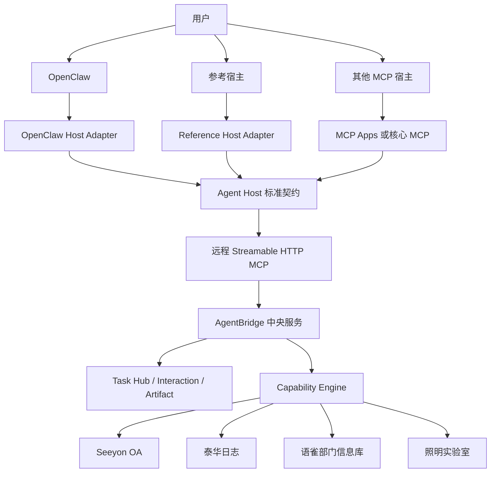

# AgentBridge 下一阶段大块工作路线

> 形成日期：2026 年 8 月 23 日
>
> 当前状态校准：2026 年 9 月 5 日
>
> 状态：当前执行路线
>
> 适用起点：四系统试点收口一期通过之后

## 一、文档目的

本文件回答“四系统试点收口后，AgentBridge 下一步应该集中完成哪些大块成果”。它不替代
[项目当前状态](../项目当前状态.md)，也不展开企业生产化的全部控制项；详细生产门槛仍见
[后续增强事项](./后续增强事项.md)。

当前路线的核心判断是：项目已经证明四个遗留系统、两个真实用户和多个客户端可以通过中心
AgentBridge 工作。下一阶段不应继续以增加零散工具数量为主，而应优先证明：

1. 更换智能体宿主后，AgentBridge 的核心能力和安全边界仍然成立；
2. 运行异常能够被及时发现、准确归因和安全恢复；
3. 四个系统可以围绕一个用户目标形成可追踪的复合任务；
4. 第五个系统可以通过标准工程骨架接入，而不是重新搭建基础设施；
5. 用户规模扩大前，执行隔离、企业身份和密钥治理具备清晰升级路径。

## 二、当前基础与关键缺口

### 2.1 已经具备的宿主无关基础

以下能力已经位于 AgentBridge 中央服务，不依赖 OpenClaw 业务逻辑：

- `CapabilityRegistry -> CapabilityEngine -> CentralCapabilityService -> Adapter` 统一能力内核；
- Streamable HTTP MCP、工具 Schema、按 Token scope 裁剪的能力目录；
- 每用户系统会话、身份绑定、操作账本和幂等控制；
- `agentbridge.interaction.v1` 认证卡、字段卡和授权卡协议；
- `prepare -> authorize -> commit -> verify` 受控写入状态机；
- Task Hub 中的任务、事件、Endpoint、Outbox 和文件交付；
- MCP Apps 资源 `ui://agentbridge/trusted-interaction.html`；
- 模型可见结果与宿主私有 `_meta["io.agentbridge/interaction"]` 分离；
- 结果未知时停止、不自动重试，以及内部 commit 工具对模型隐藏。

这意味着 AgentBridge 已经不是“OpenClaw 专用后端”，普通支持远程 MCP 的宿主可以发现并调用
只读能力。

### 2.2 仍由 OpenClaw 适配器承担的完整体验

当前 Telegram、微信和 Workspace 的生产渠道体验由 `integrations/openclaw-agentbridge` 完成；
Reference Host 已独立实现同一宿主契约的可信交互、任务和恢复纵切。OpenClaw 的渠道职责包括：

- Telegram、微信和 Workspace 的可信发送者到 `userSubject` 映射；
- 每用户 Bearer Token 选择和模型可见工具裁剪；
- 从 MCP 私有元数据提取可信交互，并按 Endpoint 能力展示；
- 登录、字段填写或授权完成后的轮询和原任务自动续办；
- Task Hub 任务关联、跨端时间线、通知 Outbox 和终态投递；
- 图片、文件、短期下载和重新生成入口的渠道适配；
- Gateway 重启后的未完成交互恢复；
- 对内部 commit、任务协调和恢复工具的二次隐藏。

因此当前准确结论是：

> 业务能力内核基本宿主无关，但完整的用户身份、可信交互、任务连续性和多端交付体验仍主要由
> OpenClaw 宿主适配器实现。

## 三、目标架构

下一阶段不删除 OpenClaw，也不修改 OpenClaw 源码，而是把它收敛为多个宿主适配器中的一个：



宿主只负责可信身份入口、私有界面呈现、任务接续和通知投递，不复制遗留系统业务规则。字段、
流程、下游 API、页面契约、写入边界和权威回读继续全部留在 AgentBridge。

## 四、宿主接入能力分级

不同宿主不必一次实现全部体验，但必须明确自己处于哪一档，不能在能力不足时静默降级。

| 等级 | 宿主能力 | 可用范围 | 失败关闭边界 |
| --- | --- | --- | --- |
| L1 核心 MCP | 连接远程 MCP、列出工具、调用工具、保留结构化错误 | 会话有效时的只读能力和无需交互的操作 | 遇到登录、字段填写或授权时不能继续 |
| L2 可信交互 | L1 + MCP Apps 或批准的私有交互适配器 | 登录、字段卡、授权卡、轮询和原请求续办 | 不具备用户绑定的私有展示时禁止呈现短期 URL |
| L3 完整任务宿主 | L2 + Task Hub、Endpoint、时间线、通知、文件和恢复 | 多端接续、后台终态、文件交付和重启恢复 | 未证明幂等和身份隔离前不得协调真实写入 |

AgentBridge 服务画像应让宿主能够自动判断所需能力。宿主不支持 L2 时，不得让模型在聊天中收集
密码、完整业务字段或“代替用户批准”。

## 五、第一主线：宿主无关化与标准远程 MCP 接入一期

本主线的正式契约、参考宿主、候选宿主调研、实施工作包和兼容性验收见
[宿主无关化与标准远程 MCP 接入一期详细设计](../架构设计/宿主无关化与标准远程协议接入一期详细设计.md)。

详细设计已经校准为 1.1 实施基线，纳入运行治理二期、MCP 有界传输恢复、批量受控任务和
Workspace 完成态晚到续办的当前事实。实施时不再为这些能力建立平行机制，而是补齐 Reference
Host、共享 Schema、协调 Lease 和双宿主兼容性测试。

一期范围固定为 OpenClaw 和 Reference Host 两个宿主。Goose、nanobot、LibreChat、Open WebUI
等现成宿主只保留为二期调研候选，不安装、不适配，也不作为一期完成门槛。

### 5.1 工作包 A：定义 Agent Host 标准契约

形成独立、版本化的宿主契约，至少定义：

- `HostRuntimeContext` 和 `HostCallContext`：宿主实例、任务、端点、运行和工具调用关联；
- `IdentityBinding`：可信发送者或网页身份如何映射到固定 `userSubject`；
- `CapabilityCatalog`：宿主如何取得按用户 scope 裁剪后的工具目录；
- `InteractionPresentation`：宿主如何接收私有交互信封并安全展示；
- `InteractionResume`：轮询、退避、超时、单次续办和下一张卡处理；
- `CoordinatorLease`：多宿主展示时谁拥有续办权以及如何显式接管；
- `TaskCorrelation`：一次用户任务如何关联多个 Operation、Interaction 和 Artifact；
- `BatchTaskProgression`：父任务、批次条目、逐项授权和连续新卡；
- `TimelineDelivery`：文本、状态、图片、卡片和文件的有序交付；
- `RecoveryContract`：宿主与 AgentBridge 任一方重启后的恢复规则；
- `IdempotencyContract`：跨端继续时保持同一用户业务操作去重；
- `TransportRecovery`：读取、`prepare` 和副作用后调用的不同恢复边界；
- `HostRuntimeSnapshot`：复用现有 Trace、Signal、Incident 和恢复账本；
- `ErrorContract`：保留 `LOGIN_REQUIRED`、`RESULT_UNKNOWN` 等确定性错误语义。

契约必须注明哪些字段可以进入模型，哪些只能由宿主私有运行时读取。

### 5.2 工作包 B：标准化远程 MCP 表面

在现有 MCP 基础上完成协议收敛：

- 服务画像明确 L1、L2、L3 所需宿主能力；
- 所有可信交互工具使用一致的模型可见结果和私有 `_meta`；
- MCP Apps 作为首选标准展示，不支持时只允许批准的宿主适配器；
- 文件结果统一表达 Artifact、文件名、媒体类型、到期和重新生成能力；
- Task、Operation、Interaction、Artifact 标识的语义和关系保持稳定；
- 内部 commit、resume、协调和管理工具继续从普通智能体目录隐藏；
- 形成与 OpenClaw 无关的接入、错误和安全说明。

一期不把当前短期卡片伪装成标准 MCP URL Elicitation。只有浏览器用户身份能够独立绑定到 MCP
主体并完成防转发、防重放后，才评估启用。

### 5.3 工作包 C：参考宿主适配器

提供一个轻量参考实现，目的不是建设第二个 OpenClaw，而是证明完整链路不依赖 OpenClaw 私有
Hook。参考宿主至少支持：

1. 配置远程 MCP 地址、内部 CA 和一个用户 Token；
2. 发现 AgentBridge 服务画像和受治理工具；
3. 执行会话状态及业务只读调用；
4. 展示认证卡、字段卡和授权卡；
5. 在模型循环之外轮询并只续办一次；
6. 在用户先完成卡片、通知随后到达时补取状态并只续办一次；
7. 接收终态和文件；
8. 处理一个多条目批次的连续卡和最终汇总；
9. 重启后恢复一条等待用户的任务和协调 Lease；
10. 把宿主调用和健康快照接入现有运行治理；
11. 不记录 Token、短期 URL、密码或完整业务字段。

参考实现优先作为开发与验收工具，不承担 Telegram、微信等生产渠道。

### 5.4 工作包 D：宿主兼容性验收套件

建立与具体宿主无关的自动验收，覆盖：

| 验收面 | 必须证明的结果 |
| --- | --- |
| 工具发现 | 服务画像、工具 Schema、scope 裁剪和版本一致 |
| 身份隔离 | 两个 Token 不能读取对方会话、任务、交互和文件 |
| 工具隐藏 | 模型看不到 commit、内部 resume、任务协调和管理工具 |
| 登录续办 | 登录成功后继续原始请求，不要求用户重复发送 |
| 字段与授权 | 两类卡片分离，完成、拒绝、取消、过期和替代语义正确 |
| 单次执行 | 多端或重复回调只能消费一次，结果未知时不重试 |
| 协调所有权 | 两个宿主可观察同一任务，只有 Lease 持有者能够续办 |
| 完成态晚到 | 卡片先完成、通知后认领时仍继续原任务且只 resume 一次 |
| 任务连续性 | 一个任务可关联多个操作，重启后仍能恢复 |
| 批量任务 | 一个父任务逐项授权、自动推进、部分失败和重启恢复正确 |
| 文件交付 | 文件可下载、到期可见、可按授权重新生成 |
| 传输恢复 | 读取和 `prepare` 有界恢复，`commit` 和结果未知调用不重放 |
| 运行治理 | 两个宿主共用现有 Trace、Incident、SLO 和恢复模型 |
| 错误语义 | 登录失效、权限不足、业务拒绝和下游异常不被混淆 |
| 隐私 | 模型、普通日志和诊断输出不出现秘密或短期控制 URL |

先使用模拟适配器覆盖确定性状态机，再使用真实远程 MCP 做只读、可信登录和一条低风险受控写
纵切。真实写入仍遵守项目现有授权边界。

### 5.5 工作包 E：OpenClaw 适配器收敛

OpenClaw 继续作为首个完整宿主，但应改为标准契约的一个实现：

- 把通用交互轮询、Task Hub 关联、Artifact 和错误处理下沉为可复用宿主协议；
- 插件只保留 OpenClaw 身份字段、Session、Telegram、微信和 Gateway 生命周期适配；
- 不在 AgentBridge 核心增加只为 OpenClaw 服务的特殊字段；
- 不修改 OpenClaw 源码，不维护私有分支；
- OpenClaw 升级后继续通过插件测试和宿主兼容套件验收。

## 六、宿主无关化一期完成标准

以下条件全部满足才算完成：

1. Agent Host 契约形成中文正式文档和机器可验证 Schema；
2. OpenClaw 与参考宿主使用同一远程 MCP 和同一业务能力目录；
3. 两个宿主均能完成真实只读、登录续办、字段卡、授权卡和文件交付；
4. 至少一条低风险写纵切在两个宿主中遵守同一冻结计划、独立授权和权威回读规则；
5. 双用户 Token、任务、交互、文件和下游会话不串用；
6. 一个任务只有一个协调 Lease 持有者，另一宿主未经接管不能推进；
7. 任一宿主重启或完成通知晚到后，等待用户的交互可以恢复且不产生重复副作用；
8. 批量任务在两个宿主中保持同一父任务、逐项授权和自动推进语义；
9. 两个宿主遵守相同传输恢复矩阵并进入同一运行治理模型；
10. 不支持可信交互的纯 MCP 宿主在 L1 边界明确停止；
11. OpenClaw 插件成为标准契约实现，AgentBridge 核心不依赖其内部 Hook；
12. 自动测试、远程冒烟、真实宿主验收和文档链接检查全部通过。

## 七、第二主线：运行治理与可靠性二期

本主线的观测模型、故障分类、SLO、管理控制台、安全恢复、备份演练和实施顺序见
[运行治理与可靠性二期详细设计](../架构设计/运行治理与可靠性二期详细设计.md)。

运行治理位于 AgentBridge 中央运行面，可以在宿主无关化之前独立实施。当前阶段以 OpenClaw 为
现有宿主，只需预留通用宿主实例和运行标识；以后增加 Reference Host 时补充采集器，不重做中央
任务、操作、交互、下游和恢复模型。重点包括：

- 任务受理、首次进展、工具调用、用户等待、提交、回读和终态的分段耗时；
- 当前待投递、延迟投递、历史失败投递和已归档记录分开展示；
- 卡住任务、孤儿 Operation、过期 Interaction 和失效 Artifact 的自动识别；
- OpenClaw 或其他宿主冷启动、通道连接、MCP、AgentBridge 和下游系统的分层诊断；
- 按系统、能力和用户暂停写入但保留读取；
- 备份、恢复、服务重启和状态一致性演练；
- SLO、错误预算、人工对账和 Runbook 的最小试点版本。

本阶段不允许对结果未知的业务写入做自动补发。自动恢复只适用于尚未越过副作用边界的宿主连接、
通知投递和只读请求。

## 八、第三主线：跨系统编排一期

四个系统不应永远停留为四组孤立工具，但也不应为每个组合建立专用协调器。第一期实现
[通用持久化任务计划与跨系统编排](../架构设计/通用持久化任务计划与跨系统编排详细设计.md)：

- Agent Host 模型根据用户目标和模型安全能力目录提出结构化计划；
- AgentBridge 中央服务确定性校验、编译、持久化和续办；
- 计划步骤只调用正式原子能力和注册转换；
- 一期允许多系统读取和一个受控写入终点；
- 数据模型预留步骤依赖，但暂不建设完整 DAG 调度、循环或多写 Saga；
- 登录、字段核对、执行授权、commit 和 verify 继续由现有可信链路控制。

以下场景用于验收通用性，不形成专用编排代码：

### 8.1 OA 已办辅助生成泰华日志

```text
OA 读取指定时间范围的已办事项
  -> 注册转换形成可编辑日志草稿
  -> 用户核对日期、工时、项目和正文
  -> 泰华日志单独授权
  -> 正式提交并权威回读
```

第一条场景通过后，使用照明、语雀和泰华组合复验。如果需要修改计划执行器或在 OpenClaw
插件中加入场景代码，则通用性验收失败。

### 8.2 周报辅助候选

```text
泰华读取上周日志
  -> 语雀补充项目资料
  -> 生成周报字段草稿
  -> 用户核对
  -> OA 周报流程单独授权
```

### 8.3 照明问题记录候选

```text
照明读取告警与设备状态
  -> 语雀查找相关规程
  -> 形成泰华日志草稿
  -> 用户确认后提交日志
```

告警备注、工区流转或处置继续使用各自独立授权，不能被“生成日志”顺带批准。

### 8.4 知识产权文件交付

```text
图片识别专利或软著名称
  -> OA 批量检索并核对版本或登记号
  -> 下载原始证书
  -> 形成有序文件包
  -> Workspace、Telegram 或微信交付
```

知识产权文件交付只涉及 OA 与交付渠道，不作为“两个下游业务系统”的跨系统编排验收，但可以
复用任务计划中的读取、转换和 Artifact 步骤。

一期不建设通用可视化工作流引擎。只有真实场景反复出现并行、动态展开、分支汇聚或多个写入
终点后，才分别升级为 DAG 调度或多写 Saga。

## 九、第四主线：新系统接入工程化

在第五系统进入开发前，形成连接器骨架和门禁：

- Adapter、会话 Provider、能力注册和错误映射模板；
- HTTP Token、中心 Cookie/noVNC、CAS/JWT 等认证路线样板；
- 读取、可逆写和受控写的风险分级与 Schema 模板；
- MCP、OpenClaw、参考宿主和 Workspace 自动目录检查；
- 模拟器、契约测试、零写入探针、真实冒烟和发布验收模板；
- 中文系统适配说明、能力矩阵、验收计划和结果模板；
- `discovery -> shadow -> canary -> pilot` 接入状态记录。

第五系统应使用这套骨架完成一次验证，以“接入成本显著下降且没有复制平台逻辑”作为工程化完成
判据。

## 十、第五主线：用户级执行隔离和企业安全

这部分是扩大用户或进入生产前的门槛，不要求与宿主无关化一期一次完成：

- 每用户独立 OS 身份或容器 Worker；
- 独立 Profile、下载、临时文件、浏览器进程组和资源限额；
- 一个 Worker 故障、终止或被隔离时不影响其他用户；
- OIDC/OBO、正式用户生命周期和多角色/代办授权；
- Vault/KMS、密钥轮换、正式 PKI 和工作负载身份；
- 模型数据策略、附件与批量导出治理、DLP 和数据驻留；
- 审计防篡改、灾备、限流和安全事件响应。

当用户数需要水平扩展、接入高敏数据、开放 W2/W3 写能力或提出生产 SLA 时，立即提升对应事项。

## 十一、优先顺序与并行关系

| 顺序 | 大块工作 | 当前建议 |
| ---: | --- | --- |
| 1 | 运行治理与可靠性二期 | 已完成整块实现、七天影子观察和本机生命周期可靠性收口；下一步评审 SLO 与异机恢复 |
| 2 | 宿主无关化与标准远程 MCP 接入一期 | 已完成共享契约、两个试点宿主、自动验收和正式只读纵切 |
| 3 | 跨系统编排一期 | 计划内核、单写终点和第一用户真实 Workspace 纵切已完成；下一步做组合任务语义规划、多来源完整性和第二来源复验 |
| 4 | 新系统接入工程化 | 在接第五系统前完成 |
| 5 | 外部宿主兼容性二期或第五系统接入 | 按真实需求二选一，不并行扩张 |
| 6 | 用户级 Worker 隔离和企业身份安全 | 按用户规模与数据风险触发 |

其中运行治理解决“发生故障能不能快速知道卡在哪里并安全恢复”，宿主无关化解决“换一个智能体
宿主还能不能安全使用”。二者最终共同构成平台基线，但实现顺序互不阻塞。

## 十二、近期不优先事项

- 照明读取五期；
- 为没有真实需求的 OA 表单提前建设写能力；
- 未形成连接器骨架前仓促接入第五系统；
- 为追求通用性先建设庞大的工作流编排平台；
- 一次性建设完整 OIDC、Vault、容器集群、高可用和灾备；
- 恢复 Chrome 扩展、旧浏览器桥、localhost daemon 或代理型 CLI；
- 让普通 MCP 宿主通过模型可见参数取得密码、字段值、卡片 URL 或内部 commit 能力。

## 十三、实施状态与历史启动基线

截至 2026 年 9 月 5 日，运行治理二期已完成七天影子观察和本机生命周期收口，宿主无关化一期
已完成两个试点宿主与正式只读纵切，组合任务语义规划 v2 及 OA 历史有界分页已实现。五类计划和
写入边界修复见[本轮修复验收](../验收记录/持久计划与受控写入边界修复验收-2026-09-05.md)。
下一步是分页边界、派生写入、跨端和双用户扩展验收，以及 SLO 评审和异机恢复。外部宿主与第五系统
继续由真实需求驱动。下面只保留过去的启动判断，不作为当前待开发清单。

### 2026 年 8 月 23 日至 9 月 2 日的历史状态

2026-08-23 已完成运行治理二期的整块实现：持久化运行轨迹、异常分类、事件生命周期、试点 SLO、
安全恢复白名单、管理控制台、就绪探针、一致性备份和无真实业务写入的故障注入已进入同一发布
候选。当时处于设计中定义的影子期：记录和展示异常，自动动作只保留既有的副作用前有界恢复；
结果未知的业务写入始终需要人工核对。

宿主无关化一期已于 2026 年 8 月 29 日完成实现和正式只读纵切。跨系统编排随后完成计划内核、
单写终点和第一用户真实 Workspace 纵切，当时自然表达仍受关键词开关、OA 多来源日期完整性和
空结果策略限制。2026 年 9 月 2 日先完成本机 Gateway 生命周期可靠性小收口，当时下一件大块开发固定为
组合任务语义规划收口；外部宿主兼容性二期和第五系统接入继续按真实需求后置。本节下面的内容保留
为运行治理二期的启动基线和追溯依据。

### 原启动建议

下一次正式开发建议以“运行治理与可靠性二期”的可观测纵切为单独项目，先完成：

1. Trace、Span、Signal、Incident 和 RecoveryAction 的数据模型与迁移；
2. Workspace/OpenClaw -> MCP -> AgentBridge -> 一个只读适配器 -> 投递的阶段追踪；
3. 管理控制台中的单任务瀑布图和当前异常视图；
4. 等待用户、微信延迟投递和历史失败的防误报规则；
5. 会话保活周期和宿主控制面耗时的持久化；
6. 不告警、不自动恢复的影子检测和基线观察；
7. 故障注入、隐私字段检查和双用户隔离回归。

完成这一纵切后，再扩展四系统、写入副作用边界、正式告警、安全恢复和备份演练。宿主无关化设计
保留为后续独立项目，不作为本轮开工前置条件。
