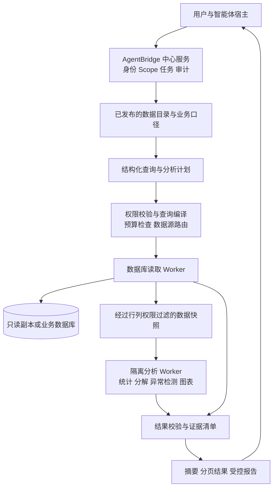

# 只读数据库深度分析能力设计

> 状态：设计建议，尚未实现或连接真实数据库。
>
> 日期：2026-09-09
>
> 前提：一个业务系统向 AgentBridge 提供经过授权的数据库只读账号；数据库产品、数据规模和具体分析问题尚未确定。

## 1. 设计目标与决定

在现有 AgentBridge 中增加数据库读取和分析适配能力，使智能体能够发现数据、理解口径、提出查询、逐步分析、核对结论并交付报告。复用中心身份、能力注册、MCP、任务和审计，不另建智能体入口。

与[开放数据库业务能力接入设计](./开放数据库业务能力接入设计.md)相比，本设计细化只读场景的复杂分析、任务生命周期、数据快照和证据链。本项目阶段仅涉及业务数据库读取；分析平台可以保存任务、结果和报告。原基线中关于后续业务写入的规划不属于本次范围。

主要决定：

1. 一个通用数据库执行框架，加每个系统自己的数据集、指标、关联和权限配置。
2. 默认发布结构化分析能力；高频问题进一步封装为业务能力，减少模型反复理解口径的成本。
3. 复杂计算优先在受控快照的隔离环境执行；生产数据库只承担预算内的读取和聚合。
4. 专家 SQL 可作为后续扩展，权限和执行环境独立管理。
5. 每个数字都有查询和口径依据；没有历史数据或没有因果证据时，结果明确说明限制。

## 2. 总体架构



数据库读取 Worker 持有数据库凭据；分析 Worker 只接收任务允许的数据快照，不持有业务数据库凭据。智能体通过 MCP 调用能力，接收小结果、摘要和结果引用。

部署初期可以共用现有中心节点，但读取和分析应使用独立进程、队列和资源配额。若运行模型生成的 SQL 或 Python，必须使用操作系统级隔离；普通进程划分不构成充分隔离。

## 3. 数据源接入与发布

### 3.1 数据源配置

每个数据源配置 `source_id`、所属业务系统、数据库产品和版本、密钥引用、网络与 TLS、允许访问的表或视图、连接池预算、数据负责人、数据权限来源以及新鲜度要求。

连接凭据通过受控配置保存，不作为模型工具参数。连接时核对 TLS、实际数据库角色和有效权限；只读账号应仅具有所需对象的读取权限，不能兼有管理、任意函数执行、文件访问或角色提升权限。

优先接入所有者提供的只读副本或报表库。若仅有主库，只发布经过验证的轻量查询；重查询被拒绝或排队，不能因为没有副本就自动放宽预算。创建视图、索引、副本和复制链路由数据库所有者配置，不能假设只读账号可以执行。

### 3.2 元数据盘点与审核

连接后读取允许范围内的表结构、字段注释、键和关系，生成候选业务映射。数据量与质量探查同样消耗预算，默认不全表扫描。没有注释的字段可以生成候选解释，但未经业务确认不得作为正式指标口径。

数据集按“草稿 → 验证 → 发布 → 停用”管理；表或字段新增不自动发布。字段删除、类型变化和口径变化触发受影响能力暂停或版本升级，不静默换字段继续计算。

### 3.3 每个数据集必须声明的语义

| 配置 | 必须说明的问题 |
| --- | --- |
| 业务对象与粒度 | 一行是一份合同、一笔回款，还是一条变更记录？ |
| 稳定主键 | 如何去重和回到原始记录？ |
| 字段与枚举 | 字段含义、单位、状态码以及允许筛选、排序、聚合的范围 |
| 指标口径 | 分子、分母、纳入状态、金额含税与否、币种、舍入规则 |
| 时间 | 业务发生时间、入库时间、时区、统计窗口和可用历史范围 |
| 关系 | 关联键、基数、有效期、允许用途，以及如何避免重复计数 |
| 权限 | 行范围、字段敏感度、明细与聚合权限、导出和模型可见范围 |
| 来源 | 权威系统、刷新机制、数据水位、负责人和契约版本 |

例如，合同与回款为一对多关系，应先把回款聚合到合同粒度，再计算合同层面的金额和回款率；直接连接后求和可能重复计算合同金额。回款率是“回款合计 / 对应口径的合同合计”，不能默认取各合同回款率的算术平均。

月末应收、历史状态、过去逾期天数需要历史事件或快照支撑。只有当前余额时，不发布历史月末余额指标。

## 4. 对智能体开放的能力

以下为拟议契约名称，尚未注册到现有代码。

| 能力 | 作用 | 关键输出 |
| --- | --- | --- |
| `database.dataset.catalog` | 发现当前用户可用的数据集与指标 | 业务描述、支持问题、时间范围 |
| `database.dataset.describe` | 获取指定数据集口径、字段和批准关系 | 契约版本、粒度、质量说明 |
| `database.query.explain` | 校验结构化查询、解析口径并预估代价 | 查询计划引用、策略摘要、预算或拒绝原因 |
| `database.query.execute` | 执行已校验的结构化查询 | 查询 ID、结果 ID、少量结果和完整性说明 |
| `database.result.page` | 在当前权限下分页读取结果 | 稳定分页令牌、行数、是否截断 |
| `database.analysis.start` | 提交需要快照和复杂计算的分析计划 | 分析 ID、任务 ID、初始状态 |
| `database.analysis.get` | 获取进度、证据和最终分析结果 | 阶段、质量提示、结果与报告引用 |
| `database.analysis.cancel` | 取消排队或执行中的分析任务 | 取消请求及其确认状态 |
| `database.report.export` | 生成当前权限允许的报告或数据文件 | 受控文件引用、有效期 |

数据质量探查作为受控查询或分析算子提供，包括缺失率、重复率、异常值和关联匹配率。禁止通过目录、样本和探查绕过明细权限。

### 4.1 结构化查询示例

```json
{
  "source_id": "project_management",
  "dataset": "contract_collection",
  "contract_version": "1.0.0",
  "metrics": ["contract_amount", "received_amount", "collection_rate"],
  "dimensions": ["department", "month"],
  "time_range": {
    "start": "2026-01-01",
    "end_exclusive": "2026-09-01",
    "timezone": "Asia/Shanghai"
  },
  "filters": [{"field": "contract_status", "op": "in", "values": ["effective"]}],
  "limit": 100
}
```

示例字段只是拟议业务契约，不代表真实系统已有这些数据。指标采用哪个时间字段、如何形成月份，由已发布契约决定。`user_subject`、租户和部门权限从中心身份产生，不由模型填写；用户输入部门筛选只能进一步缩小允许范围。

查询值使用参数绑定；表名、字段名、排序方向和算子只能来自已发布的映射与枚举，禁止把模型自由文本拼接到 SQL。金额保持十进制定点精度，币种不同时按已发布的汇率及日期口径换算，不能直接相加。

`query.explain` 返回的计划绑定规范化查询、用户、数据范围、契约版本、策略版本、预算和有效期。`query.execute` 只接收服务端计划引用，执行前再次校验权限与版本。普通授权范围内的读取自动运行；这里的预检是机器校验，不要求每次查询让用户确认。

## 5. 深度分析如何执行

### 5.1 三类计算路径

| 路径 | 适合的问题 | 执行位置 |
| --- | --- | --- |
| 结构化查询 | 搜索、分组、排名、同比环比、固定窗口计算 | 源库或只读副本，采用批准的算子 |
| 分析任务 | 多阶段分解、分群、异常检测、跨数据集比较 | 经过权限过滤的快照与隔离计算环境 |
| 专家探索，后续阶段 | 尚未固化的复杂 SQL 或统计方法 | 优先任务快照；直连源库需独立准入 |

分析任务用结构化步骤引用前序结果，例如“查询部门月度回款 → 计算同比 → 分解金额下降贡献 → 下钻主要项目 → 核对合计”。模型决定下一步要研究什么，执行器按已登记的算子完成计算。

一期建议支持描述统计、趋势比较、贡献分解、分布和规则异常检测。后续再增加需要训练的预测、聚类等方法；预测须注明训练窗口、留出验证、基线和误差。金额差异分解不能被表述为已证实的因果原因。

### 5.2 快照与一致性

抽取阶段在数据源侧完成权限过滤、必要聚合和字段最小化，以分批流式方式写入受控快照。分页需要稳定排序；一致性必须依靠数据库快照或明确的数据水位，单有稳定排序不足以避免期间更新造成的不一致。

短查询可采用数据库支持的一致性读取机制；长任务优先固定分析快照，避免长事务持续占用生产资源。跨系统查询记录各自水位和抽取起止时间，不能声称全局同一时刻。没有可靠源数据水位时明确标为未知。

只读账号并不天然支持 CDC。需要增量同步时，先确认是否有可靠的更新时间、删除标志和稳定游标；不满足时使用预算内的定期完整快照或由所有者另行提供复制能力，不能悄悄遗漏删除和历史修订。

### 5.3 隔离计算

通用实现可评估 Python 数据处理与统计库、DuckDB 和 Parquet；这些是实现候选，不要求一期一次引入全部组件。先提供固定分析算子，确有需要再开放模型生成代码。

分析环境按任务隔离，只挂载授权快照和专用输出目录，无业务数据库凭据，默认禁止外网、宿主目录访问、动态安装包及动态加载扩展，限制 CPU、内存、磁盘和运行时间。

DuckDB 的 SQL 和部分非 SQL 接口具备文件、网络和资源访问能力，使用它处理不可信请求时仍需隔离与功能限制，不能把嵌入式数据库当成沙箱。[DuckDB 安全说明](https://duckdb.org/docs/current/operations_manual/securing_duckdb/overview)

### 5.4 专家 SQL 边界

不向普通宿主发布生产库任意 SQL 工具。后续专家模式需要独立 Scope、方言专用语法树校验、对象与函数白名单，拒绝多语句、DML、DDL、写入 CTE、存储过程、外部访问、延时和锁定行为。

检查每一层 CTE、子查询、连接和集合运算；无法证明安全则拒绝。简单给 SQL 尾部补一个 `WHERE` 不能保证行级权限。

直接访问源库的专家模式，只对已经可靠限制行列范围的数据库角色或视图开放；如果只有一个能看全库的服务账号，且缺乏可验证的数据隔离机制，则专家 SQL 仅在该用户的授权快照上执行。SQL 解析器用于校验，不能替代数据库权限和操作系统隔离。

## 6. 身份、权限与数据流出

有效权限为“连接账号权限 ∩ 数据集发布范围 ∩ 最终用户权限 ∩ 本次任务范围”。共享只读账号不能替代原系统用户权限：数据库通常不会自动复用应用层的部门、项目或流程可见性规则。

优先使用所有者管理的受限视图或原生行级权限。采用共享服务账号时，结构化查询编译器必须在每个基础数据关系上施加权限后再关联、聚合；用户可控参数无法覆盖权限条件。没有可靠的用户权限来源时，仅向明确获准访问该完整数据域的角色发布。

连接池按数据源和数据库角色隔离；依赖会话变量传递业务身份时，由服务端在事务范围内设置并验证，归还连接时清除上下文。初始化或清理失败则销毁连接，避免下一个用户继承前一个用户的数据范围。

PostgreSQL 的超级用户、`BYPASSRLS` 角色，以及通常情况下的表所有者可绕过行级策略。因此不能仅凭“开启了 RLS”就认定服务账号已被隔离，必须测试实际连接角色。[PostgreSQL 行级安全说明](https://www.postgresql.org/docs/current/ddl-rowsecurity.html)

权限控制同时覆盖数据目录、过滤与排序、明细、聚合、缓存、快照、图表、下载文件和任务恢复。敏感小群体聚合可采用最小样本阈值及重复差分查询限制；不能声称简单阈值就提供完整隐私保证。

模型接收的数据范围单独配置：允许查询不自动等于允许把明细发送给外部模型。默认返回聚合和必要样例；文本备注作为业务数据处理，不执行其中的指令。

缓存键绑定用户或严格等价的权限域、策略版本、契约版本、查询指纹和数据水位。权限撤销后，停止后续读取、使相应缓存失效，并阻止快照与报告再次下载。已下载的副本无法由平台收回，导出权限必须在交付前控制。

所有分页、结果读取和文件下载重新校验身份与权限，不能只凭猜不到的结果 ID 访问。快照和报告设置保留期限、加密和清理任务；不同敏感级别可使用不同期限。

## 7. 生产负载、任务与错误语义

### 7.1 查询预算

预算必须覆盖单条查询、整个分析任务、用户和数据源，防止智能体用大量小查询绕过单次限制。限制包括时长、并发、输出字节、抽取行数、扫描资源、内存和查询次数。

可用的试点初始值为：交互查询 10 秒、每个数据源并发 2 个、模型预览最多 200 行、一次分析最多 20 次源查询；快照行数、体积和任务时限由样例测量后确定。以上是待压测的起点，不是性能承诺。

`LIMIT` 只限制输出，不保证扫描和聚合成本低。计划预估只作准入参考，不保证真实代价；生产预检不执行会真实运行查询的 `EXPLAIN ANALYZE`。具体数据库不支持硬扫描上限时，采用语句超时、资源治理、时间范围限制和副本隔离，并明确此限制。

数据库端超时与 Worker 总期限共同生效，不能只设置 HTTP 超时。PostgreSQL 提供 `statement_timeout` 等设置；其他数据库使用对应机制并逐一验收。[PostgreSQL 客户端连接默认参数](https://www.postgresql.org/docs/current/runtime-config-client.html)

### 7.2 生命周期

建议分析子任务状态为 `queued → validating → extracting → analyzing → verifying → succeeded`，并支持 `failed`、`cancel_requested`、`cancelled`。这是拟议的分析域状态，不意味着直接替换现有 Task Hub 的状态枚举。

取消必须传递到实际数据库语句和计算 Worker；客户端退出不等于数据库已停止。不能确认停止时保持取消待确认并由后台核查，不提前报告已取消。重启后先核查旧作业状态，避免重复抽取和资源叠加。

已完成的不可变结果可复用；若重新读取实时源，应建立新的运行记录并注明数据时间变化。只有同一快照、查询和计算版本下，才能声称复现同一次分析。

### 7.3 稳定错误

至少区分 `DATA_ACCESS_DENIED`、`METRIC_UNDEFINED`、`SCHEMA_CHANGED`、`QUERY_REJECTED`、`BUDGET_EXCEEDED`、`SOURCE_UNAVAILABLE`、`DATA_STALE`、`RESULT_INCOMPLETE`。连接失败、超时和结果被截断都不能被解释为零数据。

## 8. 证据与结论质量

每个查询或分析结果携带：

- `query_id`、`analysis_id`、`result_id` 与关联的 Task/Operation；
- 来源、数据集与口径版本、用户权限范围摘要、规范化查询指纹；
- 查询与抽取时间、各源数据水位、快照 ID、时区和业务时间范围；
- 返回行数、完整/截断/抽样标记、抽样方式与抽样比例、缺失与重复检查；
- 指标单位、分子分母、空值与零值规则、关联匹配和合计校验；
- 分析方法、算子或脚本哈希、运行环境版本，以及适用时的随机种子和误差。

报告中每张表、每张图和关键数字都指向结果引用。完整 SQL 和必要参数保存在限制访问的复现记录中；面向普通模型和 Task Hub 时间线只展示脱敏摘要。用于恢复执行的敏感参数另行加密存储，设置权限和保留期限。

例如“本季度回款下降”应先确认比较窗口完整，再比较总额、部门和项目贡献；证据可以证明哪些项目贡献了下降，合同备注只能提供待核查线索，不能自动证明下降原因。

## 9. 与现有代码衔接

已核对的现有入口：

- `bscli/core/capability.py`：`CapabilitySpec` 和 `CapabilityRegistry`，支持 `read` 等 effect。
- `bscli/core/capability_runtime.py`：`CapabilityEngine`，为调用建立 Operation 并传递用户和任务上下文。
- `bscli/core/central_service.py`：`CentralCapabilityService`，承接中心能力、Scope 和任务编排。
- `bscli/mcp/central.py`：远程 MCP 接入。

建议新增数据库领域模块，分别管理数据源、语义契约、权限策略、查询编译、读取执行、分析作业和结果仓库；数据库方言与驱动放在适配器内部。试点只实现一种真实数据库方言，同时保留接口扩展点。

Task Hub 记录用户可理解的阶段和结果引用；分析作业保存快照、执行计划和计算证据。每个能力调用仍有自己的 Operation，后台分析与 Task、Operation 通过显式 ID 关联。是否可复用现有持久任务执行器，需验证异步计算、取消和结果生命周期后决定。

数据库查询按业务副作用标记为 `read`；分析调度、结果持久化和报告导出仍需独立的资源及导出权限策略，不能由 `effect=read` 推导为没有成本或无需治理。

特别需要修改的接入前提：当前 `_operation_input_summary` 对 `read` 直接返回完整参数，见 `bscli/core/capability_runtime.py` 第 201—203 行。数据库筛选可能包含姓名、证件号或其他敏感值，需增加按能力和字段定义的摘要脱敏，并检查结果、异常、追踪和任务日志。不得仅把新能力标成 `read` 就沿用全部日志行为。

## 10. 一期范围与验收

### 10.1 实施顺序

1. 选择一个数据库和一个业务域，确认三个真实问题、权威报表、数据权限来源和读取预算。
2. 发布 3—5 个数据集、5—10 个指标及必要关联，先核实粒度、历史范围和口径。
3. 完成结构化查询、权限过滤、预算控制、小结果与证据返回。
4. 打通一个“提问 → 多步查询 → 快照分析 → 结果核对 → 报告交付”的完整分析任务。
5. 完成两种真实用户范围的隔离、取消与故障测试，最后再扩展指标和分析方法。

一期使用固定算子；专家自由 SQL、任意 Python、大规模全库同步和跨源自由关联留待后续需求评估。

### 10.2 验收问题

| 类别 | 可核对的验收证据 |
| --- | --- |
| 业务正确性 | 三个真实问题与已确认口径的权威 SQL/报表逐项一致，差异有解释 |
| 关联与历史 | 一对多连接不重复求和；没有历史数据时不生成历史余额 |
| 权限 | 两个用户的查询、样本、聚合、分页、缓存和文件均保持隔离；伪造身份字段无效 |
| 凭据与敏感数据 | 请求摘要、结果、异常、报告和追踪按同一分类策略处理，无凭据泄露 |
| 负载 | 大连接、宽时间窗口和连续小查询均受预算约束；前端超时后不存在失控查询 |
| 取消与恢复 | 取消到达实际执行端；重启不会盲目重放源查询或混淆数据水位 |
| 质量与复现 | 截断、抽样、过期和未知水位显式标记；同一快照可复现关键数字 |
| 发布变化 | Schema 漂移停止受影响能力；权限撤销后不能继续下载旧结果 |

在拿到真实数据库并完成上述核对前，只能称为设计或离线验证，不能称为已完成业务接入。
