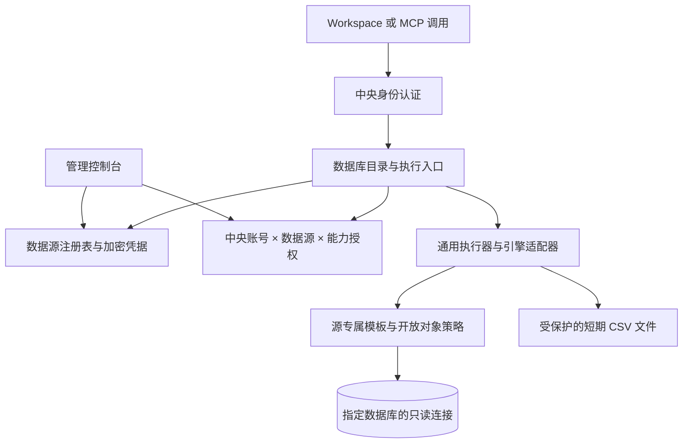

# 多数据库接入与数据库能力统一迁移设计

日期：2026-09-14。状态：设计稿，未实现、未发布、未执行本设计验收。

## 1. 目标与已确定的取舍

将当前绑定泰华日志库的独立数据库能力升级为多数据源能力，通过管理控制台配置数据源和按源授权；数据库读取与分析统一使用 `database.*`。用户进一步确认：实现完成时 `taihua:analytics:*` 必须整体退役，不能以新旧两套长期共存作为交付终态。数据库不要求存在配套业务系统，不依赖业务登录，不强制建立中央账号与数据库人员 ID 的映射。

本轮讨论确定：

- Token 继续认证中央账号；数据库授权由中央动态配置决定。配置能力无需签发 Token 或重启 OpenClaw。
- 两个时间窗口的数值比较由 `database.free.read` 承接，不新增专用比较能力。正文变化由智能体依据查询证据归纳。
- 取消按结果 ID 读取上次分析原始结果，不建设历史分析结果目录、读取或复现接口。查历史日期属于重新执行查询，数据可能与上次不同。
- 保留 CSV 导出和认证下载；其短期文件引用仅服务交付，不构成历史结果查询能力。
- 不因迁移删除既有历史结果、修改源库数据或扩大账号权限。

本稿范围假设：第一阶段支持多个 PostgreSQL 数据源，预留引擎适配接口。后续目标库若是 MySQL、SQL Server 等，需要补充该引擎的驱动、SQL 校验及验收后才能启用，不能仅增加引擎下拉框。当前不实现跨库 SQL、数据库写入、通用业务模板编辑器或逐行逐字段授权；需要数据裁剪时由源库提供受限视图或独立数据源。

## 2. 当前实现与改造原因

以下为本地代码核对，不代表本轮重新核验生产配置。

| 位置 | 当前行为 | 改造方向 |
| --- | --- | --- |
| `bscli/core/data_sources.py` | 校验 `source_id=taihua_primary`，配置模型绑定现有实例 | 独立的数据源注册表和驱动配置 |
| `bscli/database/independent.py` | 固定读取 `analytics/source.json`，目录固定泰华源，SQL 白名单固定五视图 | 按 source_id 装载配置、授权、模板与对象白名单 |
| 同文件 `DatabaseGrants` | 主键为中央账号，存一份能力列表 | 主键为中央账号与数据源组合 |
| `bscli/database/content.py` | 泰华日志、评论字段和查询口径 | 保留为泰华业务模板包，避免污染通用执行器 |
| `bscli/admin/application.py` | 用户弹窗保存数据库能力，没有分源授权维度 | 数据源管理及按源授权 |
| `bscli/mcp/central.py` | 新数据库入口与旧本人分析、历史读取、导出下载并存 | 保留统一工具入口，迁移旧分析路由及交付 |

相关历史依据：[独立数据库交付](../系统适配/泰华日志系统/独立数据库能力探索与交付.md)、[动态授权设计](../系统适配/泰华日志系统/数据库能力控制台动态授权设计.md)。历史文档保留当时事实；其中历史结果、专用比较的建设方向以本稿的迁移决定为准，当前运行边界在实施完成前不变。

## 3. 总体结构



每次执行只对应一个数据源。调用方不能通过参数提供连接地址、密码或自行声明中央账号。不同数据源的连接池、并发预算、超时、凭据及故障状态隔离；同时保留全局并发上限，防止接入更多库后耗尽中央资源。一个源不可用不阻止其他源查询。

## 4. 数据源配置与生命周期

建议注册元数据存于 `database/catalog.sqlite3`，凭据沿用 `DataSourceSecretStore` 的加密机制，放在 `database/credentials`。具体表名可实施时调整，但以下契约不可省略。

| 配置项 | 设计约束 |
| --- | --- |
| source_id、显示名称、说明 | ID 创建后不可修改、不可复用；名称服务于用户选择 |
| engine、连接参数、TLS | 第一阶段仅 PostgreSQL；启用前验证实际连接目标与加密策略，不复制泰华实例的地址特例到新库 |
| credential_ref、credential_version | 凭据仅安全提交，界面不回显，普通查询目录不返回连接细节 |
| allowed_relations | 显式 schema 与表/视图白名单；结构查询只显示这部分对象 |
| template_pack、template_version | 通用包或泰华日志包；安装包由代码发布提供，启用前校验所需字段与类型 |
| available_capabilities | 当前源支持的能力集合；账号只能获授其中的子集 |
| 查询预算 | 连接/语句超时、行数、响应体、源并发、导出行数和字节上限 |
| state、revision、policy_version | 草稿、启用、停用；配置更新和审计原子记录，版本冲突返回 409 |

接入流程：新增草稿 → 保存连接凭据 → 只读连通与权限预检 → 勾选开放对象 → 选择适配模板 → 校验结构与预算 → 启用 → 为中央账号授权。预检不读取业务正文、不执行 DDL 或 GRANT；预检失败必须显示原因，不能标记已启用。新源无默认用户授权。

源配置变更先生成待验证版本，验证通过再原子切换生效版本。凭据文件先安全写入后引用，失败不发布半成品。停用源立即阻止新查询、导出及下载；在途结果交付前检查最新源状态和版本，变化则丢弃结果并明确返回配置已变化。旧连接不再复用，新调用加载新配置，无需重启宿主。

首阶段提供停用，不提供控制台永久删除；避免误删凭据和引用关系。旧版本配置仅受限保存用于恢复，不向普通用户展示。

## 5. 授权模型

授权记录为 `(user_subject, source_id, capabilities, revision)`；能力是对该数据源的授权。没有记录等同没有权限，不支持默认“所有未来数据源”。高级自由查询和导出独立勾选，不随新增源、常规能力或模板升级自动授予。

目录返回“源已启用 ∩ 源支持能力 ∩ 账号授权”的交集。普通用户不可枚举未授权源，访问不存在或无权访问的 source_id 返回统一拒绝信息。模板禁用后其能力即使仍在账号配置中也不可执行。

执行前及交付前重新核验身份、源状态、授权和版本；下载开始前同样检查。已经交付的字节无法撤回，撤销后阻断尚未开始的下载并尽力终止在途传输，不宣称可以收回已下载文件。版本变化时返回明确错误，不自动重跑查询。

中央账号有同一源的 `database.free.read` 时，可以访问该源全部开放对象，包括可能存在的评论视图；常规模板授权不额外限制该高级能力。管理界面明确显示该范围。若只允许部分数据，必须配置受限视图或独立数据源，不能靠提示词隔离。

管理写入沿用现有管理员角色、CSRF、Origin、变更原因及乐观并发检查。审计员只读。授权修改不调用 Token 签发/撤销、不改变业务会话与 OpenClaw 配置。

## 6. 统一能力与 MCP 契约

以下为目标契约，不代表当前已支持。

| 能力 | 适用范围与处理 |
| --- | --- |
| `database.schema` | 通用：源内开放对象、字段、类型、业务说明及查询限制 |
| `database.free.read` | 通用高级：单源受控只读 SQL，承接历史日期查询、两个窗口比较及复杂聚合 |
| `database.directory` | 泰华模板：人员、部门、项目消歧；其他库不自动具备 |
| `database.logs.query` | 泰华模板：日志明细与正文检索 |
| `database.logs.analyze` | 泰华模板：日志统计，不重复建设另一套汇总实现 |
| `database.logs.content_analyze` | 泰华模板：正文证据与归纳要求 |
| `database.comments.analyze` | 泰华模板：评论及关联正文证据 |
| `database.report.export` | 通用交付：以当前获授权的表格查询生成 CSV |
| `database.report.download` | 通用交付：获取本人生成且未过期的报告下载入口 |

下载不单设管理员勾选项，与 `database.report.export` 共用导出授权；同时必须保有生成文件时的查询能力。其他新库先使用通用能力，需要业务模板时增加适配包，不要求伪装成 users、work_logs 等表。

继续使用两项 MCP 工具以减少宿主工具变动：

```text
database_capabilities(source_id?)
  无 source_id：返回当前账号可用数据源、名称和能力摘要。
  有 source_id：返回该源的能力 input_schema、开放范围与限制。

database_execute(source_id, capability, arguments)
  所有执行明确指定 source_id；身份来自有效中央认证。
```

示例：`database_execute(source_id="taihua_primary", capability="database.free.read", arguments={"sql":"..."})`。两个时间窗口尽可能放在一次 SQL、一次只读事务中计算；差异百分比明确处理基期为零，空记录与零值不混淆。自由查询仍可能截断，不能将有限返回行数声称为全部结果。

为旧客户端设有限过渡：缺少 source_id 的旧请求仅可绑定已迁移的 `taihua_primary`，且必须拥有该源对应权限，并返回弃用提示；绝不选择“第一个可用源”。升级客户端与工具目录后取消缺省路径。用户自然语言未明确来源且上下文无法唯一确定时，先选择来源，不能猜库。

结果统一带 source_id、query_id（仅追踪，不能用于取回结果）、采集时间、能力、策略/配置版本、行数、截断与分页信息；证据标识和游标绑定 source_id，防止跨库同名 ID 混淆。游标同时绑定过滤条件、排序及策略版本。普通审计保存指纹及必要元数据，不保存业务正文或 SQL 中的敏感字面值。

## 7. 自由查询与源隔离

将现有 PostgreSQL AST 校验从固定五视图改为读取所选源的对象白名单；继续限制为批准的 SELECT/CTE，拒绝多语句、写入、锁、越界对象、不安全函数与语法。校验所有嵌套查询，对象使用完整限定名，禁止借 search_path 切换绕过校验。模板包的 SQL 也受源对象范围及预算约束。

数据库只读账号、只读事务和超时作为独立防线。多引擎后续适配必须实现元数据读取、结构校验、只读事务、SQL 验证、参数绑定、取消和错误归一，不能对另一种 SQL 方言复用 PostgreSQL 校验后直接放行。

不同数据源不可在一次 SQL 中互相访问。跨源业务对比若由智能体分别查询并归纳，必须逐源获权、标明采集时间差，不承诺跨库快照一致性；本轮不提供跨源连接与合并执行能力。

## 8. 导出与下载：无需历史结果存储

选择“带查询定义直接导出”的方案，避免为导出重新建设结果保存接口。

```text
database.report.export arguments:
  query_capability: database.free.read / database.logs.query / database.logs.analyze
  query_arguments: 对应能力的参数
  format: csv
  request_key: 本次交付的幂等键
```

服务端同时核验源、原查询能力和导出授权，重新执行查询并生成文件；不接受客户端上传的行数据作为可信数据库结果，不接受旧 result_id，不允许递归导出。首阶段只支持上述明确的表格能力，内容归纳与评论报告不在该导出契约中。

导出是一次新查询，与用户刚才看到的数据可能不同，响应明确采集时间。模板导出只接受筛选及排序参数，不接受页面 after/page_size；执行器在一次只读事务内流式输出全部匹配行，并应用独立导出预算，不能循环普通查询接口后拼接成伪快照。自由 SQL 导出保留用户 SQL 自带的 LIMIT 等语义，完整性仅指该条 SQL 的结果，不能称为源表全量。设置有界全量导出预算；超出行数、字节或时限则失败并建议缩小范围，不生成冒充完整结果的截断文件。生产预算值在实施前按数据量验证，不能关闭上限。CSV 处理公式注入、换行和编码，不把来源内容作为可执行公式。

导出返回随机 report_id、行数、字节数、校验值和 expires_at；文件与元数据建议保留 24 小时，下载凭据建议 10 分钟有效，均为本稿建议默认值。元数据绑定中央账号、数据源、查询能力、配置及授权版本；仅用于交付、审计和清理，不暴露历史列表或结果读取接口。

相同账号、数据源与 request_key 在有效期内对应同一请求指纹：相同请求返回同一报告状态或文件引用，不重复执行；参数不同拒绝。失败状态明确显示，客户端不能盲目自动重试生成；需重新生成时使用新键。

`database.report.download(arguments={report_id})` 验证文件归属、源状态、原查询能力、导出权限及版本后签发短期认证下载。不得仅凭 URL 持有者身份放行；下载接口绑定中央身份及报告归属。配置或授权版本变化使旧报告不可交付，用户重新导出，避免撤销后恢复绕过版本检查。链接过期但文件有效且版本一致可重新签发；文件过期需重新查询导出。清理仅针对到期临时文件，既有历史分析数据另行管理。

## 9. 控制台与用户流程

新增一级“数据库”页面，列表展示名称、引擎、启停状态、预检状态、能力包和已授权账号数。详情页分为连接配置、开放对象与能力、账号授权、运行与审计。密码不回显；预检、停用、保存均显示明确结果。用户不需要在 Token 页面配置数据库能力。

“用户与令牌”中保留“数据库能力”快捷入口，弹窗改为先选数据源，再勾选常规、高级及导出权限；两个入口使用同一授权服务。切换源不可混用勾选状态；保存只替换当前账号在当前源的授权，不能覆盖其他源。空列表只撤销该源权限。

新源接入后，普通用户可以说“看看设备库有哪些可查询的数据”“比较设备库本月和上月的故障数量”“把这次统计导出 CSV”。工具负责查询，智能体负责解释；无对应自由查询权限时明确提示，不能降级到业务 API 绕过。

桌面和窄屏都验证来源名称、授权对象、状态及错误可见；连接诊断与处理细节默认折叠。保存后的回显以服务端实际版本为准。

## 10. 旧能力迁移与退役

`taihua:analytics:read/export` 是旧 Token Scope；`taihua_analytics_*` 是旧 MCP 工具，另有中央能力/计划路由。迁移必须同步处理这些层，不能只改显示名称。

| 旧行为 | 目标处理 |
| --- | --- |
| 本人日报汇总 | 新请求走 `database.logs.analyze`；明确人员条件，不自动将中央账号当数据库人员 |
| 按 result_id 读取历史结果 | 停止新入口使用并退役；不迁建 `database.result.get` |
| 专用两窗口比较计划 | 新请求转自由查询，不新增 `database.compare` 或新的持久比较计划 |
| 基于旧 result_id 导出 | 切换到带查询定义的 `database.report.export`，不接受旧 ID |
| 旧认证下载 | 新文件统一下载；已有短期链接在受控过渡期按旧隔离规则处理至到期 |
| `taihua:analytics:*` Scope | 新数据库授权不再读取；已有 Token 保持可认证，其余 Scope 不变 |

实施顺序：

1. 生成只读迁移清单：现有源配置、授权、旧入口引用、在途比较任务、未过期报告和宿主配置；凭据不得进入清单。备份配置与授权存储，记录版本。
2. 将原 `taihua_primary` 配置和加密凭据导入注册表，原 database 授权逐账号原样绑定此源，保留其高级能力选择；不复制到新源，不自动新增导出权限。迁移工具支持试运行、版本标记、事务提交和重复运行检查。
3. 仅有旧本人分析 Scope 的账号不自动授予自由 SQL 或全库模板。列为待配置账号，由管理员确定新范围；在此之前旧本人路径保留原限制。新设计不通过身份映射来扩大或推定权限。
4. 发布新目录、执行参数、控制台及 CSV 交付，更新规划提示、工具发现、Workspace/OpenClaw 适配。新请求统一走新入口，旧入口显示弃用信息且维持原范围，不以兼容为由转入更宽权限。
5. 停止创建旧比较计划；已有在途任务按原实现完成或受控取消，不重放；停止新历史读取和基于旧结果的新导出。已有文件下载保留至其有效期结束。
6. 在正向查询、分源隔离、CSV、同 Token 撤销及客户端切换验收通过后，完成整体退役：移除旧 MCP 分析工具、中央能力注册、执行分派、专用比较计划模板及宿主工具清单中的旧入口。停止旧报告下载路由，旧调用只能得到退役错误或协议级工具不存在，不能执行原功能。Token 页面和签发 API 均拒绝新增旧分析 Scope；现有 Token 中遗留的旧 Scope 仅作为历史元数据，不再产生任何数据库授权效果，且不因此导致整个 Token 认证失效。普通 `taihua:read`、日志 API、日志写入不受此次退役影响。

整体退役验收是最终交付门槛：运行目录、控制台、宿主发现和新计划中均无旧分析入口；直接调用旧工具/路由也不能绕过；仅带旧分析 Scope 且没有新数据库授权的账号无法访问新能力；已有 Token 仍能使用其余有效能力。迁移期兼容代码在该门槛前关闭或移除，回滚材料离线保留，不形成第二套在线入口。旧数据保留不等于旧能力保留，历史文档明确标为历史证据，不再作为使用说明。

新增源和修改授权无需重启 OpenClaw；一次性协议/工具清单升级是否需要刷新宿主配置，要通过现有适配器确认并记录，不能把动态授权无需重启扩大为所有部署都无需重启。

回滚保留旧配置、加密凭据与实现的可恢复版本。存在分源授权变更后，不能直接用旧备份覆盖现状：先停用新入口，按最新授权把泰华源投影回旧模型，保留撤销结果；新源保持停用，旧 Scope 不得成为绕过新撤销的路径。无法证明权限等价时保持拒绝并修复，不恢复更宽旧权限。历史数据不自动删除。

## 11. 开发拆分与验收门槛

| 阶段 | 交付 | 必须验证 |
| --- | --- | --- |
| A 多源底座 | 注册表、凭据引用、驱动、策略、旧配置迁移 | 两个不同源独立连接；迁移重复执行安全；源配置切换失败不影响已启用版本 |
| B 动态授权与控制台 | 分源授权、预检、启停、目录 | 同账号 A 有权 B 无权；同源双账号隔离；同 Token 授权撤销恢复；版本冲突无覆盖 |
| C 统一查询与交付 | source_id 参数、模板包、CSV | 两窗口自由 SQL 对账；缺省源过渡只到泰华；游标/证据不串源；导出及下载隔离 |
| D 旧入口退役 | 路由切换、在途收口、Scope 展示更新 | 不再发现历史读取/专用比较；旧 Token 认证继续有效；普通泰华 API 回归；回滚不恢复撤销权限 |

补充必测项：

- 未授权源不可枚举；A 库同名表或相同记录 ID 不可被 B 库结果混用；任意连接参数注入被拒绝。
- 源停用、权限撤销或对象范围收缩发生在读取/导出过程中时，不交付旧版本结果；其他数据源继续可用。
- 新库结构缺失不能启用泰华包；通用自由查询只访问选定源白名单。越界对象、嵌套写入、危险函数、长查询被拒绝或终止。
- 导出仅有查询权限但无导出权限时拒绝；跨账号 report_id、跨源下载、过期链接/文件、配置版本变化均有明确结果。
- CSV 与该次导出查询核对行数与采集时间；超限失败；文件幂等、公式注入防护及过期清理验证。
- 不存在按 query_id/result_id 取回历史分析的新增入口；无专用比较能力。历史日期重查说明当前数据语义。
- 控制台桌面/窄屏、Workspace、MCP 和现有 OpenClaw 入口真实验证，记录 Token 元数据与 Gateway 状态，不能以离线测试代替线上验收。

双源隔离可先用两个隔离测试库验证；真实新增生产库的验收必须等该库连接与只读开放范围确定后执行。记录分别标注设计完成、离线通过、真实源验证、正式入口验收及用户确认，未执行项不能记为通过。

## 12. 实施前需要补齐的外部信息

设计不等待具体账号或密码。接入新源时需提供数据库引擎、网络路径、只读凭据的安全配置方式、允许对象及业务说明；不得在聊天或文档写入密码。若目标为非 PostgreSQL 引擎，先补充驱动阶段与验收范围。导出预算和建议保留期限在实施阶段结合运行环境确定；这不改变已确认的“取消历史结果读取、比较归入自由查询”决定。
