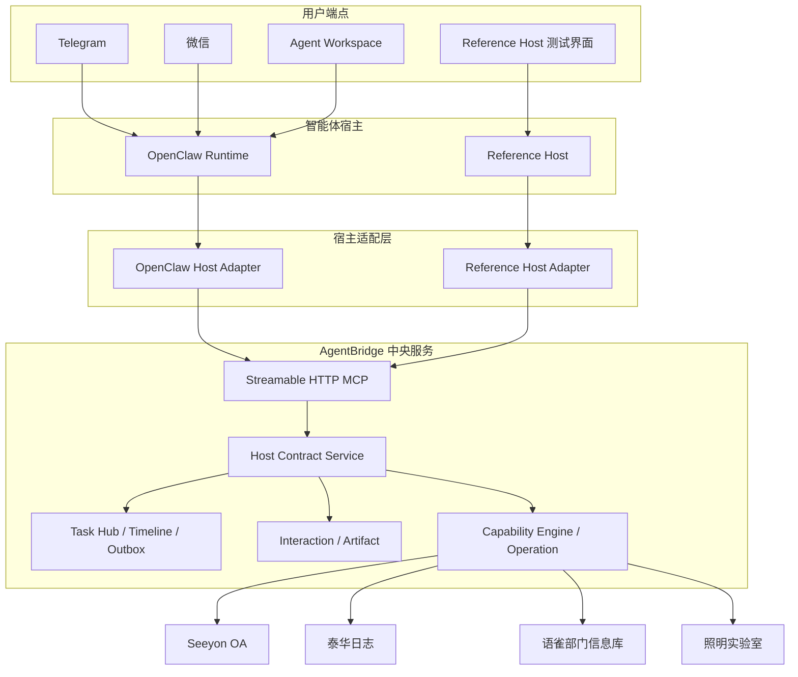
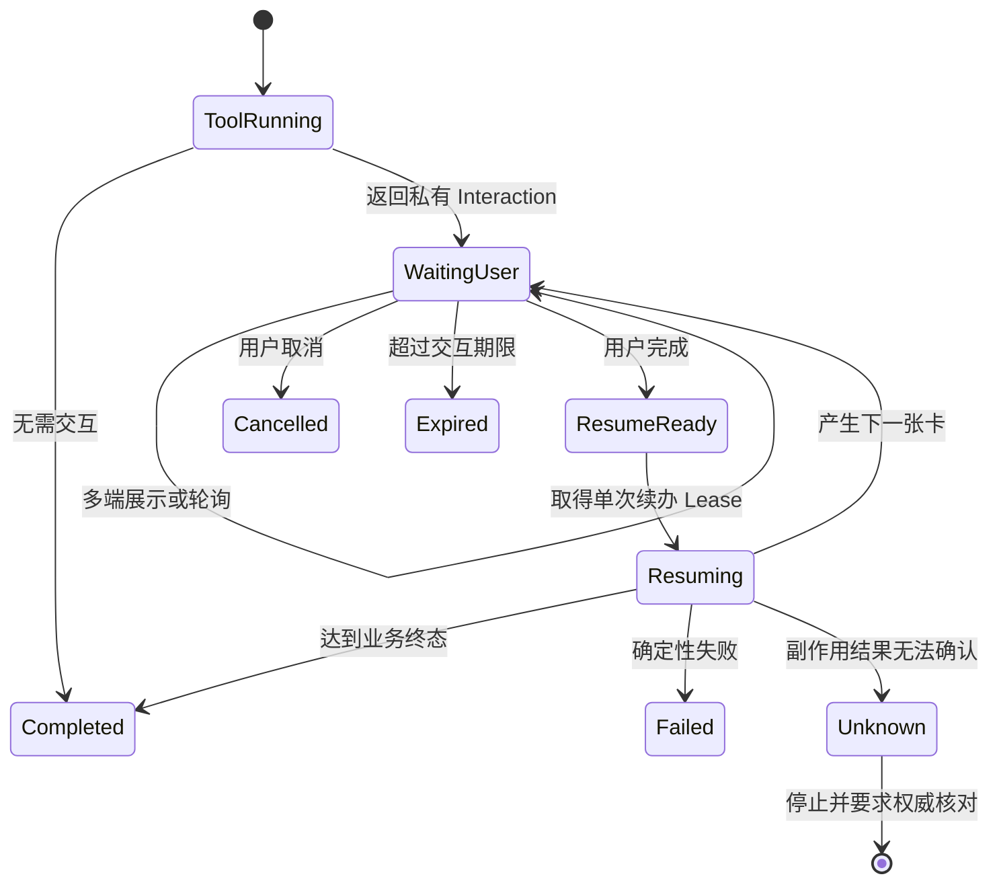

# AgentBridge 宿主无关化与标准远程 MCP 接入一期详细设计

> 形成日期：2026 年 8 月 23 日
>
> 实施后复验：2026 年 8 月 30 日
>
> 文档版本：1.3
>
> 状态：一期已实现，真实写入纵切仍按需授权验收
>
> 适用范围：AgentBridge、远程 Streamable HTTP MCP、MCP Apps、OpenClaw 宿主适配器、
> 参考宿主和外部智能体宿主候选调研
>
> 一期范围决策：只实施和验收 OpenClaw、Reference Host 两个宿主；其他宿主整体进入二期候选
>
> 上位路线：[下一阶段大块工作路线](../后续规划/下一阶段大块工作路线-2026-08-23.md)

## 一、结论先行

宿主无关化一期不是“马上替换 OpenClaw”，也不是“让所有 MCP 客户端立刻获得完全相同的
体验”。一期要完成的是把 AgentBridge 与智能体宿主之间的边界正式定义出来，并用两个独立
实现证明边界成立：

1. OpenClaw 继续作为当前完整宿主，但其插件收敛为标准 `Host Adapter`；
2. 项目内建设一个轻量 `Reference Host`，作为确定性的协议和状态机验收基准；
3. AgentBridge 的业务能力、身份、会话、交互、任务、文件和写入治理不复制到任何宿主；
4. Goose、nanobot 等现成宿主保留调研结论，但不安装、不适配，也不作为一期完成门槛。

一期执行组合固定如下。外部现成宿主的官方资料调研结论保留在第十一章，供二期选型使用：

| 角色 | 一期使用的宿主 | 原因 |
| --- | --- | --- |
| 当前完整宿主基线 | OpenClaw | 已经完成双用户、多端、可信交互、任务接续、文件和恢复真实验收 |
| 项目内权威验收器 | Reference Host | 不依赖模型随机性，能精确验证 L1/L2/L3 契约和故障状态 |

一期不卸载 OpenClaw 插件。Reference Host 必须只通过公开远程 MCP 和宿主契约访问 AgentBridge，
不得导入业务内部模块或调用私有 Python 方法。这样两套独立实现足以证明核心不依赖 OpenClaw，
同时避免一期演变为多个现成产品的适配工程。外部宿主真实接入留到契约稳定后的二期。

### 1.1 实施前校准

8 月 23 日形成初版设计后，项目继续完成了运行治理二期、本机 OpenClaw 自愈、MCP 短时传输
恢复、补签批量受控编排和 Workspace 快速填写卡续办修复。这些工作没有改变一期方向，但把原先
部分抽象要求变成了可以直接复用的中央能力，并暴露出必须在两个宿主之间统一的时序规则。

本版以以下实际状态作为实施起点：

| 基线项 | 当前事实 | 对一期设计的影响 |
| --- | --- | --- |
| OpenClaw | `2026.7.1`，AgentBridge 插件 `0.4.70` | 以现有插件行为和测试为迁移输入，但不把历史偶然行为直接定义为标准 |
| MCP 目录 | 中央目录 126 个工具，当前向 OpenClaw 模型投影 110 个 | 契约测试比较同一 Token 的目录投影和摘要，不长期写死数量 |
| 运行治理 | Trace、Span、Signal、Incident、恢复账本、SLO 和管理端已经落地 | Reference Host 复用现有治理模型并新增自己的宿主采集器 |
| 受控批量 | 已有持久化父任务、批次、条目和逐项独立授权 | L3 契约必须覆盖同一任务连续产生多张卡和自动推进 |
| MCP 恢复 | 幂等读取和 `prepare` 支持有界短时重试，内部 `commit` 不重试 | 重试矩阵进入公共宿主契约，不再只是 OpenClaw 实现细节 |
| 快速填写 | Workspace 可能先完成卡片，伴随端随后才认领通知 | 完成态晚到恢复、交互补取和单次续办进入强制测试向量 |

校准后仍只实施 OpenClaw 和 Reference Host，不增加第三个宿主，也不把 Windows 前台窗口、计划
任务或反向 SSH 隧道误写成所有宿主必须复制的通用机制。

### 1.2 实施结果

截至 2026 年 8 月 30 日，一期代码已完成并通过双用户 Workspace 整体复验：

- `schemas/agent-host/v1/` 发布 12 份机器 Schema 和 H01-H29 共享测试向量；
- 中央 MCP 支持宿主协商、版本登记、L1/L2/L3 工具平面、任务上下文、协调 Lease、运行快照、
  任务恢复、Artifact 重生和跨主体失败关闭；
- Python Reference Host 只经远程 Streamable HTTP MCP 工作，具备多身份、可信交互、任务、
  时间线、文件、重启恢复、SSE 页面和运行采集；
- OpenClaw 插件 `0.4.70` 按相同 Profile、上下文和 Lease 工作，并保留 Telegram、微信和
  Workspace 的渠道适配职责；
- 现有管理端显示宿主版本、兼容等级、实例健康和协调 Lease，不建立第二套控制台；
- 共享兼容性套件、OpenClaw 全量测试和项目 Python 全量测试均已通过。
- Reference Host 已连接正式远程 MCP，以两个真实 Token 协商到 L3，完成双用户会话读取、第一用户
  待办读取、SSE 页面、管理端健康快照和同实例重启恢复验收；本轮业务写入数为 0。
- 两个真实 Workspace 并发读取各自 OA 待办时形成独立 Task、Operation、run 和 Endpoint，
  每个任务只有一次业务调用；受理后断线只查中央账本，不重放业务工具。

Reference Host 与 OpenClaw 都使用经过审计的私有呈现器，当前都声明 `mcpApps=false`。这是能力
诚实声明：可信卡仍由中央服务生成并在模型外展示，但两个试点宿主尚未实现官方 AppBridge。
原生 MCP Apps 兼容性留给后续外部宿主二期，不影响一期 L2/L3 的私有呈现器验收。

### 1.3 实施后时序约束

整体复验把以下规则从实现细节提升为宿主契约约束：

1. 宿主包版本、运行中插件版本和中央兼容登记必须一致；任一版本漂移都降级或失败关闭，不能沿用
   旧 L3 结论。
2. 同一个用户轮次内的多次工具调用共享一个 Task；新的用户轮次必须创建新 Task，不能因为存在
   pending Interaction 就继承无关旧任务。
3. Workspace 请求一旦被宿主接受并产生工具活动，实时连接中断后只能查询同一 run 和中央账本；
   不得重新发送用户请求或重放业务工具。
4. 自动登录产生的 Interaction 必须关联原业务 Task；结构化结果是识别可信交互的权威来源，
   短期 URL 不进入模型上下文。
5. 已结束 Operation 如果要求登录但没有关联任何可操作 Interaction，其 Task 在 15 分钟后转为
   `expired`；存在有效 Interaction、批量任务或运行中 Operation 时不得清理。
6. 一次性 Workspace 绑定票据被消费后，重连必须重新签发受限 grant，不能复用已消费值，也不能
   改变已经固定的 `userSubject`。

这些规则的真实证据见
[宿主无关化一期工作台整体自测](../验收记录/宿主无关化一期工作台整体自测-2026-08-30.md)。

## 二、术语统一

| 术语 | 本项目中的准确含义 | 例子 |
| --- | --- | --- |
| 智能体宿主 | 运行模型循环、管理会话、调用工具并向用户交付结果的软件 | OpenClaw、nanobot、Goose、LibreChat |
| 宿主适配器 | 把某个宿主的身份、会话、界面和生命周期映射到 AgentBridge 标准契约的代码 | `integrations/openclaw-agentbridge` |
| 消息渠道 | 宿主连接用户的消息平台，不等于宿主本身 | Telegram、微信、飞书 |
| 用户端点 | 一个已验证用户在某个渠道或网页中的具体接收位置 | 某个 Telegram 私聊、某个 Workspace 登录会话 |
| Agent Workspace | 当前由 OpenClaw 提供模型运行能力的独立网页客户端和用户端点 | 浏览器工作台 |
| 目标系统适配器 | AgentBridge 内连接具体遗留系统的业务适配代码 | OA、泰华、语雀、照明适配器 |
| MCP Server | AgentBridge 对宿主公开工具、资源、提示和应用视图的标准服务端 | `https://.../mcp` |
| MCP Host | 发起 MCP 会话、把工具交给模型并呈现结果的一侧 | Goose Desktop、OpenClaw + 插件 |
| MCP Apps | MCP 的交互界面扩展，宿主在沙箱中渲染服务器提供的 HTML 应用 | AgentBridge 可信交互视图 |
| Task Hub | AgentBridge 内的任务、时间线、端点、通知和文件协调层 | 跨端任务接续基础 |
| Operation | 一次受治理业务操作及其幂等、提交和核验记录 | 提交一份出差申请 |
| Interaction | 必须由用户在可信界面完成的登录、字段填写或授权 | 认证卡、字段卡、授权卡 |
| Artifact | 任务产生并可交付、到期或重新生成的文件 | 证书扫描件、CSV 报告 |

特别注意：OpenClaw、nanobot 和 Goose 是“宿主”；Telegram、微信是“渠道”；Agent Workspace
是“客户端和端点”。目标系统适配器与宿主适配器是两条正交的扩展轴，不能混为一谈。

## 三、当前实现边界

### 3.1 已经位于 AgentBridge 中央服务的能力

以下能力已经基本不依赖 OpenClaw：

- `CapabilityRegistry -> CapabilityEngine -> CentralCapabilityService -> Adapter` 能力链；
- 远程 Streamable HTTP MCP、工具 Schema、资源、提示和服务画像；
- Bearer Token、scope 裁剪、用户主体、下游主体和每系统会话；
- `agentbridge.interaction.v1` 认证、字段填写和执行授权协议；
- `prepare -> authorize -> commit -> verify` 受控写入；
- Operation 账本、幂等键、结果未知时停止和权威回读；
- Task Hub 的任务、时间线、Endpoint、Outbox 和 Artifact；
- Task Hub 的持久化批次、批次条目、逐项授权和自动推进；
- Trace、Span、Signal、Incident、恢复账本、SLO 和一致性备份治理；
- MCP App 资源 `ui://agentbridge/trusted-interaction.html`；
- 模型可见结果与 `_meta["io.agentbridge/interaction"]` 私有交互信封分离；
- 内部 commit、resume、任务协调和管理工具不向普通模型公开。

因此，普通远程 MCP 宿主已经可以执行“有效会话下的只读能力”。

### 3.2 仍集中在 OpenClaw 插件中的能力

当前完整体验依赖 `integrations/openclaw-agentbridge`：

| 责任 | 当前实现位置 | 宿主无关化后的归属 |
| --- | --- | --- |
| 渠道发送者到用户身份的路由 | `identity-router.js` | 标准身份契约 + OpenClaw 字段映射 |
| 每用户 Token 选择 | OpenClaw 插件配置 | 宿主凭据提供器；Token 主体仍由 AgentBridge 校验 |
| 模型工具目录裁剪 | `tool-catalog.js`、`proxy-tools.js` | 标准目录投影规则 + 宿主实现 |
| 私有交互提取和 URL 清洗 | `interaction.js`、结果中间件 | 标准私有交互信封 + 宿主呈现器 |
| 轮询和原任务续办 | `coordinator.js` | 标准 Interaction Driver |
| Task Hub 任务关联 | `coordinator.js` | 标准 Task Correlator |
| Telegram、微信主动投递 | 渠道 Hook 和 Outbox 泵 | OpenClaw 渠道适配器 |
| Workspace SSE 时间线 | AgentBridge BFF + OpenClaw run | Task Hub 标准时间线，模型运行仍由当前宿主提供 |
| 图片、文件和短时链接交付 | OpenClaw Media + Task Hub | 标准 Artifact Driver + 渠道适配器 |
| Gateway 重启恢复 | OpenClaw 启动 Hook | 标准 Recovery Driver |
| 同轮重复交互保护 | `coordinator.js` | 标准幂等和调用去重规则 |
| 幂等读取和 `prepare` 的短时传输恢复 | `mcp-client.js`、`proxy-tools.js` | 标准传输恢复矩阵 + 宿主实现 |
| 宿主实例和调用轨迹上报 | OpenClaw `_meta` + 中央治理存储 | 标准运行上下文 + `HostRuntimeCollector` |
| Workspace 卡片与伴随端续办衔接 | `coordinator.js`、Task Hub Outbox | 展示端点与续办协调器分离的公共契约 |

宿主无关化的核心工作不是复制这些 JavaScript，而是提炼其输入、输出、状态和安全约束。

### 3.3 当前最危险的隐性耦合

1. 完整体验的正确性部分依赖 OpenClaw Hook 的调用顺序；
2. 某些宿主可能把 MCP 顶层 `_meta` 丢弃或错误注入模型上下文；
3. 任务终态、模型回复终态和业务 Operation 终态可能由不同组件先后产生；
4. 外部宿主即使“能调用 MCP”，也可能不支持私有界面、主动通知或重启恢复；
5. 仅用一条成功只读请求，不能证明一个宿主具备受控写入资格；
6. 卡片展示端点可能先完成操作，协调器随后才收到等待或完成通知；
7. 两个宿主可以同时看见同一任务，但不能因此同时取得续办和执行权；
8. 宿主侧传输恢复如果不按副作用边界分类，可能把安全重试扩大成重复提交。

## 四、一期目标和非目标

### 4.1 必须完成

1. 发布 `agentbridge.host.v1` 契约和机器可验证 Schema；
2. 把宿主能力划分为 L1、L2、L3，并在接入时显式协商；
3. 明确模型平面、宿主私有平面和 AgentBridge 控制平面；
4. 提供 Reference Host，覆盖远程 MCP、可信交互、任务、文件和恢复；
5. 让 OpenClaw 适配器按同一契约工作，不再成为协议事实来源；
6. 建立双用户、双宿主、重启和未知结果的自动验收；
7. 明确展示权、续办协调权和业务执行权，禁止两个宿主同时推进同一任务；
8. 让 Reference Host 复用现有运行治理和批量任务模型。

### 4.2 一期不做

- 不替换当前生产式试点中的 OpenClaw；
- 不同时维护 OpenClaw、nanobot 等宿主的核心源码私有分支；
- 不把 Task Hub 复制进每个宿主；
- 不把业务字段、密码、Cookie、短期卡片 URL 交给模型；
- 不把 AgentBridge 短期卡片冒充为尚未满足身份绑定条件的标准 URL Elicitation；
- 不在一期一次完成 OIDC/OBO、Vault、容器 Worker、高可用和灾备；
- 不把 Reference Host 建设为新的全功能聊天产品；
- 不为候选宿主补齐与本项目无关的全部渠道或模型能力。
- 不在一期安装、改造或真实验收 Goose、nanobot、LibreChat、Open WebUI 等外部宿主。

## 五、设计原则

### 5.1 标准优先，私有扩展渐进增强

- 业务工具、资源、提示和传输使用标准 MCP；
- 交互界面优先使用 MCP Apps；
- `_meta["io.agentbridge/interaction"]` 只作为宿主私有增强，不进入模型；
- 不支持增强的宿主仍可停留在 L1，不允许静默绕过用户交互。

### 5.2 Token 主体是授权事实，宿主上下文只是关联信息

`userSubject` 必须由 AgentBridge 根据已签发 Token 得出。宿主提交的渠道、会话、任务和设备
信息用于路由、审计和恢复，不能用来切换用户或扩大 scope。即使宿主上下文声称自己是另一
用户，服务端也必须按 Token 拒绝。

### 5.3 模型不控制安全状态机

模型可以选择公开业务工具和解释结果，但不得：

- 自己生成或修改 `userSubject`、Endpoint、Interaction 或 Operation；
- 读取可信 URL 或已填写字段；
- 调用内部 commit、resume、Outbox 和管理工具；
- 决定一条结果未知的写操作是否重试；
- 把“用户在聊天中说同意”替代独立授权卡。

### 5.4 业务终态高于模型终态

模型运行失败不等于业务失败，模型回复成功也不等于业务提交成功。最终状态来源顺序为：

```text
权威业务回读 > Operation 账本 > Interaction 状态 > Task Hub 展示 > 模型自然语言
```

### 5.5 多端展示，单次消费

同一张卡可出现在多个已绑定端点，但只有一次有效消费。服务端而不是前端负责 claim、版本检查、
幂等和终态竞争。

### 5.6 展示权与续办权分离

端点能够显示卡片，不等于所在宿主取得该任务的续办权。一个任务可以向多个 Endpoint 和宿主
展示状态，但只能有一个 `coordinatorHostInstanceId` 持有有期限的协调 Lease。默认规则如下：

- OpenClaw 发起的任务由 OpenClaw 协调；
- Reference Host 发起的任务由 Reference Host 协调；
- 另一宿主可以展示、观察和接受用户在中央可信页面中的操作，但不能私自 resume；
- 协调权转移必须由 AgentBridge 显式登记和发放新 Lease，不能由模型或卡片点击隐式触发。

一期不实现面向普通用户的自由宿主切换。双宿主验收主要证明契约一致和隔离成立，不把同一真实
写任务同时交给两个协调器竞争。

### 5.7 安全恢复服从副作用边界

宿主恢复策略由工具效果和 Operation 账本决定，而不是由 HTTP 错误文案决定：幂等读取和不会
产生最终业务副作用的受治理 `prepare` 可以使用稳定幂等键做有限重试；内部 `commit`、完成态
`resume` 以及任何可能越过副作用边界的调用都先查询 Operation，无法确认时进入
`RESULT_UNKNOWN`，绝不自动重放。

## 六、目标架构



图中只画一期实际运行的两个宿主。二期接入任何外部宿主时，都必须落到同一个 Agent Host 契约，
不得增加绕过 Reference Host 已验证边界的专用业务通道。

### 6.1 三个平面

| 平面 | 使用者 | 包含内容 | 禁止内容 |
| --- | --- | --- | --- |
| 模型平面 | LLM 和普通工具循环 | 公开工具 Schema、非敏感结果、确定性错误、交互引用 | Token、短期 URL、密码、字段值、内部 commit |
| 宿主私有平面 | MCP App 或批准的 Host Adapter | 私有交互信封、Endpoint、任务关联、文件交付和恢复控制 | 下游 Cookie、密码明文、跨用户数据 |
| AgentBridge 控制平面 | 中央服务和管理员 | 身份绑定、scope、会话、Operation、审计、写暂停 | 向普通宿主暴露全局管理权限 |

三个平面可以使用同一个 MCP 连接，但必须使用不同可见性和调用资格。L1 宿主只获得模型平面；
L2/L3 宿主的私有运行时才能消费宿主平面能力。

## 七、宿主能力分级和协商

### 7.1 能力等级

| 等级 | 最低能力 | 允许的业务范围 | 必须失败关闭的场景 |
| --- | --- | --- | --- |
| L1 核心 MCP | Streamable HTTP、Bearer、工具发现、结构化结果 | 有效会话下的读取和无需用户交互的操作 | 登录、字段填写、授权、私有文件重生 |
| L2 可信交互 | L1 + MCP Apps 或批准的私有呈现器、poll/resume、私聊绑定 | 登录、字段卡、授权卡和原请求续办 | 无私有 Endpoint、无法保护 `_meta`、无法保证单次消费 |
| L3 完整任务宿主 | L2 + Task Hub、时间线、通知、Artifact、恢复和执行 Lease | 跨端接续、后台终态、文件交付和受控写入 | 无持久恢复、用户隔离或幂等证明 |

“支持远程 MCP”只证明 L1。宿主不能因为自己有网页界面，就自称支持 L2；必须证明它不会把
私有信封送进模型、共享会话或错误用户。

### 7.2 宿主能力画像

一期定义 `agentbridge.host.v1`。宿主在 MCP `initialize` 的扩展能力中声明支持项，AgentBridge
通过 `agentbridge_server_profile` 返回协商结果。示意结构如下：

```json
{
  "schema": "agentbridge.host.v1",
  "hostInstanceId": "host-example-01",
  "implementation": {
    "name": "reference-host",
    "version": "0.1.0"
  },
  "levels": ["L1", "L2", "L3"],
  "capabilities": {
    "mcpApps": false,
    "privateResultMeta": true,
    "interactionPollResume": true,
    "taskTimeline": true,
    "proactiveDelivery": true,
    "artifactDelivery": true,
    "restartRecovery": true,
    "coordinatorLease": true,
    "batchTaskTimeline": true,
    "runtimeSignals": true,
    "boundedTransportRecovery": true
  },
  "endpointTypes": ["web_private"]
}
```

规则：

1. 宿主声明不能扩大 Token scope；
2. AgentBridge 返回 `acceptedLevel` 和缺失能力；
3. 未识别的宿主按 L1 处理；
4. 声明 L2/L3 但没有完成兼容性登记的宿主仍按 L1；
5. 协商结果写入审计，不进入普通模型提示；
6. 宿主版本变化后重新运行兼容性验收，不能沿用旧结论。

## 八、Agent Host 标准契约

### 8.1 契约组成

```text
Agent Host Contract
  ├─ Capability Negotiation
  ├─ Identity Context
  ├─ Model Tool Projection
  ├─ Trusted Interaction
  ├─ Coordinator Ownership
  ├─ Task Correlation and Timeline
  ├─ Batch Task Progression
  ├─ Artifact Delivery
  ├─ Notification and Acknowledgement
  ├─ Recovery and Lease
  ├─ Runtime Governance
  ├─ Transport Recovery
  ├─ Idempotency
  └─ Error and Privacy Projection
```

一期机器文件建议放在：

```text
schemas/agent-host/v1/
  host-capability-profile.schema.json
  host-runtime-context.schema.json
  host-call-context.schema.json
  interaction-presentation.schema.json
  coordinator-lease.schema.json
  task-correlation.schema.json
  task-batch.schema.json
  timeline-event.schema.json
  artifact-delivery.schema.json
  host-runtime-snapshot.schema.json
  transport-recovery.schema.json
  error-envelope.schema.json
```

这些 Schema 是跨 Python、JavaScript 和其他宿主语言的事实来源。各实现共享测试向量，不强求
共享同一运行时代码。

### 8.2 宿主运行上下文与调用上下文

1.1 基线沿用当前已经投入运行的两个私有 `_meta` 信封，并把它们正式标准化。稳定的宿主实例
信息放入 `tools/call.params._meta["io.agentbridge/host-context"]`：

```json
{
  "version": "1",
  "agentHost": "reference-host",
  "hostInstanceId": "reference-host-dev-01",
  "hostVersion": "0.1.0"
}
```

单次调用和任务关联信息放入 `tools/call.params._meta["io.agentbridge/task"]`：

```json
{
  "taskId": "task-opaque-id",
  "hostRunId": "run-opaque-ref",
  "toolCallId": "tool-call-opaque-ref",
  "endpointId": "endpoint-opaque-id",
  "conversationRef": "conversation-opaque-ref",
  "clientMessageRef": "message-opaque-ref"
}
```

两个对象都由宿主私有运行时插入，不能由模型工具参数生成。安全规则如下：

- 两个信封都不包含 `userSubject`，服务端从 Bearer Token 得出用户；
- `hostInstanceId` 必须属于已经登记且与声明版本相符的宿主实例；
- `endpointId` 必须已经绑定到同一 Token 主体，否则拒绝；
- `taskId` 必须属于同一主体，且只有当前协调 Lease 持有者可以调用续办类工具；
- `conversationRef` 只用于上下文关联，不用于授权；
- `hostRunId`、`toolCallId` 和 `clientMessageRef` 用于追踪和去重，不单独作为 Operation 幂等键；
- 未提供宿主和调用上下文时可以执行 L1，但不能私有投递、领取通知或自动续办；
- 群聊、共享屏幕或匿名网页不能登记为私有 Endpoint。

### 8.3 身份绑定契约

身份映射顺序固定为：

```text
宿主可信发送者
  -> 已登记 Endpoint
  -> AgentBridge Token
  -> userSubject
  -> 每系统 IdentityBinding
  -> 下游主体和会话
```

宿主不得用显示姓名匹配用户。Telegram ID、微信发送者 ID、网页账号和 nanobot pairing ID 都只是
宿主侧稳定主体，必须经过一次管理员或用户确认的绑定。下游实际账号由 AgentBridge 登录后从目标
系统回读并验证；显示姓名不一致不影响绑定，只要已验证主体记录一致。

### 8.4 模型工具目录投影

一个宿主内部需要区分三类 MCP 能力：

| 类型 | 可见性 | 例子 |
| --- | --- | --- |
| 业务工具 | 模型可见，按用户 scope 裁剪 | `oa_pending_list`、`taihua_worklog_search` |
| 应用私有工具 | 仅 MCP App 或交互驱动器可见 | `agentbridge_interaction_get`、`agentbridge_interaction_resume` |
| 宿主控制工具 | 仅已登记 L3 Adapter 可见 | Task Hub 关联、Outbox 确认、恢复 Lease |

服务端必须先按 Token scope 裁剪；宿主再按 `visibility` 投影给模型。只要宿主不能证明会隐藏应用
私有和宿主控制工具，就只能使用不包含这些工具的 L1 凭据。

### 8.5 可信交互呈现契约

业务工具需要用户操作时，返回结果分成两层：

```json
{
  "content": [
    {
      "type": "text",
      "text": "需要在可信界面完成登录；不要在聊天中发送密码。"
    }
  ],
  "structuredContent": {
    "interactionId": "interaction-opaque-id",
    "type": "authentication",
    "status": "REQUIRES_USER_ACTION"
  },
  "_meta": {
    "io.agentbridge/interaction": {
      "schema": "agentbridge.interaction.v1",
      "presentation": "private",
      "url": "<short-lived capability URL>"
    }
  }
}
```

宿主必须：

1. 在模型看到结果前移除或隔离完整 `_meta`；
2. 只向同一 `userSubject` 的已绑定私有 Endpoint 展示；
3. 校验 URL origin 白名单，不接受结果动态扩展信任来源；
4. 不把 URL 写入聊天正文、模型历史、普通日志或分析事件；
5. 同一 Interaction 可以多端展示，但服务端只接受一次有效提交；
6. 页面关闭、卡片过期或用户取消后返回确定性状态；
7. 完成一张卡后如果产生下一张卡，继续同一任务而不是创建无关新任务；
8. 展示成功只代表端点可见，不代表展示该卡的宿主自动取得续办协调权。

MCP Apps 宿主直接渲染 `ui://agentbridge/trusted-interaction.html`。不支持 MCP Apps 的宿主必须
通过经过兼容性验收的私有 Adapter 展示；否则在 L1 边界停止。

### 8.6 轮询和续办契约

Interaction Driver 使用有界轮询：

- 首次等待后开始轮询，不做高频忙等；
- 采用退避并设置整体截止时间；
- 页面完成只表示交互可继续，不等于业务提交成功；
- 每个 `resumeToken` 只续办一次；
- 同一 `agentRunRef + interactionId` 的重复回调返回已有结果；
- 通知被认领时即使 Interaction 已经是 `completed`，只要 `resume.ready=true` 且
  `resume.completed!=true`，仍必须进入单次续办；
- `waiting` 和 `completed` 事件可以重复、乱序或只携带 `interactionId`，宿主必须补取当前交互
  状态，不能把“来晚了”误判为“不需要续办”；
- 宿主超时不取消已完成的 Operation；
- `RESULT_UNKNOWN`、`MCP_TIMEOUT` 越过副作用边界后不得自动重试。

对于已经通过身份和权限校验的读取工具，如果中央结果明确为 `LOGIN_REQUIRED`，L2/L3 宿主必须
直接调用对应系统的会话登录工具，沿用原 `taskId` 展示可信登录卡，并保存原读取参数用于登录后
单次续办。不能只让模型回复“请登录”，再要求用户重复原问题；也不能由模型收集账号、密码或验证码。
当前系统映射为 OA、泰华、语雀和照明四类会话登录工具，未知系统必须失败关闭。

通知恢复算法固定为：

```text
收到 waiting/completed 事件
  -> 按 interactionId 获取当前交互
  -> pending/processing：展示并有界轮询
  -> completed 且 resume.ready：校验协调 Lease 后续办一次
  -> completed 且 resume.completed：只更新展示
  -> declined/expired/failed/superseded：只更新终态
```



### 8.7 协调器所有权和迁移契约

每个活动任务保存 `coordinatorHostInstanceId`、Lease 版本和到期时间。卡片提交由 AgentBridge 中央
页面接受，不要求提交端就是协调器；但 `agentbridge_interaction_resume`、Outbox 认领和后续自动
推进必须校验协调 Lease。

一期规则如下：

1. 创建任务的已登记 L2/L3 宿主获得初始协调 Lease；
2. 同一任务可以被多个宿主和 Endpoint 观察，但只有 Lease 持有者推进；
3. Lease 到期不直接授权另一宿主重放业务调用，接管前必须查询 Task、Interaction 和 Operation；
4. 明确接管时递增 Lease 版本，旧宿主后到达的 resume 和确认全部返回冲突；
5. OpenClaw 与 Reference Host 的真实写验收分别创建独立任务，不用竞争同一真实写任务证明兼容；
6. 一期只实现受测的管理或故障恢复接管，不提供普通用户自由切换协调宿主的产品界面。

### 8.8 任务关联和时间线契约

一次用户目标对应一个 `taskId`，可以关联多个 Operation、Interaction 和 Artifact。宿主不得按
“每张卡一个任务”拆散业务上下文。

所有跨端展示事件由 Task Hub 分配单调递增的 `sequence`：

```json
{
  "schema": "agentbridge.timeline-event.v1",
  "eventId": "event-opaque-id",
  "taskId": "task-opaque-id",
  "sequence": 17,
  "kind": "interaction.updated",
  "audience": "user",
  "summary": "出差申请等待执行授权",
  "createdAt": "2026-08-23T10:00:00Z"
}
```

规则：

- `sequence` 由 Task Hub 生成，宿主本地时间不能决定顺序；
- `eventId` 用于幂等显示，刷新或重连不能重复插入；
- 宿主自己的流式中间文本可以本地展示，持久跨端副本必须经过隐私裁剪；
- Task Hub 不保存系统提示、完整模型历史、工具内部参数和秘密；
- 业务终态事件不能被后到达的模型中间状态覆盖；
- 一个任务可订阅多个 Endpoint，但执行 Lease 同时只归一个协调器。

批量受控任务仍然只有一个用户可见父 `taskId`。`task_batches` 和 `task_batch_items` 属于中央
Task Hub，宿主只消费脱敏进度和标准事件：

- 当前序号、总数、成功数、失败数和批次终态；
- `batch.started`、`batch.item.waiting`、`batch.item.succeeded`、
  `batch.item.failed`、`batch.completed` 等有序事件；
- 每个条目独立的 Operation、Interaction、幂等键和执行授权；
- 一项完成后由中央编排准备下一项，宿主展示下一张新卡，不复用旧卡，也不要求用户说“继续”；
- 宿主重启后按父任务、批次和当前条目恢复，不能从第一项重新循环。

### 8.9 Artifact 交付契约

宿主获得的是 Artifact 描述，不直接把服务器路径交给模型：

```json
{
  "schema": "agentbridge.artifact.v1",
  "artifactId": "artifact-opaque-id",
  "fileName": "example.pdf",
  "mediaType": "application/pdf",
  "size": 12345,
  "status": "READY",
  "expiresAt": "2026-08-23T10:30:00Z",
  "regenerable": true
}
```

L3 宿主实现以下行为：

1. 优先使用渠道原生附件；
2. 原生附件失败时才回退短时 HTTPS 下载；
3. 链接到期后历史卡保留并显示“已过期”；
4. 只有 `regenerable=true` 才显示“重新生成下载”；
5. 每份文件独立回报原生交付、链接回退或失败；
6. 重试文件交付不能重新执行已完成的业务写操作；
7. Artifact 与 Task、用户和来源 Operation 必须一致。

### 8.10 通知确认契约

Outbox 的“投递失败”不能改变业务结果。宿主回报：

- `accepted`：渠道 API 已接受；
- `visible`：可选，端点确认已显示；
- `deferred`：端点离线，等待活动；
- `failed`：确定失败并保留原因；
- `superseded`：新事件取代旧的等待通知。

宿主可以对纯通知做有限重试；不能因为通知失败重新调用业务工具或唤醒模型猜测状态。

### 8.11 传输恢复和副作用边界契约

公共恢复矩阵至少区分以下三类调用：

| 调用类别 | 自动恢复 | 约束 |
| --- | --- | --- |
| 幂等读取 | 允许有界短时重试 | 只处理明确的短时传输错误，保留尝试次数和底层错误码 |
| 受治理 `prepare` | 允许有界短时重试 | 必须使用稳定 `idempotency_key`，不得越过最终业务副作用边界 |
| `commit`、完成态 `resume` 或结果不明调用 | 禁止盲重试 | 先查询 Operation；无法确认时返回 `RESULT_UNKNOWN` |

当前 OpenClaw 的 `500 ms`、`2 s` 重试间隔是实现基线，不作为协议永久常量。Schema 表达最大次数、
总截止时间、允许错误类别和副作用边界，由宿主兼容性测试验证。重试成功只记录治理轨迹，不向用户
先发送一次失败再发送一次成功。

宿主已经把用户请求交给模型后，如果 SSE、WebSocket 或反向隧道中断，不能把“实时连接断开”直接
翻译成“业务未执行”，更不能自动重放原请求。宿主应使用同一 `sessionKey + runId` 查询权威聊天
历史，识别该轮是否已经出现工具调用和最终答复：

1. 查到最终答复时，用它恢复当前流并标记 `recovered=true`；
2. 只查到工具活动时，明确提示连接中断且不会重放，涉及写操作要求先核对权威系统；
3. 没有找到该轮证据时，仍按保守失败处理；
4. 历史查询只读，不创建新任务、不调用业务工具，也不改变原 Operation 状态。

### 8.12 错误契约

| 错误类别 | 示例代码 | 宿主行为 |
| --- | --- | --- |
| 用户需操作 | `LOGIN_REQUIRED`、`REQUIRES_USER_ACTION` | L2/L3 展示卡；L1 明确停止 |
| 权限或身份 | `IDENTITY_NOT_PROVISIONED`、`SCOPE_REQUIRED` | 不重试，提示管理员或用户开通 |
| 业务拒绝 | 下游校验或规则拒绝 | 展示具体可理解原因，不伪装为登录失败 |
| 传输失败 | MCP 或渠道暂时不可用 | 仅在副作用前按策略恢复 |
| 结果未知 | `RESULT_UNKNOWN` | 立即停止，不自动重试，要求权威核对 |
| 卡片生命周期 | `EXPIRED`、`CANCELLED`、`SUPERSEDED` | 更新原卡状态，不保留“进行中” |
| 宿主能力不足 | `HOST_CAPABILITY_REQUIRED` | 返回缺失的 L2/L3 能力，不降级收集秘密 |

错误对象必须保留稳定 `code`、`category`、`retryable`、`sideEffectBoundary` 和用户可读摘要。模型
可以解释摘要，但不能覆盖 `retryable=false`。

## 九、Reference Host 设计

### 9.1 定位

Reference Host 是“宿主兼容性测试仪”，不是另一个 OpenClaw。它不负责 Telegram、微信、长期
记忆、通用技能市场或复杂多智能体编排。

### 9.2 技术路线

遵循项目 Python 主语言：

- Python 后端负责 Streamable HTTP MCP、Token、状态机、Task Hub 和测试驱动；
- 一个最小网页界面负责用户输入、流式事件、MCP App 沙箱和文件下载；
- MCP App 渲染使用官方 AppBridge 或兼容客户端组件，不自行定义卡片协议；
- 运行态通过现有 `HostRuntimeCollector` 语义上报宿主实例、调用关联、健康和恢复结果；
- 第一阶段使用脚本化工具选择，不依赖 LLM；
- 第二阶段可接一个模型，用于证明真实工具选择，但协议结论不依赖模型表现。

建议目录：

```text
integrations/reference-host/
  pyproject.toml
  reference_host/
    app.py
    mcp_client.py
    host_profile.py
    identity.py
    interaction_driver.py
    task_driver.py
    artifact_driver.py
    recovery.py
    runtime_collector.py
    conformance.py
  static/
    index.html
    host.js
  tests/
```

### 9.3 最小纵切

Reference Host 按顺序实现：

1. 读取 `agentbridge_server_profile`，登记 `hostInstanceId` 和运行能力画像；
2. 以一个测试用户 Token 调用会话状态；
3. 执行一条无需交互的真实只读能力；
4. 展示登录卡并在完成后自动继续原请求；
5. 展示字段卡和授权卡，证明两类交互分离；
6. 在协调器晚于用户完成卡片时补取 Interaction，并且只 resume 一次；
7. 接收下一张卡或终态，不重复 resume；
8. 展示一个 Artifact，过期后可按资格重新生成；
9. 用模拟或无业务副作用的批次完成多条目、多卡和最终汇总；
10. 在等待用户时重启 Reference Host，恢复同一任务和协调 Lease；
11. 增加第二用户并证明任务、卡片、文件和会话隔离；
12. 在现有管理端中看到 Reference Host 的 Trace、Signal、Incident 和恢复证据。

Reference Host 默认只协调自己创建的任务。它可以读取 OpenClaw 任务的脱敏时间线做跨宿主观察
验收，但没有显式接管 Lease 时不得续办 OpenClaw 任务。

### 9.4 持久化边界

Reference Host 只保存：

- 加密或受保护的 Token 引用，不保存到日志或测试快照；
- `hostInstanceId`、Endpoint、conversationRef、taskId 和 Interaction 引用；
- 最后消费的 Task Hub `sequence`；
- 等待恢复的状态、协调 Lease 版本和幂等键；
- 治理采集游标和最近一次健康快照引用。

不保存密码、Cookie、字段卡提交值、短期 URL、完整模型上下文或下游响应正文。

## 十、OpenClaw 适配器迁移设计

### 10.1 保留的 OpenClaw 专属代码

- `messageChannel`、`requesterSenderId`、`accountId` 和 `sessionKey` 的可信读取；
- Telegram、微信和 Gateway 的消息、按钮、Web App、附件和流式输出；
- OpenClaw 插件注册、工具代理和生命周期 Hook；
- OpenClaw Media Store 和宿主版本兼容处理；
- Windows 可见前台 Gateway、计划任务 Guard 和 Workspace 反向 SSH 隧道。

最后一项是当前 OpenClaw 工作站的部署实现，不进入 Reference Host 的公共完成门槛。公共契约只
要求宿主提供实例身份、健康快照和恢复结果。

### 10.2 下沉为契约的行为

- Host capability 协商；
- 用户 Token 主体与 Endpoint 一致性检查；
- Interaction 私有投影和同轮去重；
- poll/resume 退避、完成态晚到恢复、Lease 和终态规则；
- taskId、Operation、Interaction、Artifact 关联；
- 批量父任务、条目进度和连续新卡语义；
- Timeline `sequence`、Outbox 确认和 superseded；
- 结果未知、不自动重试和重启恢复；
- 文件到期、历史保留和重新生成；
- 幂等读取、`prepare` 和副作用后调用的传输恢复矩阵；
- `hostType`、`hostInstanceId`、`hostRunId` 和 `toolCallId` 治理关联。

“下沉”不一定表示把 JavaScript 改写成 Python。跨语言共同事实放入 JSON Schema、状态转换表和
测试向量；OpenClaw JavaScript 和 Reference Host Python 分别实现并通过同一套契约测试。

### 10.3 迁移顺序

1. 先把现有插件测试分成“应成为公共契约的行为”和“OpenClaw 渠道专属行为”，不固化历史偶然实现；
2. 发布 Schema 和共享测试向量；
3. Reference Host 实现并发现契约歧义；
4. OpenClaw 插件改为读取协商画像和标准字段；
5. 删除只被旧插件使用的兼容字段；
6. 保留一个发布周期的兼容告警；
7. 真实双用户、多端和受控写回归通过后再结束迁移。

## 十一、外部宿主调研

### 11.1 评估维度

候选宿主不是只看“能不能配置 MCP URL”，而是看：

1. 是否支持远程 Streamable HTTP MCP；
2. 是否原生支持 MCP Apps 和私有结果元数据；
3. 是否有稳定用户身份、私聊和多用户隔离；
4. 是否支持 WebUI、渠道、流式输出、文件和主动通知；
5. 是否有不修改核心源码的扩展点；
6. 是否能在内网、自签 CA 或企业 CA 环境部署；
7. 是否能持久恢复任务并控制重复执行；
8. 是否适合作为通用业务智能体，而不只是开发工具。

### 11.2 二期候选矩阵

`强` 表示官方文档已有明确能力；`中` 表示可通过正式扩展点实现；`弱` 表示产品定位不匹配；
`待验` 表示不能从官方资料确认，不能作为已具备能力。

| 宿主 | 远程 MCP | MCP Apps | 多用户身份 | 多渠道/主动投递 | 无源码适配 | 定位 |
| --- | --- | --- | --- | --- | --- | --- |
| OpenClaw | 强 | 中，当前由插件补足 | 强，已真实验收 | 强 | 强，正式插件 | 当前 L3 基线 |
| Reference Host | 强 | 强，一期自行实现标准 Host | 强，按 AgentBridge Token 和 Endpoint 验证 | 弱，仅测试界面 | 强，项目内实现 | 一期第二宿主和契约验收器 |
| Goose | 强 | 强，官方明确支持 | 弱，偏单用户桌面 | 弱 | 强，标准 MCP | 二期外部 L2 标准验收候选 |
| nanobot | 强，支持 HTTP/SSE/OAuth | 弱，当前只消费普通结果 | 中，有 pairing 和 session key | 强，多种聊天渠道 | 中，工具/SDK Hook 可扩展，渠道扩展需进入源码包 | 二期完整替代候选 |
| LibreChat | 强，支持 Streamable HTTP | 待验 | 强，每用户连接、OAuth/OBO、ACL | 弱，主要是网页 | 中，配置和平台扩展 | 二期企业网页和身份候选 |
| Open WebUI | 强，原生 Streamable HTTP | 中，社区 MCP App Bridge，非核心原生 | 强，RBAC、OIDC、LDAP | 弱，主要是网页 | 中，Functions/Events | 二期企业网页候选 |
| Claude/ChatGPT/VS Code | 强 | 强，列入 MCP Apps 支持矩阵 | 平台托管 | 弱，不是自管业务渠道宿主 | 弱，平台规则约束 | 标准兼容性抽测，不作主宿主 |
| MCPJam/Postman | 强 | 强 | 弱 | 弱 | 不适用 | 开发调试，不作用户宿主 |

### 11.3 nanobot 专项判断

nanobot 与本项目方向很接近：

- Python 实现，提供 WebUI、Gateway、会话、流式事件和 Python SDK；
- Telegram、Discord、Slack、飞书、微信、QQ、邮件等渠道进入同一消息总线和 Agent Loop；
- 支持 stdio、HTTP、SSE MCP、OAuth、工具白名单和私网 SSRF allowlist；
- pairing 能把不同渠道发送者纳入受控访问；
- `session_key`、`sender_id`、`chat_id` 和 SDK `attributes` 可用于宿主上下文映射；
- `AgentHook` 能观察工具执行和结果，适合做审计或宿主协调。

但它当前不能直接承担 AgentBridge L2/L3：

1. 官方仓库的开放需求明确说明，普通 MCP 工具可以调用，但 MCP App UI 尚不渲染；
2. 当前 MCP 结果主要转换为文本或图片，`structuredContent` 和顶层私有 `_meta` 不能假定会完整传到 WebUI；
3. Agent Plugin 主要打包 Skill 和 MCP Server，不等于 Host Adapter；
4. 渠道包没有独立外部插件路径，新增渠道级核心行为通常需要进入 nanobot 仓库或维护补丁；
5. pairing 解决“谁能访问 nanobot”，不自动等于 AgentBridge `userSubject` 绑定；
6. Task Hub、Interaction 单次消费、Artifact 重生和结果未知规则需要新增适配。

如果二期选择 nanobot，建议按以下顺序实施 PoC：

```text
第一步：只配置远程 MCP，完成 L1 只读和双 Token 隔离
第二步：验证原始 CallToolResult 是否可由 SDK/Hook 无损截获
第三步：若可无损截获，在宿主侧实现私有 Interaction Driver
第四步：若不能无损截获，向上游提交最小 MCP Apps/结果保真改造，不在 AgentBridge 核心做兼容补丁
第五步：完成 WebUI 私有卡、一个聊天渠道、恢复和文件纵切后再评估 L3
```

nanobot 适合做“完整替代候选”，但不进入一期实施和验收。

### 11.4 Goose 专项判断

Goose 官方提供 Desktop、CLI 和 API，远程 MCP 是其核心扩展方式，并明确支持 MCP Apps 在桌面
对话中渲染按钮、表单和可视化。它的优点是标准路径短：

- 不需要先编写 AgentBridge 专用渠道插件；
- 可以直接检验 AgentBridge 的 `ui://` 资源、沙箱、AppBridge 和结构化结果；
- Windows 可用，适合与当前内网环境做桌面 PoC；
- 开源且 MCP 实现成熟，出现差异时便于定位服务端还是宿主端问题。

局限是它不是当前所需的多用户全渠道平台。后续若选择 Goose 做外部验收，它主要证明：

1. 一个独立外部宿主能发现 AgentBridge；
2. L1 工具可用；
3. MCP App 能私密完成登录、字段和授权；
4. 结果不会因 OpenClaw 插件缺席而丢失。

它不替代 Telegram、微信、跨端 Outbox 和企业多用户治理。

### 11.5 LibreChat 与 Open WebUI

LibreChat 对远程 MCP、多用户连接、用户自有凭据、OAuth/OBO 和资源 ACL 的官方支持较完整，适合
未来验证企业网页宿主和统一身份。当前官方资料没有足够证据证明它原生实现 MCP Apps，因此先按
L1/企业身份候选处理。

Open WebUI 已原生支持 Streamable HTTP MCP，具备多用户、RBAC、OIDC/LDAP 和事件扩展；其社区
目录中存在 MCP App Bridge，但这不等于核心原生兼容。若选择它，应把 Bridge 作为待审查依赖，
单独验证私有 `_meta`、沙箱、每用户连接和事件回调。

二者都比 Goose 更接近“企业网页平台”。一期不投入这两个产品；等 Agent Host 契约稳定后，
再根据企业身份和部署需求选择其一。

### 11.6 SaaS 和开发型宿主

MCP 官方支持矩阵列出的 Claude、Claude Desktop、VS Code GitHub Copilot、ChatGPT、Postman 和
MCPJam 可用于抽测 MCP Apps 兼容性，但部分产品需要云端能够访问 MCP 服务，也不提供本项目需要
的自管渠道、Task Hub 协调和宿主适配生命周期。它们是协议验证客户端，不是当前完整宿主替代品。

## 十二、一期实施工作包

### 工作包 A：契约和基线

交付物：

- OpenClaw 专属职责清单；
- OpenClaw `2026.7.1`、实施起点插件 `0.4.61`、中央目录和当前治理能力的基线快照；
- `agentbridge.host.v1` Schema；
- L1/L2/L3 能力协商；
- 模型、宿主私有和控制平面边界；
- 协调 Lease、运行上下文和安全传输恢复矩阵；
- 成功、拒绝、过期、替代、未知、晚到通知、批量和恢复测试向量。

退出条件：Python 和 JavaScript 都能验证同一批 Schema 与向量。

### 工作包 B：Reference Host L1

交付物：

- Python 远程 MCP 客户端；
- 服务画像、工具目录和 scope 裁剪检查；
- 同一 Token 下 OpenClaw 与 Reference Host 的业务目录摘要一致性检查；
- 一个用户和两个用户的真实只读；
- 结构化错误、Trace 和审计关联。

退出条件：关闭 OpenClaw 后，Reference Host 仍能独立完成四系统允许的只读抽测。

### 工作包 C：Reference Host L2

交付物：

- 受审计私有呈现器页面；当前不声明原生 MCP Apps AppBridge；
- 登录、字段和授权三类卡；
- 有界 poll/resume；
- `waiting`、`completed` 晚到和重复通知恢复；
- 多端展示、单次消费；
- 取消、过期、替代和下一张卡。

退出条件：无需重复用户原请求即可从登录恢复到原业务结果。

### 工作包 D：Reference Host L3

交付物：

- Task Hub 任务和有序时间线；
- Endpoint 订阅和 Outbox 确认；
- Artifact 原生/链接交付、到期和重生；
- 等待用户和等待投递状态的重启恢复；
- 协调 Lease、跨宿主观察和显式接管保护；
- 批量父任务、多条目连续卡和最终汇总；
- `HostRuntimeCollector`、治理轨迹和实例健康；
- 安全传输恢复、重复执行和未知结果保护。

退出条件：宿主重启不会丢任务、重复提交或把另一用户的事件送错端点。

### 工作包 E：OpenClaw 收敛

交付物：

- 插件读取标准 Host Profile；
- 插件通过共享契约测试；
- 插件按公共规则处理完成态晚到、批量任务、协调 Lease 和传输恢复；
- 删除重复协议判断和旧兼容字段；
- 保留 OpenClaw 渠道、Gateway、Media 和 Session 的薄适配；
- 当前 Telegram、微信、Workspace 体验无回归。

退出条件：AgentBridge 核心不引用 OpenClaw Hook 或 Session 细节。

### 一期边界与二期入口

一期实施到工作包 E 为止，只运行 OpenClaw 和 Reference Host。以下事项不属于一期完成门槛：

- 安装 Goose 并执行外部 MCP Apps 纵切；
- 安装 nanobot 并验证私有结果保真；
- 适配 LibreChat 或 Open WebUI；
- 为外部宿主开发新的渠道或维护宿主核心源码分支。

一期完成后，根据真实使用目标单独立项“外部宿主兼容性二期”。如果目标是验证标准 MCP Apps，
优先评估 Goose；如果目标是替代 OpenClaw 的多渠道运行时，优先评估 nanobot。二期一次只选一个
外部宿主，不同时铺开多个产品。

## 十三、兼容性验收方案

### 13.1 自动化矩阵

| 编号 | 场景 | 预期 |
| --- | --- | --- |
| H01 | 未识别宿主连接 | 只协商到 L1 |
| H02 | L1 调用有效会话只读 | 成功并返回结构化结果 |
| H03 | L1 触发登录 | 返回 `HOST_CAPABILITY_REQUIRED`，不泄露 URL |
| H04 | L2 收到 Interaction | 模型只见摘要，私有界面见完整信封 |
| H05 | 两个端点同时打开同一卡 | 都可展示，只有一个提交生效 |
| H06 | 重复 resume | 返回同一结果，不二次执行 |
| H07 | 用户取消或卡片过期 | 原卡终态更新，任务不继续 |
| H08 | 登录后产生字段卡 | 自动继续并展示下一张卡 |
| H09 | 字段后产生授权卡 | 字段和授权独立，不复用用户同意 |
| H10 | 提交后传输超时 | 查询 Operation；未知则停止，不重试 |
| H11 | 宿主等待中重启 | 恢复原 Task/Interaction，不创建新任务 |
| H12 | 两用户同名下游显示名 | 按 Token 和已验证绑定隔离，不按姓名合并 |
| H13 | 文件链接到期 | 历史 Artifact 保留并按资格重生 |
| H14 | 渠道通知失败 | 业务终态不变，Outbox 独立重试或失败 |
| H15 | 乱序和重复时间线事件 | 按 `sequence` 排序，按 `eventId` 去重 |
| H16 | 宿主把 `_meta` 传给模型 | 兼容性测试失败，禁止 L2/L3 登记 |
| H17 | 模型尝试调用内部工具 | 目录不可见，直接调用也被 scope 拒绝 |
| H18 | Token A 携带 Endpoint B | 拒绝并审计，不回退到默认用户 |
| H19 | 用户先完成卡片，协调器后认领 `waiting` | 按 `interactionId` 补取完成态并续办一次 |
| H20 | `waiting` 和 `completed` 连续或重复到达 | 只产生一次 resume 和一张下一阶段卡 |
| H21 | 两个宿主同时看到同一卡 | 都可展示，只有协调 Lease 持有者能续办 |
| H22 | 非持有宿主尝试接管或 resume | 返回 Lease 冲突并审计，不执行业务调用 |
| H23 | 批量父任务连续产生多张卡 | 保持同一父任务，逐项独立授权，自动进入下一项 |
| H24 | 读取或 `prepare` 遇到短时传输失败 | 按稳定幂等键有界恢复；`commit` 不自动重试 |
| H25 | Reference Host 调用和恢复 | 现有管理端能按宿主实例关联 Trace、Signal 和恢复证据 |
| H26 | 读取返回 `LOGIN_REQUIRED` | 宿主自动展示对应可信登录卡，登录后按原参数续办，不要求重复提问 |
| H27 | 请求接受后实时连接中断 | 按 `sessionKey + runId` 只读对账；有最终答复则恢复，无终态则不重放业务 |
| H28 | 宿主提交跨系统计划 | 只接受当前 Scope 内公共能力，形成中心持久计划并由 Task Hub 展示 |
| H29 | 计划推进中中心服务重启 | 只恢复读取、转换和 prepare；隐藏 commit 不自动重放，结果不明则停止 |

### 13.2 真实纵切

真实验收分三层，避免一开始就用高风险写入证明协议：

1. 读取纵切：会话状态、OA 待办、泰华日志或照明概览；
2. 交互纵切：让会话失效，完成登录并自动续办原读取；
3. 受控写纵切：选择可撤销或低风险流程，完成字段、授权、提交、权威回读和必要撤销；
4. 批量纵切：优先使用模拟或无业务副作用数据验证多条目连续卡；有合适真实事项时再经逐项授权验收；
5. 双宿主纵切：分别创建独立任务，再验证跨宿主只读观察和未经授权不能接管。

真实写操作仍需要用户明确给出目标和授权。Reference Host 或新宿主通过自动测试，不等于自动获得
真实写权限。

### 13.3 双宿主真实验收提示词

提示词保持自然，不含内部验收编号：

```text
查看我的 OA 待办。
```

```text
查看今天我的工作日志。
```

```text
下载这个任务生成的文件。
```

```text
继续刚才等待我确认的任务。
```

只有在用户授权的低风险流程中再使用：

```text
按我填写的信息提交，并告诉我 OA 中最终结果。
```

## 十四、可观测性和治理

运行治理二期已经提供中央 Trace、Span、Signal、Incident、RecoveryAction、SLO、备份和管理端。
宿主无关化一期不重建这些表和页面，只补充 Reference Host 采集器、兼容等级和双宿主对比。

每个宿主调用至少关联：

- `hostInstanceId`；
- Token 对应的 `userSubject`；
- Endpoint 和 conversationRef；
- agentRunRef、taskId；
- toolCallId、Operation、Interaction、Artifact；
- 协商等级和宿主版本；
- 首次进展、等待用户、续办、提交、核验和交付耗时。

日志只记录引用和脱敏摘要。以下内容禁止进入普通日志：Bearer、Cookie、密码、验证码、字段卡值、
短期 URL 和文件内容。

当前治理模型已经能够记录任务、Operation、Interaction、投递、会话、文件和恢复。宿主无关化
一期需要在此基础上增加：

- 按宿主和版本查看活动任务及错误；
- L1/L2/L3 兼容性登记；
- 宿主版本漂移告警；
- Endpoint、任务和执行 Lease 冲突；
- Interaction 等待、过期和 superseded 分布；
- Artifact 到期、重生和交付渠道结果；
- 按宿主暂停写入但保留读取。

OpenClaw 的可见前台窗口、Guard、反向隧道和冷启动诊断继续由 OpenClaw 采集器解释；Reference
Host 只需实现相同的通用健康快照、调用关联和安全恢复结果，不复制 Windows 进程治理细节。

## 十五、安全威胁和控制

| 威胁 | 控制 |
| --- | --- |
| 宿主伪造另一用户 | Token 主体为唯一授权事实；Endpoint 必须同主体绑定 |
| 模型取得短期 URL | 私有 `_meta`、模型前清洗、普通日志扫描 |
| 共享群聊展示卡片 | 只允许已验证 `private=true` Endpoint |
| 多端重复提交 | 服务端 claim、版本、Lease 和 Operation 幂等 |
| 两宿主同时续办 | `coordinatorHostInstanceId`、有期限 Lease、版本冲突和显式接管 |
| 完成通知晚于用户操作 | 按 `interactionId` 补取权威状态，完成且可续办时只 resume 一次 |
| 宿主重启后补发写入 | 从账本恢复，先查 Operation，不自动重放 commit |
| 外部宿主丢弃 `_meta` | 降为 L1，不使用模型可见 URL 兜底 |
| 恶意 MCP App | origin/CSP/沙箱/AppBridge allowlist，限制应用专用工具 |
| 宿主插件升级漂移 | 版本登记、共享契约测试和真实冒烟 |
| 文件跨用户交付 | Artifact、Task、Endpoint 和 Token 主体四方一致性检查 |
| 模型误判业务结果 | 权威回读和账本状态高于自然语言 |

## 十六、完成标准

宿主无关化一期必须同时满足：

1. 本文和 `agentbridge.host.v1` Schema 成为正式事实来源；
2. Reference Host 完成 L1、L2、L3 自动验收；
3. OpenClaw 和 Reference Host 使用相同远程 MCP、身份、能力目录和错误语义；
4. Reference Host 只通过公开远程协议接入，不导入 AgentBridge 业务内部模块；
5. 两个用户在两个宿主间的 Token、会话、任务、Interaction 和 Artifact 不串用；
6. 一个任务只有一个协调 Lease 持有者，另一宿主只能观察或经显式接管后推进；
7. 宿主重启后等待任务可恢复，已越过副作用边界的操作不重放；
8. 多端显示同一卡、完成通知晚到或重复事件到达时只产生一次有效续办和业务动作；
9. 批量任务保持一个父任务、逐项独立授权、自动推进和可恢复终态；
10. 两个宿主遵守相同的读取、`prepare` 和副作用后传输恢复矩阵；
11. Reference Host 运行证据进入现有治理模型，不建立第二套控制台；
12. L1 宿主遇到可信交互明确停止且不泄露秘密；
13. OpenClaw 插件通过共享契约测试，当前三端体验无回归；
14. 自动测试、远程冒烟、双宿主真实验收和文档链接检查全部通过；
15. 一期没有安装或修改 Goose、nanobot、LibreChat、Open WebUI 等外部宿主。

## 十七、实施决策和停止条件

### 17.1 当前决策

- 一期只使用 OpenClaw 和 Reference Host；
- 现在不需要用户准备或安装任何外部宿主；
- Goose、nanobot、LibreChat 和 Open WebUI 只保留为二期调研候选；
- 二期一次只选择一个外部宿主，选型由当时的真实目标决定；
- OpenClaw 继续承担当前真实渠道，不在一期下线；
- OpenClaw 发起的当前真实任务继续由 OpenClaw 协调，Reference Host 不默认接管；
- 不为任何候选宿主破坏 AgentBridge 的失败关闭和写入治理。

### 17.2 停止或降级条件

候选宿主出现以下任一情况，就停止 L2/L3 适配并保留 L1：

- 无法阻止私有 `_meta` 进入模型；
- 无法绑定稳定用户主体和私有 Endpoint；
- 只能通过模型调用内部 commit/resume；
- 无法在重启后判断 Operation 是否已经产生副作用；
- 需要长期维护候选宿主大面积私有分支；
- 不支持内部 CA、私网访问或必要的企业网络策略；
- 无法证明两个用户、两个会话和两个文件交付链路隔离。

## 十八、调研来源

以下资料均为项目或标准的官方文档、官方仓库及其官方问题记录，访问日期为 2026 年 8 月 23 日：

- [MCP Apps 概览](https://modelcontextprotocol.io/extensions/apps/overview)
- [MCP 扩展客户端支持矩阵](https://modelcontextprotocol.io/extensions/client-matrix)
- [MCP Apps 测试说明](https://apps.extensions.modelcontextprotocol.io/api/documents/Testing_MCP_Apps.html)
- [Goose 官方首页](https://block.github.io/goose/index.html)
- [Goose 扩展使用说明](https://github.com/aaif-goose/goose/blob/main/documentation/docs/getting-started/using-extensions.md)
- [nanobot 官方仓库](https://github.com/HKUDS/nanobot)
- [nanobot 架构](https://github.com/HKUDS/nanobot/blob/main/docs/architecture.md)
- [nanobot 概念与运行模型](https://github.com/HKUDS/nanobot/blob/main/docs/concepts.md)
- [nanobot 远程 MCP 配置](https://github.com/HKUDS/nanobot/blob/main/docs/guides/configure-mcp-tools.md)
- [nanobot Python SDK](https://github.com/HKUDS/nanobot/blob/main/docs/python-sdk.md)
- [nanobot 渠道包边界](https://github.com/HKUDS/nanobot/blob/main/docs/channel-package-guide.md)
- [nanobot MCP Apps Host 支持需求](https://github.com/HKUDS/nanobot/issues/5251)
- [LibreChat MCP](https://www.librechat.ai/docs/features/mcp)
- [LibreChat MCP Server 配置](https://www.librechat.ai/docs/configuration/librechat_yaml/object_structure/mcp_servers)
- [Open WebUI MCP](https://docs.openwebui.com/features/extensibility/mcp/)
- [Open WebUI 功能与多用户能力](https://docs.openwebui.com/features/)
