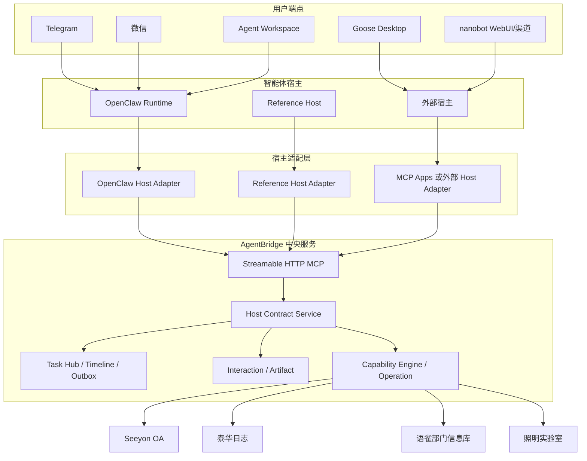
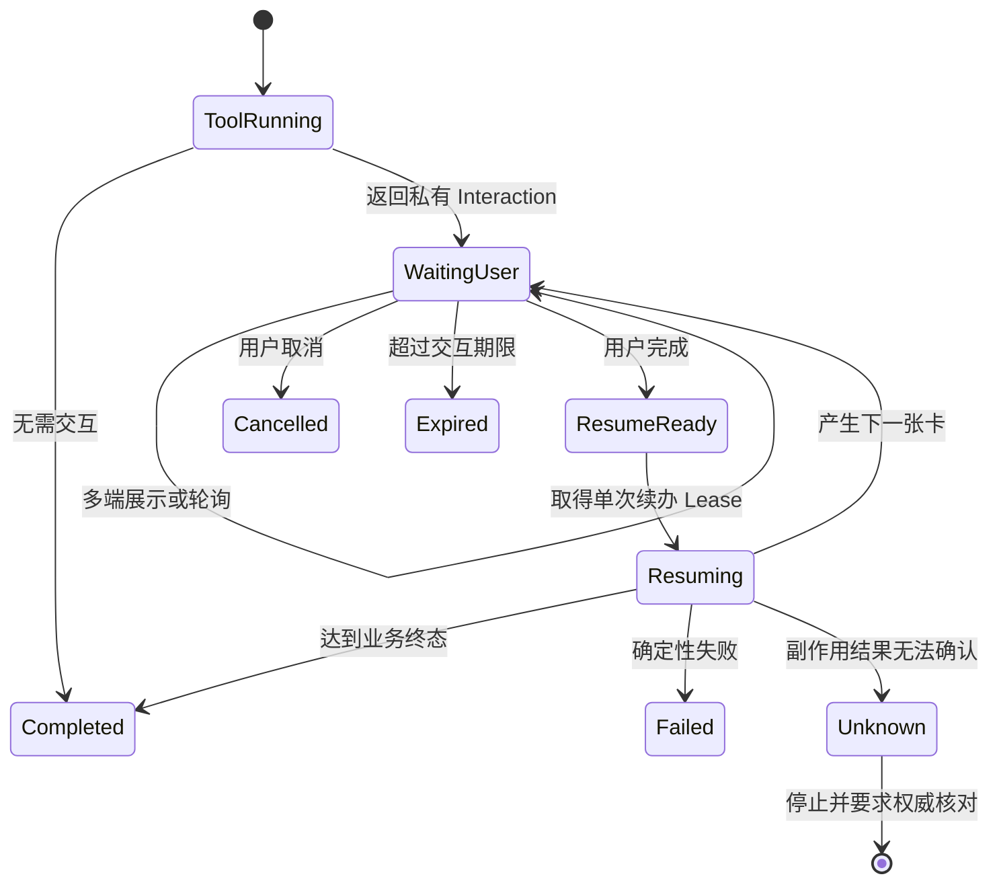

# AgentBridge 宿主无关化与标准远程 MCP 接入一期详细设计

> 形成日期：2026 年 8 月 23 日
>
> 状态：待实施的正式设计基线
>
> 适用范围：AgentBridge、远程 Streamable HTTP MCP、MCP Apps、OpenClaw 宿主适配器、
> 参考宿主和外部智能体宿主兼容性验收
>
> 上位路线：[下一阶段大块工作路线](../后续规划/下一阶段大块工作路线-2026-08-23.md)

## 一、结论先行

宿主无关化一期不是“马上替换 OpenClaw”，也不是“让所有 MCP 客户端立刻获得完全相同的
体验”。一期要完成的是把 AgentBridge 与智能体宿主之间的边界正式定义出来，并用两个独立
实现证明边界成立：

1. OpenClaw 继续作为当前完整宿主，但其插件收敛为标准 `Host Adapter`；
2. 项目内建设一个轻量 `Reference Host`，作为确定性的协议和状态机验收基准；
3. 选择一个现成外部宿主完成标准 MCP Apps 真实验收；
4. 选择一个接近 OpenClaw 的多渠道宿主做完整适配可行性验证；
5. AgentBridge 的业务能力、身份、会话、交互、任务、文件和写入治理不复制到任何宿主。

基于 2026 年 8 月 23 日的官方资料，建议采用以下组合，而不是押注一个产品：

| 角色 | 一期选择 | 原因 |
| --- | --- | --- |
| 当前完整宿主基线 | OpenClaw | 已经完成双用户、多端、可信交互、任务接续、文件和恢复真实验收 |
| 项目内权威验收器 | Reference Host | 不依赖模型随机性，能精确验证 L1/L2/L3 契约和故障状态 |
| 外部标准宿主 | Goose | 原生支持远程 MCP 和 MCP Apps，适合证明标准交互不依赖 OpenClaw 插件 |
| 完整替代候选 | nanobot | Python、多渠道、WebUI、远程 MCP、配对和 SDK 较接近 OpenClaw，但当前不渲染 MCP Apps |
| 企业网页候选 | LibreChat 或 Open WebUI | 多用户、权限和远程 MCP 较强，可信交互和任务接续需要额外验证或适配 |

一期不卸载 OpenClaw 插件。只有当宿主原生或通过标准适配器具备同等的身份隔离、私有交互、
续办、任务、文件和恢复能力后，该插件才可能退化为更薄的渠道适配器。

## 二、术语统一

| 术语 | 本项目中的准确含义 | 例子 |
| --- | --- | --- |
| 智能体宿主 | 运行模型循环、管理会话、调用工具并向用户交付结果的软件 | OpenClaw、nanobot、Goose、LibreChat |
| 宿主适配器 | 把某个宿主的身份、会话、界面和生命周期映射到 AgentBridge 标准契约的代码 | `integrations/openclaw-agentbridge` |
| 消息渠道 | 宿主连接用户的消息平台，不等于宿主本身 | Telegram、微信、飞书 |
| 用户端点 | 一个已验证用户在某个渠道或网页中的具体接收位置 | 某个 Telegram 私聊、某个 Workspace 登录会话 |
| Agent Workspace | 当前由 OpenClaw 提供模型运行能力的独立网页客户端和用户端点 | 浏览器工作台 |
| 目标系统适配器 | AgentBridge 内连接具体遗留系统的业务适配代码 | OA、泰华、语雀、照明适配器 |
| MCP Server | AgentBridge 对宿主公开工具、资源、提示和应用视图的标准服务端 | `https://.../mcp` |
| MCP Host | 发起 MCP 会话、把工具交给模型并呈现结果的一侧 | Goose Desktop、OpenClaw + 插件 |
| MCP Apps | MCP 的交互界面扩展，宿主在沙箱中渲染服务器提供的 HTML 应用 | AgentBridge 可信交互视图 |
| Task Hub | AgentBridge 内的任务、时间线、端点、通知和文件协调层 | 跨端任务接续基础 |
| Operation | 一次受治理业务操作及其幂等、提交和核验记录 | 提交一份出差申请 |
| Interaction | 必须由用户在可信界面完成的登录、字段填写或授权 | 认证卡、字段卡、授权卡 |
| Artifact | 任务产生并可交付、到期或重新生成的文件 | 证书扫描件、CSV 报告 |

特别注意：OpenClaw、nanobot 和 Goose 是“宿主”；Telegram、微信是“渠道”；Agent Workspace
是“客户端和端点”。目标系统适配器与宿主适配器是两条正交的扩展轴，不能混为一谈。

## 三、当前实现边界

### 3.1 已经位于 AgentBridge 中央服务的能力

以下能力已经基本不依赖 OpenClaw：

- `CapabilityRegistry -> CapabilityEngine -> CentralCapabilityService -> Adapter` 能力链；
- 远程 Streamable HTTP MCP、工具 Schema、资源、提示和服务画像；
- Bearer Token、scope 裁剪、用户主体、下游主体和每系统会话；
- `agentbridge.interaction.v1` 认证、字段填写和执行授权协议；
- `prepare -> authorize -> commit -> verify` 受控写入；
- Operation 账本、幂等键、结果未知时停止和权威回读；
- Task Hub 的任务、时间线、Endpoint、Outbox 和 Artifact；
- MCP App 资源 `ui://agentbridge/trusted-interaction.html`；
- 模型可见结果与 `_meta["io.agentbridge/interaction"]` 私有交互信封分离；
- 内部 commit、resume、任务协调和管理工具不向普通模型公开。

因此，普通远程 MCP 宿主已经可以执行“有效会话下的只读能力”。

### 3.2 仍集中在 OpenClaw 插件中的能力

当前完整体验依赖 `integrations/openclaw-agentbridge`：

| 责任 | 当前实现位置 | 宿主无关化后的归属 |
| --- | --- | --- |
| 渠道发送者到用户身份的路由 | `identity-router.js` | 标准身份契约 + OpenClaw 字段映射 |
| 每用户 Token 选择 | OpenClaw 插件配置 | 宿主凭据提供器；Token 主体仍由 AgentBridge 校验 |
| 模型工具目录裁剪 | `tool-catalog.js`、`proxy-tools.js` | 标准目录投影规则 + 宿主实现 |
| 私有交互提取和 URL 清洗 | `interaction.js`、结果中间件 | 标准私有交互信封 + 宿主呈现器 |
| 轮询和原任务续办 | `coordinator.js` | 标准 Interaction Driver |
| Task Hub 任务关联 | `coordinator.js` | 标准 Task Correlator |
| Telegram、微信主动投递 | 渠道 Hook 和 Outbox 泵 | OpenClaw 渠道适配器 |
| Workspace SSE 时间线 | AgentBridge BFF + OpenClaw run | Task Hub 标准时间线，模型运行仍由当前宿主提供 |
| 图片、文件和短时链接交付 | OpenClaw Media + Task Hub | 标准 Artifact Driver + 渠道适配器 |
| Gateway 重启恢复 | OpenClaw 启动 Hook | 标准 Recovery Driver |
| 同轮重复交互保护 | `coordinator.js` | 标准幂等和调用去重规则 |

宿主无关化的核心工作不是复制这些 JavaScript，而是提炼其输入、输出、状态和安全约束。

### 3.3 当前最危险的隐性耦合

1. 完整体验的正确性部分依赖 OpenClaw Hook 的调用顺序；
2. 某些宿主可能把 MCP 顶层 `_meta` 丢弃或错误注入模型上下文；
3. 任务终态、模型回复终态和业务 Operation 终态可能由不同组件先后产生；
4. 外部宿主即使“能调用 MCP”，也可能不支持私有界面、主动通知或重启恢复；
5. 仅用一条成功只读请求，不能证明一个宿主具备受控写入资格。

## 四、一期目标和非目标

### 4.1 必须完成

1. 发布 `agentbridge.host.v1` 契约和机器可验证 Schema；
2. 把宿主能力划分为 L1、L2、L3，并在接入时显式协商；
3. 明确模型平面、宿主私有平面和 AgentBridge 控制平面；
4. 提供 Reference Host，覆盖远程 MCP、可信交互、任务、文件和恢复；
5. 让 OpenClaw 适配器按同一契约工作，不再成为协议事实来源；
6. 使用 Goose 完成一个真实 MCP Apps 外部宿主纵切；
7. 对 nanobot 完成不改 AgentBridge 核心的兼容性 PoC 和差距清单；
8. 建立双用户、双宿主、重启和未知结果的自动验收。

### 4.2 一期不做

- 不替换当前生产式试点中的 OpenClaw；
- 不同时维护 OpenClaw、nanobot 等宿主的核心源码私有分支；
- 不把 Task Hub 复制进每个宿主；
- 不把业务字段、密码、Cookie、短期卡片 URL 交给模型；
- 不把 AgentBridge 短期卡片冒充为尚未满足身份绑定条件的标准 URL Elicitation；
- 不在一期一次完成 OIDC/OBO、Vault、容器 Worker、高可用和灾备；
- 不把 Reference Host 建设为新的全功能聊天产品；
- 不为候选宿主补齐与本项目无关的全部渠道或模型能力。

## 五、设计原则

### 5.1 标准优先，私有扩展渐进增强

- 业务工具、资源、提示和传输使用标准 MCP；
- 交互界面优先使用 MCP Apps；
- `_meta["io.agentbridge/interaction"]` 只作为宿主私有增强，不进入模型；
- 不支持增强的宿主仍可停留在 L1，不允许静默绕过用户交互。

### 5.2 Token 主体是授权事实，宿主上下文只是关联信息

`userSubject` 必须由 AgentBridge 根据已签发 Token 得出。宿主提交的渠道、会话、任务和设备
信息用于路由、审计和恢复，不能用来切换用户或扩大 scope。即使宿主上下文声称自己是另一
用户，服务端也必须按 Token 拒绝。

### 5.3 模型不控制安全状态机

模型可以选择公开业务工具和解释结果，但不得：

- 自己生成或修改 `userSubject`、Endpoint、Interaction 或 Operation；
- 读取可信 URL 或已填写字段；
- 调用内部 commit、resume、Outbox 和管理工具；
- 决定一条结果未知的写操作是否重试；
- 把“用户在聊天中说同意”替代独立授权卡。

### 5.4 业务终态高于模型终态

模型运行失败不等于业务失败，模型回复成功也不等于业务提交成功。最终状态来源顺序为：

```text
权威业务回读 > Operation 账本 > Interaction 状态 > Task Hub 展示 > 模型自然语言
```

### 5.5 多端展示，单次消费

同一张卡可出现在多个已绑定端点，但只有一次有效消费。服务端而不是前端负责 claim、版本检查、
幂等和终态竞争。

## 六、目标架构



### 6.1 三个平面

| 平面 | 使用者 | 包含内容 | 禁止内容 |
| --- | --- | --- | --- |
| 模型平面 | LLM 和普通工具循环 | 公开工具 Schema、非敏感结果、确定性错误、交互引用 | Token、短期 URL、密码、字段值、内部 commit |
| 宿主私有平面 | MCP App 或批准的 Host Adapter | 私有交互信封、Endpoint、任务关联、文件交付和恢复控制 | 下游 Cookie、密码明文、跨用户数据 |
| AgentBridge 控制平面 | 中央服务和管理员 | 身份绑定、scope、会话、Operation、审计、写暂停 | 向普通宿主暴露全局管理权限 |

三个平面可以使用同一个 MCP 连接，但必须使用不同可见性和调用资格。L1 宿主只获得模型平面；
L2/L3 宿主的私有运行时才能消费宿主平面能力。

## 七、宿主能力分级和协商

### 7.1 能力等级

| 等级 | 最低能力 | 允许的业务范围 | 必须失败关闭的场景 |
| --- | --- | --- | --- |
| L1 核心 MCP | Streamable HTTP、Bearer、工具发现、结构化结果 | 有效会话下的读取和无需用户交互的操作 | 登录、字段填写、授权、私有文件重生 |
| L2 可信交互 | L1 + MCP Apps 或批准的私有呈现器、poll/resume、私聊绑定 | 登录、字段卡、授权卡和原请求续办 | 无私有 Endpoint、无法保护 `_meta`、无法保证单次消费 |
| L3 完整任务宿主 | L2 + Task Hub、时间线、通知、Artifact、恢复和执行 Lease | 跨端接续、后台终态、文件交付和受控写入 | 无持久恢复、用户隔离或幂等证明 |

“支持远程 MCP”只证明 L1。宿主不能因为自己有网页界面，就自称支持 L2；必须证明它不会把
私有信封送进模型、共享会话或错误用户。

### 7.2 宿主能力画像

一期定义 `agentbridge.host.v1`。宿主在 MCP `initialize` 的扩展能力中声明支持项，AgentBridge
通过 `agentbridge_server_profile` 返回协商结果。示意结构如下：

```json
{
  "schema": "agentbridge.host.v1",
  "hostInstanceId": "host-example-01",
  "implementation": {
    "name": "reference-host",
    "version": "0.1.0"
  },
  "levels": ["L1", "L2"],
  "capabilities": {
    "mcpApps": true,
    "privateResultMeta": true,
    "interactionPollResume": true,
    "taskTimeline": false,
    "proactiveDelivery": false,
    "artifactDelivery": true,
    "restartRecovery": true
  },
  "endpointTypes": ["web_private"]
}
```

规则：

1. 宿主声明不能扩大 Token scope；
2. AgentBridge 返回 `acceptedLevel` 和缺失能力；
3. 未识别的宿主按 L1 处理；
4. 声明 L2/L3 但没有完成兼容性登记的宿主仍按 L1；
5. 协商结果写入审计，不进入普通模型提示；
6. 宿主版本变化后重新运行兼容性验收，不能沿用旧结论。

## 八、Agent Host 标准契约

### 8.1 契约组成

```text
Agent Host Contract
  ├─ Capability Negotiation
  ├─ Identity Context
  ├─ Model Tool Projection
  ├─ Trusted Interaction
  ├─ Task Correlation and Timeline
  ├─ Artifact Delivery
  ├─ Notification and Acknowledgement
  ├─ Recovery and Lease
  ├─ Idempotency
  └─ Error and Privacy Projection
```

一期机器文件建议放在：

```text
schemas/agent-host/v1/
  host-capability-profile.schema.json
  host-identity-context.schema.json
  interaction-presentation.schema.json
  task-correlation.schema.json
  timeline-event.schema.json
  artifact-delivery.schema.json
  error-envelope.schema.json
```

这些 Schema 是跨 Python、JavaScript 和其他宿主语言的事实来源。各实现共享测试向量，不强求
共享同一运行时代码。

### 8.2 `HostIdentityContext`

宿主在 `tools/call.params._meta["io.agentbridge/host-context"]` 中附加关联上下文。该对象由宿主
运行时插入，不能由模型工具参数生成：

```json
{
  "schema": "agentbridge.host-context.v1",
  "hostInstanceId": "host-example-01",
  "endpoint": {
    "endpointId": "endpoint-opaque-id",
    "type": "telegram_private",
    "private": true
  },
  "conversationRef": "conversation-opaque-ref",
  "agentRunRef": "run-opaque-ref",
  "taskRef": "task-opaque-ref",
  "clientMessageRef": "message-opaque-ref"
}
```

安全规则：

- 不包含 `userSubject`，服务端从 Bearer Token 得出用户；
- `endpointId` 必须已经绑定到同一 Token 主体，否则拒绝；
- `conversationRef` 只用于上下文关联，不用于授权；
- `agentRunRef` 和 `clientMessageRef` 用于去重，不作为 Operation 幂等键的唯一来源；
- 未提供上下文时可以执行 L1，但不能私有投递或自动续办；
- 群聊、共享屏幕或匿名网页不能标记为 `private=true`。

### 8.3 身份绑定契约

身份映射顺序固定为：

```text
宿主可信发送者
  -> 已登记 Endpoint
  -> AgentBridge Token
  -> userSubject
  -> 每系统 IdentityBinding
  -> 下游主体和会话
```

宿主不得用显示姓名匹配用户。Telegram ID、微信发送者 ID、网页账号和 nanobot pairing ID 都只是
宿主侧稳定主体，必须经过一次管理员或用户确认的绑定。下游实际账号由 AgentBridge 登录后从目标
系统回读并验证；显示姓名不一致不影响绑定，只要已验证主体记录一致。

### 8.4 模型工具目录投影

一个宿主内部需要区分三类 MCP 能力：

| 类型 | 可见性 | 例子 |
| --- | --- | --- |
| 业务工具 | 模型可见，按用户 scope 裁剪 | `oa_pending_list`、`taihua_worklog_search` |
| 应用私有工具 | 仅 MCP App 或交互驱动器可见 | `agentbridge_interaction_get`、`agentbridge_interaction_resume` |
| 宿主控制工具 | 仅已登记 L3 Adapter 可见 | Task Hub 关联、Outbox 确认、恢复 Lease |

服务端必须先按 Token scope 裁剪；宿主再按 `visibility` 投影给模型。只要宿主不能证明会隐藏应用
私有和宿主控制工具，就只能使用不包含这些工具的 L1 凭据。

### 8.5 可信交互呈现契约

业务工具需要用户操作时，返回结果分成两层：

```json
{
  "content": [
    {
      "type": "text",
      "text": "需要在可信界面完成登录；不要在聊天中发送密码。"
    }
  ],
  "structuredContent": {
    "interactionId": "interaction-opaque-id",
    "type": "authentication",
    "status": "REQUIRES_USER_ACTION"
  },
  "_meta": {
    "io.agentbridge/interaction": {
      "schema": "agentbridge.interaction.v1",
      "presentation": "private",
      "url": "<short-lived capability URL>"
    }
  }
}
```

宿主必须：

1. 在模型看到结果前移除或隔离完整 `_meta`；
2. 只向同一 `userSubject` 的已绑定私有 Endpoint 展示；
3. 校验 URL origin 白名单，不接受结果动态扩展信任来源；
4. 不把 URL 写入聊天正文、模型历史、普通日志或分析事件；
5. 同一 Interaction 可以多端展示，但服务端只接受一次有效提交；
6. 页面关闭、卡片过期或用户取消后返回确定性状态；
7. 完成一张卡后如果产生下一张卡，继续同一任务而不是创建无关新任务。

MCP Apps 宿主直接渲染 `ui://agentbridge/trusted-interaction.html`。不支持 MCP Apps 的宿主必须
通过经过兼容性验收的私有 Adapter 展示；否则在 L1 边界停止。

### 8.6 轮询和续办契约

Interaction Driver 使用有界轮询：

- 首次等待后开始轮询，不做高频忙等；
- 采用退避并设置整体截止时间；
- 页面完成只表示交互可继续，不等于业务提交成功；
- 每个 `resumeToken` 只续办一次；
- 同一 `agentRunRef + interactionId` 的重复回调返回已有结果；
- 宿主超时不取消已完成的 Operation；
- `RESULT_UNKNOWN`、`MCP_TIMEOUT` 越过副作用边界后不得自动重试。



### 8.7 任务关联和时间线契约

一次用户目标对应一个 `taskId`，可以关联多个 Operation、Interaction 和 Artifact。宿主不得按
“每张卡一个任务”拆散业务上下文。

所有跨端展示事件由 Task Hub 分配单调递增的 `sequence`：

```json
{
  "schema": "agentbridge.timeline-event.v1",
  "eventId": "event-opaque-id",
  "taskId": "task-opaque-id",
  "sequence": 17,
  "kind": "interaction.updated",
  "audience": "user",
  "summary": "出差申请等待执行授权",
  "createdAt": "2026-08-23T10:00:00Z"
}
```

规则：

- `sequence` 由 Task Hub 生成，宿主本地时间不能决定顺序；
- `eventId` 用于幂等显示，刷新或重连不能重复插入；
- 宿主自己的流式中间文本可以本地展示，持久跨端副本必须经过隐私裁剪；
- Task Hub 不保存系统提示、完整模型历史、工具内部参数和秘密；
- 业务终态事件不能被后到达的模型中间状态覆盖；
- 一个任务可订阅多个 Endpoint，但执行 Lease 同时只归一个协调器。

### 8.8 Artifact 交付契约

宿主获得的是 Artifact 描述，不直接把服务器路径交给模型：

```json
{
  "schema": "agentbridge.artifact.v1",
  "artifactId": "artifact-opaque-id",
  "fileName": "example.pdf",
  "mediaType": "application/pdf",
  "size": 12345,
  "status": "READY",
  "expiresAt": "2026-08-23T10:30:00Z",
  "regenerable": true
}
```

L3 宿主实现以下行为：

1. 优先使用渠道原生附件；
2. 原生附件失败时才回退短时 HTTPS 下载；
3. 链接到期后历史卡保留并显示“已过期”；
4. 只有 `regenerable=true` 才显示“重新生成下载”；
5. 每份文件独立回报原生交付、链接回退或失败；
6. 重试文件交付不能重新执行已完成的业务写操作；
7. Artifact 与 Task、用户和来源 Operation 必须一致。

### 8.9 通知确认契约

Outbox 的“投递失败”不能改变业务结果。宿主回报：

- `accepted`：渠道 API 已接受；
- `visible`：可选，端点确认已显示；
- `deferred`：端点离线，等待活动；
- `failed`：确定失败并保留原因；
- `superseded`：新事件取代旧的等待通知。

宿主可以对纯通知做有限重试；不能因为通知失败重新调用业务工具或唤醒模型猜测状态。

### 8.10 错误契约

| 错误类别 | 示例代码 | 宿主行为 |
| --- | --- | --- |
| 用户需操作 | `LOGIN_REQUIRED`、`REQUIRES_USER_ACTION` | L2/L3 展示卡；L1 明确停止 |
| 权限或身份 | `IDENTITY_NOT_PROVISIONED`、`SCOPE_REQUIRED` | 不重试，提示管理员或用户开通 |
| 业务拒绝 | 下游校验或规则拒绝 | 展示具体可理解原因，不伪装为登录失败 |
| 传输失败 | MCP 或渠道暂时不可用 | 仅在副作用前按策略恢复 |
| 结果未知 | `RESULT_UNKNOWN` | 立即停止，不自动重试，要求权威核对 |
| 卡片生命周期 | `EXPIRED`、`CANCELLED`、`SUPERSEDED` | 更新原卡状态，不保留“进行中” |
| 宿主能力不足 | `HOST_CAPABILITY_REQUIRED` | 返回缺失的 L2/L3 能力，不降级收集秘密 |

错误对象必须保留稳定 `code`、`category`、`retryable`、`sideEffectBoundary` 和用户可读摘要。模型
可以解释摘要，但不能覆盖 `retryable=false`。

## 九、Reference Host 设计

### 9.1 定位

Reference Host 是“宿主兼容性测试仪”，不是另一个 OpenClaw。它不负责 Telegram、微信、长期
记忆、通用技能市场或复杂多智能体编排。

### 9.2 技术路线

遵循项目 Python 主语言：

- Python 后端负责 Streamable HTTP MCP、Token、状态机、Task Hub 和测试驱动；
- 一个最小网页界面负责用户输入、流式事件、MCP App 沙箱和文件下载；
- MCP App 渲染使用官方 AppBridge 或兼容客户端组件，不自行定义卡片协议；
- 第一阶段使用脚本化工具选择，不依赖 LLM；
- 第二阶段可接一个模型，用于证明真实工具选择，但协议结论不依赖模型表现。

建议目录：

```text
integrations/reference-host/
  pyproject.toml
  reference_host/
    app.py
    mcp_client.py
    host_profile.py
    identity.py
    interaction_driver.py
    task_driver.py
    artifact_driver.py
    recovery.py
  static/
    index.html
    host.js
  tests/
```

### 9.3 最小纵切

Reference Host 按顺序实现：

1. 读取 `agentbridge_server_profile`；
2. 以一个测试用户 Token 调用会话状态；
3. 执行一条无需交互的真实只读能力；
4. 展示登录卡并在完成后自动继续原请求；
5. 展示字段卡和授权卡，证明两类交互分离；
6. 接收下一张卡或终态，不重复 resume；
7. 展示一个 Artifact，过期后可按资格重新生成；
8. 在等待用户时重启 Reference Host，恢复同一任务；
9. 增加第二用户并证明任务、卡片、文件和会话隔离。

### 9.4 持久化边界

Reference Host 只保存：

- 加密或受保护的 Token 引用，不保存到日志或测试快照；
- `hostInstanceId`、Endpoint、conversationRef、taskId 和 Interaction 引用；
- 最后消费的 Task Hub `sequence`；
- 等待恢复的状态和幂等键。

不保存密码、Cookie、字段卡提交值、短期 URL、完整模型上下文或下游响应正文。

## 十、OpenClaw 适配器迁移设计

### 10.1 保留的 OpenClaw 专属代码

- `messageChannel`、`requesterSenderId`、`accountId` 和 `sessionKey` 的可信读取；
- Telegram、微信和 Gateway 的消息、按钮、Web App、附件和流式输出；
- OpenClaw 插件注册、工具代理和生命周期 Hook；
- OpenClaw Media Store 和宿主版本兼容处理。

### 10.2 下沉为契约的行为

- Host capability 协商；
- 用户 Token 主体与 Endpoint 一致性检查；
- Interaction 私有投影和同轮去重；
- poll/resume 退避、Lease 和终态规则；
- taskId、Operation、Interaction、Artifact 关联；
- Timeline `sequence`、Outbox 确认和 superseded；
- 结果未知、不自动重试和重启恢复；
- 文件到期、历史保留和重新生成。

“下沉”不一定表示把 JavaScript 改写成 Python。跨语言共同事实放入 JSON Schema、状态转换表和
测试向量；OpenClaw JavaScript 和 Reference Host Python 分别实现并通过同一套契约测试。

### 10.3 迁移顺序

1. 先用测试锁定现有插件行为；
2. 发布 Schema 和共享测试向量；
3. Reference Host 实现并发现契约歧义；
4. OpenClaw 插件改为读取协商画像和标准字段；
5. 删除只被旧插件使用的兼容字段；
6. 保留一个发布周期的兼容告警；
7. 真实双用户、多端和受控写回归通过后再结束迁移。

## 十一、外部宿主调研

### 11.1 评估维度

候选宿主不是只看“能不能配置 MCP URL”，而是看：

1. 是否支持远程 Streamable HTTP MCP；
2. 是否原生支持 MCP Apps 和私有结果元数据；
3. 是否有稳定用户身份、私聊和多用户隔离；
4. 是否支持 WebUI、渠道、流式输出、文件和主动通知；
5. 是否有不修改核心源码的扩展点；
6. 是否能在内网、自签 CA 或企业 CA 环境部署；
7. 是否能持久恢复任务并控制重复执行；
8. 是否适合作为通用业务智能体，而不只是开发工具。

### 11.2 候选矩阵

`强` 表示官方文档已有明确能力；`中` 表示可通过正式扩展点实现；`弱` 表示产品定位不匹配；
`待验` 表示不能从官方资料确认，不能作为已具备能力。

| 宿主 | 远程 MCP | MCP Apps | 多用户身份 | 多渠道/主动投递 | 无源码适配 | 一期角色 |
| --- | --- | --- | --- | --- | --- | --- |
| OpenClaw | 强 | 中，当前由插件补足 | 强，已真实验收 | 强 | 强，正式插件 | 当前 L3 基线 |
| Goose | 强 | 强，官方明确支持 | 弱，偏单用户桌面 | 弱 | 强，标准 MCP | 外部 L2 标准验收首选 |
| nanobot | 强，支持 HTTP/SSE/OAuth | 弱，当前只消费普通结果 | 中，有 pairing 和 session key | 强，多种聊天渠道 | 中，工具/SDK Hook 可扩展，渠道扩展需进入源码包 | 完整替代候选 PoC |
| LibreChat | 强，支持 Streamable HTTP | 待验 | 强，每用户连接、OAuth/OBO、ACL | 弱，主要是网页 | 中，配置和平台扩展 | 企业网页和身份候选 |
| Open WebUI | 强，原生 Streamable HTTP | 中，社区 MCP App Bridge，非核心原生 | 强，RBAC、OIDC、LDAP | 弱，主要是网页 | 中，Functions/Events | 企业网页候选和补充 PoC |
| Claude/ChatGPT/VS Code | 强 | 强，列入 MCP Apps 支持矩阵 | 平台托管 | 弱，不是自管业务渠道宿主 | 弱，平台规则约束 | 标准兼容性抽测，不作主宿主 |
| MCPJam/Postman | 强 | 强 | 弱 | 弱 | 不适用 | 开发调试，不作用户宿主 |

### 11.3 nanobot 专项判断

nanobot 与本项目方向很接近：

- Python 实现，提供 WebUI、Gateway、会话、流式事件和 Python SDK；
- Telegram、Discord、Slack、飞书、微信、QQ、邮件等渠道进入同一消息总线和 Agent Loop；
- 支持 stdio、HTTP、SSE MCP、OAuth、工具白名单和私网 SSRF allowlist；
- pairing 能把不同渠道发送者纳入受控访问；
- `session_key`、`sender_id`、`chat_id` 和 SDK `attributes` 可用于宿主上下文映射；
- `AgentHook` 能观察工具执行和结果，适合做审计或宿主协调。

但它当前不能直接承担 AgentBridge L2/L3：

1. 官方仓库的开放需求明确说明，普通 MCP 工具可以调用，但 MCP App UI 尚不渲染；
2. 当前 MCP 结果主要转换为文本或图片，`structuredContent` 和顶层私有 `_meta` 不能假定会完整传到 WebUI；
3. Agent Plugin 主要打包 Skill 和 MCP Server，不等于 Host Adapter；
4. 渠道包没有独立外部插件路径，新增渠道级核心行为通常需要进入 nanobot 仓库或维护补丁；
5. pairing 解决“谁能访问 nanobot”，不自动等于 AgentBridge `userSubject` 绑定；
6. Task Hub、Interaction 单次消费、Artifact 重生和结果未知规则需要新增适配。

因此建议的 nanobot PoC 是：

```text
第一步：只配置远程 MCP，完成 L1 只读和双 Token 隔离
第二步：验证原始 CallToolResult 是否可由 SDK/Hook 无损截获
第三步：若可无损截获，在宿主侧实现私有 Interaction Driver
第四步：若不能无损截获，向上游提交最小 MCP Apps/结果保真改造，不在 AgentBridge 核心做兼容补丁
第五步：完成 WebUI 私有卡、一个聊天渠道、恢复和文件纵切后再评估 L3
```

nanobot 适合做“完整替代候选”，但不适合担任一期第一个 MCP Apps 标准验收宿主。

### 11.4 Goose 专项判断

Goose 官方提供 Desktop、CLI 和 API，远程 MCP 是其核心扩展方式，并明确支持 MCP Apps 在桌面
对话中渲染按钮、表单和可视化。它的优点是标准路径短：

- 不需要先编写 AgentBridge 专用渠道插件；
- 可以直接检验 AgentBridge 的 `ui://` 资源、沙箱、AppBridge 和结构化结果；
- Windows 可用，适合与当前内网环境做桌面 PoC；
- 开源且 MCP 实现成熟，出现差异时便于定位服务端还是宿主端问题。

局限是它不是当前所需的多用户全渠道平台。Goose 一期只证明：

1. 一个独立外部宿主能发现 AgentBridge；
2. L1 工具可用；
3. MCP App 能私密完成登录、字段和授权；
4. 结果不会因 OpenClaw 插件缺席而丢失。

它不替代 Telegram、微信、跨端 Outbox 和企业多用户治理。

### 11.5 LibreChat 与 Open WebUI

LibreChat 对远程 MCP、多用户连接、用户自有凭据、OAuth/OBO 和资源 ACL 的官方支持较完整，适合
未来验证企业网页宿主和统一身份。当前官方资料没有足够证据证明它原生实现 MCP Apps，因此先按
L1/企业身份候选处理。

Open WebUI 已原生支持 Streamable HTTP MCP，具备多用户、RBAC、OIDC/LDAP 和事件扩展；其社区
目录中存在 MCP App Bridge，但这不等于核心原生兼容。若选择它，应把 Bridge 作为待审查依赖，
单独验证私有 `_meta`、沙箱、每用户连接和事件回调。

二者都比 Goose 更接近“企业网页平台”，但一期不同时投入两个。等 Agent Host 契约稳定后，再
根据企业身份和部署需求选择其一。

### 11.6 SaaS 和开发型宿主

MCP 官方支持矩阵列出的 Claude、Claude Desktop、VS Code GitHub Copilot、ChatGPT、Postman 和
MCPJam 可用于抽测 MCP Apps 兼容性，但部分产品需要云端能够访问 MCP 服务，也不提供本项目需要
的自管渠道、Task Hub 协调和宿主适配生命周期。它们是协议验证客户端，不是当前完整宿主替代品。

## 十二、一期实施工作包

### 工作包 A：契约和基线

交付物：

- OpenClaw 专属职责清单；
- `agentbridge.host.v1` Schema；
- L1/L2/L3 能力协商；
- 模型、宿主私有和控制平面边界；
- 成功、拒绝、过期、替代、未知和恢复测试向量。

退出条件：Python 和 JavaScript 都能验证同一批 Schema 与向量。

### 工作包 B：Reference Host L1

交付物：

- Python 远程 MCP 客户端；
- 服务画像、工具目录和 scope 裁剪检查；
- 一个用户和两个用户的真实只读；
- 结构化错误和审计关联。

退出条件：关闭 OpenClaw 后，Reference Host 仍能独立完成四系统允许的只读抽测。

### 工作包 C：Reference Host L2

交付物：

- MCP App 宿主页面；
- 登录、字段和授权三类卡；
- 有界 poll/resume；
- 多端展示、单次消费；
- 取消、过期、替代和下一张卡。

退出条件：无需重复用户原请求即可从登录恢复到原业务结果。

### 工作包 D：Reference Host L3

交付物：

- Task Hub 任务和有序时间线；
- Endpoint 订阅和 Outbox 确认；
- Artifact 原生/链接交付、到期和重生；
- 等待用户和等待投递状态的重启恢复；
- 协调 Lease、重复执行和未知结果保护。

退出条件：宿主重启不会丢任务、重复提交或把另一用户的事件送错端点。

### 工作包 E：OpenClaw 收敛

交付物：

- 插件读取标准 Host Profile；
- 插件通过共享契约测试；
- 删除重复协议判断和旧兼容字段；
- 保留 OpenClaw 渠道、Gateway、Media 和 Session 的薄适配；
- 当前 Telegram、微信、Workspace 体验无回归。

退出条件：AgentBridge 核心不引用 OpenClaw Hook 或 Session 细节。

### 工作包 F：外部宿主真实验收

先后顺序：

1. Goose：L1 + MCP Apps L2；
2. nanobot：L1 + 私有结果保真 PoC；
3. nanobot 只有在 PoC 通过后才进入 L2/L3 适配；
4. LibreChat 或 Open WebUI：企业网页和身份 PoC，延后到一期主链稳定后。

一期不要求四个候选全部安装。Goose 和 nanobot 各证明一种不同问题即可。

## 十三、兼容性验收方案

### 13.1 自动化矩阵

| 编号 | 场景 | 预期 |
| --- | --- | --- |
| H01 | 未识别宿主连接 | 只协商到 L1 |
| H02 | L1 调用有效会话只读 | 成功并返回结构化结果 |
| H03 | L1 触发登录 | 返回 `HOST_CAPABILITY_REQUIRED`，不泄露 URL |
| H04 | L2 收到 Interaction | 模型只见摘要，私有界面见完整信封 |
| H05 | 两个端点同时打开同一卡 | 都可展示，只有一个提交生效 |
| H06 | 重复 resume | 返回同一结果，不二次执行 |
| H07 | 用户取消或卡片过期 | 原卡终态更新，任务不继续 |
| H08 | 登录后产生字段卡 | 自动继续并展示下一张卡 |
| H09 | 字段后产生授权卡 | 字段和授权独立，不复用用户同意 |
| H10 | 提交后传输超时 | 查询 Operation；未知则停止，不重试 |
| H11 | 宿主等待中重启 | 恢复原 Task/Interaction，不创建新任务 |
| H12 | 两用户同名下游显示名 | 按 Token 和已验证绑定隔离，不按姓名合并 |
| H13 | 文件链接到期 | 历史 Artifact 保留并按资格重生 |
| H14 | 渠道通知失败 | 业务终态不变，Outbox 独立重试或失败 |
| H15 | 乱序和重复时间线事件 | 按 `sequence` 排序，按 `eventId` 去重 |
| H16 | 宿主把 `_meta` 传给模型 | 兼容性测试失败，禁止 L2/L3 登记 |
| H17 | 模型尝试调用内部工具 | 目录不可见，直接调用也被 scope 拒绝 |
| H18 | Token A 携带 Endpoint B | 拒绝并审计，不回退到默认用户 |

### 13.2 真实纵切

真实验收分三层，避免一开始就用高风险写入证明协议：

1. 读取纵切：会话状态、OA 待办、泰华日志或照明概览；
2. 交互纵切：让会话失效，完成登录并自动续办原读取；
3. 受控写纵切：选择可撤销或低风险流程，完成字段、授权、提交、权威回读和必要撤销。

真实写操作仍需要用户明确给出目标和授权。Reference Host 或新宿主通过自动测试，不等于自动获得
真实写权限。

### 13.3 候选宿主验收提示词

提示词保持自然，不含内部验收编号：

```text
查看我的 OA 待办。
```

```text
查看今天我的工作日志。
```

```text
下载这个任务生成的文件。
```

```text
继续刚才等待我确认的任务。
```

只有在用户授权的低风险流程中再使用：

```text
按我填写的信息提交，并告诉我 OA 中最终结果。
```

## 十四、可观测性和治理

每个宿主调用至少关联：

- `hostInstanceId`；
- Token 对应的 `userSubject`；
- Endpoint 和 conversationRef；
- agentRunRef、taskId；
- toolCallId、Operation、Interaction、Artifact；
- 协商等级和宿主版本；
- 首次进展、等待用户、续办、提交、核验和交付耗时。

日志只记录引用和脱敏摘要。以下内容禁止进入普通日志：Bearer、Cookie、密码、验证码、字段卡值、
短期 URL 和文件内容。

管理控制台后续增加：

- 按宿主和版本查看活动任务及错误；
- L1/L2/L3 兼容性登记；
- 宿主版本漂移告警；
- Endpoint、任务和执行 Lease 冲突；
- Interaction 等待、过期和 superseded 分布；
- Artifact 到期、重生和交付渠道结果；
- 按宿主暂停写入但保留读取。

## 十五、安全威胁和控制

| 威胁 | 控制 |
| --- | --- |
| 宿主伪造另一用户 | Token 主体为唯一授权事实；Endpoint 必须同主体绑定 |
| 模型取得短期 URL | 私有 `_meta`、模型前清洗、普通日志扫描 |
| 共享群聊展示卡片 | 只允许已验证 `private=true` Endpoint |
| 多端重复提交 | 服务端 claim、版本、Lease 和 Operation 幂等 |
| 宿主重启后补发写入 | 从账本恢复，先查 Operation，不自动重放 commit |
| 外部宿主丢弃 `_meta` | 降为 L1，不使用模型可见 URL 兜底 |
| 恶意 MCP App | origin/CSP/沙箱/AppBridge allowlist，限制应用专用工具 |
| 宿主插件升级漂移 | 版本登记、共享契约测试和真实冒烟 |
| 文件跨用户交付 | Artifact、Task、Endpoint 和 Token 主体四方一致性检查 |
| 模型误判业务结果 | 权威回读和账本状态高于自然语言 |

## 十六、完成标准

宿主无关化一期必须同时满足：

1. 本文和 `agentbridge.host.v1` Schema 成为正式事实来源；
2. Reference Host 完成 L1、L2、L3 自动验收；
3. OpenClaw 和 Reference Host 使用相同远程 MCP、身份、能力目录和错误语义；
4. Goose 完成真实 L1 和 MCP Apps L2 纵切；
5. nanobot 完成 L1 和私有结果保真 PoC，并形成是否进入完整适配的明确结论；
6. 两个用户在两个宿主间的 Token、会话、任务、Interaction 和 Artifact 不串用；
7. 宿主重启后等待任务可恢复，已越过副作用边界的操作不重放；
8. 多端显示同一卡时只产生一次有效业务动作；
9. L1 宿主遇到可信交互明确停止且不泄露秘密；
10. OpenClaw 插件通过共享契约测试，当前三端体验无回归；
11. 自动测试、远程冒烟、真实宿主验收和文档链接检查全部通过；
12. 未修改候选宿主核心源码的私有安装副本，或对确需上游改造的部分形成独立决策记录。

## 十七、实施决策和停止条件

### 17.1 当前决策

- 现在不需要用户先准备另一个宿主；先完成 Schema 和 Reference Host；
- 外部标准验收首选 Goose；
- nanobot 是完整替代候选，不是第一 MCP Apps 验收宿主；
- OpenClaw 继续承担当前真实渠道，不在一期下线；
- LibreChat/Open WebUI 延后到企业网页身份需求进入实施时二选一；
- 不为任何候选宿主破坏 AgentBridge 的失败关闭和写入治理。

### 17.2 停止或降级条件

候选宿主出现以下任一情况，就停止 L2/L3 适配并保留 L1：

- 无法阻止私有 `_meta` 进入模型；
- 无法绑定稳定用户主体和私有 Endpoint；
- 只能通过模型调用内部 commit/resume；
- 无法在重启后判断 Operation 是否已经产生副作用；
- 需要长期维护候选宿主大面积私有分支；
- 不支持内部 CA、私网访问或必要的企业网络策略；
- 无法证明两个用户、两个会话和两个文件交付链路隔离。

## 十八、调研来源

以下资料均为项目或标准的官方文档、官方仓库及其官方问题记录，访问日期为 2026 年 8 月 23 日：

- [MCP Apps 概览](https://modelcontextprotocol.io/extensions/apps/overview)
- [MCP 扩展客户端支持矩阵](https://modelcontextprotocol.io/extensions/client-matrix)
- [MCP Apps 测试说明](https://apps.extensions.modelcontextprotocol.io/api/documents/Testing_MCP_Apps.html)
- [Goose 官方首页](https://block.github.io/goose/index.html)
- [Goose 扩展使用说明](https://github.com/aaif-goose/goose/blob/main/documentation/docs/getting-started/using-extensions.md)
- [nanobot 官方仓库](https://github.com/HKUDS/nanobot)
- [nanobot 架构](https://github.com/HKUDS/nanobot/blob/main/docs/architecture.md)
- [nanobot 概念与运行模型](https://github.com/HKUDS/nanobot/blob/main/docs/concepts.md)
- [nanobot 远程 MCP 配置](https://github.com/HKUDS/nanobot/blob/main/docs/guides/configure-mcp-tools.md)
- [nanobot Python SDK](https://github.com/HKUDS/nanobot/blob/main/docs/python-sdk.md)
- [nanobot 渠道包边界](https://github.com/HKUDS/nanobot/blob/main/docs/channel-package-guide.md)
- [nanobot MCP Apps Host 支持需求](https://github.com/HKUDS/nanobot/issues/5251)
- [LibreChat MCP](https://www.librechat.ai/docs/features/mcp)
- [LibreChat MCP Server 配置](https://www.librechat.ai/docs/configuration/librechat_yaml/object_structure/mcp_servers)
- [Open WebUI MCP](https://docs.openwebui.com/features/extensibility/mcp/)
- [Open WebUI 功能与多用户能力](https://docs.openwebui.com/features/)

