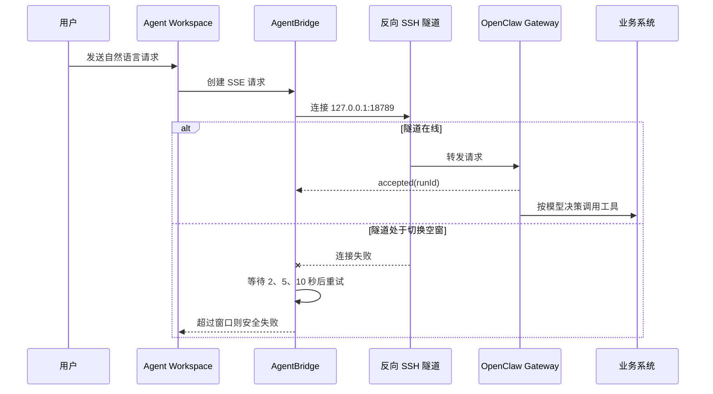
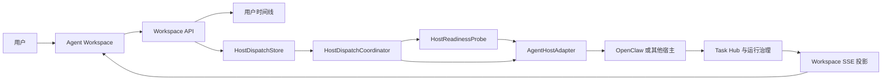
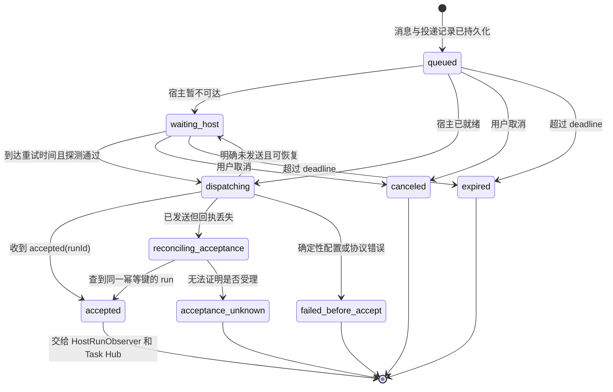
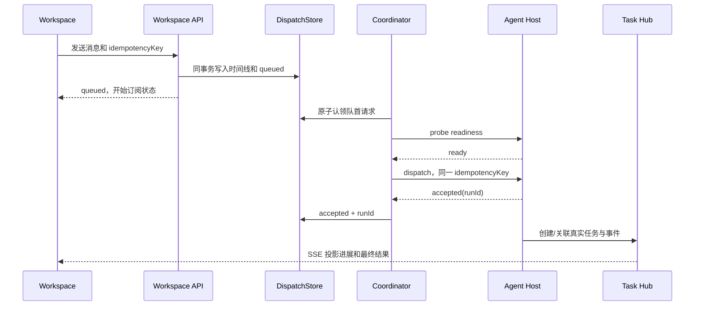

# Agent Workspace 请求受理前可靠投递详细设计

状态：设计完成，尚未实现  
设计日期：2026-08-30  
适用范围：Agent Workspace 经 AgentBridge 调用 Agent Host 的受理前链路

关联文档：

- [宿主无关化与标准远程 MCP 接入一期详细设计](./宿主无关化与标准远程协议接入一期详细设计.md)
- [运行治理与可靠性二期详细设计](./运行治理与可靠性二期详细设计.md)
- [工作台反向安全隧道](../部署运维/工作台反向安全隧道.md)
- [多端智能体任务接续设计](./多端智能体任务接续设计.md)

## 一、结论先行

当前 Agent Workspace 通过一条反向 SSH 隧道访问 Windows 工作站上的 OpenClaw Gateway。工作站
切换有线、无线、VPN 或重新联网时，旧 SSH 会话释放服务器 `127.0.0.1:18789` 与新会话重新
绑定该端口之间可能出现短暂空窗。Workspace 当前在 OpenClaw 尚未受理请求时按 `2、5、10` 秒
执行有界重试；17 秒内恢复通常可以继续，超过该窗口则安全失败，请求不进入业务系统。

本设计不以“更快重启 SSH”作为主要方案，而是在 AgentBridge 中央端增加持久化的“宿主受理等待区”：

1. 用户请求先与原始消息、附件引用和幂等键一起持久化；
2. AgentBridge 只有在宿主链路通过就绪检查后才投递；
3. 暂时不可达时保留同一请求并自动等待，不要求用户重新发送；
4. 同一请求在任何情况下最多获得一个宿主 `runId`；
5. 一旦宿主已经受理，绝不重新投递，只观察和核对原 `runId`；
6. 等待超过上限后明确说明“未进入业务系统”，不无限排队；
7. 第一阶段不引入双隧道、代理切换或 OpenClaw 中心化部署。

目标是让常见的网络切换和隧道重连对用户基本无感，同时保持现有“宁可停止，也不重复执行”
的安全底线。物理网络断开本身不能被软件消除，但可以不再让短暂断线直接变成一次用户任务失败。

## 二、问题定义

### 2.1 这里的“空窗”是什么

本文所说的“隧道租约空窗”不是 OA 登录会话、MCP Token、用户身份或 Worker 业务租约失效，
而是反向 SSH 会话对服务器回环监听端口的临时所有权中断：

```text
旧 sshd 子进程持有 127.0.0.1:18789
  -> 工作站网络变化
  -> 旧连接失效或被守护器终止
  -> 服务器释放旧监听
  -> 新 SSH 会话建立
  -> 新 sshd 子进程重新绑定 127.0.0.1:18789
```

在最后一步完成前，AgentBridge 无法通过该地址连接 OpenClaw Gateway。旧服务器进程释放端口稍慢时，
新 SSH 还会遇到 `remote port forwarding failed for listen port 18789`，随后按现行守护策略继续重连。

### 2.2 当前链路



现行机制已经正确守住两个边界：

- OpenClaw 明确受理前，只有在错误被判定为可恢复且无业务工具活动时才允许重试；
- OpenClaw 明确受理后，只能按原 `runId` 核对历史，不能再次发送用户请求。

它的不足是等待只存在于当前 HTTP/SSE 调用栈中。等待窗口耗尽、AgentBridge 重启或浏览器连接中断后，
请求没有一个独立、可恢复的受理前状态实体。

### 2.3 需要解决的用户问题

用户不应为了几秒至几十秒的切网空窗承担以下成本：

- 刷新 Workspace 后重新输入同一句话；
- 不知道刚才的请求是否已经进入 OpenClaw；
- 因重复发送而担心同一写操作执行两次；
- 页面只显示“智能体暂时不可用”，却无法自动继续；
- AgentBridge 在等待期间重启后丢失续办依据。

## 三、目标与非目标

### 3.1 本期目标

1. 在 OpenClaw 或其他 Agent Host 尚未受理前持久保存待投递请求；
2. 网络、隧道或 Gateway 在限定时间内恢复后，自动投递原请求一次；
3. 页面刷新、SSE 断开和 AgentBridge 重启不丢失等待状态；
4. 同一用户、宿主、会话内保持请求顺序；
5. 两个用户的队列、路由、消息和附件引用严格隔离；
6. 确定性配置、身份和协议错误立即失败，不伪装成网络等待；
7. 对“请求可能已送达但 accepted 回执丢失”的情况先核对，禁止盲目重发；
8. 将等待、恢复、超时和受理证据纳入运行治理、管理控制台和发布验收；
9. 不改变 Telegram、微信、Reference Host 和业务能力本身的行为。

### 3.2 本期非目标

- 不承诺物理网络绝对零中断；
- 不把 OpenClaw Gateway 暴露到公司内网；
- 不修改代理、防火墙或用户网络配置；
- 不通过降低写入安全边界换取“看起来成功”；
- 不自动重试已经到达 `B4_COMMIT_ATTEMPTED` 的业务写入；
- 不使用无限等待或无限重试；
- 不在第一阶段建设双隧道、HAProxy/Nginx 切换层或多 Gateway 集群；
- 不修改 OpenClaw 源码，继续通过宿主适配器和插件完成集成。

## 四、设计原则

### 4.1 先持久化，后投递

用户消息、附件引用、宿主路由和幂等键先形成可恢复事实，再尝试访问宿主。浏览器连接不是任务
可靠性的事实源，页面刷新不能决定请求是否仍存在。

### 4.2 就绪检查是优化，不是正确性依据

链路刚通过健康检查也可能在下一毫秒断开。因此“检查成功再发送”只能减少失败，不能替代
幂等、受理回执和不确定状态核对。

### 4.3 accepted 是不可逆分界线

`accepted(runId)` 之前处理的是“宿主投递”；之后处理的是“同一宿主运行的观察和恢复”。状态机
不得从 `accepted` 回到 `waiting_host`，也不得重新创建第二个 run。

### 4.4 未收到 accepted 不等于宿主一定未收到请求

必须区分：

- TCP/WebSocket 建连前失败，能够确定请求没有送出；
- 请求已经写入连接，但 `accepted` 回执丢失，宿主是否受理不确定。

第二种情况先按幂等键或宿主运行历史核对。无法核实时进入 `acceptance_unknown`，不得假装仍处于
安全的受理前重试区。

### 4.5 等待有界且用户可见

默认等待上限为 60 秒，可按宿主配置在 30 至 120 秒之间调整。恢复过程显示在原消息下方，
不连续追加重复提示；超时后形成明确终态。

### 4.6 不复制敏感内容

等待区只引用已经持久化的 Workspace 时间线消息和附件句柄，不再保存第二份用户原文、附件、
Token、Gateway grant、Cookie 或可信交互 URL。

### 4.7 宿主无关

反向隧道只是 OpenClaw 当前部署的连接方式。等待区属于 AgentBridge 到 Agent Host 的通用受理层，
不把 `ssh.exe`、端口号或 OpenClaw 私有字段写入核心状态模型。

## 五、目标架构



新增四个逻辑组件：

| 组件 | 职责 | 不负责的内容 |
| --- | --- | --- |
| `HostDispatchStore` | 保存受理前请求、状态、幂等键、期限和认领信息 | 不保存 Token、Cookie 和业务秘密 |
| `HostReadinessProbe` | 判断传输可达和宿主语义就绪，缓存短期结果 | 不读取任何下游业务数据 |
| `HostDispatchCoordinator` | 认领、排序、投递、退避、超时和受理交接 | 不决定业务工具和写入策略 |
| `HostRunObserver` | 受理后按原 `runId` 观察、核对和恢复结果 | 不重新发送原用户请求 |

OpenClaw 仍由 Windows 前台 Gateway 运行，SSH 隧道仍由现行守护脚本维护。新增机制位于 Linux 中心端，
不增加用户客户端安装项。

## 六、核心数据模型

### 6.1 新增 `agent_host_dispatches`

建议在 Task Hub 所在 SQLite 中新增：

| 字段 | 含义 |
| --- | --- |
| `dispatch_id` | 中央生成的投递标识 |
| `user_subject` | 不可由客户端自报覆盖的用户主体 |
| `agent_host` | 目标宿主类型或注册标识 |
| `host_binding_ref` | 已验证的宿主身份绑定引用，不含密钥 |
| `origin_endpoint_id` | 发起端 Endpoint |
| `conversation_ref` | 目标宿主会话的稳定引用 |
| `message_key` | 已写入 `user_timeline` 的用户消息键 |
| `payload_hash` | 消息和附件引用的规范化摘要，防止同键异参 |
| `idempotency_key` | 跨重试保持不变的宿主受理幂等键 |
| `state` | 当前投递状态 |
| `accepted_run_id` | 宿主确认受理后的唯一 run 标识 |
| `attempt_count` | 已发起的投递尝试次数 |
| `request_sent_at` | 请求可能已经写入宿主连接的时间 |
| `next_attempt_at` | 下次允许尝试的时间 |
| `deadline_at` | 受理前等待截止时间 |
| `claim_owner` | 当前协调器实例 |
| `claim_token` | 防止旧协调器继续写状态的 fencing token |
| `claim_expires_at` | 协调认领到期时间 |
| `last_error_code` | 最近一次分类后的错误码 |
| `created_at/updated_at` | 创建和更新时间 |
| `accepted_at/finished_at` | 受理和终止时间 |

唯一约束：

```text
UNIQUE(user_subject, agent_host, idempotency_key)
```

同一幂等键再次提交且 `payload_hash` 相同，返回原 `dispatch_id`；摘要不同则以
`IDEMPOTENCY_PAYLOAD_MISMATCH` 拒绝，不能覆盖旧请求。

### 6.2 是否直接创建 AgentTask

受理前不创建虚假的 `agent_tasks` 记录，因为宿主尚未产生 `host_task_key` 或 `runId`。等待请求使用
独立 `dispatch_id`；宿主受理并创建真实 Task 后，通过以下关系关联：

```text
dispatch_id -> accepted_run_id -> host_task_key -> task_id
```

这样管理端不会把“等待宿主连接”误显示成正在办理的业务任务，也不会再次出现没有真实业务活动的
空任务长期挂起。

### 6.3 消息与附件

- 用户原文继续保存在现有 `user_timeline`；
- `agent_host_dispatches.message_key` 只引用该条消息；
- 图片和文件继续使用现有 `timeline_attachments` 句柄；
- 投递前重新校验用户主体、附件状态和 `payload_hash`；
- 等待截止时间不得超过附件可用期；附件已失效时请求终止，不发送不完整内容。

### 6.4 投递事件

建议新增低敏事件，不保存模型思考、完整工具参数或凭据：

- `host_dispatch_created`
- `host_waiting`
- `host_dispatch_attempted`
- `host_acceptance_reconciling`
- `host_accepted`
- `host_accept_timeout`
- `host_acceptance_unknown`
- `host_dispatch_canceled`

事件携带 `dispatch_id`、宿主、尝试次数、错误分类、阶段和时间，不携带用户正文。

## 七、状态机



状态语义：

| 状态 | 是否可能已进入宿主 | 是否允许自动再次投递 | 用户看到的语义 |
| --- | --- | --- | --- |
| `queued` | 否 | 是 | 请求已保存 |
| `waiting_host` | 否 | 是 | 正在恢复智能体连接 |
| `dispatching` | 取决于发送阶段 | 仅由分类结果决定 | 正在交给智能体 |
| `reconciling_acceptance` | 可能 | 否，先核对 | 正在确认智能体是否已接收 |
| `accepted` | 是 | 否 | 智能体已开始处理 |
| `expired` | 否 | 否 | 等待超时，未进入业务系统 |
| `failed_before_accept` | 否 | 否 | 配置、身份或协议错误 |
| `acceptance_unknown` | 可能 | 否 | 无法确认是否受理，已停止重发 |
| `canceled` | 否 | 否 | 已取消等待 |

`accepted` 后的模型运行、工具调用、可信卡片、业务提交和结果回读继续使用现有 Task、Operation、
Interaction 和运行治理状态，不在本状态机中重复建模。

## 八、正常流程



提交 API 不再依赖一个长时间不间断的浏览器连接。原 SSE 仍用于实时体验，但 SSE 中断后，页面可从
中央状态重新订阅同一 `dispatch_id`，不能据此重新创建请求。

## 九、空窗恢复流程

1. API 先持久化请求并立即尝试一次；
2. 快速传输检查失败时转为 `waiting_host`；
3. 队列非空期间，协调器以有界退避检查宿主；
4. 传输可达后再做一次语义级 `system.info` 或宿主契约等价探测；
5. 探测通过后原子认领队首，签发新的短期 binding grant；
6. 使用原幂等键投递；
7. 收到 `accepted(runId)` 后立刻永久关闭该记录的再投递资格；
8. 页面将原“正在恢复连接”状态更新为“智能体已开始处理”，不新增重复气泡。

建议退避节奏为：

```text
立即、1、2、3、5、8、10、10、10... 秒，并加入少量随机抖动
```

默认 60 秒截止。此窗口覆盖现行网卡 2 秒检测、最多约 20 秒 OpenSSH 静默断线确认以及旧远端监听
释放后的 5 秒重连周期，同时避免请求在用户不知情时长时间滞留。

## 十、就绪探测

### 10.1 两层探测

1. **传输可达**：服务器本地快速连接宿主入口，确认监听存在；
2. **语义就绪**：调用宿主只读控制面，例如 OpenClaw `system.info`，确认 Gateway 已完成启动。

只通过第一层不能直接投递，因为 SSH 监听存在时本机 Gateway 仍可能尚未启动。第二层不读取 OA、
泰华、语雀或照明系统，不触发模型运行，也不创建 Task。

### 10.2 结果缓存

同一宿主的语义就绪结果可缓存 2 秒，供同一时刻的多个等待请求共享，避免每个用户都启动一遍
Gateway 客户端探测。实际投递失败仍回到错误分类，缓存不能覆盖真实失败。

### 10.3 不依赖 Windows 状态文件

Linux 中心端不读取 `%LOCALAPPDATA%` 下的隧道状态文件。该文件继续服务本机运维；中央端只相信
自己能够观测到的传输和宿主协议结果，避免两台机器状态时间不同步。

## 十一、顺序、并发与多用户隔离

### 11.1 会话内顺序

协调器按以下键维持队首顺序：

```text
user_subject + agent_host + conversation_ref
```

同一会话的第二条消息必须等第一条获得 `accepted` 或进入终态后才能投递，避免“上面那条”“继续”
等上下文表达次序颠倒。不同用户、不同会话可以并行。

### 11.2 防止重复执行

- API 双击和网络重发复用同一 `dispatch_id`；
- 多协调器通过原子认领、短租约和 fencing token 保证只有当前持有者能更新；
- 协调器进程崩溃后，过期记录先按 `request_sent_at` 判断是否需要核对；
- 宿主适配器必须支持用幂等键查找既有 run，或明确声明不支持；
- 不支持受理幂等核对的宿主，只能自动重试明确发生在发送前的失败。

### 11.3 用户隔离

每次取消息、附件、身份绑定、宿主会话和受理历史都同时校验 `user_subject`。仅凭 `dispatch_id`、
`runId` 或客户端传来的用户名字不能跨主体查询。管理端只显示必要摘要，不显示用户正文。

## 十二、错误分类和处置

| 错误 | 示例 | 是否等待 | 处置 |
| --- | --- | --- | --- |
| `HOST_TRANSPORT_UNAVAILABLE` | 端口未监听、连接拒绝 | 是 | 转 `waiting_host` |
| `HOST_NOT_READY` | Gateway 正在冷启动 | 是 | 转 `waiting_host` |
| `HOST_ACCEPT_TIMEOUT` | 截止前始终未恢复 | 否 | `expired`，确认未进入业务系统 |
| `HOST_ACCEPTANCE_UNKNOWN` | 请求可能发出但无回执且核对失败 | 否 | 停止重发，进入异常中心 |
| `HOST_BINDING_REJECTED` | 身份绑定或 grant 无效 | 否 | 明确失败，不伪装成断网 |
| `HOST_PROTOCOL_INVALID` | 返回结构不符合契约 | 否 | 明确失败并告警 |
| `IDEMPOTENCY_PAYLOAD_MISMATCH` | 同键不同消息或附件 | 否 | 拒绝覆盖原请求 |
| `HOST_DISPATCH_CANCELED` | 用户取消等待 | 否 | 保留审计，不投递 |

只有能够证明处于 `B0_NO_EFFECT` 的错误才进入自动等待。`acceptance_unknown` 不能标记为
“未进入业务系统”，因为宿主运行可能已经开始。

## 十三、与副作用边界的关系

| 阶段 | 副作用边界 | 自动动作 |
| --- | --- | --- |
| 请求已持久化、尚未投递 | `B0_NO_EFFECT` | 允许有界等待和再次尝试 |
| 宿主是否受理不确定 | 边界待核对 | 只核对，不再次投递 |
| 宿主已 accepted、未调用工具 | 仍按同一 run 观察 | 不重新创建 run |
| 只读工具执行中 | `B1_READ_ONLY` | 服从既有只读恢复策略 |
| 已创建可信交互 | `B2_INTERACTION_CREATED` | 恢复同一 Interaction |
| 已准备和授权 | `B3_PREPARED_AUTHORIZED` | 服从现有一次性授权状态机 |
| 已尝试业务提交 | `B4_COMMIT_ATTEMPTED` | 禁止自动重试，必要时人工核对 |
| 权威回读完成 | `B5_VERIFIED` | 发布确定终态 |

本文只新增第一行的可靠性机制，不扩大其他阶段的自动恢复权限。

## 十四、用户体验

### 14.1 Workspace

原用户消息立即保留。其下方使用一个稳定状态区域更新：

| 状态 | 建议显示 |
| --- | --- |
| `queued` | “请求已保存，正在连接智能体。” |
| `waiting_host` | “智能体连接正在恢复，恢复后会自动继续。” |
| `dispatching` | “正在交给智能体处理。” |
| `accepted` | 切换为正常流式进展，不再显示连接提示 |
| `expired` | “连接暂未恢复，本次请求未进入业务系统，请稍后重试。” |
| `acceptance_unknown` | “无法确认智能体是否已接收，已停止重发，请等待系统核对。” |
| `canceled` | “已取消等待，请求未进入业务系统。” |

不得每次退避都追加一条聊天消息，也不向用户显示 SSH、端口、Node 进程或内部错误堆栈。

等待状态提供“取消本次请求”操作。取消只对 `queued` 和 `waiting_host` 有效；进入 `dispatching` 后先
完成受理核对，不能用取消按钮掩盖不确定状态。

### 14.2 多端同步

- 原用户消息继续按现行用户时间线同步；
- “正在恢复连接”属于短暂传输状态，默认只在发起端展示，避免 Telegram 和微信收到多条噪声；
- `accepted` 后的业务文本、卡片、文件和终态继续按现行多端规则同步；
- `expired`、`acceptance_unknown` 等需要用户采取行动的终态写入共享时间线；
- 其他端不能使用同一消息重新创建第二个 dispatch。

### 14.3 页面刷新和服务重启

页面加载时按 `dispatch_id` 恢复等待状态。AgentBridge 重启后协调器扫描未终态记录：

- 从未发送过的继续等待；
- 已记录 `request_sent_at` 但没有 `accepted_run_id` 的先进入受理核对；
- 已 accepted 的交给原 run 恢复，不重新排队。

## 十五、管理控制台与可观测性

### 15.1 新增视图

管理控制台的运行治理页增加“宿主受理等待”摘要：

- 当前队列深度；
- 最老等待时长；
- 各宿主等待、受理、超时和不确定数量；
- 最近一次宿主就绪时间；
- `dispatch_id -> runId -> taskId -> traceId` 关联；
- 每条记录的尝试次数、截止时间和最近错误分类。

管理员可以执行：

- 只读探测宿主就绪状态；
- 取消仍处于 `queued/waiting_host` 的请求并填写原因；
- 查看 `acceptance_unknown` 的核对证据。

管理端不提供“强制重新发送已 accepted 或 acceptance_unknown 请求”的按钮。

### 15.2 Trace 与恢复账本

建议增加阶段：

```text
workspace.request.persist
host.accept.wait
host.readiness.probe
host.dispatch
host.accept.reconcile
host.accepted
```

每次从 `waiting_host` 恢复并成功受理，记录一个
`workspace_host_pre_accept_recovery` RecoveryAction，副作用边界固定为 `B0_NO_EFFECT`。普通探测轮询
不逐条创建 RecoveryAction，避免治理数据膨胀。

### 15.3 指标

- `host_accept_queue_depth`
- `host_accept_wait_seconds`
- `host_accept_recovery_total`
- `host_accept_timeout_total`
- `host_acceptance_unknown_total`
- `host_accept_duplicate_violation_total`
- `host_accept_post_accept_redispatch_violation_total`
- 按宿主、入口类型和用户匿名分桶的受理成功率

两项 violation 指标必须始终为 0。正式时延 SLO 需先经过观察窗口，不在设计发布当天拍脑袋确定。

## 十六、容量与保护

初始建议：

- 每个用户每个会话最多 3 条未受理请求；
- 每个用户全部会话最多 10 条；
- 全局上限按试点规模配置，超过时返回明确限流，不丢弃旧请求；
- 同一会话只投递队首，其他记录不反复探测；
- 队列为空时不做高频探测；
- 队列非空时共享宿主健康结果，避免为每条请求启动独立 Node 客户端；
- 进程退出时不等待无限收尾，持久状态由下一个协调器恢复。

## 十七、安全分析

| 风险 | 控制 |
| --- | --- |
| 同一请求被两个协调器投递 | 原子认领、租约、fencing token、唯一幂等键 |
| 用户换端后重复发送 | 时间线 message key 和幂等键复用 |
| 同键替换内容 | `payload_hash` 不一致立即拒绝 |
| 等待期间身份绑定变化 | 每次投递前重新解析并校验绑定，不缓存旧 grant |
| 附件被替换或过期 | 校验附件主体、哈希和状态 |
| accepted 回执丢失后重发 | 进入 `reconciling_acceptance`，先按幂等键核对 |
| 队列泄露用户内容 | 队列表只保存引用和摘要，不复制正文与凭据 |
| 攻击者制造无限积压 | 用户、会话和全局配额，固定截止时间 |
| 管理员误操作 | 只允许取消 B0 请求，不提供危险的强制重发 |

## 十八、备选方案比较

### 18.1 仅把 `2、5、10` 延长为 60 秒

优点是改动小。缺点是仍依赖当前 SSE 请求线程，页面断开或服务重启后无法恢复，且长时间占用连接。
可以作为临时缓冲，不作为最终实现。

### 18.2 只调整 SSH 保活或改用 autossh

能够更快发现部分断线，但不能消除旧远端监听释放和新监听绑定之间的竞争，也不能解决请求持久化、
幂等受理和页面刷新。因此只能作为隧道守护优化。

### 18.3 双端口隧道加稳定代理

可让新隧道先绑定备用端口，健康检查通过后由服务器代理原子切换，再关闭旧隧道。这是
make-before-break 路线，能够显著缩短端口交接空窗，但需要双槽位、健康检查、代理配置、旧连接清理
和 split-brain 防护。

它不能覆盖工作站完全断网的时间，因此即使后续实施，也仍应保留本设计的受理等待区。

### 18.4 将 OpenClaw Gateway 移到中心服务器

可以取消当前工作站隧道依赖，但会改变用户可见前台 Gateway、插件运行环境、本机渠道、凭据边界和
运维拓扑，属于宿主部署迁移，不作为本问题的短期修复。

### 18.5 本期决策

先实现持久受理等待区和就绪门控。上线观察后，仅当仍存在明显的网络层空窗或受理等待 P95 超出
目标，再单独设计双端口切换，不提前增加代理层。

## 十九、实施工作包

### 工作包 A：持久状态与迁移

- 新增 `agent_host_dispatches` 和索引；
- 在同一可靠边界内保存时间线消息与 dispatch；
- 实现状态转换、唯一幂等和摘要校验；
- 将表纳入备份完整性、保留和跨用户一致性检查。

### 工作包 B：宿主受理协调器

- 实现原子认领、会话队首、租约和 fencing；
- 实现共享就绪探测、退避、截止和取消；
- 每次尝试签发新 binding grant，不持久化 grant；
- 对接 OpenClaw 适配器，并保留 Reference Host 契约入口。

### 工作包 C：受理核对

- 为宿主适配器补充按幂等键查询既有 run 的能力声明；
- 区分“发送前失败”和“发送后回执丢失”；
- 复用现有受理后 history 核对；
- 任何无法证明安全的情况进入 `acceptance_unknown`。

### 工作包 D：Workspace 体验

- API 返回 `dispatch_id`；
- SSE 从中央状态恢复，不因浏览器刷新创建新请求；
- 使用单一状态区域显示等待、受理、超时和取消；
- 保持原消息、图片、文件和最终文本的跨端顺序。

### 工作包 E：治理、测试和发布

- 增加 Trace、Signal、RecoveryAction 和控制台摘要；
- 增加自动化故障注入矩阵；
- 更新运维手册、当前状态和发布检查；
- 先以功能开关灰度，验证后再替换现行 17 秒进程内重试。

## 二十、测试与验收

### 20.1 单元测试

1. 同一幂等键同一内容复用原 dispatch；
2. 同一幂等键不同内容被拒绝；
3. 状态转换不能从 accepted 回到 waiting；
4. 过期认领只有新 fencing token 可以更新；
5. 同一会话只认领队首；
6. 不同用户可以并行且不能互查；
7. 确定性身份错误不进入等待；
8. 附件过期或主体不一致时不投递；
9. 取消后协调器不能再认领；
10. 备份和隔离恢复包含新表且跨用户违规为 0。

### 20.2 集成故障矩阵

| 场景 | 预期结果 |
| --- | --- |
| 投递前隧道断开，5 秒后恢复 | 自动受理一次，一个 run |
| 投递前隧道断开，40 秒后恢复 | 自动受理一次，一个 run |
| 隧道超过 60 秒未恢复 | `expired`，OpenClaw 无 run，业务调用为 0 |
| 旧端口占用导致连续绑定失败 | 请求保持 waiting，释放后受理一次 |
| Gateway 监听存在但仍在冷启动 | 语义探测不通过，不提前投递 |
| AgentBridge 在 waiting 时重启 | 重启后继续同一 dispatch |
| 浏览器 SSE 断开并刷新 | 恢复原状态，不创建第二条请求 |
| 请求已发送但 accepted 回执丢失 | 先查幂等 run，不盲目重发 |
| accepted 后立即切断隧道 | 只核对同一 run，工具调用不重复 |
| 两用户同时等待并恢复 | 两个独立 run，主体和结果不串 |
| 同一会话连续发送两条 | 按原顺序受理 |
| 用户在 waiting 时取消 | 不创建 run，业务调用为 0 |

### 20.3 真实验收边界

真实环境先使用无业务工具模型回显和 OA 只读待办查询，不以真实写入制造故障。受理前断线可以通过
受控终止当前隧道 SSH 子进程测试；受理后断线沿用现有同 run 核对验收。真实写能力只验证正常链路，
故障边界由模拟适配器证明。

验收至少检查：

- OpenClaw 历史中只有一个 run；
- AgentBridge 只有一个 `dispatch_id` 和一个 `accepted_run_id`；
- 业务工具调用次数符合预期，写调用绝不重复；
- 页面刷新前后消息、状态和最终结果连续；
- 管理端能够从 dispatch 追到 run、Task 和 Trace；
- 失败文案能够准确区分“未进入业务系统”和“是否受理不确定”。

## 二十一、灰度与回滚

建议使用 `WORKSPACE_HOST_DISPATCH_QUEUE_ENABLED` 功能开关：

1. **影子记录**：仍走现行路径，只记录本应形成的状态和错误分类；
2. **第一用户只读**：对一个 Workspace 的只读请求启用持久等待；
3. **双用户只读**：验证并发、顺序和身份隔离；
4. **受控写入口**：只覆盖 OpenClaw 受理前，业务写治理保持不变；
5. **默认启用**：数据稳定后移除旧的独立 17 秒重试分支，避免双层重试。

回滚只关闭新请求进入等待区。已存在记录仍由旧版本兼容清理器按状态完成、取消或过期，不能直接
删除。回滚不得把 `accepted` 或 `acceptance_unknown` 记录重新投递。

## 二十二、完成标准

本设计实现完成必须同时满足：

1. 受理前断线 60 秒窗口内恢复时，用户无需重新发送；
2. AgentBridge 和页面重启后仍能恢复同一等待请求；
3. 超时请求有证据证明 OpenClaw 未创建 run、业务调用为 0；
4. accepted 后断线始终沿用同一 run，不重新投递；
5. 回执丢失场景能够核对或进入 `acceptance_unknown`，不猜测；
6. 双击、刷新、多端同步和协调器重启均不产生第二个 run；
7. 两用户并发的主体、会话、消息、附件、run、Task 和 Trace 隔离违规为 0；
8. 确定性配置和身份错误不被错误地等待 60 秒；
9. 管理端能解释请求在何处等待、是否可能产生副作用和下一步动作；
10. 自动测试、故障注入、文档检查、发布验收和真实只读验收通过；
11. 不修改 OpenClaw 源码，不恢复旧浏览器桥，不扩大 Gateway 网络暴露；
12. 项目当前状态在真正上线后再更新为“已实现”，设计完成本身不冒充上线完成。

## 二十三、后续增强触发条件

只有满足以下任一条件，才进入“双端口隧道加稳定代理”设计：

- 等待区上线后，受理等待 P95 长期超过目标；
- `HOST_ACCEPT_TIMEOUT` 主要由远端端口释放竞争造成，而不是实际断网；
- 同一 OpenClaw Gateway 需要为多个中心服务提供高可用入口；
- 用户规模和任务并发使单隧道成为明确容量瓶颈；
- 运维能够承担代理、双槽位、健康检查和 split-brain 防护的长期维护。

在此之前，持久等待区是投入更小、收益更直接且不改变现有部署拓扑的优先方案。
