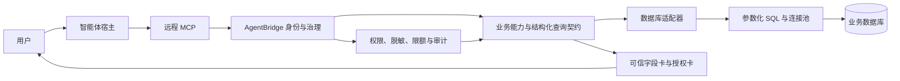

# 开放数据库业务能力接入设计

> 文档状态：规划基线
>
> 更新日期：2026-08-25
>
> 适用范围：AgentBridge 直接连接一个经过授权、网络可达的业务数据库，并将其封装为智能体可调用的业务能力

## 1. 文档目的

本文定义 AgentBridge 对接开放业务数据库时的能力边界、查询契约、身份与数据权限、受控写入方式、
实施步骤和验收标准。当前尚未选择具体数据库，因此本文只形成可复用的接入基线，不代表已经接入
第五个业务系统，也不授权访问任何现有数据库。

这里的“开放数据库”是指数据库所有者明确允许 AgentBridge 连接，并提供了合法的网络、账号、权限
和业务使用范围。它不等于公网匿名数据库，也不意味着智能体可以任意执行 SQL。

## 2. 核心结论

数据库天然提供表、字段、关系和 SQL，但 AgentBridge 对智能体开放的主要单位仍应是业务对象与业务
动作，而不是底层数据库操作。

例如，用户提出：

> 查询今年济南地区合同金额最高的十个项目。

智能体适合调用 `project.contract.rank` 或受控的 `database.aggregate.query`，而不是获得通用
`execute_sql` 后自行拼接 SQL。数据库表结构、连接池、方言、索引和 SQL 生成属于适配器内部实现。

采用该边界有四个原因：

1. 数据库表结构变化时，只调整适配器和映射，不让全部智能体提示词一起失效；
2. 行级权限、字段脱敏和租户条件必须由运行时强制执行，不能依赖模型记住；
3. 参数化查询、超时、行数限制和审计比任意 SQL 更容易验证；
4. 写入必须表达真实业务影响，不能把 `INSERT`、`UPDATE`、`DELETE` 当作普通工具。

## 3. 信任边界



信任边界要求：

- 智能体宿主只看到已发布的业务工具及其结构化结果；
- 数据库连接串、密码、证书、原始 SQL、执行计划和内部表名默认不进入模型上下文；
- `userSubject`、客户端端点和 MCP Token 先在 AgentBridge 完成身份解析，再进入数据权限判断；
- 数据库账号拥有的权限只是上限，AgentBridge 还必须实施更细的业务策略；
- 读取结果和写入影响都进入任务、操作账本和运行治理事件。

## 4. 能力分层

### 4.1 数据目录与语义发现

这组能力帮助智能体知道“有哪些业务数据可以用”，但不暴露整个数据库的技术细节。

| 建议能力 | 用途 | 对外结果 |
| --- | --- | --- |
| `database.session.status` | 检查数据库连接和授权状态 | 可用性、数据源名称、检查时间、安全错误码 |
| `database.dataset.catalog` | 列出已批准的数据集 | 业务名称、说明、允许操作、更新时间语义 |
| `database.dataset.schema` | 查看一个数据集的业务字段 | 字段名称、类型、含义、是否可筛选/排序/聚合 |
| `database.dictionary.search` | 搜索指标、字段和业务术语 | 术语、定义、口径、关联数据集 |

数据目录应来自人工审核后的映射配置。数据库反射可以帮助生成候选清单，但不能自动把新表或新字段
发布给智能体。

### 4.2 业务读取能力

稳定、高频和有明确口径的需求，应发布为业务语义工具，例如：

- `project.search`：按地区、状态、负责人和时间查询项目；
- `project.detail`：按稳定业务 ID 读取项目详情；
- `contract.rank`：按时间、区域和金额生成合同排名；
- `payment.progress.summary`：统计应收、已收和逾期情况；
- `device.alarm.trend`：统计设备告警趋势。

具体名称应在选定数据库、确认业务对象后再决定。工具输出应使用稳定的业务字段名，并包含必要的
统计口径、查询范围、截断说明和数据时间。

### 4.3 受控通用查询能力

数据库接入初期，业务工具尚未完全固化时，可以先发布一组结构化通用读取工具：

| 建议能力 | 说明 |
| --- | --- |
| `database.record.search` | 在一个批准的数据集中筛选、排序和分页 |
| `database.record.get` | 按稳定主键或业务键读取一条记录 |
| `database.aggregate.query` | 分组、计数、求和、平均、最值、趋势和排名 |
| `database.relation.expand` | 沿已批准的业务关系读取关联对象 |
| `database.report.export` | 将当前受控查询导出为 CSV 或 XLSX |

通用查询工具接受结构化参数，而不是 SQL 字符串。示例：

```json
{
  "dataset": "contracts",
  "filters": [
    {"field": "region", "operator": "eq", "value": "济南"},
    {"field": "signed_year", "operator": "eq", "value": 2026}
  ],
  "fields": ["project_name", "contract_amount"],
  "sort": [{"field": "contract_amount", "direction": "desc"}],
  "limit": 10
}
```

适配器把它编译为参数化 SQL，并强制叠加用户数据范围、字段白名单和资源限制。

### 4.4 受控写入能力

数据库允许写入时，应按业务事项发布工具，例如“登记回款”“修改项目状态”“更新设备备注”，而不是
发布通用数据库增删改工具。继续遵循 AgentBridge 已有写入模型：

```text
业务准备
-> 字段填写与核对
-> 冻结写入计划和影响范围
-> 独立授权
-> 参数化事务提交
-> 按主键或业务状态权威回读
```

写入能力必须具备：

- 稳定的业务目标 ID，禁止只靠名称或模糊条件写入；
- 乐观并发条件或版本字段，避免覆盖他人的新修改；
- 幂等键，避免宿主超时或网络恢复造成重复提交；
- 事务边界和失败回滚；
- 写前影响预览，批量操作显示数量和代表性样例；
- 写后权威回读，不能仅凭 SQL 返回的影响行数声明业务成功；
- 结果未知时停止，不自动重放真实写入。

删除操作优先映射为业务作废或软删除。物理删除、无条件批量更新、数据库结构修改和权限修改默认不
进入智能体能力目录。

### 4.5 内部原子能力

以下能力可以存在于数据库适配器内部，但默认不向普通智能体发布：

- 建立连接、事务提交与回滚；
- SQL 方言转换和参数绑定；
- 表、索引、外键和执行计划探测；
- 游标、分页令牌和连接池管理；
- 原始 SQL 执行；
- 数据库迁移、备份、恢复和账号管理。

它们是实现机制，不是用户要完成的业务事项。

## 5. 结构化查询契约

### 5.1 允许的筛选

每个字段显式声明可用操作符，候选范围包括：

- `eq`、`ne`：等于、不等于；
- `in`：批准数量内的集合匹配；
- `gt`、`gte`、`lt`、`lte`：数值或时间比较；
- `between`：闭合时间或数值范围；
- `contains`、`prefix`：仅对允许检索的文本字段开放；
- `is_null`：空值判断。

禁止把字段名、排序表达式、函数名或表名作为未经校验的自由文本拼入 SQL。

### 5.2 投影、排序与分页

- 返回字段必须属于数据集白名单；
- 默认只返回完成当前任务需要的字段；
- 排序字段和方向必须经过枚举校验；
- 使用稳定排序键，避免翻页重复或漏项；
- 默认返回较小结果集，配置最大行数和最大导出行数；
- 大结果使用服务端分页或异步报告任务，不把全部记录塞入模型上下文。

### 5.3 聚合与关系

- 指标、维度和聚合函数由数据集契约预先声明；
- 金额、人数、设备数等指标必须附带统计口径；
- 关联查询只沿批准的业务关系进行，不允许模型任意指定 JOIN；
- 跨数据域组合需通过专门视图或组合能力，避免权限条件在 JOIN 中被绕过；
- 时间范围、时区、数据更新时间和缺失值语义必须随结果返回。

## 6. 身份与数据权限

### 6.1 数据库具有原生用户身份

如果数据库支持并允许按最终用户或业务角色授权，可将 `userSubject` 映射到独立数据库主体或受限
角色。AgentBridge 必须核验映射关系，并保持连接池不跨身份复用。

### 6.2 数据库只提供服务账号

若数据库只允许 AgentBridge 使用一个服务账号，则需要明确区分：

- **下游连接主体**：数据库服务账号；
- **实际业务操作者**：AgentBridge `userSubject`；
- **有效数据权限**：AgentBridge 根据用户、部门、租户和业务角色强制加入的行列策略。

服务账号权限不能直接等价为所有用户权限。所有查询和写入审计都要记录实际业务操作者、客户端、
任务和能力名称。

### 6.3 最低强制控制

- 数据库账号使用最小权限，读取一期优先只读账号；
- 按数据集设置用户、部门、组织或租户范围；
- 敏感字段采用不返回、脱敏返回或需要额外授权三种策略；
- 禁止通过排序、聚合、报错或导出绕过字段与行级限制；
- 多用户测试必须证明相同请求得到各自权限范围内的结果；
- 凭据进入中心密钥管理，不进入仓库、提示词、日志或可信卡片结果。

## 7. 专家级只读 SQL

一期默认不发布自由 SQL。若后续确有数据分析专家场景，可以增加单独权限保护的专家工具，但至少
满足：

- 独立 scope，不随普通读取权限自动授予；
- 只允许单条 `SELECT` 或只读 CTE；
- 使用 SQL 解析器检查语法树，而不是正则表达式判断；
- 只允许批准的 schema、视图、字段和函数；
- 禁止 DDL、DML、存储过程、文件访问、网络访问、锁表和延时函数；
- 强制语句超时、扫描量限制、返回行数限制和只读事务；
- 自动附加用户数据范围，或只允许查询已经实施行级安全的受控视图；
- 原始 SQL、调用者、耗时、返回量和拒绝原因进入审计，但敏感参数按策略脱敏。

专家 SQL 是受控补充，不应取代稳定的业务能力。

## 8. 适配器实现建议

数据库适配器继续复用 `CapabilitySpec`、中央能力服务、MCP、可信交互、任务、操作账本和运行治理，
不建立一套平行平台。建议内部划分：

1. **连接层**：数据库驱动、TLS、连接池、只读事务和超时；
2. **元数据层**：批准的数据集、字段、关系、指标和权限映射；
3. **查询编译层**：将结构化契约编译为参数化 SQL；
4. **结果归一层**：类型、时间、金额、空值、分页和来源说明；
5. **业务能力层**：稳定业务工具和必要的跨表组合；
6. **写入执行层**：准备、授权、事务提交、幂等和权威回读。

实现时优先使用成熟的数据库驱动和结构化 SQL API。只有专家 SQL 场景才需要引入独立 SQL 解析器；
不能使用字符串拼接代替参数绑定和语法树校验。

## 9. 一期建议范围

第一个真实数据库试点建议只做一个业务域的完整读取包，而不是一次发布全库：

1. 数据库连接状态；
2. 经审核的数据集目录和数据字典；
3. 一个核心业务对象的搜索与详情；
4. 一项真实的统计、趋势或排名；
5. 一条批准的关联查询；
6. 查询结果导出；
7. 用户、部门或租户隔离；
8. 审计、超时、行数限制、脱敏和错误语义。

一期不包含自由 SQL、通用 CRUD、数据库管理、自动发布新表，也不默认开放写权限。读取验收稳定后，
再选择一个影响可控、结果可权威回读的业务事项做写入样板。

## 10. 获取真实数据库后的实施步骤

### 第一步：确认授权和边界

数据库所有者需确认：

- 数据库产品、版本、网络位置和 TLS 要求；
- 测试、生产环境以及可使用的账号；
- 可访问的 schema、表、视图和数据规模；
- 是否包含个人信息、商业秘密或其他敏感数据；
- 最终用户的数据权限来源；
- 允许的读取、导出和写入范围；
- 业务负责人、数据库负责人和验收人。

### 第二步：只读盘点

使用最低权限账号读取元数据，形成候选数据集、主键、业务键、关系、数据量和更新时间语义。盘点
结果先由人审核，不自动发布能力，也不把样例敏感数据写入文档。

### 第三步：选择业务问题

优先选择高频、口径明确、人工可核对的问题，例如项目搜索、合同排名、设备统计或经营趋势。围绕
真实问题设计业务工具，避免从表结构反推一批无人使用的通用命令。

### 第四步：开发读取一期

建立数据集契约、权限策略、结构化查询编译、结果归一和导出能力，并接入现有 MCP、Workspace、
Telegram、微信、任务和审计链路。

### 第五步：真实验收

用数据库管理工具或现有业务页面进行人工核对，证明结果、权限、口径和性能符合预期。验收通过后
再决定是否进入受控写入。

## 11. 验收标准

### 11.1 功能

- 数据集、字段和业务术语与批准清单一致；
- 搜索、详情、统计、关联和导出结果可由权威来源核对；
- 时间、金额、空值、分页和排序语义明确；
- 无结果、结果过多、参数错误和下游不可用均返回稳定错误语义。

### 11.2 安全

- 未发布的表、字段和关系不可访问；
- SQL 注入、越权字段、越权排序和超大分页被拒绝；
- 两个用户的数据范围相互隔离；
- 敏感字段在对话、卡片、文件、日志和审计中遵循同一策略；
- 数据库凭据和连接信息不进入模型上下文；
- 读取 Token 无法调用任何写能力。

### 11.3 性能与可靠性

- 查询具有明确超时、最大返回行数和最大导出量；
- 慢查询不会无限占用连接和 AgentBridge Worker；
- 客户端超时不会造成后台失控查询；
- 导出采用受控文件交付并保留任务状态；
- 数据库暂时不可用时不把连接错误误报为“没有数据”。

### 11.4 写入附加标准

- 字段卡、授权卡和提交计划相互绑定；
- 授权前数据库无副作用；
- 并发修改能够被版本条件检测；
- 重复请求不会产生重复写入；
- 成功必须有权威回读；
- 失败或结果未知时不会自动重试真实提交。

## 12. 后续决策清单

拿到候选数据库后，至少需要回答以下问题，才能开始真实适配：

1. 它服务于哪个业务系统和哪些高频问题？
2. AgentBridge 获得的是只读账号、服务账号还是可代理的用户身份？
3. 用户、部门和租户权限从哪里取得？
4. 哪些表或视图是权威数据源，哪些只是缓存、中间表或历史表？
5. 主键、业务键、软删除、版本字段和更新时间分别是什么？
6. 哪些字段敏感，是否允许在智能体、文件和审计中出现？
7. 单表规模、典型过滤条件、索引和允许的查询时限是什么？
8. 是否允许导出，允许的格式、数量和文件有效期是什么？
9. 是否需要写入；若需要，哪个业务事项最适合作为首个可撤销或可回读样板？
10. 使用什么权威页面、报表或数据库查询完成真实结果核对？

上述信息明确后，再为具体业务系统建立 `docs/系统适配/<系统名称>/`，形成系统边界、数据集映射、
能力矩阵、权限策略、错误语义和真实验收方案。
