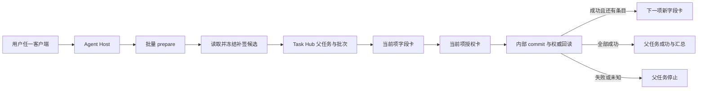

# 批量受控任务编排设计

## 一、文档状态

- 状态：一期已实现，待真实多条补签业务验收；
- 首个范围：一次处理当前用户待办中的全部补签申请单；
- 对外工具：`oa_missed_punch_approval_batch_prepare`；
- 默认策略：`stop_on_failure`，最多冻结 10 条；
- 依赖：[受控写入模型](./受控写入模型.md)、[多端智能体任务接续设计](./多端智能体任务接续设计.md)。

一期实现的是一个可持久化的同质批量任务，不是让模型在一次回答中循环调用若干单项工具。每个补签事项仍
独立填写、独立授权、独立提交和独立回读；AgentBridge 只负责冻结候选、保存当前位置并在当前项权威成功后
自动产生下一张卡。

## 二、问题与目标

原来用户说“处理所有补签申请单”时，模型虽然能读到多条候选，却只调用一次单项
`oa_missed_punch_approval_prepare`。第一条结束后，系统没有“还有哪几条”的持久记录，只能等用户再说
“继续”。

一期目标：

1. 一个用户意图只建立一个父 `AgentTask`；
2. 候选由 AgentBridge 根据当前登录主体读取并一次冻结；
3. 每条事项继续走 `prepare -> authorize -> commit -> verify`；
4. 当前条权威成功后直接返回下一张卡，不要求用户再发消息；
5. 重复回调、多端同时轮询和进程重启不能造成跳项或重复提交；
6. 明确失败、拒绝、过期和 `outcome_unknown` 均保守停止；
7. Workspace、Telegram、微信和管理端看到同一个父任务及其进度。

一期不做：

- 不把不同流程混在同一批次；
- 不允许模型传入任意 `affair_id` 列表；
- 不提供“一次授权全部通过”；
- 不自动跳过失败项，也不自动回滚成功项；
- 不建设通用工作流引擎；
- 不向模型公开单项 commit 或通用批量推进接口。

## 三、总体结构



新增部分位于中心端：

- `TaskHubStore` 保存批次和条目；
- `CentralCapabilityService` 冻结候选并推进状态机；
- 协同办公适配器负责补签筛选、排序和卡片摘要；
- 现有 `interaction_resume` 在当前项成功后返回下一张卡；
- OpenClaw 继续使用已有可信交互轮询和多端投递，不新增私有推进工具。

这一选择比单独增加 `agentbridge_host_batch_advance` 更简单：身份、任务、幂等和卡片续办都沿用已经验证的
协议链，Agent Host 不持有新的编排权限，模型也不参与条目之间的推进。

## 四、领域模型

### 4.1 父任务

父任务继续使用 `agent_tasks`。一个批量用户意图对应一个父任务，其 `summary.batch` 保存非敏感进度：

- 批次状态和总数；
- 当前序号；
- 成功、失败和跳过数量；
- 当前事项标题、发起人和日期摘要；
- 当前 Operation 和 Interaction 引用。

一期不为每个条目再创建一个用户可见子任务。单项 Operation 和 Interaction 都直接关联父任务，避免多端把
一条用户请求显示成多条互不相关的任务。

### 4.2 `task_batches`

| 字段 | 含义 |
| --- | --- |
| `batch_id` | 批次唯一标识 |
| `parent_task_id` | 父任务 |
| `user_subject`、`system_id` | 用户与系统隔离边界 |
| `capability_name` | 批量业务能力 |
| `selection_summary_json` | 非敏感选择条件 |
| `source_snapshot_hash` | 冻结候选快照哈希 |
| `failure_policy` | 一期固定为 `stop_on_failure` |
| `state` | 批次状态 |
| `current_ordinal` | 当前条目序号 |
| `total_count`、`succeeded_count`、`failed_count`、`skipped_count` | 汇总计数 |
| `version` | 状态版本 |
| `created_at`、`updated_at`、`finished_at` | 生命周期时间 |

同一父任务只能有一个批次；同一用户、系统和能力同时只能有一个活动批次。

### 4.3 `task_batch_items`

| 字段 | 含义 |
| --- | --- |
| `item_id`、`batch_id`、`ordinal` | 条目标识及冻结顺序 |
| `resource_ref`、`resource_ref_hash` | 中心端目标引用及去重哈希 |
| `display_summary_json` | 标题、发起人、日期等非敏感摘要 |
| `source_fingerprint` | 冻结时目标指纹 |
| `operation_id`、`interaction_id` | 当前单项执行引用 |
| `state` | 单项状态 |
| `result_summary_json`、`error_code` | 非敏感结果摘要与错误码 |
| `created_at`、`updated_at`、`finished_at` | 生命周期时间 |

`resource_ref` 不进入模型可编辑参数。凭据、Cookie、审批正文和用户填写值不写入 Task Hub。

## 五、状态与终态

批次状态：

```text
running <-> waiting_user
running/waiting_user -> succeeded
running/waiting_user -> partially_succeeded | failed | outcome_unknown
running/waiting_user -> canceled | expired
```

条目状态：

```text
queued -> preparing -> waiting_user -> succeeded
queued/preparing/waiting_user -> failed | outcome_unknown | canceled | expired | superseded
```

父任务终态：

- `succeeded`：全部冻结条目都经权威回读成功；
- `partially_succeeded`：此前已有成功项，当前项明确失败或被终止；
- `failed`：没有成功项且出现明确失败；
- `outcome_unknown`：当前写操作结果无法确认，优先级最高；
- `canceled`、`expired`：用户拒绝或卡片过期，且没有更高优先级结果。

`outcome_unknown` 永远硬停：不自动重试当前 commit，也不开始下一条。

## 六、候选冻结

首次调用批量工具时，中心端：

1. 要求请求已经关联持久化 `task_id`；
2. 用当前 `userSubject` 的 OA 会话读取待办，最多读取 100 条；
3. 只选择标题包含“补签申请单”且具有 `affair_id` 的事项；
4. 按待办日期升序、`affair_id` 作为稳定补充顺序；
5. 按 `limit` 截取，当前上限 10 条；
6. 在一个 SQLite 写事务中保存批次、条目、快照哈希和事件；
7. 没有候选时返回稳定空结果，不创建空批次；
8. 第一张卡只接收审批意见，卡面显示“第 1/N 条”和事项摘要。

处理中新增的补签待办不会自动加入本批次。每一项 prepare 和 commit 仍使用现有补签适配器重新校验目标、
流程契约和当前待办状态。

## 七、自动推进

每个条目经历：

```text
字段卡 -> 字段提交 -> 授权卡 -> 授权决定 -> 内部 commit -> 待办消失回读
```

最后一步权威成功后，`CentralCapabilityService` 在同一个 `interaction_resume` 响应链中：

1. 以“预期条目序号 + Operation ID”原子完成当前条目；
2. 更新父任务计数和 `batch.item.succeeded` 事件；
3. 若有下一条，使用固定幂等键
   `batch:{batch_id}:item:{ordinal}:prepare` 调用下一条批量 prepare；
4. 返回新的 `interactionId` 和字段卡；
5. OpenClaw 直接向聊天端展示新卡，Workspace 通过 Task Hub/SSE 读取新卡；
6. 不要求用户说“继续”，也不唤醒模型生成下一步计划；
7. 最后一条成功时返回批次汇总，父任务进入 `succeeded`。

旧卡保留原终态。下一条永远使用新的 Interaction，不能移动或复用旧卡。

## 八、幂等与并发

一期使用三层保护：

1. Operation Store 保证同一个交互续办幂等键只执行一次业务调用；
2. Task Hub 所有批次写入使用 `BEGIN IMMEDIATE` 串行化状态变更；
3. 条目完成必须匹配冻结的 `expected_ordinal`，历史 Operation 再次到达时只返回复用结果。

这第三层专门处理多端并发：Workspace 和 Telegram 可能几乎同时看到同一张卡完成，第二个迟到回调不能把
“第一条成功”记到第二条。`record_batch_item_activity` 也会识别已经绑定旧条目的 Operation，拒绝污染当前项。

同一张可信卡的填写和授权决定仍由已有存储原子消费，只有第一个合格决定生效。

## 九、失败与恢复

| 情况 | 一期行为 |
| --- | --- |
| 权威成功 | 自动进入下一条 |
| 明确业务拒绝或准备失败 | 当前项失败，批次停止 |
| 用户拒绝 | 当前项取消，批次停止 |
| 卡片过期或被替换 | 当前项进入对应终态，批次停止 |
| Token 权限不足 | commit 不执行，任务失败关闭 |
| 登录失效 | 复用现有登录卡和原请求续办，仍停留在当前项 |
| 结果未知 | 硬停，不重试，不开始下一项 |
| AgentBridge 重启 | SQLite 中的父任务、批次、条目、Operation 和 Interaction 保留 |
| OpenClaw 重启 | 复用现有 Task Hub 恢复和可信交互轮询 |

一期不提供“跳过并继续”“恢复部分成功批次”或“取消整批”的模型工具。需要此类能力时，应先增加明确的
治理语义和单独测试，不能通过修改数据库或重放 commit 实现。

## 十、多端行为

- Workspace 继续通过 SSE 拉取 Task Hub 时间线、任务状态和卡片；
- Telegram、微信等直推端继续使用 Notification Outbox 和 OpenClaw 可信交互协调器；
- 下一张卡由 `interaction_resume` 的结果直接交付，不通过模型生成文本；
- 同一父任务在多端共享，条目不会变成新的用户任务；
- 最终聊天提示为“OA 补签申请已全部处理完成，共 N 条”；
- Workspace 和管理端能显示 `partially_succeeded`、当前序号和批次事件；
- 例行中间状态不在伴随聊天端反复刷屏，详细进度可在 Workspace/管理端查看。

## 十一、权限与安全

1. 公开批量工具需要 `oa:write:approval`；
2. 公开参数只有 `limit`、`failure_policy` 和幂等键，不接受 `affair_id`；
3. 下一条目标从冻结批次读取，不能由模型替换；
4. 每项 commit 仍重新检查 Token、用户、会话、流程契约和独立授权；
5. 批量能力不会把内部 `oa_missed_punch_approve` 暴露给模型；
6. 两个用户拥有独立会话、批次、目标、卡片和审计链；
7. 服务端响应只公开非敏感摘要，不公开目标资源引用。

## 十二、事件与治理展示

一期写入：

- `batch.created`；
- `batch.candidates.frozen`；
- `batch.item.started`；
- `batch.item.succeeded`；
- `batch.item.failed` / `batch.item.outcome_unknown`；
- `batch.completed`；
- 既有 `task.operation.*`、`task.interaction.*` 和 `task.completed`。

管理端任务页显示父任务、批次摘要和 `partially_succeeded`；Workspace 任务详情把批次事件翻译为中文，并用
状态条区分完成、部分成功、失败和结果未知。

## 十三、接口

智能体只调用一次：

```json
{
  "name": "oa_missed_punch_approval_batch_prepare",
  "arguments": {
    "limit": 10,
    "failure_policy": "stop_on_failure"
  }
}
```

MCP 工具说明明确要求：当用户表达“所有补签申请”时使用批量工具，不循环单项工具，不让用户在条目之间说
“继续”。下一条 prepare 使用的 `batch_id`、`affair_id` 和显示上下文都是内部参数，不出现在公开 MCP
输入模式中。

一期没有新增 `agentbridge_host_batch_advance`、`batch_cancel` 或 `batch_resume`。宿主只需具备既有 Task Hub、
可信交互展示、`interaction_get` 和 `interaction_resume` 能力。

## 十四、验证基线

自动化覆盖：

1. 候选过滤、稳定排序、上限和快照指纹；
2. 批次表、条目表、计数和父任务终态；
3. 两条补签从第一张字段卡一路自动衔接到第二张并最终成功；
4. 第一条成功不会提前结束父任务；
5. `outcome_unknown` 停止后续项；
6. 同一 Operation 的重复完成不能跳过下一条；
7. 工具权限、公开参数、OpenClaw 能力目录和发布烟测清单；
8. Workspace、Telegram/微信使用同一治理工具目录；
9. OpenClaw 最终汇总不唤醒模型；
10. 现有中心服务、Task Hub、协同办公补签和 OpenClaw 回归。

真实验收需要第一用户待办中至少两条可处理补签申请。用户只需发送：

```text
处理待办中的所有补签申请单
```

验收时核对：候选数量正确；卡片按 `第 1/N 条` 出现；每张卡仍独立填写和授权；中间不发送“继续”；
每条成功后从 OA 待办消失；最后父任务自动结束；多端顺序一致；OA 中不存在重复审批或错事项。

在没有真实待办时，不为了测试制造或提交业务流程；自动化和只读发布烟测作为发布前基线，真实写入仍由用户
在可信卡片中逐项决定。
