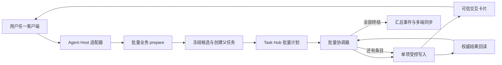
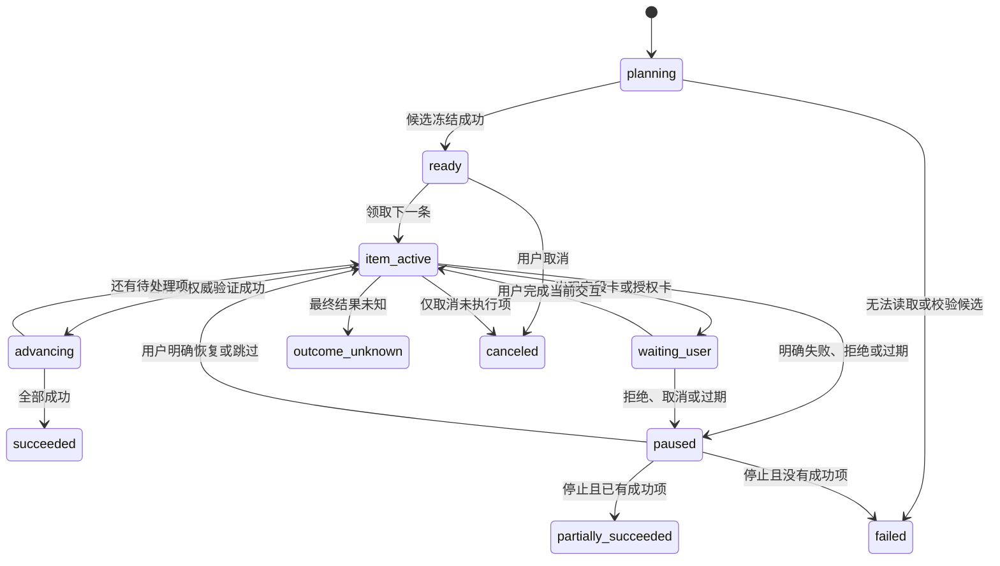
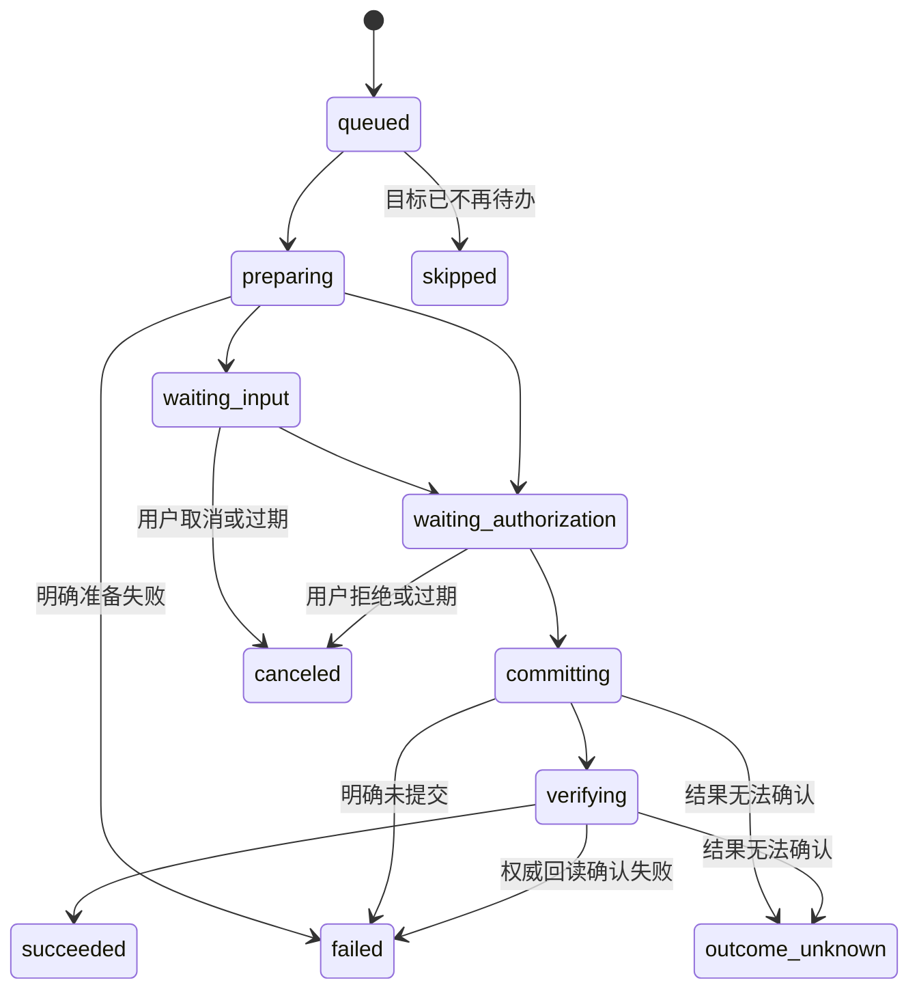

# 批量受控任务编排设计

## 一、文档状态

- 状态：详细设计，尚未实现；
- 首个落地范围：协同办公系统待办中的同类事项批量接收处理；
- 首个样板：一次处理当前待办中的全部补签申请单；
- 依赖：[受控写入模型](./受控写入模型.md)、[多端任务接续设计](./多端智能体任务接续设计.md)；
- 验收基线：[四系统试点收口一期计划](../验收记录/四系统试点收口一期计划-2026-08-22.md)。

本文解决的不是“把多个工具调用写进一句提示词”，而是让 AgentBridge 对一个批量业务意图建立可持久化、
可逐项授权、可自动推进、可重启恢复的父任务。实现完成前，现有单事项处理能力和安全边界保持不变。

## 二、问题与根因

### 2.1 已复现现象

用户发出“处理上面的所有补签申请单”后，智能体已经读取到三条候选事项，但只为第一条调用了
`oa_missed_punch_approval_prepare`。第一条成功后，后两条分别依赖用户再次发送“继续”才开始。

实际执行中三条事项各自形成了独立 `AgentTask`，每条内部的字段填写、授权、提交和结果回读均正常，
通知也被正常确认。问题不在 OA、卡片投递或轮询，而在三条任务之间没有持久化的父任务与剩余计划。

### 2.2 现有能力的边界

当前自动续办解决的是一个事项内部的链路：

```text
字段填写 -> 提交授权 -> commit -> verify
```

它没有表达下列信息：

- 本次用户意图一共冻结了哪些事项；
- 当前正在处理第几条；
- 第一条完成后下一条是谁；
- 失败、拒绝、过期或结果未知时是否继续；
- Agent Host 或 AgentBridge 重启后从哪里恢复；
- 多个客户端同时在线时由哪个端决定、如何避免重复执行。

模型虽然可以在文本中说“接下来处理第二条”，但这句话不是可靠状态。模型运行结束后，系统没有任何
可执行记录要求它继续，也不应该靠反复唤醒模型来维持业务流程。

### 2.3 设计结论

批量处理必须成为 Task Hub 中的一等持久化任务。模型负责理解“全部补签申请”的业务意图并发起批量
`prepare`，AgentBridge 负责冻结候选、逐项推进、停机保护和恢复；模型不再自己保存事项数组或决定下一条。

## 三、目标与非目标

### 3.1 目标

1. 一个批量用户意图只创建一个可见父任务；
2. 候选事项由服务端实时读取并一次冻结，模型不能在处理中替换目标；
3. 每个事项继续使用独立 Operation、Interaction、授权和权威回读；
4. 一项验证成功后自动进入下一项，不需要用户发送“继续”；
5. 中断、重启、切端和重复通知不会造成重复提交；
6. 失败、拒绝、卡片过期和结果未知都有明确、保守的停机规则；
7. 全过程可以按父任务和单项两级审计，并向用户提供简洁进度与最终汇总；
8. 机制可复用于其他同类待办，但一期不建设通用工作流引擎。

### 3.2 非目标

- 一期不编排补签、出差、周报等不同流程组成的异构任务；
- 不提供“一次授权后静默处理全部事项”的总授权；
- 不复用上一事项的审批意见、表单字段或流程契约；
- 不自动回滚已经成功提交的事项；
- 不允许模型调用通用批量 commit、任意 HTTP、DOM、脚本或底层 OA 接口；
- 不以持续唤醒模型作为批量推进机制；
- 不改变现有单事项调用方式和可信写入安全边界。

## 四、设计原则

### 4.1 业务语义入口

首期对智能体暴露业务级能力 `oa_missed_punch_approval_batch_prepare`，表达“处理当前待办中的补签申请”，
而不是暴露通用 `batch_run` 或让模型传入一组任意 `affair_id`。服务端根据当前登录主体、待办集合和能力
契约选择候选，防止模型拼装错误目标。

后续扩展新流程时，仍按流程提供明确的批量 `prepare` 能力；只有多个流程证明共享同一安全语义后，才考虑
抽取内部公共组件，不提前对外发布万能批量工具。

### 4.2 父任务持久化，子项独立治理

父任务保存“这一批要做什么和做到哪里”，每个条目继续走现有：

```text
prepare -> authorize -> commit -> verify
```

因此批量能力增加的是编排，不削弱单项写治理。每一项都必须拥有自己的 `operationId`、`interactionId`、
幂等键、授权决定和验证结果。

### 4.3 服务端冻结目标

批量 `prepare` 在同一业务快照中读取候选并冻结：

- 记录稳定资源标识及其哈希；
- 记录事项标题、发起人、时间等非敏感显示摘要；
- 固定总数和顺序；
- 后续不因为待办新增而悄悄扩大批次；
- 每项开始前仍重新验证其是否待办、是否属于当前用户、是否匹配流程契约。

“冻结”表示目标集合不再变化，不表示绕过实时校验。

### 4.4 单写者推进

一个批次同一时间只允许一个活动条目。推进权归 AgentBridge 的批量协调器，模型、Workspace、Telegram、
微信都只是入口或展示端。多个端可以看到同一张卡并作出决定，但服务端只接受一个原子决定。

## 五、总体架构



新增部分只承担批次状态和推进。Capability Engine、Credential Broker、Interaction Store、Operation Store、
Task Hub、Notification Outbox 和多端时间线继续复用现有实现。

## 六、领域模型

### 6.1 父任务

父任务仍使用现有 `agent_tasks`，通过非敏感摘要中的受控类型标识或后续兼容字段表明它是批量任务。
一期不把多个子项伪装成一个 Operation。

建议增加 `task_batches`：

| 字段 | 含义 |
| --- | --- |
| `batch_id` | 批次唯一标识 |
| `parent_task_id` | 对应的父 `AgentTask` |
| `user_subject` | AgentBridge 用户主体 |
| `system_id` | 目标系统，例如 `oa` |
| `capability_name` | 同质业务能力，例如补签审批 |
| `selection_summary_json` | 非敏感选择条件摘要 |
| `source_snapshot_hash` | 冻结候选快照哈希 |
| `failure_policy` | 默认 `stop_on_failure` |
| `state` | 批次状态 |
| `current_ordinal` | 当前条目序号 |
| `total_count` | 冻结总数 |
| `succeeded_count` | 已成功数 |
| `failed_count` | 已失败数 |
| `skipped_count` | 已跳过数 |
| `version` | 乐观锁版本 |
| `lease_owner`、`lease_expires_at` | 单写者推进租约 |
| `created_at`、`updated_at`、`finished_at` | 生命周期时间 |

约束：一个父任务只对应一个批次；同一用户、系统和能力一期只允许一个活动批次，避免相互争抢同一待办。

### 6.2 批量条目

建议增加 `task_batch_items`：

| 字段 | 含义 |
| --- | --- |
| `item_id` | 条目唯一标识 |
| `batch_id` | 所属批次 |
| `ordinal` | 从 1 开始的冻结顺序 |
| `resource_ref` | 服务端受保护的目标标识 |
| `resource_ref_hash` | 去重与审计用哈希 |
| `display_summary_json` | 标题、发起人、日期等非敏感摘要 |
| `source_fingerprint` | 冻结时的目标指纹 |
| `child_task_id` | 可选的单项子任务标识 |
| `operation_id` | 当前受控写操作 |
| `interaction_id` | 当前可信交互 |
| `state` | 条目状态 |
| `attempt` | prepare 尝试次数，不等于 commit 重试次数 |
| `result_summary_json` | 非敏感结果摘要 |
| `error_code` | 稳定错误码 |
| `created_at`、`updated_at`、`finished_at` | 生命周期时间 |

唯一约束至少包括 `(batch_id, ordinal)`、`(batch_id, resource_ref_hash)` 和非空 `child_task_id` 的唯一性。
`resource_ref` 不进入模型可编辑参数；业务敏感字段、凭据、Cookie 和表单正文不得进入 Task Hub。

### 6.3 父子任务关系

一期允许每个条目创建一个现有 `AgentTask` 作为子任务，以最大限度复用 Operation、Interaction、卡片、
文件和审计能力。父任务负责用户级进度，子任务负责单项执行。建议增加显式 `parent_task_id` 兼容字段或
关系表，不能只把父任务标识塞入自由文本摘要。

父任务终态定义：

- `succeeded`：全部冻结条目都经权威回读确认成功；
- `partially_succeeded`：至少一项成功，同时存在失败、跳过或取消项；
- `failed`：没有成功项，且批次以明确失败结束；
- `outcome_unknown`：任一项最终结果未知，优先级高于其他统计；
- `canceled`：用户取消尚未执行的剩余项；
- `expired`：批次在没有产生未知写结果的前提下整体过期。

现有 `TASK_STATUSES` 没有 `partially_succeeded`，实现时应新增稳定终态，并同步管理控制台、统计、备份、
任务列表和文档测试，不能把部分成功错误地显示为全成功或全失败。

## 七、状态机

### 7.1 批次状态



### 7.2 条目状态



`outcome_unknown` 是硬停机状态：不得自动重试当前项，也不得继续后续项，必须先进行权威核对与人工处置。

## 八、端到端流程

### 8.1 创建批次

1. 用户说“处理待办中的所有补签申请单”；
2. 模型调用一次 `oa_missed_punch_approval_batch_prepare`；
3. AgentBridge 按当前 `userSubject` 和下游主体实时读取待办；
4. 过滤补签申请，按稳定规则排序并限制一期最大 10 条；
5. 在同一事务中创建父任务、批次、冻结条目和 `batch.candidates.frozen` 事件；
6. 没有候选时返回明确的“当前没有补签待办”，不创建空批次；
7. 协调器领取第一条，创建单项子任务并进入现有受控写入链路。

默认排序必须由适配器明确声明。一期补签建议使用待办接收时间升序、`affair_id` 作为稳定次序补充，避免
数据库自然顺序造成每次不同。

### 8.2 逐项处理

每张卡显示：

- `第 1/3 条`；
- 事项标题、发起人、申请日期和必要摘要；
- 当前动作及安全说明；
- 已完成数和剩余数；
- 当前项独立的填写、确认、拒绝或取消控件。

当前项成功后，协调器以事务方式：

1. 将条目标记为 `succeeded`；
2. 更新父任务计数并写入 `batch.item.succeeded`；
3. 通过乐观锁和租约认领下一条；
4. 重新校验下一条仍属于当前用户的同类待办；
5. 创建下一条独立卡片并通过现有 Task Hub、Outbox 和多端时间线发布；
6. 不唤醒模型，不要求用户输入“继续”。

旧卡片保留原位置并进入明确终态。下一条必须是新 `interactionId`，不能复用、移动或重新激活旧卡。

### 8.3 推进执行者

批量协调器是状态机所有者，但不能保存可复用 MCP Token 或用户凭据。推荐采用“服务端计划、宿主私有推进”：

1. AgentBridge 在当前项终结后生成一次性 `batch.next_ready` 推进记录；
2. Agent Host 适配器的后台泵使用当前端点的身份路由和 MCP Token 领取该记录；
3. 适配器调用宿主私有 `agentbridge_host_batch_advance`，携带 `batch_id`、期望版本和一次性推进授权；
4. AgentBridge 重新校验 `userSubject`、Token 权限、批次租约和下一条目标后开始 prepare；
5. Agent Host 离线时，记录留在 Outbox，恢复在线后继续，不需要恢复模型上下文。

该接口不得向模型公开，也不得接受模型提供新的 `resource_ref`。如果后续 Capability Engine 能在不持有用户凭据
的条件下安全执行服务端推进，可将实现内收，但外部语义和审计契约不变。

### 8.4 完成汇总

全部条目终结后发布一次父任务汇总，例如：

```text
3 条补签申请已处理完成：成功 3，失败 0，跳过 0。
```

若部分完成：

```text
批量处理已停止：成功 1，失败 1，未处理 1。第 2 条因流程校验失败未提交。
```

各端根据同一父 `taskId` 展示进度和汇总，不能将每条子任务误排成互不相关的用户请求。

## 九、失败与停止策略

一期默认 `stop_on_failure`，规则如下：

| 当前项结果 | 当前项处理 | 后续项 |
| --- | --- | --- |
| 权威验证成功 | 标记成功 | 自动进入下一项 |
| 开始前已不在待办 | 标记 `skipped` 并记录原因 | 默认继续 |
| 明确业务拒绝或准备失败 | 标记失败并展示原因 | 暂停，等待用户选择停止或跳过 |
| 用户拒绝、取消或卡片过期 | 标记取消或过期 | 暂停，不静默继续 |
| Token 权限被撤销 | 不执行 commit | 暂停并提示管理员处理 |
| 登录失效 | 发起当前系统登录交互 | 登录成功后恢复当前项，而不是跳到下一项 |
| `outcome_unknown` | 保留操作证据 | 立即硬停机，禁止自动重试和后续处理 |
| Host 或服务重启 | 保持持久化状态 | 恢复器按数据库状态接续 |

用户选择“取消批次”只取消未开始条目，不撤销已经成功的业务操作。若业务允许撤销，应由用户另行发起明确的
撤销任务，并继续使用独立授权和回读。

## 十、幂等、并发与恢复

### 10.1 幂等键

- 创建批次：使用宿主运行标识和用户意图派生的客户端幂等键；
- 条目 prepare：`batch:{batch_id}:item:{ordinal}:prepare:{attempt}`；
- 单项 commit：继续使用现有 Operation 幂等键，不因批次而共享；
- 推进：`batch:{batch_id}:advance:{expected_version}`；
- 卡片与通知：继续使用事件、端点和载荷类型唯一键。

重复调用批量 `prepare` 必须返回原父任务或明确冲突，不能再次冻结并提交同一组事项。

### 10.2 并发控制

- 协调器用 `version` 比较交换和短租约领取批次；
- 一个批次只允许一个 `item_active`；
- 同一条 `resource_ref_hash` 在一个用户的活动批次中不可重复；
- 多端同时确认同一张卡时，只有第一个原子决定成功，其余端收到已处理终态；
- 管理控制台恢复动作只改变编排状态，不直接执行业务 commit。

### 10.3 重启恢复

恢复器周期扫描非终态批次：

1. `waiting_user`：恢复卡片投影和 Outbox，不新建交互；
2. 当前条目已成功但父任务尚未推进：重新生成幂等的 `next_ready`；
3. `preparing` 且未产生 Operation：允许在同一 prepare 幂等键下恢复；
4. `committing` 或 `verifying`：先查询现有 Operation 和权威业务状态，不直接重放；
5. `outcome_unknown`：保持硬停机；
6. 租约超时：其他协调器可接管，但必须携带最新版本。

## 十一、多端体验

### 11.1 卡片与文本同步

父任务的状态、当前序号、单项卡片和最终汇总统一进入 Task Hub 时间线：

- Workspace 通过 SSE 拉取；
- Telegram、微信等推送端通过 Notification Outbox 投递；
- 任一端完成卡片后，其他端收到同一交互终态；
- 端点离线不影响批次状态，恢复后补齐未确认事件；
- 不为拉取端尝试聊天式直推，也不因直推失败唤醒模型。

### 11.2 展示规则

- 父任务只显示一个总体进度，不把每个条目都显示成新的用户输入；
- 子项卡片按序追加，不能因状态刷新移动旧卡；
- 已完成、拒绝、过期和 `superseded` 卡片继续保留终态；
- 同一条业务信息只投递一次，模型生成的解释文本不重复业务状态通知；
- 默认进度文案简洁，详细错误和审计信息在管理控制台查看。

## 十二、权限与安全

1. 批量 `prepare` 需要读取待办和对应流程写准备权限；
2. 每个条目 commit 时重新检查当前 Token 的用户主体和写权限；
3. Token、Credential Broker 会话和目标系统 Cookie 不写入批量表；
4. `resource_ref` 只由服务端冻结和读取，模型不能在推进时修改；
5. 每一项仍需独立可信授权，一期不支持总授权；
6. 登录恢复后回到原条目，不能丢失父任务或错误续办其他用户任务；
7. 两个用户即使看到相同标题，也必须形成不同批次、目标集合和下游会话；
8. 审计日志必须能从父任务追溯到每个子任务、Operation、Interaction、决定端点和验证证据。

## 十三、事件与可观测性

建议新增事件：

- `batch.created`；
- `batch.candidates.frozen`；
- `batch.item.started`；
- `batch.item.succeeded`；
- `batch.item.failed`；
- `batch.item.skipped`；
- `batch.item.outcome_unknown`；
- `batch.paused`；
- `batch.resumed`；
- `batch.completed`；
- `batch.canceled`。

单项内部继续使用既有 `task.operation.*` 和 `task.interaction.*` 事件。父任务事件只保存非敏感摘要和引用，
避免复制完整表单。

至少监控：

- 活动批次数；
- `ready` 或 `advancing` 超时数；
- 每项从成功到下一张卡出现的延迟；
- 重复推进被拦截次数；
- 批次成功、部分成功、失败和结果未知数量；
- 因登录、权限、Host 离线而暂停的批次数；
- 多端通知积压和重复投递率。

管理控制台应能查看父任务、冻结条目、当前项、停机原因和恢复建议，但不能修改目标标识或跳过可信授权。

## 十四、接口草案

### 14.1 智能体可见业务能力

```json
{
  "name": "oa_missed_punch_approval_batch_prepare",
  "arguments": {
    "limit": 10,
    "failure_policy": "stop_on_failure"
  }
}
```

返回父 `taskId`、`batchId`、冻结数量、非敏感摘要和第一张可信交互。若当前没有候选，返回稳定空结果，
不创建批次。

一期不接受模型传入 `affair_ids`、审批意见或 commit 参数。意见等业务字段通过每个条目的可信字段卡收集。

### 14.2 宿主私有接口

- `agentbridge_host_batch_advance`：领取服务端已确定的下一条；
- `agentbridge_host_batch_status`：读取父任务和当前项状态；
- `agentbridge_host_batch_cancel`：取消未开始条目；
- `agentbridge_host_batch_resume`：在明确可恢复状态下继续暂停批次。

这些接口属于 Agent Host Adapter 契约，不能进入模型工具清单。`advance` 必须使用一次性授权、期望版本和
当前用户 Token；`resume` 不得跨越 `outcome_unknown`。

## 十五、实施顺序

### 15.1 数据与状态机

1. 增加批次、条目和父子任务关系的数据迁移；
2. 扩展任务状态、事件投影、备份校验和管理控制台；
3. 实现批次创建、租约、计数、推进、暂停、取消和恢复的纯领域测试；
4. 保证现有单事项任务和历史数据库无迁移副作用。

### 15.2 补签样板

1. 注册 `oa_missed_punch_approval_batch_prepare`；
2. 服务端读取、过滤、排序并冻结补签待办；
3. 每项复用现有补签审批 prepare、字段卡、授权卡、commit 和回读；
4. 接入宿主私有推进和多端卡片投递；
5. 加入登录恢复、权限变化和目标消失的再校验。

### 15.3 可靠性与体验收口

1. 加入 AgentBridge、OpenClaw 和隧道重启恢复测试；
2. 加入 Workspace、Telegram、微信跨端决定与补投测试；
3. 管理控制台增加批量进度、停机原因和审计视图；
4. 完成真实 OA 三条补签的提交验收；
5. 验收稳定后再抽取同质批量框架，适配其他待办类型。

## 十六、验收方案

### 16.1 自动化测试

1. 三条候选只创建一个父任务和三个冻结条目；
2. 第一条成功后自动出现第二张卡，不产生新的用户级请求；
3. 重复 `advance`、事件重放和 Outbox 重试不产生重复 prepare 或 commit；
4. 第二条拒绝、过期或明确失败后第三条不自动开始；
5. 第二条 `outcome_unknown` 后整个批次硬停机；
6. AgentBridge 或 Agent Host 在两项之间重启后从下一条恢复；
7. Token 中途失去权限时批次暂停且不调用业务写接口；
8. 下一条已被人工处理时标记跳过，并按策略继续；
9. Workspace 与 Telegram 同时确认时只接受一次决定；
10. 两个用户并行批次的身份、会话、目标、卡片和审计完全隔离；
11. 现有单条补签、其他 OA 审批和非 OA 能力回归不受影响；
12. 备份恢复后父任务、冻结顺序、当前项和终态统计一致。

### 16.2 真实环境验收

前提是第一用户待办中存在至少两条可安全审批并能核对结果的补签申请。用户只发送：

```text
处理待办中的所有补签申请单
```

验收要求：

1. 系统先报告冻结数量；
2. 卡片按 `第 1/N 条` 顺序出现；
3. 用户只完成每张卡，不再发送“继续”；
4. 每项提交后从 OA 待办消失并产生权威成功证据；
5. 最后一项完成后父任务自动终结并给出汇总；
6. Workspace 和伴随端看到相同顺序、状态和结果；
7. 管理控制台能从父任务追溯三条子任务和全部 Operation、Interaction；
8. OA 中没有重复审批、错人、错事项或未授权提交。

## 十七、关键决策记录

| 决策 | 结论 | 原因 |
| --- | --- | --- |
| 是否靠模型循环调用单项工具 | 否 | 模型运行不是持久化工作流，重启和切端后无法可靠恢复 |
| 是否建立独立通用工作流平台 | 否 | 一期只补足 Task Hub 的同质批量编排，避免过度设计 |
| 是否一个批次共用一个 Operation | 否 | 每项必须独立授权、幂等、验证和审计 |
| 是否一次授权全部提交 | 否 | 一期维持逐项知情和最小授权 |
| 是否允许模型传入目标列表 | 否 | 候选由服务端基于实时待办冻结，防止目标注入或漂移 |
| 是否在第一项完成后唤醒模型 | 否 | 由持久化协调器和宿主私有推进接续，降低延迟和重复调用 |
| 是否自动跳过结果未知项 | 否 | `outcome_unknown` 必须硬停机，禁止产生后续副作用 |
| 是否兼容现有单项能力 | 是 | 批量只增加父任务与推进层，不改写单项受控写入契约 |
