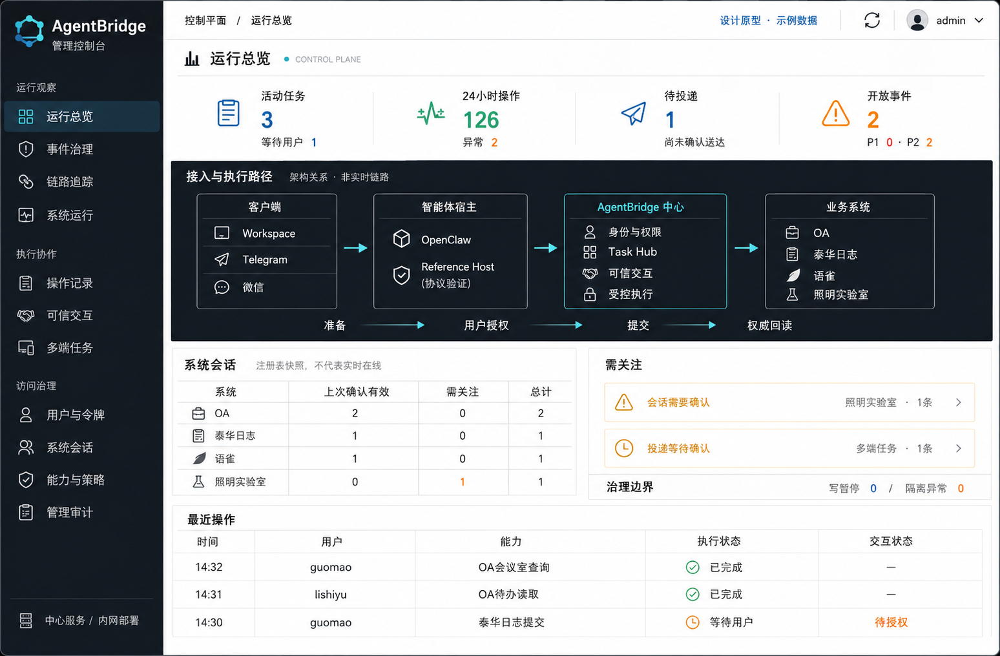
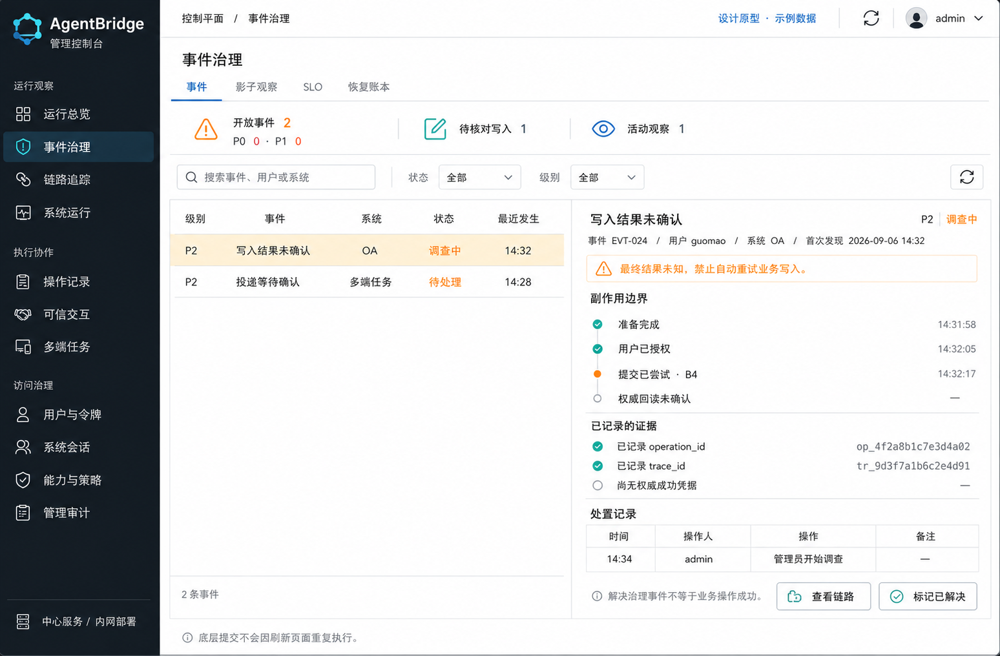

# 管理控制台视觉原型

日期：2026-09-06。状态：风格已评审通过，保留静态视觉设计。

后续状态：用户已确认风格，前端实现按该方向开展。本文及两张生成图继续作为原始设计留档，不替换为生产截图；实际功能见[管理控制台说明](../../平台能力/管理控制台.md)。

本轮只保存设计图片与说明，不修改应用代码，不部署，不执行任何业务或管理写操作。所有数字、时间、事件和操作记录均为示例，不代表生产环境状态。图片由内置图像生成工具生成，用于确定视觉方向，不是已实现页面截图。

## 原型预览

### 运行总览

- 将客户端、智能体宿主、AgentBridge 中心、业务系统分层呈现。Workspace、Telegram、微信是客户端；OpenClaw 是宿主；Reference Host 用于协议验证，不暗示生产业务流经两个宿主。
- 架构关系不是实时链路监控。后续实现不使用动画或绿色连线暗示未经检测的服务可用性。
- 总览突出活动任务、执行异常、待投递和开放事件，支持进入相应治理页面。
- 系统会话明确标注“注册表快照”，不把“上次确认有效”说成“实时在线”，也不把租约外会话自动判为失效。
- 中心执行路径强调准备、用户授权、提交、权威回读；读取操作不强行套用写入授权路径。

### 事件治理

- 左侧事件列表、右侧选中事件详情，减少管理员在多个页面之间寻找证据的次数。
- 用阶段时间线展示提交是否已经尝试、是否拿到权威结果；结果未知不渲染成业务失败或成功。
- “标记已解决”仅代表治理事件的处置状态，不改变下游业务结果，也不重新发起业务提交。
- 事件、链路、操作记录按可用关联标识连接；实际缺失的数据应显示缺失，不拼造时间或证据。
- 权限与审计规则保持原样，不能因为换成侧栏操作而绕过确认、角色检查和审计。

## 视觉方向

采用石墨色导航、浅色工作区、青色结构线和语义状态色。科技感来自接入结构、执行阶段、证据关联与精密排版，不采用大屏式装饰、霓虹光效或虚构趋势曲线。

| 元素 | 方向 |
| --- | --- |
| 导航 | 按运行观察、执行协作、访问治理分组，保留现有全部功能入口 |
| 色彩 | 石墨黑、白、青色；琥珀色表示关注，绿色表示已确认，红色保留给严重异常 |
| 信息密度 | 紧凑指标带、易扫描表格、选中项详情；不将所有内容堆成大卡片 |
| 字体 | 中文清晰优先，标识和时间可用等宽字体，正文不使用过小字号 |
| 操作 | 常用工具用图标与提示，危险动作保持明确文字和确认边界 |
| 适配 | 本轮先看桌面风格；移动端布局及交互在方向确认后另行设计验证 |

## 原型与实施的边界

这两张图不是交互原型，不能点击操作。事件详情并列面板、总览关注入口和部分指标聚合属于拟议的信息组织，后续需核对接口字段与角色权限再实现。生成图中的少量图标、间距和文字排布仅作意向，实际实现使用统一图标库与精确排版。

本次不扩展管理员可见的敏感信息范围：不展示密码、令牌密钥、认证链接、卡片字段值或业务正文。

## 评审重点

1. 石墨色与浅色工作区的组合是否符合期望，还是希望整体更偏深色。
2. 科技感与日常管理可读性的平衡是否合适。
3. 总览是否能直观看出系统分层，以及问题出在会话、执行还是投递。
4. 事件列表与详情并排的形式是否方便排查。

## 图像生成说明

使用内置图像生成工具；第二张以第一张为视觉参考以保持一致性。生成约束包括：中文管理控制台、完整桌面页面、石墨导航与浅色主区域、青色结构强调、明确示例标记、紧凑表格、无营销首屏、无虚构趋势、无自动重试未知业务写入。完整生成提示词保存在同目录的《生成提示词》中，供复现与后续调整使用。
