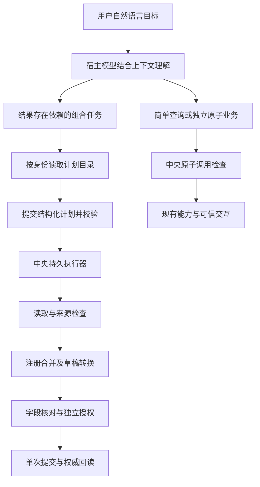

# 组合任务语义规划与执行约束设计

## 一、状态与适用范围

- 状态：待实施详细设计；2026 年 9 月 2 日已按当前线上基线完成实施前校准，本文新增合同尚未实现。
- 日期：2026 年 9 月 2 日。
- 所属工作：通用持久化任务计划一期的自然语言接入与数据正确性收口。
- 适用宿主：OpenClaw 和 Reference Host；不增加第三个宿主，不修改 OpenClaw 源码。
- 基础设计：[通用持久化任务计划与跨系统编排详细设计](./通用持久化任务计划与跨系统编排详细设计.md)。
- 后续实施验收：[组合任务语义规划工作台验收方案](../后续规划/组合任务语义规划工作台验收方案.md)。

本文补充基础设计的任务入口、执行约束、多来源合并和来源完整性要求。现有计划存储、顺序执行器、
可信卡片、单写终点、权限隔离和结果未知停止机制继续复用。宿主无关化一期、Workspace 受理前可靠
投递、Gateway 生命周期自愈和终态事件排空已经上线，本文按这些能力已经存在来设计，不再另建一套
宿主恢复或前端轮询机制。本文中的新字段、错误码及协议版本仍是拟定合同，不能视为当前接口已经支持。

### 1.1 规范关系与实现基线

| 层次 | 当前事实 | 本文责任 |
| --- | --- | --- |
| 持久计划 v1 | `proposal.v1`、单来源 Binding、顺序执行、单写终点和可信交互已经实现 | 继续兼容和恢复旧计划，不改写旧哈希与授权 |
| 宿主与投递 | OpenClaw、Reference Host、Task Hub、多端时间线和受理前可靠投递已经实现 | 复用同一 `taskId`、宿主契约、事件序列和恢复边界 |
| 语义规划 v2 | 关键词开关、多来源、查询完整性、结果投影和执行授权快照尚未完成 | 本文作为 v2 增量合同和实施依据 |

基础文档负责解释持久计划内核和通用状态机；本文负责 v2 的自然语言入口与数据正确性。两者发生
冲突时，v1 已存在计划仍按基础文档恢复，新建 v2 计划按本文执行。验收事实只写入带日期的验收记录，
不能用设计状态替代线上证据。

## 二、问题与证据

### 2.1 实测请求

用户原话：

> 总结我昨天的OA已办和已发，时长为1小时，提交昨天的日志

2026 年 8 月 31 日的请求记录显示：

| 项目 | 已核实事实 | 不能据此推断的结论 |
| --- | --- | --- |
| 第一次请求 | 09:28:30 开始，约 61 秒后受理前等待超时；没有宿主受理和业务工具调用 | 不能认定 OA 或泰华登录失效，也不能认定业务曾提交 |
| 第二次请求 | 09:30:43 开始，最终新增 8 月 30 日、1 小时日志一次，权威回读匹配 | 提交成功不代表来源检索和正文语义正确 |
| 持久计划 | 本次任务没有 TaskPlan；宿主直接串联读取与 prepare | 不代表原子操作没有审计或写入没有授权 |
| 已办来源 | 读取页面第一批 50 条，在该集合内按日期筛选得到 0 条；集合总数为 1064 | 不能将单页结果自动表述为全历史检索结果 |
| 已发来源 | 日期参数未进入当前 MCP 工具；随后改用日期字符串作关键词；集合总数为 221 | 关键词文本匹配不能替代有明确口径的日期查询 |
| 最终正文 | 写成了“已办0条、已发0条；完成检索、结果汇总与日志归档说明” | 查询动作不能自行替代用户昨天实际办理的业务工作 |

本次已发第一页最新日期为 8 月 19 日，因此尚无证据证明 8 月 30 日确实存在漏项。问题是执行链
没有给出足以支撑“指定范围完整汇总”的证据，而不是已经证明某条事项被漏掉。

第一次的连接失败另属[受理前可靠投递](./工作台请求受理前可靠投递详细设计.md)范围。本设计不通过
重启 Gateway、修改 VPN 或代理、延长所有超时来解决内容正确性问题。

### 2.2 当前入口为什么不可靠

OpenClaw 插件的 `composedTaskPlanningContext()` 目前先匹配来源词和成果词，命中后才注入
“先创建持久计划”的上下文。来源词包含“汇总、整理、查询”等，但不包含“总结”。

这有两层问题：

1. 是否获得规划规则取决于说法，而不是任务关系；换同义词、省略动词或跨轮表达都可能漏掉。
2. 即使命中，也只是给模型增加提示，没有保证实际的数据加工写入一定归属于计划。

因此不采用“补更多同义词”作为修复方案，也不将它改写为另一套业务意图正则。

## 三、核心决策

1. **规划规则常驻，模型按语义判断。** 对具备 AgentBridge 身份的业务回合提供统一、简短的规划规则，
   不以用户文本命中特定词作为开关。
2. **中央服务检查可验证的结构。** 根据能力元数据、当前任务操作账本、计划成员关系和数据绑定决定
   能否进入写入准备，不让中央服务靠自然语言关键词猜业务意图。
3. **保留简单路径。** 简单查询、独立填单、既有审批与批量处理继续使用现有能力；不要求所有请求
   先调用一个分类工具，也不新增每次请求必经的大模型调用。
4. **形成内容依赖的组合任务使用持久计划。** 将查询结果加工成后续业务内容时，应先规划后执行，
   不能仅把多个工具放在同一聊天回合中调用。
5. **支持有限多来源汇聚，不建设完整 DAG 平台。** 顺序读取多个来源，再做一个注册合并转换；仍然
   限制最多 12 个步骤、一个受控写入终点，无循环、并行调度或多写补偿。
6. **数据不足不能被成功回执掩盖。** 来源不完整、查询条件未落实或没有有效事项时，不自动生成
   冒充完整业务总结的日志，更不能仅凭用户给出了工时就继续写入。

本设计不承诺模型永不误解。能够硬性验证的是调用关系、身份、参数、来源、授权和执行次数；
自然语言理解仍需通过真实表达验收。若模型完全漏掉来源要求，中央服务不能仅从一段普通正文
证明它来自用户还是模型编写，不能把“取消关键词”宣传为已经解决全部语义正确性问题。

## 四、什么请求需要计划

判断依据是目标之间的依赖关系，不是系统数量、句子长度、调用次数或某个动词。

| 用户请求 | 路径 | 理由 |
| --- | --- | --- |
| 查看我的 OA 待办 | 直接读 | 单一查询，没有后续成果依赖 |
| OA 和日志系统登录了吗 | 允许独立只读调用 | 两次状态检查不需要完整业务计划 |
| 今天开会一小时，帮我填写日志 | 现有独立 prepare 和可信卡 | 用户已经提供业务内容；不依赖另一份业务查询结果 |
| 处理第一条补签申请 | 现有接收处理能力 | 查找目标、读取详情、权限核对属于该原子业务动作的前置条件 |
| 处理全部补签申请 | 现有批量受控任务 | 继续冻结候选、逐项授权，不迁移成多写跨系统计划 |
| 把昨天的已办和已发整理成日志 | 多来源持久计划 | 后续内容取决于两个读取结果 |
| 根据上面查到的事项写昨天的日志 | 解析同用户来源后建立或接续计划 | 跨轮引用不应依靠模型复述旧正文作为权威输入 |
| 总结昨天的已办，先给我看，不提交 | 只读与转换计划 | 有可核对的来源及草稿成果，但没有写入终点 |

同一系统内的“读一批数据，再生成另一项业务内容”也可需要计划。跨系统不是必要条件。

## 五、宿主语义规划入口

### 5.1 常驻规则，不常驻冗长目录

共享规则说明以下原则：

- 用户要求后续成果依据业务查询结果时，先读取计划目录，再提出结构化计划。
- 独立查询、候选选择和用户直接提供内容的填单不强制规划。
- 日期、范围、工时、预览或提交意图必须保留；目录无法表达关键限制时停止说明，不忽略限制。
- 不调用隐藏 commit、resume 或任意 HTTP；不通过直接 prepare 绕过计划错误。
- 已有活动计划时读取权威状态，不重复创建计划或重新执行来源步骤。

规则内容不能继续以 OpenClaw 插件中的字符串常量作为唯一事实源。中央通过现有
`agentbridge_server_profile` 的宿主协商结果发布版本化的 `agentbridge.composed-task-planning-policy.v1`，
内容只包含“何时需要计划、何时保留原子路径、怎样处理 `PLAN_REQUIRED`”等短规则；详细能力仍由
`agentbridge_task_plan_catalog` 按身份和 Scope 返回。Agent Host Adapter 在身份绑定后的业务回合中装载
并缓存短策略；策略版本变化时刷新，不能按用户句子中的关键词决定是否装载。

OpenClaw 负责把共享短规则放入模型上下文，不保留“OA 转泰华”等业务分支；Reference Host 读取同一
策略版本，并使用固定 Proposal 夹具验证协议。Reference Host 的夹具通过不等于自然语言理解已验收，
后者仍以 OpenClaw 真实 Workspace 请求为准。宿主暂时取不到新策略时可以继续执行独立只读和既有原子
能力，但不得把来源派生写入降级成直接 prepare；中央门控仍是最后一道确定性约束。

能力目录仍按当前身份、Scope 和版本按需获取，不在每轮注入完整 100 多项工具说明。短策略和详细
目录是两个对象：短策略常驻，只有模型按语义判断需要计划时才读取详细目录。不增加独立分类模型
服务，不要求用户先说“建立计划”，不要求用户输入任务号。

### 5.2 正常执行顺序



模型最多自动修正一次没有副作用的计划 Schema 错误。缺权限、关键能力缺失、来源不完整或业务
含义不明确不能靠猜参数重试。需要用户补充时用人能理解的问题，不让用户回答内部 ID。

## 六、中央执行约束

### 6.1 任务范围与数据来源

复用 `AgentTask`、`Operation`、宿主私有调用上下文和现有跨端接续关系。约束范围是同一用户目标，
不是这个用户最近所有操作、整个聊天会话或所有浏览器标签页。

- 用户、端点和 Token 取自可信接入上下文，不能由模型参数指定。
- 原始用户消息与父任务建立稳定关系；登录恢复、跨端确认和宿主重启仍归入原目标。
- 新的独立请求不能自动继承上一项任务的读取依赖；明确接续必须经现有任务归属校验。
- 不用标题相似度、关键词、时间相近或最近一次 Operation 猜所属任务。
- 来源操作即使返回零条也要记录；“空集合”不等于“本任务没有执行过读取”。

现有 `host_run`、`user_turn`、`independent` 任务范围必须在实现前逐一验证。缺少可信任务关联时，
返回拟定错误 `PLAN_CONTEXT_REQUIRED`，不得把来源随便关联到最近任务。无上下文宿主可以继续只读，
需要组合写入时先通过计划入口建立中央任务；不能通过新建 run 或更换端点绕开已绑定的活动计划。

### 6.2 不把所有“先读后写”都拦住

由公共能力注册元数据描述读取用途和写入字段性质，不能让模型传一个 `is_lookup=true` 就豁免。

| 元数据类别 | 例子 | 约束 |
| --- | --- | --- |
| 会话及权限前置检查 | 登录状态、授权前会话核验 | 不算业务内容来源 |
| 目标或选项解析 | 审批目标 affair、会议室、人员、项目选项 | 按目标写能力允许的候选合同校验，仍可走原子路径 |
| 业务内容来源 | 指定范围事项列表、待加工的日志或业务记录 | 后续派生内容写入应进入计划 |
| 用户直接提供的独立内容 | 日期、工时、明确填写的工作内容 | 继续可信填单，不因前一个独立任务查询过 OA 而被拦 |

同一读取能力可能既能提供选项也能提供业务内容。必须结合**目标能力及目标字段的注册合同**判断，
例如待办列表用于选择审批对象是合法解析，不能将它概括成“所有列表都是 lookup”，否则生成日志
时又会绕过来源约束。实现采用少量能力角色与字段元数据，不写“OA 转泰华”的场景分支。

能力角色使用中央维护的 `PlanningDescriptor`，不允许模型通过参数自报。目录只投影当前身份有权看到
的部分，中央校验始终使用完整的内部描述。建议合同如下：

```json
{
  "schemaVersion": "agentbridge.planning-descriptor.v1",
  "capabilityName": "oa.workflow.done.list",
  "roles": ["business_source"],
  "sourceContract": {
    "itemsPointer": "/items",
    "coveragePointer": "/coverage"
  }
}
```

写入准备能力声明哪些字段允许使用什么来源：

```json
{
  "schemaVersion": "agentbridge.planning-descriptor.v1",
  "capabilityName": "taihua.work_log.create.prepare",
  "roles": ["write_sink"],
  "inputProvenance": {
    "content": "user_or_bound_transform",
    "hours": "user_decision",
    "log_date": "user_constraint"
  }
}
```

- `roles` 只允许 `precondition`、`selector`、`business_source` 和 `write_sink`；一个能力可以有多个角色。
- `selector` 必须声明允许服务的目标能力或目标字段，不能成为所有写入的通用豁免。
- `business_source` 必须声明业务条目和质量元数据所在位置；缺质量合同只能展示，不能支持完整派生写入。
- `user_decision` 不能由来源转换擅自推断；`user_or_bound_transform` 接受用户直接填写或计划内绑定结果。
- 描述符独立于通用 `CapabilitySpec` 演进，避免给全部既有能力增加无意义的必填字段。

### 6.3 写入准备入口的规则

按以下顺序在中央服务的受控 prepare 入口检查，且早于生成新字段卡、授权卡和业务副作用：

1. 如果是中央执行器正在推进的已编译步骤，核对计划归属、步骤能力、版本与参数哈希，继续原步骤。
   既有原子可信交互续办和批量协调器也按各自已持久化的交互或子任务凭据核对，不能被误当成模型
   新开 prepare；不得为兼容而接受外部伪造的内部调用标记。
2. 如果同一目标已有活动计划或可信交互，返回其权威状态；不另开直接写入链路。
3. 如果是现有原子能力明确允许的会话、目标或选项解析链，保留原有业务检查和授权。
4. 如果当前目标已有业务内容来源操作，而后续 prepare 要生成业务内容，直接调用返回
   `PLAN_REQUIRED`，不生成卡片；不论该读取是否成功返回了条目。
5. 没有上述来源依赖的独立填单保持现有路径。模型不能自报“来源已验证”来降低检查要求。

这是基于已记录行为的保守兜底，不是能读懂所有自然语言的证明器。对于“完全没读来源就编写正文”
或“把旧结果手工复制成普通字符串”的模型错误，仍依赖常驻规则、来源展示及语义验收；文档和界面
不得将无来源证据的正文标为“已完整核实的业务汇总”。

### 6.4 模型走错路径后的恢复

`PLAN_REQUIRED` 只返回非敏感解释和计划入口，不返回完整业务数据、卡片 URL 或授权信息。

其公共结果使用固定的控制结构，不能伪装成普通业务错误：

```json
{
  "status": "planning_control",
  "error": {"code": "PLAN_REQUIRED"},
  "recovery": {
    "action": "prepare_task_plan",
    "policyVersion": "agentbridge.composed-task-planning-policy.v1",
    "maximumRepairAttempts": 1
  }
}
```

`taskId`、执行器标记和协调 Lease 继续来自 MCP 私有可信上下文，不放进模型可填写的恢复参数。

这是规划控制结果，不是“业务提交失败”。原子调用可以记录被拒绝的错误码，但父任务在一次修正
窗口内保持处理中，不立即发业务失败通知；修正仍受当前宿主 run 的既有截止时间限制。模型结束
或窗口耗尽仍未建立合法计划时，父任务明确结束为“未能形成可执行计划”，不能永久挂起。

- 宿主保留原用户目标，读取目录，提交一次计划；不让用户换说法重发。
- 本阶段不新增任意历史 Operation 导入、结果复制或外部脚本节点。若此前已直接读取，计划重新
  读取一次所需来源；这是错误路径的有界恢复，不是正常路径必须重复查询。
- 重新读取前确认没有已经提交或结果未知的写操作，也没有尚待处理的旧授权。
- 再次规划失败就说明缺口，不在计划与直接工具之间循环尝试。
- 后续可单独设计经过归属、Scope、时间和输出哈希校验的来源快照复用，不作为本包前置条件。

执行器身份由中心进程内部上下文提供，公开参数 `plan_id` 或 `internal=true` 不能充当豁免凭证。
模型只能选择自己有权访问的计划，不拥有提交内部步骤或消费授权的权限。

## 七、多来源汇聚合同

### 7.1 保留顺序调度，扩充数据绑定

当前 Binding 只能将一个步骤输出绑定到一个输入字段。Proposal v2 使用带判别字段的联合类型，
不根据对象形状猜测单来源还是多来源。单来源写法为：

```json
{
  "bundle": {
    "mode": "single",
    "step": "merge_items",
    "pointer": ""
  }
}
```

有界多来源写法为：

```json
{
  "sources": {
    "mode": "many",
    "items": [
      {"step": "read_done", "pointer": ""},
      {"step": "read_sent", "pointer": ""}
    ]
  }
}
```

外层 `sources` 是转换器输入字段名，`mode` 是明确判别字段。每个条目仍是现有的
`step + pointer` 引用；空 Pointer 表示完整来源结果，以免丢失日期、分页与完整性信息。

- 新绑定解析为有序数组，不允许表达式、任意代码或自由字符串插值。
- 每个来源都必须在依赖链上，成功完成且属于同用户计划；校验实际输出及目标数组元素 Schema。
- `merge_work_items.v1.sources` 和 `work_items_to_log_draft.v2.bundle` 是必须绑定的来源字段，
  不接受模型在静态 arguments 中填写数据集或 `coverage.status=complete` 冒充真实查询结果。
- 每个数组绑定最多 8 个来源，整个计划仍最多 12 步。
- v1 的单来源 Binding 原样保留，只用于恢复和创建 v1 计划；v2 不接受省略 `mode` 的模糊写法。
- v2 需在实际目录发布后使用，旧宿主不能将未知版本降成直接工具链。

这是静态多输入汇聚，不增加并行 DAG、循环或动态节点。

### 7.2 注册转换

拟新增 `merge_work_items.v1`，并提供接受完整来源信息的 `work_items_to_log_draft.v2`。

- 合并器接收带查询条件、完整性和事项集合的来源数组，输出 `items`、来源摘要和汇总完整性。
- 草稿转换器接收合并后的完整对象，而不只接收 `/items`；不得将 partial 或 unknown 洗成 complete。
- 来源记录要保留系统、集合、原始记录标识、相关业务日期和采用依据。
- 已办与已发表示不同业务行为；同一流程既发起又处理时可分组展示，但不能把两种行为静默删掉。
- 精确重复记录按稳定记录标识去重；跨集合分组仅使用适配器实际提供的稳定流程标识。没有该标识
  时保留来源，不以“标题相同”强行合并。
- 输出分别说明已办、已发、合格事项、排除项与重复项数量，不把两个集合的数量机械相加称为
  不重复流程总数。
- 初始合并输入上限 200 条，草稿采用上限 100 条。超限明确停止或要求缩小范围，不截断后宣称完整。

目前 `TransformRegistry.invoke()` 对所有转换都硬性要求 `items` 数组，实施时必须改为按各自
注册 Schema 校验，才能支持 `sources` 和 `bundle`。这属于转换框架的小范围修正，不引入任意
Python、JavaScript 或模型动态生成代码。

OA 的事项列表可以直接作为第一组适配来源；照明告警、语雀正文等异构数据不能未经正规化直接混入。
其他来源只允许通过其自身注册转换接入，不在通用执行器里特殊处理某个系统。

## 八、日期和查询完整性

### 8.1 用户限制是合同，不是提示

- “昨天”在原请求受理时按用户时区解析成绝对日期，保存到计划；登录或授权跨过午夜也不重新计算。
- 已办按处理日期、已发按发起日期查询；具体字段必须由 OA 适配器确认，不把创建日期偷偷当处理日期。
- 对处理日期缺失或解析不明的记录标为口径不确定；完整性不能仅由成功解析了部分日期推导。
- 为已发 MCP 工具正式增加日期字段，并贯通目录、Schema、中央能力、适配器和实际查询回显。
- 在实际接收 MCP 参数的入口拒绝未知字段，不能只在已经丢弃字段之后的内层校验。
- 关键日期、成员、集合等约束不被能力支持时，明确拒绝；不得仅把它写在 goal 中就执行无过滤查询。

工时在仅预览草稿时可以保留于目标摘要，正式 prepare 时必须进入工时字段；不能把业务限定条件与
纯展示说明混为一谈。

相对日期不能只由模型换算。Task Hub 在原请求受理时形成不可由模型覆盖的
`RequestTemporalContext`：

```json
{
  "acceptedAt": "2026-08-31T09:30:43+08:00",
  "timeZone": "Asia/Shanghai",
  "locale": "zh-CN"
}
```

Proposal v2 可以表达 `previous_day`、`previous_calendar_week` 或明确绝对范围；中央编译器根据上述
上下文生成绝对日期，并校验每个来源步骤参数与编译结果一致。“上周”按身份区域设置的自然周规则
解析，缺少可信时区时要求用户确认，不能静默采用 AgentBridge 服务器或模型所在机器的时区。编译后
保存原相对约束、绝对范围和每个步骤的日期口径；登录、跨端续办、Gateway 重启和跨午夜均不得重算。

### 8.2 来源结果的质量元数据

来源能力拟增加以下结构，精确字段名在实现时统一纳入输出 Schema：

```json
{
  "coverage": {
    "status": "complete",
    "queryApplied": true,
    "dateBasis": "processed_at",
    "requestedRange": {"start": "2026-08-30", "end": "2026-08-30"},
    "scannedCount": 0,
    "matchedCount": 0,
    "hasMore": false,
    "completionReason": "server_filtered_exhausted",
    "observedAt": "2026-08-31T09:31:12+08:00",
    "queryHash": "sha256:..."
  }
}
```

`complete` 必须有证据：优先使用 OA 后台支持的日期过滤及分页；否则在已验证排序和日期口径的前提
下，有界分页直到覆盖范围或源集合穷尽。不得只看到第一页最新日期较早就无条件宣布完整。

- 不要求为了查一天而扫描全部历史；可采用有证据的日期边界提前停止。
- 初始保护上限建议为 20 页、1000 条扫描记录及 30 秒来源预算，任一达到即报告 partial；实现时
  根据只读实测确认合理值，不将超限伪装成无结果。
- `hasMore` 指目标查询范围是否还有未检查部分，不等同于 OA 是否还有其他日期的历史页。
- OA 集合总数和日期范围命中总数分开，不能把页面总数 1064 当成昨天的数量。
- 权限拒绝、网络失败、分页中断、未落实过滤、日期口径不明分别报告；不能统一返回空数组。
- 缺少 coverage 的旧来源视为 unknown，而不是默认 complete。
- 中央内部同时保存来源 `operationId`、输出哈希和能力版本；用户投影只显示范围、口径、数量和完整性。
- 已冻结来源不会因宿主恢复自动刷新。用户改变范围或显式要求刷新时建立新计划版本并使旧授权失效。

### 8.3 空结果及不完整结果

| 来源情况 | 展示和执行 |
| --- | --- |
| 所有来源完整且存在有效事项 | 合并后形成草稿，注明来源和范围，再进入可信填单 |
| 所有来源完整但没有有效事项 | 明确“该范围没有可用于日志的事项”，安全结束且没有写入 |
| 原始记录有内容但全被转换规则排除 | 展示排除数量及规则，不冒充查询为零；不生成写入授权 |
| 任一来源 partial 或 unknown | 可展示已查到的有限结果，但停止派生写入，不宣称完整总结 |
| 一个来源失败，另一个成功 | 展示失败来源与已有结果；不能丢掉失败来源后按原目标继续写 |

用户可以另行提供真实工作内容，发起独立日志填写；必须明确这是用户提供内容，不是从空集合中推导
出的工作。用户确认卡片不反向证明来源查询原本就是完整的。

不增加新的顶层计划状态，而用现有状态配合 `effectOutcome` 和 `terminalReason` 准确表达结果：

- 完整但无有效事项：`succeeded + no_effect + no_eligible_source_items`；
- 只读草稿已经形成：`succeeded + preview_ready`；
- 写入权威回读成功：`succeeded + write_verified`；
- 来源不完整：`failed + source_incomplete`，可以展示有限结果但不得显示成完整成功；
- 写入是否发生无法确认：保持现有 `outcome_unknown`，绝不归入普通失败后自动重试。

## 九、目标计划示例

以下是**待实现并发布的 v2 示例**，不能直接调用当前 v1 服务：

```json
{
  "schemaVersion": "agentbridge.task-plan.proposal.v2",
  "goal": "总结昨天的OA已办和已发，填写并提交当天1小时工作日志",
  "constraints": {
    "temporal": {"kind": "previous_day"}
  },
  "steps": [
    {
      "stepKey": "read_done",
      "kind": "capability",
      "capabilityName": "oa.workflow.done.list",
      "arguments": {"start_date": "2026-08-30", "end_date": "2026-08-30", "limit": 100}
    },
    {
      "stepKey": "read_sent",
      "kind": "capability",
      "capabilityName": "oa.workflow.sent.list",
      "arguments": {"start_date": "2026-08-30", "end_date": "2026-08-30", "limit": 100}
    },
    {
      "stepKey": "merge_items",
      "kind": "transform",
      "transformName": "merge_work_items.v1",
      "dependsOn": ["read_done", "read_sent"],
      "bindings": {"sources": {"mode": "many", "items": [
        {"step": "read_done", "pointer": ""},
        {"step": "read_sent", "pointer": ""}
      ]}}
    },
    {
      "stepKey": "draft_log",
      "kind": "transform",
      "transformName": "work_items_to_log_draft.v2",
      "dependsOn": ["merge_items"],
      "bindings": {"bundle": {
        "mode": "single", "step": "merge_items", "pointer": ""
      }}
    },
    {
      "stepKey": "prepare_log",
      "kind": "capability",
      "capabilityName": "taihua.work_log.create.prepare",
      "dependsOn": ["draft_log"],
      "arguments": {"log_date": "2026-08-30", "hours": 1},
      "bindings": {"content": {
        "mode": "single", "step": "draft_log", "pointer": "/draft"
      }}
    }
  ]
}
```

示例假定原请求在 2026 年 8 月 31 日由 `Asia/Shanghai` 身份受理，因此中央把 `previous_day` 编译为
2026 年 8 月 30 日；模型不能自行覆盖该上下文。`limit=100` 是明确的输出边界，不是“已经完整获取”
的证明。来源超限必须标为不完整并停止自动写入。
只预览请求去掉 `prepare_log`；没有有效来源时在转换阶段安全结束。最终授权和 commit 仍由中央
受控写机制产生，模型不能把这些步骤放入 Proposal。

## 十、数据、结果投影与授权边界

### 10.1 来源与绑定

- 数据绑定由中央解析已持久化的真实结果，不能接受模型重述一份来源内容冒充原始输出。
- 同一计划同时存在业务内容来源与派生内容写终点时，终点的派生字段必须绑定受验证转换结果，
  不能只摆两个读取步骤，再用与其无关的静态正文提交。用户另给的独立工作内容应归为独立目标，
  不把无关来源挂进计划以制造“已经核实”的外观。
- 用户编辑后，以可信字段存储中的最终值形成授权；不能让模型覆盖用户已经核对的字段。
- 多来源哈希、合并及草稿版本、最终字段、目标主体和计划版本继续进入冻结关系；任一改变需重新核对
  与授权，不能原地修改已授权计划。
- 未授权不提交；授权只能消费一次；提交后结果未知停止，不自动重试、重新规划或提交到另一个系统。
- 已有当天日志应明确区分“新增一条”和“修改原记录”，不能因用户说了总工时就擅自修改既有数据。

### 10.2 计划结果投影

“计划状态可以公开到当前用户”和“所有步骤正文都可以进入模型或管理端”不是一回事。v2 增加
`PlanResultProjection`，由能力或注册转换声明允许的结果视图：

| 视图 | 内容 | 接收者 |
| --- | --- | --- |
| `administrative_summary` | 系统、范围、数量、完整性、状态和错误分类 | 管理控制台、运行治理 |
| `model_safe_result` | 仅允许模型继续表达所需的有界字段，例如已脱敏草稿和数量 | 当前任务的已登记 Agent Host |
| `user_private_result` | 草稿正文、来源业务摘要或下载引用 | 同一 `userSubject` 的 Workspace、Telegram、微信等端点 |

默认只生成管理摘要；具体字段未在转换器的 `exposurePolicy` 中声明时不得外发。完整来源记录、凭据、
授权材料和用户最终表单继续留在权威存储。只预览计划完成时，中央发布同用户私有结果事件或结果卡，
而不是要求模型从步骤标题猜出草稿；管理端仍只显示摘要。每个投影保存结果哈希和来源步骤引用，
刷新页面或切换端点时复用同一结果，不重新执行转换。

### 10.3 执行授权快照

计划创建时除了 Scope 并集，还要冻结不含密钥的 `ExecutionAuthoritySnapshot`：

- `authorityRef`：原 MCP 凭据或等价授权记录的内部引用，不保存 Bearer Token；
- `userSubject`、宿主登记、端点和协调 Lease；
- `requiredScopes`、Scope 集合哈希、授权签发时间和失效时间；
- 权限撤销版本或其他可供中央实时核验的引用。

中央在计划创建、每个新业务能力调用、生成可信交互以及最终 commit 前重新核验授权引用。Token 被
撤销、Scope 缩小、宿主登记失效或用户不一致时，以 `PLAN_AUTHORITY_REVOKED` 或
`PLAN_AUTHORITY_EXPIRED` 停止，不能依靠计划创建时的一次检查继续写入。本收口包不自动把新 Token
重新绑定到旧计划；用户重新发起后形成新计划版本。业务系统登录只恢复 Session，不增加 AgentBridge
权限；跨端继续仍按原 `userSubject`、有效执行授权和目标主体绑定校验。

## 十一、恢复、终态与界面

继续复用原计划状态机，不新增无限自主循环：

1. Workspace 请求先按受理前可靠投递进入 Task Hub，宿主只能把 Proposal 绑定到私有上下文中的同一
   `taskId`，不能为规避计划校验创建另一个任务。
2. 请求已经受理但宿主尚未提交 Proposal 时，如果连接中断，只对账原宿主 run，不重放用户消息。
   最终无法形成计划时以宿主执行失败收尾，且业务 Operation 为零；不能伪造一个中央计划成功。
3. Proposal 一旦持久化，后续步骤由中央执行器推进；Workspace SSE、聊天通知和宿主在线状态不再是
   计划存活条件。
4. 来源登录失效时只恢复原来源步骤，不改日期，不改写入目标。
5. 已成功步骤的结果在其已验证快照范围内复用；没有变化不因宿主重启重新读取。
6. 来源不完整、安全空结束、卡片拒绝、取消、过期和失败分别给出准确终态。
7. 字段完成与任务完成分开；只有权威提交核验成功才能显示“日志已提交”。
8. Workspace 使用现有 SSE 时间线，Telegram 和微信使用既有投递；按相同 task、interaction 和事件
   序列去重，不能把每次计划状态轮询都变成一条新消息。
9. 计划和父任务进入终态后，停止 Interaction 轮询和模型唤醒；同一事务新产生的最终消息与结果卡按
   Task Hub 序列排空后再结束 Workspace 流，不得因为刷新才显示。
10. 用户只需要看到“正在核对已办和已发”“没有找到可写入的事项”“等待核对”“已提交”等业务说明，
   不需要输入计划号、任务号或手工选择内部模式。

计划卡可展开来源范围、完整性、采用及排除数量。Gateway 生命周期包装器和可靠投递 Guard 只负责
恢复宿主可达性与请求受理，不取得计划执行权，也不重放业务调用。终态投递失败由既有 Outbox 或
Workspace 恢复机制处理，不能因此重新执行来源、转换或写入步骤。

## 十二、实现落点与兼容策略

| 模块 | 本包改动 |
| --- | --- |
| 共享 Agent Host 策略及 OpenClaw Adapter | 发布版本化短策略，去掉组合任务关键词开关，只保留通用装载与计划错误恢复 |
| `bscli/core/planning_catalog.py` / `PlanningDescriptor` | 发布 v1/v2 能力、角色、字段来源策略、来源质量和合法多输入示例 |
| `bscli/core/task_plan_validation.py` | 增加 Proposal v2、时间约束和判别式 Binding 联合类型，校验依赖、版本、来源字段和预算 |
| `bscli/core/task_plans.py` | 保存时间编译结果、执行授权引用、结果投影引用、`effectOutcome` 和版本迁移信息 |
| `bscli/core/transforms.py` | 改为逐转换 Schema 校验，新增合并与保留来源质量的草稿转换 |
| `bscli/core/central_service.py` / 任务关联 | 受控 prepare 的结构化门控，区分执行器和外部调用，保持跨端同目标关联 |
| `bscli/core/task_plan_runtime.py` | 来源完整性传播、授权复核、结果投影、空结果安全结束和现有恢复边界 |
| OA 能力注册、MCP 与适配器 | 已发日期、真实日期口径、有界完整查询、未知参数拒绝 |
| Reference Host 与共享套件 | 同一计划、门控及错误合同，不复制 OpenClaw 业务逻辑 |
| Task Hub、Workspace 与管理投影 | 复用可靠投递和终态排空，增加私有结果卡、来源质量及准确停止原因 |

不新增通用分类服务、独立队列、第二套任务库或全量图形编辑器。必要任务上下文与策略版本优先作为
既有任务和编译计划的字段演进，不以新建一整套平台替代已有能力。

迁移要求：

- 先实现中央兼容 v1/v2 与数据质量合同，再更新宿主规则和目录；未知版本明确报不兼容。
- 旧已编译计划按原版本恢复，不改写旧字段、哈希和授权；新计划适用新策略并记录版本。
- 对目标解析和旧批量执行器建立明确兼容测试；不能通过一个全局“关闭门控”开关解决回归。
- 新来源没有质量合同时允许只读展示，不默认允许宣称完整的派生写入。
- 回滚不删除新计划账本；不支持该版本的旧程序应停止对应计划，不能降成直接提交。

## 十三、验收与观测

完整场景与简短提示词见[工作台验收方案](../后续规划/组合任务语义规划工作台验收方案.md)。本包完成
至少需要以下证据：

- 多种正常说法进入同一类计划，而不是只有模板句能通过。
- 原子查询、用户直接填单、单条审批、已有批量审批没有被误判或增加额外确认。
- 双来源日期条件确实进入下游查询，分页未穷尽时不报告完整。
- 相对日期按原请求受理时间和用户时区编译，登录跨午夜或宿主重启后不漂移。
- 新计划的正常路径仅一次目录读取和一次 prepare，不先分别查完业务再补一份形式上的计划。
- 直接工具走错路径时被中央在新卡片产生前拦住，并至多一次转入计划。
- 空集合、不完整集合、缺权限及不支持的约束都不会产生伪造业务日志。
- 只预览计划向同一用户展示真实草稿，管理端不泄露正文，跨端刷新不重新运行转换。
- Token 在计划中途撤销或缩权时停止，不能凭旧计划继续读取、生成卡片或提交。
- 受理后、计划创建前断线不重放消息；计划创建后断线由中央续办，终态后不残留轮询。
- 用户确认后只写一次；取消、过期、恢复与双用户隔离均符合旧边界。

记录规则版本、父任务、计划版本、门控原因、时间上下文、执行授权引用哈希、来源操作数、完整性、
结果投影类型、修正次数以及各阶段耗时。来源未准备好、计划不合法、权限不足、连接未受理和业务
结果未知必须使用不同分类；日志中不得出现 Bearer Token、凭据、完整字段或临时卡片 URL。

可靠投递和 Gateway 生命周期恢复使用当前已上线能力，本包只补两者与计划创建、终态排空的集成回归；
底层错误保留、生产 HA 和更长恢复窗口仍属于独立可靠性改进，不在本包重复实现。

## 十四、实施顺序与完成定义

作为一个完整收口包开发和验收，内部依赖顺序为：

1. 固化共享语义策略、`PlanningDescriptor`、时间上下文、执行授权和结果投影合同，先补协议夹具。
2. 实现中央 v1/v2 兼容、判别式 Binding 与转换 Schema 校验，保证旧计划继续恢复。
3. 补齐 OA 已办和已发日期完整性，再实现多来源合并、草稿质量检查和私有预览结果。
4. 增加中央 prepare 门控、错误路径单次转计划、权限撤销检查及两宿主兼容。
5. 复用可靠投递和终态排空进行 Workspace 自然表达、跨端、恢复、双用户和单次写入验收。

不能只删除正则或只增加提示词后宣称完成。验收应同时证明：**理解了用户真实目标、读取范围正确、
来源到正文可追溯、用户确认有效、业务只执行一次**。本次文档完成不表示上述功能已上线。
