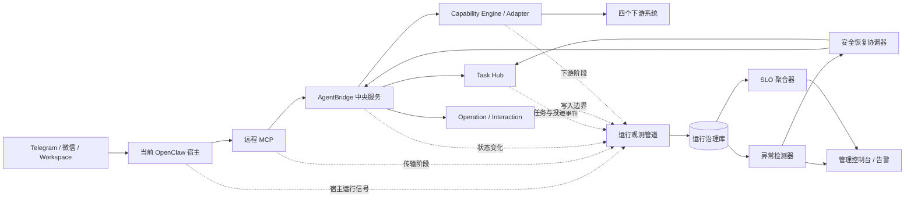

# AgentBridge 运行治理与可靠性二期详细设计

> 实施状态：2026-08-23 已完成整块实现并进入影子观察期。
>
> 当前代码已经具备持久化轨迹、异常检测、试点 SLO、管理端治理、安全恢复账本、就绪探针和
> 一致性备份。正式告警通知、异机灾备和生产 SLO 仍属于后续生产化工作。

> 形成日期：2026 年 8 月 23 日
>
> 状态：已实现二期主体，并启动可靠性影子观察
>
> 适用范围：四系统试点收口后的中央 AgentBridge、Task Hub、管理控制台及当前 OpenClaw 宿主

## 一、设计结论

运行治理与可靠性二期可以在宿主无关化改造之前独立开展，并且不应等待宿主无关化一期完成。

原因是本期治理的核心对象位于 AgentBridge 中央运行面：

- 用户任务、Operation、Interaction、Artifact 和通知投递；
- MCP 请求、能力调用、系统适配器和下游会话；
- 写操作的 `prepare -> authorize -> commit -> verify` 状态机；
- 中央数据库、后台保活、管理控制台、发布和恢复流程；
- 当前 OpenClaw 宿主与 Workspace Gateway 的运行状态。

这些对象不会因以后增加 Reference Host 或其他宿主而消失。本期只需从第一天保留通用的
`hostType`、`hostInstanceId`、`endpointId` 和 `hostRunId` 维度，并通过统一采集接口接收宿主状态，
就能避免把治理模型写死为 OpenClaw 专用。将来开展宿主无关化时，新增的是另一个宿主采集器和
宿主维度的 SLO，不需要重做任务、操作、交互、下游和恢复模型。

两项工作的关系可以概括为：

> 宿主无关化解决“换一个智能体宿主还能不能安全工作”；运行治理解决“无论使用哪个宿主，
> 一次任务卡在哪里、是否产生副作用、应该由谁安全恢复”。

## 二、目标与非目标

### 2.1 本期目标

1. 为每次用户请求建立可跨 Task、Operation、Interaction、Artifact 和投递记录的端到端执行轨迹；
2. 把“慢、失败、等待用户、历史失败、结果未知”区分为可解释、可操作的状态；
3. 建立持久化运行事件、异常事件和恢复动作记录，服务重启后仍能诊断；
4. 定义分阶段 SLI、试点 SLO、错误预算和不计入规则；
5. 自动识别卡住任务、孤儿 Operation、失配 Interaction、投递积压和保活连续失败；
6. 在管理控制台提供任务追踪、异常中心、投递治理、会话保活、SLO 趋势和安全恢复入口；
7. 对副作用前的连接、只读和通知故障提供有边界的自动恢复；
8. 对 `commit` 已尝试或结果未知的写操作保持停止，不自动补发；
9. 建立备份、恢复、重启一致性和故障注入验收；
10. 为以后接入其他宿主保留稳定的通用观测契约。

### 2.2 本期非目标

- 不建设完整的企业级 APM、日志平台或高可用集群；
- 不引入必须依赖 Prometheus、Grafana、ELK 才能工作的运行链路；
- 不在管理控制台代替用户发起、批准、提交或撤销业务流程；
- 不自动重试结果未知的写操作；
- 不把聊天正文、密码、Cookie、业务字段值和短期控制 URL 写入观测库；
- 不在本期修改 OpenClaw 源码，也不以重写 OpenClaw 插件为前提；
- 不把下游系统暂时没有数据误判为系统故障；
- 不承诺尚未经过基线观测验证的生产 SLA。

## 三、当前基础与主要缺口

### 3.1 已有基础

当前实现已经具备二期所需的大部分事实来源：

| 已有对象 | 当前能力 | 二期可复用内容 |
| --- | --- | --- |
| Operation | `pending/running/succeeded/failed/unknown/requires_user_action`、幂等键、错误和时间 | 业务执行节点、写结果和结果未知边界 |
| Interaction | 认证卡、字段卡、授权卡及过期、拒绝、替代、完成状态 | 等待用户与续办阶段 |
| Task Hub | Task、Endpoint、事件、Outbox、Artifact、Continuation 和隔离检查 | 跨端任务、投递、文件和恢复事实 |
| 会话注册表 | 系统会话、主体绑定、状态历史、用户活动和保活时间 | 登录失效、续签和身份隔离 |
| 管理控制台 | 总览、用户、Token、会话、策略、操作、交互、任务、运行和审计 | 二期治理界面的现有骨架 |
| 发布流程 | 单一发布脚本、Release ID、远端检查、MCP 和 OpenClaw 冒烟 | 发布前后对比和版本漂移检查 |
| 协调诊断 | 调用次数、慢调用、错误、最大和最近耗时 | 宿主控制面阶段的初始指标 |

### 3.2 当前缺口

现状主要回答“现在有多少条记录处于某状态”，还不能稳定回答：

- 用户发出请求后，时间究竟耗在宿主排队、模型启动、MCP、AgentBridge、下游还是消息投递；
- 同一任务后续创建的新 Operation 和 Interaction 是否仍属于原始请求；
- 一个 `requires_user_action` 是正常等待用户，还是卡片已失效但任务没有结束；
- 微信历史失败投递是当前故障，还是已失去现实影响的历史记录；
- 进程重启后，之前的慢调用、连续保活失败和异常证据是什么；
- 一次写操作超时发生在 `commit` 之前还是之后，能否安全重试；
- 系统只是 HTTP 端口可访问，还是数据库、后台 Worker 和关键依赖已经可以受理请求；
- 管理员面对异常应该等待、重试通知、暂停写入、要求重新登录，还是人工核对下游结果。

二期的本质不是再增加一组计数，而是建立“执行轨迹、异常判定、恢复边界”三者一致的运行模型。

## 四、设计原则

### 4.1 状态事实优先于日志文本

关键状态变化必须写入结构化记录。普通日志用于补充上下文，不再作为判断任务是否完成、是否越过
写入边界或是否可以重试的唯一依据。

### 4.2 业务任务、执行操作和用户交互保持分离

- **AgentTask**：用户想完成的一件事，可以跨端并包含多个 Operation；
- **Operation**：一次确定的能力执行或审计节点；
- **Interaction**：一次登录、字段填写或执行授权；
- **Artifact**：任务产生并受期限治理的文件；
- **Delivery**：向某个客户端 Endpoint 交付文本、状态、卡片或文件的尝试。

二期不合并这些对象，只用统一 `traceId` 和关联字段把它们串起来。

### 4.3 等待不是失败，历史失败不等于当前故障

以下情况必须单独表达：

- 正常等待用户填写或授权；
- 等待微信用户下一次活动后再投递；
- 已失败但当前仍需处理的投递；
- 已结束任务留下的历史失败记录；
- 到期但无人再请求的历史文件；
- 结果未知且必须人工核对的业务写入。

### 4.4 自动恢复必须服从副作用边界

只读请求、宿主连接、MCP 建连和通知投递可以在明确条件下有限重试。任何可能已执行的业务写入
不得因超时、断线或进程重启而自动再次提交。

### 4.5 观测数据最小化

运行库保存标识、阶段、状态、错误分类、耗时和脱敏维度，不复制聊天正文、完整业务输入、下游
返回正文、秘密、短期 URL 或文件内容。

### 4.6 先建立基线，再承诺 SLO

本文给出试点目标和计算口径。实施后先采集至少一个完整观察窗口，再根据四个系统和不同宿主的
真实分布校准阈值，避免把拍脑袋数字写成生产承诺。

## 五、总体架构



二期初期继续使用现有 SQLite，但增加独立的运行治理表。观测写入不得阻塞业务主事务：状态变化
与其对应的关键运行事件应在同一事实边界内可靠记录；高频进度信号可通过短队列批量落库。若观测
写入失败，业务结果仍以 Operation 和 Task Hub 为准，同时生成本地降级告警。

## 六、核心数据模型

### 6.1 执行轨迹

`RuntimeTrace` 表示一次用户请求从入口到终态的端到端轨迹：

| 字段 | 含义 |
| --- | --- |
| `traceId` | 全局唯一轨迹标识 |
| `userSubject` | AgentBridge 用户主体 |
| `taskId` | 已建立 Task Hub 任务时的任务标识 |
| `originEndpointId` | 发起端点 |
| `hostType` | 当前为 `openclaw`，以后可为 `reference` 等 |
| `hostInstanceId` | 宿主实例，不等同于用户身份 |
| `hostRunId` | 宿主本轮执行标识，可为空 |
| `requestKind` | `read/write/interaction/delivery/admin` |
| `status` | `active/waiting/succeeded/failed/unknown/cancelled` |
| `sideEffectBoundary` | 当前达到的副作用阶段 |
| `startedAt/updatedAt/finishedAt` | UTC 时间 |
| `releaseId` | 执行时 AgentBridge Release |

同一任务由登录卡恢复、字段卡恢复或跨端继续时，沿用原 `traceId` 和 `taskId`，但可以产生新的
`hostRunId` 与 Operation。另一个无关的用户请求不得因为主题相似而复用轨迹。

### 6.2 阶段记录

`RuntimeSpan` 表示轨迹内一个有起止和耗时的阶段：

- `ingress.received`：入口收到用户请求；
- `host.accepted`：宿主接受并创建运行；
- `host.first_progress`：首次向用户或任务时间线报告进展；
- `host.tool_selected`：模型决定调用 AgentBridge；
- `mcp.request`：远程 MCP 请求；
- `capability.invoke`：AgentBridge 能力调用；
- `session.check`：下游会话检查或刷新；
- `adapter.request`：适配器访问下游；
- `interaction.wait`：等待认证、字段填写或授权；
- `interaction.resume`：完成交互后续办；
- `write.prepare`：写入计划冻结；
- `write.commit`：提交尝试；
- `write.verify`：权威回读；
- `task.finalize`：任务终态；
- `delivery.enqueue` 与 `delivery.complete`：交付入队和完成。

Span 至少包含 `spanId`、`traceId`、父 Span、阶段名、状态、开始和结束时间、耗时、系统、能力、
Operation、Interaction、Artifact、Delivery、错误分类和副作用边界。不得包含业务正文。

### 6.3 运行信号

`RuntimeSignal` 保存不一定属于单一用户请求的运行事实，例如：

- 服务启动、停止、Release 变化和 Worker 心跳；
- 会话保活周期及 active、eligible、keptAlive、expired、deferred、outsideLease 数量；
- Workspace Gateway 或宿主控制面检查结果；
- 数据库繁忙、Outbox 积压、Artifact 清理和任务修复；
- 依赖状态由健康变为降级或恢复。

### 6.4 异常事件

`RuntimeIncident` 是需要管理员判断或处置的异常，不等同于每一条错误日志：

| 字段 | 含义 |
| --- | --- |
| `incidentId` | 异常标识 |
| `fingerprint` | 去重键，如系统、错误类、阶段和对象 |
| `severity` | `P0/P1/P2/P3` |
| `state` | `open/acknowledged/investigating/resolved/suppressed` |
| `symptomCode` | 用户或上层看到的症状 |
| `rootCauseCode` | 已诊断原因，未知时为空 |
| `actionability` | `current/deferred/historical/manual_reconciliation` |
| `traceId/objectRefs` | 关联轨迹和对象 |
| `firstSeenAt/lastSeenAt/resolvedAt` | 生命周期 |
| `evidenceSummary` | 不含敏感内容的证据摘要 |
| `recommendedAction` | 安全的建议动作 |

相同指纹在抑制窗口内只更新次数和最后发生时间，不重复刷屏。已结束任务上的旧投递失败应转为
`historical`，不能持续占用“当前异常”首页。

### 6.5 恢复动作

`RecoveryAction` 记录每次自动或人工恢复：动作类型、目标、发起者、原因、幂等键、执行前状态、
结果、执行后状态和审计时间。自动动作使用固定系统主体，人工动作关联管理员账户。

## 七、关联标识与传播规则

标准关联链为：

```text
traceId
  -> taskId
    -> hostRunId / toolCallId
      -> operationId
        -> interactionId
        -> artifactId
    -> deliveryId
```

传播规则：

1. Endpoint 接受用户请求时创建或恢复 `traceId`；
2. OpenClaw 插件通过现有宿主私有上下文把 `traceId/taskId/hostRunId` 传给 MCP；
3. MCP 中间层只接受当前身份可访问的 Task，不允许模型任意指定别人的标识；
4. CentralCapabilityService 创建 Operation 时写入 `traceId/taskId`；
5. Interaction、Artifact、Outbox 和时间线事件从受信任运行上下文继承关联；
6. 缺少宿主标识时，AgentBridge 仍可创建中央轨迹并标记 `hostType=unknown`，不能因此拒绝 L1 调用；
7. 重试和续办沿用轨迹，但每次执行拥有新的 Span 和尝试序号；
8. 标识可以进入管理端，但不得作为普通用户跨身份访问数据的授权依据。

## 八、副作用边界

所有执行必须标记当前达到的最高副作用阶段：

| 边界 | 含义 | 自动恢复原则 |
| --- | --- | --- |
| `B0_NO_EFFECT` | 尚未进入 AgentBridge 业务能力 | 可有限重连或重新排队 |
| `B1_READ_ONLY` | 只执行会话检查或业务读取 | 可按策略有限重试 |
| `B2_INTERACTION_CREATED` | 已创建可信交互，未提交业务 | 恢复同一交互，不重复创建卡片 |
| `B3_PREPARED_AUTHORIZED` | 计划已冻结或已授权，尚未提交 | 可恢复状态；需要重新准备时必须重新核对 |
| `B4_COMMIT_ATTEMPTED` | 已向下游发出可能产生副作用的请求 | 禁止自动重试，进入核对 |
| `B5_VERIFIED` | 权威回读已确认结果 | 可安全投递终态，不再提交 |

`MCP_TIMEOUT` 之类的上层症状必须同时带出边界。`B0/B1` 的超时与 `B4` 的超时不能使用同一个
“稍后重试”建议。

## 九、故障分类

### 9.1 分层分类

| 层级 | 典型代码 | 说明 |
| --- | --- | --- |
| 客户端与 Endpoint | `ENDPOINT_OFFLINE`、`ENDPOINT_NOT_BOUND` | 浏览器、Telegram、微信端点不可用或未绑定 |
| 宿主与渠道 | `HOST_STARTUP_SLOW`、`HOST_UNAVAILABLE`、`CHANNEL_DELIVERY_DEFERRED` | OpenClaw 冷启动、Gateway 或消息渠道问题 |
| MCP 传输 | `MCP_CONNECT_FAILED`、`MCP_TIMEOUT_BEFORE_EFFECT` | 请求尚未被中央能力接受或传输中断 |
| 中央服务 | `SERVICE_UNAVAILABLE`、`DATABASE_BUSY`、`WORKER_STALLED` | 进程、数据库和后台 Worker 问题 |
| 身份与会话 | `IDENTITY_NOT_PROVISIONED`、`SESSION_EXPIRED`、`SESSION_REFRESH_FAILED` | 用户、系统主体或下游登录问题 |
| 任务与交互 | `TASK_STALLED`、`ORPHAN_OPERATION`、`INTERACTION_STALE` | 状态机没有按预期推进 |
| 投递与文件 | `OUTBOX_BACKLOG`、`DELIVERY_FAILED`、`ARTIFACT_EXPIRED` | 结果已产生但交付或文件期限有问题 |
| 下游适配 | `DOWNSTREAM_TIMEOUT`、`DOWNSTREAM_UNAVAILABLE`、`CONTRACT_MISMATCH` | 目标系统或适配契约问题 |
| 业务与策略 | `BUSINESS_REJECTED`、`PERMISSION_DENIED`、`WRITE_PAUSED` | 确定性业务拒绝或治理策略 |
| 结果未知 | `RESULT_UNKNOWN` | 已越过提交边界但无法权威确认 |

### 9.2 症状与根因分离

用户看到的“OpenClaw 暂时无响应”是症状。根因可能是宿主冷启动、外部渠道网络探测超时、MCP
建连、中央服务不可用或下游请求过慢。Incident 先记录症状，再根据阶段证据补充根因；缺少证据时
保持 `rootCauseCode` 为空，不用猜测覆盖事实。

### 9.3 可操作性分离

- `current`：仍影响活动任务，需要处置；
- `deferred`：等待用户或端点活动，暂不消耗重试；
- `historical`：任务已终止，仅用于趋势和审计；
- `manual_reconciliation`：写结果未知，必须到权威系统核对。

## 十、异常识别规则

阈值必须配置化，并按对象状态计算，而不是使用一个全局超时。

| 规则 | 初始建议 | 不应触发的情况 |
| --- | --- | --- |
| 接受后无首次进展 | 15 秒告警提示，60 秒形成 P2 | 请求尚未被宿主接受 |
| 运行中无任何事件 | 连续 120 秒形成 P2 | 正常 `waiting_user` |
| Operation 运行过久 | 按能力基线的最大值或配置阈值 | 下游已返回、仅等待投递 |
| 孤儿 Operation | Task 已终态但 Operation 仍 `pending/running` | 独立 L1 MCP 调用没有 Task |
| Interaction 失配 | 卡片已过期/完成，Task 仍永久等待同一交互 | 已创建替代交互并更新 Task |
| 投递积压 | 非 `deferred` 投递超过重试和年龄阈值 | 微信等待新入站活动的 `deferred` |
| 历史失败污染 | 已终态任务仍计入当前待处置 | 历史趋势页中的归档统计 |
| Artifact 不可交付 | 用户仍请求下载但文件过期且不可重新生成 | 无人请求的自然到期文件 |
| 会话保活异常 | 连续周期失败、明确 expired 或连续 deferred 超阈值 | 正常 `outsideLease` |
| 宿主控制面异常 | 有调用需求且连续检查失败 | 长期无流量的空闲宿主 |
| 版本漂移 | 服务器、MCP 画像和发布记录 Release 不一致 | 正在声明的维护窗口 |
| 身份隔离异常 | 任意跨用户关联计数大于 0，立即 P0 | 无例外 |

首次实施不直接开启所有告警。先以“影子检测”运行一个观察窗口，对照真实任务调整阈值和排除规则，
再逐类转为正式异常。

## 十一、健康检查与依赖状态

### 11.1 三层健康语义

1. **存活 `healthz`**：进程能够接受 HTTP，只用于进程管理；
2. **就绪 `readyz`**：数据库可用、Schema 正确、核心配置有效、后台 Worker 正常，可以受理请求；
3. **依赖诊断**：宿主、Workspace Gateway、会话 Provider 和四个下游系统的最近检查状态。

下游用户是否已登录不应让整个 AgentBridge `readyz` 失败。它属于特定用户、特定系统的会话状态。

### 11.2 依赖状态

统一使用：

- `healthy`：最近检查成功且未过期；
- `degraded`：仍可提供部分能力，但延迟、投递或刷新异常；
- `unavailable`：当前无法提供相关能力；
- `unknown`：没有足够的新证据；
- `maintenance`：管理员声明的维护窗口。

每条状态必须附带 `checkedAt`、证据来源和有效期。页面不得把“最后一次成功”显示为无限期实时健康。

### 11.3 深度诊断边界

自动健康循环优先使用无业务副作用的探针。需要真实访问下游数据的检查只能由管理员按需触发，
并明确使用哪个用户身份；不能通过后台健康检查读取待办、日志、知识库正文或照明业务列表。

## 十二、SLI 与试点 SLO

下表为实施后的初始试点目标，不是当前已达到的事实，也不是生产合同：

| 目标面 | SLI 口径 | 初始目标 |
| --- | --- | --- |
| 中央就绪 | `readyz` 成功时间占比 | 月度不低于 99.5% |
| 请求受理 | 入口收到到宿主接受 | P95 不高于 3 秒 |
| 首次进展 | 宿主接受到首次可见进展 | P95 不高于 15 秒 |
| MCP 中央开销 | MCP 进入到能力开始，不含模型和下游 | P95 不高于 1 秒 |
| 只读成功 | 排除空结果、需登录和确定性业务拒绝后的成功率 | 各系统单独基线，试点不低于 99% |
| 写入核验 | 已提交写操作具有权威回读的比例 | 100% |
| 重复提交 | 同一授权产生重复副作用 | 0 |
| 结果未知 | `RESULT_UNKNOWN` | 每次立即 P1，目标 0 |
| 身份隔离 | 跨用户关联或数据暴露 | 0，出现即 P0 |
| 当前卡住任务 | 超过状态阈值且仍可操作的任务 | 目标 0 |
| 非延迟投递 | 可直推 Endpoint 的终态交付耗时 | 按客户端分别统计 |
| 会话保活 | 有资格会话的保活周期成功率 | 观察后按系统分别设定 |

统计规则：

- 用户填写或授权等待时间不计入系统执行延迟，但单独统计交互等待时长；
- 微信 `deferred` 不计入直推失败率，单独统计等待活动时长；
- 业务空列表是成功结果，不计为错误；
- 登录过期是可预期业务状态，计入会话可用性，不计入中央服务可用性；
- 管理员维护窗口从可用性分母中扣除，但必须有审计记录；
- 各下游系统分开统计，不能用一个快系统掩盖另一个慢系统；
- OpenClaw 冷启动和外部渠道探测与 AgentBridge 中央开销分开统计。

## 十三、存储与保留

### 13.1 新增表

一期建议在现有 SQLite 中新增：

- `runtime_traces`：端到端轨迹；
- `runtime_spans`：阶段与耗时；
- `runtime_signals`：服务、Worker、保活和依赖信号；
- `runtime_incidents`：可操作异常；
- `runtime_incident_events`：确认、诊断、抑制和解决历史；
- `runtime_recovery_actions`：自动与人工恢复；
- `runtime_slo_rollups`：按小时、天、系统、宿主和能力聚合的 SLI。

现有 Operation、Interaction、Task、Outbox 和 Artifact 表仍是各自状态的权威来源。治理表保存关联和
诊断，不复制完整对象。

### 13.2 保留策略

建议默认：

- 原始 Span 和 Signal 保留 30 天；
- 小时和日聚合保留 180 天；
- Incident、RecoveryAction 和管理审计保留至少 1 年；
- 标识脱敏后可用于更长期趋势；
- 保留期均可配置，并由后台小批量清理，避免长事务阻塞业务。

### 13.3 写入可靠性

- 时间统一使用 UTC，页面按管理员时区展示；
- 耗时同时使用单调时钟计算，避免系统时间调整产生负值；
- 关键状态事件使用唯一键去重；
- 观测库繁忙时短暂重试，超过阈值生成降级信号；
- 进程内慢调用缓存改为持久化聚合，服务重启后不清零历史；
- 所有 Schema 变更必须可前向迁移，并经过旧库升级测试。

## 十四、管理控制台二期

现有页面继续保留，在其上增加以下治理视图。

### 14.1 运行态势

- 当前 P0/P1/P2 异常数量；
- 四系统、AgentBridge、OpenClaw、MCP、Task Hub 和 Workspace Gateway 依赖图；
- 当前卡住任务、结果未知写入、投递积压和连续保活失败；
- 最近发布、版本漂移和观察窗口状态；
- 当前故障与历史趋势严格分栏。

### 14.2 任务追踪

管理员按 Task、Trace、Operation、用户、系统、能力和时间搜索，查看：

- 端到端瀑布图和各阶段耗时；
- Task、Operation、Interaction、Artifact、Delivery 的关联关系；
- 当前副作用边界；
- 最后一条可信事件和下一步建议；
- 是否正在等待用户、等待 Endpoint、等待下游、需要人工核对或已经终止。

页面只显示脱敏摘要，不显示聊天正文、业务字段值或下游返回正文。

### 14.3 异常中心

- 按严重级别、系统、宿主、根因、可操作性和状态筛选；
- 显示首次、最后发生时间、影响对象、次数、证据和建议动作；
- 支持确认、分派、维护期抑制和解决；
- 支持把误报标记为规则反馈，但不直接删除证据；
- 同一根因聚合，避免每个任务产生一条重复告警。

### 14.4 投递治理

分别展示：

1. 当前待投递；
2. 等待 Endpoint 活动的延迟投递；
3. 已耗尽重试且仍影响活动任务的失败；
4. 已终止任务的历史失败；
5. 已归档记录。

管理员可对副作用后的“结果通知”重新投递，但不能因此重做业务操作。重新投递必须复用原事件，
写入恢复动作和管理审计。

### 14.5 会话与保活

- 每轮保活的 active、eligible、keptAlive、expired、deferred 和 outsideLease；
- 按系统和用户显示连续成功/失败次数；
- 明确区分“租约外”“状态未知”“明确过期”和“刷新失败”；
- 支持实时只读检查、失效和重新绑定现有治理动作；
- 不因管理员查看页面自动延长用户业务活动租约。

### 14.6 SLO 与趋势

- 按宿主、系统、能力、客户端和版本查看成功率、P50/P95/P99 和错误分类；
- 对比发布前后窗口；
- 显示错误预算消耗和主要贡献原因；
- 标记样本量不足，避免小样本百分比误导。

### 14.7 恢复与演练

只提供白名单动作：

- 重新检查只读依赖；
- 对副作用前失败的只读请求执行一次受控重试；
- 恢复等待 Endpoint 活动后可投递的消息；
- 重新投递已经确定的终态通知；
- 重新生成仍有权重新获取的过期文件入口；
- 对明确过期会话发起新的可信登录；
- 按系统、用户或能力暂停和恢复写入；
- 运行备份、恢复验证和状态一致性只读检查。

本期仍不在网页中直接执行 SSH、`systemctl` 或任意服务器命令。服务重启沿用发布与运维脚本，
控制台展示步骤、状态和结果，不提供通用命令执行器。

## 十五、告警设计

### 15.1 严重级别

| 级别 | 示例 | 处置目标 |
| --- | --- | --- |
| P0 | 身份隔离违规、未授权写入、重复业务提交 | 立即暂停相关写能力并人工处理 |
| P1 | `RESULT_UNKNOWN`、数据库不可用、中央服务不可用、批量当前任务失败 | 立即通知并启动人工核对或恢复 |
| P2 | 卡住任务、投递积压、连续保活失败、宿主不可用、版本漂移 | 工作时段尽快处理 |
| P3 | 慢调用趋势、历史失败增长、容量接近阈值 | 纳入维护计划 |

### 15.2 投递策略

第一阶段以管理控制台异常中心为权威入口，并提供一个独立运维通知通道。不能只通过正在故障的
同一聊天通道发告警。告警支持指纹去重、抑制窗口、维护窗口、升级和恢复通知。

### 15.3 防止告警风暴

- 同一根因聚合影响任务数；
- 宿主不可用时抑制由它派生的大量 MCP 连接错误；
- 下游系统不可用时聚合到系统级 Incident；
- 等待用户和等待微信活动不产生周期性失败告警；
- 历史失败只进入趋势，不重复推送；
- 恢复后发送一次恢复通知并关闭 Incident。

## 十六、安全恢复矩阵

| 故障场景 | 自动动作 | 人工动作 | 禁止动作 |
| --- | --- | --- | --- |
| 宿主尚未接受请求 | 有限重连或重新排队一次 | 检查 Gateway 和宿主进程 | 无限唤醒模型 |
| 接受后 15 秒无进展 | 在确认未进入能力前恢复宿主运行一次 | 查看阶段轨迹 | 同时启动多个相同运行 |
| MCP 建连失败 | 在中央未接受前有限重试 | 检查 TLS、Token 和服务 | 不明边界时直接重放 |
| 只读下游超时 | 使用同一关联和策略有限重试 | 按系统检查依赖 | 把空列表当超时 |
| 正常等待交互 | 轮询或事件恢复同一 Interaction | 重新打开仍有效卡片 | 重复创建多张同类卡 |
| Interaction 已失效 | 终止旧等待并按需创建新交互 | 用户重新操作 | 使用旧授权继续 |
| 通知投递失败 | 按 Outbox 规则重试或延迟 | 重投已确定终态 | 重做业务操作 |
| 文件过期 | 用户请求时按权限重新生成入口 | 核对源文件仍可获取 | 永久暴露下载 URL |
| 数据库短暂繁忙 | 短事务退避重试 | 检查锁和容量 | 长事务阻塞所有请求 |
| 服务重启 | 从 Task、Interaction、Outbox 恢复 | 执行一致性检查 | 丢弃等待状态 |
| 会话明确过期 | 创建可信登录交互 | 用户重新登录 | 在聊天中收集密码 |
| `commit` 已尝试 | 不自动重试，进入核对 | 到权威系统查询结果 | 自动再次提交 |
| `RESULT_UNKNOWN` | 暂停该操作自动推进 | 人工核对并记录结论 | 以“可能失败”为由重发 |

所有自动恢复都必须满足：固定最大次数、稳定幂等键、可记录、可关闭，并能证明尚未越过禁止重试的
副作用边界。

## 十七、备份、恢复与重启一致性

### 17.1 备份对象

- AgentBridge SQLite 在线一致性备份；
- 配置 Schema、Release ID、已启用系统和能力目录摘要；
- 加密会话存储和其密钥管理说明，密钥不得进入普通备份日志；
- 发布包和依赖锁定信息；
- 管理审计和运行治理表。

### 17.2 恢复演练

恢复必须先进入隔离目录或隔离实例，禁止向真实下游发送请求。演练至少验证：

1. 数据库完整性和 Schema 版本；
2. 用户、系统会话、Task、Operation、Interaction、Artifact 和 Outbox 数量一致；
3. 跨用户隔离检查为 0；
4. 等待用户的任务可以恢复为等待状态，不自动提交；
5. 已提交但未核验的写操作恢复为人工核对；
6. 已确定的终态通知可以重新投递；
7. 过期租约不会因恢复而重新取得所有权；
8. 恢复实例默认关闭下游写能力和外部通知。

### 17.3 服务重启验收

每次涉及状态机或数据库的发布，至少模拟以下重启点：等待登录、等待字段、等待授权、通知待投递、
文件待下载和只读调用结束后。不得在真实写入 `commit` 中间通过故意杀进程进行试验；该边界使用
模拟适配器验证。

## 十八、与宿主无关化的接口边界

### 18.1 本期立即保留的通用字段

- `hostType`、`hostInstanceId`、`hostVersion`；
- `endpointType`、`endpointId`；
- `hostRunId`、`toolCallId`；
- `hostAcceptedAt`、`firstProgressAt`；
- 宿主健康、排队深度、冷启动和通道状态的通用 Signal。

### 18.2 宿主采集器契约

定义内部 `HostRuntimeCollector` 接口：

```text
snapshot() -> HostRuntimeSnapshot
correlate(hostRunId, traceId, taskId) -> CorrelationResult
classify(error) -> RuntimeFailure
safe_recover(action, context) -> RecoveryResult
```

一期只有 OpenClaw 实现。以后 Reference Host 使用同一接口，不修改中央 Incident、SLO 或控制台
数据模型。

### 18.3 可以独立完成的内容

- 持久化 Trace、Span、Signal、Incident 和 RecoveryAction；
- 任务、操作、交互、投递、文件和会话异常检测；
- 副作用边界和恢复矩阵；
- 管理控制台二期、SLO、告警、备份和恢复演练；
- OpenClaw 当前运行采集器。

### 18.4 留待宿主无关化时补齐的内容

- Reference Host 的采集器和实例身份；
- 多宿主之间的版本、排队和可用性对比；
- 宿主能力分级与治理数据的标准对外 Schema；
- 宿主切换或迁移时的任务所有权转移规则。

这些后续项不阻塞本期实施。

## 十九、实施工作包

### 工作包 A：持久化执行轨迹

- 新增治理表和迁移；
- 建立 Trace/Span/Signal 写入 API；
- 贯通 Endpoint、OpenClaw、MCP、CentralCapabilityService、Adapter、Interaction 和 Outbox；
- 把现有进程内协调耗时迁入持久化聚合；
- 确保业务正文和秘密不进入治理库。

### 工作包 B：异常检测与故障分类

- 实现统一错误分类和副作用边界；
- 建立影子检测器；
- 覆盖卡住 Task、孤儿 Operation、Interaction 失配、投递和 Artifact；
- 持久化保活周期和连续失败；
- 区分当前、延迟、历史和人工核对。

### 工作包 C：管理控制台二期

- 增加运行态势、任务追踪、异常中心、投递治理、会话保活和 SLO 页面；
- Operation 和多端任务页链接到 Trace；
- 增加 Incident 生命周期和白名单治理动作；
- 保留现有角色、CSRF、审计和数据最小化边界。

### 工作包 D：安全恢复协调器

- 建立恢复动作白名单、幂等和次数限制；
- 实现宿主副作用前单次恢复、只读重试、通知重投和文件重新生成；
- 对 `B4_COMMIT_ATTEMPTED` 强制人工核对；
- 验证重启后不重复创建卡片或提交业务。

### 工作包 E：SLO、告警和运行手册

- 先采集基线，再启用正式阈值；
- 实现小时和日聚合；
- 建立异常去重、维护窗口和恢复通知；
- 为 P0/P1/P2 形成中文 Runbook；
- 记录四系统和不同客户端的独立指标。

### 工作包 F：备份与故障演练

- 在线备份和隔离恢复脚本；
- 状态一致性检查；
- 模拟宿主、MCP、数据库、下游、会话、投递和重启故障；
- 把治理验收纳入统一发布流程。

## 二十、测试与验收方案

### 20.1 自动测试

1. Trace 关联、Span 顺序、幂等和跨用户拒绝；
2. Operation、Interaction、Task 和 Delivery 状态组合的异常分类；
3. 等待用户、微信延迟、历史失败和空业务结果不误报；
4. 试点 SLI 的分母、排除规则、分位数和小样本处理；
5. 数据库迁移、保留清理和旧库升级；
6. Incident 去重、确认、抑制、解决和再发生；
7. RecoveryAction 次数、幂等、副作用边界和审计；
8. 控制台 API 不泄露正文、字段、Token、URL 和通道路由；
9. Release 变化和服务重启后轨迹、异常与聚合仍存在；
10. 两用户、四 Endpoint 的隔离诊断继续为 0。

### 20.2 故障注入矩阵

使用模拟适配器和测试宿主注入：

- 宿主不可用、冷启动慢和接受后无进展；
- MCP 建连失败、能力开始前超时和响应丢失；
- 数据库短锁和持久化治理写入失败；
- 下游登录过期、刷新失败、读取超时和确定性业务拒绝；
- `commit` 前失败、`commit` 后断线和权威回读失败；
- Interaction 完成后服务重启、过期后仍被 Task 引用；
- Outbox 直推失败、微信延迟、Endpoint 恢复和历史归档；
- Artifact 到期、重新生成和无权访问；
- 跨用户 Task、Operation、Interaction、Artifact 和投递关联攻击。

真实四系统只做只读、登录状态和已有低风险路径的受控冒烟。结果未知等危险边界使用模拟器证明，
不为了测试而制造真实业务不确定结果。

### 20.3 管理控制台验收

使用浏览器自动化验证：

- 当前异常与历史记录不混在一起；
- Trace 瀑布图时间顺序、阶段耗时和对象链接正确；
- 等待用户状态不会被显示为执行失败；
- `B4_COMMIT_ATTEMPTED` 页面没有自动重试按钮；
- 白名单恢复动作要求原因并生成管理审计；
- 两个管理员会话、角色权限和 CSRF 仍正确；
- 桌面和移动宽度下表格、时间线和异常详情可阅读且不重排错乱。

### 20.4 观察窗口

上线后分三步：

1. **影子期**：只记录轨迹和异常候选，不通知、不自动恢复；
2. **告警期**：启用去重告警，恢复动作仍由人工触发；
3. **受控恢复期**：只开放经故障注入证明安全的副作用前自动动作。

每一步都要复核误报、漏报、数据库增长、页面性能和隐私字段，再进入下一步。

## 二十一、完成标准

以下条件全部满足才算运行治理与可靠性二期完成：

1. 任一活动任务可以从入口追踪到 Task、Operation、Interaction、下游、Artifact 和 Delivery；
2. 管理员能够回答“卡在哪里、最后事实是什么、是否可能产生副作用、下一步该做什么”；
3. 当前异常、等待用户、延迟投递、历史失败和人工核对互不混淆；
4. 关键运行证据和慢调用在服务重启后仍保留；
5. `healthz`、`readyz` 和依赖诊断语义分离；
6. 四系统、OpenClaw、MCP、Task Hub 和 Workspace Gateway 可分层定位；
7. 结果未知写入从不自动重试，并能进入人工核对闭环；
8. 只读、通知和宿主副作用前恢复通过故障注入且次数有界；
9. 双用户和多端隔离检查始终为 0；
10. SLI 口径、试点 SLO、排除规则和基线窗口有可复核数据；
11. 备份、隔离恢复和重启一致性演练通过；
12. 自动测试、控制台浏览器验收、四系统只读冒烟和发布验收全部通过；
13. 不修改 OpenClaw 源码，不恢复旧浏览器桥，不引入客户端部署负担；
14. 后续增加 Reference Host 时只需增加宿主采集器，不重做中央治理模型。

## 二十二、推荐启动顺序

建议先实施一个“可观测但不自动处置”的纵切：

1. 新增 Trace、Span、Signal 和 Incident 数据表；
2. 贯通 Workspace/OpenClaw -> MCP -> AgentBridge -> 一个只读适配器 -> 投递；
3. 在管理台显示单条请求的阶段瀑布图；
4. 加入等待用户、微信延迟和历史失败三类防误报规则；
5. 持久化会话保活周期和宿主控制面耗时；
6. 运行影子检测并采集基线；
7. 再扩展到全部四系统、写入边界、告警和安全恢复。

这一顺序能够尽早验证数据模型是否真正解释现有慢请求和卡住任务，同时不改变当前业务能力和
写入安全行为。

## 二十三、实际落地结果

### 23.1 持久化对象

中心数据库新增 `runtime_traces`、`runtime_spans`、`runtime_signals`、`runtime_incidents`、
`runtime_incident_events`、`runtime_recovery_actions` 和 `runtime_slo_rollups`。这些表与
Operation、Interaction、Task Hub 共用一个 SQLite WAL 数据库，因此同一个任务在服务重启后仍
能按 `taskId`、`operationId`、`interactionId` 和 `deliveryId` 找到执行证据。

轨迹覆盖以下阶段：

```text
host.accepted / host.first_progress
  -> mcp.request
  -> capability.invoke
  -> adapter.request
  -> interaction.wait / interaction.resume
  -> delivery.claimed / delivery.result
  -> artifact.delivery
```

OpenClaw 业务工具调用携带宿主类型、实例、任务和运行标识。中央服务仍是轨迹事实源；插件不会
收到治理数据库写权限，也不需要修改 OpenClaw 源码。

### 23.2 副作用与恢复

每条 Trace 和 Span 保存其到达的最远副作用边界 `B0` 至 `B5`。写操作达到
`B4_COMMIT_ATTEMPTED` 后若结果未知，会生成 P1 人工核对事件，管理端不提供自动重试。当前
开放的治理恢复只有：

- 重投状态已经确定的通知；
- 归档失败或已确认的历史投递；
- 立即执行一次异常检测；
- Workspace Gateway 在没有业务工具活动前执行一次既有有界恢复，并记录到恢复账本。

所有管理恢复要求原因、幂等键和管理员权限，并同时写入 RecoveryAction 与管理审计。

### 23.3 检测、SLO 与保留

独立治理线程每分钟评估卡住的 Operation、Task、活动任务投递积压、结果未知写入和跨用户隔离
异常。它不依赖任何系统的登录保活是否开启。当前试点 SLO 使用 24 小时窗口，包含终态 Trace
成功率、写后权威核验覆盖率、身份隔离异常数、结果未知数，以及关键阶段 P95 延迟。活动和等待
用户的 Trace 不进入成功率分母。

原始 Trace、Span 和 Signal 默认保留 30 天，SLO 聚合默认保留 180 天；Incident、恢复账本和
管理审计不由原始轨迹清理任务删除。活动观察默认每小时采集一份中央摘要，并按 UTC 日期派生
日汇总；观察到期时自动完成。当前阈值用于影子观察，不作为正式生产 SLA。

### 23.4 就绪与备份

`healthz` 只证明 HTTP 监听仍活着；管理端和 Workspace 的 `readyz` 还会检查 SQLite
`quick_check`、关键业务表和治理表。发布验收使用 `readyz`，不再把“端口能连”当成“可以接活”。

`agentbridge-backup.timer` 每天在北京时间 02:20 附近执行 SQLite 在线一致性备份，保留 30 天。
备份创建后立即在只读隔离连接中执行：

1. SQLite `quick_check`；
2. 必要表检查；
3. 关键表行数统计；
4. Trace、Span、Task 的跨用户关联检查；
5. SHA-256 清单校验。

发布流程会启动一次备份服务并检查 timer 与最近结果。当前还提供隔离恢复演练：把最新备份复制到
独立的 `restore-drills` 目录，以只读模式打开，验证恢复哈希一致并证明写探针被拒绝，全程不启动
第二套服务、不调用业务系统。该演练不等于异机灾备完成；后者仍需在独立主机上演练恢复时间、
会话密钥和文件缓存补齐。

### 23.5 当前观察期边界

本次实现进入“影子期”，即自动采集、自动分类、管理端展示和安全白名单恢复已经启用，但不向
业务用户自动发送运行告警，也不根据 SLO 自动暂停系统。P0/P1 由管理员在事件治理页确认、调查、
解决或抑制。待积累足够基线并核对误报后，再决定是否进入告警期。
