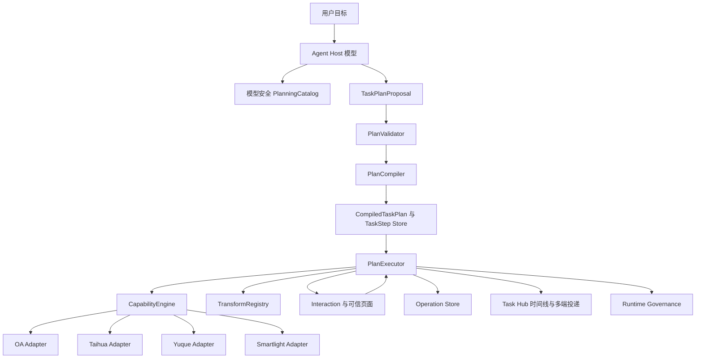
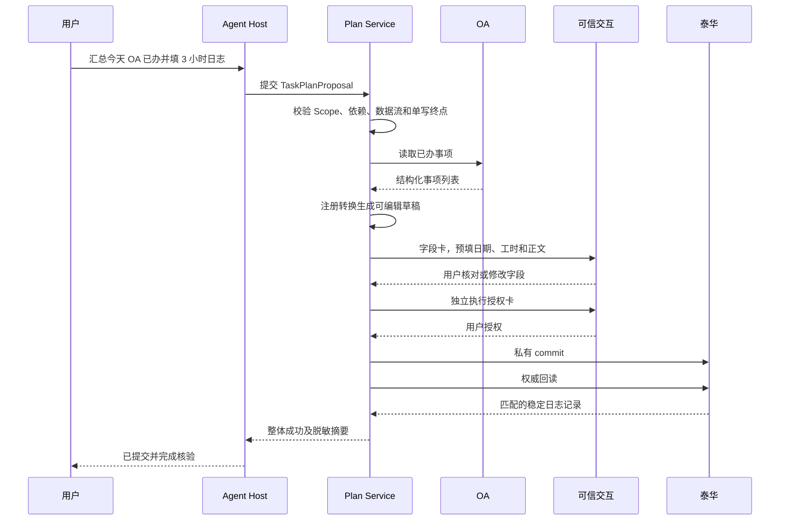

# 通用持久化任务计划与跨系统编排详细设计

## 一、文档状态

- 状态：一期内核与单写终点已实现，自动验收和线上 Workspace 零写入真实验收均通过；
- 更新日期：2026 年 8 月 31 日；
- 所属阶段：跨系统编排一期；
- 首个验收场景：汇总指定时间范围内的 OA 已办事项，生成可编辑的泰华工作日志草稿，
  经字段核对和独立授权后正式提交并权威回读；
- 依赖：[目标架构](./面向智能体的遗留系统适配设计.md)、
  [受控写入模型](./受控写入模型.md)、
  [多端智能体任务接续设计](./多端智能体任务接续设计.md)、
  [宿主无关化与标准远程协议接入一期详细设计](./宿主无关化与标准远程协议接入一期详细设计.md)、
  [运行治理与可靠性二期详细设计](./运行治理与可靠性二期详细设计.md)和
  [批量受控任务编排设计](./批量受控任务编排设计.md)。

本文定义通用的持久化任务计划、确定性校验和中心端执行机制。首个 OA 到泰华场景只作为验收
样例，不在中心服务中实现一个名为“OA 已办转日志”的专用协调器。

## 二、决策摘要

本阶段采用以下决策：

1. 跨系统任务建立在现有业务能力之上，不允许编排器直接调用任意 HTTP、Shell、JavaScript、
   页面选择器或隐藏 commit；
2. Agent Host 中的模型可以根据用户目标和模型可见能力目录提出一份结构化计划；
3. AgentBridge 中央服务负责确定性校验、编译、持久化、调度、可信交互、幂等和结果核验；
4. 一份用户目标继续对应一个 `AgentTask`，计划步骤分别关联现有 `Operation` 和 `Interaction`；
5. 一期支持多系统读取、注册转换、用户核对和一个受控写入终点；
6. 一期不建设完整 DAG 调度平台，不支持循环、任意脚本、自动生成新 API 或多个业务写入；
7. 数据模型预留 `dependsOn`，当前按确定、有限的步骤顺序执行；真实并行、分支汇聚和多写 Saga
   只在出现重复业务需求后升级；
8. 写入仍完整执行 `prepare -> authorize -> commit -> verify`，计划存在不能替代字段确认或授权；
9. OpenClaw 和 Reference Host 使用同一个计划协议，任何具体跨系统业务逻辑都不得写入宿主插件。

一句话概括：

> 模型负责提出“准备怎样办”，中央服务负责判断“能不能这样办”并可靠地“按批准后的步骤办完”。

## 三、为什么不直接依赖模型连续调用工具

当前智能体已经可以在一个未中断的模型回合中完成：

```text
读取 OA 已办
  -> 模型整理文字
  -> 调用泰华日志 prepare
  -> 用户填写和授权
  -> 提交日志
```

这可以作为临时只读组合方式，但不能作为可靠跨系统执行的权威状态机：

- 模型上下文丢失后，系统不知道哪些 OA 事项已经读取和采用；
- 登录、字段卡或授权卡等待期间，宿主重启可能要求用户重新描述原任务；
- 模型可能重复读取、重复 prepare，或者把旧结果传给新的写入；
- 多端只能看到若干 Operation 和 Interaction，无法得到权威的整体阶段和剩余步骤；
- 无法证明最终写入使用的是哪一版来源数据和哪一版转换结果；
- 换成另一个 Agent Host 后，原宿主提示词中的隐式编排经验不能自动继承。

因此需要把“任务计划和当前步骤”从模型记忆提升为 AgentBridge 的持久化事实。

## 四、为什么一期不建设完整 DAG 引擎

跨系统不天然等于复杂图调度。当前高价值候选任务大多是有限的顺序流程，中间穿插登录、字段
核对和授权，真正困难的是可靠暂停、恢复和副作用治理，而不是大规模并行计算。

完整 DAG 引擎会立即引入：

- 动态拓扑、并行队列、分支汇聚和资源调度；
- 所有能力输入输出的严格类型推导；
- 动态 fan-out、循环替代和复杂失败传播；
- 图级版本迁移、重规划和可视化编辑；
- 多个写节点的分布式一致性、补偿和部分成功语义。

这些能力目前没有足够真实场景证明其必要性。相反，一期采用“有依赖描述的持久化任务计划”：

- 数据结构允许步骤声明 `dependsOn`；
- 校验器拒绝环；
- 执行器一期同一时间只推进一个业务步骤；
- 后续增加并行调度时，不需要推翻计划、步骤和数据绑定模型。

从数学上看，顺序计划也是一个简单有向无环结构；从产品和工程定位上，本阶段不把 DAG 当作
核心卖点，也不承担通用工作流平台的全部复杂度。

## 五、目标与非目标

### 5.1 一期目标

1. 根据自然语言目标，由宿主模型提出只包含已注册公共能力的计划；
2. 中央服务在执行前验证能力、参数、依赖、权限、身份、数据流和副作用；
3. 每个步骤有稳定状态、幂等键、Operation/Interaction 引用和可恢复位置；
4. 登录、业务字段和执行授权完成后，不要求用户再次发送“继续”；
5. 同一计划可读取多个已绑定系统，但最多只有一个受控写入终点；
6. 写入目标、字段和来源发生变化时，旧授权失效；
7. Workspace、Telegram、微信、OpenClaw 和 Reference Host 看到同一任务阶段与终态；
8. 宿主或中心服务重启后从未完成步骤恢复，不从第一步重新执行；
9. 失败、业务拒绝和结果未知能准确落在对应步骤，并向用户说明下一步；
10. 首个验收场景通过后，替换来源系统或写入系统无需新增专用协调器。

### 5.2 一期非目标

- 不提供拖拽式流程设计器；
- 不允许用户或模型提交任意代码作为转换步骤；
- 不允许计划调用隐藏 commit、resume、Outbox、端点管理和管理控制工具；
- 不允许一个计划向两个或更多业务系统写入；
- 不提供循环、无限代理、自主目标分解或无限重规划；
- 不把登录视为计划已经获得业务写入授权；
- 不自动推断工时、审批意见、金额、责任人等应由用户决定的业务字段；
- 不建立分布式事务，也不宣称可以回滚已经提交到遗留系统的操作；
- 不把计划引擎放入 OpenClaw 插件或任一具体客户端；
- 不因计划工具存在而给 Token 增加通配写权限。

## 六、现有对象与新增对象

### 6.1 现有对象继续承担的职责

| 对象 | 继续承担的职责 |
| --- | --- |
| `CapabilitySpec` / `CapabilityRegistry` | 注册业务语义、输入输出、影响等级、Adapter 和工作流版本 |
| `CapabilityEngine` | 执行一个原子能力并形成一个幂等 `Operation` |
| `CentralCapabilityService` | 身份、Scope、Session、Adapter、可信写入和运行治理入口 |
| `AgentTask` | 一次用户目标及跨端展示的父对象 |
| `Operation` | 一次原子能力或注册转换的执行账本 |
| `Interaction` | 登录、业务字段或执行授权等可信用户交互 |
| `Task Hub` | 非敏感任务摘要、关联、时间线、订阅和通知 |
| `FieldSubmission` / `WriteAuthorization` | 模型不可见的业务字段和一次性写入授权 |

`taskId`、`operationId`、`interactionId` 和新增的 `planId` 不能相互替代：

```text
一个 AgentTask
  -> 最多一个活动 TaskPlan
  -> 一个 TaskPlan 包含多个 TaskStep
  -> 每个能力步骤关联一个或多个 Operation
  -> 任一时刻最多有一个需要用户处理的 Interaction
```

### 6.2 新增逻辑对象

| 对象 | 含义 |
| --- | --- |
| `TaskPlanProposal` | 宿主模型提出、尚未被信任的结构化计划 |
| `CompiledTaskPlan` | 中央校验和编译后可执行的不可变计划版本 |
| `TaskStep` | 能力、转换、条件或用户核对步骤 |
| `DataBinding` | 前一步结构化结果到后一步输入字段的绑定 |
| `PlanExecutor` | 只执行当前已满足条件且允许执行的步骤 |
| `PlanValidator` | 能力、Schema、依赖、Scope、身份和写入边界校验器 |
| `TransformRegistry` | 经过注册、版本化、可测试的确定性转换集合 |
| `PlanningCatalog` | 从能力注册表和安全策略投影出的模型安全目录 |

`TaskPlanProposal` 永远是不可信输入。只有 `CompiledTaskPlan` 可以进入执行状态。

## 七、总体架构



边界如下：

- Agent Host 可以解释目标、选择公共能力和提出参数绑定；
- AgentBridge 只接受固定计划 Schema，不接受自由文本脚本；
- `PlanningCatalog` 不包含隐藏工具、可信 URL、字段值、Cookie 或内部引用；
- `PlanCompiler` 可以注入会话检查、策略检查、Interaction、commit 和 verify；
- `PlanExecutor` 调用现有 `CapabilityEngine`，不绕过 Operation、Session 或 Adapter；
- Task Hub 只保存非敏感阶段和引用，不保存完整工具结果或可信字段；
- 业务终态仍由目标系统权威回读决定，而不是由计划或模型宣告。

## 八、两层计划

### 8.1 模型可见的业务计划

模型只能提出用户可以理解的公共步骤，例如：

当前 `oa.workflow.done.list` 只接受 `keyword` 和 `limit`。首个场景进入实现前，必须先为该读取能力
增加可选的 `start_date`、`end_date`，由 OA Adapter 在完整已办集合中先按日期过滤、再执行数量
限制，并收紧输出 Schema。下面的 Proposal 展示的是完成该前置增强后的目标合同；在能力版本正式
发布前，现有校验器仍应拒绝这两个参数，不能因为设计文档而提前放宽运行时 Schema。

```json
{
  "schemaVersion": "agentbridge.task-plan.proposal.v1",
  "goal": "汇总今天的 OA 已办事项，填写 3 小时泰华工作日志",
  "steps": [
    {
      "stepKey": "read_done",
      "kind": "capability",
      "capabilityName": "oa.workflow.done.list",
      "arguments": {
        "start_date": "2026-08-30",
        "end_date": "2026-08-30"
      }
    },
    {
      "stepKey": "draft_log",
      "kind": "transform",
      "transformName": "work_items_to_log_draft.v1",
      "dependsOn": ["read_done"],
      "bindings": {
        "items": {"step": "read_done", "pointer": "/items"}
      }
    },
    {
      "stepKey": "prepare_log",
      "kind": "capability",
      "capabilityName": "taihua.work_log.create.prepare",
      "dependsOn": ["draft_log"],
      "arguments": {
        "log_date": "2026-08-30",
        "hours": 3
      },
      "bindings": {
        "content": {"step": "draft_log", "pointer": "/draft"}
      }
    }
  ]
}
```

模型不得借计划绕过任何能力的 `additionalProperties: false`。计划只能使用运行时 PlanningCatalog
当时已经发布的版本，而不能把设计中的未来字段当作当前事实。

### 8.2 中央编译的执行计划

中央服务把上面的业务计划编译为更细的执行步骤：

```text
scope_preflight
  -> oa_session_preflight
  -> taihua_session_preflight
  -> oa.workflow.done.list
  -> work_items_to_log_draft.v1
  -> taihua.work_log.create.prepare
  -> business_input Interaction
  -> execution_authorization Interaction
  -> private taihua.work_log.create commit
  -> authoritative verify
  -> task_finalize
```

模型不能删除、重排或直接调用中央注入的步骤。业务计划可以跨系统，执行计划仍坚持每个 Adapter
只处理自己所属系统的原子能力。

## 九、计划生成、校验与编译

### 9.1 计划由谁提出

一期不在 AgentBridge 内嵌新的通用大模型。计划提出者是已接入的 Agent Host 模型：

1. 宿主根据用户目标读取模型安全能力目录；
2. 宿主生成符合 JSON Schema 的 `TaskPlanProposal`；
3. 宿主通过标准远程 MCP 提交计划；
4. AgentBridge 独立校验和编译；
5. Reference Host 使用固定计划生成器和测试夹具验证协议，不要求成为聊天产品。

未来可以增加中央 Planner Provider，但它必须使用同一 Proposal Schema 和同一校验器，不能成为
第二条高权限执行路径。

### 9.2 PlanningCatalog

`PlanningCatalog` 由以下信息投影生成：

- 公共能力名、版本、说明和系统；
- 精确输入、输出 Schema；
- `read`、`reversible_write`、`controlled_write` 影响等级；
- 所需 Scope；
- 可作为来源、转换输入或最终写入的角色；
- 是否可能产生可信 Interaction；
- 允许进入模型的非敏感字段说明；
- 结果核验和结果未知语义摘要。

它明确排除：

- commit、resume、Outbox、协调 Lease 和管理工具；
- 凭据、Cookie、Token、卡片 URL 和真实授权数据；
- 任意 HTTP、浏览器选择器和脚本能力；
- 当前 Token 无权使用的能力。

一期不强制修改所有现有 `CapabilitySpec`。可以由新的 Catalog Builder 合并能力注册表、
`_CAPABILITY_SCOPES`、可信写入定义和 Adapter 元数据，逐步把宽泛输出 Schema 收紧。

### 9.3 PlanValidator 校验顺序

校验必须在创建任何业务副作用之前完成：

1. 校验 Proposal Schema、大小、步骤数量和字符串长度；
2. 校验 `stepKey` 唯一、依赖存在且无环；
3. 校验所有能力和转换均已注册且对模型可见；
4. 按能力原始 JSON Schema 校验静态参数；
5. 校验每个 `DataBinding` 的来源节点、JSON Pointer 和目标字段；
6. 校验来源输出类型与目标输入类型兼容；
7. 计算全部能力所需 Scope 的并集并按当前 Token 校验；
8. 计算涉及的系统集合和会话前置条件；
9. 传播数据敏感等级并检查模型与跨系统数据流策略；
10. 校验一期最多一个受控写入终点，且该终点是正式 `prepare`；
11. 拒绝写入后仍会影响写入内容的读取或转换步骤；
12. 生成不可变 `planHash`、步骤幂等键和非敏感用户预览。

计划校验失败必须返回结构化错误，例如：

```text
PLAN_CAPABILITY_NOT_ALLOWED
PLAN_SCOPE_MISSING
PLAN_BINDING_INVALID
PLAN_CYCLE_DETECTED
PLAN_MULTIPLE_WRITE_SINKS
PLAN_DATA_POLICY_REJECTED
PLAN_SCHEMA_INCOMPATIBLE
```

校验器不尝试“猜一个差不多的 API”自动修复。模型可以根据错误生成新 Proposal，但新 Proposal
形成新的计划版本。

## 十、步骤类型与数据绑定

### 10.1 一期公共步骤类型

| 类型 | 用途 | 执行主体 |
| --- | --- | --- |
| `capability` | 调用一个模型可见业务能力 | `CapabilityEngine` |
| `transform` | 执行注册、版本化的纯转换 | `TransformRegistry` |
| `condition` | 根据结构化结果决定继续或安全结束 | 中央执行器 |
| `review` | 请求用户核对可编辑业务字段 | `Interaction` |

`review` 不能表达最终执行授权。最终授权只能由受控写入编译规则根据冻结计划生成。

### 10.2 内部步骤类型

| 类型 | 用途 |
| --- | --- |
| `scope_preflight` | 校验全部 Scope，不产生下游请求 |
| `session_preflight` | 检查各系统会话并按顺序发起登录 Interaction |
| `policy_check` | 重新检查写暂停、身份和数据策略 |
| `trusted_interaction` | 字段或最终授权等待 |
| `private_commit` | 中央服务消费授权并执行一次写入 |
| `authoritative_verify` | 从目标系统权威回读 |
| `finalize` | 汇总计划和父任务终态 |

### 10.3 注册转换

转换不是任意代码。每个转换必须具有：

- 固定名称和版本；
- JSON 输入、输出 Schema；
- 确定性或明确标注的语义类型；
- 最大输入数量、最大输出长度和超时；
- 数据敏感级别传播规则；
- 单元测试和错误语义；
- 不访问网络、不写业务系统、不读取其他用户数据。

一期优先提供确定性转换，例如筛选、去重、排序、字段投影和模板化摘要。
`work_items_to_log_draft.v1` 可以根据 OA 标题、处理日期和事项类型生成“处理了……”形式的
可编辑草稿，不擅自声称这是用户当天的全部工作，也不推断工时和项目。

需要真正模型语义总结时，必须先定义独立 `SemanticTransformProvider`、模型数据策略、输入裁剪、
输出 Schema、超时和审计。没有这些条件时，不把完整 OA 正文临时发送给未知模型。

### 10.4 DataBinding

`DataBinding` 使用结构化 JSON Pointer，不使用字符串拼接或自然语言引用：

```json
{
  "content": {
    "step": "draft_log",
    "pointer": "/draft"
  }
}
```

规则如下：

- 只能引用依赖链上已经成功的步骤；
- 目标字段仍受原能力输入 Schema 校验；
- 空值、数组数量超限和类型不匹配失败关闭；
- 绑定解析值在调用前重新计算输入哈希；
- Task Hub 只保存绑定定义和脱敏摘要，不复制实际值；
- 字段卡提交值继续保存在专用可信存储，不回流到计划 Proposal 或模型上下文。

## 十一、持久化模型

### 11.1 `task_plans`

| 字段 | 含义 |
| --- | --- |
| `plan_id` | 不透明计划标识 |
| `parent_task_id` | 所属 `AgentTask` |
| `user_subject` | 唯一用户隔离边界 |
| `proposal_source` | `agent_host`、`template` 或未来 `central_planner` |
| `proposal_summary_json` | 非敏感目标和来源摘要 |
| `plan_hash` | 编译后不可变计划哈希 |
| `revision` | 计划版本 |
| `state` | 计划状态 |
| `current_step_key` | 当前步骤引用 |
| `risk_summary_json` | 系统、Scope、影响等级和写入终点摘要 |
| `coordinator_lease_version` | 与父任务协调 Lease 对齐的版本 |
| `created_at`、`updated_at`、`finished_at` | 生命周期时间 |

同一父任务最多有一个活动计划。重新规划会结束旧版本并增加 `revision`，不能原地修改已编译计划。

### 11.2 `task_plan_steps`

| 字段 | 含义 |
| --- | --- |
| `step_id`、`plan_id`、`step_key` | 步骤标识 |
| `ordinal` | 一期稳定展示和推进顺序 |
| `kind` | 步骤类型 |
| `capability_name` / `transform_name` | 注册执行目标 |
| `depends_on_json` | 前置步骤标识集合 |
| `binding_json` | 数据绑定定义，不含实际值 |
| `effect`、`system_id` | 风险与系统归属 |
| `state` | 步骤状态 |
| `operation_id`、`interaction_id` | 当前权威执行引用 |
| `input_hash`、`output_hash` | 幂等和来源核对哈希 |
| `error_code` | 清洗后的错误码 |
| `started_at`、`updated_at`、`finished_at` | 生命周期时间 |

一期直接复用 `Operation` 保存原子能力和注册转换结果，步骤只保存引用、哈希和脱敏摘要，不在
Task Hub 再复制完整业务结果。高敏数据进入跨系统计划前，必须实现计划数据分级和加密存储，不能
借编排功能扩大现有明文数据面。

### 11.3 与现有批量表的区别

`task_batches` 和 `task_batch_items` 表达“同一系统、同一能力、冻结多条目标并逐项处理”。
`task_plans` 和 `task_plan_steps` 表达“不同能力之间的步骤与数据依赖”。两者不能相互冒充：

- 计划步骤可以调用一个现有批量 prepare；
- 批量内部仍由批量状态机推进；
- 计划只观察批量步骤的聚合终态，不接管每个批量条目的授权；
- 不能把多个异构步骤塞进 `task_batch_items`。

## 十二、状态机与推进规则

### 12.1 计划状态

```text
proposed -> validating -> ready -> running
running -> waiting_user -> running
running -> waiting_session -> running
running -> succeeded
running/waiting_* -> failed | canceled | expired | outcome_unknown
```

终态不可被后到达的模型回复、旧 Interaction 或旧宿主回调覆盖。

### 12.2 步骤状态

```text
pending -> ready -> running -> succeeded
running -> waiting_user -> running
pending/ready/running/waiting_user -> failed | skipped | canceled | outcome_unknown
```

### 12.3 推进事务

每次推进只完成一个确定状态转换：

1. 取得父任务协调 Lease；
2. 读取计划版本和当前步骤；
3. 核对依赖、Session、Scope、写暂停和终态；
4. 创建或复用稳定幂等 Operation；
5. 保存步骤结果或 Interaction 引用；
6. 同事务更新计划当前步骤和 Task Hub 非敏感事件；
7. 释放本轮推进，不在数据库事务中等待目标系统或用户。

多个端点同时完成同一张卡时，仍由现有 Interaction 单次消费和计划版本控制保证只推进一次。

### 12.4 重新规划

允许重新规划的条件：

- 尚未消费任何执行授权；
- 没有结果未知步骤；
- 当前写入尚未越过副作用边界；
- 新 Proposal 仍由同一 `userSubject` 提交并通过完整校验。

重新规划会：

- 把旧计划标记为 `superseded`；
- 使旧字段卡和授权卡失效；
- 保留已完成只读 Operation 作为审计事实；
- 只有输入哈希、用户、能力版本和策略均匹配时，才允许复用旧只读结果；
- 生成新的 `planHash`、步骤幂等键和计划版本。

## 十三、身份、会话和权限

### 13.1 权限并集但不产生通配权限

计划本身不引入 `workflow:execute:any`。中央服务计算所有步骤 Scope 并集，例如：

```text
oa:read + taihua:write:worklog
```

当前 MCP Token 缺少任一 Scope 时，计划在访问下游数据前失败。部署计划能力不会扩大现有 Token。

### 13.2 多系统身份

所有步骤共享同一 `userSubject`，但每个系统分别核验：

```text
(userSubject, systemId) -> expectedPrincipalRef -> observedPrincipalRef
```

OA 和泰华显示名可以不同；只要各自已经通过绑定和下游主体核验，就不要求字符串相等。任一系统
主体不匹配只隔离该系统会话，并使整个计划等待修复，不得改用另一个用户的活动 Session。

### 13.3 登录顺序和来源新鲜度

编译器在读取来源数据前为涉及系统注入会话前置检查。若多个系统都需要登录，一期按首次使用顺序
逐张展示登录卡，保持任一时刻最多一个当前 Interaction。

所有 Session 就绪后才读取 OA 来源，减少用户登录期间来源快照变旧。登录完成只恢复当前计划，
不重新解释用户目标，也不自动跳过后续业务授权。

## 十四、受控写入和副作用边界

### 14.1 一期只有一个写入终点

一期计划可以读取多个系统，但只允许一个 `reversible_write` 或 `controlled_write` 终点。这样可以：

- 避免两个遗留系统之间不存在分布式事务的问题；
- 避免“第一个系统写成功、第二个失败”后自动补偿的虚假承诺；
- 继续沿用一个冻结计划、一个独立授权和一次权威核验；
- 把部分成功和 Saga 留到有真实多写场景后设计。

### 14.2 授权绑定

最终写入授权除了现有用户、系统、能力、字段和计划摘要，还应绑定：

- `planId` 和 `revision`；
- `planHash`；
- 来源步骤 `outputHash`；
- 转换步骤版本和 `outputHash`；
- 最终写入能力版本；
- 当前下游已验证主体；
- 用户最终核对后的字段计划哈希。

任一来源、转换、字段、身份或能力版本变化，旧授权立即失效。读取 OA 不等于授权写泰华，用户在
聊天中说“可以”也不能替代可信授权卡。

### 14.3 提交和核验

- commit 仍是模型不可见工具；
- commit 前重新检查 Scope、Session、计划版本、写暂停和授权状态；
- 授权在最终副作用边界前一次性消费；
- 提交后只执行原能力定义的权威 verify；
- verify 超时或无法证明结果时，步骤和整个计划进入 `outcome_unknown`；
- `outcome_unknown` 不自动重试 commit，也不自动重新生成计划。

## 十五、失败、重试和取消

| 阶段 | 行为 |
| --- | --- |
| 校验失败 | 不创建下游 Operation，返回结构化计划错误 |
| 登录失效 | 产生登录 Interaction，完成后恢复原步骤 |
| 只读请求在下游受理前瞬时失败 | 按能力既有策略做有界重试 |
| 只读业务拒绝 | 当前步骤失败，计划停止或按显式条件安全结束 |
| 转换失败 | 不进入写入阶段，允许修正后建立新计划版本 |
| 字段卡取消或过期 | 计划进入对应终态，不产生写入 |
| 授权拒绝或过期 | 计划停止，不自动重新发授权卡 |
| commit 前确定失败 | 步骤失败，可在修正后重新 prepare |
| commit 后结果无法确认 | 整体 `outcome_unknown`，只允许权威核对 |
| 通知投递失败 | 不改变业务结果，由 Outbox 独立重试或降级 |

取消只影响尚未执行的步骤。已经成功的只读调用保留审计，已经提交到业务系统的写入不能通过取消
计划宣称回滚。

## 十六、跨端、宿主与 MCP 契约

### 16.1 模型可见工具草案

一期建议新增：

| 工具 | 用途 |
| --- | --- |
| `agentbridge_task_plan_prepare` | 提交 Proposal，校验、编译并开始或等待计划 |
| `agentbridge_task_plan_get` | 查询当前用户计划的非敏感状态和步骤摘要 |
| `agentbridge_task_plan_cancel` | 在允许取消时终止未执行步骤 |

这些工具不能读取其他用户计划，也不能直接推进内部步骤。`prepare` 所需权限是各业务步骤 Scope
并集，而不是一个新的通配写 Scope。

### 16.2 模型不可见工具

内部工具或服务方法包括：

- 取得计划推进 Lease；
- Interaction 完成后的计划续办；
- 内部步骤状态迁移；
- 私有 commit 和 verify；
- 计划恢复扫描；
- Outbox、端点和管理操作。

### 16.3 宿主职责

OpenClaw、Reference Host 和未来宿主只负责：

- 由模型提出 Proposal；
- 把 `taskId` 和宿主上下文放入私有可信元数据；
- 展示中央返回的计划阶段、Interaction 和终态；
- 按现有 Agent Host 契约维持协调 Lease和恢复；
- 不在插件里实现“OA 转泰华”等场景代码。

计划推进优先由 AgentBridge 中央执行器完成。宿主重启不应要求模型重新调用已经成功的原子能力。

### 16.4 多端展示

Task Hub 增加以下非敏感事件：

```text
plan.proposed
plan.validated
plan.started
plan.step.started
plan.step.waiting
plan.step.succeeded
plan.step.failed
plan.authorization.waiting
plan.completed
plan.outcome_unknown
plan.canceled
```

Workspace 使用 SSE 拉取同一序列；Telegram 和微信使用 Outbox 直推。端点只展示阶段、系统、步骤
标题和安全摘要，不显示完整 OA 正文、字段卡值、授权密文或内部工具参数。

## 十七、运行治理和管理控制台

### 17.1 Trace 关系

一份计划建立父 Trace，每个步骤调用保留原有子 Trace 和 Operation：

```text
TaskPlan Trace
  -> plan.validate
  -> session.preflight[oa]
  -> session.preflight[taihua]
  -> capability.invoke[oa.workflow.done.list]
  -> transform.invoke[work_items_to_log_draft.v1]
  -> interaction.wait[business_input]
  -> interaction.wait[execution_authorization]
  -> capability.commit[taihua.work_log.create]
  -> capability.verify[taihua]
```

父 Trace 的 `systemId` 使用平台级 `agentbridge`，每个子阶段保存真实 `systemId`。不能为了方便把
整个计划伪装成 OA 或泰华的一次原子调用。

### 17.2 管理控制台视图

管理端应增加计划只读投影：

- 用户、父任务、计划版本和当前状态；
- 涉及系统、能力和 Scope 摘要；
- 当前步骤、完成步骤和等待原因；
- Operation/Interaction/Trace 引用；
- 计划来源、风险等级和是否进入副作用边界；
- 失败分类、结果未知和人工核对入口。

管理端不得显示完整步骤输入输出、字段卡值、Cookie、Token 或授权密文。

### 17.3 建议指标

- 计划校验成功率和拒绝原因；
- 从计划创建到首个步骤开始的时间；
- 每步骤执行时间与用户等待时间；
- 登录恢复、字段恢复和授权恢复成功率；
- 计划重启恢复时间；
- 重复步骤拦截数；
- `outcome_unknown` 数和最长未决时间；
- 未授权副作用和重复副作用，目标始终为零。

## 十八、首个验收场景

### 18.1 用户目标

```text
汇总今天的 OA 已办事项，填写 3 小时工作日志。
```

### 18.2 业务约束

- “OA 已办”只代表用户处理过的 OA 事项，不等于当天全部工作；
- 日志草稿使用“处理、核对、参与”等可解释表达，不虚构产出；
- 默认只使用指定日期范围和当前用户可见的已办集合；
- 自动发起、系统通知和明显重复项按注册转换规则过滤并给出数量；
- 工时必须由用户明确提供或在字段卡中填写；
- 项目名称只能由用户填写或从泰华项目查询结果选择；
- 草稿必须可编辑，最终写入使用用户核对后的内容；
- 如果没有合格 OA 已办，计划安全结束，不创建空日志授权卡。

### 18.3 执行示例



### 18.4 通用性证明

首个场景通过后，再使用下列只更换计划步骤的场景验证：

```text
读取照明 RTU 告警
  -> 查询语雀相关规程
  -> 注册转换形成日志草稿
  -> 用户核对
  -> 提交泰华日志并核验
```

如果需要修改 `PlanExecutor`、计划表结构或 OpenClaw 插件中的场景代码，说明通用性验收失败；
允许新增系统原子能力、注册转换和业务 Schema，因为这些本来就是适配层职责。

## 十九、代码落点建议

| 文件或模块 | 预期改动 |
| --- | --- |
| `bscli/core/task_plans.py` | 计划、步骤、状态和持久化 Store |
| `bscli/core/task_plan_validation.py` | Proposal、依赖、Schema、Scope 和风险校验 |
| `bscli/core/task_plan_runtime.py` | 编译、推进、恢复和终态聚合 |
| `bscli/core/planning_catalog.py` | 模型安全能力目录投影 |
| `bscli/core/transforms.py` | 注册转换契约与一期确定性转换 |
| `bscli/core/central_service.py` | 计划入口、内部步骤调用、Interaction 续办和治理关联 |
| `bscli/core/tasks.py` | 父任务关联、时间线事件和管理投影 |
| `bscli/mcp/central.py` | 公共计划工具和内部恢复工具 |
| `bscli/adapters/seeyon_central.py` | 为已办读取补充日期范围过滤并收紧结构化输出 Schema |
| `integrations/openclaw-agentbridge` | 注册通用计划工具和展示状态，不放场景逻辑 |
| Reference Host | 计划协议兼容性与恢复测试 |
| Workspace / 管理端 | 通用计划阶段、步骤和终态展示 |

不建议一期大幅修改所有 Adapter。OA、泰华、语雀和照明 Adapter 继续提供原子业务能力；只有相关
输出 Schema 过于宽泛、无法安全绑定时，才针对性收紧。

## 二十、测试与验收

### 20.1 单元测试

- Proposal Schema、步骤上限和未知字段拒绝；
- 重复 `stepKey`、缺失依赖、环和非法 JSON Pointer；
- 输入输出类型不兼容；
- 隐藏工具和未授权能力拒绝；
- Scope 并集、跨用户计划和主体不匹配拒绝；
- 两个写入终点拒绝；
- 转换确定性、长度限制、空列表和重复事项；
- 计划版本、哈希和授权绑定；
- 重复回调、旧版本回调和多端并发；
- commit 后结果未知硬停。

### 20.2 集成测试

- 模拟 OA 读取到泰华字段卡完整链路；
- OA 需要登录，恢复后继续原计划；
- 泰华需要登录，恢复后不重新读取未过期 OA 快照；
- 用户修改预填正文后，授权绑定最终内容；
- 用户取消字段卡或拒绝授权；
- 每个步骤后重启中心服务并恢复；
- OpenClaw 和 Reference Host 使用同一 Proposal 获得一致终态；
- 两个用户同时运行相同计划，Operation、Session、Interaction 和输出不交叉；
- Workspace、Telegram、微信按 Task Hub sequence 展示同一阶段；
- 通知失败不改变已核验的业务终态。

### 20.3 安全测试

- 模型尝试引用 commit、resume、任意 HTTP 或其他用户计划；
- 模型尝试通过 Binding 读取未依赖步骤或可信字段存储；
- Token 只有 `oa:read` 时尝试生成泰华写计划；
- 修改 Proposal、计划版本、来源哈希或授权计划；
- 旧宿主 Lease 在新宿主接管后尝试推进；
- 计划完成后重放 prepare、授权和 commit；
- 管理和 Task Hub 投影扫描密码、Cookie、Token、字段值和卡片 URL。

### 20.4 真实验收顺序

1. 使用第一用户执行只读计划，读取 OA 已办并停在草稿预览；
2. 核对草稿的来源数量、日期范围、标题摘要和排除数量；
3. 执行完整字段卡，但拒绝最终授权，确认泰华没有新增日志；
4. 经用户明确授权，提交一条可识别的测试日志并权威回读；
5. 在登录、字段卡和授权卡阶段分别做一次宿主重启恢复；
6. 使用第二用户只做计划校验和只读隔离，不替其执行真实 OA 待办或泰华写入；
7. 用照明、语雀、泰华替换计划来源，再证明编排器无需场景代码改动。

真实泰华写入仍须针对该条日志获得明确授权；设计通过不构成提前授权。

## 二十一、实施分解

### 21.1 第一阶段：计划内核

- PlanningCatalog 和 Proposal Schema；
- `task_plans`、`task_plan_steps` 和迁移；
- PlanValidator、PlanCompiler 和单步骤推进；
- 只读能力、确定性转换和 Task Hub 时间线；
- OpenClaw、Reference Host 和 MCP 契约测试。

完成判据：一个多系统只读计划可以持久执行、重启恢复和跨端展示。

### 21.2 第二阶段：单写终点

- 编译现有 trusted-write prepare；
- 字段卡、授权卡和内部 commit 的计划续办；
- 来源哈希与最终授权绑定；
- 结果未知、取消、重规划和管理投影；
- OA 已办到泰华日志完整验收。

完成判据：真实写入只有一次，结果由泰华回读证明，中断后不要求用户重新描述任务。

### 21.3 第三阶段：通用性复验

- 换用照明、语雀和泰华组合；
- 不修改 PlanExecutor 和宿主场景代码；
- 根据复验结果决定是否增加并行执行、条件汇聚、语义转换 Provider 或计划模板。

完成判据：新增场景只增加或组合原子能力与注册转换。

## 二十二、未来升级条件

只有出现以下重复需求时，才升级为真正的 DAG 调度：

- 多个独立读取必须并行才能满足时延；
- 同一来源需要动态展开大量子任务再汇聚；
- 多条条件分支和汇聚在不同场景反复出现；
- 单步骤调度成为可测量的性能瓶颈；
- 可视化依赖关系成为运维和业务人员的刚性需求。

只有出现必须连续写入两个业务系统的真实场景时，才设计多写 Saga，并明确：

- 每个写入的独立授权；
- 写入顺序和部分成功终态；
- 可用补偿和不可补偿动作；
- 人工对账、停止策略和结果未知处理；
- 不把“有撤销接口”误称为分布式事务回滚。

在上述条件出现前，通用持久化任务计划已经足以解决当前跨系统任务的可靠执行问题。

## 二十三、设计验收结论

设计进入实现前必须共同确认以下边界：

1. 首个 OA 到泰华场景是验收样例，不形成专用协调器；
2. 一期采用通用任务计划和状态机，不建设完整 DAG 引擎；
3. 计划由宿主模型提出，中央服务校验、编译和执行；
4. 一期最多一个受控写入终点；
5. 模型永远不能看到或调用 commit、resume 和授权消费接口；
6. Task Hub 只保存非敏感计划轨迹，真实业务字段继续停留在现有权威存储；
7. 自动计划不能扩大 Token Scope、跨用户或跳过登录和独立授权；
8. 真实写入必须逐次获得该具体业务动作的明确授权。

满足这些条件后，可以把“计划内核 + 单写终点 + 两个不同场景复验”作为一个完整开发包实施。

## 二十四、一期实现结果

截至 2026 年 8 月 30 日，设计中的一期内核与单写终点已落地：

1. `PlanningCatalog` 只投影当前 Token Scope 内的公共能力和注册转换，隐藏 commit、resume、管理与任意执行入口；
2. `TaskPlanProposal` 使用固定 `agentbridge.task-plan.proposal.v1` Schema，限制 12 个步骤，校验参数、依赖、Binding、类型和单写终点；
3. SQLite 持久化计划、版本、步骤、尝试次数、Operation/Interaction 引用、来源摘要与终态，一个父任务最多一个活动计划；
4. `PlanExecutor` 顺序推进公共能力与确定性转换，复用现有 Session、Operation、可信交互和受控写状态机；
5. `work_items_to_log_draft.v1` 可以把结构化事项列表转换为有长度上限、去重且可编辑的日志草稿，不推断工时、项目或其他用户决策字段；
6. OA 已办读取已增加 `start_date`、`end_date`，在本次读取的列表集合内先过滤日期再应用 `limit`，输出 Schema 升级为精确版本；当前页面读取仍有分页边界，不得把单页结果描述为全部历史；
7. 登录、字段卡和授权卡完成后由中央服务按 `planId + stepKey` 自动续办，不依赖宿主再次理解原请求；
8. 中央重启只恢复上一个进程遗留的读取、转换和 prepare 步骤；进入真实 commit 的步骤不自动重放，结果不明时保持 `outcome_unknown`；
9. Task Hub、Workspace 和管理端展示同一计划进度；公开投影不包含业务字段、完整参数、卡片 URL 或授权数据；
10. OpenClaw 与 Reference Host 通过相同 MCP 计划工具调用，插件中没有 OA 到泰华的场景专用代码。

公共 MCP 工具为：

- `agentbridge_task_plan_catalog`：读取按身份和 Scope 过滤的计划目录；
- `agentbridge_task_plan_prepare`：校验、持久化并启动计划；
- `agentbridge_task_plan_get`：读取当前用户自己的计划状态；
- `agentbridge_task_plan_cancel`：取消尚未完成的计划，不撤销已经发生的下游副作用。

一期仍保持以下边界：不执行并行 DAG、循环、自由脚本、动态 HTTP、多个写入终点或自动重规划；
真实泰华日志提交仍需针对具体内容单独授权。照明与语雀来源替换属于后续通用性复验，不在首轮实现
中伪造业务写入证明。

2026年8月31日补充第一用户实测：OA已办到泰华日志的字段核对、独立授权、一次提交、权威回读已
打通；还完成照明、语雀、泰华三系统只读持久计划。取消卡片的计划终态同步已补齐，中心恢复对等待
交互仅做终态对账，不自动消费授权。具体实测范围与未覆盖边界见验收记录第六节。

线上 Workspace 验收已确认宿主按 `catalog -> prepare` 生成一个两步只读计划，中央完成 OA 已办
读取和确定性转换，页面展示 2/2 步终态；模型没有直接调用来源或写入工具，也没有调用 commit。
MCP 步骤已改为强类型 Schema，目录和宿主均要求 `arguments` 只能使用相应
`inputSchema.properties` 声明的字段。完整证据见
[通用持久化任务计划一期验收](../验收记录/通用持久化任务计划一期验收-2026-08-31.md)。
