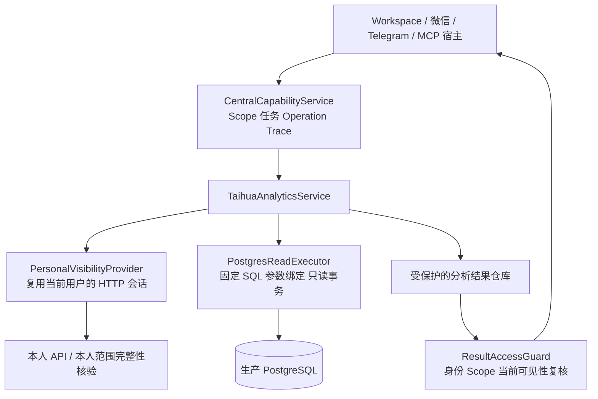
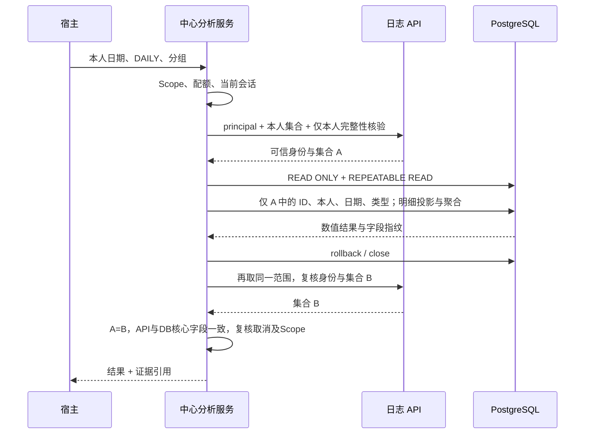

# 泰华日志数据库个人只读分析一期详细设计

> 状态：2026-09-09 设计基线，2026-09-10 补充交付状态。一期 A/B 已实现并发布；当前实际查询视图、认证下载形式及范围以[开发与启用说明](./数据库个人分析开发与启用说明.md)和[结项说明](./数据库分析一期结项说明.md)为准，本文未采纳的选项及后续阶段仍为设计。
>
> 日期：2026-09-09。
>
> 目标：在现有 AgentBridge 中交付可调用、可核查的本人日报分析能力，作为数据库读取层的首个实现。

## 1. 设计决定与证据边界

一期采用“日志系统本人 API 决定可见集合，PostgreSQL 完成结构化计算”的过渡架构。中央用户认证、日志系统会话、数据库服务账号是三种不同身份，不能相互替代。

已核验依据：

- [元数据盘点](../../验收记录/泰华日志系统/数据库只读元数据盘点-2026-09-09.md)：PostgreSQL 16.1、核心表/索引/权限结构。
- [本人日志对账](../../验收记录/泰华日志系统/数据库本人日志对账-2026-09-09.md)：一个 ADMIN 用户、一个完整周、3 条日报、3.5 小时；核心字段一致，时间字段表现有差异。
- [实际映射](./数据库一期实际映射与待确认事项.md)：DAILY=日报、WEEKLY=周报；全局 status 和普通用户权限仍未确认。

用户无法取得后端源码。实现不能据 ADMIN 的成功样本猜测普通员工范围，也不能把 status=true 写成未经确认的有效记录规则。

本设计是[个人试点契约](./数据库个人分析试点契约.md)的开发基线；其完整性、数据访问和恢复细节以本文为准。通用数据库接入、团队分析和复杂计算的总体方向仍见[总体设计](../../架构设计/只读数据库深度分析能力设计.md)。

## 2. 交付范围

| 阶段 | 交付 | 发布门槛 |
| --- | --- | --- |
| 一期 A，必交 | 本人日报计数、登记工时、有日志人日、每日分布、未关联项目统计；身份、可见性、查询预算、结果证据、登录续办和取消 | 端到端真实对账；试点身份明确准入；不得宣称通过普通用户验收 |
| 一期 B，个人增强 | 两个窗口的确定性比较、受控 CSV 汇总报告；复用一期 A 结果，不扩大读取范围 | 比较口径、结果权限和导出生命周期通过验收 |
| 后续独立阶段 | 团队/项目直读、脱离日志系统会话、正文归纳、周报工时、自由 SQL/Python | 分别验证业务规则及权限；不因一期 A 上线自动开放 |

一期 A 仅支持 DAILY、单个查询窗口最多 7 天、按天或不分组。周期比较的每个窗口仍最多 7 天。全部使用“登记工时”措辞，不生成考勤、漏填率、迟报率或绩效结论。

## 3. 模块架构



源系统仍登记为 taihua，不创建共享“数据库用户”代替最终用户。数据库执行器是同一业务能力内的第二种内部执行机制；不向模型提供连接、主键集合或任意 SQL。

一期 A 使用同步能力调用加 Task Hub 阶段进度，不另建通用异步分析平台。MCP 的异步包装应将阻塞数据库工作放到受限执行线程，并传递取消信号。超过总时限失败，不偷偷转成无人管理的后台任务。

## 4. 身份与登录

### 4.1 三层身份

| 身份 | 来源 | 作用 |
| --- | --- | --- |
| 中央 user_subject | 已认证 MCP Token、Workspace/渠道绑定 | Scope、任务与结果所有权 |
| 日志系统 principal.id | 当前受控会话的 `/api/users/principal` | 本人查询身份，不由姓名或模型参数决定 |
| 数据库账号 | 数据源密钥配置 | 建立数据库连接，不提供用户数据范围 |

当前 `TaihuaCentralAdapter` 已将 principal.id 归一化，但一般读取返回结果并不总含 userId。分析流程必须直接取得当前 principal.id，并传入可信内部上下文。不能沿用实验脚本“靠有日志才能识别人员”的办法，否则空窗口无法处理。

API ID 必须可无损解析为 PostgreSQL bigint；禁止经过浮点数再转换，传给模型的业务 ID 如需展示则用字符串。新 principal.id 与既有中央会话身份不一致时阻断并隔离映射，不能自动覆盖。

本文的 session generation 是拟新增的 authority_generation，不是现有字段。为 sessions 增加单调递增计数：重新建立登录身份、注销/过期、主体映射变更时提升；同一身份的 Token 正常刷新或保活不提升。不能使用 updated_at 代替，因为普通活动也会更新它。迁移为既有会话初始化版本，并在新能力执行前再次核验 principal。

本轮已有“本人 API 记录的唯一数据库所有者 + 团队仅本人解析”交叉证据，可作为首个试点的映射验收样本，不能硬编码该人员 ID 到通用代码中。

### 4.2 用户流程

已有日志系统会话时自动复用并核验；过期时复用现有可信登录卡，登录后续办原日期与类型请求。数据库密码不会出现在该卡中，用户无需每次输入数据库密码。

数据库凭据失效属于数据源运维故障，返回 DATASOURCE_AUTH_FAILED，不引导用户反复登录日志系统。应用会话失效与数据库认证失败必须分别展示。

登录续办以原任务、interaction、请求版本去重，取消或完成的任务不续办。由中央续办作为唯一执行方，宿主接收结果；不得同时让中心和 OpenClaw 各重放一次新能力。新能力需加入明确的读取续办契约，而不能依赖工具名猜测。

若分析途中刷新了合法 Token，随后因限额或数据变化失败，仍需按现有受控会话方式保存刷新后的状态，不能把有效刷新丢失并误报为必须重新登录。

## 5. 数据源配置与密钥

一期固定一个受控数据源 ID `taihua_primary`，服务端映射到用户授权的数据库；模型不能提交 source_id、host、port、dbname、SSL 设置或连接串。

配置模型（字段示例不含凭据）：

```json
{
  "source_id": "taihua_primary",
  "system_id": "taihua",
  "driver": "postgresql",
  "enabled": false,
  "credential_ref": "datasource/taihua_primary",
  "policy_version": "taihua.personal.api-visible.v1",
  "max_connections": 2,
  "statement_timeout_ms": 5000,
  "query_window_days": 7
}
```

地址、SSL 模式、用户名保存在受限配置，密码进入独立的数据源密钥存储。复用现有 DPAPI/AES-GCM 加密机制，但使用独立存储路径与用途上下文，不伪装为用户 SessionState；抽取通用保护器时保留旧会话密文格式及 AAD，避免破坏现有会话。

新增配置只经受控管理员入口或运行身份下的交互 CLI 写入；密码不得通过命令行参数、仓库文件或普通日志传递。轮换密钥提升 credential_version，新请求使用新版本；关闭旧连接，内存引用尽快释放，不承诺语言运行时能彻底擦除所有内存副本。

当前目标显式使用 sslmode=disable，配置为该精确私网目标的显式例外，不自动向其他地址降级。未来改为 TLS 属于配置变更，必须验证证书与连接；本设计不修改源库网络配置。

启用前核验表列 SELECT、无表/列 DML、只读默认值和额外权限。元数据盘点发现的 TEMP、序列 USAGE、认证表读取范围列为上线收敛项，交由数据库所有者处理；AgentBridge 不自动执行 GRANT/REVOKE。即使数据库读取范围更宽，也只发布本文列白名单。

依赖采用 psycopg 3；放入可选 PostgreSQL 依赖组，开发时锁定经 Windows/Linux 验证的稳定版本。禁用数据源时不导入驱动或连接数据库，四个现有系统正常启动不受影响。

## 6. 能力与 Scope

| 能力 / MCP 名称 | 输入 | 输出 | Scope |
| --- | --- | --- | --- |
| `taihua.analytics.personal.summary` / `taihua_analytics_personal_summary` | 时间、类型、分组 | 当次结果及 result_id | taihua:read + taihua:analytics:read |
| `taihua.analytics.result.get` / `taihua_analytics_result_get` | result_id | 重新授权后的原结果 | taihua:read + taihua:analytics:read |
| `taihua.analytics.report.export` / `taihua_analytics_report_export`，一期 B | result_id，format=csv | 受控文件引用 | 上述两项 + taihua:analytics:export |

所有能力 effect=read，表示不写日志业务数据；平台内部任务、审计和文件持久化仍受治理。既有 taihua:read 不自动增加 analytics Scope。Scope 映射在 MCP、中央服务和计划目录一致声明；不能只依赖模型工具隐藏。

一期 A 不提供通用 dataset 参数、任意字段投影、自由 filters、团队 ID、个人明细分页、正文和 SQL。每日分布最多 7 行，无需为了 7 行再建立分页工具。

## 7. 输入与输出契约

### 7.1 输入

```json
{
  "start_date": "2026-08-31",
  "end_date_exclusive": "2026-09-07",
  "log_type": "DAILY",
  "group_by": "day"
}
```

四个字段必填，additionalProperties=false。日期必须为有效 YYYY-MM-DD，start < end，跨度 1—7 天；end 最晚为业务时区的明天。未来日期拒绝，不默默替换为今天；包含当天时标记 period_closed=false。一期输出时区固定 Asia/Shanghai，模型不能覆盖。

当前 CapabilityEngine 的 Schema 校验主要检查字段存在、额外字段与基本类型，不完整执行 enum/date/跨字段约束。上述业务限制必须在 TaihuaAnalyticsService 的独立校验器中再次确定性校验，不能只写在工具 Schema 里。

WEEKLY 返回 LOG_TYPE_UNSUPPORTED，其他未知值也不降级。group_by 仅 none/day。对没有日志的日期补零只能在完整性核验通过后进行。

### 7.2 成功结果

```json
{
  "schema_version": "taihua.analytics.personal.v1",
  "result_id": "opaque-result-id",
  "scope": {"kind": "self", "label": "本人可见日报"},
  "window": {
    "start_date": "2026-08-31",
    "end_date_exclusive": "2026-09-07",
    "timezone": "Asia/Shanghai",
    "period_closed": true
  },
  "log_type": "DAILY",
  "group_by": "day",
  "metrics": {
    "log_count": 3,
    "registered_hours": "3.5",
    "logged_people": 1,
    "logged_person_days": 3,
    "hours_per_logged_person_day": "1.17",
    "unassigned_project_log_count": 3,
    "unassigned_project_hours": "3.5",
    "unassigned_project_hours_ratio": "1.0000"
  },
  "coverage": {
    "status": "complete",
    "basis": "matched_personal_and_self_filtered_team_api",
    "candidate_count": 3,
    "selected_count": 3,
    "truncated": false
  },
  "quality": {"nonpositive_hours_count": 0},
  "provenance": {
    "source_id": "taihua_primary",
    "policy_version": "taihua.personal.api-visible.v1",
    "dataset_version": "1.0.0",
    "api_checked_at": "2026-09-09T07:40:53Z",
    "database_read_at": "2026-09-09T07:39:32Z",
    "consistency": "api_bracketed_database_snapshot"
  }
}
```

示例数字来自本次样本，示例省略每日 series；实际 group_by=day 时必须返回窗口内每一天，包含经完整性核验后的零值日期。group_by=none 时 series 为空数组。操作 ID、任务 ID 沿用现有外层信封。

小时总数保留源 Decimal 精度，用字符串传输。人日平均值四舍五入到 2 位，比例到 4 位，使用 ROUND_HALF_UP；分母为 0 返回 null，不返回 Infinity。总量先汇总再算比值，不能平均每日比例。本人无记录时人数/人日为 0，不固定返回 1。

非正工时保留在原始合计并列为质量问题，报告注明“含源数据异常值”；不静默过滤。NULL/非数值工时违反本期字段契约，返回 DATA_CONTRACT_CHANGED，不伪造为零。

## 8. API 可见集合与完整性

### 8.1 新增内部读取方法

在 TaihuaCentralAdapter 增加内部 `read_personal_visibility_snapshot`，输出明确的 principal、原始集合计数、类型、投影字段、完整性依据和内容指纹。不能直接复用现有 list_my_logs 截取后的输出，也不能用 `_page_content` 在 totalElements 缺失时的回退值证明完整。

取本人 API 原始日期列表，并读取同一用户、同一窗口的团队“仅本人”原始分页信息用于完整性核对。团队结果仅作交集/一致性校验，不用于扩大本人结果。

要求同时满足：

1. principal.id 可信；团队筛选解析为同一 user.id，部门来自当前已核验身份，不能使用模型输入。
2. 本人响应为合法数组、ID 唯一、字段合法、所有日期落在窗口；读取响应没有被字节上限截断。
3. 团队原始 totalElements 明确存在且为非负整数，全部分页 ID 唯一，计数等于 totalElements，过滤条件经核对。
4. 两个接口 ID 集合一致，关键字段一致；按 DAILY 过滤在完整候选集合建立后执行。
5. 本人候选条数达到 500 或团队总数达到 500 时保守返回 RESULT_INCOMPLETE，即使可能恰好只有 500 条也要求缩小窗口；团队最多 5 页，每页 100 条，重复页或缺页拒绝。

普通用户若不能访问团队仅本人接口，不能绕过权限调用管理员接口补证。该用户返回 COVERAGE_UNVERIFIABLE，保留既有普通日志读取功能；需要取得另一种可验证的本人完整性契约后才启用其分析。必须在发布前用普通用户验证该前提。

双接口相等证明的是两个已确认 API 契约下的可见集合一致，不是数据库全量或历史完整性。若系统升级改变分页/默认过滤，暂停受影响契约；不能仅凭两边都返回少量数据永久假定无隐藏截断。

### 8.2 空窗口

本人数组为空且团队同人同窗明确 totalElements=0、身份核验通过时，可返回完整零结果；不需要从日志行反推身份，也不在数据库搜索其他人员补数据。任一来源不可用、无 total 或条件不一致，不能返回零。

### 8.3 响应体限制

现有 CentralHttpWorker 使用无大小参数的 response.read()。需增加向后兼容的可选响应字节上限与总截止时间，分析调用显式传入，分块读取并在超限时中断。现有系统默认行为保持兼容，不因新参数改变已有下游契约。

上限按解码前与解码后分别限制，防止压缩膨胀；JSON 解析后仍校验记录数量。API 原响应可能含正文，只在内存临时解析，立即投影为数值字段，不保存或提供给模型。

## 9. 查询执行与一致性



数据库查询条件必须同时含 verified_user_id、visible_ids、半开日期窗口及 log_type。值使用参数绑定，SQL/标识符来自固定模板。status 不自行决定可见性；API 集合负责这一边界。

数据库只选择 id、user_id、log_date、hours、type_code、project_id 及必要的创建/修改时间，不选择正文。先比对行数、ID 和核心字段，再在同一数据库快照内执行固定聚合；结果不一致立即失败。

完成数据库读取后立即 rollback/close，再做 API 后验，禁止跨 HTTP 等待保持生产库事务。REPEATABLE READ 保证该数据库事务内一致，不能使 API 与数据库获得全局原子快照；前后 API 指纹只提供有界复核。[PostgreSQL 隔离说明](https://www.postgresql.org/docs/16/transaction-iso.html)

API 指纹包含 ID、类型、日期、Decimal 工时及项目；created_at 仅按已验证的秒精度对照，updated_at 不因 API 空值强制改成空。数据库原始时间保留在受保护证据中，不用于迟报指标。

新增/删除/修改/所有者变化、会话主体或权限版本变化都返回 SOURCE_CHANGED。当前请求不自动扩大窗口或循环重试；新的请求建立新的记录及数据时间。已有 3 条样本只作为回归基线，不用来放宽这些检查。

一期使用每次查询独立数据库连接，加全局并发配额，暂不引入连接池；降低身份上下文残留及取消后连接复用风险。始终显式结束事务，不能仅依赖 HTTP 请求返回。[Psycopg 事务说明](https://www.psycopg.org/psycopg3/docs/basic/transactions.html)

## 10. 预算、任务和取消

| 预算 | 一期默认值 |
| --- | --- |
| 单窗口 | 1—7 天，仅 DAILY |
| 可见候选 | 少于 500 条，达到上限拒绝 |
| API 单次响应 | 解码前/后各最多 8 MiB |
| API 请求次数 | 每次分析最多 18 次，含身份、分页、后验和认证刷新；重试计入 |
| API 单次时间 | 最多 5 秒，同时受剩余总期限限制 |
| 单条 SQL | 最多 5 秒，lock_timeout=1 秒 |
| 总调用期限 | 60 秒；MCP 客户端超时应大于该值并留传输余量 |
| 数据源并发 | 最多 2 个请求；同一用户最多 1 个 |
| 等待配额/会话锁 | 最多 1 秒，超过返回 ANALYSIS_BUSY，不持久排队 |
| 查询次数 | 最多 4 条业务 SELECT，另计少量连接核验；达到预算终止 |

以上是开发起点，压测后调整并版本化。单纯返回行数限制不能限制扫描；本期可见 ID 和用户日期索引共同限制源查询。没有生产压测证据时不扩大窗口和并发。

沿用 Task Hub active/running/waiting_user/succeeded/failed/canceled；阶段事件为 identity、visibility、query、verify、deliver，不增加平行的用户任务状态机。Workspace 显示一个当前状态，处理过程折叠。

取消信号检查点覆盖锁等待、每次 HTTP 前后、SQL 执行、后验和结果交付。SQL 运行中调用驱动取消并等待执行结束，关闭连接；无法确认结束则显示“正在取消”，由语句超时和执行器核查收尾，不提前宣布已取消。

Task Hub 的 canceled 状态不能自动等同于 SQL 已停止；需要执行器确认或附属 cancellation_pending 标记。使用已有任务取消入口，给分析 Operation 注册可取消句柄。HTTP 断开时请求取消；重启后不自动重放旧源查询，未完成记录以 INTERRUPTED 收尾，用户重新发起时生成新数据快照。

## 11. 数据持久化与结果权限

### 11.1 结果记录

新增内部 analysis_results 表，最少包括 result_id、user_subject、system_id、principal_id、session_id/generation、policy_version、dataset_version、operation_id、task_id、request_hash、visibility_hash、captured_at、expires_at、state、encrypted_payload_ref。

payload 含规范化输入、可见 ID、字段投影、聚合结果、API/DB采集时间和一致性证据，单独加密；最大 500 条小快照。成功结果默认保留 7 天，失败请求不保留业务行；过期密文和引用清理，审计按平台既有留存策略只保留非敏感状态与指纹。

不复用“跨用户相同 SQL”的缓存。一期新分析每次读取新证据；重放同一 request/idempotency_key 仅可在访问守卫通过后读取原结果，不能把旧结果当成实时数据。

### 11.2 防止绕过 handler 的旧结果复用

现有 CapabilityEngine 在命中幂等 Operation 时可在执行 handler 前返回历史结果。这对新能力需要专门处理：

1. 新能力的 Operation 持久结果仅保存 result_id、状态及非业务元数据，不直接存放可被通用读取接口返回的完整分析值。
2. 首次返回和复用返回统一经过中央 ResultAccessGuard，再注入当前调用可见的结果内容。
3. Scope 在调用入口校验；结果 owner、会话身份、策略版本和当前 API 可见集合在守卫中校验。
4. Task/Operation 查询、计划结果投影、Workspace 附件、导出与下载也使用同一访问守卫，不能只保护 result.get 工具。

当前 API 集合变化、身份变化、Scope 撤销、策略停用或结果过期时拒绝新读取。权限撤销后的旧业务快照仍受原有 7 天有效期约束且禁止业务访问；有效期届满清理密文及引用，仅保留非敏感审计状态与指纹，不以审计名义无限保留业务快照。用户需重跑获得新结果。即使知识上是同一用户，也不能凭一个 result_id 跨用户访问。

既有聊天中已发送的数字、用户已下载的文件属于已交付内容，平台不承诺召回。新访问权限检查解决后续读取，不能抹去之前披露。Task 时间线不再次保存整份业务快照以绕过结果仓库。

### 11.3 结果读取与新鲜度

result.get 重新使用原窗口完成当前本人可见性校验并比较指纹；使用独立的同级预算，失败不回退到旧缓存。初次交付可复用刚完成的同次后验，但必须在交付前确认会话 generation 与 Scope 未失效。

结果显示“数据读取于某时刻”，不是实时监控。相同受保护快照与算子版本可以复算数值；不声称后来重新访问源库还能得到相同结果。

## 12. 日志与错误

读取请求摘要按能力声明脱敏，不沿用 `_operation_input_summary` 对 read 完整保留参数的默认行为。原请求日期/类型可以放入受限操作记录用于续办；公开 Trace 仅含请求类型、窗口天数、耗时、阶段、错误码和版本。

数据库异常必须在执行边界转成稳定错误码，禁止将驱动原始异常/SQL/连接串直接传到 CapabilityEngine 的 `str(exc)` 分支。密码、Token、正文、原始 API 响应、ID 数组不进入普通日志；指纹也不能作为访问凭证。

| 错误码 | 行为 |
| --- | --- |
| LOGIN_REQUIRED | 可信日志系统登录卡，完成后仅一次续办 |
| IDENTITY_UNVERIFIED / IDENTITY_CHANGED | 阻断当前分析，不猜测映射 |
| DATA_ACCESS_DENIED | Scope 或结果范围不允许，不自动换账号 |
| COVERAGE_UNVERIFIABLE | 无权威总量/无法使用核验接口，不生成总计 |
| RESULT_INCOMPLETE | 达到记录/字节/分页上限，提示缩小范围 |
| SOURCE_CHANGED | 集合/字段/身份前后变化，不自动重跑 |
| DATA_CONTRACT_CHANGED | Schema、类型、字段必需性不符，暂停受影响能力 |
| DATASOURCE_AUTH_FAILED / SOURCE_UNAVAILABLE | 管理员处理数据源，不让用户重复应用登录 |
| DATASOURCE_POLICY_REJECTED | 数据库账号未达到权限收敛要求，管理员处理，不误报为用户缺少分析 Scope |
| ANALYSIS_BUSY / BUDGET_EXCEEDED | 繁忙或限额，不能解释为无数据 |
| RESULT_EXPIRED / RESULT_ACCESS_REVOKED | 不返回旧 payload 或下载链接 |
| INTERRUPTED | 执行被中断，下一次请求重新取数 |

本期是受控读取，不使用写入 RESULT_UNKNOWN 表示普通查询失败；数据库取消待确认作为执行清理状态单独处理。

## 13. 一期 B：比较与导出

两个窗口比较采用现有持久任务计划：两个 personal.summary 读取步骤及一个已注册确定性比较 transform。用户请求日期原样进入两个步骤，不能让模型读取后自行猜测比率。两者必须是同一主体、DAILY、同口径版本；非等长窗口需显式允许并仅给出可比较项。

比较输出差额及变化率；基期为零时变化率为 null，明确“基期为零”，不能返回无穷大。每个来源带独立数据时间，不声称全局同一快照。PLAN_REQUIRED、失败与结果投影沿用现有中心规则。

计划持久状态保存结果引用，transform 在受控执行时经守卫解析；不能通过计划输入绑定再次持久化整份解密快照。投影结果仍作为受保护结果记录，读取时校验源结果的可见性。

CSV 仅导出本人每日汇总及口径，不含正文/人员联系信息。复用现有 `_safe_csv_cell` 防公式注入、文件交付与附件机制，增加专用类型。文件生成、重新签发和每次下载都检查 owner、Scope、当前结果权限；下载引用最长 10 分钟，文件最长 24 小时且不超过原结果有效期。签名链接本身不能代替用户认证。

2026-09-09 实施补充：一期 B 下载采用认证 MCP 的十分钟 report_id 引用，返回文件字节后复用 OpenClaw 附件交付；不提供匿名签名链接。持久计划返回 protected_analytics 投影，用户通过 result.get 重新核验并读取比较指标。具体协议见[开发与启用说明](./数据库个人分析开发与启用说明.md)。

## 14. 代码落点与内部接口

以下新增路径为拟议实现位置，当前尚不存在：

| 文件/模块 | 改动职责 |
| --- | --- |
| `bscli/core/data_sources.py`，新增 | 非敏感数据源配置、启停、版本及准入策略 |
| `bscli/core/data_source_secrets.py`，新增 | 独立用途密钥存储，复用通用加密实现 |
| `bscli/database/postgres_read.py`，新增 | 只读连接、固定查询、配额、事务、取消、异常归一 |
| `bscli/analytics/taihua_personal.py`，新增 | 输入校验、可信上下文、可见集合、查询与后验编排 |
| `bscli/analytics/results.py`，新增 | 加密结果、证据指纹、访问守卫、过期清理 |
| `bscli/adapters/taihua.py` | 原始 principal、无静默截断的内部快照及本人完整性核验 |
| `bscli/browser/http.py` | 可选响应大小/总期限/取消支持 |
| `bscli/core/central_service.py` | 专门路由新能力、受控会话上下文、结果守卫、取消与续办 |
| `bscli/core/sessions.py` | authority_generation 迁移与身份生命周期更新，保活不提升版本 |
| `bscli/core/capability_runtime.py`、`operations.py` | 可插拔的摘要策略；新能力幂等返回仅为结果引用 |
| `bscli/mcp/central.py` | 工具 Schema、Scope、结果 hydration、受限执行线程 |
| `bscli/core/planning_policy.py` 及 transform 注册 | 一期 A 单源描述；一期 B 比较规则、受保护引用解析 |
| `bscli/core/report_exports.py` 及文件交付入口 | 一期 B CSV 类型与下载守卫 |
| OpenClaw coordinator、代理目录、Workspace | 新读取工具标签、一次续办、折叠进度、结果卡 |
| `pyproject.toml` | PostgreSQL 可选依赖与发布验证 |

不要将数据库连接放进 TaihuaCentralAdapter 的全局共享状态。中央服务在现有 `_invoke_adapter_unobserved` 的只读分支识别新能力，向 TaihuaAnalyticsService 注入当前 adapter/worker、可信 principal、Operation/Task、deadline 和 cancellation；其他三类泰华读取继续走原分支。

建议内部接口：

```text
PersonalVisibilityProvider.capture(context, window) -> VisibilitySnapshot
PostgresReadExecutor.summarize(context, snapshot, query) -> NumericSnapshot
TaihuaAnalyticsService.run(context, query) -> ProtectedResultRef
ResultAccessGuard.authorize(context, result_ref) -> AccessibleResult
```

当前会话锁包住本次受控调用，分析设置 1 秒获取期限并受 60 秒总限约束；数据库只在中段持有连接。跨进程运行时需数据库/中心持久配额租约，不能假设 Python 进程内 semaphore 就能约束多个服务实例。首发按单中心实例配置，启动检查拒绝未配置全局配额的多实例启用。

## 15. 数据库契约漂移与启用检查

启动或显式管理员检查时核验最小必需列、数据类型、主键和权限；不全量扫描业务数据。每次执行再检查输入和输出类型。可兼容的新增列不自动发布；必需列删除/类型变化、日志主键变化或身份契约变化，使数据源分析状态变为 unavailable。

检查元数据不能证明业务状态含义未变；API 契约版本和可见性一致性也要检查。新表/新列授权只提升底层账号权限，不自动提升模型权限。

## 16. 测试与真实验收矩阵

| 测试层 | 必须覆盖 |
| --- | --- |
| 纯契约 | 非法日期、未来日期、超过 7 天、额外身份/SQL 字段、WEEKLY 拒绝、Decimal 精度、零分母 |
| API 快照 | principal 缺失/变更、空集合、缺 total、500 条、重复 ID、循环页、筛选被忽略、响应膨胀、普通用户无核验接口权限 |
| 数据库隔离环境 | 参数注入、本人+ID+日期+类型全部约束、非可见行不返回、事务只读、Schema 变化、取消和连接释放 |
| 一致性 | 日志新增/删除/修改/归属变化、核心字段不一致、时间秒精度差异、API 后验失败 |
| 中央身份与结果 | 跨用户 result_id、旧 Scope、停用数据源、幂等复用、Task/Operation 查询、计划投影、文件下载均不能绕过守卫 |
| 任务恢复 | 登录后一次执行、中心/宿主不重复续办、取消后不续办、执行取消确认、进程重启不自动重放源查询 |
| 真实个人样本 | 已验证 ADMIN 样本复验；有合法会话的普通用户只读验证；项目非空、同日多条、空窗口按实际样本覆盖 |
| 一期 B | 两窗口比率、基期零、来源口径不一致、CSV 注入、链接过期、权限撤销后的下载 |

单元测试用合成数据覆盖反例。写入拒绝测试只在隔离测试库执行，不在生产库尝试 INSERT、nextval、DDL 或伪造业务数据。没有真实反例时明确记录覆盖缺口，不以模拟测试替代真实权限验收。

首发可仅向已验收试点身份启用，但该开关必须只缩小范围，不能令 ADMIN 的应用权限代替其他用户。普通用户未通过时不得宣布全员可用。数据正确性、身份隔离、取消及结果重读是硬门槛，不能仅因驱动能连接就发布。

## 17. 实施顺序与交付物

1. **连接与契约基础：** 可选驱动、配置/密钥、固定输入输出、受限 HTTP、数据库执行器；交付隔离环境测试。
2. **本人端到端：** principal 身份、完整性核验、SQL 与后验、summary 工具；交付三方数值对账。
3. **中心治理闭环：** 结果仓库/守卫、幂等、登录续办、取消、Scope/目录/Workspace；交付攻击与故障场景测试。
4. **一期 A 发布：** 权限收敛、配置准入、真实试点验收、代码与文档一致检查，按项目既有发布流程部署。
5. **一期 B：** 比较 transform 和 CSV，独立验收后启用；不以它延误一期 A 的可用闭环。

本次只形成详细设计，不实施上述改动、不修改数据库权限或部署服务。开发可以立即从第一步开始；团队权限和全局 status 等未知项不会阻塞 API 可见集合约束下的个人试点，但会继续阻止未经验证的独立数据库直读。
