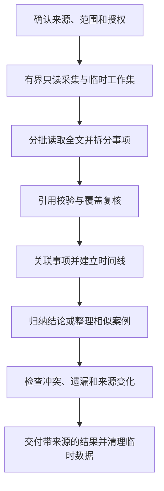

# 日志数据库事项复核、连续追踪与案例检索设计

日期：2026-09-15。状态：设计稿，待实施；本文中的新接口、存储、指标和预算均不是现有能力或已通过验收的结论。

## 一、目标与设计决定

在现有日志读取、正文分析、评论分析及来源链接之上，建设三项相互支撑的能力：

1. **事项清单与覆盖复核**：逐篇拆分独立事项，说明哪些进入总结、哪些省略以及原因，使大范围分析可以核对。
2. **事项时间线与后续证据追踪**：关联同一事项的多条记录，区分计划、进展、问题、完成及未知，回答“后来怎样了”。
3. **相似案例检索**：找到相似问题及处理经过，区分尝试、明确有效和结果未知，帮助复用经验。

共用“来源证据 → 事项 → 关联 → 结论”结构。中央服务负责数据范围、采集、引用校验、任务状态和交付；宿主智能体负责语义拆分、关联与解释。中心不新建一套模型账号配置或绑定某个模型供应商。

首期采用按需、单数据源、有界分析。临时工作集仅供当前任务复核与续作；不建立长期事项台账，不恢复按 query_id/result_id 查询历史分析的入口。案例检索先实现字面词、人工维护的同义词及别名扩展，语义索引为第二阶段独立开关。

本稿不涉及修改日志、创建业务任务、指派责任人、发送催办或定期推送。原文提到某人不构成系统给其分配任务。

## 二、已核对的实现基础

| 当前实现 | 可复用部分 | 本次增量 |
| --- | --- | --- |
| `bscli/database/content.py` | 日志过滤、部门范围、摘要/进展/问题/经验等模式、评论证据 | 将语义输出从提示要求收敛为可校验的结构化清单 |
| `bscli/database/evidence.py` | 原文链接、正文版本、段落证据、长正文分片、覆盖清单 | 任务内稳定证据集合、事项与段落对应、结论反向覆盖 |
| `bscli/database/independent.py`、`sources.py` | 两项 MCP 工具、中央账号按源授权、源配置版本 | 新能力登记与每阶段权限复核 |
| 现有 Task/Host Adapter | 状态、取消、身份、续办及协调机制 | 分批语义工作请求与结构化回执；需补充协议，不能假设现有宿主已支持 |
| `reports.py` | 表格查询 CSV 和认证下载 | 首期保持现有导出契约；新增语义结果暂在任务回答中展示 |

依据：[组织范围与分析契约](./数据库组织范围与分析契约.md)、[原文查看与证据分页](./数据库原文查看与证据分页.md)、[多数据库迁移与验收记录](../../部署运维/多数据库迁移与验收记录.md)。

当前正文分页并非跨请求冻结快照，`evidence_ready` 也不表示语义分析完成。本文不引用旧“只读数据库深度分析”稿中的历史结果读取接口作为实施契约；接口与边界以现行迁移决定及本稿为准。

## 三、用户场景与结果结构

### 3.1 事项复核

提示示例：“梳理研发部上个月的工作，列出主要进展、问题和待办，检查有没有漏项。”

输出顺序：范围与读取情况 → 主题概览 → 逐来源事项清单 → 省略与待复核项。清单至少展示事项、原文状态、摘要去向、作者/日期/段落链接。同段写了部署、验收和遗留问题时分别建项；一篇的总工时不重复分配给每个事项。

### 3.2 时间线与后续追踪

提示示例：“查一下上个月提到的接口超时问题，后来怎么处理的，有没有解决。”

输出顺序：事项识别依据 → 时间线 → 最近的明确记录 → 完成证据或缺口 → 冲突及疑似关联。没有截止日期时，规划层按任务配置时区（本部署默认 Asia/Shanghai）解析为“截至运行当日”，转换为次日零点的排他上限并展示；如果用户明确只查上个月，保持该范围。所有日期区间采用左闭右开形式，保存时区及解析后的起止值。问题发现窗口与跟进窗口分别记录，不能静默扩展。

### 3.3 相似案例

提示示例：“找找以前处理接口超时的案例，哪些方法有效，有什么前提。”

输出顺序：检索范围与方法 → 案例列表 → 相似点与差异 → 措施及结果 → 适用限制与来源。没有给时间范围时，首期默认最近 90 天并在结果头部明确；用户说“所有历史”时不套用此默认，超预算应报告限制并提供分段方案。

### 3.4 共用交互

Workspace 只展示一张父任务进度卡，当前阶段、失败、取消和最终结果可见；批次读取与复核细节可展开。处理中展示“已读取 120/200 篇，已复核 85 篇”，不把已读数当作已完成分析数。

最终回答保留可展开的事项明细，不能只在后台声称已复核。普通语言使用“未找到后续记录”“存在不同说法”“本次仅检索了这些范围”，不把内部错误码、游标和模型参数放入日常使用流程。

## 四、共用数据结构

以下为逻辑字段，数据库表结构在实施时按现有 Task 存储确定；所有内部 ID 都由服务端生成或校验。

| 对象 | 必要字段与含义 |
| --- | --- |
| `AnalysisScope` | source_id、中央主体、能力、日期区间、筛选、实际部门集合、是否含下级、当前组织归属口径、源/授权/策略版本、scope_hash |
| `EvidenceRecord` | source_id、记录类型与 ID、作者 ID、日志日期、采集时间、正文版本、元数据版本、段落及字符区间、原文链接；评论同时绑定评论及关联日志版本 |
| `WorkItem` | item_id、标题、对象/项目线索、事项类别、动作、原文状态用语、规范化状态、证据引用、抽取器版本、复核状态 |
| `ItemRelation` | 左右事项 ID、关系类型、匹配依据、冲突依据、判定等级、复核状态；关系类型为同一事项/跟进/解决/复发/依赖/相似案例 |
| `Claim` | claim_id、结论、事实或推断、引用集合、支持/冲突证据、适用时间范围、关联事项 ID |
| `CoverageLedger` | 记录数、全文完整数、已拆分数、事项数、进入总结数、省略及理由、待复核数、无法读取数、来源变更数 |

`item_id` 仅在一个任务工作集内稳定。同一事项跨任务重新分析可得到不同 ID，不暗示已经建立长期业务实体。拆分/合并保留旧新 ID 映射和原因，不能覆盖原证据。

状态分开记录：工作状态 `planned / in_progress / completed / cancelled / unknown`，问题状态 `open / mitigated / resolved / reopened / unknown`。它们都是“日志记载的状态”；时间线以事件为主，不强制单向状态机。一个问题解决不代表整个项目完成。

判定等级用 `explicit / supported / tentative / conflicting`，分别表示原文明示、多项证据支持、疑似和冲突。模型置信分不能作为事实概率展示。

## 五、共用处理流程与大范围一致性

### 5.1 首期采集策略

对复核与追踪任务，在**一次有界只读 REPEATABLE READ 事务**中解析组织范围、确定匹配记录、读取必要正文及授权评论，流式写入中心端加密临时工作集，完成清单与校验值后关闭事务。模型处理在事务关闭后进行，禁止为等待模型维持数据库事务。

这是拟新增的专用内部采集器，不能靠循环当前分页接口拼成冻结快照，也不要求普通账号拥有自由 SQL。驱动必须验证该隔离级别语义；首期仅启用已支持的 PostgreSQL 与 `taihua_logs` 包。

采集失败或超预算时，未完成的工作集不能标记为快照就绪。报告实际失败原因和可行的分段方案；用户明确同意分段，或原请求本就要求分段时，才产生多个子范围，每段独立标明采集时间与一致性边界，不宣称跨段同一快照。

案例检索先在一次有界事务中取候选及分析所需上下文，再生成工作集；其一致性仅覆盖选中的候选集合，不代表全库语义检索完整。首期跟进上下文按正式项目 ID、可验证对象标识和已确定的时间窗口采集，允许正文不含原检索词，但必须满足原任务的硬过滤范围；所有上下文计入同一采集预算。模型阶段只能使用该工作集。缺少可靠对象标识时不猜测关联范围；若阅读后发现需要追加查询，提出具体子范围，按原请求授权范围决定是否执行，单独标注第二次采集时间和一致性边界，不并入原快照。

### 5.2 拟定初始预算

| 项目 | 首期建议默认值 | 到限行为 |
| --- | --- | --- |
| 每次采集 | 2000 篇日志及 5000 条评论；规范化正文合计 20 MiB；最多 60 秒 | 失败并说明哪项超限；上限取本表与数据源策略中更严格者 |
| 单条记录 | 延续现有 1 MiB 后端保护 | 明确列为不可处理，不丢弃后宣称完成 |
| 单批传输 | 默认 12000、最多 14000 个 UTF-16 字符，按完整响应预算 | 按记录和正文分片，不截断后声称全文 |
| 模型批次 | 每次最多 50 个工作请求，累计活动执行最多 30 分钟，断开等待仍受工作集到期约束 | 转为资源限制/部分完成，保留缺口 |
| 并发 | 每主体每源 1 个、全局最多 2 个采集任务 | 有界排队，可取消；配置可下调 |
| 工作集寿命 | 自创建起最长 24 小时，不因重试续期 | 到期失效；不能恢复，重新查询 |

这些是可评审的起始值，需用代表性长正文与真实库负载验证后调整。模型请求同时受 token 预算限制，不以字符数推定 token 数；单篇过长需先完整续读再分块抽取并合并。

### 5.3 复核与完整性

每条完整记录必须有“事项列表”或“无适用事项及理由”。每个事项必须指向至少一处证据，每个结论必须反向对应事项，省略必须单列原因。结构校验能检查引用、版本、字段、重复和去向，不能证明自然语言没有遗漏。

复核分成三层：

1. **范围**：筛选和组织口径是否明确，是否完整采集，是否有不可读取记录。
2. **读取**：工作集内每条记录是否全文读取；长正文所有片段是否已合并。
3. **语义**：是否拆分并复核所有记录；结论是否有支持，冲突是否保留，省略是否解释。

复核过程再次查看原文与事项清单，不能只让模型重读自己的摘要。覆盖比仅表示“已列出事项中已处理的比例”，不能声称它衡量了未知漏项。使用 `structural_check=passed` 与 `semantic_review=completed/needs_review` 两个字段，不生成“语义正确率 100%”。

交付前重新验证源/授权版本，并在一个短只读事务中对工作集记录的正文和相关元数据版本做有界重查。发生内容变化或删除时标记对应结论待复核，默认交付为部分结果；不自动混入新正文。新增记录不属于原快照，不据此宣称已分析“此刻全部数据”。若复查超时，明确 freshness 未核实。

## 六、事项连续追踪规则

先识别候选，再判定关系。候选线索包括正式项目 ID、明确工单/设备/接口标识、事项对象、时间、参与人、同义词。项目相同或措辞相似只能用于召回，不能单独证明同一事项。

1. 原文明示编号或明确回指，且无冲突，可判为 `explicit`。
2. 多项上下文吻合但没有唯一标识，可判为 `supported`；解释依据。
3. 仅相似表达、同名或证据不足，保持 `tentative`，分别列出，默认不合并主时间线。
4. 项目/设备不一致、否定、时序矛盾或不同处理结果，保留冲突，不取最新一句覆盖全部历史。

“计划上线”不能变为“已上线”，“收到”不能变为“已完成”，“采取措施后缓解”不能变为“根因解决”。完成结论必须有对应事项的明确完成或验证证据；随后复发时保留此前解决事件并增加复发事件。

日志日期作为记录时间轴；原文明示实际事件时间另存 `event_time` 与原句。模糊时间不伪造精确日期，同日不同作者且无可靠时间顺序时并列。当前部门不推导历史归属。

跟进检索默认只覆盖任务确定的跟进窗口和部门/人员范围；即使跨部门可能有答案也不能静默扩大。结果写“在所查范围内未找到后续”，并列出可能需要另查的范围。

评论为可选增强，必须具备独立评论能力。请求仅要求日志时不读取评论；明确要求含评论却无权限时报告不足，不默默交付为完整。评论证据可支持回应和措施，现有原文链接只定位关联日志，不能伪称已定位某条评论。

## 七、相似案例检索

### 7.1 首期：可解释的词语扩展与候选复核

流程：解析问题对象/症状/约束 → 扩展同义词和别名 → 范围内检索 → 去重与排序 → 阅读候选全文 → 按事项追踪补齐处理经过 → 生成案例。

管理员维护的词表按 source_id 保存版本、来源和修改人；模型提出的扩展词仅在当前任务使用并显示，不自动写入正式词表。扩展不能改变原用户的硬条件，如项目、日期、设备型号；否定词和“未解决”等作为语义信息保留。

初始上限：最多 8 组词、每组 5 个扩展词、最多 100 条候选，默认返回 5 个案例。模板绑定参数，不把扩展词拼成自由 SQL。范围内命中数与候选截断标志必须返回，候选排序按匹配对象、症状、约束、词语相关性，再用日期和 ID 稳定排序；最终相关性由原文复核。

检索词与排序规则是可解释规则，不将得分显示为解决成功概率。超过候选上限标记部分候选检索，可建议细化问题；不能把前 100 条称为全部历史案例。

每个案例包含：背景、症状、措施、明确结果、未证实部分、适用前提、与当前问题的差异、证据。明确失败的案例也可返回并标记，避免只呈现成功经验。无命中回答“当前检索范围内未找到”，不补外网案例。

### 7.2 第二阶段：语义索引

仅在首期评测表明词语检索存在稳定漏检后引入。索引按来源、记录/段落及版本绑定，支持更新与删除；召回后必须通过当前源授权和范围校验，并读取当前原文验证，索引不能充当新的授权来源。

索引包含敏感派生数据，应加密、按源隔离、限定访问和保留期。若索引无法保证在排序/候选返回前完成用户可见范围过滤，则该范围的语义检索不启用。停用或撤销立即禁止交付；异步清理期间也不可查询。

正文发往新的 embedding 服务属于新增数据处理路径，需单独评审运行位置、供应商、成本、保留规则和数据范围。本次设计不选供应商，不发送数据，不把该阶段作为前三项能力落地的先决条件。

## 八、能力与协议草案

保留 `database_capabilities` / `database_execute` 两项 MCP 工具，增加三个拟议业务能力；这些名称均尚未实现：

| 能力 | 专有输入 | 成功交付 |
| --- | --- | --- |
| `database.logs.review` | focus（可选，最多 1000 字）、include_comments（默认 false） | 概览、逐来源事项、省略及覆盖报告 |
| `database.logs.track` | subject（必填，最多 1000 字）、followup_end_exclusive（可选） | 候选事项、时间线、当前证据状态、冲突和缺口 |
| `database.cases.search` | question（必填，最多 1000 字）、top_k（1–10，默认 5）、include_comments（默认 false） | 检索说明、案例及适用限制 |

公共输入：source_id 放在执行外层；沿用日期、人员、部门、项目、日志类型、包含下级等现有过滤语义；`request_key` 必填且由宿主生成，`include_comments` 对追踪同样适用。复核/追踪要求明确起止日期；案例缺省日期由规划层解析为最近 90 天后显式传入。默认日报，明确周报时查询 WEEKLY；不把日报汇总冒充周报原记录。

追踪的初始日期范围用于发现种子事项，跟进上限不得早于其结束日；跟进范围沿用其余硬过滤条件。查询精确记录不能绕过这些条件。未知字段、无效日期和冲突条件明确拒绝。

新能力分别勾选授权，并要求已有 `database.logs.content_analyze`；使用目录消歧要求 `database.directory`，使用评论要求 `database.comments.analyze`。新能力不隐含自由 SQL 或 CSV 权限；只拥有自由 SQL 的账号不自动获得这些入口。授权缺少依赖时控制台提示，执行器再次拒绝，不自动补授权。

新增授权与当前授权按“中央账号 × source_id × 能力”生效；日志人员 ID 仅为查询条件，不增加业务系统登录或身份映射依赖。现行源授权不是行级访问控制，用户筛选也不是安全隔离；需要行级权限时使用受限视图/独立源，或另行建设策略。

### 8.1 异步任务与宿主协作

执行返回 `task_id、state、stage、scope、coverage、expires_at`。进度与最终回答沿现有 Task/Workspace 通道交付；不得新增 `database.result.get` 或用 query_id 获取历史业务结果。任务状态接口仅返回状态及计数，不返回临时正文或旧分析包。

中央编排器向当前任务的已认证宿主发出版本化 `analysis_work_request`：task_id、batch_id、阶段、证据清单指纹、片段、输出 schema、预算、租约。宿主以 `analysis_work_response` 返回抽取事项/关联/结论及引用。这是拟新增的宿主协议负载，不宣称现有回调已能接受。

回执绑定主体、源、任务、批次、证据版本与租约；正文只从服务端工作集获得，客户端提交的摘录不能成为权威原文。服务端验证引用存在、字符区间与原文一致、关联对象属于本任务。批次只接受首个有效回执；重复同内容幂等返回，冲突内容拒绝，过期租约不提交。

协议不支持的宿主明确返回 `ANALYSIS_HOST_UNSUPPORTED`；用户仍可另行调用已有正文证据能力，但不能把它的普通回答宣称为本设计的自动复核任务完成。Reference Host 用固定回执验证协议；OpenClaw 用真实模型验证语义质量。

### 8.2 状态、续作和错误

状态：`queued → collecting → extracting → reviewing → linking → composing → verifying → delivering → completed`；案例检索在采集前有 `retrieving` 阶段，不需要关联时可跳过 linking。终态另含 `partial、failed、cancelled、expired、invalidated`。

最终消息以任务级交付键幂等写入现有会话消息存储，获得持久化确认后才进入 completed（部分结果对应 partial）并清理工作集。写入与权限版本判定必须共享可核对的提交边界；失败时留在 delivering，只核对消息交付状态，不重新采集或重复分析。网络回执丢失时先查该交付键是否已持久化，已持久化即视为已交付，不等待用户实际打开页面。尚未持久化前撤权、取消或到期则停止交付并清理；该机制仅用于当前任务可靠交付，不增加历史结果读取入口。

同主体、源、request_key 与规范化请求指纹唯一绑定。相同键返回现有状态，不重复采集；不同请求使用同键拒绝。终态任务不能靠旧键重新分析；明确重新运行使用新键。

运行中断后只恢复尚未接收的工作请求，已提交批次不重做；模型调用超时先核对回执，不盲目重复调用。原工作集过期、源/授权/策略版本变化则不可续作，重新运行必须创建新任务。取消停止排队、数据库读取及后续模型调度，迟到回执拒绝；上游已计费调用无法撤回。

建议错误码：`ANALYSIS_BUDGET_EXCEEDED`、`ANALYSIS_EVIDENCE_INVALID`、`ANALYSIS_SOURCE_CHANGED`、`ANALYSIS_WORKSET_EXPIRED`、`ANALYSIS_HOST_UNSUPPORTED`。源停用/授权撤销沿用现有错误约定并转 invalidated。部分结果只有在权限仍有效时才可交付，必须携带未完成范围；权限失效时不能通过“部分结果”交付正文。

## 九、临时存储、证据与交付边界

临时工作集、事项、关系和未交付结论按主体/源/任务加密保存，禁止进入普通审计日志。活动任务和等待恢复任务最长保留 24 小时；完成、取消、失效或失败后撤销读取资格并尽快清理内容，最长 1 小时内清理。清理失败产生运维事件，不延长可访问时间。

检查点只服务当前活动任务的续作；续作读取每次验证账号、原能力和源/授权版本，不能凭 task_id 或租约单独授权。已终态任务仅保留必要状态、计数、指纹和错误元数据，按既有任务审计保留策略处理，不保存原文或完整模型回执到普通审计。

最终回答作为正常对话消息沿用现有会话可见性与保留规则；已交付文字不能撤回。数据库任务状态入口不另提供重新下载或反查分析包。首期不开放工作集/模型回执导出；后续若增加事项表格或报告文件，需要独立定义语义报告导出契约并复用认证下载，不能冒充现有基于查询重新生成的 CSV。

引用链接仍指向源库当前原文。结论附采集时间；版本变化时旧段落不高亮。临时采集的旧文本不开放历史原文网页，不能承诺永久重放。评论链接只到关联日志的问题在首期通过标注评论作者、时间和引用摘录解决，不伪造评论锚点。

## 十、实施拆分与建议模块

| 阶段 | 交付 | 完成门槛 |
| --- | --- | --- |
| A 共用底座与事项复核 | 有界采集、工作集、事项/引用 schema、覆盖账本、宿主批次协议、review 能力 | 长正文、多事项、断点、取消、授权变化、清理验证；真实模型逐来源核对 |
| B 连续追踪 | 种子识别、关系判定、时间线、完成/复发/冲突规则、track 能力 | 同名不同事不误合并；计划不写完成；无后续和范围不足表述正确 |
| C 案例检索首期 | 词语扩展、别名版本、候选排序、全文复核、案例模板、cases.search 能力 | 检索基准集达标；无命中、截断、失败案例与来源变化处理正确 |
| D 可选增强 | 经评审的语义索引与同步 | 召回增益明确、按源与范围隔离、更新删除及新数据处理路径验收 |

建议在 `bscli/database/` 新增 `analysis_models.py`、`analysis_capture.py`、`analysis_worksets.py`、`analysis_service.py`、`case_retrieval.py`；代码命名在实施时结合现有模块收敛。Task/Host 协议只承载通用工作请求与回执，日志状态规则留在数据库分析服务。Workspace 复用父任务展示，不为每批建立独立用户请求。

各阶段以功能开关启用，默认关闭；停用新分析不影响已有标准查询。不自动新增生产账号授权或启用语义索引。只交付 A 时明确称“事项复核已实现”，不能把 B/C 的普通提示词调用记为产品交付。

## 十一、验收设计（全部待执行）

先构造可公开的固定样本，并由人工标注记录内事项、关系与结论；模型输出不作为自己的标准答案。代表性真实数据仅在既有授权范围内核对，固定样本测试和真实用户验收分别记录。

| 类别 | 场景 | 预期 |
| --- | --- | --- |
| 事项 | 同段三事项、跨段同事项、空正文、否定、计划、完成 | 拆分正确；无依据完成声明为 0；每项有出处 |
| 长正文 | 关键事项跨分片、末尾才出现否定或验收结果 | 全文续读再归纳，跨片事项不重复或遗漏 |
| 范围 | 下级重叠、同名部门、当前组织与历史变化、无记录 | 明确范围和当前归属，不扩大或假称不存在 |
| 采集 | 事务中并发修改、事务结束后更新/删除/新增 | 采集快照一致；交付复查正确标记；新增不混入旧集合 |
| 关联 | 同项目不同问题、同名不同设备、明确回指、跨人跟进 | 不因同名自动合并，疑似独立列示 |
| 状态 | 计划→执行→解决→复发，缓解未解决，相互矛盾 | 保留事件、复发和冲突，不以最后一句覆盖历史 |
| 检索 | 同义词、别名、无命中、超过候选上限、失败案例 | 返回方法与范围，截断明确，不虚构有效措施 |
| 权限 | 双账号、跨源 task_id、撤销后恢复、缺评论权限 | 不泄露正文或案例；旧工作集不复活 |
| 协议 | 重复回执、乱序、过期租约、伪造引用、宿主断开 | 幂等、拒绝不合法回执、活动任务可有界恢复 |
| 治理 | 超时、超预算、取消、过期、清理失败 | 无假完成；取消后无新调度；内容不可继续读取 |
| 展示 | 桌面与 390px 窄屏，部分结果、冲突、原文变化 | 状态和限制可见，明细可展开，来源可核对 |

拟定质量门槛：不少于 50 篇固定样本、150 个标注事项、30 组事项关联、20 个案例查询；人工标注复核后冻结版本。事项召回率至少 95%，关键验收/交付/阻塞事项在该样本中不得遗漏；所有输出引用结构有效，不支持的完成结论为 0；错误合并率最多 2%，关键跨项目误合并为 0。分母为对应标注事项数、预测同一事项关系数，未输出关系计入关联召回，不能靠不关联规避验收。

关联召回率建议至少 90%；案例查询的返回结果精度（相关返回数/实际返回数）建议至少 80%。同时计算每个有答案查询的前五项覆盖率：前五项中不同标注相关案例的命中数，除以 min(5, 该查询的标注相关案例数)，宏平均至少 80%；空返回覆盖率为 0，重复案例只计一次。至少 80% 的有答案查询前五项命中一个标注案例；无答案查询单列，虚构有证据支持的案例数必须为 0。由此避免只返回一条正确结果来规避覆盖要求。全部指标仅描述评测集表现，不作为真实场景质量保证。每项真实模型评测运行三次，每次均须达到门槛，报告每次结果与最差值，不只选最好一次；性能记录采集时间、模型耗时、批次数、资源消耗和限制触发。

最终手工验收用第三章自然提示词，逐项记录“预期、实际、证据、通过/未执行”。技术测试通过与用户确认分别记录，未执行项不写为通过。

## 十二、实施前校准项

设计已给出默认方案，无需为继续评审先调整生产配置。进入实施前需确认或验证：

- 临时工作集加密与定时清理能否复用现有基础设施，以及 Task 事件序列化是否会意外保存正文。
- Host Adapter 的工作请求和回执接入点、可用模型预算，以及断开后续办的真实行为。
- 代表性长正文规模、只读事务对源库的影响，校准采集数量、时限、并发与 24 小时上限。
- 源视图是否提供可靠更新时间；无可靠更新时间时采用正文和相关元数据哈希，明确重查成本。
- 首批词表、别名与人工标注样本；未经确认的 status、人员历史归属不作为过滤或事实依据。

这些是实施依赖与预算校准，均未执行。语义索引、长期事项台账、语义报告导出和定期通知继续作为独立后续范围。
