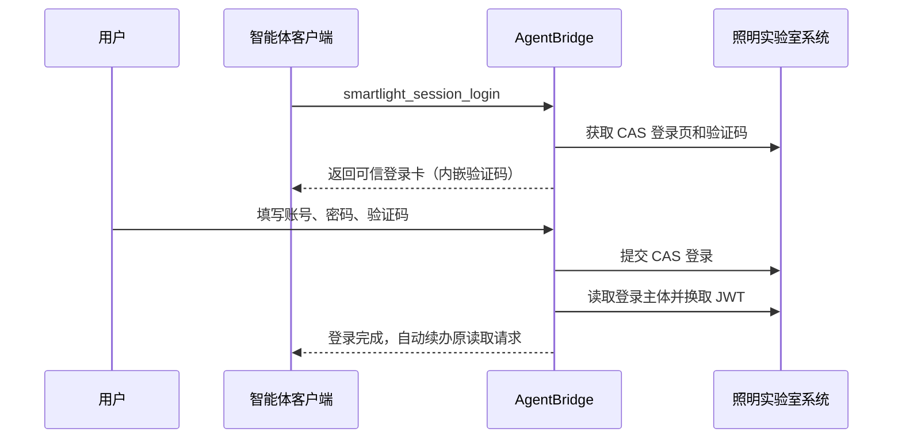

# 照明实验室测试系统适配说明

## 一、当前范围

目标系统：`http://123.232.113.241:4101/smartlight`。

当前注册二十六项读取能力，其中二十四项是正式能力、两项是旧“漏电”语义的兼容入口；另有
三组 RTU 受控写能力。Smartlight 能力目前只
面向 AgentBridge 第一用户 `guomao` 配置；第二用户及其他客户端身份不会因为代码部署
而自动获得权限，写权限还必须单独授予。

已发布能力：

| MCP 工具 | 业务含义 | AgentBridge capability |
| --- | --- | --- |
| `smartlight_system_overview` | 控制柜、可检索灯杆与地图明细灯杆概览 | `smartlight.system.overview` |
| `smartlight_lamppost_list` | 按关键词分页查询灯杆 | `smartlight.lamppost.list` |
| `smartlight_runtime_overview` | 汇总 RTU、单灯控制器和灯具当前运行快照 | `smartlight.runtime.overview` |
| `smartlight_rtu_status_list` | 按在线、离线、停电、禁用等状态查询 RTU | `smartlight.rtu.status.list` |
| `smartlight_lamp_status_list` | 查询单灯控制器在线状态、灯具开关和实时电气数据 | `smartlight.lamp.status.list` |
| `smartlight_alarm_list` | 按发生时间或最近活动时间全局倒序查询 RTU 告警和当前系统快照 | `smartlight.alarm.list` |
| `smartlight_alarm_remark_get` | 精确读取一条 RTU 告警的当前备注 | `smartlight.alarm.remark.get` |
| `smartlight_lamp_alarm_list` | 按时间、类型、状态和位置查询单灯告警 | `smartlight.lamp.alarm.list` |
| `smartlight_lamp_alarm_analysis` | 有界分析单灯告警趋势和集中位置 | `smartlight.lamp.alarm.analysis` |
| `smartlight_rtu_survey_records` | 查询指定 RTU 的电压、电流、温湿度和漏电电流遥测 | `smartlight.rtu.survey.records` |
| `smartlight_energy_record_list` | 查询有界日期内 RTU 按日用电显示值 | `smartlight.energy_record.list` |
| `smartlight_energy_analysis` | 分析 RTU 用电趋势和设备排行 | `smartlight.energy.analysis` |
| `smartlight_lamp_survey_records` | 查询灯杆和单灯控制器历史遥测 | `smartlight.lamp.survey.records` |
| `smartlight_rtu_leakage_alarm_list` | 查询真实 RTU 支路漏电报警 | `smartlight.rtu.leakage_alarm.list` |
| `smartlight_rtu_leakage_analysis` | 分析 RTU 支路漏电趋势和集中位置 | `smartlight.rtu.leakage_alarm.analysis` |
| `smartlight_off_hours_current_list` | 查询关灯时段电流记录 | `smartlight.rtu.off_hours_current.list` |
| `smartlight_inspection_log_list` | 查询巡检日志页面的巡检组统计 | `smartlight.inspection_log.list` |
| `smartlight_maintenance_record_list` | 查询 RTU 和灯杆检修记录 | `smartlight.maintenance_record.list` |
| `smartlight_inspection_task_list` | 按任务、计划和状态查询巡检组、进度及设备数 | `smartlight.inspection_task.list` |
| `smartlight_leakage_summary` | 兼容旧入口；实际返回单灯告警，不再用于自然语言“漏电” | `smartlight.leakage.summary` |
| `smartlight_asset_search` | 统一查询控制柜、RTU 和灯杆 | `smartlight.asset.search` |
| `smartlight_asset_detail` | 读取设施详情；RTU 同时返回继电器和回路 | `smartlight.asset.detail` |
| `smartlight_alarm_analysis` | 有界分析 RTU 告警趋势和集中设备 | `smartlight.alarm.analysis` |
| `smartlight_inspection_task_detail` | 查询巡检每日进度和实际打卡记录 | `smartlight.inspection_task.detail` |
| `smartlight_leakage_analysis` | 兼容旧入口；实际分析单灯告警 | `smartlight.leakage.analysis` |
| `smartlight_report_export` | 导出有界 CSV 报告 | `smartlight.report.export` |
| `smartlight_alarm_remark_update_prepare` | 为精确 RTU 告警填写、授权并修改备注 | `smartlight.alarm.remark.update.prepare` |
| `smartlight_alarm_work_area_submit_prepare` | 核对精确 RTU 告警并授权提交所属工区 | `smartlight.alarm.work_area.submit.prepare` |
| `smartlight_alarm_work_area_revoke_prepare` | 核对已提交 RTU 告警并授权撤回工区提交 | `smartlight.alarm.work_area.revoke.prepare` |
| `smartlight_rtu_alarm_dispose_prepare` | 核对精确 RTU 告警并强制授权标记已处置 | `smartlight.alarm.dispose.prepare` |
| `smartlight_session_status` | 检查当前用户登录会话 | - |
| `smartlight_session_login` | 发起可信登录卡 | - |

真正执行修改的 `smartlight.alarm.remark.update`、`smartlight.alarm.work_area.submit`、
`smartlight.alarm.work_area.revoke` 和 `smartlight.alarm.dispose` 是内部 commit 能力，
不进入智能体可自主选择的工具目录。当前不开放开关灯、远程控制、参数配置、巡检
打卡、删除或其他业务数据修改。RTU 告警处置没有发现恢复接口，因此单独划为不可逆
权限，必须在授权卡明确确认；代码上线不代表现有 Token 已获得该权限。

已发布读取二期工具的详细契约、接口证据和验收标准见
[照明读取二期能力包](读取能力二期方案.md)。
运行态、单灯告警语义修订和 RTU 巡测能力见
[照明读取三期开发方案](读取能力三期开发方案.md)。
能耗、单灯巡测、真实 RTU 支路漏电和运维记录的第四期实现、页面证据及范围调整见
[照明读取四期开发方案](读取能力四期开发方案.md)。第四期按真实接口落地八项工具；设备替换页
被证实为带“开始执行”的写操作，检修详情也没有稳定传递记录 ID，因此没有为凑数量注册
`equipment_history` 或统一详情工具。
首项写能力的风险矩阵、可信交互和恢复方法见
[照明系统写能力一期](写入能力一期方案.md)。
RTU 告警流转与处置的实现状态，以及单灯告警处理、巡检审核分波计划见
[照明受控写二期设计](受控写入二期设计.md)。
面向最终用户的全量读取核实步骤见
[照明系统整体读取能力人工验收方案](../../验收记录/照明实验室系统/照明系统整体读取能力人工验收方案-2026-08-20.md)。

### 读取口径

- 概览中的 `lampPostTotal` 与灯杆列表使用同一“可检索灯杆”口径；原地图明细接口的
  数量保留在 `lampPostCounts.mapDetail`，避免把两个页面的 131 和 116 误认为同一
  指标。
- RTU 告警的 `summary` 是查询时刻的系统看板快照，不是当前分页的统计结果。
  `occurredAt` 是首次发生时间，`lastActivityAt` 是最近活动时间。用户只说“最近/最新
  告警”或“最近/最新一条”时固定使用 `sort_by=occurred_at`，目标系统通过 `dateType=0`
  在分页前全局倒序；只有明确要求“最近活动/变化/更新/处理”时才使用
  `sort_by=last_activity`，通过 `dateType=1` 全局倒序。OpenClaw 宿主会根据本轮用户原话
  对模型参数做窄范围校正，适配器同时校验返回页的时间单调性，不再下载全量告警后
  本地排序。
- RTU 告警状态统一按目标系统枚举解释：`0=当前告警`、`1=非当前告警`、
  `2=已解除报警`、`3=已处置`；未知状态保留原始代码，不再输出裸数字或推测含义。
- 第一页返回 `latestGroup`。如果最新时间有多条告警，候选按另一时间字段倒序、告警 ID
  升序稳定排列；只读回答可以完整列出或按该规则选一条，任何写操作仍必须根据设备、
  类型等业务字段消歧。小分页最多额外读取前 20 条用于识别同一最新时刻的并列项。
- 单灯告警查询支持 `last_days`，AgentBridge 按 `Asia/Shanghai` 在服务端计算闭区间，
  智能体无需先调用通用时间工具。正式结果固定返回 `alarmSource=single_lamp`；旧
  `smartlight_leakage_*` 入口只维持兼容并返回弃用信息。
- 真正的支路漏电优先使用 `smartlight_rtu_leakage_alarm_list/analysis`，它们固定读取
  `RTU支路漏电报警记录`页面的 `htch047` 数据源。单灯告警中偶然出现“漏电”字样时，
  只能陈述原始告警，不能把整个结果集称为漏电记录。
- 用电记录是页面按 RTU 展开的日值矩阵。目标响应没有明确单位时，工具保留原始值并返回
  警告，不猜测为千瓦时；分析只汇总下游直接显示的日值，不通过累计读数差分造数。
- 单灯巡测是设备遥测历史，与 RTU 巡测、人员巡检任务和巡检日志分别建模。默认最近
  24 小时，最长 7 天。
- 关灯时段电流只能说明目标页面存在相应电流记录。当前策略开关灯时间是查询时快照，
  不用于解释跨日历史；没有页面阈值时不推断漏电、偷电或设备故障。
- 巡检日志接口实际返回巡检组的应巡、实巡、正常和异常统计，不返回逐人、逐设备事件。
  检修记录返回设备、时间、人员和道路；详情请求只携带设备类型和设备 ID，不携带稳定的
  检修记录 ID，因此本期不开放统一详情。
- 静态概览、资产目录和运行总览是三个不同口径。运行总览与状态列表均返回观察时间和
  数据范围，不用资产登记总数推导设备在线数。
- 巡检任务状态码 `1` 表示待执行，`2` 表示执行中。返回巡检组、任务开始日、截止日、
  下游系统原始进度、已确认设备数、灯杆数和 RTU 数；目标接口没有人员字段时不会把
  巡检组冒充为个人负责人。系统进度与三类设备计数是不同口径，智能体不得将
  `confirmedDeviceCount / (lampPostCount + rtuCount)` 表述为完成数/总数或自行推导
  完成率。

## 二、登录路线

该系统是 CAS 登录，登录页包含账号、密码和图片验证码。它不需要滑块、短信或远程
桌面，因此不使用语雀式 noVNC 可信浏览器。



验证码图片由 AgentBridge 从目标系统读取后以内嵌 `data:` 图片展示。目标系统 URL、
Cookie、JWT、密码摘要和隐藏登录字段不会进入模型上下文。验证码对应的 CAS Cookie
和隐藏字段保存在加密会话状态中，提交时恢复。

## 三、会话与身份

- `userSubject` 代表 AgentBridge 用户，不等同于目标系统账号。
- 当前测试账号为 `yanshi`，系统显示主体为 `无为`。
- 第一用户的 Smartlight 主体绑定应为 `smartlight=无为`。
- 登录成功时实际主体必须与绑定主体一致，否则会话进入隔离状态。
- CAS Cookie、JWT 和刷新所需状态按 `userSubject + systemId` 隔离并加密保存。
- 普通读取和显式状态检查使用刷新令牌续签 JWT；后台保活则优先访问 CAS 主体接口，
  再重新签发包含访问令牌和刷新令牌的完整令牌组。这样既维持 CAS 母会话，也避免
  只续半小时访问令牌、十二小时刷新令牌却不轮换的问题。
- 后台 CAS 再签临时失败时会回退到刷新令牌，不会因为单次网络波动删除会话。成功
  取得的新 Cookie 和完整令牌组立即加密保存。
- 照明应用会话与 CAS 单点登录会话不是同一层。若业务主体接口已经提示未登录，但 CAS
  Cookie 仍有效，保活会先重新进入照明应用，让 CAS 静默签发新的应用会话，再读取主体
  并换取完整 JWT；只有跳回 CAS 登录页或刷新令牌与 CAS 都明确失效时才要求用户登录。
- 适配器同时检查刷新令牌 JWT 的 `exp` 和照明系统业务返回码。刷新接口以 HTTP 200
  返回 `resp_code=1009`、提示刷新令牌失效时，按明确过期处理；CAS 也已退出时将会话
  标记为 `expired`，下一次登录命令直接生成可信验证码卡。
- JWT 刷新接口超时、5xx 或未知响应异常仍属于临时故障，只返回可重试失败并保留
  加密会话，不再错误标记为“等待用户操作”，也不会索要密码。
- AgentBridge 的会话保活租约表示后台愿意持续续签的时间窗口，并不覆盖下游系统主动
  注销或明确撤销凭据的情况。登录失效时返回可信登录卡，登录后自动继续原查询。
- 会话状态转换和延期检查写入独立历史事件，包括来源、前后状态、时间和脱敏错误原因。
  用户重新登录后当前错误会清空，但之前导致照明会话失效的刷新、CAS 或网络诊断不会
  被覆盖，可在管理控制台“系统会话 → 历史”中查看。

### 保活租约的准确含义

当前保活间隔为 10 分钟，用户活动租约为 7 天。7 天不是目标系统登录的保证期限，也不是
AgentBridge 强制注销时间，而是中心端允许持续代用户续签下游登录态的窗口：

1. 用户真实调用照明能力或主动检查自己的会话时，刷新最近活动时间；
2. 租约内的活动会话进入后台保活；
3. 超过 7 天未使用时停止后台保活，管理端显示“上次确认有效 / 未保活（超期）”；
4. 用户再次使用时先实时校验。可用则恢复活动和保活，不可用则生成登录卡。

管理端实时检查不刷新用户活动时间，避免运维巡检把长期闲置会话变成永久登录。

## 四、网络安全边界

目标系统当前只提供 HTTP。AgentBridge 自身的 MCP、管理端、Workspace 和可信卡仍
使用内网 IP + HTTPS + 内部 CA；只有 AgentBridge 到照明系统这一段是明文 HTTP。

运行时必须同时配置：

```text
--smartlight-base-url http://123.232.113.241:4101/smartlight
--smartlight-allow-insecure-http
```

没有显式开关时，适配器拒绝启动 HTTP 下游。该开关不改变其他系统的 TLS、会话或
刷新机制。生产加固时应优先让目标系统启用 HTTPS，之后移除该开关。

## 五、验收标准

1. 只有明确开通的第一用户 Token 包含 `smartlight:read`；各项写入还必须分别包含
   `smartlight:write:alarm_remark`、`smartlight:write:alarm_work_area_submit`、
   `smartlight:write:alarm_work_area_revoke` 或 `smartlight:write:alarm_disposition`。
2. 第二用户的工具目录不出现 Smartlight 工具。
3. 未登录读取时生成含验证码的可信登录卡，登录后自动续办原查询。
4. 登录主体显示为 `无为`，并与已验证主体绑定一致。
5. 二十四项正式读取能力和两个兼容入口返回结构化、分页或有界的数据，不泄露 Cookie、
   JWT 或内部密码摘要；智能体不再主动选择两个旧兼容入口。
6. 告警备注必须经过字段卡和授权卡；授权后若原备注变化则停止覆盖，保存后必须权威
   回读，新值不匹配时报告结果未知且不自动重试。
7. 测试修改后可通过同一可信流程写回原备注；智能体目录不出现内部 commit 或任何
   设备控制能力。
8. 工区提交和撤回不生成空白字段卡，直接核对授权；提交前冻结 RTU、状态、等级、工区
   与提交状态，提交后回读 `isSubmitWorkArea`。
9. 告警处置授权卡明确显示不可逆，只有状态 `0` 或 `1` 可进入授权；提交后必须回读
   `conductStatue=3`，结果未知时不得自动重试。
